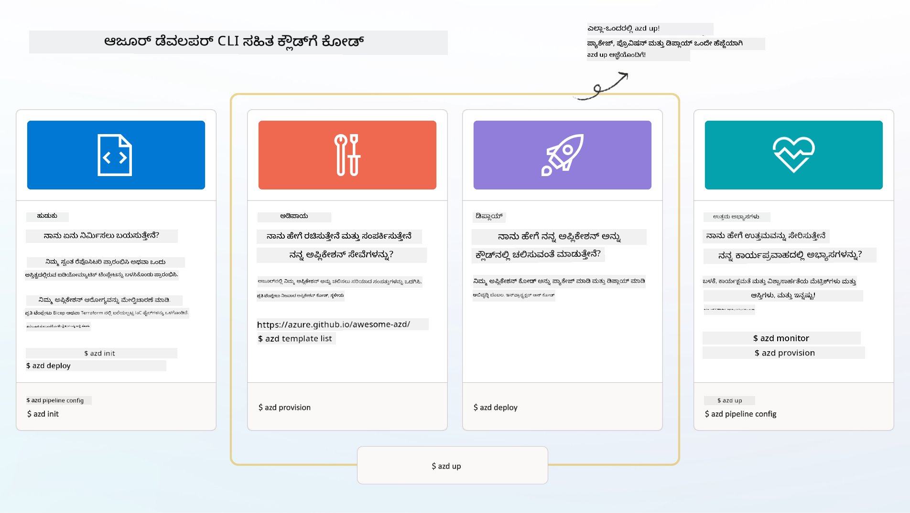

<!--
CO_OP_TRANSLATOR_METADATA:
{
  "original_hash": "06d6207eff634aefcaa41739490a5324",
  "translation_date": "2025-11-24T22:22:43+00:00",
  "source_file": "workshop/docs/instructions/1-Select-AI-Template.md",
  "language_code": "kn"
}
-->
# 1. ಟೆಂಪ್ಲೇಟನ್ನು ಆಯ್ಕೆಮಾಡಿ

!!! tip "ಈ ಘಟಕದ ಅಂತ್ಯದ ವೇಳೆಗೆ ನೀವು ಮಾಡಬಲ್ಲಿರಿ"

    - [ ] AZD ಟೆಂಪ್ಲೇಟುಗಳು ಏನೆಂದು ವಿವರಿಸಿ
    - [ ] AIಗಾಗಿ AZD ಟೆಂಪ್ಲೇಟುಗಳನ್ನು ಹುಡುಕಿ ಮತ್ತು ಬಳಸಿರಿ
    - [ ] AI ಏಜೆಂಟ್ಸ್ ಟೆಂಪ್ಲೇಟಿನಿಂದ ಪ್ರಾರಂಭಿಸಿ
    - [ ] **ಲ್ಯಾಬ್ 1:** GitHub Codespaces ಬಳಸಿ AZD ಕ್ವಿಕ್‌ಸ್ಟಾರ್ಟ್

---

## 1. ನಿರ್ಮಾಣದ ಉಪಮಾನ

ಆಧುನಿಕ ಎಂಟರ್‌ಪ್ರೈಸ್-ತಯಾರಾದ AI ಅಪ್ಲಿಕೇಶನ್ ಅನ್ನು _ಶೂನ್ಯದಿಂದ_ ನಿರ್ಮಿಸುವುದು ಭಯಾನಕವಾಗಬಹುದು. ಇದು ನಿಮ್ಮ ಹೊಸ ಮನೆವನ್ನು ಇಟ್ಟಿಗೆ ಇಟ್ಟಿಗೆ ನಿಮ್ಮದೇ ಆದ ರೀತಿಯಲ್ಲಿ ನಿರ್ಮಿಸುವಂತಿದೆ. ಹೌದು, ಇದು ಸಾಧ್ಯ! ಆದರೆ ನೀವು ಬಯಸಿದ ಅಂತಿಮ ಫಲಿತಾಂಶವನ್ನು ಪಡೆಯಲು ಇದು ಅತ್ಯಂತ ಪರಿಣಾಮಕಾರಿ ಮಾರ್ಗವಲ್ಲ!

ಬದಲಾಗಿ, ನಾವು ಸಾಮಾನ್ಯವಾಗಿ ಈಗಾಗಲೇ ಇರುವ _ಡಿಸೈನ್ ಬ್ಲೂಪ್ರಿಂಟ್_ ಅನ್ನು ಪ್ರಾರಂಭಿಸುತ್ತೇವೆ ಮತ್ತು ನಮ್ಮ ವೈಯಕ್ತಿಕ ಅಗತ್ಯಗಳಿಗೆ ಅದನ್ನು ಕಸ್ಟಮೈಸ್ ಮಾಡಲು ಆರ್ಕಿಟೆಕ್ಟ್ ಜೊತೆ ಕೆಲಸ ಮಾಡುತ್ತೇವೆ. ಬುದ್ಧಿವಂತ ಅಪ್ಲಿಕೇಶನ್‌ಗಳನ್ನು ನಿರ್ಮಿಸುವಾಗ ಇದು ತೆಗೆದುಕೊಳ್ಳಬೇಕಾದ ಸರಿಯಾದ ವಿಧಾನವಾಗಿದೆ. ಮೊದಲು, ನಿಮ್ಮ ಸಮಸ್ಯೆಯ ಸ್ಥಳಕ್ಕೆ ಹೊಂದುವ ಉತ್ತಮ ವಿನ್ಯಾಸ ಆರ್ಕಿಟೆಕ್ಚರ್ ಅನ್ನು ಹುಡುಕಿ. ನಂತರ, ನಿಮ್ಮ ನಿರ್ದಿಷ್ಟ ಸನ್ನಿವೇಶಕ್ಕಾಗಿ ಪರಿಹಾರವನ್ನು ಕಸ್ಟಮೈಸ್ ಮತ್ತು ಅಭಿವೃದ್ಧಿಪಡಿಸಲು ಪರಿಹಾರ ಆರ್ಕಿಟೆಕ್ಟ್ ಜೊತೆ ಕೆಲಸ ಮಾಡಿ.

ಆದರೆ ಈ ವಿನ್ಯಾಸ ಬ್ಲೂಪ್ರಿಂಟ್‌ಗಳನ್ನು ನಾವು ಎಲ್ಲಿಂದ ಹುಡುಕಬಹುದು? ಮತ್ತು ಈ ಬ್ಲೂಪ್ರಿಂಟ್‌ಗಳನ್ನು ಕಸ್ಟಮೈಸ್ ಮತ್ತು ಡಿಪ್ಲಾಯ್ ಮಾಡುವುದನ್ನು ನಮಗೆ ಕಲಿಸಲು ಸಿದ್ಧವಿರುವ ಆರ್ಕಿಟೆಕ್ಟ್ ಅನ್ನು ನಾವು ಹೇಗೆ ಹುಡುಕಬಹುದು? ಈ ಕಾರ್ಯಾಗಾರದಲ್ಲಿ, ನಾವು ಈ ಪ್ರಶ್ನೆಗಳಿಗೆ ಉತ್ತರವನ್ನು ನೀಡುತ್ತೇವೆ ಮತ್ತು ನಿಮಗೆ ಮೂರು ತಂತ್ರಜ್ಞಾನಗಳನ್ನು ಪರಿಚಯಿಸುತ್ತೇವೆ:

1. [Azure Developer CLI](https://aka.ms/azd) - ಸ್ಥಳೀಯ ಅಭಿವೃದ್ಧಿಯಿಂದ (ನಿರ್ಮಾಣ) ಕ್ಲೌಡ್ ಡಿಪ್ಲಾಯ್‌ಮೆಂಟ್ (ಶಿಪ್) ಗೆ ಡೆವಲಪರ್ ಪಥವನ್ನು ವೇಗಗೊಳಿಸುವ ಓಪನ್-ಸೋರ್ಸ್ ಸಾಧನ.
1. [Azure AI Foundry Templates](https://ai.azure.com/templates) - AI ಪರಿಹಾರ ಆರ್ಕಿಟೆಕ್ಚರ್ ಅನ್ನು ಡಿಪ್ಲಾಯ್ ಮಾಡಲು ಮಾದರಿ ಕೋಡ್, ಮೂಲಸೌಕರ್ಯ ಮತ್ತು ಸಂರಚನಾ ಫೈಲ್‌ಗಳನ್ನು ಹೊಂದಿರುವ ಮಾನದಂಡಿತ ಓಪನ್-ಸೋರ್ಸ್ ರೆಪೊಸಿಟರಿಗಳು.
1. [GitHub Copilot Agent Mode](https://code.visualstudio.com/docs/copilot/chat/chat-agent-mode) - Azure ಜ್ಞಾನದಲ್ಲಿ ನೆಲೆಯಾದ ಕೋಡಿಂಗ್ ಏಜೆಂಟ್, ಇದು ಕೋಡ್‌ಬೇಸ್ ಅನ್ನು ನಾವಿಗೇಟ್ ಮಾಡುವುದು ಮತ್ತು ಬದಲಾವಣೆಗಳನ್ನು ಮಾಡುವುದು - ನೈಸರ್ಗಿಕ ಭಾಷೆಯನ್ನು ಬಳಸುವ ಮೂಲಕ ಮಾರ್ಗದರ್ಶನ ನೀಡುತ್ತದೆ.

ಈ ಸಾಧನಗಳನ್ನು ಹೊಂದಿರುವ ನಾವು ಈಗ ಸರಿಯಾದ ಟೆಂಪ್ಲೇಟುಗಳನ್ನು _ಹುಡುಕಲು_, _ಡಿಪ್ಲಾಯ್_ ಮಾಡಲು ಮತ್ತು ನಮ್ಮ ನಿರ್ದಿಷ್ಟ ಸನ್ನಿವೇಶಗಳಿಗೆ _ಕಸ್ಟಮೈಸ್_ ಮಾಡಲು ಸಾಧ್ಯ. ಈವುಗಳು ಹೇಗೆ ಕೆಲಸ ಮಾಡುತ್ತವೆ ಎಂಬುದನ್ನು ತಿಳಿಯಲು ಮುಂದುವರಿಯೋಣ.

---

## 2. Azure Developer CLI

[Azure Developer CLI](https://learn.microsoft.com/en-us/azure/developer/azure-developer-cli/) (ಅಥವಾ `azd`) ಒಂದು ಓಪನ್-ಸೋರ್ಸ್ ಕಮಾಂಡ್‌ಲೈನ್ ಸಾಧನವಾಗಿದೆ, ಇದು ನಿಮ್ಮ ಕೋಡ್-ಟು-ಕ್ಲೌಡ್ ಪ್ರಯಾಣವನ್ನು ವೇಗಗೊಳಿಸಲು ಡೆವಲಪರ್ ಸ್ನೇಹಿ ಕಮಾಂಡ್‌ಗಳ ಸಮೂಹವನ್ನು ಒದಗಿಸುತ್ತದೆ, ಇದು ನಿಮ್ಮ IDE (ಅಭಿವೃದ್ಧಿ) ಮತ್ತು CI/CD (ಡೆವ್ಒಪ್ಸ್) ಪರಿಸರಗಳಲ್ಲಿ ನಿರಂತರವಾಗಿ ಕೆಲಸ ಮಾಡುತ್ತದೆ.

`azd` ಬಳಸಿ, ನಿಮ್ಮ ಡಿಪ್ಲಾಯ್‌ಮೆಂಟ್ ಪ್ರಯಾಣವು ಈ ರೀತಿಯಾಗಿ ಸರಳವಾಗಿರಬಹುದು:

- `azd init` - ಈಗಾಗಲೇ ಇರುವ AZD ಟೆಂಪ್ಲೇಟಿನಿಂದ ಹೊಸ AI ಪ್ರಾಜೆಕ್ಟ್ ಅನ್ನು ಪ್ರಾರಂಭಿಸುತ್ತದೆ.
- `azd up` - ಮೂಲಸೌಕರ್ಯವನ್ನು ಒದಗಿಸಿ ಮತ್ತು ನಿಮ್ಮ ಅಪ್ಲಿಕೇಶನ್ ಅನ್ನು ಒಂದು ಹಂತದಲ್ಲಿ ಡಿಪ್ಲಾಯ್ ಮಾಡುತ್ತದೆ.
- `azd monitor` - ಡಿಪ್ಲಾಯ್ ಮಾಡಿದ ಅಪ್ಲಿಕೇಶನ್‌ಗಾಗಿ ರಿಯಲ್-ಟೈಮ್ ಮಾನಿಟರಿಂಗ್ ಮತ್ತು ಡಯಾಗ್ನೊಸ್ಟಿಕ್ಸ್ ಪಡೆಯಿರಿ.
- `azd pipeline config` - Azure ಗೆ ಡಿಪ್ಲಾಯ್‌ಮೆಂಟ್ ಅನ್ನು ಸ್ವಯಂಚಾಲಿತಗೊಳಿಸಲು CI/CD ಪೈಪ್‌ಲೈನ್‌ಗಳನ್ನು ಸೆಟ್ ಅಪ್ ಮಾಡಿ.

**🎯 | ವ್ಯಾಯಾಮ**: <br/> ನಿಮ್ಮ GitHub Codespaces ಪರಿಸರದಲ್ಲಿ `azd` ಕಮಾಂಡ್‌ಲೈನ್ ಸಾಧನವನ್ನು ಅನ್ವೇಷಿಸಿ. ಈ ಕಮಾಂಡ್ ಅನ್ನು ಟೈಪ್ ಮಾಡುವ ಮೂಲಕ ಸಾಧನವು ಏನು ಮಾಡಬಲ್ಲದು ಎಂಬುದನ್ನು ಪ್ರಾರಂಭಿಸಿ:

```bash title="" linenums="0"
azd help
```


---

## 3. AZD ಟೆಂಪ್ಲೇಟು

`azd` ಇದನ್ನು ಸಾಧಿಸಲು, ಇದು ಮೂಲಸೌಕರ್ಯವನ್ನು ಹೇಗೆ ಒದಗಿಸಬೇಕು, ಜಾರಿಗೊಳಿಸಬೇಕಾದ ಸಂರಚನಾ ಸೆಟ್ಟಿಂಗ್‌ಗಳು ಮತ್ತು ಡಿಪ್ಲಾಯ್ ಮಾಡಬೇಕಾದ ಅಪ್ಲಿಕೇಶನ್ ಅನ್ನು ತಿಳಿದುಕೊಳ್ಳಬೇಕು. [AZD ಟೆಂಪ್ಲೇಟುಗಳು](https://learn.microsoft.com/en-us/azure/developer/azure-developer-cli/azd-templates?tabs=csharp) ಇಲ್ಲಿ ಪ್ರಸ್ತುತವಾಗುತ್ತವೆ.

AZD ಟೆಂಪ್ಲೇಟುಗಳು ಓಪನ್-ಸೋರ್ಸ್ ರೆಪೊಸಿಟರಿಗಳು, ಇವು ಮಾದರಿ ಕೋಡ್ ಅನ್ನು ಮೂಲಸೌಕರ್ಯ ಮತ್ತು ಸಂರಚನಾ ಫೈಲ್‌ಗಳೊಂದಿಗೆ ಸಂಯೋಜಿಸುತ್ತವೆ, ಪರಿಹಾರ ಆರ್ಕಿಟೆಕ್ಚರ್ ಅನ್ನು ಡಿಪ್ಲಾಯ್ ಮಾಡಲು ಅಗತ್ಯವಿರುವವು.
_ಮೂಲಸೌಕರ್ಯ-ಆಧಾರಿತ ಕೋಡ್_ (IaC) ವಿಧಾನವನ್ನು ಬಳಸುವ ಮೂಲಕ, ಅವು ಟೆಂಪ್ಲೇಟು ಸಂಪತ್ತು ವ್ಯಾಖ್ಯಾನಗಳು ಮತ್ತು ಸಂರಚನಾ ಸೆಟ್ಟಿಂಗ್‌ಗಳನ್ನು ಆವೃತ್ತಿ-ನಿಯಂತ್ರಿತಗೊಳಿಸಲು (ಅಪ್ಲಿಕೇಶನ್ ಮೂಲ ಕೋಡ್‌ನಂತೆ) ಅನುಮತಿಸುತ್ತವೆ - ಆ ಪ್ರಾಜೆಕ್ಟ್ ಬಳಕೆದಾರರ ನಡುವೆ ಪುನಃಬಳಕೆ ಮಾಡಬಹುದಾದ ಮತ್ತು ಸತತ ಕಾರ್ಯಪ್ರವೃತ್ತಿಗಳನ್ನು ಸೃಷ್ಟಿಸುತ್ತವೆ.

ನಿಮ್ಮ ಸನ್ನಿವೇಶಕ್ಕಾಗಿ AZD ಟೆಂಪ್ಲೇಟುಗಳನ್ನು ರಚಿಸುವಾಗ ಅಥವಾ ಪುನಃಬಳಸುವಾಗ ಈ ಪ್ರಶ್ನೆಗಳನ್ನು ಪರಿಗಣಿಸಿ:

1. ನೀವು ಏನು ನಿರ್ಮಿಸುತ್ತಿದ್ದೀರಿ? → ಆ ಸನ್ನಿವೇಶಕ್ಕಾಗಿ ಸ್ಟಾರ್ಟರ್ ಕೋಡ್ ಹೊಂದಿರುವ ಟೆಂಪ್ಲೇಟು ಇದೆಯೇ?
1. ನಿಮ್ಮ ಪರಿಹಾರವನ್ನು ಹೇಗೆ ಆರ್ಕಿಟೆಕ್ಟ್ ಮಾಡಲಾಗಿದೆ? → ಅಗತ್ಯವಿರುವ ಸಂಪತ್ತುಗಳನ್ನು ಹೊಂದಿರುವ ಟೆಂಪ್ಲೇಟು ಇದೆಯೇ?
1. ನಿಮ್ಮ ಪರಿಹಾರವನ್ನು ಹೇಗೆ ಡಿಪ್ಲಾಯ್ ಮಾಡಲಾಗಿದೆ? → `azd deploy` ಅನ್ನು ಪೂರ್ವ/ಪೋಸ್ಟ್-ಪ್ರೊಸೆಸಿಂಗ್ ಹೂಕ್ಸ್‌ಗಳೊಂದಿಗೆ ಯೋಚಿಸಿ!
1. ನೀವು ಅದನ್ನು ಇನ್ನಷ್ಟು ಹೇಗೆ ಆಪ್ಟಿಮೈಸ್ ಮಾಡಬಹುದು? → ಅಂತರ್ನಿರ್ಮಿತ ಮಾನಿಟರಿಂಗ್ ಮತ್ತು ಸ್ವಯಂಚಾಲಿತ ಪೈಪ್‌ಲೈನ್‌ಗಳನ್ನು ಯೋಚಿಸಿ!

**🎯 | ವ್ಯಾಯಾಮ**: <br/> 
[Awesome AZD](https://azure.github.io/awesome-azd/) ಗ್ಯಾಲರಿಯನ್ನು ಭೇಟಿ ಮಾಡಿ ಮತ್ತು ಪ್ರಸ್ತುತ ಲಭ್ಯವಿರುವ 250+ ಟೆಂಪ್ಲೇಟುಗಳನ್ನು ಅನ್ವೇಷಿಸಲು ಫಿಲ್ಟರ್‌ಗಳನ್ನು ಬಳಸಿ. ನಿಮ್ಮ ಸನ್ನಿವೇಶದ ಅಗತ್ಯಗಳಿಗೆ ಹೊಂದಿಕೊಳ್ಳುವ ಟೆಂಪ್ಲೇಟು ಇದೆಯೇ ಎಂದು ನೋಡಿ.



---

## 4. AI ಅಪ್ಲಿಕೇಶನ್ ಟೆಂಪ್ಲೇಟುಗಳು

---

<!-- CO-OP TRANSLATOR DISCLAIMER START -->
**ಅಸಮಾಕ್ಷ್ಯತೆ**:  
ಈ ದಸ್ತಾವೇಜು AI ಅನುವಾದ ಸೇವೆ [Co-op Translator](https://github.com/Azure/co-op-translator) ಬಳಸಿ ಅನುವಾದಿಸಲಾಗಿದೆ. ನಾವು ನಿಖರತೆಯಿಗಾಗಿ ಪ್ರಯತ್ನಿಸುತ್ತಿದ್ದರೂ, ದಯವಿಟ್ಟು ಗಮನಿಸಿ, ಸ್ವಯಂಚಾಲಿತ ಅನುವಾದಗಳಲ್ಲಿ ದೋಷಗಳು ಅಥವಾ ಅಸಮಾಕ್ಷ್ಯತೆಗಳು ಇರಬಹುದು. ಮೂಲ ಭಾಷೆಯಲ್ಲಿರುವ ಮೂಲ ದಸ್ತಾವೇಜು ಪ್ರಾಮಾಣಿಕ ಮೂಲವೆಂದು ಪರಿಗಣಿಸಬೇಕು. ಮಹತ್ವದ ಮಾಹಿತಿಗಾಗಿ, ವೃತ್ತಿಪರ ಮಾನವ ಅನುವಾದವನ್ನು ಶಿಫಾರಸು ಮಾಡಲಾಗುತ್ತದೆ. ಈ ಅನುವಾದವನ್ನು ಬಳಸುವ ಮೂಲಕ ಉಂಟಾಗುವ ಯಾವುದೇ ತಪ್ಪು ಅರ್ಥಗಳ ಅಥವಾ ತಪ್ಪು ವ್ಯಾಖ್ಯಾನಗಳ ಬಗ್ಗೆ ನಾವು ಹೊಣೆಗಾರರಲ್ಲ.
<!-- CO-OP TRANSLATOR DISCLAIMER END -->