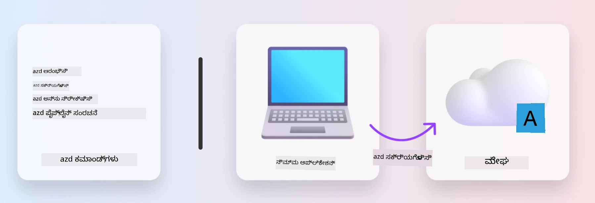
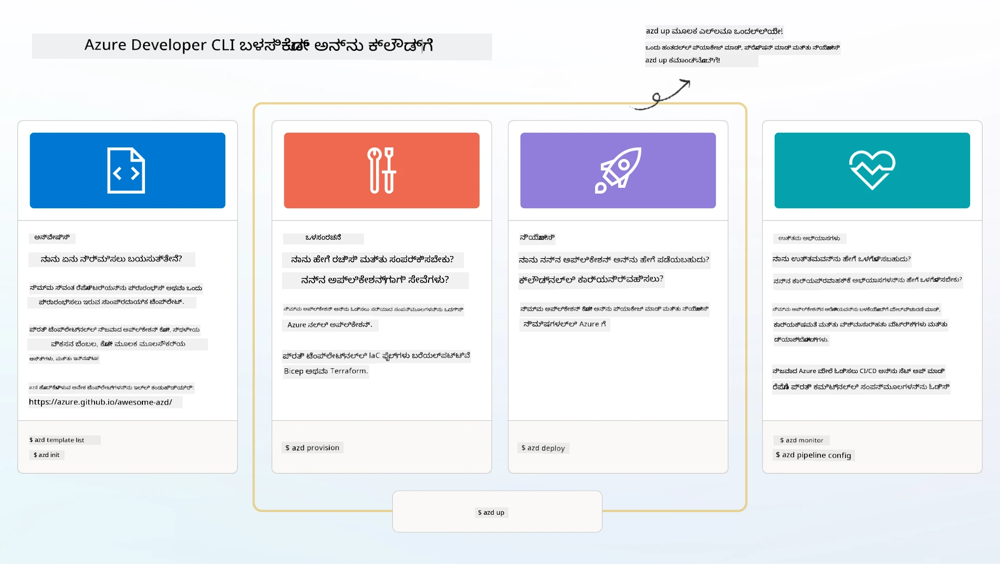

# 1. ಟೆಂಪ್ಲೇಟು ಆಯ್ಕೆಮಾಡಿ

!!! tip "ಈ ಘಟಕದ ಅಂತ್ಯಕ್ಕೆ ನೀವು ಈ ಕೆಳಗಿನವುಗಳನ್ನು ಮಾಡಲು ಸಾಧ್ಯವಾಗುತ್ತದೆ"

    - [ ] AZD ಟೆಂಪ್ಲೇಟುಗಳು ಏನೆಂದು ವಿವರಿಸಿ
    - [ ] AI සඳහා AZD ಟೆಂಪ್ಲೇಟುಗಳನ್ನು ಕಂಡುಹಿಡಿದು ಮತ್ತು ಬಳಸುವುದು
    - [ ] AI ಏಜೆಂಟ್ ಟೆಂಪ್ಲೇಟಿನಿಂದ ಪ್ರಾರಂಭಿಸುವುದು
    - [ ] **ಲ್ಯಾಬ್ 1:** GitHub Codespaces ಜೊತೆಗೆ AZD ತ್ವರಿತಪ್ರಾರಂಭ

---

## 1. ನಿರ್ಮಾಪಕನ ಉಪಮೆ

ಆಧುನಿಕ ನಿಗಮ-ತಯಾರಿಗಾಗುವ AI ಅಪ್ಲಿಕೇಶನ್ ಅನ್ನು _ಶೂನ್ಯದಿಂದ_ ನಿರ್ಮಿಸುವುದು ಭಾರೀ ಭೀತಿ ಮೂಡಿಸುವಂತಿದೆ. ಇದು ಸ್ವಲ್ಪ ನಿಮ್ಮ ಹೊಸ ಮನೆyiನನ್ನು ನೀವು ತಾನೇ, ಇಟ್ಟಿಗೆ ಇಟ್ಟಿಗೆಯಾಗಿ ಕಟ್ಟಿಕೊಂಡು ಹೋಗುತ್ತಿರುವಂತೆಯೇ. ಹೌದು, ಅದು ಸಾಧ್ಯವೇ! ಆದರೆ ಅದು ಬೇಕಾದ ಅಂತಿಮ ಫಲಿತಾಂಶವನ್ನು ಪಡೆಯಲು ಅತ್ಯಂತ ಪರಿಣಾಮಕಾರಿಯಾದ ಮಾರ್ಗವಲ್ಲ!

ಬದಲಾಗಿ, ನಾವು ಸಾಮಾನ್ಯವಾಗಿ ಈಗಾಗಲೇ ಇರುವ _ಡಿಸೈನ್ ಬ್ಲೂಪ್ರಿಂಟ್_ ನಿಂದ ಪ್ರಾರಂಭಿಸಿ, ಅದನ್ನು ನಮ್ಮ ವೈಯಕ್ತಿಕ ಅವಶ್ಯಕತೆಗಳಿಗೆ ಅನುಗುಣವಾಗಿ ಕಸ್ಟಮೈಸ್ ಮಾಡಲು ಆರ್ಕಿಟೆಕ್ಟ್ ಜೊತೆಗೆ ಕೆಲಸ ಮಾಡುತ್ತೇವೆ. ಮತ್ತು ಬುದ್ಧಿವಂತ ಅಪ್ಲಿಕೇಶನ್‌ಗಳನ್ನು ನಿರ್ಮಿಸುವಾಗ ಇದೇ ಕ್ರಮವನ್ನು ಅನುಸರಿಸಬೇಕು. ಮೊದಲು, ನಿಮ್ಮ ಸಮಸ್ಯಾ ಕ್ಷೇತ್ರಕ್ಕೆ ಹೊಂದಿಕೊಳ್ಳುವ ಉತ್ತಮ ವಿನ್ಯಾಸ ವಾಸ್ತುಶಿಲ್ಪವನ್ನು ಹುಡುಕಿ. ನಂತರ ನಿಮ್ಮ ನಿರ್ದಿಷ್ಟ ದೃಶ್ಯಾವಳಿಗೆ ಪರಿಹಾರವನ್ನು ಕಸ್ಟಮೈಸ್ ಮತ್ತು ಅಭಿವೃದ್ಧಿಪಡಿಸಲು ಸಲೂಶನ್ ಆರ್ಕಿಟೆಕ್ಟ್ ಜೊತೆಗೆ ಕೆಲಸ ಮಾಡಿ.

ಆದರೆ ನಾವು ಈ ರಚನಾ ಬ್ಲೂಪ್ರಿಂಟ್ಗಳನ್ನು ಎಲ್ಲಿಂದ ಕಂಡುಹಿಡಿಯಬಹುದು? ಮತ್ತು ನಿಮ್ಮ ಸ್ವಂತವಾಗಿ ಈ ಬ್ಲೂಪ್ರಿಂಟ್‌ಗಳನ್ನು ಕಸ್ಟಮೈಸ್ ಮಾಡಿ ನಿಯೋಜಿಸುವುದನ್ನು ಕಲಿಸಲು ಇಚ್ಛಿಸುವ ಆರ್ಕಿಟೆಕ್ಟನ್ನು ನಾವು ಹೇಗೆ ಕಂಡುಹಿಡಿಯಬಹುದು? ಈ ವರ್ಕ್‌ಶಾಪ್‌ನಲ್ಲಿ, ನಾವು ಈ ಪ್ರಶ್ನೆಗಳಿಗೆ ಉತ್ತರಿಸುತ್ತೇವೆ ಮತ್ತು ನಿಮಗೆ ಮೂರು ತಂತ್ರಜ್ಞಾನಗಳನ್ನು ಪರಿಚಯಿಸುತ್ತೇವೆ:

1. [Azure Developer CLI](https://aka.ms/azd) - ಒಂದು ಮುಕ್ತಮೂಲ ಸಾಧನ, ಇದು ಸ್ಥಳೀಯ ಅಭಿವೃದ್ಧಿ (build) ರಿಂದ ಕ್ಲೌಡ್ ನಿಯೋಜನೆ (ship) ಗೆ ಡೆವಲಪರ್ ಮಾರ್ಗವನ್ನು ವೇಗಗೊಳಿಸುತ್ತದೆ.
1. [Microsoft Foundry Templates](https://ai.azure.com/templates) - AI ಪರಿಹಾರ ವಾಸ್ತುಶಿಲ್ಪವನ್ನು ನಿಯೋಜಿಸಲು ಅಗತ್ಯವಿರುವ ಮಾದರಿ ಕೋಡ್, ಮೂಲಸೌಕರ್ಯ ಮತ್ತು ಸಂರಚನಾ ಫೈಲ್‌ಗಳನ್ನು ಹೊಂದಿರುವ ಮಾನಕೃತ ಮುಕ್ತಮೂಲ ರೆಪೊಜಿಟೋರಿಗಳು.
1. [GitHub Copilot Agent Mode](https://code.visualstudio.com/docs/copilot/chat/chat-agent-mode) - ಆಜೂರ್ ಜ್ಞಾನದಲ್ಲಿ ನೆಲಿಸಿಕೊಂಡಿರುವ ಒಂದು ಕೋಡಿಂಗ್ ಏಜೆಂಟ್, ಇದು ನೈಸರ್ಗಿಕ ಭಾಷೆಯನ್ನು ಬಳಸಿ ಕೋಡ್‌ಬೇಸ್‌ನಲ್ಲಿ ನ್ಯಾವಿಗೇಟ್ ಮಾಡಿ ಬದಲಾವಣೆಗಳನ್ನು ಮಾಡಲು ಮಾರ್ಗದರ್ಶನ ನೀಡಬಹುದು.

ಈ ಉಪಕರಣಗಳನ್ನು ಹೊಂದಿರುವುದರಿಂದ, ನಾವು ಈಗ ಸರಿಯಾದ ಟೆಂಪ್ಲೇಟನ್ನು _ಹುಡುಕಿ_, ಅದು ಸರಿ ಕೆಲಸ ಮಾಡುವುದೆಂದು ಪರಿಶೀಲಿಸಲು ಅದನ್ನು _ನಿಯೋಜಿಸಿ_, ಮತ್ತು ನಮ್ಮ ನಿರ್ದಿಷ್ಟ ದೃಶ್ಯಾವಳಿಗೆ ಅನುಗುಣವಾಗಿ ಅದನ್ನು _ಅನುಕೂಲಗೊಳಿಸಬಹುದು_. ಬನ್ನಿ, ಇವು ಹೇಗೆ ಕೆಲಸ ಮಾಡುತ್ತವೆ ಎಂದು ತಿಳಿಯೋಣ.

---

## 2. Azure Developer CLI

The [Azure Developer CLI](https://learn.microsoft.com/en-us/azure/developer/azure-developer-cli/) (ಅಥವಾ `azd`) ಒಂದು ಮುಕ್ತಮೂಲ ಕಮಾಂಡ್‌ಲೈನ್ ಸಾಧನ, ಇದು ನಿಮ್ಮ ಕೋಡ್-ಟು-ಕ್ಲೌಡ್ ಪ್ರಯಾಣವನ್ನು ವೇಗಗೊಳಿಸಲು IDE (ಅಭಿವೃದ್ಧಿ) ಮತ್ತು CI/CD (ಡೆವ್ಓಪ್ಸ್) ಪರಿಸರಗಳಲ್ಲಿ ನಿತ್ಯವಾಗಿ ಕಾರ್ಯನಿರ್ವಹಿಸುವ ಡೆವಲಪರ್-ಸ್ನೇಹಿ ಕಮಾಂಡ್‌ಗಳ ಸೆಟ್ ಅನ್ನು ಒದಗಿಸುತ್ತದೆ.

`azd` ಬಳಸಿ, ನಿಮ್ಮ ನಿಯೋಜನೆ ಪ್ರಯಾಣವು ಹೀಗಿರಬಹುದು:

- `azd init` - υπάρ_existing AZD ಟೆಂಪ್ಲೇಟಿನಿಂದ ಹೊಸ AI ಪ್ರಾಜೆಕ್ಟ್ ಅನ್ನು ಪ್ರಾರಂಭಿಸುತ್ತದೆ.
- `azd up` - ಮೂಲಸೌಕರ್ಯವನ್ನು ಒದಗಿಸಿ ಮತ್ತು ನಿಮ್ಮ ಅಪ್ಲಿಕೇಶನ್ ಅನ್ನು ಒಂದೇ ಹೆಜ್ಜೆಯಲ್ಲಿ ನಿಯೋಜಿಸುತ್ತದೆ.
- `azd monitor` - ನಿಮ್ಮ ನಿಯೋಜಿಸಲಾದ ಅಪ್ಲಿಕೇಶನ್‌ಗಾಗಿ ರಿಯಲ್-ಟೈಮ್ ಮಾನಿಟರಿಂಗ್ ಮತ್ತು ಡೈಯಾಗ್ನೋಸ್ಟಿಕ್ಸ್ ಪಡೆಯಿರಿ.
- `azd pipeline config` - Azure ಗೆ ನಿಯೋಜನೆಯನ್ನು ಸ್ವಯಂಚಾಲಿತಗೊಳಿಸಲು CI/CD ಪೈಪ್‌ಲೈನ್‌ಗಳನ್ನು ಹೊಂದಿಸಿ.

**🎯 | ವ್ಯಾಯಾಮ**: <br/> Explore the `azd` commandline tool in your GitHub Codespaces environment now. Start by typing this command to see what the tool can do:

```bash title="" linenums="0"
azd help
```



---

## 3. AZD ಟೆಂಪ್ಲೇಟು

For `azd` to achieve this, it needs to know the infrastructure to provision, the configuration settings to enforce, and the application to deploy. This is where [AZD templates](https://learn.microsoft.com/en-us/azure/developer/azure-developer-cli/azd-templates?tabs=csharp) come in. 

AZD ಟೆಂಪ್ಲೇಟುಗಳು ಮಾದರಿ ಕೋಡ್ ಅನ್ನು ಅನ್ನು ಮೂಲسازی ಮತ್ತು ಸಂರಚನಾ ಫೈಲ್‌ಗಳೊಂದಿಗೆ ಸಂಯೋಜಿಸುವ ಮುಕ್ತಮೂಲ ರೆಪೊಜಿಟೋರಿಗಳಾಗಿವೆ, ಅವು AI ಪರಿಹಾರ ವಾಸ್ತುಶಿಲ್ಪವನ್ನು ನಿಯೋಜಿಸಲು ಅಗತ್ಯವಾಗುತ್ತದೆ.
By using an _Infrastructure-as-Code_ (IaC) approach, they allow template resource definitions and configuration settings to be version-controller (just like the app source code) - creating reusable and consistent workflows across users of that project.

When creating or reusing an AZD template for _your_ scenario, consider these questions:

1. What are you building? → ಆ ದೃಶ್ಯಾವಳಿಗೆ ಸ್ಟಾರ್ಟರ್ ಕೋಡ್ ಇರುವ ಟೆಂಪ್ಲೇಟು ಇದೆಯೇ?
1. How is your solution architected? → ಅಗತ್ಯ ಸಂಪನ್ಮೂಲಗಳಿರುವ ಟೆಂಪ್ಲೇಟು ಇದೆಯೇ?
1. How is your solution deployed? → ಪೂರ್ವ/ಪೋಸ್ಟ್ ಪ್ರೋಸೆಸಿಂಗ್ ಹುಕ್‌ಗಳೊಂದಿಗೆ `azd deploy` ಅನ್ನು ವಿಚಾರಿಸಿ!
1. How can you optimize it further? → ನಿರ್ಮಿತ ಮಾನಿಟರಿಂಗ್ ಮತ್ತು ಸ್ವಯಂಚಾಲಿತ ಪೈಪ್‌ಲೈನ್ಗಳನ್ನು ಪರಿಗಣಿಸಿ!

**🎯 | ವ್ಯಾಯಾಮ**: <br/> 
Visit the [Awesome AZD](https://azure.github.io/awesome-azd/) gallery and use the filters to explore the 250+ templates currently available. See if you can find on that aligns to _your_ scenario requirements.



---

## 4. AI ಅಪ್ಲಿಕೇಶನ್ ಟೆಂಪ್ಲೇಟುಗಳು

For AI-powered applications, Microsoft provides specialized templates featuring **Microsoft Foundry** and **Foundry Agents**. These templates accelerate your path to building intelligent, production-ready applications.

### Microsoft Foundry & Foundry Agents Templates

Select a template below to deploy. Each template is available on [Awesome AZD](https://azure.github.io/awesome-azd/) and can be initialized with a single command.

| ಟೆಂಪ್ಲೇಟು | ವಿವರಣೆ | ನಿಯೋಜನೆ ಕಮಾಂಡ್ |
|----------|-------------|----------------|
| **[RAG ಜೊತೆ AI ಚಾಟ್](https://azure.github.io/awesome-azd/?tags=ai&tags=rag)** | Microsoft Foundry ಬಳಸಿಕೊಂಡು Retrieval Augmented Generation ಮೂಲಕ ಚಾಟ್ ಅಪ್ಲಿಕೇಶನ್ | `azd init -t azure-samples/azure-search-openai-demo` |
| **[Foundry Agent Service Starter](https://azure.github.io/awesome-azd/?tags=ai&tags=agents)** | ಸ್ವಯಂಚಾಲಿತ ಕಾರ್ಯ ನಿರ್ವಹಣೆಗೆ Foundry Agents ಬಳಸಿ AI ಏಜೆಂಟ್‌ಗಳನ್ನು ನಿರ್ಮಿಸಿ | `azd init -t azure-samples/foundry-agent-service-starter` |
| **[Multi-Agent Orchestration](https://azure.github.io/awesome-azd/?tags=ai&tags=agents)** | ಸಂಕೀರ್ಣ ಕಾರ್ಯವಿಧಾನಗಳಿಗೆ ಹಲವಾರು Foundry ಏಜೆಂಟ್‌ಗಳನ್ನು ಸಂಯೋಜಿಸಿ | `azd init -t azure-samples/multi-agent-orchestration` |
| **[AI Document Intelligence](https://azure.github.io/awesome-azd/?tags=ai&tags=document)** | Microsoft Foundry ಮಾದರಿಗಳೊಂದಿಗೆ ದಾಖಲೆಗಳನ್ನು ಹೊರತೆಗೆಯಿರಿ ಮತ್ತು ವಿಶ್ಲೇಷಿಸಿ | `azd init -t azure-samples/ai-document-processing` |
| **[Conversational AI Bot](https://azure.github.io/awesome-azd/?tags=ai&tags=bot)** | Microsoft Foundry ಏಕೀಕರಣದೊಂದಿಗೆ ಬುದ್ಧಿವಂತ ಚಾಟ್‌ಬಾಟ್‌ಗಳನ್ನು ನಿರ್ಮಿಸಿ | `azd init -t azure-samples/ai-chat-protocol` |
| **[AI Image Generation](https://azure.github.io/awesome-azd/?tags=ai&tags=dalle)** | Microsoft Foundry ಮೂಲಕ DALL-E ಬಳಸಿ ಚಿತ್ರಗಳನ್ನು ರಚಿಸಿ | `azd init -t azure-samples/ai-image-generation` |
| **[Semantic Kernel Agent](https://azure.github.io/awesome-azd/?tags=ai&tags=semantic-kernel)** | Foundry Agents ಜೊತೆಗೆ Semantic Kernel ಬಳಸಿ AI ಏಜೆಂಟ್‌ಗಳು | `azd init -t azure-samples/semantic-kernel-agent` |
| **[AutoGen Multi-Agent](https://azure.github.io/awesome-azd/?tags=ai&tags=autogen)** | AutoGen ಫ್ರೇಮ್‌ವರ್ಕ್ ಬಳಸಿಕೊಂಡು ಬಹು-ಏಜೆಂಟ್ ವ್ಯವಸ್ಥೆಗಳು | `azd init -t azure-samples/autogen-multi-agent` |

### ತ್ವರಿತ ಪ್ರಾರಂಭ

1. **ಟೆಂಪ್ಲೇಟುಗಳನ್ನು ಬ್ರೌಸ್ ಮಾಡಿ**: Visit [https://azure.github.io/awesome-azd/](https://azure.github.io/awesome-azd/) ಮತ್ತು `AI`, `Agents`, ಅಥವಾ `Microsoft Foundry` ಮೂಲಕ ಫಿಲ್ಟರ್ ಮಾಡಿ
2. **ನಿಮ್ಮ ಟೆಂಪ್ಲೇಟನ್ನು ಆಯ್ಕೆಮಾಡಿ**: ನಿಮ್ಮ ಬಳಕೆದ ಪ್ರಕರಣಕ್ಕೆ ಹೊಂದುವ ಒಂದು ಆಯ್ಕೆಮಾಡಿ
3. **ಆರಂಭಿಸಿ**: ನಿಮ್ಮ ಆಯ್ಕೆದ ಟೆಂಪ್ಲೇಟಿಗಾಗಿ `azd init` ಕಮಾಂಡ್ ಅನ್ನು ಚಲಾಯಿಸಿ
4. **ನಿಯೋಜಿಸಿ**: ಪ್ರೊವಿಷನ್ ಮಾಡಿ ಮತ್ತು ನಿಯೋಜಿಸಲು `azd up` ಅನ್ನು ಚಲಾಯಿಸಿ

**🎯 | ವ್ಯಾಯಾಮ**: <br/>
Select one of the templates above based on your scenario:

- **ಚಾಟ್‌ಬಾಟ್ ನಿರ್ಮಿಸುತ್ತಿದ್ದೀರಾ?** → **RAG ಜೊತೆ AI ಚಾಟ್** ಅಥವಾ **ಸಂವಾದಾತ್ಮಕ AI ಬಾಟ್** ನಿಂದ ಪ್ರಾರಂಭಿಸಿ
- **ಸ್ವಯಂಚಾಲಿತ ಏಜೆಂಟ್‌ಗಳ ಅಗತ್ಯವಿದೆಯೇ?** → **Foundry Agent Service Starter** ಅಥವಾ **Multi-Agent Orchestration** ಅನ್ನು ಪ್ರಯತ್ನಿಸಿ
- **ದಾಖಲೆಗಳನ್ನು ಸಂಸ್ಕರಿಸುತ್ತಿದ್ದೀರಾ?** → **AI Document Intelligence** ಬಳಸಿ
- **AI ಕೋಡಿಂಗ್ ಸಹಾಯ ಬೇಕೆ?** → **Semantic Kernel Agent** ಅಥವಾ **AutoGen Multi-Agent** ಅನ್ನು ಪರಿಶೀಲಿಸಿ

```bash title="Example: Deploy the AI Chat with RAG template" linenums="0"
azd init -t azure-samples/azure-search-openai-demo
azd up
```

!!! info "ಹೆಚ್ಚಿನ ಟೆಂಪ್ಲೇಟುಗಳನ್ನು ಅನ್ವೇಷಿಸಿ"
    The [Awesome AZD Gallery](https://azure.github.io/awesome-azd/) contains 250+ templates. Use the filters to find templates matching your specific requirements for language, framework, and Azure services.

---

<!-- CO-OP TRANSLATOR DISCLAIMER START -->
ಜವಾಬ್ದಾರಿ ನಿರಾಕರಣೆ:

ಈ ದಾಖಲೆವನ್ನು AI ಅನುವಾದ ಸೇವೆ Co-op Translator (https://github.com/Azure/co-op-translator) ಬಳಸಿ ಅನುವಾದಿಸಲಾಗಿದೆ. ನಾವು ನಿಖರತೆಯನ್ನು ಸಾಧಿಸಲು ಪ್ರಯತ್ನಿಸಿದರೂ, ಸ್ವಯಂಚಾಲಿತ ಅನುವಾದಗಳಲ್ಲಿ ದೋಷಗಳು ಅಥವಾ ಸರಿಯಾದದ್ದಲ್ಲದ ಅಂಶಗಳಿರಬಲ್ಲವೊಂದು ದಯವಿಟ್ಟು ಗಮನದಲ್ಲಿರಿಸಿಕೊಳ್ಳಿ. ಮೂಲ ಭಾಷೆಯಲ್ಲಿರುವ ಮೂಲ ದಾಖಲೆಅನ್ನು ಅಧಿಕಾರಪೂರ್ಣ ಮೂಲವೆಂದು ಪರಿಗಣಿಸಬೇಕು. ಗಂಭೀರ ಅಥವಾ ಅತ್ಯಾವಶ್ಯಕ ಮಾಹಿತಿಗಾಗಿ ವೃತ್ತಿಪರ ಮಾನವ ಅನುವಾದವನ್ನು ಶಿಫಾರಸು ಮಾಡಲಾಗುತ್ತದೆ. ಈ ಅನುವಾದವನ್ನು ಬಳಸುವುದರಿಂದ ಉಂಟಾಗುವ ಯಾವುದೇ ತಪ್ಪು ಅರ್ಥಮಾಡಿಕೊಳ್ಳುವಿಕೆಗಳು ಅಥವಾ ತಪ್ಪು ವಿವರಣೆಗಳಿಗಾಗಿ ನಾವು ಹೊಣೆಗಾರರಲ್ಲ.
<!-- CO-OP TRANSLATOR DISCLAIMER END -->