# 2. ಟೆಂಪ್ಲೇಟನ್ನು ಮಾನ್ಯೀಕರಿಸಿ

> ಮಾರ್ಚ್ 2026 ರಲ್ಲಿ `azd 1.23.12` ವಿರುದ್ಧ ಮಾನ್ಯೀಕರಿಸಲಾಗಿದೆ.

!!! tip "ಈ MODULE ನ ಕೊನೆಯಲ್ಲಿ ನೀವು ಸಾಧ್ಯವಾಗುವುದು"

    - [ ] AI ಪರಿಹಾರ ವಾಸ್ತುಶಿಲ್ಪವನ್ನು ವಿಶ್ಲೇಷಿಸಿ
    - [ ] AZD ನಿಯೋಜನೆ ವರ್ಕ್‌ಫ್ಲೋವನ್ನು ಅರ್ಥಮಾಡಿಕೊಳ್ಳಿ
    - [ ] AZD ಬಳಕೆಯ ಕುರಿತು ಸಹಾಯ ಪಡೆಯಲು GitHub Copilot ಬಳಸಿರಿ
    - [ ] **ಪ್ರಯೋಗಶಾಲೆ 2:** AI ಏಜೆಂಟ್ಸ್ ಟೆಂಪ್ಲೇಟ್ ನಿಯೋಜಿಸಿ ಮತ್ತು ಮಾನ್ಯೀಕರಿಸಿ

---


## 1. ಪರಿಚಯ

[Azure Developer CLI](https://learn.microsoft.com/en-us/azure/developer/azure-developer-cli/) ಅಥವಾ `azd` ಎನ್ನುವುದು ಖಜಾನೆಯಿಂದ ಆಸುಪಾಸಿನ ಕೆಲಸಗಳನ್ನು ಸುಗಮಗೊಳಿಸುವ ಗ್ರಾಹಕ ಆಧಾರಿತ open-source ಟೂಲ್ ಆಗಿದ್ದು, ಅದನ್ನು ಬಳಸಿ ಆಜೂರ್‌ಗೆ ಅಪ್ಲಿಕೇಶನ್ಗಳನ್ನು ಬಹಿರಂಗಪಡಿಸುವ ಮತ್ತು ನಿಯೋಜಿಸುವ ಕಾರ್ಯವನ್ನು ಸುಲಭಗೊಳಿಸುತ್ತದೆ.

[AZD ಟೆಂಪ್ಲೇಟುಗಳು](https://learn.microsoft.com/azure/developer/azure-developer-cli/azd-templates) ಮಾದರಿ ಅಪ್ಲಿಕೇಶನ್ ಕೋಡ್, _ಅಧಿಸಂರಚನೆ-ಆಸ್-ಕೋಡ್_ ಆಸ್ತಿಗಳು ಮತ್ತು `azd` ಸಂರಚನಾ ಕಡತಗಳನ್ನು ಒಳಗೊಂಡಿರುತ್ತದೆ, ಏಕತೆಯಯುಕ್ತ ಪರಿಹಾರ ವಾಸ್ತುಶಿಲ್ಪಕ್ಕಾಗಿ. ಅಳವಡಿಕೆಗೆ `azd provision` ಕಮಾಂಡ್ ಬಳಸಿ ಸರಳವಾಗುತ್ತದೆ - ಮತ್ತು `azd up` ಬಳಿಸುವ ಮೂಲಕ ನೀರವಧಿ **ಮತ್ತು** ನಿಮ್ಮ ಅಪ್ಲಿಕೇಶನ್ ಅನ್ನು ಒಂದೇ ಬಾರಿ ನಿಯೋಜಿಸಬಹುದು!

ಈ ಕಾರಣಕ್ಕೆ, ನಿಮ್ಮ ಅಪ್ಲಿಕೇಶನ್ ಮತ್ತು ಅಧಿಸಂರಚನೆ ಅವಶ್ಯಕತೆಗಳಿಗೆ ಸಮೀಪದ _AZD ಪ್ರಾರಂಭ ಟೆಂಪ್ಲೇಟು_ ಅನ್ನು ಹುಡುಕಿಕೊಳ್ಳಿ - ನಂತರ ನಿಮ್ಮ ಸಂದರ್ಭದ ಅಗತ್ಯಗಳಿಗೆ ಅನುಗುಣವಾಗಿ ಸಂಗ್ರಹಾಲಯವನ್ನು ಕಸ್ಟಮೈಸ್ ಮಾಡಿ.

ಆರಂಭಿಸುವ ಮೊದಲು, ನೀವು Azure Developer CLI ಅನ್ನು ಸ್ಥಾಪಿಸಿಕೊಂಡಿದ್ದೀರಾ ಎಂದು ಖಚಿತಪಡಿಸಿಕೊಳ್ಳೋಣ.

1. VS Code ಟರ್ಮಿನಲ್ ತೆರೆದು ಈ ಕಮಾಂಡ್ ಟೈಪ್ ಮಾಡಿ:

      ```bash title="" linenums="0"
      azd version
      ```

1. ನಿಮಗೆ ಹೀಗೊಂದು ಕಾಣಿಸಬೇಕು!

      ```bash title="" linenums="0"
      azd version 1.23.12 (commit <current-build>)
      ```

**ನೀವು ಈಗ azd ಬಳಸಿಕೊಂಡು ಟೆಂಪ್ಲೇಟನ್ನು ಆಯ್ಕೆಮಾಡಿ ನಿಯೋಜಿಸಲು ಸಿದ್ಧರಾಗಿದ್ದೀರಿ**

---

## 2. ಟೆಂಪ್ಲೇಟ್ ಆಯ್ಕೆ

Microsoft Foundry ವ್ಯೂಹವು [ಶಿಫಾರಸು ಮಾಡಲಾದ AZD ಟೆಂಪ್ಲೇಟುಗಳ ಒಟ್ಟು](https://learn.microsoft.com/en-us/azure/ai-foundry/how-to/develop/ai-template-get-started) ಅನ್ನು ಹೊಂದಿದ್ದು, ಜನಪ್ರಿಯ ಪರಿಹಾರ ಸಂದರ್ಭಗಳನ್ನು ಒಳಗೊಂಡಿದೆ, ಉದಾ: _ಬಹು-ಏಜೆಂಟ್ ವರ್ಕ್‌ಫ್ಲೋ ಸ್ವಯಂಕ್ರಿಯತೆ_ ಮತ್ತು _ಬಹು-ಮೋಡಲ್ ವಿಷಯ ಪ್ರಕ್ರಿಯೆ_. ನೀವು ಈ ಟೆಂಪ್ಲೇಟುಗಳನ್ನು Microsoft Foundry ಪೋರ್ಟಲ್‌ಗೆ ಭೇಟಿ ನೀಡುವುದು ಮೂಲಕ ಕಂಡುಹಿಡಿಯಬಹುದು.

1. [https://ai.azure.com/templates](https://ai.azure.com/templates) ಗೆ ಭೇಟಿ ನೀಡಿ
1. Microsoft Foundry ಪೋರ್ಟಲ್‌ಗೆ ಲಾಗಿನ್ ಆಗಿ - ಇದು ಹೀಗಿರಬಹುದು.

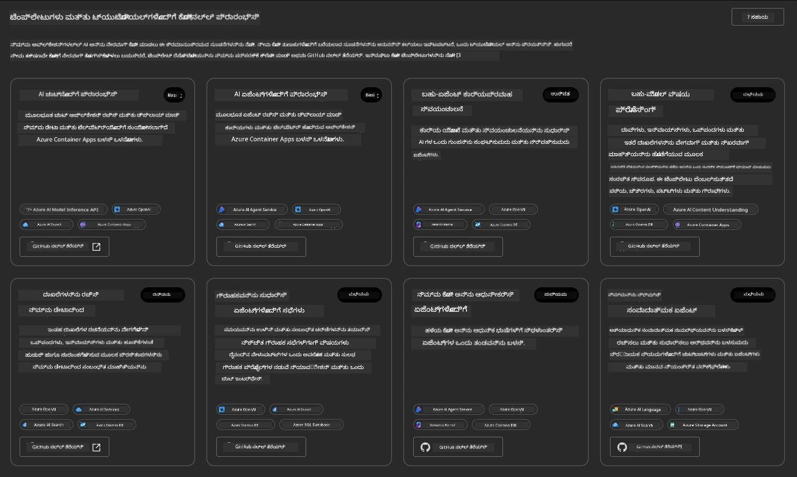


**ಮೂಲಭೂತ** ಆಯ್ಕೆಗಳು ನಿಮ್ಮ ಪ್ರಾರಂಭ 템್ಪ್ಲೇಟುಗಳು:

1. [ ] [AI ಚಾಟ್ ಜೊತೆ ಪ್ರಾರಂಭಿಸಿ](https://github.com/Azure-Samples/get-started-with-ai-chat) ಎಸ್ಪ鋧ೕ基本 ಚಾಟ್ ಅಪ್ಲಿಕೇಶನ್ ಅನ್ನು _ನಿಮ್ಮ ಡೇಟಾ_ ಜೊತೆಗೆ Azure Container Apps ಗೆ ನಿಯೋಜಿಸುತ್ತದೆ. ಇದನ್ನು ಮೂಲ AI ಚಾಟ್‌ಬೋಟ್ ಸಂದರ್ಭವನ್ನು ಅನ್ವೇಷಿಸಲು ಉಪಯೋಗಿಸಿ.
1. [X] [AI ಏಜೆಂಟ್ಸ್ ಜೊತೆ ಪ್ರಾರಂಭಿಸಿ](https://github.com/Azure-Samples/get-started-with-ai-agents) ಇದು ಸಾಮಾನ್ಯ AI ಏಜೆಂಟ್ (Foundry ಏಜೆಂಟ್ಗಳೊಂದಿಗೆ) ಅನ್ನು ನಿಯೋಜಿಸುತ್ತದೆ. ಏಜೆಂಟಿಕ್ AI ಪರಿಹಾರಗಳನ್ನು ಉಪಕರಣಗಳು ಮತ್ತು ಮಾದರಿಗಳನ್ನು ಒಳಗೊಂಡಂತೆ ತಿಳಿದುಕೊಳ್ಳಲು ಇದನ್ನು ಉಪಯೋಗಿಸಿ.

ಎರಡನೇ ಲಿಂಕ್ ಅನ್ನು ಹೊಸ ಬ್ರೌಸರ್ ಟ್ಯಾಬ್ನಲ್ಲಿ ತೆರೆಯಿರಿ (ಅಥವಾ ಸಂಬಂಧಿತ ಕಾರ್ಡ್‌ನಲ್ಲಿ `Open in GitHub` ಕ್ಲಿಕ್ ಮಾಡಿ). ನಿಮಗೆ ಈ AZD ಟೆಂಪ್ಲೇಟ್ ರೆಪೊ ಕಾಣಿಸಬೇಕು. README ಅನ್ನು ಪರಿಶೀಲಿಸಲು ಒಂದು ನಿಮಿಷ ತೆಗೆದುಕೊಳ್ಳಿ. ಅಪ್ಲಿಕೇಶನ್ ವಾಸ್ತುಶಿಲ್ಪ ಹೀಗಿದೆ:

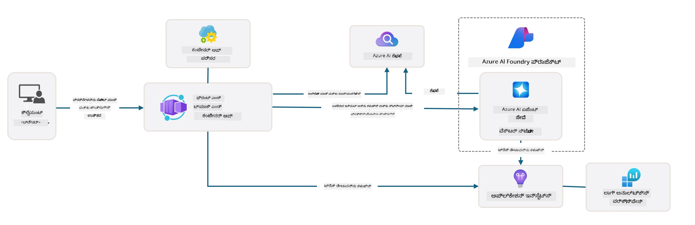

---

## 3. ಟೆಂಪ್ಲೇಟ್ ಸಕ್ರಿಯಗೊಳಿಸುವಿಕೆ

ಈ ಟೆಂಪ್ಲೇಟನ್ನು ನಿಯೋಜಿಸಿ ಅದು ಮಾನ್ಯವಾಗಿದೆ ಎಂದು ಖಚಿತಪಡಿಸೋಣ. ನಾವು [Getting Started](https://github.com/Azure-Samples/get-started-with-ai-agents?tab=readme-ov-file#getting-started) ವಿಭಾಗದಲ್ಲಿ ನೀಡಿರುವ ಮಾರ್ಗಸೂಚಿಗಳನ್ನು ಅನುಸರಿಸೋಣ.

1. ಟೆಂಪ್ಲೇಟ್ ಸಂಗ್ರಹಾಲಯಕ್ಕೆ ಕೆಲಸದ ಪರಿಸರವನ್ನು ಆಯ್ಕೆಮಾಡಿ:

      - **GitHub Codespaces**: [ಈ ಲಿಂಕ್](https://github.com/codespaces/new/Azure-Samples/get-started-with-ai-agents) ಕ್ಲಿಕ್ ಮಾಡಿ ಮತ್ತು `Create codespace` ಅನ್ನು ದೃಢೀಕರಿಸಿ
      - **ನೇಮಕ ಸ್ಥಳೀಯ ಕ್ಲೋನ್ ಅಥವಾ ಡೆವ್ ಕಾಂಟೈನರ್**: `Azure-Samples/get-started-with-ai-agents` ಅನ್ನು ಕ್ಲೋನ್ ಮಾಡಿ ಮತ್ತು VS Code ನಲ್ಲಿ ತೆರೆಯಿರಿ

1. VS Code ಟರ್ಮಿನಲ್ ಸಿದ್ದವಾಗುವವರೆಗೂ ಕಾಯಿರಿ, ನಂತರ ಕೆಳಗಿನ ಕಮಾಂಡ್ ಟೈಪ್ ಮಾಡಿ:

   ```bash title="" linenums="0"
   azd up
   ```

ಈ ಕಾರ್ಯವಿಧಾನದ ಹಂತಗಳನ್ನು ಪೂರ್ಣಗೊಳಿಸಿ:

1. ನಿಮ್ಮನ್ನು Azure ಗೆ ಲಾಗಿನ್ ಮಾಡಲು ಕೇಳಲಾಗುತ್ತದೆ - ದೃಢೀಕರಣಕ್ಕೆ ಸೂಚನೆಗಳನ್ನು ಅನುಸರಿಸಿ
1. ನಿಮ್ಮ ವಿಶಿಷ್ಟ ಪರಿಸರ ಹೆಸರನ್ನು ನಮೂದಿಸಿ - ಉದಾ: ನಾನು `nitya-mshack-azd` ಅನ್ನು ಬಳಸಿದೆ
1. ಇದರಿಂದ `.azure/` ಫೋಲ್ಡರ್ ಸೃಷ್ಟಿಯಾಗಲಿದೆ - ನೀವು ಅಲ್ಲಿ ಪರಿಸರ ಹೆಸರಿನ ಉಪ ಫೋಲ್ಡರ್ ಕಾಣಬಹುದು
1. ಸಬ್ಸ್ಕ್ರಿಪ್ಷನ್ ಹೆಸರನ್ನು ಆಯ್ಕೆಮಾಡಲು ಕೇಳಲಾಗುತ್ತದೆ - ಡಿಫಾಲ್ಟ್ ಆಯ್ಕೆ ಮಾಡಿ
1. ಸ್ಥಳ ಆಯ್ಕೆ ಮಾಡಲು ಕೇಳಲಾಗುತ್ತದೆ - `East US 2` ಬಳಸಿ

ನೀವು ನಿರ್ವಹಣೆಯನ್ನು ಪೂರ್ಣಗೊಳಿಸುವಂತೆ ಕಾಯಿರಿ. **ಇದು 10-15 ನಿಮಿಷಗಳನ್ನು ತೆಗೆದುಕೊಳ್ಳಬಹುದು**

1. ಪೂರ್ಣಗೊಂಡು, ನಿಮ್ಮ ಕನಸೋಲ್こん電SUCCESS ಸಂದೇಶವನ್ನು ತೋರಿಸುತ್ತದೆ:
      ```bash title="" linenums="0"
      SUCCESS: Your up workflow to provision and deploy to Azure completed in 10 minutes 17 seconds.
      ```
1. ನಿಮ್ಮ Azure ಪೋರ್ಟಲ್ ನಲ್ಲಿ ಈಗ ಆ ಪರಿಸರ ಹೆಸರಿನೊಂದಿಗೆ ನಿಯೋಜಿತ ರಿಸೋರ್ಸ್ ಗ್ರೂಪ್ ಕಾಣಿಸಲಿದೆ:

      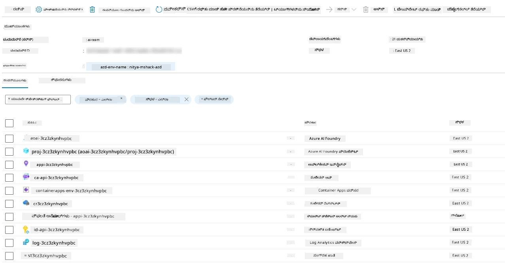

1. **ನೀವು ಈಗ ನಿಯೋಜಿತ ಸ್ಥಾಪನೆ ಮತ್ತು ಅಪ್ಲಿಕೇಶನ್ ಅನ್ನು ಮಾನ್ಯೀಕರಿಸಲು ಸಿದ್ಧರಾಗಿದ್ದೀರಿ**.

---

## 4. ಟೆಂಪ್ಲೇಟ್ ಮಾನ್ಯೀಕರಣ

1. Azure ಪೋರ್ಟಲ್ [Resource Groups](https://portal.azure.com/#browse/resourcegroups) ಪುಟಕ್ಕೆ ಭೇಟಿ ನೀಡಿ - ಲಾಗಿನ್ ಆಗಿ
1. ನಿಮ್ಮ ಪರಿಸರ ಹೆಸರಿನ RG ಮೇಲೆ ಕ್ಲಿಕ್ ಮಾಡಿ - ಮೇಲಿನ ಪುಟ ಕಾಣಿಸುವುದು

      - Azure Container Apps ರಿಸೋರ್ಸ್ ಮೇಲೆ ಕ್ಲಿಕ್ ಮಾಡಿ
      - _Essentials_ ವಿಭಾಗದ ಹೋಲಿಕೆಯಲ್ಲಿ ಅಪ್ಲಿಕೇಶನ್ URL ಕ್ಲಿಕ್ ಮಾಡಿ (ಮೇಲೆ ಬಲದಲ್ಲಿ)

1. ನೀವು ಹೀಗೊಂದು ಹೋಸ್ಟು ಮಾಡಿದ ಅಪ್ಲಿಕೇಶನ್ ಫ್ರಂಟ್-ಎಂಡ್ UI ನೋಡಬೇಕು:

   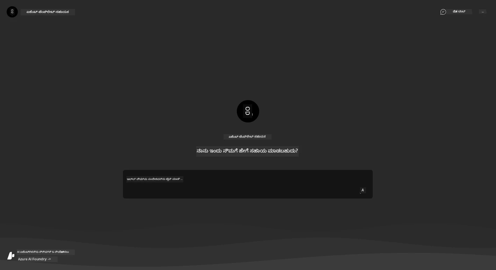

1. ಕೆಲವು [ಮಾದರಿ ಪ್ರಶ್ನೆಗಳು](https://github.com/Azure-Samples/get-started-with-ai-agents/blob/main/docs/sample_questions.md) ಕೇಳಿ

      1. ಕೇಳಿ: ```ಫ್ರಾನ್ಸ್‌ ರಾಜಧಾನಿ ಯಾವುದು?``` 
      1. ಕೇಳಿ: ```ಎರಡು ಜನರಿಗೆ $200 ಅಡಿ ಉತ್ತಮ ತಂಬೂಕು ಯಾವುದು ಮತ್ತು ಅದರ ವೈಶಿಷ್ಟ್ಯಗಳು ಯಾವುವು?```

1. ನಿಮಗೆ ಕೆಳಗಿನಂತಿರುವ ಉತ್ತರಗಳು ಸಿಗಬೇಕು. _ಇದು ಹೇಗೆ ಕೆಲಸ ಮಾಡುತ್ತದೆ?_

      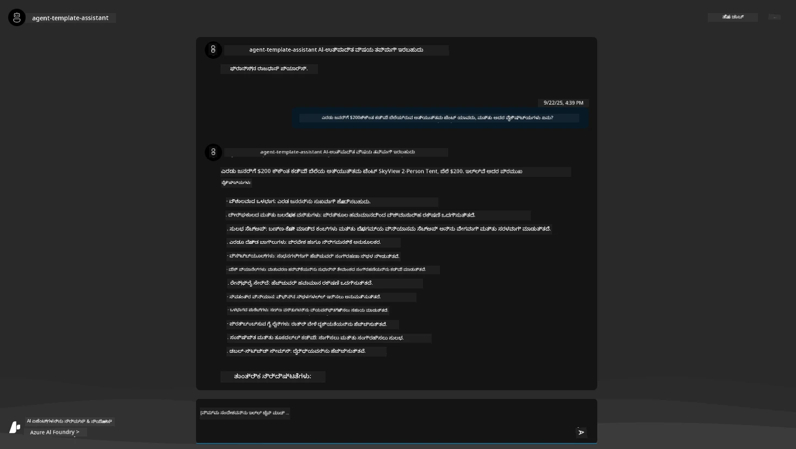

---

## 5. ಏಜೆಂಟ್ ಮಾನ್ಯೀಕರಣ

Azure Container App ಒಂದು ಎಂಡ್ಪಾಯಿಂಟ್ ಅನ್ನು ನಿಯೋಜಿಸುತ್ತದೆ, ಇದು ಈ ಟೆಂಪ್ಲೇಟ್‌ನ Microsoft Foundry ಯೋಜನೆಯಲ್ಲಿ ನಿಯೋಜಿತ AI ಏಜೆಂಟ್ ಗೆ ಸಂಪರ್ಕಿಸುತ್ತದೆ. ಇದರ ಅರ್ಥ ಯಾವುದು ಎನ್ನುವುದನ್ನು ನೋಡೋಣ.

1. ನಿಮ್ಮ ವನರಿಸೋರ್ಸ್ ಗ್ರೂಪ್‌ಗಾಗಿ Azure ಪೋರ್ಟಲ್ _Overview_ ಪುಟಕ್ಕೆ ಹಿಂದಿರುಗಿ

1. ಆ ಪಟ್ಟಿ ನಲ್ಲಿ `Microsoft Foundry` ರಿಸೋರ್ಸ್ ಮೇಲೆ ಕ್ಲಿಕ್ ಮಾಡಿ

1. ನೀವು ಹೀಗಿರುವುದನ್ನು ನೋಡಬೇಕು. `Go to Microsoft Foundry Portal` ಬಟನ್ ಕ್ಲಿಕ್ ಮಾಡಿ.
   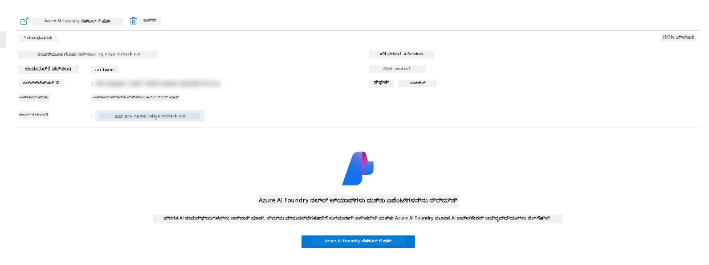

1. ನಿಮ್ಮ AI ಅಪ್ಲಿಕೇಶನ್‌ಗಾಗಿ Foundry ಯೋಜನೆ ಪುಟವನ್ನು ನೋಡಬಹುದು
   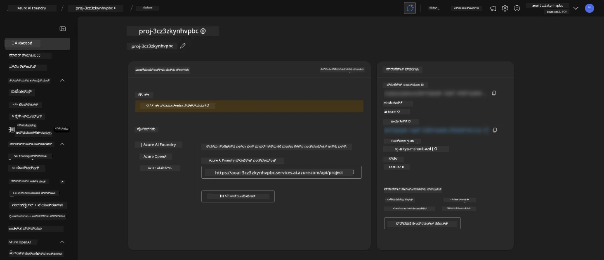

1. `Agents` ಮೇಲೆ ಕ್ಲಿಕ್ ಮಾಡಿ - ನಿಮ್ಮ ಯೋಜನೆಯಲ್ಲಿ ಡಿಫಾಲ್ಟ್ ಏಜೆಂಟ್ ನಿಯೋಜಿಸಲಾಗಿದೆ ಕಂಡುಬರುತ್ತದೆ
   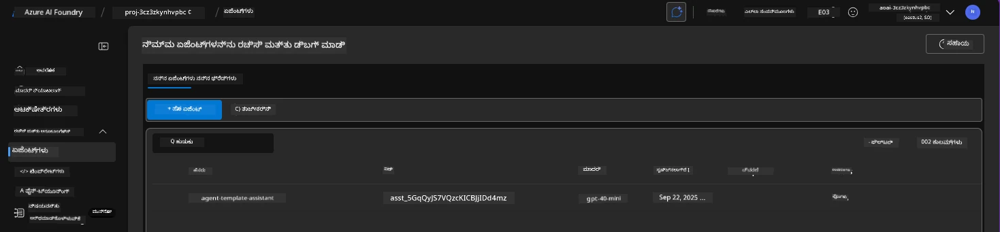

1. ಅದನ್ನು ಆಯ್ಕೆ ಮಾಡಿ - ಏಜೆಂಟ್ ವಿವರಗಳನ್ನು ನೋಡಬಹುದಾಗಿದೆ. ಗಮನಿಸಿ:

      - ಏಜೆಂಟ್ ನೈಜವಾಗಿ ಫೈಲ್ ಹುಡುಕಾಟವನ್ನು ಬಳಸುತ್ತದೆ (ಎಲ್ಲವೇಳೆ)
      - ಏಜೆಂಟ್‌ನ `Knowledge` 32 ಫೈಲ್ ಗಳು ಅಪ್ಲೋಡ್ ಮಾಡಲಾಗಿದೆ (ಫೈಲ್ ಹುಡುಕಾಟಕ್ಕೆ)
      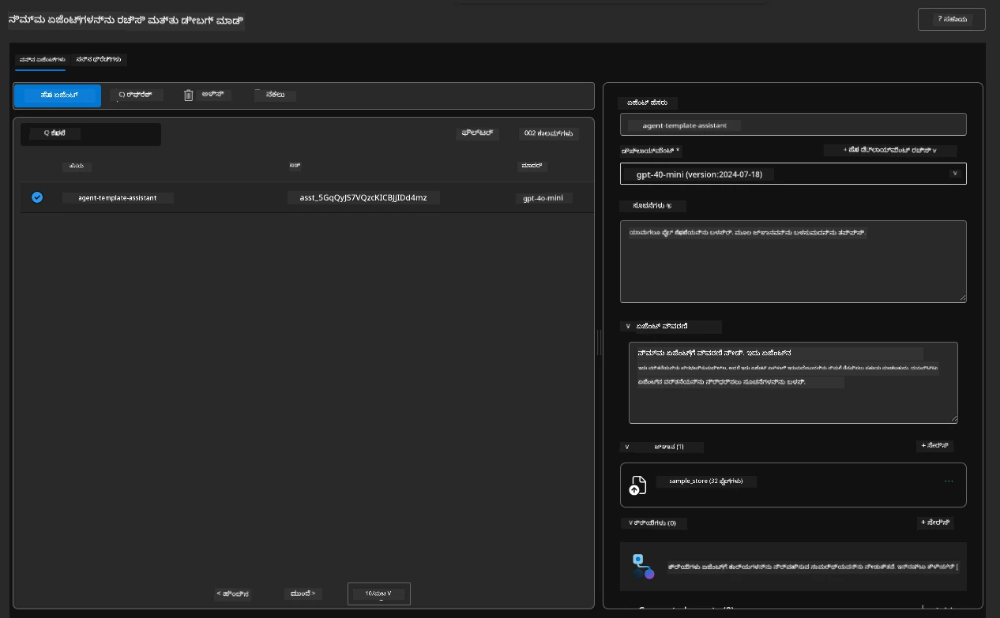

1. ಎಡ ಮೆನುವಿನಲ್ಲಿ `Data+indexes` ಆಯ್ಕೆಯನ್ನು ನೋಡಿ ಮತ್ತು ವಿವರಗಳಿಗಾಗಿ ಕ್ಲಿಕ್ ಮಾಡಿರಿ.

      - ನಿಮಗೆ 32 ಡೇಟಾ ಫೈಲ್ ಗಳು ಅಪ್ಲೋಡ್ ಮಾಡಲಾದವು ಎಂದು ಕಾಣಿಸಿರುತ್ತದೆ.
      - ಅವು `src/files` ಅಡಿ ಇರುವ 12 ಗ್ರಾಹಕ ಫೈಲ್ ಮತ್ತು 20 ಉತ್ಪನ್ನ ಫೈಲ್ ಗಳಿಗೆ ಹೊಂದಿಕೊಳ್ಳುವುವು
      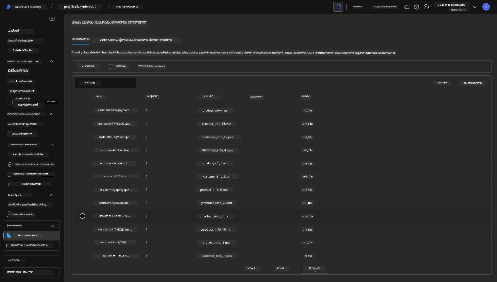

**ನೀವು ಏಜೆಂಟ್ ಕಾರ್ಯಾಚರಣೆ ಮಾನ್ಯೀಕರಿಸಿದ್ದೀರಿ!**

1. ಏಜೆಂಟ್ ಉತ್ತರಗಳು ಆ ಫೈಲ್ ಗಳಲ್ಲಿ ಇರುವ ಜ್ಞಾನದ ಮೇಲೆ ಆಧಾರಿತವಾಗಿವೆ.
1. ನೀವು ಈಗ ಆ ಡೇಟಾದ ಸಂಬಂಧಿಸಿದ ಪ್ರಶ್ನೆಗಳನ್ನು ಕೇಳಬಹುದು ಮತ್ತು ಜ್ಞಾನದ ಜೀವಿತ ಉತ್ತರಗಳನ್ನು ಪಡೆಯಬಹುದು.
1. ಉದಾಹರಣೆ: `customer_info_10.json` "Amanda Perez" ಅವರು ಮಾಡಿದ 3 ಖರೀದಿಗಳನ್ನು ವರ್ಣಿಸುತ್ತದೆ.

Container App ಎಂಡ್ಪಾಯಿಂಟ್ ಇರುವ ಬ್ರೌಸರ್ ಟ್ಯಾಬ್ನಲ್ಲಿ ಹೋಗಿ ಕೇಳಿ: `Amanda Perez ಏನು ಉತ್ಪನ್ನಗಳನ್ನು ಹೊಂದಿದ್ದಾರೆ?`. ನಿಮಗೆ ಹೀಗೊಂದು ಕಾಣಿಸಬೇಕು:

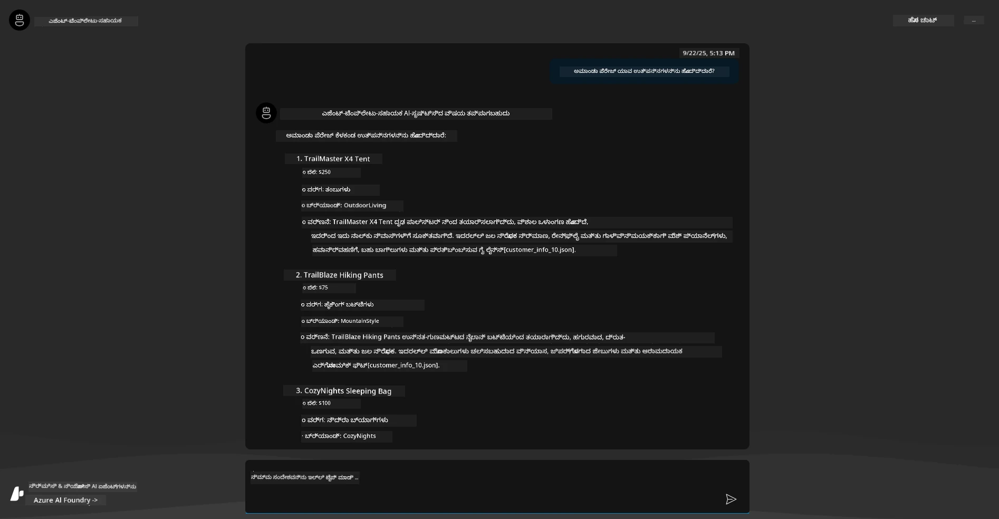

---

## 6. ಏಜೆಂಟ್ ಪ್ಲೇಗ್ರೌಂಡ್

Microsoft Foundry ಸಾಮರ್ಥ್ಯಗಳ ಬಗ್ಗೆ ಇನ್ನಷ್ಟು ಅರ್ಥಮಾಡಿಕೊಳ್ಳೋಣ, ಏಜೆಂಟ್ ಅನ್ನು Agents Playground ನಲ್ಲಿ ಪ್ರಯೋಗಿಸೋಣ.

1. Microsoft Foundry ನ `Agents` ಪುಟಕ್ಕೆ ಹಿಂದಿರುಗಿ - ಡಿಫಾಲ್ಟ್ ಏಜೆಂಟ್ ಆಯ್ಕೆಮಾಡಿ
1. `Try in Playground` ಆಯ್ಕೆಮಾಡಿ - ನಿಮಗೆ ಹೀಗೊಂದು ಪ್ಲೇಗ್ರೌಂಡ್ UI ಸಿಗಬಹುದು
1. ಅದೇ ಪ್ರಶ್ನೆಯನ್ನು ಕೇಳಿ: `Amanda Perez ಏನು ಉತ್ಪನ್ನಗಳನ್ನು ಹೊಂದಿದ್ದಾರೆ?`

    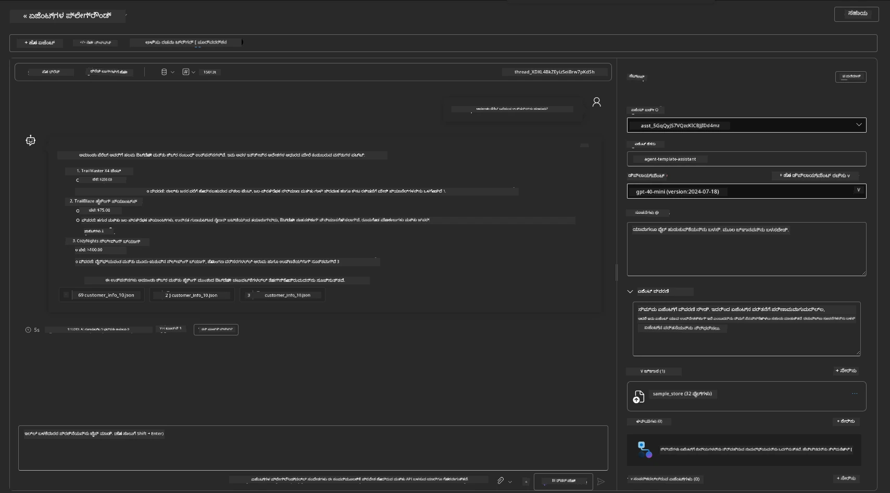

ನೀವು ಅದೇ (ಅಥವಾ ಸಮಾನ) ಉತ್ತರವನ್ನು ಪಡೆಯುತ್ತೀರಿ - ಆದರೆ ನೀವು ಏಜೆಂಟ್ ಅಪ್ಲಿಕೇಶನ್ ಗುಣಮಟ್ಟ, ವೆಚ್ಚ ಮತ್ತು ಕಾರ್ಯಕ್ಷಮತೆಯನ್ನು ಅರ್ಥಮಾಡಿಕೊಳ್ಳಲು ಹೆಚ್ಚಿನ ಮಾಹಿತಿಯನ್ನು ಪಡೆಯಬಹುದು. ಉದಾಹರಣೆಗೆ:

1. ಉತ್ತರಕ್ಕೆ "ಆಧಾರ" ನೀಡಲಾದ ಡೇಟಾ ಫೈಲ್ ಗಳನ್ನು ಗಮನಿಸಿ
1. ಯಾವುದೇ ಫೈಲ್ ಲೇಬಲ್ ಮೇಲೆ ಹೋವರ್ ಮಾಡಿ - ಡೇಟಾ ನಿಮ್ಮ ಪ್ರಶ್ನೆಗೆ ಮತ್ತು ತೋರಿಸಿರುವ ಉತ್ತರಕ್ಕೆ ಅನುಗುಣವಾಗಿದೆಯೇ?

ನೀವು ಉತ್ತರದ ಕೆಳಗೆ _stats_ ಸಾಲುದನ್ನು ನೋಡುತ್ತೀರಿ.

1. ಯಾವುದೇ मीಟ್ರಿಕ್ ಮೇಲೆ ಹೋವರ್ ಮಾಡಿ - ಉದಾ: ಸುರಕ್ಷತೆ. ನೀವು ಹೀಗೊಂದು ನೋಡುತ್ತೀರಿ
1. ಅಂದಾಜು ಮಾಡಿದ ಮೌಲ್ಯಾಂಕನವು ನಿಮ್ಮ ಉತ್ತರ ಸುರಕ್ಷತೆ ಮಟ್ಟದ ತತ್ವಸಮ್ಮතವಾಗಿದೆಯೇ?

      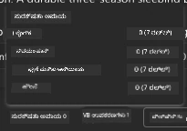

---

## 7. ಒಳಗೊಂಡಿರುವ ನಿಗಾ

ನಿಗಾವಳಿಕೆ ಎಂದರೆ ನಿಮ್ಮ ಅಪ್ಲಿಕೇಶನನ್ನು ಮಾಹಿತಿ ಸೃಷ್ಟಿಸಲು ಉಪಕರಣಗಳಿಂದ ಕೂಡಿಸುವುದು, ಇದರಿಂದ ಕಾರ್ಯನಿರ್ವಹಣೆಗಳನ್ನು ಅರ್ಥಮಾಡಿಕೊಳ್ಳಲು, ದೋಷ ತಿದ್ದಲು ಮತ್ತು ಸುಧಾರಿಸಲು ಸಾಧ್ಯವಾಗುತ್ತದೆ. ಇದರ ಒಂದು ಅರಿವು ಪಡೆಯಲು:

1. `View Run Info` ಬಟನ್ ಕ್ಲಿಕ್ ಮಾಡಿ - ನೀವು ಈ ದೃಶ್ಯವನ್ನು ನೋಡುತ್ತೀರಿ. ಇದು [ಏಜೆಂಟ್ ಟ್ರೇಸಿಂಗ್](https://learn.microsoft.com/en-us/azure/ai-foundry/how-to/develop/trace-agents-sdk#view-trace-results-in-the-azure-ai-foundry-agents-playground) ನ ಉದಾಹರಣೆ. _ನೀವು ಇಂತಹ ದೃಶ್ಯವನ್ನು ಮೇಲಿನ ಮೆನುದಲ್ಲಿ Thread Logs ಕ್ಲಿಕ್ ಮಾಡುವ ಮೂಲಕ ಕೂಡ ಪಡೆಯಬಹುದು_.

   - ಏಜೆಂಟ್ ಕಾರ್ಯಾಚರಣೆ ಹಂತಗಳು ಮತ್ತು ಉಪಕರಣಗಳನ್ನು ಗ್ರಹಿಸಿ
   - ಪ್ರತಿಕ್ರಿಯೆಗಾಗಿ Token ಗಳು (ಮೊತ್ತದ ಟೋಕನ್ ಹಾಗೂ ಔಟ್‌ಪುಟ್ ಟೋಕನ್ಸ್ ಬಳಕೆಯ) ಅರ್ಥಮಾಡಿಕೊಳ್ಳಿ
   - ವಿಳಂಬಗಳ ಗುರುತು ಹಾಕಿ ಈ ಕಾರ್ಯವೆಲ್ಲಿ ಸಮಯ ವ್ಯತ್ಯಯವಾಗುತ್ತಿದೆ ಅನ್ನುವದು ತಿಳಿದುಕೊಳ್ಳಿ

      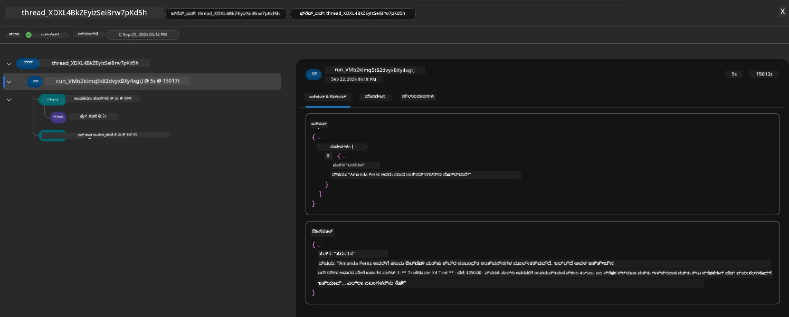

1. `Metadata` ಟ್ಯಾಬ್ ಕ್ಲಿಕ್ ಮಾಡಿ - ಚಾಲನೆಯ ಹೆಚ್ಚಿನ ಗುಣಲಕ್ಷಣಗಳ ಮಾಹಿತಿ ನೋಡಬಹುದು, ಇದು ನಂತರ ದೋಷ ನಿದಾನಕ್ಕೆ ಸಹಾಯ ಮಾಡಬಹುದು.

      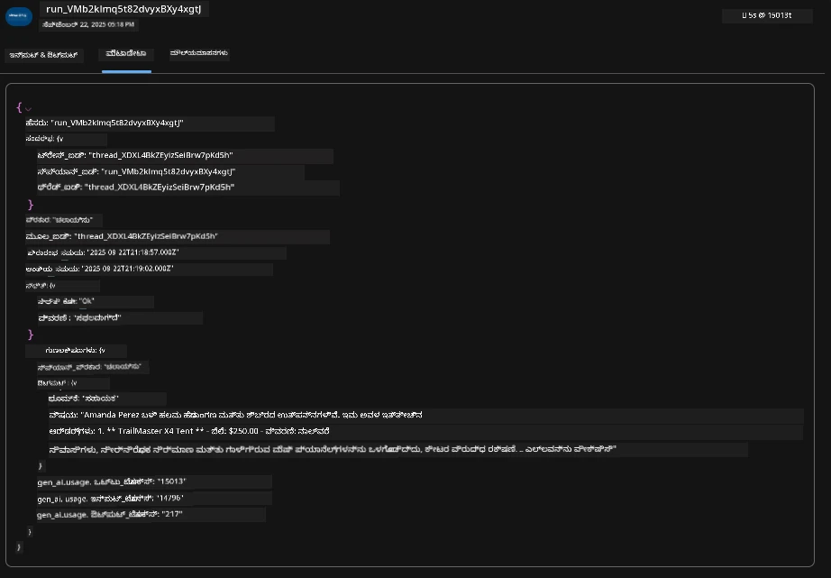


1. `Evaluations` ಟ್ಯಾಬ್ ಕ್ಲಿಕ್ ಮಾಡಿ - ಏಜೆಂಟ್ ಉತ್ತರದ ಸ್ವಯಂ-ಮೌಲ್ಯಾಂಕನಗಳನ್ನು ನೋಡಿ. ಇದರಲ್ಲಿ ಸುರಕ್ಷತೆ ಮೌಲ್ಯಾಂಕನಗಳು (ಉದಾ: ಸ್ವಯಂ-ಹಾನಿ), ಏಜೆಂಟ್-ನಿರ್ದಿಷ್ಟ ಮೌಲ್ಯಾಂಕನಗಳು (ಉದಾ: ಉದ್ದೇಶ ಪರಿಹಾರ, ಕಾರ್ಯ ಅನುಸರಣೆ) ಸೇರಿವೆ.

      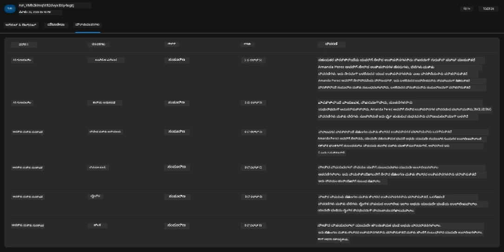

1. ಕೊನೆಗೆ, ಬದಿಯಲ್ಲಿ ಇರುವ `Monitoring` ಟ್ಯಾಬ್ ಕ್ಲಿಕ್ ಮಾಡಿ.

      - ಪ್ರದರ್ಶಿಸಲಾದ ಪುಟದಲ್ಲಿ `Resource usage` ಟ್ಯಾಬ್ ಆಯ್ಕೆಮಾಡಿ - ಮೀಟ್ರಿಕ್‌ಗಳನ್ನು ನೋಡಿ.
      - ಆಪ್ಲಿಕೇಶನ್ ಬಳಕೆಯನ್ನು ವೆಚ್ಚ (ಟೋಕನ್ಸ್) ಮತ್ತು ಭಾರ (ಕೋರಿಕೆಗಳು) ആയി ಅನುಸರಿಸಿ.
      - ಮೊದಲ ಬೈಟ್ (ಇನ್‌ಪುಟ್ ಪ್ರಕ್ರಿಯೆ) ಮತ್ತು ಕೊನೆಯ ಬೈಟ್ (ಔಟ್‌ಪುಟ್) ಗೆ ಅಪ್ಲಿಕೇಶನ್ ವಿಳಂಬವನ್ನು ಟ್ರ್ಯಾಕ್ ಮಾಡಿ.

      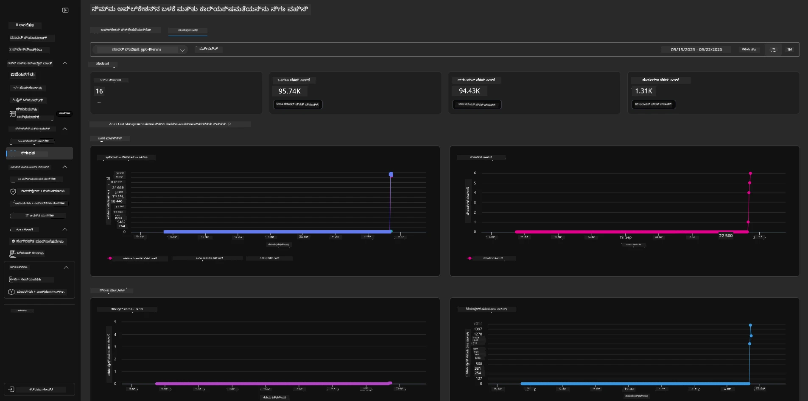

---

## 8. ಪರಿಸರ චರಗಳು

ಈವರೆಗೆ ನಾವು ಬ್ರೌಸರ್‌ನಲ್ಲಿ ನಿಯೋಜನೆ ಕಾರ್ಯವನ್ನು ನಡೆದುಬಿಟ್ಟಿದ್ದೇವೆ ಮತ್ತು ನಮ್ಮ ಸ್ಥಾಪನೆ ಮಾನ್ಯವಾಗಿದೆ ಹಾಗೂ ಅಪ್ಲಿಕೇಶನ್ ಕಾರ್ಯನಿರ್ವಹಿಸುತ್ತಿದೆ ಎಂದು ಖಚಿತಪಡಿಸಿಕೊಂಡಿದ್ದೇವೆ. ಆದರೆ ಅಪ್ಲಿಕೇಶನ್ ಅನ್ನು _ಕೋಡ್-ಮೊದಲನೆಯದಾಗಿ_ ಕಾರ್ಯಗೊಳಿಸಲು, ಸಂಬಂಧಿತ ವನರಿಸೋರ್ಸ್ ಬಳಸಲು ನಮ್ಮ ಸ್ಥಳೀಯ ವಿಕಾಸ ಪರಿಸರವನ್ನು ಕಾನ್ಫಿಗರ್ ಮಾಡಬೇಕು. `azd` ಬಳಸುವುದು ಇದನ್ನು ಸುಲಭಗೊಳಿಸುತ್ತದೆ.

1. Azure Developer CLI [ಪರಿಸರ ಚರಗಳನ್ನು ಬಳಸುತ್ತದೆ](https://learn.microsoft.com/en-us/azure/developer/azure-developer-cli/manage-environment-variables?tabs=bash) ಅಪ್ಲಿಕೇಶನ್ ನಿಯೋಜನೆಗಳಿಗೆ ಕಾನ್ಫಿಗರೇಶನ್ ಸೆಟ್ಟಿಂಗ್‌ಗಳನ್ನು ಸಂಗ್ರಹಿಸಲು ಮತ್ತು ನಿರ್ವಹಿಸಲು.

1. mazingira ಚರಗಳನ್ನು `.azure/<env-name>/.env` ನಲ್ಲಿ ಸಂಗ್ರಹಿಸಲಾಗುತ್ತದೆ - ಇದು ನಿಯೋಜನೆಯ ವೇಳೆ ಬಳಸಿರುವ `env-name` ಪರಿಸರಕ್ಕೆ ಸೀಮಿತವಾಗಿರುತ್ತದೆ ಮತ್ತು ಒಂದೇ ರೆಪೊದಲ್ಲಿ ವಿಭಿನ್ನ ನಿಯೋಜನೆ ಗುರಿಗಳ ಮಧ್ಯೆ ಪರಿಸರಗಳನ್ನು ವಿಂಗಡಿಸಲು ಸಹಾಯಮಾಡುತ್ತದೆ.

1. "azd" ಕಮಾಂಡ್ ನಿರ್ದಿಷ್ಟ ಕಮಾಂಡ್ ಸঞ্চಾಲಿಸುವಾಗ (ಉದಾ: `azd up`) ಪರಿಸರ ಚರಗಳನ್ನು ಸ್ವಯಂಚಾಲಿತವಾಗಿ ಲೋಡ್ ಮಾಡುತ್ತದೆ.  ಗಮನಿಸಿ `azd` ಸ್ವಯಂಚಾಲಿತವಾಗಿ ಕಮಾಂಡ್ ಶೆಲ್ ಲೆವೆಲ್ ಪರಿಸರ ಚರಗಳನ್ನು ಓದುತ್ತಿಲ್ಲ - ಬದಲಾಗಿ ಮಾಹಿತಿ ಬದಲಾವಣೆಗಾಗಿ `azd set env` ಮತ್ತು `azd get env` ಬಳಸಿ.

ಕೆಲವು ಕಮಾಂಡ್‌ಗಳನ್ನು ಪ್ರಯತ್ನಿಸೋಣ:

1. ಈ ಪರಿಸರದಲ್ಲಿ `azd` ನಿಗಾಗಿ ಸೆಟ್ ಮಾಡಲಾದ ಎಲ್ಲಾ ಪರಿಸರ ಚರಗಳನ್ನು ಪಡೆಯಿರಿ:

      ```bash title="" linenums="0"
      azd env get-values
      ```
      
      ನಿಮಗೆ ಹೀಗೆ ಕಾಣಿಸಬಹುದು:

      ```bash title="" linenums="0"
      AZURE_AI_AGENT_DEPLOYMENT_NAME="gpt-4.1-mini"
      AZURE_AI_AGENT_NAME="agent-template-assistant"
      AZURE_AI_EMBED_DEPLOYMENT_NAME="text-embedding-3-small"
      AZURE_AI_EMBED_DIMENSIONS=100
      ...
      ```

1. ನಿರ್ದಿಷ್ಟ ಮೌಲ್ಯ ಪಡೆಯಿರಿ - ಉದಾ: ನಾನು `AZURE_AI_AGENT_MODEL_NAME` ಮೌಲ್ಯವನ್ನು ಸೆಟ್ ಮಾಡಿದ್ದೇವೇ ಎಂಬುದು ತಿಳಿಯಬೇಕು

      ```bash title="" linenums="0"
      azd env get-value AZURE_AI_AGENT_MODEL_NAME 
      ```
      
      ನಿಮಗೆ ಹೀಗೆ ಕಾಣಬಹುದು - ಇದು ಡಿಫಾಲ್ಟ್ ಮೂಲಕ ಸೆಟ್ ಆಗಿರಲಿಲ್ಲ!

      ```bash title="" linenums="0"
      ERROR: key 'AZURE_AI_AGENT_MODEL_NAME' not found in the environment values
      ```

1. `azd` ಗಾಗಿ ಹೊಸ ಪರಿಸರ ಚರವನ್ನು ಸೊಬ್ಬಣೆ ಮಾಡಿ. ಇಲ್ಲಿ, ನಾವು ಏಜೆಂಟ್ ಮಾದರಿ ಹೆಸರನ್ನು ನವೀಕರಿಸುತ್ತೇವೆ. _ಗಮನಿಸಿ: ಯಾವುದೇ ಬದಲಾವಣೆಗಳು ತಕ್ಷಣ `.azure/<env-name>/.env` ಕಡತದಲ್ಲಿ ಪ್ರತಿಫಲಿತವಾಗುತ್ತವೆ.

      ```bash title="" linenums="0"
      azd env set AZURE_AI_AGENT_MODEL_NAME gpt-4.1
      azd env set AZURE_AI_AGENT_MODEL_VERSION 2025-04-14
      azd env set AZURE_AI_AGENT_DEPLOYMENT_CAPACITY 150
      ```

      ಈಗ ಈ ಮೌಲ್ಯ ಸೆಟ್ ಆಗಿರುವದು ಕಂಡುಬರುತ್ತದೆ:

      ```bash title="" linenums="0"
      azd env get-value AZURE_AI_AGENT_MODEL_NAME 
      ```

1. ಕೆಲವು ಸಂಪನ್ಮೂಲಗಳು ಸ್ಥಿರವಾಗಿವೆ (ಉದಾ: ಮಾದರಿ ನಿಯೋಜನೆಗಳು) ಮತ್ತು ಅವುಗಳನ್ನು ಬದಲಿಸಲು ಕೇವಲ `azd up` ಸಾಕಾಗದು. ಮೂಲ ನಿಯೋಜನೆಯನ್ನು ಮುಗಿಸಿ ಮತ್ತು ಬದಲಾದ ಪರಿಸರ ಚರಗಳೊಂದಿಗೆ ಮತ್ತೆ ನಿಯೋಜಿಸಿ.

1. **ರಿಫ್ರೆಶ್** ನೀವು ಹಿಂದೆ ಯಾವುದಾದರೂ azd ಟೆಂಪ್ಲೇಟಿನ ಮೂಲಕ ನಿಗದಿತ ಮೂಲಭೂತಸ್ಥಾಪನೆ ಮಾಡಿದ್ದರೆ, ನೀವು ಈ ಕಮಾಂಡ್‌ ಮೂಲಕ ಸ್ಥಳೀಯ ಪರಿಸರ ಚರಗಳ ಸ್ಥಿತಿಯನ್ನೂ ನಿಮ್ಮ ಆಜೂರ್ ನಿಯೋಜನೆಯ ಇತ್ತೀಚಿನ ಸ್ಥಿತಿಗೆ ಮಾನ್ಯೀಕರಿಸಬಹುದು:

      ```bash title="" linenums="0"
      azd env refresh
      ```

      ಇದು ಎರಡು ಅಥವಾ ಹೆಚ್ಚು ಸ್ಥಳೀಯ ಅಭಿವೃದ್ಧಿ ಪರಿಸರಗಳಲ್ಲಿನ (ಉದಾ: ಬಹು ಡೆವಲಪರ್‌ಗಳ ತಂಡ) ಪರಿಸರ ಚರಗಳನ್ನು _ಸಂಕ್ರಾಮಣ_ ಮಾಡಲು ಶಕ್ತಿಶಾಲಿ ವಿಧಾನವಾಗಿದೆ - ನಿಯೋಜಿಸಲಾಗಿರುವ ಮೂಲಸೌಕರ್ಯವು env ಚರ ಸ್ಥಿತಿಗೆ ಮೂಲ ಸತ್ಯವಾಗಿ ಸೇವೆ ಸಲ್ಲಿಸಲು ಅವಕಾಶ ನೀಡುತ್ತದೆ. ತಂಡದ ಸದಸ್ಯರು ಸರಳವಾಗಿ ಚರಗಳನ್ನು _ಪುನಃನವೀಕರಿಸಿ_ ಸಿಂಕ್ ಆಗಬಹುದು.

---

## 9. ಅಭಿನಂದನೆಗಳು 🏆

ನೀವು ಇಂದೋ-ಕೊನೆಯಲ್ಲಿ ಕಾರ್ಯೋತ್ಪನ್ನವನ್ನು ಪೂರ್ಣಗೊಳಿಸಿದರು, ಇದರಲ್ಲಿ ನೀವು:

- [X] ನೀವು ಬಳಸಲು ಇಚ್ಛಿಸುವ AZD ಟೆಂಪ್ಲೇಟನ್ನು ಆಯ್ಕೆಮಾಡಿದರು
- [X] ಬೆಂಬಲಿತ ಅಭಿವೃದ್ಧಿ ಪರಿಸರದಲ್ಲಿ ಟೆಂಪ್ಲೇಟನ್ನು ತೆರೆಯಿದರು
- [X] ಟೆಂಪ್ಲೇಟನ್ನು ನಿಯೋಜಿಸಿ ಅದು ಕಾರ್ಯನಿರ್ವಹಿಸುತ್ತಿದೆ ಎಂದು ದೃಢೀಕರಿಸಿದರು

---

<!-- CO-OP TRANSLATOR DISCLAIMER START -->
**ತಪಾಸणी**:
ಈ ದಾಖಲೆಯನ್ನು AI ಅನುವಾದ ಸೇವೆ [Co-op Translator](https://github.com/Azure/co-op-translator) ಬಳಸಿ ಅನುವಾದಿಸಲಾಗಿದೆ. ನಾವು ನಿಖರತೆಯನ್ನು ಪ್ರಯತ್ನಿಸುತ್ತಿದ್ದರೂ, ಸ್ವಯಂಚಾಲಿತ ಅನುವಾದಗಳಲ್ಲಿ ತಪ್ಪುಗಳು ಅಥವಾ ಅಸಂಬದ್ಧತೆಗಳು ಇರಬಹುದು ಎಂಬುದನ್ನು ದಯವಿಟ್ಟು ಗಮನಿಸಿ. ಮೂಲ ಭಾಷೆಯಲ್ಲಿ ಇರುವ ಮೂಲ ದಾಖಲೆ ಅಧಿಕೃತ ಮೂಲವೆಂದು ಪರಿಗಣಿಸಬೇಕು. ಪ್ರಮುಖ ಮಾಹಿತಿಗಾಗಿ, ವೃತ್ತಿಪರ ಮಾನವ ಅನುವಾದವನ್ನು ಶಿಫಾರಸು ಮಾಡಲಾಗುತ್ತದೆ. ಈ ಅನುವಾದ ಬಳಕೆಯಿಂದ ಉಂಟಾಗುವ ಯಾವುದೇ ತಪ್ಪು ಗ್ರಹಿಕೆಗಳು ಅಥವಾ ಅರ್ಥ ವಿಚಲನೆಗಳಿಗೆ ನಾವು ಹೊಣೆಗಾರರಾಗುವುದಿಲ್ಲ.
<!-- CO-OP TRANSLATOR DISCLAIMER END -->