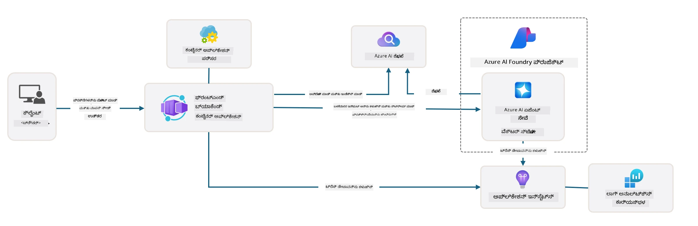

# 3. ಟೆಂಪ್ಲೇಟನ್ನು ವಿಶ್ಲೇಷಿಸಿ

!!! tip "ಈ ಘಟಕದ ಅಂತ್ಯಕ್ಕೆ ನೀವು ಸಾಮರ್ಥ್ಯವನ್ನು ಹೊಂದಿರುತ್ತೀರಿ"

    - [ ] Azure ಸಹಾಯಕ್ಕಾಗಿ MCP ಸರ್ವರ್‌ಗಳೊಂದಿಗೆ GitHub Copilot ಅನ್ನು ಸಕ್ರಿಯಗೊಳಿಸಿ
    - [ ] AZD ಟೆಂಪ್ಲೇಟಿನ ಫೋಲ್ಡರ್ ರಚನೆ ಮತ್ತು ಘಟಕಗಳನ್ನು ಅರ್ಥಮಾಡಿಕೊಳ್ಳಿ
    - [ ] Infrastructure-as-code (Bicep) ಸಂರಚನಾ ಮಾದರಿಗಳನ್ನು ಅನ್ವೇಷಿಸಿ
    - [ ] **ಲ್ಯಾಬ್ 3:** GitHub Copilot ಅನ್ನು ಬಳಸಿಕೊಂಡು ರೆಪೊಸಿಟರಿ ವಾಸ್ತುಶಿಲ್ಪವನ್ನು ಅನ್ವೇಷಿಸಿ ಮತ್ತು ಅರ್ಥಮಾಡಿಕೊಳ್ಳಿ 

---


AZD ಟೆಂಪ್ಲೇಟುಗಳು ಮತ್ತು Azure Developer CLI (`azd`) ಬಳಸಿ ನಾವು ಉದಾಹರಣೆಯ ಕೋಡ್, ಇನ್ಫ್ರಾಸ್ಟ್ರಕ್ಚರ್ ಮತ್ತು ಸಂರಚನಾ ಫೈಲ್‌ಗಳುಳ್ಳ ಸ್ಟ್ಯಾಂಡರ್ಡೈಸ್್ಡ್ ರೆಪೊಸಿಟರಿಗಳನ್ನು ತಕ್ಷಣವೇ ಪ್ರಾರಂಭಿಸಬಹುದಾದ _ಸ್ಟಾರ್ಟರ್_ ಪ್ರಾಜೆಕ್ಟ್ ರೂಪದಲ್ಲಿ ಬಳಸಿಕೊಂಡು ನಮ್ಮ ಎಐ ಅಭಿವೃದ್ಧಿ ಪ್ರಯಾಣವನ್ನು ವೇಗವಾಗಿ ಪ್ರಾರಂಭಿಸಬಹುದು.

**ಆದರೆ ಈಗ, ನಮಗೆ ಪ್ರಾಜೆಕ್ಟ್ ರಚನೆ ಮತ್ತು ಕೋಡ್‌ಬೇಸ್ ಅನ್ನು ಅರ್ಥಮಾಡಿಕೊಳ್ಳಬೇಕು — ಮತ್ತು AZD ಟೆಂಪ್ಲೇಟನ್ನು ಯಾವುದೇ ಪೂರ್ವ ಅನುಭವ ಅಥವಾ AZD ಬಗ್ಗೆ ಅರಿವಿಂದ ಇಲ್ಲದೆ ಕಸ್ಟಮೈಸ್ ಮಾಡಬಲ್ಲಷ್ಟು ಸಾಮರ್ಥ್ಯವಾಗಬೇಕು!**

---

## 1. GitHub Copilot ಅನ್ನು ಸಕ್ರಿಯಗೊಳಿಸಿ

### 1.1 GitHub Copilot Chat ಅನ್ನು ಸ್ಥಾಪಿಸಿ

ಈಗ [ಏಜೆಂಟ್ ಮೋಡ್‍ನೊಂದಿಗೆ GitHub Copilot](https://code.visualstudio.com/docs/copilot/chat/chat-agent-mode) ಅನ್ನು ಅನ್ವೇಷಿಸುವ ಸಮಯವಾಗಿದೆ. ಈಗ ನಾವು ನೈಸರ್ಗಿಕ ಭಾಷೆಯನ್ನು ಬಳಸಿ ನಮ್ಮ ಕಾರ್ಯವನ್ನು ಮೇಲ್ಮಟ್ಟದಲ್ಲಿ ವರ್ಣಿಸಬಹುದು ಮತ್ತು ಅನುಷ್ಠಾನದಲ್ಲಿ ಸಹಾಯವನ್ನು ಪಡೆಯಬಹುದು. ಈ ಲ್ಯಾಬ್ಗಾಗಿ, אנחנו [Copilot Free plan](https://github.com/github-copilot/signup) ಅನ್ನು ಬಳಸುತ್ತೇವೆ, ಇದಕ್ಕೆ ಸಂಪನ್ಮೂಲಗಳು ಮತ್ತು ಚಾಟ್ ಸಂವಹನಗಳಿಗಾಗಿ ಮಾಸಿಕ ಮಿತಿಯಿದೆ.

ವಿಸ್ತರಣೆ ಮಾರ್ಕೆಟ್‌ಪ್ಲೇಸ್‌ನಿಂದ ಸ್ಥಾಪಿಸಬಹುದು, ಆದರೆ ಇದು ನಿಮ್ಮ Codespaces ಪರಿಸರದಲ್ಲಿ ಈಗಾಗಲೇ ಲಭ್ಯವಿರಬೇಕು. _Copilot ಐಕಾನ್ ಡ್ರಾಪ್-ಡೌನ್‌ನಿಂದ `Open Chat` ಕ್ಲಿಕ್ ಮಾಡಿ - ಮತ್ತು `What can you do?` ಮುಂತಾದ ಪ್ರಾಂಪ್ಟ್ ಟೈಪ್ ಮಾಡಿ_ - ನಿಮಗೆ ಲಾಗಿನ್ ಮಾಡಲು ಕೇಳಬಹುದು. **GitHub Copilot Chat ಸಜ್ಜಾಗಿದೆ**.

### 1.2. MCP ಸರ್ವರ್‌ಗಳನ್ನು ಸ್ಥಾಪಿಸಿ

ಏಜೆಂಟ್ ಮೋಡ್ ಪರಿಣಾಮಕಾರಿಯಾಗಲು, ಅದಕ್ಕೆ ಸಂಬಂದಿಸಿದ ಜ್ಞಾನ ಪಡೆಯಲು ಅಥವಾ ಕ್ರಿಯೆಗಳನ್ನು ಕೈಗೊಳ್ಳಲು ಸರಿಯಾದ ಸಾಧನಗಳ ಪ್ರವೇಶ ಅಗತ್ಯವಿದೆ. ಇದಕ್ಕೆ MCP ಸರ್ವರ್‌ಗಳು ಸಹಾಯ ಮಾಡಬಹುದು. আমরা ಕೆಳಕಂಡ ಸರ್ವರ್‌ಗಳನ್ನು ಸಂರಚಿಸೋಣ:

1. [Azure MCP Server](../../../../../workshop/docs/instructions)
1. [Microsoft Docs MCP Server](../../../../../workshop/docs/instructions)

ಇವನ್ನು ಸಕ್ರಿಯಗೊಳಿಸಲು:

1. `.vscode/mcp.json` ಎಂಬ ֆೈಲ್ ಅನ್ನು ರಚಿಸಿ, ಅದು अस्तಿತ್ವದಲ್ಲಿಲ್ಲದಿದ್ದರೆ
1. ಆ ಫೈಲ್‌ಗೆ ಕೆಳಗಿನವು ಹೋಲಿಸಿ - ಮತ್ತು ಸರ್ವರ್‌ಗಳನ್ನು ಪ್ರಾರಂಭಿಸಿ!
   ```json title=".vscode/mcp.json"
   {
      "servers": {
         "Azure MCP Server": {
            "command": "npx",
            "args": [
            "-y",
            "@azure/mcp@latest",
            "server",
            "start"
            ]
         },
         "microsoft.docs.mcp": {
            "type": "http",
            "url": "https://learn.microsoft.com/api/mcp"
         }
      }
   }
   ```

??? warning "ನಿಮಗೆ `npx` ಸ್ಥಾಪಿಸಲಾಗಿಲ್ಲ ಎಂದು ದೋಷ ಕಾಣಿಸಬಹುದು (ಸಮಾಧಾನಕ್ಕಾಗಿ ವಿಸ್ತರಿಸಲು ಕ್ಲಿಕ್ ಮಾಡಿ)"

      ಇದನ್ನು ಸರಿಪಡಿಸಲು, `.devcontainer/devcontainer.json` ಫೈಲ್ ಅನ್ನು ತೆರೆಯilip ಮತ್ತು features ವಿಭಾಗದಲ್ಲಿ ಈ ಸಾಲನ್ನು ಸೇರಿಸಿ. ನಂತರ ಕಂಟೈನರ್ ಅನ್ನು ಮರುನಿರ್ಮಿಸಿ. ಈಗ ನಿಮಗೆ `npx` ಇನ್‌ಸ್ಟಾಲ್ ಆಗಿರಬೇಕು.

      ```title="" linenums="0"
         "features": {
            "ghcr.io/devcontainers/features/node:1": {},
            ...
         },
      ```

---

### 1.3. GitHub Copilot Chat ಅನ್ನು ಪರೀಕ್ಷಿಸಿ

**ಮೊದಲು VS Code ಕಮಾಂಡ್ ಲೈನ್‌ನಿಂದ Azure ಗೆ ಪ್ರಮಾಣೀಕರಿಸಲು `az login` ಬಳಸಿ.**

ಈಗ ನೀವು ನಿಮ್ಮ Azure ಸಬ್ಸ್‌ಕ್ರಿಪ್ಶನ್ ಸ್ಥಿತಿಯನ್ನು ಕ್ವೆರಿ ಮಾಡಬಲ್ಲಿರಿ ಮತ್ತು ನಿಯೋಜಿತ ಸಂಪನ್ಮೂಲಗಳು ಅಥವಾ ಸಂರಚನೆಯ ಕುರಿತು ಪ್ರಶ್ನೆಗಳನ್ನು ಕೇಳಬಹುದು. ಈ ಪ್ರಾಂಪ್ಟ್‌ಗಳನ್ನು ಪ್ರಯತ್ನಿಸಿ:

1. `List my Azure resource groups`
1. `#foundry list my current deployments`

ನೀವು Microsoft Docs MCP ಸರ್ವರ್‌ನಲ್ಲಿ ನೆಲಗಡೆ ಇರುವ ಉತ್ತರಗಳನ್ನು ಪಡೆಯಲು Azure ದಾಖಲೆಗಳ ಬಗ್ಗೆ ಪ್ರಶ್ನೆಗಳನ್ನು ಕೇಳಬಹುದು. ಈ ಪ್ರಾಂಪ್ಟ್‌ಗಳನ್ನು ಪ್ರಯತ್ನಿಸಿ:

1. `#microsoft_docs_search What is Azure Developer CLI?`
1. `#microsoft_docs_search Show me a Python tutorial to chat with deployed model`

ಅಥವಾ ಕಾರ್ಯವನ್ನು ಪೂರ್ಣಗೊಳಿಸಲು ಕೋಡ್ ಸ್ನಿಪೆಟ್ಗಳನ್ನು ಕೇಳಬಹುದು. ಈ ಪ್ರಾಂಪ್ಟ್ ಪ್ರಯತ್ನಿಸಿ.

1. `Give me a Python code example that uses AAD for an interactive chat client`

`Ask` ಮೋಡ್‌ನಲ್ಲಿ, ಇದು ನೀವು ನಕಲಿಸಿ-ಉಳಿಸಿ ಪ್ರಯತ್ನಿಸಲು ಸಾಧ್ಯವಿರುವ ಕೋಡ್ ಅನ್ನು ನೀಡುತ್ತದೆ. `Agent` ಮೋಡ್‌ನಲ್ಲಿ, ಇದು ಇನ್ನಷ್ಟು ಮುಂದೆ ಹೋಗಬಹುದು ಮತ್ತು ಬೇಕಾದ ಸಂಪನ್ಮೂಲಗಳನ್ನು ಸൃഷ್ಠಿಸುವುದು ಸೇರಿದಂತೆ ಸಸಿ-ಸ್ಕ್ರಿಪ್ಟ್‌ಗಳು ಮತ್ತು ಡಾಕ್ಯುಮೆಂಟೇಶನ್ ಅನ್ನು ರಚಿಸಬಹುದು — ನಿಮಗೆ ಆ ಕಾರ್ಯವನ್ನು ನಿರ್ವಹಿಸಲು ಸಹಾಯವಾಗುತ್ತದೆ.

**ನೀವು ಈಗ ಟೆಂಪ್ಲೇಟು ರೆಪೊಸಿಟರಿಯನ್ನು ಅನ್ವೇಷಿಸಲು ಸಜ್ಜಾಗಿದ್ದೀರಿ**

---

## 2. ವಾಸ್ತುಶಿಲ್ಪವನ್ನು ವಿಶ್ಲೇಷಿಸಿ

??? prompt "ASK: docs/images/architecture.png ನಲ್ಲಿ ಇರುವ ಅಪ್ಲಿಕೇಶನ್ ವಾಸ್ತುಶಿಲ್ಪವನ್ನು 1 ಪ್ಯಾರಾಗ್ರಾಫ್‌ನಲ್ಲಿ ವಿವರಿಸಿ"

      ಈ ಅಪ್ಲಿಕೇಶನ್ ಒಂದು Azure ಆಧಾರಿತ ಎಐ-ಸಂರಚಿತ ಚಾಟ್ ಅಪ್ಲಿಕೇಶನ್ ಆಗಿದ್ದು ಆಧುನಿಕ ಏಜೆಂಟ್-ಆಧಾರಿತ ವಾಸ್ತುಶಿಲ್ಪವನ್ನು ಪ್ರದರ್ಶಿಸುತ್ತದೆ. ಈ ಪರಿಹಾರವು ಮುಖ್ಯ ಅಪ್ಲಿಕೇಶನ್ ಕೋಡ್ ಅನ್ನು ಹೊಂದಿರುವ Azure Container App ನ ಸುತ್ತಲೂ ಕೇಂದ್ರಿತವಾಗಿದೆ, ಇದು ಬಳಕೆದಾರ ಇನ್‌ಪುಟ್ ಅನ್ನು ಪ್ರಕ್ರಿಯೆಮಾಡಿ ಏಜೆಂಟ್‌ ಮೂಲಕ ಬುದ್ಧಿವಂತಿಕೆಯಿಂದ ಉತ್ತರಗಳನ್ನು ಜನರೇಟ್ ಮಾಡುತ್ತದೆ.
      
      ವಾಸ್ತುಶಿಲ್ಪವು Microsoft Foundry Project ಅನ್ನು ಎಐ ಸಾಮರ್ಥ್ಯದ ಸ್ಥಂಭವಾಗಿ ಬಳಸುತ್ತದೆ ಮತ್ತು gpt-4.1-mini ಮುಂತಾದ ಮೂಲಭೂತ ಭಾಷಾ ಮಾದರಿಗಳನ್ನು ಮತ್ತು ಏಜೆಂಟ್ ಕಾರ್ಯಕ್ಷಮತೆಯನ್ನು ಒದಗಿಸುವ Azure AI Services ಗಳೊಂದಿಗೆ ಸಂಪರ್ಕ ಹೊಂದಿದೆ. ಬಳಕೆದಾರ ಸಂವಹನಗಳು React-ಆಧಾರಿತ ಫ್ರಂಟ್‌ಎಂಡ್ ಮುಖಾಂತರ FastAPI ಬ್ಯಾಕ್‌ಎಂಡ್‌ಗೆ ಹರಿದು, ಅಲ್ಲಿಂದ ಏಜೆಂಟ್ ಸರ್ವಿಸ್‌ಗೆ ಸಂಪರ್ಕಿಸಿ ಸಾಂಕೇತಿಕ ಮತ್ತು ಸಂಪ್ರತಿಪಾದಿತ ಪ್ರತಿಕ್ರಿಯೆಗಳನ್ನು ರಚಿಸುತ್ತವೆ.
      
      ವ್ಯವಸ್ಥೆಯು ಫೈಲ್ ಹುಡುಕಾಟ ಅಥವಾ Azure AI Search ಸೇವೆ ಮೂಲಕ ಜ್ಞಾನ återoltಣ ಸಾಮರ್ಥ್ಯಗಳನ್ನು ಒಳಗೊಂಡಿದೆ, ಇದರಿಂದ ಏಜೆಂಟ್ ಅಪ್ಲೋಡ್ ಮಾಡಿದ ದಾಖಲೆಗಳಿಂದ ಮಾಹಿತಿಯನ್ನು ಪ್ರಾಪ್ತಿಮಾಡಿ ಉಲ್ಲೇಖಿಸಬಲ್ಲದು. ಕಾರ್ಯಾಚರಣಾತ್ಮಕ ಉದ್ದೇಶಕ್ಕಾಗಿ, ಆರ್ಕಿಟೆಕ್ಚರ್ ಟ್ರೇಸಿಂಗ್, ಲಾಗಿಂಗ್ ಮತ್ತು ಕಾರ್ಯಕ್ಷಮತೆಯ ಪರಿಷ್ಕರಣೆಯಿಗಾಗಿ Application Insights ಮತ್ತು Log Analytics Workspace ಮೂಲಕ ವ್ಯಾಪಕ ತಪಾಸಣೆಯನ್ನು ಒಳಗೊಂಡಿದೆ.
      
      ಅಪ್ಲಿಕೇಶನ್ ಡೇಟಾ ಮತ್ತು ಫೈಲ್ ಅಪ್ಲೋಡ್‌ಗಳಿಗೆ ಬ್ಲಾಬ್ ಸಂಗ್ರಹವನ್ನು ಒದಗಿಸಲು Azure Storage ಬಳಕೆ ಮಾಡಲಾಗಿದೆ, ಮತ್ತು Managed Identity ಮೂಲಕ Azure ಸಂಪನ್ಮೂಲಗಳ ನಡುವೆ ರಹಸ್ಯಗಳನ್ನು ಸಂಗ್ರಹಿಸದೆಯೇ ಸುರಕ್ಷಿತ ಪ್ರವೇಶವನ್ನು ಖಚಿತಪಡಿಸಲಾಗಿದೆ. ಸಂಪೂರ್ಣ ಪರಿಹಾರವು ಪ್ರ需求ಾತ್ಮಕವಾಗಿ ಸ್ಕೇಲಬಲ್ ಮತ್ತು ನಿರ್ವಹಣೀಯವಾಗುವಂತೆ ವಿನ್ಯಾಸಗೊಳಿಸಲಾಗಿದೆ, ಕಂಟೈನರ್‌ಕೃತ ಅಪ್ಲಿಕೇಶನ್ ಪ್ರಾಥಮಿಕ ಬೇಡಿಕೆಯ ಮೇಲೆ ಸ್ವಯಂಚಾಲಿತವಾಗಿ ಸ್ಕೇಲ್ ಆಗುತ್ತದೆ ಮತ್ತು Azure ನ ನಿರ್ವಹಿಸಲಾದ ಸೇವೆಗಳ ಮೂಲಕ ಕಟ್ಟುನಿಟ್ಟಾದ ಸುರಕ್ಷತೆ, ಪರಿಷ್ಕರಣೆ ಮತ್ತು CI/CD ಸಾಮರ್ಥ್ಯಗಳನ್ನು ಒದಗಿಸುತ್ತದೆ.



---

## 3. ರೆಪೊಸಿಟರಿ ರಚನೆ

!!! prompt "ASK: ಟೆಂಪ್ಲೇಟಿನ ಫೋಲ್ಡರ್ ರಚನೆಯನ್ನು ವಿವರಿಸಿ. ದೃಶ್ಯ ಹೇರಾರ್ಕಿಕಲ್ ಡಯಾಗ್ರಾಮ್‌ನಿಂದ ಪ್ರಾರಂಭಿಸಿ."

??? info "ANSWER: ದೃಶ್ಯ ಹೇರಾರ್ಕಿಕಲ್ ಡಯಾಗ್ರಾಮ್"

      ```bash title="" 
      get-started-with-ai-agents/
      ├── 📋 Configuration & Setup
      │   ├── azure.yaml                    # Azure Developer CLI ಸಂರಚನೆ
      │   ├── docker-compose.yaml           # ಸ್ಥಳೀಯ ಅಭಿವೃದ್ಧಿ ಕಾಂಟೈನರ್‌ಗಳು
      │   ├── pyproject.toml                # Python ಪ್ರಾಜೆಕ್ಟ್ ಕಾನ್ಫಿಗರೇಶನ್
      │   ├── requirements-dev.txt          # ಅಭಿವೃದ್ಧಿ ಅವಲಂಬನಗಳು
      │   └── .devcontainer/                # VS Code dev ಕಂಟೈನರ್ ಸೆಟಪ್
      │
      ├── 🏗️ Infrastructure (infra/)
      │   ├── main.bicep                    # ಮುಖ್ಯ ಇನ್ಫ್ರಾಸ್ಟ್ರక్చರ್ ಟೆಂಪ್ಲೇಟ್
      │   ├── api.bicep                     # API-ನಿರ್ದಿಷ್ಟ ಸಂಪನ್ಮೂಲಗಳು
      │   ├── main.parameters.json          # ಇನ್ಫ್ರಾ ಪರಾಮೀಟರ್‌ಗಳು
      │   └── core/                         # ಮಾಡ್ಯುಲರ್ ಇನ್ಫ್ರಾ ಕಾಂಪೋನಂಟ್‌ಗಳು
      │       ├── ai/                       # AI ಸೇವಾ ಸಂರಚನೆಗಳು
      │       ├── host/                     # ಹೋಸ್ಟಿಂಗ್ ಇನ್ಫ್ರಾಸ್ಟ್ರಕ್ಚರ್
      │       ├── monitor/                  # ಮೇಲ್ವಿಚಾರಣೆ ಮತ್ತು ಲಾಗಿಂಗ್
      │       ├── search/                   # Azure AI Search ಸೆಟಪ್
      │       ├── security/                 # ಭದ್ರತೆ ಮತ್ತು ಐಡೆಂಟಿಟಿ
      │       └── storage/                  # ಸಂಗ್ರಹ ಖಾತೆ ಸಂರಚನೆಗಳು
      │
      ├── 💻 Application Source (src/)
      │   ├── api/                          # ಬ್ಯಾಕ್ಎಂಡ್ API
      │   │   ├── main.py                   # FastAPI ಅಪ್ಲಿಕೇಶನ್ ಎಂಟ್ರಿ
      │   │   ├── routes.py                 # API ಮಾರ್ಗ ವ್ಯಾಖ್ಯಾನಗಳು
      │   │   ├── search_index_manager.py   # ಹುಡುಕು ಕಾರ್ಯಕ್ಷಮತೆ
      │   │   ├── data/                     # API ಡೇಟಾ ನಿರ್ವಹಣೆ
      │   │   ├── static/                   # ಸ್ಥಿರ ವೆಬ್ ಆಸ್ತಿಗಳು
      │   │   └── templates/                # HTML ಟೆಂಪ್ಲೇಟ್‌ಗಳು
      │   ├── frontend/                     # React/TypeScript ಫ್ರಂಟೆಂಡ್
      │   │   ├── package.json              # Node.js ಅವಲಂಬನಿಗಳು
      │   │   ├── vite.config.ts            # Vite ಕಟ್ಟುವ ಸಂರಚನೆ
      │   │   └── src/                      # ಫ್ರಂಟೆಂಡ್ ಮೂಲ ಕೋಡ್
      │   ├── data/                         # ಮಾದರಿ ಡೇಟಾ ಫೈಲುಗಳು
      │   │   └── embeddings.csv            # ಪೂರ್ವ ಲೆಕ್ಕಾಚಾರಗೊಂಡ ಎಂಬೆಡ್ಡಿಂಗ್ಸ್
      │   ├── files/                        # ಜ್ಞಾನ ಆಧಾರ ಫೈಲ್‌ಗಳು
      │   │   ├── customer_info_*.json      # ಗ್ರಾಹಕ ಡೇಟಾ ಮಾದರಿಗಳು
      │   │   └── product_info_*.md         # ಉತ್ಪನ್ನ ಡಾಕ್ಯುಮೆಂಟೇಶನ್
      │   ├── Dockerfile                    # ಕಂಟೈನರ್ ಸಂರಚನೆ
      │   └── requirements.txt              # Python ಅವಲಂಬನಿಗಳು
      │
      ├── 🔧 Automation & Scripts (scripts/)
      │   ├── postdeploy.sh/.ps1           # ಪೋಸ್ಟ್-ಡಿಪ್ಲಾಯ್ ಸೆಟಪ್
      │   ├── setup_credential.sh/.ps1     # ಕ್ರೆಡೆನ್ಷಿಯಲ್ ಸಂರಚನೆ
      │   ├── validate_env_vars.sh/.ps1    # ಪರಿಸರ ಮಾನ್ಯತೆ
      │   └── resolve_model_quota.sh/.ps1  # ಮಾದರಿ ಕೋಟಾ ನಿರ್ವಹಣೆ
      │
      ├── 🧪 Testing & Evaluation
      │   ├── tests/                        # ಯೂನಿಟ್ ಮತ್ತು ಇಂಟಿಗ್ರೇಷನ್ ಟೆಸ್ಟ್ಗಳು
      │   │   └── test_search_index_manager.py
      │   ├── evals/                        # ಏಜೆಂಟ್ ಮೌಲ್ಯಮಾಪನ ಫ್ರೇಮ್‌ವರ್ಕ್
      │   │   ├── evaluate.py               # ಮೌಲ್ಯಮಾಪನ ರನ್ನರ್
      │   │   ├── eval-queries.json         # ಪರೀಕ್ಷೆ ಪ್ರಶ್ನೆಗಳು
      │   │   └── eval-action-data-path.json
      │   ├── sandbox/                      # ಅಭಿವೃದ್ಧಿ ಪ್ಲೇಗ್ರೌಂಡ್
      │   │   ├── 1-quickstart.py           # ಪ್ರಾರಂಭಿಸಲು ಉದಾಹರಣೆಗಳು
      │   │   └── aad-interactive-chat.py   # ಪ್ರಮಾಣೀಕರಣ ಉದಾಹರಣೆಗಳು
      │   └── airedteaming/                 # AI ಭದ್ರತಾ ಮೌಲ್ಯಮಾಪನ
      │       └── ai_redteaming.py          # ರೆಡ್-ಟೀಂ ಪರೀಕ್ಷೆ
      │
      ├── 📚 Documentation (docs/)
      │   ├── deployment.md                 # ಡಿಪ್ಲಾಯ್ ಮಾರ್ಗದರ್ಶನ
      │   ├── local_development.md          # ಸ್ಥಳೀಯ ಸೆಟಪ್ ಸೂಚನೆಗಳು
      │   ├── troubleshooting.md            # ಸಾಮಾನ್ಯ ಸಮಸ್ಯೆಗಳೂ ಮತ್ತು ಪರಿಹಾರಗಳು
      │   ├── azure_account_setup.md        # Azure ಮುಂಚಿತ ಅವಶ್ಯಕತೆಗಳು
      │   └── images/                       # ದಸ್ತಾವೇಜು ಆಸ್ತಿಗಳು
      │
      └── 📄 Project Metadata
         ├── README.md                     # ಪ್ರಾಜೆಕ್ಟ್ ಮಾಹಿತಿ
         ├── CODE_OF_CONDUCT.md           # ಸಮುದಾಯ ಮಾರ್ಗಸೂಚಿಗಳು
         ├── CONTRIBUTING.md              # ಕೊಡುಗೆ ಮಾರ್ಗದರ್ಶಿ
         ├── LICENSE                      # ಪರವಾನಗಿ ಷರತ್ತುಗಳು
         └── next-steps.md                # ಪೋಸ್ಟ್-ಡಿಪ್ಲಾಯ್ ಮಾರ್ಗದರ್ಶನ
      ```

### 3.1. ಕೋರ್ ಅಪ್ಲಿಕೇಶನ್ ವಾಸ್ತುಶಿಲ್ಪ

ಈ ಟೆಂಪ್ಲೇಟ್ ಕೆಳಕಂಡ ಬಳಕೆಯೊಂದಿಗೆ ಒಂದು **ಫುಲ್-ಸ್ಟಾಕ್ ವೆಬ್ ಅಪ್ಲಿಕೇಶನ್** ಮಾದರಿಯನ್ನು ಅನುಸರಿಸುತ್ತದೆ:

- **Backend**: Azure AI ಸಂಯೋಜನೆಯೊಂದಿಗೆ Python FastAPI
- **Frontend**: TypeScript/React ಮತ್ತು Vite ನಿರ್ಮಾಣ ವ್ಯವಸ್ಥೆ
- **Infrastructure**: ಕ್ಲೌಡ್ ಸಂಪನ್ಮೂಲಗಳಿಗಾಗಿ Azure Bicep ಟೆಂಪ್ಲೇಟುಗಳು
- **Containerization**: ಸರಿ-ಸಮನ್ವಯಿತ ನಿರ್ವಹಣೆಗೆ Docker

### 3.2 Infra As Code (bicep)

ಇನ್ಫ್ರಾಸ್ಟ್ರಕ್ಚರ್ ಲೇಯರ್ ಅನ್ನು **Azure Bicep** ಟೆಂಪ್ಲೇಟುಗಳಾಗಿ ಮód್‍यುಲರ್ ರೀತಿಯಲ್ಲಿ ಸಂಘಟಿಸಲಾಗಿದೆ:

   - **`main.bicep`**: ಎಲ್ಲಾ Azure ಸಂಪನ್ಮೂಲಗಳನ್ನು ಸಂಯೋಜಿಸುತ್ತದೆ
   - **`core/` modules**: ವಿವಿಧ ಸೇವೆಗಳಿಗಾಗಿ ಪунаರ್ವಿನಿಯೋಗಗೊಳ್ಳಬಹುದಾದ ಕಾಂಪೋನಂಟ್‌ಗಳು
      - AI ಸೇವೆಗಳು (Microsoft Foundry Models, AI Search)
      - ಕಂಟೈನರ್ ಹೋಸ್ಟಿಂಗ್ (Azure Container Apps)
      - ಮೇಲ್ವಿಚಾರಣೆ (Application Insights, Log Analytics)
      - ಭದ್ರತೆ (Key Vault, Managed Identity)

### 3.3 ಅಪ್ಲಿಕೇಶನ್ ಮೂಲ (`src/`)

**Backend API (`src/api/`)**:

- FastAPI ಆಧಾರಿತ REST API
- Foundry ಏಜೆಂಟ್‌ಗಳ ಇಂಟिग್ರೇಶನ್
- ಜ್ಞಾನ ಸ್ವೀகரಣೆಗಾಗಿ ಶೋಧ ಸೂಚ್ಯಂಕ ನಿರ್ವಹಣೆ
- ಫೈಲ್ ಅಪ್‌ಲೋಡ್ ಮತ್ತು ಪ್ರಕ್ರಿಯೆ ಸಾಮರ್ಥ್ಯಗಳು

**Frontend (`src/frontend/`)**:

- ಆಧುನಿಕ React/TypeScript SPA
- ವೇಗವಾದ ಅಭಿವೃದ್ಧಿ ಮತ್ತು ಆಪ್ಟಿಮೈಜ್ಡ್ ಬಿಲ್ಡ್‌ಗಳಿಗಾಗಿ Vite
- ಏಜೆಂಟ್ ಸಂವಹನಗಳಿಗಾಗಿ ಚಾಟ್ ಇಂಟರ್ಫೇಸ್

**Knowledge Base (`src/files/`)**:

- ಮಾದರಿ ಗ್ರಾಹಕ ಮತ್ತು ಉತ್ಪನ್ನ ಡೇಟಾ
- ಫೈಲ್-ಆಧಾರಿತ ಜ್ಞಾನ ಪ್ರತ್ಯಾರೋಪಣೆಯನ್ನು ಪ್ರದರ್ಶಿಸುತ್ತದೆ
- JSON ಮತ್ತು Markdown ಫಾರ್ಮಾಟ್ ಉದಾಹರಣೆಗಳು


### 3.4 ಡೆವ್‌ಒಪ್ಸ್ & ಆಟೋಮೇಷನ್

**ಸ್ಕ್ರಿಪ್ಟ್‌ಗಳು (`scripts/`)**:

- ಕ್ರಾಸ್-ಪ್ಲ್ಯಾಟ್‌ಫಾರ್ಮ್ PowerShell ಮತ್ತು Bash ಸ್ಕ್ರಿಪ್ಟ್‌ಗಳು
- ಪರಿಸರ ಮಾನ್ಯತೆ ಮತ್ತು ಸೆಟಪ್
- ಪೋಸ್ಟ್-ಡಿಪ್ಲಾಯ್ ಸಂರಚನೆ
- ಮಾದರಿ ಕೋಟಾ ನಿರ್ವಹಣೆ

**Azure Developer CLI ಎಂಟಿಗ್ರೇಶನ್**:

- `azure.yaml` ಆಗಿ `azd` ವರ್ಕ್‌ಫ್ಲೋಗಳಿಗಾಗಿ ಸಂರಚನೆ
- ಸ್ವಯಂಚಾಲಿತ ಪ್ರೊವಿಜನಿಂಗ್ ಮತ್ತು ಡಿಪ್ಲಾಯ್‌ಮೆಂಟ್
- ಪರಿಸರ ಚರ (environment variable) ನಿರ್ವಹಣೆ

### 3.5 ಪರೀಕ್ಷೆ & ಗುಣಮಟ್ಟ ಭರವಸೆ

**ಮೌಲ್ಯಮಾಪನ ಫ್ರೇಮ್ವರ್ಕ್ (`evals/`)**:

- ಏಜೆಂಟ್ ಕಾರ್ಯಕ್ಷಮತೆ ಮೌಲ್ಯಮಾಪನ
- ಪ್ರಶ್ನೆ-ಪ್ರತಿಕ್ರಿಯೆ ಗುಣಮಟ್ಟ ಪರೀಕ್ಷೆಗಳು
- ಸ್ವಯಂಚಾಲಿತ ಅಸೆಸ್ಸ್ಮೆಂಟ್ ಪೈಪ್‌ಲೈನ್

**AI ಭದ್ರತೆ (`airedteaming/`)**:

- ಏಐ ಭದ್ರತೆಗೆ ರೆಡ್-ಟೀಂ ಪರೀಕ್ಷೆ
- ಭದ್ರತಾ ದುರ್ಬಲತೆ ಸ್ಕ್ಯಾನಿಂಗ್
- ಜವಾಬ್ದಾರಿಯುತ ಏಐ ಅಭ್ಯಾಸಗಳು

---

## 4. ಅಭಿನಂದನೆಗಳು 🏆

ನೀವು ಯಶಸ್ವಿಯಾಗಿ MCP ಸರ್ವರ್‌ಗಳೊಂದಿಗೆ GitHub Copilot Chat ಅನ್ನು ಬಳಸಿ ರೆಪೊಸಿಟರಿಯನ್ನು ಅನ್ವೇಷಿಸಿದಿರಿ.

- [X] Azure ಗೆ GitHub Copilot ಅನ್ನು ಸಕ್ರಿಯಗೊಳಿಸಲಾಗಿದೆ
- [X] ಅಪ್ಲಿಕೇಶನ್ ವಾಸ್ತುಶಿಲ್ಪವನ್ನು ಅರ್ಥಮಾಡಿಕೊಂಡಿರಿ
- [X] AZD ಟೆಂಪ್ಲೇಟಿನ ರಚನೆಯನ್ನು ಅನ್ವೇಷಿಸಲಾಗಿದೆ

ಇವು ಈ ಟೆಂಪ್ಲೇಟಿಗಾಗಿ _infrastructure as code_ ಆಸ್ತಿ(assets)ಗಳ ಬಗ್ಗೆ ನಿಮಗೆ ಒಂದು ಭಾವನೆಯನ್ನು ನೀಡುತ್ತದೆ. ಮುಂದಿನದಾಗಿ, ನಾವು AZD ಗೆ ಸಂರಚನಾ ಫೈಲ್ ಅನ್ನು ನೋಡಿ станет.

---

<!-- CO-OP TRANSLATOR DISCLAIMER START -->
**Disclaimer**:
ಈ ದಸ್ತಾವೇಜನ್ನು AI ಅನುವಾದ ಸೇವೆ [Co-op Translator](https://github.com/Azure/co-op-translator) ಬಳಸಿಕೊಂಡು ಅನುವಾದಿಸಲಾಗಿದೆ. ನಾವು ನಿಖರತೆಗೆ ಪ್ರಯತ್ನಿಸಿದರೂ, ಸ್ವಯಂಚಾಲಿತ ಅನುವಾದಗಳಲ್ಲಿ ತಪ್ಪುಗಳು ಅಥವಾ ಅಸತ್ಯತೆಗಳು ಇರಬಹುದೆಂದು ದಯವಿಟ್ಟು ಗಮನಿಸಿ. ಇದರ ಮೂಲ ಭಾಷೆಯಲ್ಲಿರುವ ಮೂಲ ದಸ್ತಾವೇಜನ್ನು ಅಧಿಕೃತ ಮೂಲವೆಂದು ಪರಿಗಣಿಸಬೇಕು. ನಿರ್ಣಾಯಕ ಮಾಹಿತಿಗಳಿಗಾಗಿ, ವೃತ್ತಿಪರ ಮಾನವ ಅನುವಾದವನ್ನು ಶಿಫಾರಸು ಮಾಡಲಾಗುತ್ತದೆ. ಈ ಅನುವಾದವನ್ನು ಬಳಸುವುದರಿಂದ ಉಂಟಾಗುವ ಯಾವುದೇ ತಪ್ಪು ಅರ್ಥಗತಿಗಳು ಅಥವಾ ವಿಘಾತಗಳಿಗೆ ನಾವು ಹೊಣೆಗಾರರಲ್ಲ.
<!-- CO-OP TRANSLATOR DISCLAIMER END -->