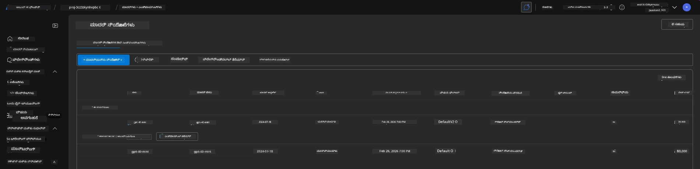
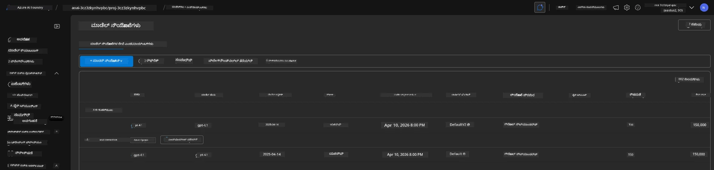

<!--
CO_OP_TRANSLATOR_METADATA:
{
  "original_hash": "6539a34c770f3ceff282370d72ee74dc",
  "translation_date": "2025-11-24T22:30:25+00:00",
  "source_file": "workshop/docs/instructions/6-Teardown-Infrastructure.md",
  "language_code": "kn"
}
-->
# 6. ಮೂಲಸೌಕರ್ಯವನ್ನು ತೆರವುಗೊಳಿಸಿ

!!! tip "ಈ ಘಟಕದ ಅಂತ್ಯದ ವೇಳೆಗೆ ನೀವು ಮಾಡಬಲ್ಲಿರಿ"

    - [ ] ಐಟಂ
    - [ ] ಐಟಂ
    - [ ] ಐಟಂ

---

## ಹೆಚ್ಚುವರಿ ವ್ಯಾಯಾಮಗಳು

ಪ್ರಾಜೆಕ್ಟ್ ತೆರವುಗೊಳಿಸುವ ಮೊದಲು, ಕೆಲವು ನಿಮಿಷಗಳನ್ನು ಮುಕ್ತ ಅಂತ್ಯದ ಅನ್ವೇಷಣೆಗೆ ಮೀಸಲಾಗಿಡಿ.

!!! danger "ನಿತ್ಯಾ-ಟುಡೋ: ಪ್ರಯತ್ನಿಸಲು ಕೆಲವು ಸೂಚನೆಗಳನ್ನು ರೂಪಿಸಿ"

---

## ಮೂಲಸೌಕರ್ಯವನ್ನು ಡಿಪ್ರೊವಿಷನ್ ಮಾಡಿ

1. ಮೂಲಸೌಕರ್ಯವನ್ನು ತೆರವುಗೊಳಿಸುವುದು ಈ ಕೆಳಗಿನಂತೆ ಸುಲಭ:

      ```bash title="" linenums="0"
      azd down --purge
      ```
1. `--purge` ಫ್ಲ್ಯಾಗ್ ನಿಂದ ಸಾಫ್ಟ್-ಡಿಲೀಟ್ ಮಾಡಲಾದ Cognitive Service ಸಂಪತ್ತನ್ನು ಕೂಡಾ ತೆರವುಗೊಳಿಸಲಾಗುತ್ತದೆ, ಇದರಿಂದಾಗಿ ಈ ಸಂಪತ್ತಿನಿಂದ ಹಿಡಿದಿರುವ ಕೋಟಾ ಬಿಡುಗಡೆಗೊಳ್ಳುತ್ತದೆ. ಪೂರ್ಣಗೊಂಡ ನಂತರ ನೀವು ಈ ಕೆಳಗಿನಂತೆಯೇ ಏನಾದರೂ ನೋಡಬಹುದು:

      ```bash title="" linenums="0"
      ? Total resources to delete: 11, are you sure you want to continue? Yes
      Deleting your resources can take some time.
      (✓) Done: Deleted resource group rg-nitya-mshack-azd
      (✓) Done: Purging Cognitive Account: aoai-3cz3zkynhvpbc

      SUCCESS: Your application was removed from Azure in 11 minutes 4 seconds.
      ```

1. (ಐಚ್ಛಿಕ) ನೀವು ಈಗ `azd up` ಅನ್ನು ಮತ್ತೆ ಚಲಾಯಿಸಿದರೆ, ಪರಿಸರ ವ್ಯತ್ಯಾಸವನ್ನು ಸ್ಥಳೀಯ `.azure` ಫೋಲ್ಡರ್‌ನಲ್ಲಿ ಬದಲಾಯಿಸಿ (ಮತ್ತು ಉಳಿಸಿ) gpt-4.1 ಮಾದರಿಯನ್ನು ನಿಯೋಜಿಸಲಾಗುತ್ತದೆ ಎಂದು ಗಮನಿಸುತ್ತೀರಿ.

      ಇಲ್ಲಿದೆ ಮಾದರಿ ನಿಯೋಜನೆಗಳು **ಮೊದಲು**:

      

      ಮತ್ತು ಇದು **ನಂತರ**:
      

---

<!-- CO-OP TRANSLATOR DISCLAIMER START -->
**ಅಸಮಾಕ್ಷ್ಯತೆ**:  
ಈ ದಸ್ತಾವೇಜನ್ನು AI ಅನುವಾದ ಸೇವೆ [Co-op Translator](https://github.com/Azure/co-op-translator) ಬಳಸಿ ಅನುವಾದಿಸಲಾಗಿದೆ. ನಾವು ನಿಖರತೆಯಿಗಾಗಿ ಪ್ರಯತ್ನಿಸುತ್ತಿದ್ದರೂ, ದಯವಿಟ್ಟು ಗಮನಿಸಿ, ಸ್ವಯಂಚಾಲಿತ ಅನುವಾದಗಳಲ್ಲಿ ತಪ್ಪುಗಳು ಅಥವಾ ಅಸಮಾಕ್ಷ್ಯತೆಗಳು ಇರಬಹುದು. ಮೂಲ ಭಾಷೆಯಲ್ಲಿರುವ ಮೂಲ ದಸ್ತಾವೇಜು ಪ್ರಾಮಾಣಿಕ ಮೂಲವೆಂದು ಪರಿಗಣಿಸಬೇಕು. ಮಹತ್ವದ ಮಾಹಿತಿಗಾಗಿ, ವೃತ್ತಿಪರ ಮಾನವ ಅನುವಾದವನ್ನು ಶಿಫಾರಸು ಮಾಡಲಾಗುತ್ತದೆ. ಈ ಅನುವಾದವನ್ನು ಬಳಸುವ ಮೂಲಕ ಉಂಟಾಗುವ ಯಾವುದೇ ತಪ್ಪು ಅರ್ಥಗಳ ಅಥವಾ ತಪ್ಪು ವ್ಯಾಖ್ಯಾನಗಳ ಬಗ್ಗೆ ನಾವು ಹೊಣೆಗಾರರಲ್ಲ.
<!-- CO-OP TRANSLATOR DISCLAIMER END -->