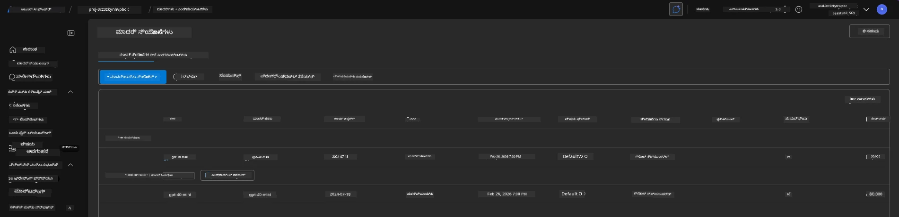
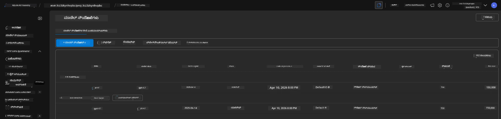

# 6. ಮೂಲಸೌಕರ್ಯವನ್ನು ವಿಸರ್ಜನೆ

!!! tip "ಈ ಉಪಮಾಡ್ಯೂಲ್‌ನ ಅಂತ್ಯಕ್ಕೆ ನೀವು ಈ ಕಾರ್ಯಗಳನ್ನು ಮಾಡಬಲ್ಲಿರಿ"

    - [ ] ಸಂಪನ್ಮೂಲಗಳ ಶುಚಿತೆಯ ಮತ್ತು ವೆಚ್ಚ ನಿರ್ವಹಣೆಯ ಮಹತ್ವವನ್ನು ಅರ್ಥಮಾಡಿಕೊಳ್ಳಿ
    - [ ] ಇನ್ಫ್ರಾಸ್ಟ್ರಕ್ಚರ್ ಅನ್ನು ಸುರಕ್ಷಿತವಾಗಿ ಅನ್‌ಪ್ರೊವಿಷನ್ ಮಾಡಲು `azd down` ಬಳಸಿ
    - [ ] ಅಗತ್ಯವಿದ್ದರೆ ಸಾಫ್ಟ್-ಡಿಲೀಟ್ ಮಾಡಿದ ಕಾಗ್ನಿಟಿವ್ ಸೇವೆಗಳನ್ನು ಪುನರುದ್ಧರಿಸಿಕೊಳ್ಳಿ
    - [ ] **ಲ್ಯಾಬ್ 6:** Azure ಸಂಪನ್ಮೂಲಗಳನ್ನು ಶುದ್ಧಗೊಳಿಸಿ ಮತ್ತು ಅಳಿಸುವಿಕೆಯನ್ನು ಪರಿಶೀಲಿಸಿ

---

## ಹೆಚ್ಚುವರಿ ಅಭ್ಯಾಸಗಳು

Before we tear down the project, take a few minutes to do some open-ended exploration.

!!! info "ಈ ಅನ್ವೇಷಣಾ ಪ್ರಾಂಪ್ಟ್‌ಗಳನ್ನು ಪ್ರಯತ್ನಿಸಿ"

    **GitHub Copilot ಅನ್ನು ಪ್ರಯೋಗಿಸಿ:**
    
    1. ಕೇಳಿ: `ಬಹು-ಏಜೆಂಟ್ ಸಂದರ್ಭಗಳಿಗಾಗಿ ನಾನು ಯಾವ ಇತರೆ AZD ಟೆಂಪ್ಲೇಟ್ಗಳನ್ನು ಪ್ರಯತ್ನಿಸಬಹುದು?`
    2. ಕೇಳಿ: `ಆರೋಗ್ಯ ಸೇವೆಗಳ ಬಳಕೆಗೆ ಏಜೆಂಟ್ ಸೂಚನೆಗಳನ್ನು ನಾನು ಹೇಗೆ ಕಸ್ಟಮೈಸ್ ಮಾಡಬಹುದು?`
    3. ಕೇಳಿ: `ವೆಚ್ಚ ಆಪ್ಟಿಮೈಸೇಶನ್ ಅನ್ನು ನಿಯಂತ್ರಿಸುವ ಪರಿಸರ ವೇರಿಯಬಲ್ಗಳು ಯಾವುವು?`
    
    **Azure ಪೋರ್ಟಲ್ ಅನ್ನು ಅನ್ವೇಷಿಸಿ:**
    
    1. ನಿಮ್ಮ ನಿಯೋಜನೆಗಾಗಿ Application Insights ಮೆಟ್ರಿಕ್‌ಗಳನ್ನು ಪರಿಶೀಲಿಸಿ
    2. ನಿಯೋಜಿಸಿದ ಸಂಪನ್ಮೂಲಗಳ ವೆಚ್ಚ ವಿಶ್ಲೇಷಣೆಯನ್ನು ಪರಿಶೀಲಿಸಿ
    3. Microsoft Foundry ಪೋರ್ಟಲ್ ಏಜೆಂಟ್ ಪ್ಲೇಗ್ರೌಂಡ್ ಅನ್ನು ಮತ್ತೊಮ್ಮೆ ಅನ್ವೇಷಿಸಿ

---

## ಇನ್ಫ್ರಾಸ್ಟ್ರಕ್ಚರ್ ವಿಸರ್ಜನೆ

1. ಇನ್ಫ್ರಾಸ್ಟ್ರಕ್ಚರ್ ಅನ್ನು ವಿಸರ್ಜಿಸುವುದು ಈ ರೀತಿ ಸುಲಭವಾಗಿದೆ:
      
      ```bash title="" linenums="0"
      azd down --purge
      ```
1. `--purge` ಫ್ಲ್ಯಾಗ್ ಸಾಫ್ಟ್-ಡಿಲೀಟ್ ಮಾಡಿದ ಕಾಗ್ನಿಟಿವ್ ಸರ್ವಿಸ್ ಸಂಪನ್ಮೂಲಗಳನ್ನೂ ವಿಸರ್ಜಿಸುವಂತೆ ಖಾತ್ರಿಪಡಿಸುತ್ತದೆ, ಇದರ ফলে ಈ ಸಂಪನ್ಮೂಲಗಳ ಮೂಲಕ ಹಿಡಿದುಕೊಳ್ಳಲ್ಪಟ್ಟಿರುವ ಕ್ವೋಟಾವನ್ನು ಬಿಡುಗಡೆ ಮಾಡುತ್ತದೆ. ಪೂರ್ಣಗೊಂಡ ನಂತರ ನೀವು ಹೀಗೆ ಏನಾದರೊಂದು ನೋಡಬಹುದು:
      
      ```bash title="" linenums="0"
      ? Total resources to delete: 11, are you sure you want to continue? Yes
      Deleting your resources can take some time.
      (✓) Done: Deleted resource group rg-nitya-mshack-azd
      (✓) Done: Purging Cognitive Account: aoai-3cz3zkynhvpbc

      SUCCESS: Your application was removed from Azure in 11 minutes 4 seconds.
      ```

1. (ಐಚ್ಛಿಕ) ಈಗ ನೀವು ಮತ್ತೆ `azd up` ಅನ್ನು ರನ್ ಮಾಡಿದರೆ, ಎನ್‌ವೈರನ್ಮೆಂಟ್ ವ್ಯಾರೀಯಬಲ್ ಬದಲಾಗಿರುವುದರಿಂದ (ಮತ್ತು ಸ್ಥಳೀಯ `.azure` ಫೋಲ್ಡರ್‌ನಲ್ಲಿ ಉಳಿಸಲಾಗಿದೆ) gpt-4.1 ಮಾದರಿ ನಿಯೋಜಿತವಾಗುವುದನ್ನು ನೀವು ಗಮನಿಸುತ್ತೀರಿ. 

      ಇಲ್ಲಿದೆ ಮಾದರಿ ನಿಯೋಜನೆಗಳು **ಹಿಂದಿನ ಸ್ಥಿತಿಯಲ್ಲಿ**:

      

      ಮತ್ತು ಇದು **ನಂತರ**:
      

---

<!-- CO-OP TRANSLATOR DISCLAIMER START -->
ನಿರಾಕರಣೆ:
ಈ ದಸ್ತಾವೇಜನ್ನು ಕೃತಕ ಬುದ್ಧಿಮತ್ತೆ (AI) ಆಧಾರಿತ ಅನುವಾದ ಸೇವೆ [Co-op Translator](https://github.com/Azure/co-op-translator) ಬಳಸಿ ಅನುವಾದಿಸಲಾಗಿದೆ. ನಾವು ಶುದ್ಧತೆಗೆ ಪ್ರಯತ್ನಿಸಿದರೂ, ಸ್ವಯಂಚಾಲಿತ ಅನುವಾದಗಳಲ್ಲಿ ತಪ್ಪುಗಳು ಅಥವಾ ಅಸಮರ್ಪಕತೆಗಳು ಇರಬಹುದೆಂದು ದಯವಿಟ್ಟು ಗಮನಿಸಿ. ಮೂಲ ಭಾಷೆಯಲ್ಲಿ ಇರುವ ಮೂಲ ದಸ್ತಾವೇಜೆಯನ್ನು ಅಧಿಕೃತ ಮೂಲವೆಂದು ಪರಿಗಣಿಸಬೇಕು. ಪ್ರಮುಖ ಮಾಹಿತಿಗಾಗಿ ವೃತ್ತಿಪರ ಮಾನವ ಅನುವಾದವನ್ನು ಶಿಫಾರಸು ಮಾಡಲಾಗುತ್ತದೆ. ಈ ಅನುವಾದದ ಬಳಕೆಯಿಂದ ಉಂಟಾಗುವ ಯಾವುದೇ ಅಸಮಂಜಸ್ಯತೆಗಳು ಅಥವಾ ತಪ್ಪು ಅರ್ಥಗಳಿಗೆ ನಾವು ಹೊಣೆಗಾರರಲ್ಲ.
<!-- CO-OP TRANSLATOR DISCLAIMER END -->