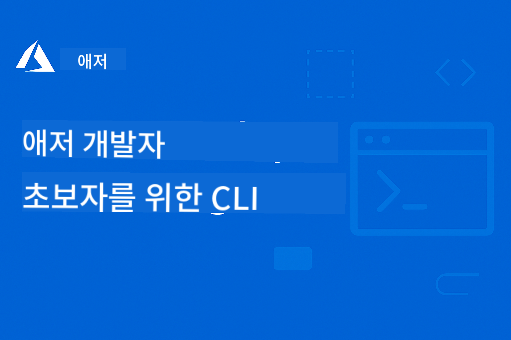

<!--
CO_OP_TRANSLATOR_METADATA:
{
  "original_hash": "6a804be263d09a0fd6f36d6ab251707a",
  "translation_date": "2025-11-25T10:41:38+00:00",
  "source_file": "README.md",
  "language_code": "ko"
}
-->
# AZD 초보자를 위한 학습 여정

 

[](https://GitHub.com/microsoft/azd-for-beginners/watchers/)
[](https://GitHub.com/microsoft/azd-for-beginners/network/)
[](https://GitHub.com/microsoft/azd-for-beginners/stargazers/)

[](https://discord.gg/microsoft-azure)
[](https://discord.gg/nTYy5BXMWG)

## 이 과정 시작하기

AZD 학습 여정을 시작하려면 다음 단계를 따르세요:

1. **저장소 포크하기**: 클릭 [](https://GitHub.com/microsoft/azd-for-beginners/fork)
2. **저장소 클론하기**: `git clone https://github.com/microsoft/azd-for-beginners.git`
3. **커뮤니티 참여하기**: [Azure Discord 커뮤니티](https://discord.com/invite/ByRwuEEgH4)에서 전문가 지원 받기
4. **학습 경로 선택하기**: 아래에서 자신의 경험 수준에 맞는 챕터를 선택하세요

### 다국어 지원

#### 자동 번역 (항상 최신 상태)

<!-- CO-OP TRANSLATOR LANGUAGES TABLE START -->
[아랍어](../ar/README.md) | [벵골어](../bn/README.md) | [불가리아어](../bg/README.md) | [버마어 (미얀마)](../my/README.md) | [중국어 (간체)](../zh/README.md) | [중국어 (번체, 홍콩)](../hk/README.md) | [중국어 (번체, 마카오)](../mo/README.md) | [중국어 (번체, 대만)](../tw/README.md) | [크로아티아어](../hr/README.md) | [체코어](../cs/README.md) | [덴마크어](../da/README.md) | [네덜란드어](../nl/README.md) | [에스토니아어](../et/README.md) | [핀란드어](../fi/README.md) | [프랑스어](../fr/README.md) | [독일어](../de/README.md) | [그리스어](../el/README.md) | [히브리어](../he/README.md) | [힌디어](../hi/README.md) | [헝가리어](../hu/README.md) | [인도네시아어](../id/README.md) | [이탈리아어](../it/README.md) | [일본어](../ja/README.md) | [칸나다어](../kn/README.md) | [한국어](./README.md) | [리투아니아어](../lt/README.md) | [말레이어](../ms/README.md) | [말라얄람어](../ml/README.md) | [마라티어](../mr/README.md) | [네팔어](../ne/README.md) | [나이지리아 피진어](../pcm/README.md) | [노르웨이어](../no/README.md) | [페르시아어 (파르시)](../fa/README.md) | [폴란드어](../pl/README.md) | [포르투갈어 (브라질)](../br/README.md) | [포르투갈어 (포르투갈)](../pt/README.md) | [펀자브어 (구르무키)](../pa/README.md) | [루마니아어](../ro/README.md) | [러시아어](../ru/README.md) | [세르비아어 (키릴)](../sr/README.md) | [슬로바키아어](../sk/README.md) | [슬로베니아어](../sl/README.md) | [스페인어](../es/README.md) | [스와힐리어](../sw/README.md) | [스웨덴어](../sv/README.md) | [타갈로그어 (필리핀)](../tl/README.md) | [타밀어](../ta/README.md) | [텔루구어](../te/README.md) | [태국어](../th/README.md) | [터키어](../tr/README.md) | [우크라이나어](../uk/README.md) | [우르두어](../ur/README.md) | [베트남어](../vi/README.md)
<!-- CO-OP TRANSLATOR LANGUAGES TABLE END -->

## 과정 개요

Azure Developer CLI (azd)를 체계적인 챕터를 통해 마스터하세요. **Microsoft Foundry와의 통합을 통해 AI 애플리케이션 배포에 특별히 초점을 맞췄습니다.**

### 이 과정이 현대 개발자에게 필수적인 이유

Microsoft Foundry Discord 커뮤니티의 통찰에 따르면, **개발자의 45%가 AI 워크로드를 위해 AZD를 사용하고 싶어하지만** 다음과 같은 문제를 겪고 있습니다:
- 복잡한 다중 서비스 AI 아키텍처
- 프로덕션 AI 배포 모범 사례  
- Azure AI 서비스 통합 및 구성
- AI 워크로드 비용 최적화
- AI 특화 배포 문제 해결

### 학습 목표

이 체계적인 과정을 완료하면 다음을 배울 수 있습니다:
- **AZD 기본 사항 마스터**: 핵심 개념, 설치 및 구성
- **AI 애플리케이션 배포**: Microsoft Foundry 서비스를 활용한 AZD 사용
- **코드로 인프라 구현**: Bicep 템플릿을 사용하여 Azure 리소스 관리
- **배포 문제 해결**: 일반적인 문제 해결 및 디버깅
- **프로덕션 최적화**: 보안, 확장, 모니터링 및 비용 관리
- **다중 에이전트 솔루션 구축**: 복잡한 AI 아키텍처 배포

## 📚 학습 챕터

*경험 수준과 목표에 따라 학습 경로를 선택하세요*

### 🚀 챕터 1: 기초 및 빠른 시작
**필수 조건**: Azure 구독, 기본 명령줄 지식  
**소요 시간**: 30-45분  
**난이도**: ⭐

#### 학습 내용
- Azure Developer CLI 기본 사항 이해
- 플랫폼에 AZD 설치
- 첫 번째 성공적인 배포

#### 학습 자료
- **🎯 시작하기**: [Azure Developer CLI란 무엇인가?](../..)
- **📖 이론**: [AZD 기본 사항](docs/getting-started/azd-basics.md) - 핵심 개념 및 용어
- **⚙️ 설정**: [설치 및 설정](docs/getting-started/installation.md) - 플랫폼별 가이드
- **🛠️ 실습**: [첫 번째 프로젝트](docs/getting-started/first-project.md) - 단계별 튜토리얼
- **📋 빠른 참조**: [명령어 치트 시트](resources/cheat-sheet.md)

#### 실습 과제
```bash
# 빠른 설치 확인
azd version

# 첫 번째 애플리케이션 배포
azd init --template todo-nodejs-mongo
azd up
```

**💡 챕터 결과**: AZD를 사용하여 간단한 웹 애플리케이션을 Azure에 성공적으로 배포

**✅ 성공 검증:**
```bash
# 1장을 완료한 후, 다음을 수행할 수 있어야 합니다:
azd version              # 설치된 버전을 표시합니다
azd init --template todo-nodejs-mongo  # 프로젝트를 초기화합니다
azd up                  # Azure에 배포합니다
azd show                # 실행 중인 앱 URL을 표시합니다
# 애플리케이션이 브라우저에서 열리고 작동합니다
azd down --force --purge  # 리소스를 정리합니다
```

**📊 투자 시간:** 30-45분  
**📈 학습 후 수준:** 기본 애플리케이션을 독립적으로 배포 가능

**✅ 성공 검증:**
```bash
# 1장을 완료한 후, 다음을 수행할 수 있어야 합니다:
azd version              # 설치된 버전을 표시합니다
azd init --template todo-nodejs-mongo  # 프로젝트를 초기화합니다
azd up                  # Azure에 배포합니다
azd show                # 실행 중인 앱 URL을 표시합니다
# 애플리케이션이 브라우저에서 열리고 작동합니다
azd down --force --purge  # 리소스를 정리합니다
```

**📊 투자 시간:** 30-45분  
**📈 학습 후 수준:** 기본 애플리케이션을 독립적으로 배포 가능

---

### 🤖 챕터 2: AI 중심 개발 (AI 개발자 추천)
**필수 조건**: 챕터 1 완료  
**소요 시간**: 1-2시간  
**난이도**: ⭐⭐

#### 학습 내용
- AZD와 Microsoft Foundry 통합
- AI 기반 애플리케이션 배포
- AI 서비스 구성 이해

#### 학습 자료
- **🎯 시작하기**: [Microsoft Foundry 통합](docs/microsoft-foundry/microsoft-foundry-integration.md)
- **📖 패턴**: [AI 모델 배포](docs/microsoft-foundry/ai-model-deployment.md) - AI 모델 배포 및 관리
- **🛠️ 워크숍**: [AI 워크숍 랩](docs/microsoft-foundry/ai-workshop-lab.md) - AZD에 적합한 AI 솔루션 만들기
- **🎥 인터랙티브 가이드**: [워크숍 자료](workshop/README.md) - MkDocs * DevContainer 환경을 활용한 브라우저 기반 학습
- **📋 템플릿**: [Microsoft Foundry 템플릿](../..)
- **📝 예제**: [AZD 배포 예제](examples/README.md)

#### 실습 과제
```bash
# 첫 번째 AI 애플리케이션 배포하기
azd init --template azure-search-openai-demo
azd up

# 추가 AI 템플릿 사용해보기
azd init --template openai-chat-app-quickstart
azd init --template agent-openai-python-prompty
```

**💡 챕터 결과**: RAG 기능을 갖춘 AI 기반 채팅 애플리케이션 배포 및 구성

**✅ 성공 검증:**
```bash
# 2장 이후에는 다음을 수행할 수 있어야 합니다:
azd init --template azure-search-openai-demo
azd up
# AI 채팅 인터페이스를 테스트합니다
# 질문을 하고 출처가 포함된 AI 기반 응답을 받습니다
# 검색 통합이 작동하는지 확인합니다
azd monitor  # Application Insights가 텔레메트리를 표시하는지 확인합니다
azd down --force --purge
```

**📊 투자 시간:** 1-2시간  
**📈 학습 후 수준:** 프로덕션 준비된 AI 애플리케이션 배포 및 구성 가능  
**💰 비용 인식:** 개발 환경 월 $80-150, 프로덕션 환경 월 $300-3500 예상 비용 이해

#### 💰 AI 배포 비용 고려 사항

**개발 환경 (월 $80-150 예상):**
- Azure OpenAI (사용량 기반): 월 $0-50 (토큰 사용량에 따라)
- AI 검색 (기본 등급): 월 $75
- 컨테이너 앱 (소비 기반): 월 $0-20
- 스토리지 (표준): 월 $1-5

**프로덕션 환경 (월 $300-3,500+ 예상):**
- Azure OpenAI (PTU로 안정적인 성능 제공): 월 $3,000+ 또는 고용량 사용 시 사용량 기반
- AI 검색 (표준 등급): 월 $250
- 컨테이너 앱 (전용): 월 $50-100
- 애플리케이션 인사이트: 월 $5-50
- 스토리지 (프리미엄): 월 $10-50

**💡 비용 최적화 팁:**
- 학습을 위해 **무료 등급** Azure OpenAI 사용 (월 50,000 토큰 포함)
- 개발 중이 아닐 때 `azd down`을 실행하여 리소스 할당 해제
- 소비 기반 청구로 시작하고 프로덕션 시 PTU로 업그레이드
- 배포 전에 `azd provision --preview`를 실행하여 비용 추정
- 자동 확장 활성화: 실제 사용량에만 비용 지불

**비용 모니터링:**
```bash
# 예상 월 비용 확인
azd provision --preview

# Azure 포털에서 실제 비용 모니터링
az consumption budget list --resource-group <your-rg>
```

---

### ⚙️ 챕터 3: 구성 및 인증
**필수 조건**: 챕터 1 완료  
**소요 시간**: 45-60분  
**난이도**: ⭐⭐

#### 학습 내용
- 환경 구성 및 관리
- 인증 및 보안 모범 사례
- 리소스 명명 및 조직화

#### 학습 자료
- **📖 구성**: [구성 가이드](docs/getting-started/configuration.md) - 환경 설정
- **🔐 보안**: [인증 패턴 및 관리 ID](docs/getting-started/authsecurity.md) - 인증 패턴
- **📝 예제**: [데이터베이스 앱 예제](examples/database-app/README.md) - AZD 데이터베이스 예제

#### 실습 과제
- 여러 환경 구성 (개발, 스테이징, 프로덕션)
- 관리 ID 인증 설정
- 환경별 구성 구현

**💡 챕터 결과**: 적절한 인증 및 보안을 갖춘 여러 환경 관리

---

### 🏗️ 챕터 4: 코드로 인프라 구현 및 배포
**필수 조건**: 챕터 1-3 완료  
**소요 시간**: 1-1.5시간  
**난이도**: ⭐⭐⭐

#### 학습 내용
- 고급 배포 패턴
- Bicep을 활용한 코드로 인프라 구현
- 리소스 프로비저닝 전략

#### 학습 자료
- **📖 배포**: [배포 가이드](docs/deployment/deployment-guide.md) - 전체 워크플로
- **🏗️ 프로비저닝**: [리소스 프로비저닝](docs/deployment/provisioning.md) - Azure 리소스 관리
- **📝 예제**: [컨테이너 앱 예제](../../examples/container-app) - 컨테이너화된 배포

#### 실습 과제
- 맞춤형 Bicep 템플릿 생성
- 다중 서비스 애플리케이션 배포
- 블루-그린 배포 전략 구현

**💡 챕터 결과**: 맞춤형 인프라 템플릿을 사용하여 복잡한 다중 서비스 애플리케이션 배포

---

### 🎯 챕터 5: 다중 에이전트 AI 솔루션 (고급)
**필수 조건**: 챕터 1-2 완료  
**소요 시간**: 2-3시간  
**난이도**: ⭐⭐⭐⭐

#### 학습 내용
- 다중 에이전트 아키텍처 패턴
- 에이전트 오케스트레이션 및 조정
- 프로덕션 준비된 AI 배포

#### 학습 자료
- **🤖 추천 프로젝트**: [소매 다중 에이전트 솔루션](examples/retail-scenario.md) - 완전한 구현
- **🛠️ ARM 템플릿**: [ARM 템플릿 패키지](../../examples/retail-multiagent-arm-template) - 원클릭 배포
- **📖 아키텍처**: [멀티 에이전트 조정 패턴](/docs/pre-deployment/coordination-patterns.md) - 패턴

#### 실습 과제
```bash
# 전체 소매 다중 에이전트 솔루션 배포
cd examples/retail-multiagent-arm-template
./deploy.sh

# 에이전트 구성 탐색
az deployment group show --resource-group <rg-name> --name <deployment-name>
```

**💡 챕터 목표**: 고객 및 재고 에이전트를 활용한 프로덕션 준비 완료 멀티 에이전트 AI 솔루션 배포 및 관리

---

### 🔍 챕터 6: 사전 배포 검증 및 계획
**선행 조건**: 챕터 4 완료  
**소요 시간**: 1시간  
**난이도**: ⭐⭐

#### 학습 내용
- 용량 계획 및 리소스 검증
- SKU 선택 전략
- 사전 점검 및 자동화

#### 학습 자료
- **📊 계획**: [용량 계획](docs/pre-deployment/capacity-planning.md) - 리소스 검증
- **💰 선택**: [SKU 선택](docs/pre-deployment/sku-selection.md) - 비용 효율적인 선택
- **✅ 검증**: [사전 점검](docs/pre-deployment/preflight-checks.md) - 자동화 스크립트

#### 실습 과제
- 용량 검증 스크립트 실행
- 비용 최적화를 위한 SKU 선택
- 자동화된 사전 배포 점검 구현

**💡 챕터 목표**: 실행 전에 배포를 검증하고 최적화

---

### 🚨 챕터 7: 문제 해결 및 디버깅
**선행 조건**: 배포 관련 챕터 중 하나 완료  
**소요 시간**: 1-1.5시간  
**난이도**: ⭐⭐

#### 학습 내용
- 체계적인 디버깅 접근법
- 일반적인 문제와 해결책
- AI 관련 문제 해결

#### 학습 자료
- **🔧 일반 문제**: [일반 문제](docs/troubleshooting/common-issues.md) - FAQ 및 해결책
- **🕵️ 디버깅**: [디버깅 가이드](docs/troubleshooting/debugging.md) - 단계별 전략
- **🤖 AI 문제**: [AI 관련 문제 해결](docs/troubleshooting/ai-troubleshooting.md) - AI 서비스 문제

#### 실습 과제
- 배포 실패 진단
- 인증 문제 해결
- AI 서비스 연결 디버깅

**💡 챕터 목표**: 일반적인 배포 문제를 독립적으로 진단하고 해결

---

### 🏢 챕터 8: 프로덕션 및 엔터프라이즈 패턴
**선행 조건**: 챕터 1-4 완료  
**소요 시간**: 2-3시간  
**난이도**: ⭐⭐⭐⭐

#### 학습 내용
- 프로덕션 배포 전략
- 엔터프라이즈 보안 패턴
- 모니터링 및 비용 최적화

#### 학습 자료
- **🏭 프로덕션**: [프로덕션 AI 모범 사례](docs/microsoft-foundry/production-ai-practices.md) - 엔터프라이즈 패턴
- **📝 예제**: [마이크로서비스 예제](../../examples/microservices) - 복잡한 아키텍처
- **📊 모니터링**: [Application Insights 통합](docs/pre-deployment/application-insights.md) - 모니터링

#### 실습 과제
- 엔터프라이즈 보안 패턴 구현
- 종합적인 모니터링 설정
- 적절한 거버넌스를 통해 프로덕션 배포

**💡 챕터 목표**: 완전한 프로덕션 기능을 갖춘 엔터프라이즈 애플리케이션 배포

---

## 🎓 워크숍 개요: 실습 학습 경험

> **⚠️ 워크숍 상태: 개발 중**  
> 워크숍 자료는 현재 개발 및 개선 중입니다. 핵심 모듈은 작동하지만 일부 고급 섹션은 미완성 상태입니다. 모든 콘텐츠를 완성하기 위해 적극적으로 작업 중입니다. [진행 상황 추적 →](workshop/README.md)

### 대화형 워크숍 자료
**브라우저 기반 도구와 가이드된 실습을 통한 종합적인 학습**

워크숍 자료는 위의 챕터 기반 커리큘럼을 보완하는 구조화된 대화형 학습 경험을 제공합니다. 워크숍은 자율 학습과 강사 주도 세션 모두에 적합하게 설계되었습니다.

#### 🛠️ 워크숍 기능
- **브라우저 기반 인터페이스**: 검색, 복사, 테마 기능이 포함된 MkDocs 기반 워크숍
- **GitHub Codespaces 통합**: 원클릭 개발 환경 설정
- **구조화된 학습 경로**: 7단계 가이드 실습 (총 3.5시간)
- **발견 → 배포 → 맞춤화**: 점진적 방법론
- **대화형 DevContainer 환경**: 사전 구성된 도구 및 종속성

#### 📚 워크숍 구조
워크숍은 **발견 → 배포 → 맞춤화** 방법론을 따릅니다:

1. **발견 단계** (45분)
   - Microsoft Foundry 템플릿 및 서비스 탐색
   - 멀티 에이전트 아키텍처 패턴 이해
   - 배포 요구 사항 및 선행 조건 검토

2. **배포 단계** (2시간)
   - AZD를 사용한 AI 애플리케이션 배포 실습
   - Azure AI 서비스 및 엔드포인트 구성
   - 보안 및 인증 패턴 구현

3. **맞춤화 단계** (45분)
   - 특정 사용 사례에 맞게 애플리케이션 수정
   - 프로덕션 배포를 위한 최적화
   - 모니터링 및 비용 관리 구현

#### 🚀 워크숍 시작하기
```bash
# 옵션 1: GitHub Codespaces (권장)
# 저장소에서 "Code" → "Create codespace on main"을 클릭하세요

# 옵션 2: 로컬 개발
git clone https://github.com/microsoft/azd-for-beginners.git
cd azd-for-beginners/workshop
# workshop/README.md의 설정 지침을 따르세요
```

#### 🎯 워크숍 학습 목표
워크숍을 완료하면 참가자는 다음을 수행할 수 있습니다:
- **프로덕션 AI 애플리케이션 배포**: Microsoft Foundry 서비스를 활용한 AZD 사용
- **멀티 에이전트 아키텍처 마스터**: 조정된 AI 에이전트 솔루션 구현
- **보안 모범 사례 구현**: 인증 및 액세스 제어 구성
- **확장성 최적화**: 비용 효율적이고 성능이 뛰어난 배포 설계
- **배포 문제 해결**: 일반적인 문제를 독립적으로 해결

#### 📖 워크숍 자료
- **🎥 대화형 가이드**: [워크숍 자료](workshop/README.md) - 브라우저 기반 학습 환경
- **📋 단계별 지침**: [가이드 실습](../../workshop/docs/instructions) - 상세한 워크스루
- **🛠️ AI 워크숍 랩**: [AI 워크숍 랩](docs/microsoft-foundry/ai-workshop-lab.md) - AI 중심 실습
- **💡 빠른 시작**: [워크숍 설정 가이드](workshop/README.md#quick-start) - 환경 구성

**적합 대상**: 기업 교육, 대학 강의, 자율 학습, 개발자 부트캠프

---

## 📖 Azure Developer CLI란?

Azure Developer CLI(azd)는 Azure에 애플리케이션을 빌드하고 배포하는 과정을 가속화하는 개발자 중심의 명령줄 인터페이스입니다. 주요 기능은 다음과 같습니다:

- **템플릿 기반 배포** - 일반적인 애플리케이션 패턴을 위한 사전 빌드 템플릿 사용
- **코드로서의 인프라** - Bicep 또는 Terraform을 사용하여 Azure 리소스 관리  
- **통합 워크플로우** - 애플리케이션 프로비저닝, 배포, 모니터링을 원활하게 수행
- **개발자 친화적** - 개발자 생산성과 경험을 최적화

### **AZD + Microsoft Foundry: AI 배포에 최적화**

**AI 솔루션에 AZD를 사용하는 이유?** AZD는 AI 개발자가 직면하는 주요 과제를 해결합니다:

- **AI 준비 템플릿** - Azure OpenAI, Cognitive Services, ML 워크로드를 위한 사전 구성 템플릿
- **안전한 AI 배포** - AI 서비스, API 키, 모델 엔드포인트를 위한 내장 보안 패턴  
- **프로덕션 AI 패턴** - 확장 가능하고 비용 효율적인 AI 애플리케이션 배포를 위한 모범 사례
- **엔드 투 엔드 AI 워크플로우** - 모델 개발부터 프로덕션 배포까지 적절한 모니터링 포함
- **비용 최적화** - AI 워크로드를 위한 스마트 리소스 할당 및 확장 전략
- **Microsoft Foundry 통합** - Microsoft Foundry 모델 카탈로그 및 엔드포인트와의 원활한 연결

---

## 🎯 템플릿 및 예제 라이브러리

### 추천: Microsoft Foundry 템플릿
**AI 애플리케이션 배포를 시작하려면 여기서 시작하세요!**

> **참고:** 이 템플릿은 다양한 AI 패턴을 보여줍니다. 일부는 외부 Azure 샘플이고, 일부는 로컬 구현입니다.

| 템플릿 | 챕터 | 난이도 | 서비스 | 유형 |
|----------|---------|------------|----------|------|
| [**AI 채팅 시작하기**](https://github.com/Azure-Samples/get-started-with-ai-chat) | 챕터 2 | ⭐⭐ | AzureOpenAI + Azure AI 모델 추론 API + Azure AI 검색 + Azure 컨테이너 앱 + Application Insights | 외부 |
| [**AI 에이전트 시작하기**](https://github.com/Azure-Samples/get-started-with-ai-agents) | 챕터 2 | ⭐⭐ | Azure AI 에이전트 서비스 + AzureOpenAI + Azure AI 검색 + Azure 컨테이너 앱 + Application Insights| 외부 |
| [**Azure 검색 + OpenAI 데모**](https://github.com/Azure-Samples/azure-search-openai-demo) | 챕터 2 | ⭐⭐ | AzureOpenAI + Azure AI 검색 + 앱 서비스 + 스토리지 | 외부 |
| [**OpenAI 채팅 앱 빠른 시작**](https://github.com/Azure-Samples/openai-chat-app-quickstart) | 챕터 2 | ⭐ | AzureOpenAI + 컨테이너 앱 + Application Insights | 외부 |
| [**에이전트 OpenAI Python Prompty**](https://github.com/Azure-Samples/agent-openai-python-prompty) | 챕터 5 | ⭐⭐⭐ | AzureOpenAI + Azure Functions + Prompty | 외부 |
| [**Contoso Chat RAG**](https://github.com/Azure-Samples/contoso-chat) | 챕터 8 | ⭐⭐⭐⭐ | AzureOpenAI + AI 검색 + Cosmos DB + 컨테이너 앱 | 외부 |
| [**리테일 멀티 에이전트 솔루션**](examples/retail-scenario.md) | 챕터 5 | ⭐⭐⭐⭐ | AzureOpenAI + AI 검색 + 스토리지 + 컨테이너 앱 + Cosmos DB | **로컬** |

### 추천: 완전한 학습 시나리오
**학습 챕터에 매핑된 프로덕션 준비 애플리케이션 템플릿**

| 템플릿 | 학습 챕터 | 난이도 | 주요 학습 |
|----------|------------------|------------|--------------|
| [**openai-chat-app-quickstart**](https://github.com/Azure-Samples/openai-chat-app-quickstart) | 챕터 2 | ⭐ | 기본 AI 배포 패턴 |
| [**azure-search-openai-demo**](https://github.com/Azure-Samples/azure-search-openai-demo) | 챕터 2 | ⭐⭐ | Azure AI 검색을 활용한 RAG 구현 |
| [**ai-document-processing**](https://github.com/Azure-Samples/ai-document-processing) | 챕터 4 | ⭐⭐ | 문서 인텔리전스 통합 |
| [**agent-openai-python-prompty**](https://github.com/Azure-Samples/agent-openai-python-prompty) | 챕터 5 | ⭐⭐⭐ | 에이전트 프레임워크 및 함수 호출 |
| [**contoso-chat**](https://github.com/Azure-Samples/contoso-chat) | 챕터 8 | ⭐⭐⭐ | 엔터프라이즈 AI 오케스트레이션 |
| [**retail-multi-agent-solution**](examples/retail-scenario.md) | 챕터 5 | ⭐⭐⭐⭐ | 고객 및 재고 에이전트를 포함한 멀티 에이전트 아키텍처 |

### 예제 유형별 학습

> **📌 로컬 vs. 외부 예제:**  
> **로컬 예제** (이 저장소 내) = 즉시 사용 가능  
> **외부 예제** (Azure 샘플) = 링크된 저장소에서 복제

#### 로컬 예제 (즉시 사용 가능)
- [**리테일 멀티 에이전트 솔루션**](examples/retail-scenario.md) - ARM 템플릿을 사용한 완전한 프로덕션 준비 구현
  - 멀티 에이전트 아키텍처 (고객 + 재고 에이전트)
  - 종합적인 모니터링 및 평가
  - ARM 템플릿을 통한 원클릭 배포

#### 로컬 예제 - 컨테이너 애플리케이션 (챕터 2-5)
**이 저장소의 종합적인 컨테이너 배포 예제:**
- [**컨테이너 앱 예제**](examples/container-app/README.md) - 컨테이너화된 배포에 대한 완전한 가이드
  - [간단한 Flask API](../../examples/container-app/simple-flask-api) - 스케일 투 제로 기능이 있는 기본 REST API
  - [마이크로서비스 아키텍처](../../examples/container-app/microservices) - 프로덕션 준비 다중 서비스 배포
  - 빠른 시작, 프로덕션, 고급 배포 패턴
  - 모니터링, 보안, 비용 최적화 가이드

#### 외부 예제 - 간단한 애플리케이션 (챕터 1-2)
**이 Azure 샘플 저장소를 복제하여 시작하세요:**
- [간단한 웹 앱 - Node.js + MongoDB](https://github.com/Azure-Samples/todo-nodejs-mongo) - 기본 배포 패턴
- [정적 웹사이트 - React SPA](https://github.com/Azure-Samples/todo-csharp-sql-swa-func) - 정적 콘텐츠 배포
- [컨테이너 앱 - Python Flask](https://github.com/Azure-Samples/container-apps-store-api-microservice) - REST API 배포

#### 외부 예제 - 데이터베이스 통합 (챕터 3-4)  
- [데이터베이스 앱 - C# + SQL](https://github.com/Azure-Samples/todo-csharp-sql) - 데이터베이스 연결 패턴
- [Functions + Cosmos DB](https://github.com/Azure-Samples/todo-python-mongo-swa-func) - 서버리스 데이터 워크플로우

#### 외부 예제 - 고급 패턴 (챕터 4-8)
- [Java 마이크로서비스](https://github.com/Azure-Samples/java-microservices-aca-lab) - 다중 서비스 아키텍처
- [컨테이너 앱 작업](https://github.com/Azure-Samples/container-apps-jobs) - 백그라운드 처리  
- [엔터프라이즈 ML 파이프라인](https://github.com/Azure-Samples/mlops-v2) - 프로덕션 준비 ML 패턴

### 외부 템플릿 컬렉션
- [**공식 AZD 템플릿 갤러리**](https://azure.github.io/awesome-azd/) - 공식 및 커뮤니티 템플릿의 큐레이션된 컬렉션
- [**Azure Developer CLI 템플릿**](https://learn.microsoft.com/en-us/azure/developer/azure-developer-cli/azd-templates) - Microsoft Learn 템플릿 문서
- [**예제 디렉토리**](examples/README.md) - 상세 설명이 포함된 로컬 학습 예제

---

## 📚 학습 자료 및 참고 문헌

### 빠른 참고
- [**명령어 치트 시트**](resources/cheat-sheet.md) - 챕터별로 정리된 필수 azd 명령어
- [**용어집**](resources/glossary.md) - Azure 및 azd 관련 용어  
- [**FAQ**](resources/faq.md) - 학습 챕터별로 정리된 자주 묻는 질문
- [**학습 가이드**](resources/study-guide.md) - 포괄적인 실습 문제

### 실습 워크숍
- [**AI 워크숍 랩**](docs/microsoft-foundry/ai-workshop-lab.md) - AI 솔루션을 AZD로 배포 가능하게 만들기 (2-3시간 소요)
- [**인터랙티브 워크숍 가이드**](workshop/README.md) - MkDocs와 DevContainer 환경을 활용한 브라우저 기반 워크숍
- [**구조화된 학습 경로**](../../workshop/docs/instructions) - 7단계로 구성된 가이드 실습 (발견 → 배포 → 맞춤화)
- [**AZD 초보자 워크숍**](workshop/README.md) - GitHub Codespaces 통합을 포함한 완전한 실습 워크숍 자료

### 외부 학습 자료
- [Azure Developer CLI 문서](https://learn.microsoft.com/en-us/azure/developer/azure-developer-cli/)
- [Azure 아키텍처 센터](https://learn.microsoft.com/en-us/azure/architecture/)
- [Azure 가격 계산기](https://azure.microsoft.com/pricing/calculator/)
- [Azure 상태](https://status.azure.com/)

---

## 🔧 빠른 문제 해결 가이드

**초보자가 자주 겪는 문제와 즉각적인 해결 방법:**

### ❌ "azd: 명령어를 찾을 수 없음"

```bash
# 먼저 AZD를 설치하세요
# Windows (PowerShell):
winget install microsoft.azd

# macOS:
brew tap azure/azd && brew install azd

# Linux:
curl -fsSL https://aka.ms/install-azd.sh | bash

# 설치 확인
azd version
```

### ❌ "구독을 찾을 수 없음" 또는 "구독이 설정되지 않음"

```bash
# 사용 가능한 구독 목록
az account list --output table

# 기본 구독 설정
az account set --subscription "<subscription-id-or-name>"

# AZD 환경에 설정
azd env set AZURE_SUBSCRIPTION_ID "<subscription-id>"

# 확인
az account show
```

### ❌ "InsufficientQuota" 또는 "할당량 초과"

```bash
# 다른 Azure 지역을 시도하세요
azd env set AZURE_LOCATION "westus2"
azd up

# 개발에서 더 작은 SKU를 사용하세요
# infra/main.parameters.json을 편집하세요
{
  "sku": "B1"  // Instead of "P1V2"
}
```

### ❌ "azd up"이 중간에 실패함

```bash
# 옵션 1: 정리하고 다시 시도
azd down --force --purge
azd up

# 옵션 2: 인프라만 수정
azd provision

# 옵션 3: 상세 로그 확인
azd show
azd logs
```

### ❌ "인증 실패" 또는 "토큰 만료됨"

```bash
# 다시 인증
az logout
az login

azd auth logout
azd auth login

# 인증 확인
az account show
```

### ❌ "리소스가 이미 존재함" 또는 이름 충돌

```bash
# AZD는 고유한 이름을 생성하지만, 충돌이 발생하면:
azd down --force --purge

# 새 환경으로 다시 시도하십시오.
azd env new dev-v2
azd up
```

### ❌ 템플릿 배포가 너무 오래 걸림

**일반적인 대기 시간:**
- 간단한 웹 앱: 5-10분
- 데이터베이스 포함 앱: 10-15분
- AI 애플리케이션: 15-25분 (OpenAI 프로비저닝은 느림)

```bash
# 진행 상황 확인
azd show

# 30분 이상 멈춰있으면 Azure 포털 확인:
azd monitor
# 실패한 배포를 찾아보세요
```

### ❌ "권한 거부됨" 또는 "금지됨"

```bash
# Azure 역할을 확인하세요
az role assignment list --assignee $(az account show --query user.name -o tsv)

# 최소 "Contributor" 역할이 필요합니다
# Azure 관리자에게 다음 권한을 요청하세요:
# - Contributor (리소스용)
# - User Access Administrator (역할 할당용)
```

### ❌ 배포된 애플리케이션 URL을 찾을 수 없음

```bash
# 모든 서비스 엔드포인트 표시
azd show

# 또는 Azure 포털 열기
azd monitor

# 특정 서비스 확인
azd env get-values
# *_URL 변수 찾기
```

### 📚 전체 문제 해결 자료

- **일반적인 문제 가이드:** [자세한 해결 방법](docs/troubleshooting/common-issues.md)
- **AI 관련 문제:** [AI 문제 해결](docs/troubleshooting/ai-troubleshooting.md)
- **디버깅 가이드:** [단계별 디버깅](docs/troubleshooting/debugging.md)
- **도움 받기:** [Azure Discord](https://discord.gg/microsoft-azure) #azure-developer-cli

---

## 🔧 빠른 문제 해결 가이드

**초보자가 자주 겪는 문제와 즉각적인 해결 방법:**

<details>
<summary><strong>❌ "azd: 명령어를 찾을 수 없음"</strong></summary>

```bash
# 먼저 AZD를 설치하세요
# Windows (PowerShell):
winget install microsoft.azd

# macOS:
brew tap azure/azd && brew install azd

# Linux:
curl -fsSL https://aka.ms/install-azd.sh | bash

# 설치 확인
azd version
```
</details>

<details>
<summary><strong>❌ "구독을 찾을 수 없음" 또는 "구독이 설정되지 않음"</strong></summary>

```bash
# 사용 가능한 구독 목록
az account list --output table

# 기본 구독 설정
az account set --subscription "<subscription-id-or-name>"

# AZD 환경에 설정
azd env set AZURE_SUBSCRIPTION_ID "<subscription-id>"

# 확인
az account show
```
</details>

<details>
<summary><strong>❌ "InsufficientQuota" 또는 "할당량 초과"</strong></summary>

```bash
# 다른 Azure 지역을 시도하세요
azd env set AZURE_LOCATION "westus2"
azd up

# 개발에서 더 작은 SKU를 사용하세요
# infra/main.parameters.json을 편집하세요
{
  "sku": "B1"  // Instead of "P1V2"
}
```
</details>

<details>
<summary><strong>❌ "azd up"이 중간에 실패함"</strong></summary>

```bash
# 옵션 1: 정리하고 다시 시도
azd down --force --purge
azd up

# 옵션 2: 인프라만 수정
azd provision

# 옵션 3: 상세 로그 확인
azd show
azd logs
```
</details>

<details>
<summary><strong>❌ "인증 실패" 또는 "토큰 만료됨"</strong></summary>

```bash
# 재인증
az logout
az login

azd auth logout
azd auth login

# 인증 확인
az account show
```
</details>

<details>
<summary><strong>❌ "리소스가 이미 존재함" 또는 이름 충돌"</strong></summary>

```bash
# AZD는 고유한 이름을 생성하지만, 충돌이 발생하면:
azd down --force --purge

# 새 환경으로 다시 시도하십시오.
azd env new dev-v2
azd up
```
</details>

<details>
<summary><strong>❌ 템플릿 배포가 너무 오래 걸림"</strong></summary>

**일반적인 대기 시간:**
- 간단한 웹 앱: 5-10분
- 데이터베이스 포함 앱: 10-15분
- AI 애플리케이션: 15-25분 (OpenAI 프로비저닝은 느림)

```bash
# 진행 상황 확인
azd show

# 30분 이상 멈춰있으면 Azure 포털 확인:
azd monitor
# 실패한 배포를 찾아보세요
```
</details>

<details>
<summary><strong>❌ "권한 거부됨" 또는 "금지됨"</strong></summary>

```bash
# Azure 역할을 확인하세요
az role assignment list --assignee $(az account show --query user.name -o tsv)

# 최소 "Contributor" 역할이 필요합니다
# Azure 관리자에게 다음 권한을 요청하세요:
# - Contributor (리소스용)
# - User Access Administrator (역할 할당용)
```
</details>

<details>
<summary><strong>❌ 배포된 애플리케이션 URL을 찾을 수 없음"</strong></summary>

```bash
# 모든 서비스 엔드포인트 표시
azd show

# 또는 Azure 포털 열기
azd monitor

# 특정 서비스 확인
azd env get-values
# *_URL 변수 찾기
```
</details>

### 📚 전체 문제 해결 자료

- **일반적인 문제 가이드:** [자세한 해결 방법](docs/troubleshooting/common-issues.md)
- **AI 관련 문제:** [AI 문제 해결](docs/troubleshooting/ai-troubleshooting.md)
- **디버깅 가이드:** [단계별 디버깅](docs/troubleshooting/debugging.md)
- **도움 받기:** [Azure Discord](https://discord.gg/microsoft-azure) #azure-developer-cli

---

## 🎓 과정 완료 및 인증

### 학습 진행 추적
각 챕터를 통해 학습 진행 상황을 추적하세요:

- [ ] **챕터 1**: 기초 및 빠른 시작 ✅
- [ ] **챕터 2**: AI 우선 개발 ✅  
- [ ] **챕터 3**: 구성 및 인증 ✅
- [ ] **챕터 4**: 코드로서의 인프라 및 배포 ✅
- [ ] **챕터 5**: 다중 에이전트 AI 솔루션 ✅
- [ ] **챕터 6**: 사전 배포 검증 및 계획 ✅
- [ ] **챕터 7**: 문제 해결 및 디버깅 ✅
- [ ] **챕터 8**: 프로덕션 및 엔터프라이즈 패턴 ✅

### 학습 검증
각 챕터를 완료한 후, 다음을 통해 지식을 검증하세요:
1. **실습 과제**: 챕터의 실습 배포 완료
2. **지식 점검**: 챕터의 FAQ 섹션 검토
3. **커뮤니티 토론**: Azure Discord에서 경험 공유
4. **다음 챕터**: 다음 복잡성 수준으로 이동

### 과정 완료 혜택
모든 챕터를 완료하면 다음을 얻을 수 있습니다:
- **프로덕션 경험**: 실제 AI 애플리케이션을 Azure에 배포
- **전문 기술**: 엔터프라이즈 배포 역량  
- **커뮤니티 인정**: Azure 개발자 커뮤니티의 적극적인 멤버
- **경력 발전**: AZD 및 AI 배포 전문성으로 높은 수요

---

## 🤝 커뮤니티 및 지원

### 도움 및 지원 받기
- **기술 문제**: [버그 신고 및 기능 요청](https://github.com/microsoft/azd-for-beginners/issues)
- **학습 질문**: [Microsoft Azure Discord 커뮤니티](https://discord.gg/microsoft-azure) 및 [](https://discord.gg/nTYy5BXMWG)
- **AI 관련 도움**: [](https://discord.gg/nTYy5BXMWG)
- **문서**: [공식 Azure Developer CLI 문서](https://learn.microsoft.com/en-us/azure/developer/azure-developer-cli/)

### Microsoft Foundry Discord의 커뮤니티 인사이트

**#Azure 채널의 최근 설문조사 결과:**
- **45%**의 개발자가 AI 워크로드에 AZD를 사용하고 싶어함
- **주요 과제**: 다중 서비스 배포, 자격 증명 관리, 프로덕션 준비  
- **가장 요청 많은 항목**: AI 전용 템플릿, 문제 해결 가이드, 모범 사례

**커뮤니티에 참여하여:**
- AZD + AI 경험을 공유하고 도움 받기
- 새로운 AI 템플릿의 초기 미리보기 접근
- AI 배포 모범 사례에 기여
- 향후 AI + AZD 기능 개발에 영향력 행사

### 과정에 기여하기
기여를 환영합니다! [기여 가이드](CONTRIBUTING.md)를 읽고 다음에 대해 자세히 알아보세요:
- **콘텐츠 개선**: 기존 챕터와 예제 향상
- **새로운 예제**: 실제 시나리오와 템플릿 추가  
- **번역**: 다국어 지원 유지에 도움
- **버그 신고**: 정확성과 명확성 개선
- **커뮤니티 표준**: 포괄적인 커뮤니티 가이드라인 준수

---

## 📄 과정 정보

### 라이선스
이 프로젝트는 MIT 라이선스에 따라 라이선스가 부여됩니다 - 자세한 내용은 [LICENSE](../../LICENSE) 파일을 참조하세요.

### 관련 Microsoft 학습 자료

우리 팀은 다른 포괄적인 학습 과정을 제작합니다:

<!-- CO-OP TRANSLATOR OTHER COURSES START -->
### Azure / Edge / MCP / Agents
[](https://github.com/microsoft/AZD-for-beginners?WT.mc_id=academic-105485-koreyst)
[](https://github.com/microsoft/edgeai-for-beginners?WT.mc_id=academic-105485-koreyst)
[](https://github.com/microsoft/mcp-for-beginners?WT.mc_id=academic-105485-koreyst)
[](https://github.com/microsoft/ai-agents-for-beginners?WT.mc_id=academic-105485-koreyst)

---
 
### 생성형 AI 시리즈
[](https://github.com/microsoft/generative-ai-for-beginners?WT.mc_id=academic-105485-koreyst)
[-9333EA?style=for-the-badge&labelColor=E5E7EB&color=9333EA)](https://github.com/microsoft/Generative-AI-for-beginners-dotnet?WT.mc_id=academic-105485-koreyst)
[-C084FC?style=for-the-badge&labelColor=E5E7EB&color=C084FC)](https://github.com/microsoft/generative-ai-for-beginners-java?WT.mc_id=academic-105485-koreyst)
[-E879F9?style=for-the-badge&labelColor=E5E7EB&color=E879F9)](https://github.com/microsoft/generative-ai-with-javascript?WT.mc_id=academic-105485-koreyst)

---
 
### 핵심 학습
[](https://aka.ms/ml-beginners?WT.mc_id=academic-105485-koreyst)
[](https://aka.ms/datascience-beginners?WT.mc_id=academic-105485-koreyst)
[](https://aka.ms/ai-beginners?WT.mc_id=academic-105485-koreyst)
[](https://github.com/microsoft/Security-101?WT.mc_id=academic-96948-sayoung)
[](https://aka.ms/webdev-beginners?WT.mc_id=academic-105485-koreyst)
[](https://aka.ms/iot-beginners?WT.mc_id=academic-105485-koreyst)
[](https://github.com/microsoft/xr-development-for-beginners?WT.mc_id=academic-105485-koreyst)

---

### Copilot 시리즈
[](https://aka.ms/GitHubCopilotAI?WT.mc_id=academic-105485-koreyst)
[](https://github.com/microsoft/mastering-github-copilot-for-dotnet-csharp-developers?WT.mc_id=academic-105485-koreyst)
[](https://github.com/microsoft/CopilotAdventures?WT.mc_id=academic-105485-koreyst)
<!-- CO-OP TRANSLATOR OTHER COURSES END -->

---

## 🗺️ 코스 내비게이션

**🚀 학습을 시작할 준비가 되셨나요?**

**초보자**: [챕터 1: 기초 및 빠른 시작](../..)부터 시작하세요  
**AI 개발자**: [챕터 2: AI 우선 개발](../..)로 바로 이동하세요  
**경험 많은 개발자**: [챕터 3: 설정 및 인증](../..)부터 시작하세요

**다음 단계**: [챕터 1 - AZD 기본 사항 시작하기](docs/getting-started/azd-basics.md) →

---

<!-- CO-OP TRANSLATOR DISCLAIMER START -->
**면책 조항**:  
이 문서는 AI 번역 서비스 [Co-op Translator](https://github.com/Azure/co-op-translator)를 사용하여 번역되었습니다. 정확성을 위해 최선을 다하고 있지만, 자동 번역에는 오류나 부정확성이 포함될 수 있습니다. 원본 문서의 원어 버전을 권위 있는 출처로 간주해야 합니다. 중요한 정보의 경우, 전문적인 인간 번역을 권장합니다. 이 번역 사용으로 인해 발생하는 오해나 잘못된 해석에 대해 책임지지 않습니다.
<!-- CO-OP TRANSLATOR DISCLAIMER END -->