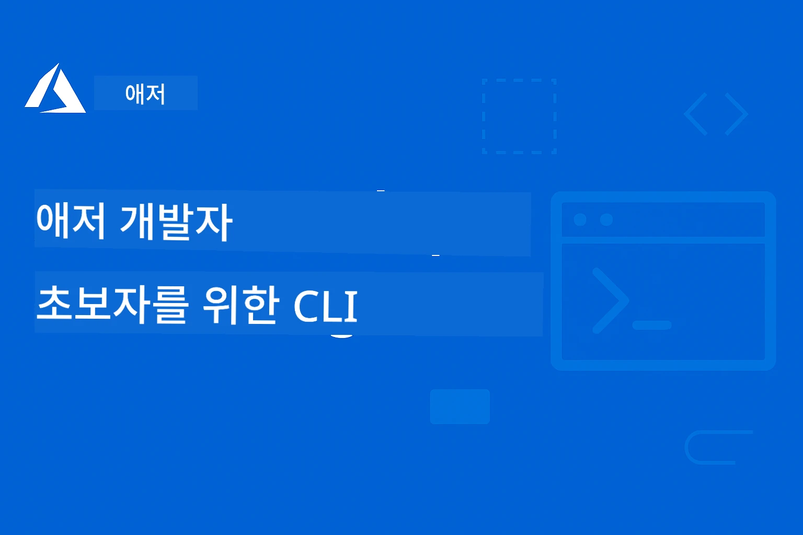

# AZD 초보자용: 체계적인 학습 여정

 

[](https://GitHub.com/microsoft/azd-for-beginners/watchers/)
[](https://GitHub.com/microsoft/azd-for-beginners/network/)
[](https://GitHub.com/microsoft/azd-for-beginners/stargazers/)

[](https://discord.com/invite/nkVh3dp)
[](https://discord.gg/nTYy5BXMWG)

---

### 자동 번역 (항상 최신 상태)

<!-- CO-OP TRANSLATOR LANGUAGES TABLE START -->
[아랍어](../ar/README.md) | [벵골어](../bn/README.md) | [불가리아어](../bg/README.md) | [버마어 (미얀마)](../my/README.md) | [중국어 (간체)](../zh-CN/README.md) | [중국어 (번체, 홍콩)](../zh-HK/README.md) | [중국어 (번체, 마카오)](../zh-MO/README.md) | [중국어 (번체, 대만)](../zh-TW/README.md) | [크로아티아어](../hr/README.md) | [체코어](../cs/README.md) | [덴마크어](../da/README.md) | [네덜란드어](../nl/README.md) | [에스토니아어](../et/README.md) | [핀란드어](../fi/README.md) | [프랑스어](../fr/README.md) | [독일어](../de/README.md) | [그리스어](../el/README.md) | [히브리어](../he/README.md) | [힌디어](../hi/README.md) | [헝가리어](../hu/README.md) | [인도네시아어](../id/README.md) | [이탈리아어](../it/README.md) | [일본어](../ja/README.md) | [칸나다어](../kn/README.md) | [크메르어](../km/README.md) | [한국어](./README.md) | [리투아니아어](../lt/README.md) | [말레이어](../ms/README.md) | [말라얄람어](../ml/README.md) | [마라티어](../mr/README.md) | [네팔어](../ne/README.md) | [나이지리아 피진](../pcm/README.md) | [노르웨이어](../no/README.md) | [페르시아어 (파르시)](../fa/README.md) | [폴란드어](../pl/README.md) | [포르투갈어 (브라질)](../pt-BR/README.md) | [포르투갈어 (포르투갈)](../pt-PT/README.md) | [펀자브어 (구르무키)](../pa/README.md) | [루마니아어](../ro/README.md) | [러시아어](../ru/README.md) | [세르비아어 (키릴문자)](../sr/README.md) | [슬로바키아어](../sk/README.md) | [슬로베니아어](../sl/README.md) | [스페인어](../es/README.md) | [스와힐리어](../sw/README.md) | [스웨덴어](../sv/README.md) | [따갈로그어 (필리핀)](../tl/README.md) | [타밀어](../ta/README.md) | [텔루구어](../te/README.md) | [태국어](../th/README.md) | [터키어](../tr/README.md) | [우크라이나어](../uk/README.md) | [우르두어](../ur/README.md) | [베트남어](../vi/README.md)

> **로컬로 복제하시겠습니까?**
>
> 이 리포지토리는 50개 이상의 언어 번역을 포함하고 있어 다운로드 크기가 크게 증가합니다. 번역 없이 클론하려면 sparse checkout을 사용하세요:
>
> **Bash / macOS / Linux:**
> ```bash
> git clone --filter=blob:none --sparse https://github.com/microsoft/AZD-for-beginners.git
> cd AZD-for-beginners
> git sparse-checkout set --no-cone '/*' '!translations' '!translated_images'
> ```
>
> **CMD (Windows):**
> ```cmd
> git clone --filter=blob:none --sparse https://github.com/microsoft/AZD-for-beginners.git
> cd AZD-for-beginners
> git sparse-checkout set --no-cone "/*" "!translations" "!translated_images"
> ```
>
> 이 방법은 코스를 완료하는 데 필요한 모든 것을 훨씬 빠르게 다운로드할 수 있게 해줍니다.
<!-- CO-OP TRANSLATOR LANGUAGES TABLE END -->

## 🆕 azd의 최신 소식

Azure Developer CLI는 기존의 웹 앱과 API를 넘어 성장했습니다. 오늘날 azd는 AI 기반 애플리케이션과 지능형 에이전트를 포함하여 Azure에 <strong>모든</strong> 애플리케이션을 배포할 수 있는 단일 도구입니다.

이것이 여러분에게 의미하는 바는 다음과 같습니다:

- **AI 에이전트가 이제 정식 azd 워크로드입니다.** 기존에 알고 있는 동일한 `azd init` → `azd up` 워크플로를 사용하여 AI 에이전트 프로젝트를 초기화, 배포 및 관리할 수 있습니다.
- <strong>Microsoft Foundry 통합</strong>은 모델 배포, 에이전트 호스팅 및 AI 서비스 구성을 azd 템플릿 생태계에 직접 통합합니다.
- **핵심 워크플로는 변경되지 않았습니다.** 할 일 앱, 마이크로서비스 또는 다중 에이전트 AI 솔루션을 배포하든 명령은 동일합니다.

만약 이전에 azd를 사용해본 적이 있다면, AI 지원은 별도의 도구나 고급 트랙이 아니라 자연스러운 확장입니다. 새로 시작하는 경우에도 모든 것에 대해 작동하는 하나의 워크플로를 배우게 됩니다.

---

## 🚀 Azure Developer CLI(azd)란?

<strong>Azure Developer CLI (azd)</strong>는 개발자 친화적인 명령줄 도구로 Azure에 애플리케이션을 간단하게 배포할 수 있게 해줍니다. 수십 개의 Azure 리소스를 수동으로 생성하고 연결하는 대신 단일 명령으로 전체 애플리케이션을 배포할 수 있습니다.

### `azd up`의 마법

```bash
# 이 단일 명령으로 모든 작업을 수행합니다:
# ✅ 모든 Azure 리소스 생성
# ✅ 네트워킹 및 보안 구성
# ✅ 애플리케이션 코드 빌드
# ✅ Azure에 배포
# ✅ 작동하는 URL 제공
azd up
```

**그게 전부입니다!** Azure 포털 클릭 불필요, 복잡한 ARM 템플릿을 먼저 배울 필요 없음, 수동 구성 없음 - 단지 Azure에서 작동하는 애플리케이션만 있습니다.

---

## ❓ Azure Developer CLI vs Azure CLI: 차이점은 무엇인가요?

초보자들이 가장 자주 묻는 질문입니다. 간단한 답은 다음과 같습니다:

| 기능 | **Azure CLI (`az`)** | **Azure Developer CLI (`azd`)** |
|---------|---------------------|--------------------------------|
| <strong>목적</strong> | 개별 Azure 리소스 관리 | 전체 애플리케이션 배포 |
| <strong>마인드셋</strong> | 인프라 중심 | 애플리케이션 중심 |
| <strong>예시</strong> | `az webapp create --name myapp...` | `azd up` |
| **학습 곡선** | Azure 서비스를 알아야 함 | 애플리케이션만 알면 됨 |
| **적합한 대상** | DevOps, 인프라 | 개발자, 프로토타이핑 |

### 간단한 비유

- <strong>Azure CLI</strong>는 집을 짓는 모든 도구(망치, 톱, 못)를 갖추는 것과 같습니다. 무엇이든 만들 수 있지만 건축 지식이 필요합니다.
- <strong>Azure Developer CLI</strong>는 도급업체를 고용하는 것과 같습니다 - 원하는 것을 설명하면 그들이 건설을 처리합니다.

### 언제 각각을 사용해야 하나요

| 시나리오 | 사용 방법 |
|----------|----------|
| "웹 앱을 빠르게 배포하고 싶다" | `azd up` |
| "스토리지 계정만 생성해야 한다" | `az storage account create` |
| "전체 AI 애플리케이션을 구축하고 있다" | `azd init --template azure-search-openai-demo` |
| "특정 Azure 리소스를 디버그해야 한다" | `az resource show` |
| "수 분 내에 프로덕션 준비가 된 배포를 원한다" | `azd up --environment production` |

### 둘은 함께 작동합니다!

AZD는 내부적으로 Azure CLI를 사용합니다. 둘 다 사용할 수 있습니다:
```bash
# AZD로 앱 배포하기
azd up

# 그런 다음 Azure CLI로 특정 리소스를 미세 조정하기
az webapp config set --name myapp --always-on true
```

---

## 🌟 Awesome AZD에서 템플릿 찾기

처음부터 시작하지 마세요! <strong>Awesome AZD</strong>는 즉시 배포 가능한 템플릿을 모아놓은 커뮤니티 컬렉션입니다:

| 리소스 | 설명 |
|----------|-------------|
| 🔗 [**Awesome AZD 갤러리**](https://azure.github.io/awesome-azd/) | 원클릭 배포로 200+ 템플릿을 탐색 |
| 🔗 [**템플릿 제출**](https://github.com/Azure/awesome-azd/issues) | 커뮤니티에 템플릿을 기여하세요 |
| 🔗 [**GitHub 리포지토리**](https://github.com/Azure/awesome-azd) | 별을 누르고 소스를 살펴보세요 |

### Awesome AZD의 인기 AI 템플릿

```bash
# Microsoft Foundry 모델 + AI 검색과 함께하는 RAG 채팅
azd init --template azure-search-openai-demo

# 빠른 AI 채팅 애플리케이션
azd init --template openai-chat-app-quickstart

# Foundry 에이전트를 활용한 AI 에이전트들
azd init --template get-started-with-ai-agents
```

---

## 🎯 3단계로 시작하기

시작하기 전에 배포하려는 템플릿에 맞게 기계가 준비되어 있는지 확인하세요:

**Windows:**
```powershell
.\validate-setup.ps1
```

**macOS / Linux:**
```bash
bash ./validate-setup.sh
```

If any required check fails, fix that first and then continue with the quick start.

### 1단계: AZD 설치 (2분)

**Windows:**
```powershell
winget install microsoft.azd
```

**macOS:**
```bash
brew tap azure/azd && brew install azd
```

**Linux:**
```bash
curl -fsSL https://aka.ms/install-azd.sh | bash
```

### 2단계: AZD 인증

```bash
# 이 과정에서 Azure CLI 명령을 직접 사용할 계획이라면 선택 사항입니다
az login

# AZD 워크플로우에 필요합니다
azd auth login
```

If you are not sure which one you need, follow the full setup flow in [설치 및 설정](docs/chapter-01-foundation/installation.md#authentication-setup).

### 3단계: 첫 번째 앱 배포

```bash
# 템플릿에서 초기화
azd init --template todo-nodejs-mongo

# Azure에 배포 (모든 것을 생성합니다!)
azd up
```

**🎉 완료!** 이제 앱이 Azure에서 실행 중입니다.

### 정리 (잊지 마세요!)

```bash
# Remove all resources when done experimenting
azd down --force --purge
```

---

## 📚 이 과정 사용 방법

이 과정은 **점진적 학습** - 편한 곳에서 시작해 점차 올라가도록 설계되었습니다:

| 귀하의 경험 | 시작 지점 |
|-----------------|------------|
| **Azure 초보자** | [챕터 1: 기초](#-chapter-1-foundation--quick-start) |
| **Azure는 알지만 AZD는 처음** | [챕터 1: 기초](#-chapter-1-foundation--quick-start) |
| **AI 앱을 배포하고 싶은 분** | [챕터 2: AI 우선 개발](#-chapter-2-ai-first-development-recommended-for-ai-developers) |
| **실습 위주로 배우고 싶은 분** | [🎓 인터랙티브 워크숍](workshop/README.md) - 3-4시간 가이드 실습 |
| **프로덕션 패턴이 필요한 분** | [챕터 8: 프로덕션 및 엔터프라이즈](#-chapter-8-production--enterprise-patterns) |

### 빠른 설정

1. **이 리포지토리 포크하기**: [](https://GitHub.com/microsoft/azd-for-beginners/fork)
2. <strong>클론하기</strong>: `git clone https://github.com/YOUR-USERNAME/azd-for-beginners.git`
3. **도움 받기**: [Azure Discord 커뮤니티](https://discord.com/invite/ByRwuEEgH4)

> **로컬로 복제하시겠습니까?**
>
> 이 리포지토리는 50개 이상의 언어 번역을 포함하고 있어 다운로드 크기가 크게 증가합니다. 번역 없이 클론하려면 sparse checkout을 사용하세요:
> ```bash
> git clone --filter=blob:none --sparse https://github.com/microsoft/AZD-for-beginners.git
> cd AZD-for-beginners
> git sparse-checkout set --no-cone '/*' '!translations' '!translated_images'
> ```
> 이렇게 하면 코스를 완료하는 데 필요한 모든 것을 훨씬 빠르게 다운로드할 수 있습니다.


## 과정 개요

구조화된 장을 통해 Azure Developer CLI(azd)를 마스터하세요. <strong>Microsoft Foundry 통합을 통한 AI 애플리케이션 배포에 특별 중점</strong>을 둡니다.

### 이 과정이 현대 개발자에게 중요한 이유

Microsoft Foundry Discord 커뮤니티의 인사이트를 기반으로, <strong>45%의 개발자가 AI 워크로드에 AZD를 사용하고 싶어합니다</strong>만 다음과 같은 문제에 직면합니다:
- 복잡한 다중 서비스 AI 아키텍처
- 프로덕션 AI 배포 모범 사례  
- Azure AI 서비스 통합 및 구성
- AI 워크로드의 비용 최적화
- AI 관련 배포 문제의 문제 해결

### 학습 목표

이 구조화된 과정을 완료하면 다음을 달성할 수 있습니다:
- **AZD 기초 마스터**: 핵심 개념, 설치 및 구성
- **AI 애플리케이션 배포**: Microsoft Foundry 서비스를 사용한 AZD 활용
- **인프라를 코드로 구현**: Bicep 템플릿으로 Azure 리소스 관리
- **배포 문제 해결**: 일반적인 문제 해결 및 디버깅
- **프로덕션 최적화**: 보안, 확장, 모니터링 및 비용 관리
- **다중 에이전트 솔루션 구축**: 복잡한 AI 아키텍처 배포

## 시작하기 전에: 계정, 접근 권한 및 가정

챕터 1을 시작하기 전에 다음 사항들이 준비되어 있는지 확인하세요. 이 가이드의 설치 단계는 이러한 기본 사항들이 이미 처리되었다고 가정합니다.
- **Azure 구독**: 직장 계정의 기존 구독이나 개인 계정의 구독을 사용하거나 시작하려면 [무료 평가판](https://aka.ms/azurefreetrial)을 생성하세요.
- **Azure 리소스를 생성할 수 있는 권한**: 대부분의 연습에서는 대상 구독 또는 리소스 그룹에 대해 최소한 **Contributor** 권한이 있어야 합니다. 일부 장에서는 리소스 그룹, 관리형 ID, 및 RBAC 할당을 생성할 수 있다고 가정할 수도 있습니다.
- [**GitHub 계정**](https://github.com): 레포지토리를 포크하고 자신의 변경 사항을 추적하며 워크숍에 GitHub Codespaces를 사용하는 데 유용합니다.
- **템플릿 런타임 전제 조건**: 일부 템플릿은 Node.js, Python, Java 또는 Docker와 같은 로컬 도구가 필요할 수 있습니다. 시작하기 전에 설정 검증기를 실행하여 누락된 도구를 조기에 확인하세요.
- **기본 터미널 사용 능력**: 전문가일 필요는 없지만 `git clone`, `azd auth login`, 및 `azd up`와 같은 명령을 실행하는 데 익숙해야 합니다.

> **기업 구독에서 작업 중이신가요?**
> Azure 환경이 관리자로 의해 운영되는 경우, 사용하려는 구독이나 리소스 그룹에 리소스를 배포할 수 있는지 미리 확인하세요. 가능하지 않다면 시작하기 전에 샌드박스 구독이나 Contributor 권한을 요청하세요.

> **Azure 초보자이신가요?**
> https://aka.ms/azurefreetrial에서 Azure 체험 또는 종량제 구독으로 시작하면 테넌트 수준 승인 없이 연습을 처음부터 끝까지 완료할 수 있습니다.

## 🗺️ 코스 맵: 장별 빠른 탐색

각 장에는 학습 목표, 빠른 시작, 및 연습 문제가 포함된 전용 README가 있습니다:

| Chapter | Topic | Lessons | Duration | Complexity |
|---------|-------|---------|----------|------------|
| **[1장: 기초](docs/chapter-01-foundation/README.md)** | 시작하기 | [AZD 기본](docs/chapter-01-foundation/azd-basics.md) &#124; [설치](docs/chapter-01-foundation/installation.md) &#124; [첫 프로젝트](docs/chapter-01-foundation/first-project.md) | 30-45 min | ⭐ |
| **[2장: AI 개발](docs/chapter-02-ai-development/README.md)** | AI 우선 애플리케이션 | [Microsoft Foundry 통합](docs/chapter-02-ai-development/microsoft-foundry-integration.md) &#124; [AI 에이전트](docs/chapter-02-ai-development/agents.md) &#124; [AI 모델 배포](docs/chapter-02-ai-development/ai-model-deployment.md) &#124; [워크숍](docs/chapter-02-ai-development/ai-workshop-lab.md) | 1-2 hrs | ⭐⭐ |
| **[3장: 구성](docs/chapter-03-configuration/README.md)** | 인증 및 보안 | [구성](docs/chapter-03-configuration/configuration.md) &#124; [인증 및 보안](docs/chapter-03-configuration/authsecurity.md) | 45-60 min | ⭐⭐ |
| **[4장: 인프라](docs/chapter-04-infrastructure/README.md)** | IaC 및 배포 | [배포 가이드](docs/chapter-04-infrastructure/deployment-guide.md) &#124; [프로비저닝](docs/chapter-04-infrastructure/provisioning.md) | 1-1.5 hrs | ⭐⭐⭐ |
| **[5장: 멀티 에이전트](docs/chapter-05-multi-agent/README.md)** | AI 에이전트 솔루션 | [소매 시나리오](examples/retail-scenario.md) &#124; [조정 패턴](docs/chapter-06-pre-deployment/coordination-patterns.md) | 2-3 hrs | ⭐⭐⭐⭐ |
| **[6장: 사전 배포](docs/chapter-06-pre-deployment/README.md)** | 기획 및 검증 | [사전 점검](docs/chapter-06-pre-deployment/preflight-checks.md) &#124; [용량 계획](docs/chapter-06-pre-deployment/capacity-planning.md) &#124; [SKU 선택](docs/chapter-06-pre-deployment/sku-selection.md) &#124; [애플리케이션 인사이트](docs/chapter-06-pre-deployment/application-insights.md) | 1 hr | ⭐⭐ |
| **[7장: 문제해결](docs/chapter-07-troubleshooting/README.md)** | 디버그 및 수정 | [일반 문제](docs/chapter-07-troubleshooting/common-issues.md) &#124; [디버깅](docs/chapter-07-troubleshooting/debugging.md) &#124; [AI 문제](docs/chapter-07-troubleshooting/ai-troubleshooting.md) | 1-1.5 hrs | ⭐⭐ |
| **[8장: 프로덕션](docs/chapter-08-production/README.md)** | 엔터프라이즈 패턴 | [프로덕션 관행](docs/chapter-08-production/production-ai-practices.md) | 2-3 hrs | ⭐⭐⭐⭐ |
| **[🎓 워크숍](workshop/README.md)** | 핸즈온 실습 | [소개](workshop/docs/instructions/0-Introduction.md) &#124; [선택](workshop/docs/instructions/1-Select-AI-Template.md) &#124; [검증](workshop/docs/instructions/2-Validate-AI-Template.md) &#124; [분해](workshop/docs/instructions/3-Deconstruct-AI-Template.md) &#124; [구성](workshop/docs/instructions/4-Configure-AI-Template.md) &#124; [맞춤화](workshop/docs/instructions/5-Customize-AI-Template.md) &#124; [테어다운](workshop/docs/instructions/6-Teardown-Infrastructure.md) &#124; [마무리](workshop/docs/instructions/7-Wrap-up.md) | 3-4 hrs | ⭐⭐ |

**총 강의 시간:** ~10-14 시간 | **기술 향상 경로:** 초급 → 프로덕션 준비

---

## 📚 학습 장(Chapters)

*경험 수준과 목표에 따라 학습 경로를 선택하세요*

### 🚀 1장: 기초 및 빠른 시작
<strong>전제조건</strong>: Azure 구독, 기본 명령줄 지식  
**소요 시간**: 30-45 분  
<strong>난이도</strong>: ⭐

#### 배울 내용
- Azure Developer CLI의 기본 개념 이해
- 플랫폼에 AZD 설치하기
- 첫 배포 성공시키기

#### 학습 자료
- **🎯 시작하기**: [Azure Developer CLI란 무엇인가?](#what-is-azure-developer-cli)
- **📖 이론**: [AZD 기본](docs/chapter-01-foundation/azd-basics.md) - 핵심 개념 및 용어
- **⚙️ 설정**: [설치 및 설정](docs/chapter-01-foundation/installation.md) - 플랫폼별 가이드
- **🛠️ 실습**: [첫 프로젝트](docs/chapter-01-foundation/first-project.md) - 단계별 튜토리얼
- **📋 빠른 참조**: [명령 치트시트](resources/cheat-sheet.md)

#### 실습 과제
```bash
# 빠른 설치 확인
azd version

# 첫 번째 애플리케이션 배포
azd init --template todo-nodejs-mongo
azd up
```

**💡 장 결과**: AZD를 사용하여 간단한 웹 애플리케이션을 Azure에 성공적으로 배포

**✅ 성공 검증:**
```bash
# 1장을 완료하면 다음을 수행할 수 있어야 합니다:
azd version              # 설치된 버전을 표시합니다
azd init --template todo-nodejs-mongo  # 프로젝트를 초기화합니다
azd up                  # Azure에 배포합니다
azd show                # 실행 중인 앱의 URL을 표시합니다
# 애플리케이션이 브라우저에서 열리고 작동합니다
azd down --force --purge  # 리소스를 정리합니다
```

**📊 소요 시간:** 30-45 분  
**📈 완료 후 숙련도:** 기본 애플리케이션을 독립적으로 배포할 수 있음
**📈 완료 후 숙련도:** 기본 애플리케이션을 독립적으로 배포할 수 있음

---

### 🤖 2장: AI 우선 개발 (AI 개발자 권장)
<strong>전제조건</strong>: 1장 완료  
**소요 시간**: 1-2 시간  
<strong>난이도</strong>: ⭐⭐

#### 배울 내용
- AZD와 Microsoft Foundry 통합
- AI 기반 애플리케이션 배포
- AI 서비스 구성 이해

#### 학습 자료
- **🎯 시작하기**: [Microsoft Foundry 통합](docs/chapter-02-ai-development/microsoft-foundry-integration.md)
- **🤖 AI 에이전트**: [AI 에이전트 가이드](docs/chapter-02-ai-development/agents.md) - AZD로 지능형 에이전트 배포
- **📖 패턴**: [AI 모델 배포](docs/chapter-02-ai-development/ai-model-deployment.md) - AI 모델 배포 및 관리
- **🛠️ 워크숍**: [AI 워크숍 실습](docs/chapter-02-ai-development/ai-workshop-lab.md) - AI 솔루션을 AZD에 맞게 준비
- **🎥 인터랙티브 가이드**: [워크숍 자료](workshop/README.md) - MkDocs * DevContainer 환경을 통한 브라우저 기반 학습
- **📋 템플릿**: [Microsoft Foundry 템플릿](#워크샵-리소스)
- **📝 예제**: [AZD 배포 예제](examples/README.md)

#### 실습 과제
```bash
# 첫 번째 AI 애플리케이션을 배포하세요
azd init --template azure-search-openai-demo
azd up

# 추가 AI 템플릿을 시도해 보세요
azd init --template openai-chat-app-quickstart
azd init --template agent-openai-python-prompty
```

**💡 장 결과**: RAG 기능을 갖춘 AI 기반 채팅 애플리케이션 배포 및 구성

**✅ 성공 검증:**
```bash
# 2장을 마치면 다음을 할 수 있어야 합니다:
azd init --template azure-search-openai-demo
azd up
# AI 채팅 인터페이스를 테스트할 수 있습니다
# 질문을 하고 출처가 포함된 AI 기반 응답을 받을 수 있습니다
# 검색 통합이 작동하는지 확인할 수 있습니다
azd monitor  # Application Insights에 텔레메트리가 표시되는지 확인할 수 있습니다
azd down --force --purge
```

**📊 소요 시간:** 1-2 시간  
**📈 완료 후 숙련도:** 프로덕션 준비된 AI 애플리케이션을 배포하고 구성할 수 있음  
**💰 비용 인지:** 개발비용 $80-150/월, 프로덕션 비용 $300-3500/월 범위 인지

#### 💰 AI 배포에 대한 비용 고려사항

**개발 환경(추정 $80-150/월):**
- Microsoft Foundry Models (Pay-as-you-go): $0-50/월 (토큰 사용량 기준)
- AI Search (Basic tier): $75/월
- Container Apps (Consumption): $0-20/월
- Storage (Standard): $1-5/월

**프로덕션 환경(추정 $300-3,500+/월):**
- Microsoft Foundry Models (PTU for consistent performance): $3,000+/월 또는 대량 사용시 종량제
- AI Search (Standard tier): $250/월
- Container Apps (Dedicated): $50-100/월
- Application Insights: $5-50/월
- Storage (Premium): $10-50/월

**💡 비용 최적화 팁:**
- 학습용으로는 **Free Tier** Microsoft Foundry Models 사용 (Azure OpenAI 포함: 월 50,000 토큰 포함)
- 개발 중이 아닐 때는 `azd down`을 실행하여 리소스를 할당 해제
- 프로덕션에서는 PTU로 업그레이드하기 전 소비 기반 과금부터 시작
- 배포 전에 비용을 추정하려면 `azd provision --preview` 실행
- 자동 확장(enable auto-scaling) 사용: 실제 사용량에 대해서만 비용 지불

**비용 모니터링:**
```bash
# 예상 월별 비용 확인
azd provision --preview

# Azure 포털에서 실제 비용 모니터링
az consumption budget list --resource-group <your-rg>
```

---

### ⚙️ 3장: 구성 및 인증
<strong>전제조건</strong>: 1장 완료  
**소요 시간**: 45-60 분  
<strong>난이도</strong>: ⭐⭐

#### 배울 내용
- 환경 구성 및 관리
- 인증 및 보안 모범 사례
- 리소스 명명 및 조직화

#### 학습 자료
- **📖 구성**: [구성 가이드](docs/chapter-03-configuration/configuration.md) - 환경 설정
- **🔐 보안**: [인증 패턴 및 관리형 ID](docs/chapter-03-configuration/authsecurity.md) - 인증 패턴
- **📝 예제**: [데이터베이스 앱 예제](examples/database-app/README.md) - AZD 데이터베이스 예제

#### 실습 과제
- 여러 환경(dev, staging, prod) 구성하기
- 관리형 ID 인증 설정하기
- 환경별 구성 구현하기

**💡 장 결과**: 적절한 인증 및 보안으로 여러 환경을 관리할 수 있음

---

### 🏗️ 4장: 코드로서의 인프라 및 배포
<strong>전제조건</strong>: 1-3장 완료  
**소요 시간**: 1-1.5 시간  
<strong>난이도</strong>: ⭐⭐⭐

#### 배울 내용
- 고급 배포 패턴
- Bicep을 사용한 코드로서의 인프라(IaC)
- 리소스 프로비저닝 전략

#### 학습 자료
- **📖 배포**: [배포 가이드](docs/chapter-04-infrastructure/deployment-guide.md) - 전체 워크플로
- **🏗️ 프로비저닝**: [리소스 프로비저닝](docs/chapter-04-infrastructure/provisioning.md) - Azure 리소스 관리
- **📝 예제**: [Container App 예제](../../examples/container-app) - 컨테이너화된 배포

#### 실습 과제
- 맞춤 Bicep 템플릿 만들기
- 다중 서비스 애플리케이션 배포하기
- 블루-그린 배포 전략 구현하기

**💡 장 결과**: 맞춤 인프라 템플릿을 사용해 복잡한 다중 서비스 애플리케이션을 배포할 수 있음

---

### 🎯 5장: 멀티 에이전트 AI 솔루션 (고급)
<strong>전제조건</strong>: 1-2장 완료  
**소요 시간**: 2-3 시간  
<strong>난이도</strong>: ⭐⭐⭐⭐

#### 배울 내용
- 멀티 에이전트 아키텍처 패턴
- 에이전트 오케스트레이션 및 조정
- 프로덕션 준비 AI 배포

#### 학습 자료
- **🤖 추천 프로젝트**: [소매 멀티 에이전트 솔루션](examples/retail-scenario.md) - 전체 구현
- **🛠️ ARM 템플릿**: [ARM 템플릿 패키지](../../examples/retail-multiagent-arm-template) - 원클릭 배포
- **📖 아키텍처**: [멀티 에이전트 조정 패턴](docs/chapter-06-pre-deployment/coordination-patterns.md) - 패턴

#### 실습 과제
```bash
# 완전한 소매 다중 에이전트 솔루션 배포
cd examples/retail-multiagent-arm-template
./deploy.sh

# 에이전트 구성 탐색
az deployment group show --resource-group <rg-name> --name <deployment-name>
```

**💡 장 결과**: 고객 에이전트와 재고 에이전트를 포함한 프로덕션 준비 멀티 에이전트 AI 솔루션을 배포하고 관리할 수 있음

---

### 🔍 6장: 사전 배포 검증 및 기획
<strong>전제조건</strong>: 4장 완료  
**소요 시간**: 1 시간  
<strong>난이도</strong>: ⭐⭐
#### 배울 내용
- 용량 계획 및 리소스 검증
- SKU 선택 전략
- 사전 점검(Pre-flight) 및 자동화

#### 학습 자료
- **📊 계획**: [Capacity Planning](docs/chapter-06-pre-deployment/capacity-planning.md) - 리소스 검증
- **💰 선택**: [SKU Selection](docs/chapter-06-pre-deployment/sku-selection.md) - 비용 효율적인 선택
- **✅ 검증**: [Pre-flight Checks](docs/chapter-06-pre-deployment/preflight-checks.md) - 자동화 스크립트

#### 실습
- 용량 검증 스크립트 실행
- 비용을 고려한 SKU 선택 최적화
- 배포 전 자동화된 사전 점검 구현

**💡 챕터 결과**: 실행 전에 배포를 검증하고 최적화

---

### 🚨 Chapter 7: 문제 해결 및 디버깅
**전제 조건**: 배포 챕터 중 하나 완료  
**소요 시간**: 1-1.5시간  
<strong>복잡도</strong>: ⭐⭐

#### 배울 내용
- 체계적인 디버깅 접근법
- 일반적인 문제와 해결책
- AI 관련 문제 해결

#### 학습 자료
- **🔧 일반 문제**: [Common Issues](docs/chapter-07-troubleshooting/common-issues.md) - FAQ 및 해결책
- **🕵️ 디버깅**: [Debugging Guide](docs/chapter-07-troubleshooting/debugging.md) - 단계별 전략
- **🤖 AI 문제**: [AI-Specific Troubleshooting](docs/chapter-07-troubleshooting/ai-troubleshooting.md) - AI 서비스 문제

#### 실습
- 배포 실패 진단
- 인증 문제 해결
- AI 서비스 연결 문제 디버깅

**💡 챕터 결과**: 일반적인 배포 문제를 독자적으로 진단하고 해결

---

### 🏢 Chapter 8: 프로덕션 및 엔터프라이즈 패턴
**전제 조건**: 챕터 1-4 완료  
**소요 시간**: 2-3시간  
<strong>복잡도</strong>: ⭐⭐⭐⭐

#### 배울 내용
- 프로덕션 배포 전략
- 엔터프라이즈 보안 패턴
- 모니터링 및 비용 최적화

#### 학습 자료
- **🏭 프로덕션**: [Production AI Best Practices](docs/chapter-08-production/production-ai-practices.md) - 엔터프라이즈 패턴
- **📝 예제**: [Microservices Example](../../examples/microservices) - 복잡한 아키텍처
- **📊 모니터링**: [Application Insights integration](docs/chapter-06-pre-deployment/application-insights.md) - 모니터링

#### 실습
- 엔터프라이즈 보안 패턴 구현
- 포괄적인 모니터링 설정
- 적절한 거버넌스와 함께 프로덕션에 배포

**💡 챕터 결과**: 전체 프로덕션 기능을 갖춘 엔터프라이즈 수준의 애플리케이션 배포

---

## 🎓 워크샵 개요: 실습 학습 경험

> **⚠️ 워크샵 상태: 개발 중**  
> 워크샵 자료는 현재 개발 및 개선 중입니다. 핵심 모듈은 작동하지만 일부 고급 섹션은 완료되지 않았습니다. 모든 콘텐츠 완성을 위해 적극적으로 작업 중입니다. [Track progress →](workshop/README.md)

### 인터랙티브 워크샵 자료
**브라우저 기반 도구와 가이드된 실습을 통한 포괄적인 실습 학습 경험**

워크샵 자료는 위의 챕터 기반 커리큘럼을 보완하는 구조화된 인터랙티브 학습 경험을 제공합니다. 워크샵은 자율 학습과 강사 진행 세션 모두에 적합하게 설계되었습니다.

#### 🛠️ 워크샵 기능
- **브라우저 기반 인터페이스**: 검색, 복사 및 테마 기능을 갖춘 MkDocs 기반 워크샵
- **GitHub Codespaces 통합**: 원클릭 개발 환경 설정
- **구조화된 학습 경로**: 8개 모듈의 가이드 실습(총 3-4시간)
- **점진적 방법론**: 소개 → 선택 → 검증 → 분해 → 구성 → 사용자화 → 정리 → 마무리
- **인터랙티브 DevContainer 환경**: 사전 구성된 도구와 종속성

#### 📚 워크샵 모듈 구조
워크샵은 검색부터 배포 숙련까지 이끄는 <strong>8모듈 점진적 방법론</strong>을 따릅니다:

| Module | Topic | What You'll Do | Duration |
|--------|-------|----------------|----------|
| **0. Introduction** | Workshop Overview | 학습 목표, 전제 조건 및 워크샵 구조 이해 | 15 min |
| **1. Selection** | Template Discovery | AZD 템플릿을 탐색하고 시나리오에 맞는 AI 템플릿 선택 | 20 min |
| **2. Validation** | Deploy & Verify | `azd up`으로 템플릿을 배포하고 인프라가 작동하는지 검증 | 30 min |
| **3. Deconstruction** | Understand Structure | GitHub Copilot을 사용하여 템플릿 아키텍처, Bicep 파일 및 코드 구성 탐색 | 30 min |
| **4. Configuration** | azure.yaml Deep Dive | `azure.yaml` 구성, 라이프사이클 훅 및 환경 변수 마스터 | 30 min |
| **5. Customization** | Make It Yours | AI Search, 추적, 평가를 활성화하고 시나리오에 맞게 사용자화 | 45 min |
| **6. Teardown** | Clean Up | `azd down --purge`로 안전하게 리소스 해제 | 15 min |
| **7. Wrap-up** | Next Steps | 성과 검토, 핵심 개념 및 학습 지속 방법 | 15 min |

**워크샵 흐름:**
```
Introduction → Selection → Validation → Deconstruction → Configuration → Customization → Teardown → Wrap-up
     ↓            ↓           ↓              ↓               ↓              ↓            ↓           ↓
  Overview    Find the     Deploy &      Explore        Master         Customize     Clean up    Review &
             right        verify        code &        azure.yaml      for your      resources   next steps
             template                   structure                     scenario
```

#### 🚀 워크샵 시작하기
```bash
# 옵션 1: GitHub Codespaces (권장)
# 저장소에서 "Code" → "Create codespace on main"을 클릭하세요

# 옵션 2: 로컬 개발
git clone https://github.com/microsoft/azd-for-beginners.git
cd azd-for-beginners/workshop
# workshop/README.md의 설정 지침을 따르세요
```

#### 🎯 워크샵 학습 성과
워크샵을 완료하면 참가자는 다음을 수행할 수 있습니다:
- **프로덕션 AI 애플리케이션 배포**: Microsoft Foundry 서비스를 사용하는 AZD 활용
- **다중 에이전트 아키텍처 마스터**: 협력하는 AI 에이전트 솔루션 구현
- **보안 모범 사례 구현**: 인증 및 접근 제어 구성
- **규모 최적화**: 비용 효율적이고 성능 좋은 배포 설계
- **배포 문제 해결**: 일반적인 문제를 독립적으로 해결

#### 📖 워크샵 리소스
- **🎥 인터랙티브 가이드**: [Workshop Materials](workshop/README.md) - 브라우저 기반 학습 환경
- **📋 모듈별 지침**:
  - [0. Introduction](workshop/docs/instructions/0-Introduction.md) - 워크샵 개요 및 목표
  - [1. Selection](workshop/docs/instructions/1-Select-AI-Template.md) - AI 템플릿 찾기 및 선택
  - [2. Validation](workshop/docs/instructions/2-Validate-AI-Template.md) - 템플릿 배포 및 검증
  - [3. Deconstruction](workshop/docs/instructions/3-Deconstruct-AI-Template.md) - 템플릿 아키텍처 탐색
  - [4. Configuration](workshop/docs/instructions/4-Configure-AI-Template.md) - `azure.yaml` 마스터
  - [5. Customization](workshop/docs/instructions/5-Customize-AI-Template.md) - 시나리오에 맞게 사용자화
  - [6. Teardown](workshop/docs/instructions/6-Teardown-Infrastructure.md) - 리소스 정리
  - [7. Wrap-up](workshop/docs/instructions/7-Wrap-up.md) - 검토 및 다음 단계
- **🛠️ AI 워크샵 실습**: [AI Workshop Lab](docs/chapter-02-ai-development/ai-workshop-lab.md) - AI 중심 실습
- **💡 빠른 시작**: [Workshop Setup Guide](workshop/README.md#quick-start) - 환경 구성

**적합 대상**: 기업 교육, 대학 강의, 자율 학습 및 개발자 부트캠프.

---

## 📖 심층 분석: AZD 기능

기본 기능을 넘어, AZD는 프로덕션 배포를 위한 강력한 기능을 제공합니다:

- **템플릿 기반 배포** - 일반적인 애플리케이션 패턴을 위한 사전 구축 템플릿 사용
- **코드로서의 인프라** - Bicep 또는 Terraform을 사용한 Azure 리소스 관리  
- **통합된 워크플로우** - 애플리케이션을 원활하게 프로비저닝, 배포 및 모니터링
- **개발자 친화적** - 개발자 생산성과 경험에 최적화

### **AZD + Microsoft Foundry: AI 배포에 최적**

**왜 AZD가 AI 솔루션에 좋은가?** AZD는 AI 개발자가 직면한 주요 과제를 해결합니다:

- **AI 준비 템플릿** - Microsoft Foundry Models, Cognitive Services 및 ML 워크로드를 위한 사전 구성 템플릿
- **안전한 AI 배포** - AI 서비스, API 키 및 모델 엔드포인트를 위한 내장 보안 패턴  
- **프로덕션 AI 패턴** - 확장 가능하고 비용 효율적인 AI 애플리케이션 배포를 위한 모범 사례
- **엔드투엔드 AI 워크플로우** - 모델 개발부터 적절한 모니터링을 포함한 프로덕션 배포까지
- **비용 최적화** - AI 워크로드를 위한 스마트한 리소스 할당 및 확장 전략
- **Microsoft Foundry 통합** - Microsoft Foundry 모델 카탈로그 및 엔드포인트와의 원활한 연결

---

## 🎯 템플릿 및 예제 라이브러리

### 추천: Microsoft Foundry 템플릿
**AI 애플리케이션을 배포한다면 여기서 시작하세요!**

> **참고:** 이 템플릿들은 다양한 AI 패턴을 보여줍니다. 일부는 외부 Azure Samples이며, 다른 일부는 로컬 구현입니다.

| Template | Chapter | Complexity | Services | Type |
|----------|---------|------------|----------|------|
| [**Get started with AI chat**](https://github.com/Azure-Samples/get-started-with-ai-chat) | Chapter 2 | ⭐⭐ | AzureOpenAI + Azure AI Model Inference API + Azure AI Search + Azure Container Apps + Application Insights | External |
| [**Get started with AI agents**](https://github.com/Azure-Samples/get-started-with-ai-agents) | Chapter 2 | ⭐⭐ | Foundry Agents + AzureOpenAI + Azure AI Search + Azure Container Apps + Application Insights| External |
| [**Azure Search + OpenAI Demo**](https://github.com/Azure-Samples/azure-search-openai-demo) | Chapter 2 | ⭐⭐ | AzureOpenAI + Azure AI Search + App Service + Storage | External |
| [**OpenAI Chat App Quickstart**](https://github.com/Azure-Samples/openai-chat-app-quickstart) | Chapter 2 | ⭐ | AzureOpenAI + Container Apps + Application Insights | External |
| [**Agent OpenAI Python Prompty**](https://github.com/Azure-Samples/agent-openai-python-prompty) | Chapter 5 | ⭐⭐⭐ | AzureOpenAI + Azure Functions + Prompty | External |
| [**Contoso Chat RAG**](https://github.com/Azure-Samples/contoso-chat) | Chapter 8 | ⭐⭐⭐⭐ | AzureOpenAI + AI Search + Cosmos DB + Container Apps | External |
| [**Retail Multi-Agent Solution**](examples/retail-scenario.md) | Chapter 5 | ⭐⭐⭐⭐ | AzureOpenAI + AI Search + Storage + Container Apps + Cosmos DB | **Local** |

### 추천: 완전한 학습 시나리오
**학습 챕터에 매핑된 프로덕션 준비 애플리케이션 템플릿**

| Template | Learning Chapter | Complexity | Key Learning |
|----------|------------------|------------|--------------|
| [**openai-chat-app-quickstart**](https://github.com/Azure-Samples/openai-chat-app-quickstart) | Chapter 2 | ⭐ | 기본 AI 배포 패턴 |
| [**azure-search-openai-demo**](https://github.com/Azure-Samples/azure-search-openai-demo) | Chapter 2 | ⭐⭐ | Azure AI Search를 이용한 RAG 구현 |
| [**ai-document-processing**](https://github.com/Azure-Samples/ai-document-processing) | Chapter 4 | ⭐⭐ | Document Intelligence 통합 |
| [**agent-openai-python-prompty**](https://github.com/Azure-Samples/agent-openai-python-prompty) | Chapter 5 | ⭐⭐⭐ | 에이전트 프레임워크 및 함수 호출 |
| [**contoso-chat**](https://github.com/Azure-Samples/contoso-chat) | Chapter 8 | ⭐⭐⭐ | 엔터프라이즈 AI 오케스트레이션 |
| [**retail-multi-agent-solution**](examples/retail-scenario.md) | Chapter 5 | ⭐⭐⭐⭐ | 고객 및 재고 에이전트를 포함한 다중 에이전트 아키텍처 |

### 예제로 배우기 유형

> **📌 로컬 vs. 외부 예제:**  
> **로컬 예제** (이 저장소 내) = 즉시 사용 가능  
> **외부 예제** (Azure Samples) = 링크된 저장소에서 클론

#### 로컬 예제 (즉시 사용 가능)
- [**Retail Multi-Agent Solution**](examples/retail-scenario.md) - ARM 템플릿을 포함한 완전한 프로덕션 준비 구현
  - 다중 에이전트 아키텍처 (고객 + 재고 에이전트)
  - 포괄적인 모니터링 및 평가
  - ARM 템플릿을 통한 원클릭 배포

#### 로컬 예제 - 컨테이너 애플리케이션 (챕터 2-5)
**이 저장소의 포괄적인 컨테이너 배포 예제:**
- [**Container App Examples**](examples/container-app/README.md) - 컨테이너화된 배포에 대한 완전한 가이드
  - [Simple Flask API](../../examples/container-app/simple-flask-api) - scale-to-zero를 갖춘 기본 REST API
  - [Microservices Architecture](../../examples/container-app/microservices) - 프로덕션 준비 다중 서비스 배포
  - 빠른 시작, 프로덕션 및 고급 배포 패턴
  - 모니터링, 보안 및 비용 최적화 가이드

#### 외부 예제 - 간단한 애플리케이션 (챕터 1-2)
**시작하려면 이 Azure Samples 저장소들을 클론하세요:**
- [Simple Web App - Node.js + MongoDB](https://github.com/Azure-Samples/todo-nodejs-mongo) - 기본 배포 패턴
- [Static Website - React SPA](https://github.com/Azure-Samples/todo-csharp-sql-swa-func) - 정적 콘텐츠 배포
- [Container App - Python Flask](https://github.com/Azure-Samples/container-apps-store-api-microservice) - REST API 배포

#### 외부 예제 - 데이터베이스 통합 (챕터 3-4)
- [Database App - C# + SQL](https://github.com/Azure-Samples/todo-csharp-sql) - 데이터베이스 연결 패턴
- [Functions + Cosmos DB](https://github.com/Azure-Samples/todo-python-mongo-swa-func) - 서버리스 데이터 워크플로

#### External Examples - Advanced Patterns (Chapters 4-8)
- [Java Microservices](https://github.com/Azure-Samples/java-microservices-aca-lab) - 다중 서비스 아키텍처
- [Container Apps Jobs](https://github.com/Azure-Samples/container-apps-jobs) - 백그라운드 처리  
- [Enterprise ML Pipeline](https://github.com/Azure-Samples/mlops-v2) - 운영 환경용 ML 패턴

### External Template Collections
- [**Official AZD Template Gallery**](https://azure.github.io/awesome-azd/) - 공식 및 커뮤니티 템플릿의 엄선된 모음
- [**Azure Developer CLI Templates**](https://learn.microsoft.com/en-us/azure/developer/azure-developer-cli/azd-templates) - Microsoft Learn 템플릿 문서
- [**Examples Directory**](examples/README.md) - 상세 설명이 포함된 로컬 학습 예제

---

## 📚 Learning Resources & References

### Quick References
- [**Command Cheat Sheet**](resources/cheat-sheet.md) - 챕터별로 정리된 필수 azd 명령어
- [**Glossary**](resources/glossary.md) - Azure 및 azd 용어 사전  
- [**FAQ**](resources/faq.md) - 학습 챕터별로 정리된 자주 묻는 질문
- [**Study Guide**](resources/study-guide.md) - 포괄적인 실습 문제

### Hands-On Workshops
- [**AI Workshop Lab**](docs/chapter-02-ai-development/ai-workshop-lab.md) - AI 솔루션을 AZD로 배포할 수 있도록 만들기 (2-3 hours)
- [**Interactive Workshop**](workshop/README.md) - MkDocs와 GitHub Codespaces를 사용한 8모듈 가이드 실습
  - 진행 순서: 소개 → 선택 → 검증 → 분해 → 구성 → 커스터마이징 → 해체 → 마무리

### External Learning Resources
- Azure Developer CLI Documentation -> Azure Developer CLI 문서
- Azure Architecture Center -> Azure 아키텍처 센터
- Azure Pricing Calculator -> Azure 가격 계산기
- Azure Status -> Azure 상태

### AI Agent Skills for Your Editor
- [**Microsoft Azure Skills on skills.sh**](https://skills.sh/microsoft/github-copilot-for-azure) - Azure AI, Foundry, 배포, 진단, 비용 최적화 등 37개의 공개 에이전트 스킬. GitHub Copilot, Cursor, Claude Code 또는 지원되는 에이전트에 설치하세요:
  ```bash
  npx skills add microsoft/github-copilot-for-azure
  ```

---

## 🔧 Quick Troubleshooting Guide

**Common issues beginners face and immediate solutions:**

<details>
<summary><strong>❌ "azd: command not found"</strong></summary>

```bash
# 먼저 AZD를 설치하세요
# Windows (PowerShell):
winget install microsoft.azd

# macOS:
brew tap azure/azd && brew install azd

# Linux:
curl -fsSL https://aka.ms/install-azd.sh | bash

# 설치 확인
azd version
```
</details>

<details>
<summary><strong>❌ "No subscription found" or "Subscription not set"</strong></summary>

```bash
# 사용 가능한 구독 목록
az account list --output table

# 기본 구독 설정
az account set --subscription "<subscription-id-or-name>"

# AZD 환경용으로 설정
azd env set AZURE_SUBSCRIPTION_ID "<subscription-id>"

# 검증
az account show
```
</details>

<details>
<summary><strong>❌ "InsufficientQuota" or "Quota exceeded"</strong></summary>

```bash
# 다른 Azure 리전을 시도해 보세요
azd env set AZURE_LOCATION "westus2"
azd up

# 또는 개발 환경에서는 더 작은 SKU를 사용하세요
# infra/main.parameters.json을 편집하세요:
{
  "sku": "B1"  // Instead of "P1V2"
}
```
</details>

<details>
<summary><strong>❌ "azd up"가 도중에 실패함</strong></summary>

```bash
# 옵션 1: 정리하고 다시 시도
azd down --force --purge
azd up

# 옵션 2: 인프라만 수정
azd provision

# 옵션 3: 자세한 상태 확인
azd show

# 옵션 4: Azure Monitor에서 로그 확인
azd monitor --logs
```
</details>

<details>
<summary><strong>❌ "Authentication failed" or "Token expired"</strong></summary>

```bash
# AZD 재인증
azd auth logout
azd auth login

# 선택 사항: az 명령을 실행 중이라면 Azure CLI도 갱신
az logout
az login

# 인증 확인
az account show
```
</details>

<details>
<summary><strong>❌ "Resource already exists" 또는 이름 충돌</strong></summary>

```bash
# AZD는 고유한 이름을 생성하지만, 충돌이 있을 경우:
azd down --force --purge

# 그런 다음 새 환경에서 재시도합니다
azd env new dev-v2
azd up
```
</details>

<details>
<summary><strong>❌ 템플릿 배포가 오래 걸림</strong></summary>

**일반적인 대기 시간:**
- 간단한 웹 앱: 5-10분
- 데이터베이스가 있는 앱: 10-15분
- AI 애플리케이션: 15-25분 (OpenAI 프로비저닝이 느립니다)

```bash
# 진행 상황 확인
azd show

# 30분 이상 멈춰 있으면 Azure 포털을 확인하세요:
azd monitor --overview
# 실패한 배포를 확인하세요
```
</details>

<details>
<summary><strong>❌ "Permission denied" or "Forbidden"</strong></summary>

```bash
# Azure 역할을 확인하세요
az role assignment list --assignee $(az account show --query user.name -o tsv)

# 최소 "Contributor" 역할이 필요합니다
# Azure 관리자에게 다음 권한 부여를 요청하세요:
# - Contributor (리소스에 대해)
# - User Access Administrator (역할 할당을 위해)
```
</details>

<details>
<summary><strong>❌ 배포된 애플리케이션 URL을 찾을 수 없음</strong></summary>

```bash
# 모든 서비스 엔드포인트 표시
azd show

# 또는 Azure 포털 열기
azd monitor

# 특정 서비스 확인
azd env get-values
# *_URL 변수 찾기
```
</details>

### 📚 Full Troubleshooting Resources

- **일반 문제 가이드:** [자세한 해결 방법](docs/chapter-07-troubleshooting/common-issues.md)
- **AI 관련 문제:** [AI 문제 해결](docs/chapter-07-troubleshooting/ai-troubleshooting.md)
- **디버깅 가이드:** [단계별 디버깅](docs/chapter-07-troubleshooting/debugging.md)
- **도움 받기:** [Azure Discord](https://discord.gg/microsoft-azure) #azure-developer-cli

---

## 🎓 Course Completion & Certification

### Progress Tracking
각 챕터별 학습 진행 상황을 추적하세요:

- [ ] **챕터 1**: 기초 및 빠른 시작 ✅
- [ ] **챕터 2**: AI 우선 개발 ✅  
- [ ] **챕터 3**: 구성 및 인증 ✅
- [ ] **챕터 4**: 코드형 인프라 및 배포 ✅
- [ ] **챕터 5**: 다중 에이전트 AI 솔루션 ✅
- [ ] **챕터 6**: 배포 전 검증 및 계획 ✅
- [ ] **챕터 7**: 문제 해결 및 디버깅 ✅
- [ ] **챕터 8**: 운영 및 엔터프라이즈 패턴 ✅

### Learning Verification
각 챕터를 완료한 후 지식을 검증하세요:
1. **실습 과제**: 해당 챕터의 핸즈온 배포를 완료하세요
2. **지식 확인**: 해당 챕터의 FAQ 섹션을 검토하세요
3. **커뮤니티 토론**: Azure Discord에 경험을 공유하세요
4. **다음 챕터**: 다음 난이도 단계로 이동하세요

### Course Completion Benefits
모든 챕터를 완료하면 다음을 얻게 됩니다:
- **실무 경험**: 실제 AI 애플리케이션을 Azure에 배포한 경험
- **전문 기술**: 엔터프라이즈 준비된 배포 역량  
- **커뮤니티 인정**: Azure 개발자 커뮤니티의 활동적인 구성원
- **경력 향상**: 수요가 높은 AZD 및 AI 배포 전문성

---

## 🤝 Community & Support

### Get Help & Support
- **Technical Issues**: [버그 보고 및 기능 요청](https://github.com/microsoft/azd-for-beginners/issues)
- **Learning Questions**: [Microsoft Azure Discord Community](https://discord.gg/microsoft-azure) and [](https://discord.gg/nTYy5BXMWG)
- **AI-Specific Help**: Join the [](https://discord.gg/nTYy5BXMWG)
- **Documentation**: [Official Azure Developer CLI documentation](https://learn.microsoft.com/en-us/azure/developer/azure-developer-cli/)

### Community Insights from Microsoft Foundry Discord

**#Azure 채널의 최근 설문 결과:**
- <strong>45%</strong>의 개발자가 AI 워크로드에 AZD를 사용하고 싶어함
- **주요 과제**: 다중 서비스 배포, 자격 증명 관리, 운영 준비성  
- **가장 요청된 항목**: AI 전용 템플릿, 문제 해결 가이드, 모범 사례

**커뮤니티에 참여하여:**
- AZD + AI 경험을 공유하고 도움을 받으세요
- 새로운 AI 템플릿의 조기 프리뷰에 접근하세요
- AI 배포 모범 사례에 기여하세요
- 미래의 AI + AZD 기능 개발에 영향력을 행사하세요

### Contributing to the Course
기여를 환영합니다! 자세한 내용은 [기여 가이드](CONTRIBUTING.md)를 읽어보세요:
- **콘텐츠 개선**: 기존 챕터 및 예제 개선
- **새 예제**: 실제 시나리오 및 템플릿 추가  
- <strong>번역</strong>: 다국어 지원 유지 보수에 도움
- **버그 보고**: 정확성과 명확성 개선
- **커뮤니티 기준**: 포용적인 커뮤니티 가이드라인 준수

---

## 📄 Course Information

### License
이 프로젝트는 MIT 라이선스로 배포됩니다 - 자세한 내용은 [LICENSE](../../LICENSE) 파일을 참조하세요.

### Related Microsoft Learning Resources

저희 팀은 다른 포괄적인 학습 코스도 제공합니다:

<!-- CO-OP TRANSLATOR OTHER COURSES START -->
### LangChain
[](https://aka.ms/langchain4j-for-beginners)
[](https://aka.ms/langchainjs-for-beginners?WT.mc_id=m365-94501-dwahlin)
[](https://github.com/microsoft/langchain-for-beginners?WT.mc_id=m365-94501-dwahlin)
---

### Azure / Edge / MCP / Agents
[](https://github.com/microsoft/AZD-for-beginners?WT.mc_id=academic-105485-koreyst)
[](https://github.com/microsoft/edgeai-for-beginners?WT.mc_id=academic-105485-koreyst)
[](https://github.com/microsoft/mcp-for-beginners?WT.mc_id=academic-105485-koreyst)
[](https://github.com/microsoft/ai-agents-for-beginners?WT.mc_id=academic-105485-koreyst)

---
 
### Generative AI Series
[](https://github.com/microsoft/generative-ai-for-beginners?WT.mc_id=academic-105485-koreyst)
[-9333EA?style=for-the-badge&labelColor=E5E7EB&color=9333EA)](https://github.com/microsoft/Generative-AI-for-beginners-dotnet?WT.mc_id=academic-105485-koreyst)
[-C084FC?style=for-the-badge&labelColor=E5E7EB&color=C084FC)](https://github.com/microsoft/generative-ai-for-beginners-java?WT.mc_id=academic-105485-koreyst)
[-E879F9?style=for-the-badge&labelColor=E5E7EB&color=E879F9)](https://github.com/microsoft/generative-ai-with-javascript?WT.mc_id=academic-105485-koreyst)

---
 
### Core Learning
[](https://aka.ms/ml-beginners?WT.mc_id=academic-105485-koreyst)
[](https://aka.ms/datascience-beginners?WT.mc_id=academic-105485-koreyst)
[](https://aka.ms/ai-beginners?WT.mc_id=academic-105485-koreyst)
[](https://github.com/microsoft/Security-101?WT.mc_id=academic-96948-sayoung)
[](https://aka.ms/webdev-beginners?WT.mc_id=academic-105485-koreyst)
[](https://aka.ms/iot-beginners?WT.mc_id=academic-105485-koreyst)
[](https://github.com/microsoft/xr-development-for-beginners?WT.mc_id=academic-105485-koreyst)

---
 
### 코파일럿 시리즈
[](https://aka.ms/GitHubCopilotAI?WT.mc_id=academic-105485-koreyst)
[](https://github.com/microsoft/mastering-github-copilot-for-dotnet-csharp-developers?WT.mc_id=academic-105485-koreyst)
[](https://github.com/microsoft/CopilotAdventures?WT.mc_id=academic-105485-koreyst)
<!-- CO-OP TRANSLATOR OTHER COURSES END -->

---

## 🗺️ 과정 탐색

**🚀 학습을 시작할 준비가 되셨나요?**

<strong>초보자</strong>: [1장: 기초 및 빠른 시작](#-chapter-1-foundation--quick-start)  
**AI 개발자**: [2장: AI 우선 개발](#-chapter-2-ai-first-development-recommended-for-ai-developers)  
**경험 있는 개발자**: [3장: 구성 및 인증](#️-chapter-3-configuration--authentication)

**다음 단계**: [1장 시작 - AZD 기초](docs/chapter-01-foundation/azd-basics.md) →

---

<!-- CO-OP TRANSLATOR DISCLAIMER START -->
**Disclaimer**:
이 문서는 AI 번역 서비스 [Co-op Translator](https://github.com/Azure/co-op-translator)를 사용하여 번역되었습니다. 정확성을 위해 노력하고 있으나, 자동 번역에는 오류나 부정확성이 포함될 수 있음을 유의하시기 바랍니다. 원문(원어) 문서를 권위 있는 출처로 간주해야 합니다. 중요한 정보의 경우 전문적인 인간 번역을 권장합니다. 본 번역의 사용으로 인해 발생하는 어떠한 오해나 오역에 대해서도 당사는 책임을 지지 않습니다.
<!-- CO-OP TRANSLATOR DISCLAIMER END -->