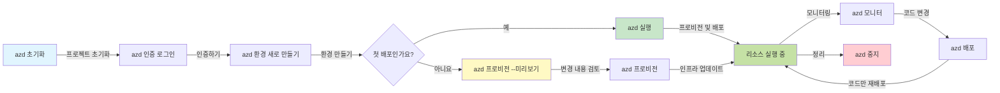
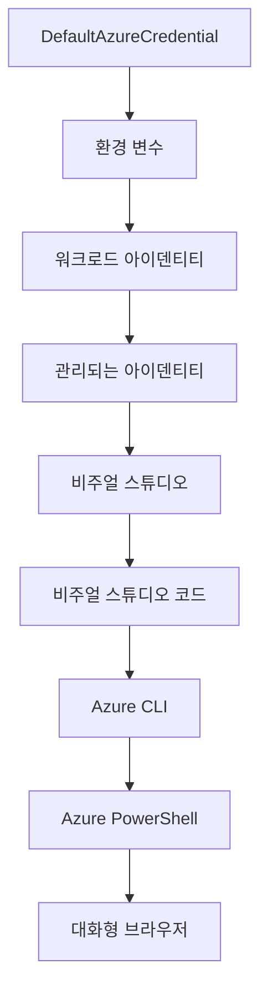

# AZD 기본 - Azure Developer CLI 이해하기

# AZD 기본 - 핵심 개념과 기초

**챕터 탐색:**
- **📚 강의 홈**: [초보자를 위한 AZD](../../README.md)
- **📖 현재 챕터**: 챕터 1 - 기초 및 빠른 시작
- **⬅️ 이전**: [강의 개요](../../README.md#-chapter-1-foundation--quick-start)
- **➡️ 다음**: [설치 및 설정](installation.md)
- **🚀 다음 챕터**: [챕터 2: AI 우선 개발](../chapter-02-ai-development/microsoft-foundry-integration.md)

## 소개

이 강의는 Azure Developer CLI(azd)에 대해 소개합니다. azd는 로컬 개발에서 Azure 배포까지의 여정을 가속화하는 강력한 명령줄 도구입니다. 기본 개념, 핵심 기능을 배우고 azd가 클라우드 네이티브 애플리케이션 배포를 어떻게 단순화하는지 이해할 수 있습니다.

## 학습 목표

이 강의를 마치면:
- Azure Developer CLI가 무엇이며 주요 목적이 무엇인지 이해할 수 있습니다.
- 템플릿, 환경, 서비스의 핵심 개념을 배울 수 있습니다.
- 템플릿 기반 개발 및 코드형 인프라를 포함한 주요 기능을 탐구할 수 있습니다.
- azd 프로젝트 구조와 워크플로우를 이해할 수 있습니다.
- 개발 환경을 위한 azd 설치 및 구성 준비를 할 수 있습니다.

## 학습 성과

이 강의를 완료하면:
- 현대 클라우드 개발 워크플로우에서 azd의 역할을 설명할 수 있습니다.
- azd 프로젝트 구조의 구성요소를 식별할 수 있습니다.
- 템플릿, 환경, 서비스가 어떻게 상호 작용하는지 설명할 수 있습니다.
- azd를 통한 코드형 인프라의 이점을 이해할 수 있습니다.
- 다양한 azd 명령과 그 목적을 인식할 수 있습니다.

## Azure Developer CLI(azd)란?

Azure Developer CLI(azd)는 로컬 개발에서 Azure 배포까지의 여정을 가속하는 명령줄 도구입니다. Azure의 클라우드 네이티브 애플리케이션을 빌드, 배포, 관리하는 과정을 단순화합니다.

### azd로 무엇을 배포할 수 있나요?

azd는 다양한 워크로드를 지원하며, 목록은 계속 늘어나고 있습니다. 오늘날 azd를 사용하여 다음을 배포할 수 있습니다:

| 워크로드 유형 | 예시 | 동일한 워크플로우? |
|---------------|----------|----------------|
| **전통적인 애플리케이션** | 웹 앱, REST API, 정적 사이트 | ✅ `azd up` |
| **서비스 및 마이크로서비스** | 컨테이너 앱, 함수 앱, 다중 서비스 백엔드 | ✅ `azd up` |
| **AI 기반 애플리케이션** | Microsoft Foundry 모델을 사용하는 채팅 앱, AI 검색을 사용하는 RAG 솔루션 | ✅ `azd up` |
| **지능형 에이전트** | Foundry 호스팅 에이전트, 다중 에이전트 오케스트레이션 | ✅ `azd up` |

핵심 통찰은 <strong>배포하는 대상에 상관없이 azd 생애주기는 동일하다</strong>는 점입니다. 프로젝트를 초기화하고, 인프라를 프로비저닝하고, 코드를 배포하고, 앱을 모니터링하며 정리합니다—간단한 웹사이트든 정교한 AI 에이전트든 마찬가지입니다.

이 연속성은 의도된 설계입니다. azd는 AI 기능을 애플리케이션이 사용할 수 있는 또 다른 유형의 서비스로 간주하며, 근본적으로 다른 것으로 보지 않습니다. Microsoft Foundry 모델이 뒷받침하는 채팅 엔드포인트는 azd 관점에서는 구성하고 배포할 또 다른 서비스일 뿐입니다.

### 🎯 왜 AZD를 사용할까요? 실제 비교

간단한 웹 앱과 데이터베이스 배포를 비교해봅시다:

#### ❌ AZD 없이: 수동 Azure 배포 (30분 이상)

```bash
# 1단계: 리소스 그룹 생성
az group create --name myapp-rg --location eastus

# 2단계: 앱 서비스 플랜 생성
az appservice plan create --name myapp-plan \
  --resource-group myapp-rg \
  --sku B1 --is-linux

# 3단계: 웹 앱 생성
az webapp create --name myapp-web-unique123 \
  --resource-group myapp-rg \
  --plan myapp-plan \
  --runtime "NODE:18-lts"

# 4단계: Cosmos DB 계정 생성 (10-15분)
az cosmosdb create --name myapp-cosmos-unique123 \
  --resource-group myapp-rg \
  --kind MongoDB

# 5단계: 데이터베이스 생성
az cosmosdb mongodb database create \
  --account-name myapp-cosmos-unique123 \
  --resource-group myapp-rg \
  --name tododb

# 6단계: 컬렉션 생성
az cosmosdb mongodb collection create \
  --account-name myapp-cosmos-unique123 \
  --resource-group myapp-rg \
  --database-name tododb \
  --name todos

# 7단계: 연결 문자열 가져오기
CONN_STR=$(az cosmosdb keys list \
  --name myapp-cosmos-unique123 \
  --resource-group myapp-rg \
  --type connection-strings \
  --query "connectionStrings[0].connectionString" -o tsv)

# 8단계: 앱 설정 구성
az webapp config appsettings set \
  --name myapp-web-unique123 \
  --resource-group myapp-rg \
  --settings MONGODB_URI="$CONN_STR"

# 9단계: 로깅 활성화
az webapp log config --name myapp-web-unique123 \
  --resource-group myapp-rg \
  --application-logging filesystem \
  --detailed-error-messages true

# 10단계: 애플리케이션 인사이트 설정
az monitor app-insights component create \
  --app myapp-insights \
  --location eastus \
  --resource-group myapp-rg

# 11단계: 앱 인사이트를 웹 앱에 연결
INSTRUMENTATION_KEY=$(az monitor app-insights component show \
  --app myapp-insights \
  --resource-group myapp-rg \
  --query "instrumentationKey" -o tsv)

az webapp config appsettings set \
  --name myapp-web-unique123 \
  --resource-group myapp-rg \
  --settings APPINSIGHTS_INSTRUMENTATIONKEY="$INSTRUMENTATION_KEY"

# 12단계: 로컬에서 애플리케이션 빌드
npm install
npm run build

# 13단계: 배포 패키지 생성
zip -r app.zip . -x "*.git*" "node_modules/*"

# 14단계: 애플리케이션 배포
az webapp deployment source config-zip \
  --resource-group myapp-rg \
  --name myapp-web-unique123 \
  --src app.zip

# 15단계: 기다리고 작동하길 기도하기 🙏
# (자동 검증 없음, 수동 테스트 필요)
```

**문제점들:**
- ❌ 15개 이상의 명령을 기억하고 순서대로 실행해야 함
- ❌ 30-45분의 수동 작업 필요
- ❌ 실수하기 쉬움(오타, 잘못된 매개변수)
- ❌ 연결 문자열이 터미널 기록에 노출됨
- ❌ 실패 시 자동 롤백 없음
- ❌ 팀원 간 복제 어려움
- ❌ 매번 달라짐(재현 불가)

#### ✅ AZD와 함께: 자동화된 배포 (5개 명령, 10-15분)

```bash
# 1단계: 템플릿에서 초기화
azd init --template todo-nodejs-mongo

# 2단계: 인증
azd auth login

# 3단계: 환경 생성
azd env new dev

# 4단계: 변경 사항 미리보기 (선택 사항이지만 권장됨)
azd provision --preview

# 5단계: 모든 것 배포
azd up

# ✨ 완료! 모든 것이 배포, 구성 및 모니터링되었습니다
```

**장점:**
- ✅ 수동 단계 15+개 대비 **5개의 명령어**
- ✅ 대부분 Azure 대기를 포함한 **10-15분** 전체 시간
- ✅ **무결점 처리** - 자동화 및 테스트 완료
- ✅ **Key Vault를 통한 안전한 비밀 관리**
- ✅ **실패 시 자동 롤백**
- ✅ **완전 재현 가능** - 매번 동일 결과
- ✅ **팀 사용 가능** - 누구나 동일 명령으로 배포 가능
- ✅ **코드형 인프라** - 버전 관리된 Bicep 템플릿
- ✅ **내장 모니터링** - Application Insights 자동 구성

### 📊 시간 및 오류 감소

| 지표 | 수동 배포 | AZD 배포 | 향상도 |
|:-------|:------------------|:---------------|:------------|
| **명령 수** | 15+ | 5 | 67% 감소 |
| <strong>시간</strong> | 30-45분 | 10-15분 | 60% 향상 |
| <strong>오류율</strong> | 약 40% | <5% | 88% 감소 |
| <strong>일관성</strong> | 낮음(수동) | 100%(자동화) | 완벽 |
| **팀 합류 시간** | 2-4시간 | 30분 | 75% 향상 |
| **롤백 시간** | 30분 이상(수동) | 2분(자동) | 93% 향상 |

## 핵심 개념

### 템플릿
템플릿은 azd의 기초입니다. 다음을 포함합니다:
- **애플리케이션 코드** - 소스 코드 및 종속성
- **인프라 정의** - Bicep 또는 Terraform으로 정의된 Azure 자원
- **구성 파일** - 설정 및 환경 변수
- **배포 스크립트** - 자동화된 배포 워크플로우

### 환경
환경은 다양한 배포 대상을 나타냅니다:
- <strong>개발</strong> - 테스트 및 개발용
- <strong>스테이징</strong> - 사전 프로덕션 환경
- <strong>프로덕션</strong> - 실시간 프로덕션 환경

각 환경은 다음을 유지합니다:
- Azure 리소스 그룹
- 구성 설정
- 배포 상태

### 서비스
서비스는 애플리케이션의 구성 요소입니다:
- <strong>프론트엔드</strong> - 웹 애플리케이션, SPA
- <strong>백엔드</strong> - API, 마이크로서비스
- <strong>데이터베이스</strong> - 데이터 저장 솔루션
- <strong>스토리지</strong> - 파일 및 블롭 스토리지

## 주요 기능

### 1. 템플릿 기반 개발
```bash
# 사용 가능한 템플릿 찾아보기
azd template list

# 템플릿에서 초기화하기
azd init --template <template-name>
```

### 2. 코드형 인프라
- **Bicep** - Azure 전용 도메인 특화 언어
- **Terraform** - 멀티클라우드 인프라 도구
- **ARM 템플릿** - Azure 리소스 관리자 템플릿

### 3. 통합 워크플로우
```bash
# 완전한 배포 워크플로우
azd up            # 프로비저닝 + 배포, 최초 설정 시 자동 진행

# 🧪 신규: 배포 전에 인프라 변경사항 미리보기 (안전)
azd provision --preview    # 변경 없이 인프라 배포 시뮬레이션

azd provision     # 인프라를 업데이트하면 Azure 리소스를 생성하려면 이것을 사용
azd deploy        # 애플리케이션 코드를 배포하거나 업데이트 후 다시 배포
azd down          # 리소스 정리
```

#### 🛡️ 미리보기로 안전한 인프라 계획
`azd provision --preview` 명령은 안전한 배포를 위해 혁신적입니다:
- **드라이런 분석** - 생성, 수정, 삭제될 항목 표시
- <strong>무위험</strong> - 실제 Azure 환경에 변경 사항 없음
- **팀 협업** - 배포 전 미리보기 결과 공유 가능
- **비용 추정** - 자원 비용 사전 이해

```bash
# 예시 미리보기 워크플로우
azd provision --preview           # 변경될 내용을 확인하세요
# 결과를 검토하고 팀과 논의하세요
azd provision                     # 자신감을 가지고 변경사항을 적용하세요
```

### 📊 시각화: AZD 개발 워크플로우


**워크플로우 설명:**
1. **Init** - 템플릿 또는 새 프로젝트 시작
2. **Auth** - Azure 인증
3. **Environment** - 격리된 배포 환경 생성
4. **Preview** - 🆕 항상 인프라 변경 사항 미리보기(안전 관행)
5. **Provision** - Azure 리소스 생성/업데이트
6. **Deploy** - 애플리케이션 코드 배포
7. **Monitor** - 앱 성능 관찰
8. **Iterate** - 변경 및 재배포
9. **Cleanup** - 완료 후 자원 제거

### 4. 환경 관리
```bash
# 환경을 생성하고 관리하기
azd env new <environment-name>
azd env select <environment-name>
azd env list
```

### 5. 확장 기능 및 AI 명령어

azd는 핵심 CLI를 넘어 기능을 확장할 수 있는 확장 시스템을 사용합니다. 이는 AI 워크로드에 특히 유용합니다:

```bash
# 사용 가능한 확장 목록
azd extension list

# Foundry 에이전트 확장 설치
azd extension install azure.ai.agents

# 매니페스트에서 AI 에이전트 프로젝트 초기화
azd ai agent init -m agent-manifest.yaml

# AI 지원 개발을 위한 MCP 서버 시작 (알파)
azd mcp start
```

> 확장 기능은 [챕터 2: AI 우선 개발](../chapter-02-ai-development/agents.md) 및 [AZD AI CLI 명령어](../chapter-08-production/production-ai-practices.md#azd-ai-cli-commands-and-extensions) 참고자료에서 자세히 다룹니다.

## 📁 프로젝트 구조

일반적인 azd 프로젝트 구조:
```
my-app/
├── .azd/                    # azd configuration
│   └── config.json
├── .azure/                  # Azure deployment artifacts
├── .devcontainer/          # Development container config
├── .github/workflows/      # GitHub Actions
├── .vscode/               # VS Code settings
├── infra/                 # Infrastructure code
│   ├── main.bicep        # Main infrastructure template
│   ├── main.parameters.json
│   └── modules/          # Reusable modules
├── src/                  # Application source code
│   ├── api/             # Backend services
│   └── web/             # Frontend application
├── azure.yaml           # azd project configuration
└── README.md
```

## 🔧 구성 파일

### azure.yaml
주요 프로젝트 구성 파일:
```yaml
name: my-awesome-app
metadata:
  template: my-template@1.0.0

services:
  web:
    project: ./src/web
    language: js
    host: appservice
  api:
    project: ./src/api
    language: js
    host: appservice

hooks:
  preprovision:
    shell: pwsh
    run: echo "Preparing to provision..."
```

### .azure/config.json
환경별 구성:
```json
{
  "version": 1,
  "defaultEnvironment": "dev",
  "environments": {
    "dev": {
      "subscriptionId": "your-subscription-id",
      "location": "eastus"
    }
  }
}
```

## 🎪 실습과 함께하는 일반 워크플로우

> **💡 학습 팁:** 이 실습들을 순서대로 따라가며 AZD 기술을 단계적으로 쌓아가세요.

### 🎯 실습 1: 첫 프로젝트 초기화

**목표:** AZD 프로젝트 생성 및 구조 탐색

**단계:**
```bash
# 검증된 템플릿 사용
azd init --template todo-nodejs-mongo

# 생성된 파일 탐색
ls -la  # 숨김 파일 포함 모든 파일 보기

# 생성된 주요 파일:
# - azure.yaml (주요 설정)
# - infra/ (인프라 코드)
# - src/ (애플리케이션 코드)
```

**✅ 성공:** azure.yaml, infra/, src/ 디렉터리 생성됨

---

### 🎯 실습 2: Azure에 배포

**목표:** 엔드-투-엔드 배포 완료

**단계:**
```bash
# 1. 인증
az login && azd auth login

# 2. 환경 생성
azd env new dev
azd env set AZURE_LOCATION eastus

# 3. 변경 사항 미리 보기 (권장)
azd provision --preview

# 4. 모두 배포
azd up

# 5. 배포 확인
azd show    # 앱 URL 보기
```

**예상 시간:** 10-15분  
**✅ 성공:** 브라우저에서 애플리케이션 URL 열림

---

### 🎯 실습 3: 다중 환경 배포

**목표:** 개발 및 스테이징 환경에 배포

**단계:**
```bash
# 이미 dev가 있으니 staging 생성
azd env new staging
azd env set AZURE_LOCATION westus2
azd up

# 둘 사이 전환
azd env list
azd env select dev
```

**✅ 성공:** Azure 포털에 두 개의 분리된 리소스 그룹 생성됨

---

### 🛡️ 깨끗한 시작: `azd down --force --purge`

완전히 초기화가 필요할 때:

```bash
azd down --force --purge
```

**동작 내용:**
- `--force`: 확인 요청 없음
- `--purge`: 모든 로컬 상태 및 Azure 리소스 삭제

**사용 시기:**
- 배포 중간 실패 시
- 프로젝트 변경 시
- 새 시작이 필요할 때

---

## 🎪 원본 워크플로우 참고

### 새 프로젝트 시작
```bash
# 방법 1: 기존 템플릿 사용
azd init --template todo-nodejs-mongo

# 방법 2: 처음부터 시작
azd init

# 방법 3: 현재 디렉토리 사용
azd init .
```

### 개발 사이클
```bash
# 개발 환경 설정
azd auth login
azd env new dev
azd env select dev

# 모든 것을 배포
azd up

# 변경 사항 적용 후 다시 배포
azd deploy

# 완료 후 정리
azd down --force --purge # Azure 개발자 CLI의 명령어는 환경에 대한 **하드 리셋**으로, 실패한 배포 문제 해결, 고아 리소스 정리 또는 새로 배포 준비 시 특히 유용합니다.
```

## `azd down --force --purge` 이해하기
`azd down --force --purge` 명령어는 azd 환경과 관련된 모든 리소스를 완전히 해체하는 강력한 방법입니다. 각 플래그가 하는 일을 설명합니다:
```
--force
```
- 확인 요청 건너뜀
- 수동 입력이 불가능한 자동화나 스크립트에 유용
- CLI가 불일치를 감지해도 중단 없이 처리 보장

```
--purge
```
다음과 같은 **모든 관련 메타데이터를 삭제**:
환경 상태
로컬 `.azure` 폴더
캐시된 배포 정보
azd가 이전 배포를 "기억"하지 못하게 하여 리소스 그룹 불일치나 오래된 레지스트리 참조 문제 방지


### 왜 둘을 함께 사용할까요?
`azd up` 실행 시 남아있는 상태나 부분 배포로 문제가 발생할 때, 이 조합은 <strong>완전 초기화된 상태</strong>를 만듭니다.

특히 Azure 포털에서 수동으로 리소스를 삭제한 후나 템플릿, 환경, 리소스 그룹 네이밍 규칙을 변경할 때 유용합니다.


### 다중 환경 관리
```bash
# 스테이징 환경 생성
azd env new staging
azd env select staging
azd up

# 다시 개발 환경으로 전환
azd env select dev

# 환경 비교
azd env list
```

## 🔐 인증 및 자격 증명

성공적인 azd 배포를 위해서는 인증 이해가 중요합니다. Azure는 다양한 인증 방식을 사용하며 azd는 다른 Azure 도구가 사용하는 동일한 자격 증명 체인을 활용합니다.

### Azure CLI 인증(`az login`)

azd 사용 전 Azure에 인증해야 합니다. 가장 일반적인 방법은 Azure CLI 사용입니다:

```bash
# 대화형 로그인 (브라우저 열기)
az login

# 특정 테넌트로 로그인
az login --tenant <tenant-id>

# 서비스 프린서플로 로그인
az login --service-principal -u <app-id> -p <password> --tenant <tenant-id>

# 현재 로그인 상태 확인
az account show

# 사용 가능한 구독 목록
az account list --output table

# 기본 구독 설정
az account set --subscription <subscription-id>
```

### 인증 흐름
1. **대화형 로그인**: 기본 브라우저가 열려 인증 수행
2. **디바이스 코드 플로우**: 브라우저가 없는 환경용
3. **서비스 주체**: 자동화 및 CI/CD 시나리오용
4. **관리되는 ID**: Azure 호스팅 애플리케이션용

### DefaultAzureCredential 체인

`DefaultAzureCredential`은 특정 순서로 여러 인증 소스를 자동 시도하여 간편한 인증을 제공하는 자격 증명 타입입니다:

#### 자격 증명 체인 순서

#### 1. 환경 변수
```bash
# 서비스 주체를 위한 환경 변수 설정
export AZURE_CLIENT_ID="<app-id>"
export AZURE_CLIENT_SECRET="<password>"
export AZURE_TENANT_ID="<tenant-id>"
```

#### 2. 워크로드 아이덴티티(Kubernetes/GitHub Actions)
다음 환경에서 자동 사용:
- Azure Kubernetes Service(AKS)의 워크로드 아이덴티티
- OIDC 페더레이션을 사용하는 GitHub Actions
- 기타 페더레이션 ID 시나리오

#### 3. 관리되는 ID
Azure 리소스용:
- 가상 머신
- 앱 서비스
- Azure 함수
- 컨테이너 인스턴스

```bash
# 관리 ID가 있는 Azure 리소스에서 실행 중인지 확인
az account show --query "user.type" --output tsv
# 반환값: 관리 ID를 사용하는 경우 "servicePrincipal"
```

#### 4. 개발자 도구 통합
- **Visual Studio**: 로그인한 계정을 자동 사용
- **VS Code**: Azure 계정 확장 자격 증명 사용
- **Azure CLI**: `az login` 자격 증명 사용(로컬 개발에서 가장 일반적)

### AZD 인증 설정

```bash
# 방법 1: Azure CLI 사용 (개발에 권장)
az login
azd auth login  # 기존 Azure CLI 자격 증명 사용

# 방법 2: 직접 azd 인증
azd auth login --use-device-code  # 헤드리스 환경용

# 방법 3: 인증 상태 확인
azd auth login --check-status

# 방법 4: 로그아웃 및 재인증
azd auth logout
azd auth login
```

### 인증 모범 사례

#### 로컬 개발용
```bash
# 1. Azure CLI로 로그인하기
az login

# 2. 올바른 구독 확인하기
az account show
az account set --subscription "Your Subscription Name"

# 3. 기존 자격 증명으로 azd 사용하기
azd auth login
```

#### CI/CD 파이프라인용
```yaml
# GitHub Actions example
- name: Azure Login
  uses: azure/login@v1
  with:
    creds: ${{ secrets.AZURE_CREDENTIALS }}

- name: Deploy with azd
  run: |
    azd auth login --client-id ${{ secrets.AZURE_CLIENT_ID }} \
                    --client-secret ${{ secrets.AZURE_CLIENT_SECRET }} \
                    --tenant-id ${{ secrets.AZURE_TENANT_ID }}
    azd up --no-prompt
```

#### 프로덕션 환경용
- Azure 리소스에서 실행 시 **관리되는 ID** 사용
- 자동화 시나리오에서는 **서비스 주체** 사용
- 코드나 구성 파일에 자격 증명 저장을 피함
- 민감한 구성은 **Azure Key Vault** 사용

### 일반 인증 문제 및 해결책

#### 문제: "No subscription found"
```bash
# 솔루션: 기본 구독 설정
az account list --output table
az account set --subscription "<subscription-id>"
azd env set AZURE_SUBSCRIPTION_ID "<subscription-id>"
```

#### 문제: "Insufficient permissions"
```bash
# 솔루션: 필요한 역할 확인 및 할당
az role assignment list --assignee $(az account show --query user.name --output tsv)

# 일반적인 필수 역할:
# - 기여자(리소스 관리용)
# - 사용자 액세스 관리자(역할 할당용)
```

#### 문제: "Token expired"
```bash
# 해결책: 다시 인증하기
az logout
az login
azd auth logout
azd auth login
```

### 다양한 시나리오에서 인증

#### 로컬 개발
```bash
# 개인 개발 계좌
az login
azd auth login
```

#### 팀 개발
```bash
# 조직에 특정 테넌트 사용하기
az login --tenant contoso.onmicrosoft.com
azd auth login
```

#### 다중 테넌트 시나리오
```bash
# 테넌트 간 전환
az login --tenant tenant1.onmicrosoft.com
# 테넌트 1에 배포
azd up

az login --tenant tenant2.onmicrosoft.com  
# 테넌트 2에 배포
azd up
```

### 보안 고려사항
1. **자격 증명 저장**: 자격 증명을 소스 코드에 절대 저장하지 마세요  
2. **범위 제한**: 서비스 주체에 대해 최소 권한 원칙을 적용하세요  
3. **토큰 교체**: 서비스 주체 비밀을 정기적으로 갱신하세요  
4. **감사 기록**: 인증 및 배포 활동을 모니터링하세요  
5. **네트워크 보안**: 가능한 경우 개인 엔드포인트를 사용하세요  

### 인증 문제 해결

```bash
# 인증 문제 디버그
azd auth login --check-status
az account show
az account get-access-token

# 일반적인 진단 명령어
whoami                          # 현재 사용자 컨텍스트
az ad signed-in-user show      # Azure AD 사용자 세부 정보
az group list                  # 리소스 액세스 테스트
```
  
## `azd down --force --purge` 이해하기  

### 탐색  
```bash
azd template list              # 템플릿 찾아보기
azd template show <template>   # 템플릿 세부 정보
azd init --help               # 초기화 옵션
```
  
### 프로젝트 관리  
```bash
azd show                     # 프로젝트 개요
azd env show                 # 현재 환경
azd config list             # 구성 설정
```
  
### 모니터링  
```bash
azd monitor                  # Azure 포털 모니터링 열기
azd monitor --logs           # 애플리케이션 로그 보기
azd monitor --live           # 실시간 메트릭 보기
azd pipeline config          # CI/CD 설정하기
```
  
## 모범 사례  

### 1. 의미 있는 이름 사용  
```bash
# 좋음
azd env new production-east
azd init --template web-app-secure

# 피하십시오
azd env new env1
azd init --template template1
```
  
### 2. 템플릿 활용  
- 기존 템플릿에서 시작  
- 필요에 맞게 맞춤화  
- 조직을 위한 재사용 가능한 템플릿 작성  

### 3. 환경 분리  
- 개발/스테이징/프로덕션 별로 분리된 환경 사용  
- 로컬 머신에서 프로덕션으로 직접 배포하지 않음  
- 프로덕션 배포에는 CI/CD 파이프라인 사용  

### 4. 구성 관리  
- 민감한 데이터는 환경 변수로 관리  
- 구성은 버전 관리 시스템에 보관  
- 환경별 설정 문서화  

## 학습 진행 단계  

### 초급 (1-2주 차)  
1. azd 설치 및 인증  
2. 간단한 템플릿 배포  
3. 프로젝트 구조 이해  
4. 기본 명령어 학습 (up, down, deploy)  

### 중급 (3-4주 차)  
1. 템플릿 맞춤화  
2. 다중 환경 관리  
3. 인프라 코드 이해  
4. CI/CD 파이프라인 설정  

### 고급 (5주 차 이상)  
1. 맞춤형 템플릿 생성  
2. 고급 인프라 패턴  
3. 다중 지역 배포  
4. 엔터프라이즈급 구성  

## 다음 단계  

**📖 1장 학습 이어가기:**  
- [설치 및 설정](installation.md) - azd 설치 및 구성  
- [첫 번째 프로젝트](first-project.md) - 실습 튜토리얼 완료  
- [구성 가이드](configuration.md) - 고급 구성 옵션  

**🎯 다음 장 준비되셨나요?**  
- [2장: AI 우선 개발](../chapter-02-ai-development/microsoft-foundry-integration.md) - AI 애플리케이션 개발 시작  

## 추가 자료  

- [Azure Developer CLI 개요](https://learn.microsoft.com/en-us/azure/developer/azure-developer-cli/)  
- [템플릿 갤러리](https://azure.github.io/awesome-azd/)  
- [커뮤니티 샘플](https://github.com/Azure-Samples)  

---

## 🙋 자주 묻는 질문  

### 일반 질문  

**Q: AZD와 Azure CLI의 차이점은 무엇인가요?**  

A: Azure CLI(`az`)는 개별 Azure 리소스 관리용입니다. AZD(`azd`)는 전체 애플리케이션 관리를 위한 도구입니다:  

```bash
# Azure CLI - 저수준 리소스 관리
az webapp create --name myapp --resource-group rg
az sql server create --name myserver --resource-group rg
# ...더 많은 명령어가 필요함

# AZD - 애플리케이션 수준 관리
azd up  # 모든 리소스와 함께 전체 앱 배포
```
  
**이렇게 생각해 보세요:**  
- `az` = 개별 레고 블록 조작  
- `azd` = 완성된 레고 세트 작업  

---

**Q: AZD 사용하려면 Bicep이나 Terraform을 알아야 하나요?**  

A: 아니요! 템플릿부터 시작하세요:  
```bash
# 기존 템플릿 사용 - IaC 지식 불필요
azd init --template todo-nodejs-mongo
azd up
```
  
나중에 인프라를 맞춤화하려면 Bicep을 배워도 좋습니다. 템플릿은 작동하는 예제이므로 배울 수 있습니다.  

---

**Q: AZD 템플릿 사용 시 비용은 얼마나 드나요?**  

A: 템플릿별로 다릅니다. 대부분 개발용 템플릿은 월 $50-150 정도입니다:  

```bash
# 배포하기 전에 비용 미리보기
azd provision --preview

# 사용하지 않을 때는 항상 정리
azd down --force --purge  # 모든 리소스 제거
```
  
**꿀팁:** 무료 티어를 최대한 활용하세요:  
- 앱 서비스: F1 (무료) 티어  
- Microsoft Foundry 모델: Azure OpenAI 50,000 토큰/월 무료  
- Cosmos DB: 1000 RU/s 무료 티어  

---

**Q: 기존 Azure 리소스와 함께 AZD를 사용할 수 있나요?**  

A: 네, 가능하지만 처음부터 새로 시작하는 것이 더 쉽습니다. AZD는 전체 수명 주기를 관리할 때 가장 효율적입니다. 기존 리소스 사용 시:  

```bash
# 옵션 1: 기존 리소스 가져오기(고급)
azd init
# 그런 다음 infra/를 수정하여 기존 리소스를 참조합니다

# 옵션 2: 새로 시작하기(권장)
azd init --template matching-your-stack
azd up  # 새 환경을 만듭니다
```
  
---

**Q: 프로젝트를 팀원과 어떻게 공유하나요?**  

A: AZD 프로젝트를 Git에 커밋하세요 (.azure 폴더 제외):  

```bash
# 기본적으로 이미 .gitignore에 포함됨
.azure/        # 비밀 정보와 환경 데이터를 포함
*.env          # 환경 변수

# 팀 구성원들은 다음과 같이:
git clone <your-repo>
azd auth login
azd env new <their-name>-dev
azd up
```
  
모든 사람이 동일한 템플릿으로 같은 인프라를 받게 됩니다.  

---

### 문제 해결 질문  

**Q: "azd up" 명령이 중간에 실패했어요. 어떻게 하나요?**  

A: 오류를 확인하고 수정한 후 재시도하세요:  

```bash
# 자세한 로그 보기
azd show

# 일반적인 수정 사항:

# 1. 할당량 초과 시:
azd env set AZURE_LOCATION "westus2"  # 다른 지역 시도

# 2. 리소스 이름 충돌 시:
azd down --force --purge  # 초기화
azd up  # 재시도

# 3. 인증 만료 시:
az login
azd auth login
azd up
```
  
**가장 흔한 문제:** 잘못된 Azure 구독 선택  
```bash
az account list --output table
az account set --subscription "<correct-subscription>"
```
  
---

**Q: 인프라 재프로비저닝 없이 코드 변경만 배포하려면?**  

A: `azd up` 대신 `azd deploy`를 사용하세요:  

```bash
azd up          # 처음 실행: 프로비저닝 + 배포 (느림)

# 코드 변경 수행...

azd deploy      # 이후 실행: 배포만 (빠름)
```
  
속도 비교:  
- `azd up`: 10-15분 (인프라 프로비저닝 포함)  
- `azd deploy`: 2-5분 (코드만)  

---

**Q: 인프라 템플릿을 맞춤화할 수 있나요?**  

A: 네! `infra/` 폴더 내 Bicep 파일을 편집하면 됩니다:  

```bash
# azd 초기화 후
cd infra/
code main.bicep  # VS Code에서 편집

# 변경 내용 미리보기
azd provision --preview

# 변경 내용 적용
azd provision
```
  
**꿀팁:** 먼저 SKU부터 변경해 보세요:  
```bicep
// infra/main.bicep
sku: {
  name: 'B1'  // Change to 'P1V2' for production
}
```
  
---

**Q: AZD가 만든 모든 것을 삭제하려면?**  

A: 한 명령어로 모든 리소스를 삭제할 수 있습니다:  

```bash
azd down --force --purge

# 이것은 삭제합니다:
# - 모든 Azure 리소스
# - 리소스 그룹
# - 로컬 환경 상태
# - 캐시된 배포 데이터
```
  
**다음 시점에 꼭 실행하세요:**  
- 템플릿 테스트 완료 후  
- 다른 프로젝트로 전환 시  
- 새로 시작하고 싶을 때  

**비용 절감:** 미사용 리소스 삭제는 비용 청구를 없앱니다  

---

**Q: Azure Portal에서 리소스를 실수로 삭제했어요. 어떻게 하나요?**  

A: AZD 상태가 동기화되지 않을 수 있습니다. 초기화가 필요합니다:  

```bash
# 1. 로컬 상태 제거
azd down --force --purge

# 2. 새로 시작
azd up

# 대안: AZD가 감지하고 수정하도록 허용
azd provision  # 누락된 리소스를 생성합니다
```
  
---

### 고급 질문  

**Q: AZD를 CI/CD 파이프라인에서 사용할 수 있나요?**  

A: 네! GitHub Actions 예시입니다:  

```yaml
# .github/workflows/deploy.yml
name: Deploy with AZD

on:
  push:
    branches: [main]

jobs:
  deploy:
    runs-on: ubuntu-latest
    steps:
      - uses: actions/checkout@v2
      
      - name: Install azd
        run: curl -fsSL https://aka.ms/install-azd.sh | bash
      
      - name: Azure Login
        run: |
          azd auth login \
            --client-id ${{ secrets.AZURE_CLIENT_ID }} \
            --client-secret ${{ secrets.AZURE_CLIENT_SECRET }} \
            --tenant-id ${{ secrets.AZURE_TENANT_ID }}
      
      - name: Deploy
        run: azd up --no-prompt
```
  
---

**Q: 비밀 및 민감 데이터를 어떻게 관리하나요?**  

A: AZD는 Azure Key Vault와 자동으로 통합됩니다:  

```bash
# 비밀은 코드가 아니라 키 볼트에 저장됩니다
azd env set DATABASE_PASSWORD "$(openssl rand -base64 32)"

# AZD는 자동으로:
# 1. 키 볼트를 생성합니다
# 2. 비밀을 저장합니다
# 3. 관리 ID를 통해 앱 접근 권한을 부여합니다
# 4. 런타임에 주입합니다
```
  
**절대 커밋 금지:**  
- `.azure/` 폴더 (환경 데이터 포함)  
- `.env` 파일 (로컬 비밀)  
- 연결 문자열  

---

**Q: 여러 지역에 배포할 수 있나요?**  

A: 네, 지역별로 환경을 생성하세요:  

```bash
# 동부 미국 환경
azd env new prod-eastus
azd env set AZURE_LOCATION eastus
azd up

# 서부 유럽 환경
azd env new prod-westeurope
azd env set AZURE_LOCATION westeurope
azd up

# 각 환경은 독립적입니다
azd env list
```
  
진정한 다중 지역 앱은 템플릿 Bicep을 맞춤화해 동시에 여러 지역에 배포합니다.  

---

**Q: 문제 발생 시 어디서 도움을 받을 수 있나요?**  

1. **AZD 문서:** https://learn.microsoft.com/azure/developer/azure-developer-cli/  
2. **GitHub 이슈:** https://github.com/Azure/azure-dev/issues  
3. **Discord:** [Azure Discord](https://discord.gg/microsoft-azure) - #azure-developer-cli 채널  
4. **Stack Overflow:** 태그 `azure-developer-cli`  
5. **이 강의:** [문제 해결 가이드](../chapter-07-troubleshooting/common-issues.md)  

**꿀팁:** 질문하기 전에 다음을 실행하세요:  
```bash
azd show       # 현재 상태를 표시합니다
azd version    # 당신의 버전을 표시합니다
```
  
질문에 이 정보를 포함하면 더 빠른 지원을 받을 수 있습니다.  

---

## 🎓 다음은?  

이제 AZD 기본을 이해했습니다. 원하는 경로를 선택하세요:  

### 🎯 초보자용:  
1. **다음:** [설치 및 설정](installation.md) - AZD 설치  
2. **그다음:** [첫 프로젝트](first-project.md) - 첫 앱 배포  
3. **연습:** 이 강의 내 3가지 연습 모두 완료  

### 🚀 AI 개발자용:  
1. **바로가기:** [2장: AI 우선 개발](../chapter-02-ai-development/microsoft-foundry-integration.md)  
2. **배포:** `azd init --template get-started-with-ai-chat`로 시작  
3. **학습:** 배포하면서 빌드  

### 🏗️ 숙련 개발자용:  
1. **복습:** [구성 가이드](configuration.md) - 고급 설정  
2. **탐색:** [인프라 코드](../chapter-04-infrastructure/provisioning.md) - Bicep 심화  
3. **구축:** 자체 스택 맞춤형 템플릿 제작  

---

**장 이동:**  
- **📚 과정 홈**: [초보자를 위한 AZD](../../README.md)  
- **📖 현재 장**: 1장 - 기초 및 빠른 시작  
- **⬅️ 이전**: [과정 개요](../../README.md#-chapter-1-foundation--quick-start)  
- **➡️ 다음**: [설치 및 설정](installation.md)  
- **🚀 다음 장**: [2장: AI 우선 개발](../chapter-02-ai-development/microsoft-foundry-integration.md)

---

<!-- CO-OP TRANSLATOR DISCLAIMER START -->
**면책 조항**:  
이 문서는 AI 번역 서비스 [Co-op Translator](https://github.com/Azure/co-op-translator)를 사용하여 번역되었습니다. 정확성을 위해 최선을 다하고 있으나, 자동 번역에는 오류나 부정확한 내용이 포함될 수 있음을 알려드립니다. 원본 문서의 원어판이 권위 있는 출처로 간주되어야 합니다. 중요한 정보의 경우 전문 인간 번역을 권장합니다. 본 번역 사용으로 인해 발생하는 오해나 오해석에 대해서는 당사가 책임을 지지 않습니다.
<!-- CO-OP TRANSLATOR DISCLAIMER END -->