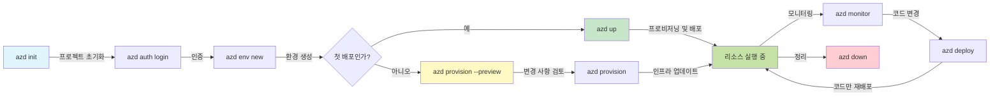

# AZD Basics - Azure Developer CLI 이해하기

# AZD 기초 - 핵심 개념 및 기초

**챕터 내비게이션:**
- **📚 강좌 홈**: [초보자를 위한 AZD](../../README.md)
- **📖 현재 장**: 챕터 1 - 기초 및 빠른 시작
- **⬅️ 이전**: [강좌 개요](../../README.md#-chapter-1-foundation--quick-start)
- **➡️ 다음**: [설치 및 설정](installation.md)
- **🚀 다음 장**: [챕터 2: AI 우선 개발](../chapter-02-ai-development/microsoft-foundry-integration.md)

## 소개

이 수업에서는 Azure Developer CLI(azd)를 소개합니다. azd는 로컬 개발에서 Azure 배포로의 여정을 가속화하는 강력한 커맨드라인 도구입니다. 이 수업을 통해 기본 개념, 핵심 기능을 배우고 azd가 클라우드 네이티브 애플리케이션 배포를 어떻게 단순화하는지 이해하게 됩니다.

## 학습 목표

이 수업을 마치면 다음을 할 수 있습니다:
- Azure Developer CLI가 무엇이며 주요 목적이 무엇인지 이해
- 템플릿, 환경 및 서비스의 핵심 개념 학습
- 템플릿 기반 개발 및 코드로서의 인프라를 포함한 주요 기능 탐색
- azd 프로젝트 구조 및 워크플로 이해
- 개발 환경에 azd를 설치하고 구성할 준비

## 학습 성과

이 수업을 완료한 후 다음을 수행할 수 있습니다:
- 현대 클라우드 개발 워크플로에서 azd의 역할 설명
- azd 프로젝트 구조의 구성요소 식별
- 템플릿, 환경 및 서비스가 어떻게 함께 작동하는지 설명
- azd로 코드로서의 인프라의 이점 이해
- 다양한 azd 명령과 그 목적 인식

## Azure Developer CLI(azd)란?

Azure Developer CLI(azd)는 로컬 개발에서 Azure 배포로의 여정을 가속화하도록 설계된 커맨드라인 도구입니다. Azure에서 클라우드 네이티브 애플리케이션을 빌드, 배포 및 관리하는 과정을 단순화합니다.

### 🎯 AZD를 사용하는 이유? 실제 사례 비교

간단한 웹 앱과 데이터베이스를 배포하는 경우를 비교해봅시다:

#### ❌ AZD 없이: 수동 Azure 배포 (30분 이상)

```bash
# 1단계: 리소스 그룹 생성
az group create --name myapp-rg --location eastus

# 2단계: 앱 서비스 플랜 생성
az appservice plan create --name myapp-plan \
  --resource-group myapp-rg \
  --sku B1 --is-linux

# 3단계: 웹 앱 생성
az webapp create --name myapp-web-unique123 \
  --resource-group myapp-rg \
  --plan myapp-plan \
  --runtime "NODE:18-lts"

# 4단계: Cosmos DB 계정 생성 (10-15분)
az cosmosdb create --name myapp-cosmos-unique123 \
  --resource-group myapp-rg \
  --kind MongoDB

# 5단계: 데이터베이스 생성
az cosmosdb mongodb database create \
  --account-name myapp-cosmos-unique123 \
  --resource-group myapp-rg \
  --name tododb

# 6단계: 컬렉션 생성
az cosmosdb mongodb collection create \
  --account-name myapp-cosmos-unique123 \
  --resource-group myapp-rg \
  --database-name tododb \
  --name todos

# 7단계: 연결 문자열 가져오기
CONN_STR=$(az cosmosdb keys list \
  --name myapp-cosmos-unique123 \
  --resource-group myapp-rg \
  --type connection-strings \
  --query "connectionStrings[0].connectionString" -o tsv)

# 8단계: 앱 설정 구성
az webapp config appsettings set \
  --name myapp-web-unique123 \
  --resource-group myapp-rg \
  --settings MONGODB_URI="$CONN_STR"

# 9단계: 로깅 활성화
az webapp log config --name myapp-web-unique123 \
  --resource-group myapp-rg \
  --application-logging filesystem \
  --detailed-error-messages true

# 10단계: Application Insights 설정
az monitor app-insights component create \
  --app myapp-insights \
  --location eastus \
  --resource-group myapp-rg

# 11단계: Application Insights를 웹 앱에 연결
INSTRUMENTATION_KEY=$(az monitor app-insights component show \
  --app myapp-insights \
  --resource-group myapp-rg \
  --query "instrumentationKey" -o tsv)

az webapp config appsettings set \
  --name myapp-web-unique123 \
  --resource-group myapp-rg \
  --settings APPINSIGHTS_INSTRUMENTATIONKEY="$INSTRUMENTATION_KEY"

# 12단계: 애플리케이션을 로컬에서 빌드
npm install
npm run build

# 13단계: 배포 패키지 생성
zip -r app.zip . -x "*.git*" "node_modules/*"

# 14단계: 애플리케이션 배포
az webapp deployment source config-zip \
  --resource-group myapp-rg \
  --name myapp-web-unique123 \
  --src app.zip

# 15단계: 기다리며 잘 되기를 기원하세요 🙏
# (자동화된 검증 없음, 수동 테스트 필요)
```

**문제점:**
- ❌ 기억하고 순서대로 실행해야 하는 15개 이상의 명령
- ❌ 30-45분의 수동 작업
- ❌ 실수하기 쉬움(오타, 잘못된 매개변수)
- ❌ 터미널 기록에 연결 문자열이 노출됨
- ❌ 실패 시 자동 롤백 없음
- ❌ 팀원이 재현하기 어려움
- ❌ 매번 다름(재현 불가)

#### ✅ AZD 사용: 자동화된 배포 (명령 5개, 10-15분)

```bash
# 1단계: 템플릿에서 초기화
azd init --template todo-nodejs-mongo

# 2단계: 인증
azd auth login

# 3단계: 환경 생성
azd env new dev

# 4단계: 변경 사항 미리보기 (선택 사항이지만 권장)
azd provision --preview

# 5단계: 모든 항목 배포
azd up

# ✨ 완료! 모든 항목이 배포되고 구성되며 모니터링됩니다
```

**이점:**
- ✅ **5개의 명령** vs. 15+ 수동 단계
- ✅ **총 10-15분** (대부분 Azure 대기 시간)
- ✅ **오류 없음** - 자동화되고 테스트됨
- ✅ **비밀이 Key Vault를 통해 안전하게 관리됨**
- ✅ **실패 시 자동 롤백**
- ✅ **완전 재현 가능** - 매번 동일한 결과
- ✅ **팀 사용 가능** - 누구나 동일한 명령으로 배포 가능
- ✅ **코드로서의 인프라(Infrastructure as Code)** - 버전 관리되는 Bicep 템플릿
- ✅ **내장 모니터링** - Application Insights가 자동으로 구성됨

### 📊 시간 및 오류 감소

| 지표 | 수동 배포 | AZD 배포 | 개선 |
|:-------|:------------------|:---------------|:------------|
| **명령** | 15+ | 5 | 67% 감소 |
| **시간** | 30-45분 | 10-15분 | 60% 빠름 |
| **오류율** | 약 40% | <5% | 88% 감소 |
| **일관성** | 낮음(수동) | 100%(자동화) | 완벽 |
| **팀 온보딩** | 2-4시간 | 30분 | 75% 빠름 |
| **롤백 시간** | 30분+ (수동) | 2분 (자동화) | 93% 빠름 |

## 핵심 개념

### 템플릿
템플릿은 azd의 기반입니다. 템플릿은 다음을 포함합니다:
- **애플리케이션 코드** - 소스 코드 및 종속성
- **인프라 정의** - Bicep 또는 Terraform으로 정의된 Azure 리소스
- **구성 파일** - 설정 및 환경 변수
- **배포 스크립트** - 자동화된 배포 워크플로

### 환경
환경은 서로 다른 배포 대상입니다:
- **개발(Development)** - 테스트 및 개발용
- **스테이징(Staging)** - 사전 운영 환경
- **운영(Production)** - 실제 운영 환경

각 환경은 자체적으로 다음을 유지합니다:
- Azure 리소스 그룹
- 구성 설정
- 배포 상태

### 서비스
서비스는 애플리케이션의 구성 요소입니다:
- **프런트엔드(Frontend)** - 웹 애플리케이션, SPA
- **백엔드(Backend)** - API, 마이크로서비스
- **데이터베이스(Database)** - 데이터 저장 솔루션
- **스토리지(Storage)** - 파일 및 Blob 스토리지

## 주요 기능

### 1. 템플릿 기반 개발
```bash
# 사용 가능한 템플릿 둘러보기
azd template list

# 템플릿에서 초기화
azd init --template <template-name>
```

### 2. 코드로서의 인프라(Infrastructure as Code)
- **Bicep** - Azure의 도메인 특화 언어
- **Terraform** - 멀티 클라우드 인프라 도구
- **ARM 템플릿** - Azure Resource Manager 템플릿

### 3. 통합 워크플로
```bash
# 전체 배포 워크플로우
azd up            # 프로비저닝 + 배포 — 초기 설정 시 수동 개입 불필요

# 🧪 새 기능: 배포 전에 인프라 변경 사항 미리보기 (안전)
azd provision --preview    # 변경을 가하지 않고 인프라 배포를 시뮬레이션

azd provision     # 인프라를 업데이트할 경우 Azure 리소스를 생성하려면 이것을 사용하세요
azd deploy        # 애플리케이션 코드를 배포하거나 업데이트 후 재배포
azd down          # 리소스 정리
```

#### 🛡️ 미리보기로 안전한 인프라 계획
`azd provision --preview` 명령은 안전한 배포를 위한 게임 체인저입니다:
- **미리 실행 분석(Dry-run analysis)** - 생성, 수정 또는 삭제될 항목을 표시합니다
- **무위험** - Azure 환경에 실제 변경이 이루어지지 않습니다
- **팀 협업** - 배포 전에 미리보기 결과를 공유
- **비용 추정** - 리소스 비용을 사전에 파악

```bash
# 예시 미리보기 워크플로우
azd provision --preview           # 변경될 내용을 확인
# 출력 결과를 검토하고 팀과 논의
azd provision                     # 자신감을 가지고 변경 사항을 적용
```

### 📊 시각 자료: AZD 개발 워크플로


**워크플로 설명:**
1. **Init** - 템플릿 또는 새 프로젝트로 시작
2. **Auth** - Azure에 인증
3. **Environment** - 격리된 배포 환경 생성
4. **Preview** - 🆕 항상 먼저 인프라 변경사항을 미리보기(안전한 관행)
5. **Provision** - Azure 리소스 생성/업데이트
6. **Deploy** - 애플리케이션 코드를 배포
7. **Monitor** - 애플리케이션 성능 관찰
8. **Iterate** - 변경하고 코드 재배포
9. **Cleanup** - 완료 후 리소스 제거

### 4. 환경 관리
```bash
# 환경을 생성하고 관리합니다
azd env new <environment-name>
azd env select <environment-name>
azd env list
```

## 📁 프로젝트 구조

일반적인 azd 프로젝트 구조:
```
my-app/
├── .azd/                    # azd configuration
│   └── config.json
├── .azure/                  # Azure deployment artifacts
├── .devcontainer/          # Development container config
├── .github/workflows/      # GitHub Actions
├── .vscode/               # VS Code settings
├── infra/                 # Infrastructure code
│   ├── main.bicep        # Main infrastructure template
│   ├── main.parameters.json
│   └── modules/          # Reusable modules
├── src/                  # Application source code
│   ├── api/             # Backend services
│   └── web/             # Frontend application
├── azure.yaml           # azd project configuration
└── README.md
```

## 🔧 구성 파일

### azure.yaml
프로젝트의 주요 구성 파일:
```yaml
name: my-awesome-app
metadata:
  template: my-template@1.0.0

services:
  web:
    project: ./src/web
    language: js
    host: appservice
  api:
    project: ./src/api
    language: js
    host: appservice

hooks:
  preprovision:
    shell: pwsh
    run: echo "Preparing to provision..."
```

### .azure/config.json
환경별 구성:
```json
{
  "version": 1,
  "defaultEnvironment": "dev",
  "environments": {
    "dev": {
      "subscriptionId": "your-subscription-id",
      "location": "eastus"
    }
  }
}
```

## 🎪 실습이 포함된 일반 워크플로

> **💡 학습 팁:** 이 연습들을 순서대로 따라하여 AZD 기술을 단계적으로 향상하세요.

### 🎯 연습 1: 첫 프로젝트 초기화하기

**목표:** AZD 프로젝트를 만들고 구조를 탐색하기

**단계:**
```bash
# 검증된 템플릿 사용
azd init --template todo-nodejs-mongo

# 생성된 파일 탐색
ls -la  # 숨김 파일을 포함한 모든 파일 보기

# 생성된 주요 파일:
# - azure.yaml (주요 구성)
# - infra/ (인프라 코드)
# - src/ (애플리케이션 코드)
```

**✅ 성공:** azure.yaml, infra/, src/ 디렉터리가 있습니다

---

### 🎯 연습 2: Azure에 배포하기

**목표:** 엔드 투 엔드 배포 완료

**단계:**
```bash
# 1. 인증
az login && azd auth login

# 2. 환경 생성
azd env new dev
azd env set AZURE_LOCATION eastus

# 3. 변경 사항 미리보기 (권장)
azd provision --preview

# 4. 모든 항목 배포
azd up

# 5. 배포 확인
azd show    # 앱 URL 보기
```

**예상 시간:** 10-15분  
**✅ 성공:** 애플리케이션 URL이 브라우저에서 열립니다

---

### 🎯 연습 3: 다중 환경

**목표:** dev 및 staging에 배포

**단계:**
```bash
# 이미 dev가 있으므로 staging을 생성
azd env new staging
azd env set AZURE_LOCATION westus2
azd up

# 둘 사이를 전환
azd env list
azd env select dev
```

**✅ 성공:** Azure 포털에 두 개의 별도 리소스 그룹이 생성됨

---

### 🛡️ 초기화: `azd down --force --purge`

완전히 재설정해야 할 때:

```bash
azd down --force --purge
```

**무엇을 하는가:**
- `--force`: 확인 프롬프트 없음
- `--purge`: 모든 로컬 상태 및 Azure 리소스 삭제

**사용 시:**
- 배포가 중간에 실패한 경우
- 프로젝트를 전환할 때
- 새로운 시작이 필요할 때

---

## 🎪 원본 워크플로 참조

### 새 프로젝트 시작하기
```bash
# 방법 1: 기존 템플릿 사용
azd init --template todo-nodejs-mongo

# 방법 2: 처음부터 시작
azd init

# 방법 3: 현재 디렉터리 사용
azd init .
```

### 개발 주기
```bash
# 개발 환경 설정
azd auth login
azd env new dev
azd env select dev

# 모든 항목 배포
azd up

# 변경하고 재배포
azd deploy

# 완료 후 정리
azd down --force --purge # Azure Developer CLI의 명령은 환경에 대한 **강제 재설정**입니다—특히 실패한 배포 문제를 해결하거나 고아 리소스를 정리하거나 새로 배포할 준비를 할 때 유용합니다
```

## `azd down --force --purge` 이해하기
`azd down --force --purge` 명령은 azd 환경과 관련된 모든 리소스를 완전히 제거하는 강력한 방법입니다. 다음은 각 플래그가 수행하는 작업입니다:
```
--force
```
- 확인 프롬프트를 건너뜁니다.
- 수동 입력이 불가능한 자동화나 스크립팅에 유용합니다.
- CLI가 불일치를 감지하더라도 중단 없이 해체가 진행되도록 보장합니다.

```
--purge
```
**모든 관련 메타데이터**를 삭제합니다, 포함:
환경 상태
로컬 `.azure` 폴더
캐시된 배포 정보
azd가 이전 배포를 "기억"하는 것을 방지하며, 이는 리소스 그룹 불일치나 오래된 레지스트리 참조와 같은 문제를 일으킬 수 있습니다.


### 왜 둘 다 사용하나요?
잔류 상태나 부분 배포로 인해 `azd up`에서 문제가 발생했을 때, 이 조합은 **완전한 초기 상태**를 보장합니다.

Azure 포털에서 수동으로 리소스를 삭제한 후나 템플릿, 환경 또는 리소스 그룹 명명 규칙을 변경할 때 특히 유용합니다.


### 다중 환경 관리
```bash
# 스테이징 환경 생성
azd env new staging
azd env select staging
azd up

# dev로 다시 전환
azd env select dev

# 환경 비교
azd env list
```

## 🔐 인증 및 자격 증명

인증을 이해하는 것은 성공적인 azd 배포에 중요합니다. Azure는 여러 인증 방법을 사용하며, azd는 다른 Azure 도구에서 사용하는 것과 동일한 자격 증명 체인을 활용합니다.

### Azure CLI 인증 (`az login`)

azd를 사용하기 전에 Azure에 인증해야 합니다. 가장 일반적인 방법은 Azure CLI를 사용하는 것입니다:

```bash
# 대화형 로그인(브라우저 열기)
az login

# 특정 테넌트로 로그인
az login --tenant <tenant-id>

# 서비스 주체로 로그인
az login --service-principal -u <app-id> -p <password> --tenant <tenant-id>

# 현재 로그인 상태 확인
az account show

# 사용 가능한 구독 나열
az account list --output table

# 기본 구독 설정
az account set --subscription <subscription-id>
```

### 인증 흐름
1. **인터랙티브 로그인(Interactive Login)**: 인증을 위해 기본 브라우저를 엽니다
2. **디바이스 코드 흐름(Device Code Flow)**: 브라우저 접근이 없는 환경용
3. **서비스 프린시플(Service Principal)**: 자동화 및 CI/CD 시나리오용
4. **관리형 ID(Managed Identity)**: Azure에서 호스팅되는 애플리케이션용

### DefaultAzureCredential 체인

`DefaultAzureCredential`는 자동으로 여러 자격 증명 소스를 특정 순서로 시도하여 단순화된 인증 경험을 제공합니다:

#### 자격 증명 체인 순서
```mermaid
graph TD
    A[기본 Azure 자격 증명] --> B[환경 변수]
    B --> C[워크로드 아이덴티티]
    C --> D[관리되는 ID]
    D --> E[비주얼 스튜디오]
    E --> F[비주얼 스튜디오 코드]
    F --> G[Azure 명령줄 (CLI)]
    G --> H[Azure 파워셸]
    H --> I[대화형 브라우저]
```
#### 1. 환경 변수
```bash
# 서비스 주체용 환경 변수를 설정합니다
export AZURE_CLIENT_ID="<app-id>"
export AZURE_CLIENT_SECRET="<password>"
export AZURE_TENANT_ID="<tenant-id>"
```

#### 2. 워크로드 아이덴티티(Workload Identity) (Kubernetes/GitHub Actions)
다음에서 자동으로 사용됩니다:
- 워크로드 아이덴티티가 설정된 Azure Kubernetes Service (AKS)
- OIDC 페더레이션을 사용하는 GitHub Actions
- 기타 연동된 아이덴티티 시나리오

#### 3. 관리형 ID
다음과 같은 Azure 리소스용:
- 가상 머신
- App Service
- Azure Functions
- 컨테이너 인스턴스

```bash
# 관리형 ID가 있는 Azure 리소스에서 실행 중인지 확인
az account show --query "user.type" --output tsv
# 반환: 관리형 ID를 사용하는 경우 "servicePrincipal"
```

#### 4. 개발 도구 통합
- **Visual Studio**: 로그인된 계정을 자동으로 사용합니다
- **VS Code**: Azure Account 확장 자격증명을 사용합니다
- **Azure CLI**: `az login` 자격증명을 사용합니다 (로컬 개발 시 가장 흔함)

### AZD 인증 설정

```bash
# 방법 1: Azure CLI 사용(개발 환경 권장)
az login
azd auth login  # 기존 Azure CLI 자격 증명 사용

# 방법 2: azd 직접 인증
azd auth login --use-device-code  # 헤드리스 환경용

# 방법 3: 인증 상태 확인
azd auth login --check-status

# 방법 4: 로그아웃 후 다시 인증
azd auth logout
azd auth login
```

### 인증 모범 사례

#### 로컬 개발의 경우
```bash
# 1. Azure CLI로 로그인
az login

# 2. 올바른 구독 확인
az account show
az account set --subscription "Your Subscription Name"

# 3. 기존 자격 증명으로 azd 사용
azd auth login
```

#### CI/CD 파이프라인의 경우
```yaml
# GitHub Actions example
- name: Azure Login
  uses: azure/login@v1
  with:
    creds: ${{ secrets.AZURE_CREDENTIALS }}

- name: Deploy with azd
  run: |
    azd auth login --client-id ${{ secrets.AZURE_CLIENT_ID }} \
                    --client-secret ${{ secrets.AZURE_CLIENT_SECRET }} \
                    --tenant-id ${{ secrets.AZURE_TENANT_ID }}
    azd up --no-prompt
```

#### 운영 환경의 경우
- Azure 리소스에서 실행할 때 **Managed Identity** 사용
- 자동화 시나리오에는 **Service Principal** 사용
- 코드나 구성 파일에 자격 증명을 저장하지 마세요
- **Azure Key Vault**를 민감한 구성에 사용하세요

### 일반적인 인증 문제 및 해결책

#### 문제: "구독을 찾을 수 없음"
```bash
# 해결 방법: 기본 구독 설정
az account list --output table
az account set --subscription "<subscription-id>"
azd env set AZURE_SUBSCRIPTION_ID "<subscription-id>"
```

#### 문제: "권한 부족"
```bash
# 해결책: 필요한 역할을 확인하고 할당하세요
az role assignment list --assignee $(az account show --query user.name --output tsv)

# 일반적으로 필요한 역할:
# - 기여자(리소스 관리를 위해)
# - 사용자 액세스 관리자(역할 할당을 위해)
```

#### 문제: "토큰 만료"
```bash
# 해결 방법: 다시 인증하십시오.
az logout
az login
azd auth logout
azd auth login
```

### 다양한 시나리오에서의 인증

#### 로컬 개발
```bash
# 개인 개발 계정
az login
azd auth login
```

#### 팀 개발
```bash
# 조직에 대해 특정 테넌트를 사용하세요
az login --tenant contoso.onmicrosoft.com
azd auth login
```

#### 다중 테넌트 시나리오
```bash
# 테넌트 간 전환
az login --tenant tenant1.onmicrosoft.com
# 테넌트 1에 배포
azd up

az login --tenant tenant2.onmicrosoft.com  
# 테넌트 2에 배포
azd up
```

### 보안 고려 사항

1. **자격 증명 저장**: 자격 증명을 소스 코드에 절대 저장하지 마세요
2. **권한 범위 제한**: 서비스 프린시플에는 최소 권한 원칙을 적용하세요
3. **토큰 교체**: 서비스 프린시플 비밀을 정기적으로 교체하세요
4. **감사 기록(Audit Trail)**: 인증 및 배포 활동을 모니터링하세요
5. **네트워크 보안**: 가능하면 프라이빗 엔드포인트를 사용하세요

### 인증 문제 해결

```bash
# 인증 문제 디버깅
azd auth login --check-status
az account show
az account get-access-token

# 일반 진단 명령
whoami                          # 현재 사용자 컨텍스트
az ad signed-in-user show      # Azure AD 사용자 세부 정보
az group list                  # 리소스 액세스 테스트
```

## `azd down --force --purge` 이해하기

### 탐색
```bash
azd template list              # 템플릿 찾아보기
azd template show <template>   # 템플릿 세부 정보
azd init --help               # 초기화 옵션
```

### 프로젝트 관리
```bash
azd show                     # 프로젝트 개요
azd env show                 # 현재 환경
azd config list             # 구성 설정
```

### 모니터링
```bash
azd monitor                  # Azure 포털 모니터링 열기
azd monitor --logs           # 애플리케이션 로그 보기
azd monitor --live           # 실시간 메트릭 보기
azd pipeline config          # CI/CD 설정
```

## 모범 사례

### 1. 의미 있는 이름 사용
```bash
# 좋음
azd env new production-east
azd init --template web-app-secure

# 피함
azd env new env1
azd init --template template1
```

### 2. 템플릿 활용
- 기존 템플릿으로 시작하세요
- 필요에 맞게 사용자화하세요
- 조직용 재사용 가능한 템플릿을 만드세요

### 3. 환경 격리
- dev/staging/prod에 대해 별도 환경을 사용하세요
- 로컬 머신에서 운영에 직접 배포하지 마세요
- 운영 배포에는 CI/CD 파이프라인을 사용하세요

### 4. 구성 관리
- 민감한 데이터는 환경 변수를 사용하세요
- 구성은 버전 관리에 보관하세요
- 환경별 설정을 문서화하세요

## 학습 진행

### 초급 (1-2주)
1. azd 설치 및 인증
2. 간단한 템플릿 배포
3. 프로젝트 구조 이해
4. 기본 명령 학습 (up, down, deploy)

### 중급 (3-4주)
1. 템플릿 사용자화
2. 다중 환경 관리
3. 인프라 코드 이해
4. CI/CD 파이프라인 설정

### 고급 (5주 이상)
1. 맞춤 템플릿 생성
2. 고급 인프라 패턴
3. 다중 리전 배포
4. 엔터프라이즈급 구성

## 다음 단계

**📖 챕터 1 학습 계속하기:**
- [설치 및 설정](installation.md) - azd를 설치하고 구성하기
- [첫 프로젝트](first-project.md) - 완전한 실습 튜토리얼
- [구성 가이드](configuration.md) - 고급 구성 옵션

**🎯 다음 장으로 갈 준비 되셨나요?**
- [2장: AI 우선 개발](../chapter-02-ai-development/microsoft-foundry-integration.md) - AI 애플리케이션 구축 시작

## 추가 자료

- [Azure Developer CLI 개요](https://learn.microsoft.com/en-us/azure/developer/azure-developer-cli/)
- [템플릿 갤러리](https://azure.github.io/awesome-azd/)
- [커뮤니티 샘플](https://github.com/Azure-Samples)

---

## 🙋 자주 묻는 질문

### 일반 질문

**Q: AZD와 Azure CLI의 차이점은 무엇인가요?**

A: Azure CLI (`az`)는 개별 Azure 리소스 관리를 위한 도구입니다. AZD (`azd`)는 전체 애플리케이션 관리를 위한 도구입니다:

```bash
# Azure CLI - 저수준 리소스 관리
az webapp create --name myapp --resource-group rg
az sql server create --name myserver --resource-group rg
# ...더 많은 명령이 필요함

# AZD - 애플리케이션 수준 관리
azd up  # 애플리케이션 전체와 모든 리소스를 배포함
```

**이렇게 생각하세요:**
- `az` = 개별 레고 블록을 다루는 것
- `azd` = 완성된 레고 세트를 다루는 것

---

**Q: AZD를 사용하려면 Bicep 또는 Terraform을 알아야 하나요?**

A: 아니요! 템플릿부터 시작하세요:
```bash
# 기존 템플릿 사용 - IaC 지식 불필요
azd init --template todo-nodejs-mongo
azd up
```

나중에 인프라를 맞춤화하기 위해 Bicep을 배울 수 있습니다. 템플릿은 학습할 수 있는 작동 예제를 제공합니다.

---

**Q: AZD 템플릿을 실행하는 데 비용이 얼마나 드나요?**

A: 비용은 템플릿에 따라 다릅니다. 대부분의 개발 템플릿은 월 $50-150 정도입니다:

```bash
# 배포하기 전에 비용을 미리 확인
azd provision --preview

# 사용하지 않을 때는 항상 정리하세요
azd down --force --purge  # 모든 리소스를 제거합니다
```

**전문가 팁:** 사용 가능한 경우 무료 티어를 활용하세요:
- App Service: F1 (무료) 티어
- Azure OpenAI: 월 50,000 토큰 무료
- Cosmos DB: 1000 RU/s 무료 티어

---

**Q: 기존 Azure 리소스와 함께 AZD를 사용할 수 있나요?**

A: 예, 가능하지만 새로 시작하는 것이 더 쉽습니다. AZD는 전체 라이프사이클을 관리할 때 가장 잘 작동합니다. 기존 리소스의 경우:
```bash
# 옵션 1: 기존 리소스 가져오기 (고급)
azd init
# 그런 다음 infra/를 수정하여 기존 리소스를 참조합니다

# 옵션 2: 새로 시작 (권장)
azd init --template matching-your-stack
azd up  # 새 환경을 생성합니다
```

---

**Q: 프로젝트를 팀원과 어떻게 공유하나요?**

A: AZD 프로젝트를 Git에 커밋하세요(.azure 폴더는 커밋하지 마세요):
```bash
# 기본적으로 이미 .gitignore에 포함되어 있음
.azure/        # 비밀 및 환경 데이터를 포함함
*.env          # 환경 변수

# 당시 팀원들:
git clone <your-repo>
azd auth login
azd env new <their-name>-dev
azd up
```

모든 사람이 동일한 템플릿에서 동일한 인프라를 받습니다.

---

### 문제 해결 질문

**Q: "azd up"이 중간에 실패했습니다. 어떻게 해야 하나요?**

A: 오류를 확인하고 수정한 다음 재시도하세요:
```bash
# 상세 로그 보기
azd show

# 일반적인 해결 방법:

# 1. 할당량 초과 시:
azd env set AZURE_LOCATION "westus2"  # 다른 리전 시도

# 2. 리소스 이름 충돌 시:
azd down --force --purge  # 초기화
azd up  # 다시 시도

# 3. 인증 만료 시:
az login
azd auth login
azd up
```

**가장 흔한 문제:** 잘못된 Azure 구독이 선택됨
```bash
az account list --output table
az account set --subscription "<correct-subscription>"
```

---

**Q: 재프로비저닝 없이 코드 변경만 배포하려면 어떻게 하나요?**

A: `azd up` 대신 `azd deploy`를 사용하세요:
```bash
azd up          # 처음: 프로비저닝 + 배포 (느림)

# 코드 변경...

azd deploy      # 이후: 배포만 (빠름)
```

속도 비교:
- `azd up`: 10-15분 (인프라 프로비저닝)
- `azd deploy`: 2-5분 (코드만)

---

**Q: 인프라 템플릿을 맞춤화할 수 있나요?**

A: 예! `infra/`의 Bicep 파일을 편집하세요:
```bash
# azd init 후
cd infra/
code main.bicep  # VS Code에서 편집

# 변경 내용 미리 보기
azd provision --preview

# 변경 내용 적용
azd provision
```

**팁:** 작은 것부터 시작하세요 - 먼저 SKU를 변경하세요:
```bicep
// infra/main.bicep
sku: {
  name: 'B1'  // Change to 'P1V2' for production
}
```

---

**Q: AZD가 만든 모든 것을 어떻게 삭제하나요?**

A: 한 명령으로 모든 리소스를 제거할 수 있습니다:
```bash
azd down --force --purge

# 다음을 삭제합니다:
# - 모든 Azure 리소스
# - 리소스 그룹
# - 로컬 환경 상태
# - 캐시된 배포 데이터
```

**다음과 같은 경우 항상 실행하세요:**
- 템플릿 테스트를 마쳤을 때
- 다른 프로젝트로 전환할 때
- 새로 시작하고 싶을 때

**비용 절감:** 사용하지 않는 리소스를 삭제하면 요금이 발생하지 않습니다

---

**Q: Azure 포털에서 실수로 리소스를 삭제한 경우 어떻게 되나요?**

A: AZD 상태가 동기화되지 않을 수 있습니다. 깨끗한 초기화 방법:
```bash
# 1. 로컬 상태 제거
azd down --force --purge

# 2. 새로 시작
azd up

# 대안: AZD가 감지하고 수정하도록 허용
azd provision  # 누락된 리소스를 생성합니다
```

---

### 고급 질문

**Q: CI/CD 파이프라인에서 AZD를 사용할 수 있나요?**

A: 예! GitHub Actions 예시:
```yaml
# .github/workflows/deploy.yml
name: Deploy with AZD

on:
  push:
    branches: [main]

jobs:
  deploy:
    runs-on: ubuntu-latest
    steps:
      - uses: actions/checkout@v2
      
      - name: Install azd
        run: curl -fsSL https://aka.ms/install-azd.sh | bash
      
      - name: Azure Login
        run: |
          azd auth login \
            --client-id ${{ secrets.AZURE_CLIENT_ID }} \
            --client-secret ${{ secrets.AZURE_CLIENT_SECRET }} \
            --tenant-id ${{ secrets.AZURE_TENANT_ID }}
      
      - name: Deploy
        run: azd up --no-prompt
```

---

**Q: 비밀 및 민감한 데이터를 어떻게 처리하나요?**

A: AZD는 Azure Key Vault와 자동으로 통합됩니다:
```bash
# 비밀은 코드가 아니라 Key Vault에 저장됩니다
azd env set DATABASE_PASSWORD "$(openssl rand -base64 32)"

# AZD는 자동으로:
# 1. Key Vault를 생성합니다
# 2. 비밀을 저장합니다
# 3. 관리형 ID를 통해 앱에 접근 권한을 부여합니다
# 4. 런타임에 주입합니다
```

**절대 커밋하지 마세요:**
- `.azure/` 폴더 (환경 데이터 포함)
- `.env` 파일 (로컬 비밀)
- 연결 문자열

---

**Q: 여러 지역에 배포할 수 있나요?**

A: 예, 지역별로 환경을 생성하세요:
```bash
# 미국 동부 환경
azd env new prod-eastus
azd env set AZURE_LOCATION eastus
azd up

# 서유럽 환경
azd env new prod-westeurope
azd env set AZURE_LOCATION westeurope
azd up

# 각 환경은 독립적입니다
azd env list
```

진정한 다중 지역 앱의 경우, 여러 지역에 동시에 배포하도록 Bicep 템플릿을 맞춤화하세요.

---

**Q: 문제가 발생하면 어디에서 도움을 받을 수 있나요?**

1. **AZD 문서:** https://learn.microsoft.com/azure/developer/azure-developer-cli/
2. **GitHub 이슈:** https://github.com/Azure/azure-dev/issues
3. **Discord:** [Azure Discord](https://discord.gg/microsoft-azure) - #azure-developer-cli 채널
4. **Stack Overflow:** 태그 `azure-developer-cli`
5. **이 과정:** [문제 해결 가이드](../chapter-07-troubleshooting/common-issues.md)

**전문가 팁:** 질문하기 전에 다음을 실행하세요:
```bash
azd show       # 현재 상태를 표시합니다
azd version    # 사용자의 버전을 표시합니다
```
더 빠른 도움을 받으려면 질문에 이 정보를 포함하세요.

---

## 🎓 다음 단계

이제 AZD의 기본을 이해했습니다. 경로를 선택하세요:

### 🎯 초보자용:
1. **다음:** [설치 및 설정](installation.md) - 로컬에 AZD 설치
2. **그 다음:** [첫 프로젝트](first-project.md) - 첫 앱 배포
3. **연습:** 이 수업의 3개 연습을 모두 완료하세요

### 🚀 AI 개발자용:
1. **건너뛰기:** [2장: AI 우선 개발](../chapter-02-ai-development/microsoft-foundry-integration.md)
2. **배포:** `azd init --template get-started-with-ai-chat`로 시작하세요
3. **학습:** 배포하면서 학습하세요

### 🏗️ 숙련 개발자용:
1. **검토:** [구성 가이드](configuration.md) - 고급 설정
2. **탐색:** [Infrastructure as Code](../chapter-04-infrastructure/provisioning.md) - Bicep 심화
3. **구축:** 스택에 맞는 맞춤 템플릿을 만드세요

---

**챕터 내비게이션:**
- **📚 코스 홈**: [AZD For Beginners](../../README.md)
- **📖 현재 챕터**: 챕터 1 - 기초 및 빠른 시작  
- **⬅️ 이전**: [코스 개요](../../README.md#-chapter-1-foundation--quick-start)
- **➡️ 다음**: [설치 및 설정](installation.md)
- **🚀 다음 장**: [2장: AI 우선 개발](../chapter-02-ai-development/microsoft-foundry-integration.md)

---

<!-- CO-OP TRANSLATOR DISCLAIMER START -->
면책 조항:
이 문서는 AI 번역 서비스 Co-op Translator (https://github.com/Azure/co-op-translator)를 사용하여 번역되었습니다. 정확성을 위해 노력하고 있으나 자동 번역에는 오류나 부정확성이 포함될 수 있음을 알려드립니다. 원문(원어) 문서를 권위 있는 출처로 간주하시기 바랍니다. 중요한 정보의 경우 전문적인 인간 번역을 권장합니다. 본 번역의 사용으로 인해 발생하는 모든 오해나 잘못된 해석에 대해 당사는 책임을 지지 않습니다.
<!-- CO-OP TRANSLATOR DISCLAIMER END -->