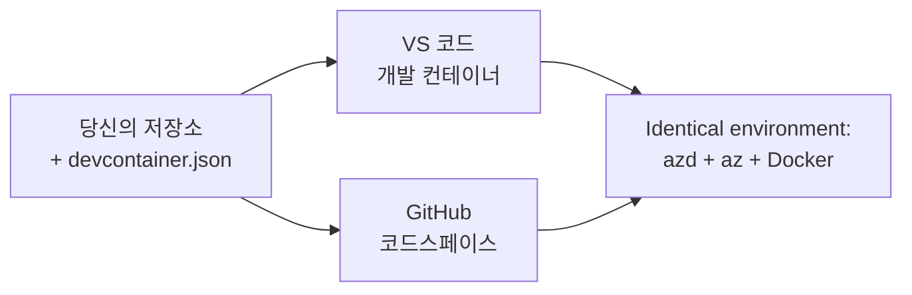

# azd용 Dev 컨테이너 및 GitHub Codespaces

**챕터 탐색:**
- **📚 코스 홈**: [초보자를 위한 AZD](../../README.md)
- **📖 현재 챕터**: 챕터 1 - 기초 및 빠른 시작
- **⬅️ 이전**: [자체 앱 사용하기](bring-your-own-app.md)
- **🚀 다음 챕터**: [챕터 2: AI 우선 개발](../chapter-02-ai-development/README.md)

> 2026년 7월 `azd 1.27.1` 기준으로 검증됨.

## 소개

매번 모든 머신에 azd, 적절한 언어 런타임, Docker, Azure CLI를 설치하는 것은 번거로운 일이며, “내 컴퓨터에서는 작동하는데 다른 사람은 안 된다”는 튜토리얼 실패의 가장 큰 원인입니다. <strong>Dev 컨테이너</strong>는 툴체인 전체를 하나의 파일로 설명하여 이를 해결합니다. VS Code나 GitHub Codespaces에서 프로젝트를 열면 azd가 이미 설치된 동일한 환경을 바로 사용할 수 있습니다. 이 수업에서 Dev 컨테이너를 추가하는 법을 배웁니다.

## 학습 목표

수업이 끝나면 다음을 할 수 있습니다:
- Dev 컨테이너가 무엇이며 azd와 어떻게 도움이 되는지 이해하기
- 프로젝트에 최소한의 `.devcontainer/devcontainer.json` 추가하기
- Dev 컨테이너 <em>기능</em>을 통해 azd, Azure CLI, Docker 포함하기
- GitHub Codespaces 또는 VS Code에서 프로젝트 열기

## 학습 결과

이 수업을 완료하면 다음을 할 수 있습니다:
- azd 프로젝트용 `devcontainer.json` 작성하기
- 수동 설치 없이 azd 및 Azure 도구 추가하기
- 컨테이너 또는 Codespace 내부에서 `azd up` 실행하기

---

## Dev 컨테이너란?

Dev 컨테이너는 리포지토리 내 `.devcontainer/devcontainer.json` 파일로 정의된 Docker 기반 개발 환경입니다. 프로젝트를 열면:

- **VS Code** (Dev Containers 확장 사용)가 컨테이너를 빌드하고 연결합니다.
- <strong>GitHub Codespaces</strong>가 동일한 컨테이너를 클라우드에서 빌드하여 브라우저 기반 편집기를 제공합니다.

어느 쪽이든 모든 기여자는 동일한 도구를 사용하므로 "azd 설치하셨나요?" 같은 문제 해결이 필요 없습니다.



---

## 1단계: devcontainer 파일 만들기

프로젝트 루트에 `.devcontainer/devcontainer.json` 파일을 만듭니다:

```json
{
  "name": "azd-project",
  "image": "mcr.microsoft.com/devcontainers/base:bookworm",
  "features": {
    "ghcr.io/devcontainers/features/azure-cli:1": {},
    "ghcr.io/azure/azure-dev/azd:latest": {},
    "ghcr.io/devcontainers/features/docker-in-docker:2": {},
    "ghcr.io/devcontainers/features/node:1": {}
  },
  "customizations": {
    "vscode": {
      "extensions": [
        "ms-azuretools.azure-dev",
        "ms-azuretools.vscode-bicep"
      ]
    }
  },
  "forwardPorts": [3000],
  "postCreateCommand": "azd version"
}
```

각 부분의 역할:

| 키 | 목적 |
|-----|---------|
| `image` | 컨테이너의 기본 OS |
| `features` | 미리 빌드된 설치기 — 여기서는 Azure CLI, **azd**, Docker, Node.js |
| `customizations.vscode.extensions` | azd와 Bicep VS Code 확장을 자동 설치 |
| `forwardPorts` | 앱의 포트를 브라우저에 노출 |
| `postCreateCommand` | 컨테이너 빌드 후 한 번 실행 (여기서는 상태 점검) |

> `ghcr.io/azure/azure-dev/azd:latest` 기능은 컨테이너에서 azd를 얻는 공식 방법입니다. 재현성을 위해 특정 버전(예: `azd:1.27.1`)을 고정할 수 있습니다.

---

## 2단계: 앱 언어에 맞는 기능 선택하기

`node` 기능 대신 앱에서 사용하는 기능으로 교체하세요:

```jsonc
// Python project
"ghcr.io/devcontainers/features/python:1": {},

// .NET project
"ghcr.io/devcontainers/features/dotnet:2": {},

// Java project
"ghcr.io/devcontainers/features/java:1": {},

// Go project
"ghcr.io/devcontainers/features/go:1": {}
```

`host`가 `containerapp`, `aks` 또는 컨테이너 이미지를 빌드하는 경우 `docker-in-docker`는 유지하세요—azd는 이미지 빌드 및 푸시 시 Docker가 필요합니다.

---

## 3단계: 열기

**VS Code에서:**
1. **Dev Containers** 확장 설치
2. 프로젝트 폴더 열기
3. 요청 시 **Reopen in Container** 클릭 (또는 *Dev Containers: Reopen in Container* 명령 실행)

**GitHub Codespaces에서:**
1. 리포지토리를 GitHub에 푸시
2. **Code → Codespaces → Create codespace on main** 클릭
3. 컨테이너 빌드가 완료될 때까지 대기—터미널에 azd가 준비됨

---

## 4단계: 컨테이너 내부에서 배포하기

컨테이너에 azd가 사전 설치되어 있으므로 일반적인 워크플로가 바로 작동합니다:

```bash
azd auth login --use-device-code   # 디바이스 코드는 Codespaces 내부에서 유용합니다
azd up
```

> **왜 `--use-device-code`인가요?** 원격 컨테이너나 Codespace에서는 로컬 브라우저를 리디렉션할 수 없어, 디바이스 코드 로그인이 안전한 방법입니다. 로그인 완료를 위해 브라우저 탭에 코드를 붙여넣습니다.

---

## 자주 발생하는 문제점

| 문제점 | 해결법 |
|---------|-----|
| `azd up`이 이미지를 빌드하지 못함 | `docker-in-docker` 기능 추가 |
| Codespaces에서 브라우저 로그인 멈춤 | `azd auth login --use-device-code` 사용 |
| 팀 간 도구 버전이 달라 다름 | 기능 버전 고정(예: `azd:1.27.1`) |
| 브라우저에서 앱 접속 불가 | `forwardPorts`에 포트 추가 |

---

## 요약

- Dev 컨테이너는 azd 툴체인을 모두에게 재현 가능하게 만듭니다.
- Dev 컨테이너 <em>기능</em>을 통해 azd, Azure CLI, Docker를 추가합니다.
- 앱에 맞는 언어 기능을 선택하고 컨테이너 호스트용으로 `docker-in-docker`는 유지하세요.
- Codespaces 내부에서는 디바이스 코드 로그인을 사용하세요.

---

## 🔗 탐색

| 방향 | 리소스 |
|-----------|----------|
| <strong>이전</strong> | [자체 앱 사용하기](bring-your-own-app.md) |
| **챕터 홈** | [챕터 1: 기초 및 빠른 시작](README.md) |
| **다음 챕터** | [챕터 2: AI 우선 개발](../chapter-02-ai-development/README.md) |

## 📖 관련 리소스

- [설치 및 설정](installation.md)
- [명령어 치트 시트](../../resources/cheat-sheet.md)
- [공식 Dev 컨테이너 명세서](https://containers.dev/)
- [azd Dev 컨테이너 기능](https://github.com/Azure/azure-dev/tree/main/ext/devcontainer)

---

<!-- CO-OP TRANSLATOR DISCLAIMER START -->
**면책 조항**:
이 문서는 AI 번역 서비스 [Co-op Translator](https://github.com/Azure/co-op-translator)를 사용하여 번역되었습니다. 정확성을 기하기 위해 노력하고 있으나, 자동 번역은 오류나 부정확한 부분이 있을 수 있음을 유의하시기 바랍니다. 원본 문서의 원어본이 권위 있는 자료로 간주되어야 합니다. 중요한 정보의 경우, 전문가의 인간 번역을 권장합니다. 이 번역 사용으로 인해 발생하는 오해나 잘못된 해석에 대해 당사는 책임을 지지 않습니다.
<!-- CO-OP TRANSLATOR DISCLAIMER END -->