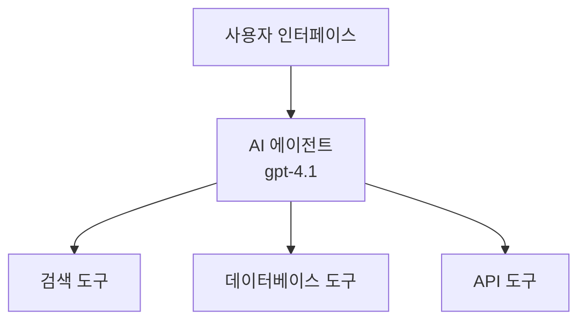
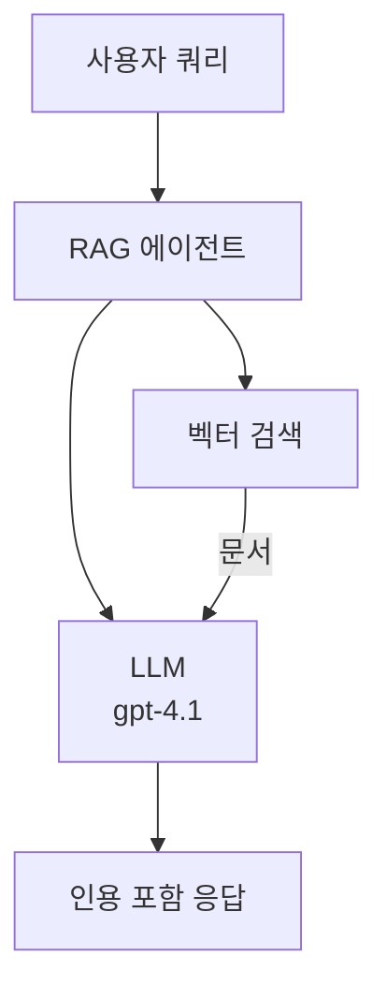
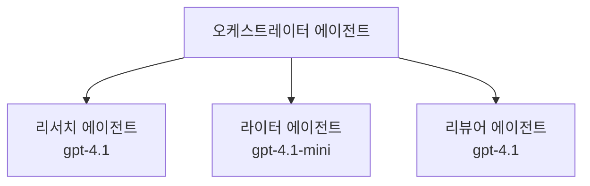

# Azure 개발자 CLI를 사용한 AI 에이전트

**챕터 탐색:**
- **📚 강의 홈**: [초보자를 위한 AZD](../../README.md)
- **📖 현재 챕터**: 챕터 2 - AI 우선 개발
- **⬅️ 이전**: [Microsoft Foundry 통합](microsoft-foundry-integration.md)
- **➡️ 다음**: [AI 모델 배포](ai-model-deployment.md)
- **🚀 고급**: [멀티 에이전트 솔루션](../../examples/retail-scenario.md)

---

## 소개

AI 에이전트는 환경을 인지하고, 의사 결정을 내리며, 특정 목표를 달성하기 위해 행동할 수 있는 자율 프로그램입니다. 단순히 프롬프트에 응답하는 챗봇과 달리, 에이전트는 다음과 같은 기능을 수행할 수 있습니다:

- **도구 사용** - API 호출, 데이터베이스 검색, 코드 실행
- **계획 및 추론** - 복잡한 작업을 단계별로 분해
- **맥락에서 학습** - 기억을 유지하고 행동을 적응
- <strong>협업</strong> - 다른 에이전트와 협력(멀티 에이전트 시스템)

이 가이드는 Azure Developer CLI(azd)를 사용하여 AI 에이전트를 Azure에 배포하는 방법을 보여줍니다.

> **검증 참고 (2026-03-25):** 이 가이드는 `azd` `1.23.12` 및 `azure.ai.agents` `0.1.18-preview` 기준으로 검토되었습니다. `azd ai` 경험은 아직 프리뷰 상태이므로 설치된 플래그가 다르면 확장 도움말을 확인하세요.

## 학습 목표

이 가이드를 완료하면:
- AI 에이전트가 무엇이며 챗봇과 어떻게 다른지 이해할 수 있습니다
- AZD를 사용하여 미리 구축된 AI 에이전트 템플릿을 배포할 수 있습니다
- Foundry Agents를 사용한 맞춤형 에이전트 구성 방법을 알 수 있습니다
- 기본 에이전트 패턴(tool 사용, RAG, 멀티 에이전트)을 구현할 수 있습니다
- 배포된 에이전트를 모니터링하고 디버깅할 수 있습니다

## 학습 결과

완료 후, 다음을 할 수 있습니다:
- 단일 명령으로 AI 에이전트 애플리케이션을 Azure에 배포
- 에이전트 도구 및 기능 구성
- 에이전트와 함께 검색 강화 생성(RAG) 구현
- 복잡한 워크플로를 위한 멀티 에이전트 아키텍처 설계
- 일반적인 에이전트 배포 문제 해결

---

## 🤖 에이전트가 챗봇과 다른 점은?

| 기능 | 챗봇 | AI 에이전트 |
|-------|-------|-----------|
| <strong>동작</strong> | 프롬프트에 응답 | 자율적 행동 수행 |
| <strong>도구</strong> | 없음 | API 호출, 검색, 코드 실행 가능 |
| <strong>기억</strong> | 세션 기반만 가능 | 세션 간 지속 메모리 |
| <strong>계획</strong> | 단일 응답 | 다단계 추론 |
| <strong>협업</strong> | 단일 주체 | 다른 에이전트와 협력 가능 |

### 간단한 비유

- <strong>챗봇</strong> = 정보 안내 데스크에서 질문에 답하는 친절한 직원
- **AI 에이전트** = 전화를 걸고, 약속을 예약하며, 업무를 대신 처리하는 개인 비서

---

## 🚀 빠른 시작: 첫 에이전트 배포하기

### 옵션 1: Foundry Agents 템플릿 (권장)

```bash
# AI 에이전트 템플릿 초기화
azd init --template get-started-with-ai-agents

# Azure에 배포
azd up
```

**배포 항목:**
- ✅ Foundry Agents
- ✅ Microsoft Foundry 모델 (gpt-4.1)
- ✅ Azure AI Search (RAG용)
- ✅ Azure Container Apps (웹 인터페이스)
- ✅ Application Insights (모니터링)

**소요 시간:** 약 15-20분  
**비용:** 약 $100-150/월 (개발용)

### 옵션 2: OpenAI Agent with Prompty

```bash
# Prompty 기반 에이전트 템플릿 초기화
azd init --template agent-openai-python-prompty

# Azure에 배포하기
azd up
```

**배포 항목:**
- ✅ Azure Functions (서버리스 에이전트 실행)
- ✅ Microsoft Foundry 모델
- ✅ Prompty 구성 파일
- ✅ 샘플 에이전트 구현

**소요 시간:** 약 10-15분  
**비용:** 약 $50-100/월 (개발용)

### 옵션 3: RAG Chat Agent

```bash
# RAG 채팅 템플릿 초기화
azd init --template azure-search-openai-demo

# Azure에 배포하기
azd up
```

**배포 항목:**
- ✅ Microsoft Foundry 모델
- ✅ 샘플 데이터 포함 Azure AI Search
- ✅ 문서 처리 파이프라인
- ✅ 인용문이 포함된 채팅 인터페이스

**소요 시간:** 약 15-25분  
**비용:** 약 $80-150/월 (개발용)

### 옵션 4: AZD AI Agent 초기화 (매니페스트 또는 템플릿 기반 프리뷰)

에이전트 매니페스트 파일이 있다면, `azd ai` 명령을 사용해 Foundry Agent Service 프로젝트를 직접 스캐폴딩할 수 있습니다. 최근 프리뷰 릴리스에서는 템플릿 기반 초기화 지원도 추가되어 설치된 확장 버전에 따라 프롬프트 흐름이 약간 다를 수 있습니다.

```bash
# AI 에이전트 확장 기능 설치
azd extension install azure.ai.agents

# 선택 사항: 설치된 미리보기 버전 확인
azd extension show azure.ai.agents

# 에이전트 매니페스트에서 초기화
azd ai agent init -m agent-manifest.yaml

# Azure에 배포
azd up

# 배포된 에이전트 테스트 (지연 시간 + 첫 바이트까지 시간 표시)
azd ai agent invoke
```

**`azd ai agent init` 과 `azd init --template` 사용 시기 비교:**

| 방식 | 적합 대상 | 작동 방식 |
|---------|----------|----------------|
| `azd init --template` | 작동하는 샘플 앱부터 시작할 때 | 코드 및 인프라가 포함된 전체 템플릿 저장소를 복제 |
| `azd ai agent init -m` | 나만의 에이전트 매니페스트로부터 빌드 시 | 에이전트 정의에서 프로젝트 구조 스캐폴딩 |

> **팁:** 학습 시에는 `azd init --template` 사용(위 옵션 1-3). 생산용 에이전트를 자체 매니페스트로 구성할 때는 `azd ai agent init` 사용.

`azd up` 이후, 동일한 확장이 에이전트 수명주기 전체를 지원합니다: `azd ai agent invoke`로 테스트, `azd ai agent eval generate` 및 `azd ai agent optimize`로 품질 평가 및 개선, `azd ai agent delete`로 정리 수행. 자세한 명령어는 [AZD AI CLI 명령어](../chapter-08-production/production-ai-practices.md#azd-ai-cli-commands-and-extensions)를 참고하세요.

---

## 🏗️ 에이전트 아키텍처 패턴

### 패턴 1: 도구를 사용하는 단일 에이전트

가장 단순한 에이전트 패턴 – 여러 도구를 사용할 수 있는 단일 에이전트.



**적합 분야:**
- 고객 지원 봇
- 연구 지원 비서
- 데이터 분석 에이전트

**AZD 템플릿:** `azure-search-openai-demo`

### 패턴 2: RAG 에이전트 (검색 강화 생성)

응답을 생성하기 전에 관련 문서를 검색하는 에이전트.



**적합 분야:**
- 시스템 지식 기반
- 문서 Q&A 시스템
- 컴플라이언스 및 법률 조사

**AZD 템플릿:** `azure-search-openai-demo`

### 패턴 3: 멀티 에이전트 시스템

여러 전문화된 에이전트가 복잡한 작업을 함께 수행.



**적합 분야:**
- 복잡한 콘텐츠 생성
- 다단계 워크플로우
- 다양한 전문 지식이 필요한 작업

**더 알아보기:** [멀티 에이전트 조정 패턴](../chapter-06-pre-deployment/coordination-patterns.md)

---

## ⚙️ 에이전트 도구 구성

도구를 사용할 수 있을 때 에이전트가 강력해집니다. 다음은 일반 도구 구성 방법입니다:

### Foundry Agents에서 도구 구성하기

```python
# agent_config.py
from azure.ai.projects import AIProjectClient
from azure.ai.projects.models import FunctionTool, CodeInterpreterTool

# 사용자 정의 도구 정의
search_tool = FunctionTool(
    name="search_knowledge_base",
    description="Search the company knowledge base for relevant documents",
    parameters={
        "type": "object",
        "properties": {
            "query": {
                "type": "string",
                "description": "The search query"
            }
        },
        "required": ["query"]
    }
)

# 도구를 사용하여 에이전트 생성
agent = project_client.agents.create_agent(
    model="gpt-4.1",
    name="Support Agent",
    instructions="You are a helpful support agent. Use the search tool to find relevant information.",
    tools=[search_tool, CodeInterpreterTool()]
)
```

### 환경 구성

```bash
# 에이전트별 환경 변수 설정
azd env set AZURE_OPENAI_MODEL "gpt-4.1"
azd env set AGENT_INSTRUCTIONS "You are a helpful assistant..."
azd env set ENABLE_CODE_INTERPRETER "true"
azd env set ENABLE_FILE_SEARCH "true"

# 업데이트된 구성으로 배포
azd deploy
```

---

## 📊 에이전트 모니터링

### Application Insights 통합

모든 AZD 에이전트 템플릿에는 모니터링을 위한 Application Insights가 포함되어 있습니다:

```bash
# 모니터링 대시보드 열기
azd monitor --overview

# 실시간 로그 보기
azd monitor --logs

# 실시간 메트릭 보기
azd monitor --live
```

### 추적해야 할 주요 지표

| 지표 | 설명 | 목표치 |
|-------|---------|-----|
| 응답 지연 시간 | 응답 생성 시간 | 5초 미만 |
| 토큰 사용량 | 요청당 토큰 수 | 비용 모니터링 필요 |
| 도구 호출 성공률 | 성공한 도구 실행 비율 | 95% 이상 |
| 오류율 | 실패한 에이전트 요청 비율 | 1% 미만 |
| 사용자 만족도 | 피드백 점수 | 4.0/5.0 이상 |

### 에이전트용 맞춤 로그

```python
import os
from azure.monitor.opentelemetry import configure_azure_monitor
from opentelemetry import trace

# OpenTelemetry로 Azure Monitor 구성하기
configure_azure_monitor(
    connection_string=os.environ["APPLICATIONINSIGHTS_CONNECTION_STRING"]
)

tracer = trace.get_tracer(__name__)

def log_agent_interaction(user_query, agent_response, tools_used, latency_ms):
    with tracer.start_as_current_span("agent_interaction") as span:
        span.set_attributes({
            "user_query": user_query,
            "response_length": len(agent_response),
            "tools_used": tools_used,
            "latency_ms": latency_ms
        })
```

> **참고:** 필수 패키지 설치: `pip install azure-monitor-opentelemetry opentelemetry`

---

## 💰 비용 고려 사항

### 패턴별 예상 월 비용

| 패턴 | 개발 환경 | 운영 환경 |
|-------|----------|------------|
| 단일 에이전트 | $50-100 | $200-500 |
| RAG 에이전트 | $80-150 | $300-800 |
| 멀티 에이전트 (2-3대) | $150-300 | $500-1,500 |
| 엔터프라이즈 멀티 에이전트 | $300-500 | $1,500-5,000 이상 |

### 비용 최적화 팁

1. **간단한 작업은 gpt-4.1-mini 사용**
   ```bash
   azd env set AZURE_OPENAI_MODEL "gpt-4.1-mini"
   ```

2. **반복 쿼리 캐싱 구현**
   ```python
   from functools import lru_cache
   
   @lru_cache(maxsize=1000)
   def get_cached_response(query_hash):
       return agent.run(query_hash)
   ```

3. **실행당 토큰 제한 설정**
   ```python
   # 에이전트를 실행할 때 max_completion_tokens를 설정하고 생성 시에는 설정하지 마세요
   run = project_client.agents.create_run(
       thread_id=thread.id,
       agent_id=agent.id,
       max_completion_tokens=1000  # 응답 길이를 제한하세요
   )
   ```

4. **사용하지 않을 때는 스케일 투 제로 적용**
   ```bash
   # 컨테이너 앱은 자동으로 0까지 확장됩니다
   azd env set MIN_REPLICAS "0"
   ```

---

## 🔧 에이전트 문제 해결

### 일반 문제 및 해결책

<details>
<summary><strong>❌ 에이전트가 도구 호출에 응답하지 않음</strong></summary>

```bash
# 도구가 제대로 등록되었는지 확인하세요
azd show

# OpenAI 배포를 확인하세요
az cognitiveservices account deployment list \
  --name $AZURE_OPENAI_NAME \
  --resource-group $RG_NAME

# 에이전트 로그를 확인하세요
azd monitor --logs
```

**주요 원인:**
- 도구 함수 시그니처 불일치
- 필수 권한 누락
- API 엔드포인트 접근 불가
</details>

<details>
<summary><strong>❌ 에이전트 응답 지연 시간 과다</strong></summary>

```bash
# 병목 현상을 확인하려면 Application Insights를 확인하세요
azd monitor --live

# 더 빠른 모델 사용을 고려하세요
azd env set AZURE_OPENAI_MODEL "gpt-4.1-mini"
azd deploy
```

**최적화 팁:**
- 스트리밍 응답 사용
- 응답 캐싱 구현
- 컨텍스트 창 크기 감소
</details>

<details>
<summary><strong>❌ 에이전트가 잘못되거나 환각적 정보 반환</strong></summary>

```python
# 더 나은 시스템 프롬프트로 개선
instructions = """
You are a helpful assistant. IMPORTANT:
- Only answer based on provided context
- If you don't know, say "I don't know"
- Always cite your sources
- Never make up information
"""

# 근거를 위한 검색 추가
agent = project_client.agents.create_agent(
    model="gpt-4.1",
    instructions=instructions,
    tools=[FileSearchTool()]  # 문서에 기반한 응답 생성
)
```
</details>

<details>
<summary><strong>❌ 토큰 제한 초과 오류</strong></summary>

```python
# 컨텍스트 창 관리 구현
def truncate_context(messages, max_tokens=8000, model="gpt-4.1"):
    """Keep only recent messages within token limit."""
    import tiktoken
    encoding = tiktoken.encoding_for_model(model)
    total_tokens = 0
    truncated = []
    
    for msg in reversed(messages):
        msg_tokens = len(encoding.encode(msg.content))
        if total_tokens + msg_tokens > max_tokens:
            break
        truncated.insert(0, msg)
        total_tokens += msg_tokens
    
    return truncated
```
</details>

---

## 🎓 실습 과제

### 과제 1: 기본 에이전트 배포 (20분)

**목표:** AZD를 사용하여 첫 AI 에이전트 배포

```bash
# 1단계: 템플릿 초기화
azd init --template get-started-with-ai-agents

# 2단계: Azure에 로그인
azd auth login
# 여러 테넌트에서 작업하는 경우 --tenant-id <tenant-id> 추가

# 3단계: 배포
azd up

# 4단계: 에이전트 테스트
# 배포 후 예상 출력:
#   배포 완료!
#   엔드포인트: https://<app-name>.<region>.azurecontainerapps.io
# 출력에 표시된 URL을 열고 질문을 시도해 보세요

# 5단계: 모니터링 보기
azd monitor --overview

# 6단계: 정리 작업
azd down --force --purge
```

**성공 기준:**
- [ ] 에이전트가 질문에 응답함
- [ ] `azd monitor`로 모니터링 대시보드 접근 가능
- [ ] 리소스 성공적으로 정리됨

### 과제 2: 맞춤 도구 추가 (30분)

**목표:** 맞춤 도구로 에이전트 확장

1. 에이전트 템플릿 배포:
   ```bash
   azd init --template get-started-with-ai-agents
   azd up
   ```
2. 에이전트 코드에 새 도구 함수 생성:
   ```python
   def get_weather(location: str) -> str:
       """Get current weather for a location."""
       # 날씨 서비스에 API 호출
       return f"Weather in {location}: Sunny, 72°F"
   ```
3. 에이전트에 도구 등록:
   ```python
   from azure.ai.projects.models import FunctionTool

   weather_tool = FunctionTool(
       name="get_weather",
       description="Get current weather for a location",
       parameters={
           "type": "object",
           "properties": {
               "location": {"type": "string", "description": "City name"}
           },
           "required": ["location"]
       }
   )

   agent = project_client.agents.create_agent(
       model="gpt-4.1",
       name="Weather Agent",
       tools=[weather_tool]
   )
   ```
4. 재배포 및 테스트:
   ```bash
   azd deploy
   # 물어보기: "시애틀의 날씨는 어때요?"
   # 예상: 에이전트가 get_weather("Seattle")를 호출하고 날씨 정보를 반환함
   ```

**성공 기준:**
- [ ] 에이전트가 날씨 관련 쿼리를 인식
- [ ] 도구가 올바르게 호출됨
- [ ] 응답에 날씨 정보 포함

### 과제 3: RAG 에이전트 구축 (45분)

**목표:** 문서에서 질문에 답하는 에이전트 생성

```bash
# 1단계: RAG 템플릿 배포
azd init --template azure-search-openai-demo
azd up

# 2단계: 문서 업로드
# PDF/TXT 파일을 data/ 디렉토리에 넣은 후, 다음을 실행하세요:
python scripts/prepdocs.py

# 3단계: 도메인별 질문으로 테스트
# azd up 출력에서 웹 앱 URL을 엽니다
# 업로드한 문서에 대해 질문하세요
# 응답에는 [doc.pdf]와 같은 인용 참조가 포함되어야 합니다
```

**성공 기준:**
- [ ] 업로드한 문서에서 답변 제공
- [ ] 응답에 인용 포함
- [ ] 범위 밖 질문에 환각 없음

---

## 📚 다음 단계

AI 에이전트 개념을 익혔다면, 다음의 고급 주제를 탐색하세요:

| 주제 | 설명 | 링크 |
|-------|----------|-------------|
| **멀티 에이전트 시스템** | 여러 협업 에이전트 시스템 구축 | [소매 멀티 에이전트 예제](../../examples/retail-scenario.md) |
| **조정 패턴** | 오케스트레이션 및 통신 패턴 학습 | [조정 패턴](../chapter-06-pre-deployment/coordination-patterns.md) |
| **생산 배포** | 엔터프라이즈급 에이전트 배포 | [생산 AI 모범 사례](../chapter-08-production/production-ai-practices.md) |
| **에이전트 평가** | 에이전트 성능 테스트 및 평가 | [AI 문제 해결](../chapter-07-troubleshooting/ai-troubleshooting.md) |
| **AI 워크숍 연구실** | 실습: AI 솔루션 AZD 준비 작업 | [AI 워크숍 연구실](ai-workshop-lab.md) |

---

## 📖 추가 자료

### 공식 문서
- [Microsoft Foundry Agent Service](https://learn.microsoft.com/azure/ai-services/agents/)
- [Microsoft Foundry Agent Service 빠른 시작](https://learn.microsoft.com/azure/ai-services/agents/quickstart)
- [Semantic Kernel Agent Framework](https://learn.microsoft.com/semantic-kernel/)

### 에이전트용 AZD 템플릿
- [AI 에이전트 시작하기](https://github.com/Azure-Samples/get-started-with-ai-agents)
- [Agent OpenAI Python Prompty](https://github.com/Azure-Samples/agent-openai-python-prompty)
- [Azure Search OpenAI 데모](https://github.com/Azure-Samples/azure-search-openai-demo)

### 커뮤니티 자료
- [Awesome AZD - 에이전트 템플릿](https://azure.github.io/awesome-azd/?tags=ai-agents)
- [Azure AI Discord](https://discord.gg/microsoft-azure)
- [Microsoft Foundry Discord](https://discord.gg/nTYy5BXMWG)

### 편집기용 에이전트 스킬
- [**Microsoft Azure Agent Skills**](https://skills.sh/microsoft/github-copilot-for-azure) - GitHub Copilot, Cursor 또는 지원되는 에이전트에 Azure 개발용 재사용 가능한 AI 에이전트 스킬 설치. Azure AI, Microsoft Foundry, 배포, 진단용 스킬 포함:
  ```bash
  npx skills add microsoft/github-copilot-for-azure
  ```

---

<strong>탐색</strong>
- **이전 강의**: [Microsoft Foundry 통합](microsoft-foundry-integration.md)
- **다음 강의**: [AI 모델 배포](ai-model-deployment.md)

---

<!-- CO-OP TRANSLATOR DISCLAIMER START -->
**면책 조항**:
이 문서는 AI 번역 서비스 [Co-op Translator](https://github.com/Azure/co-op-translator)를 사용하여 번역되었습니다. 정확성을 기하기 위해 노력하고 있으나, 자동 번역은 오류나 부정확한 부분이 있을 수 있음을 유의하시기 바랍니다. 원본 문서의 원어본이 권위 있는 자료로 간주되어야 합니다. 중요한 정보의 경우, 전문가의 인간 번역을 권장합니다. 이 번역 사용으로 인해 발생하는 오해나 잘못된 해석에 대해 당사는 책임을 지지 않습니다.
<!-- CO-OP TRANSLATOR DISCLAIMER END -->