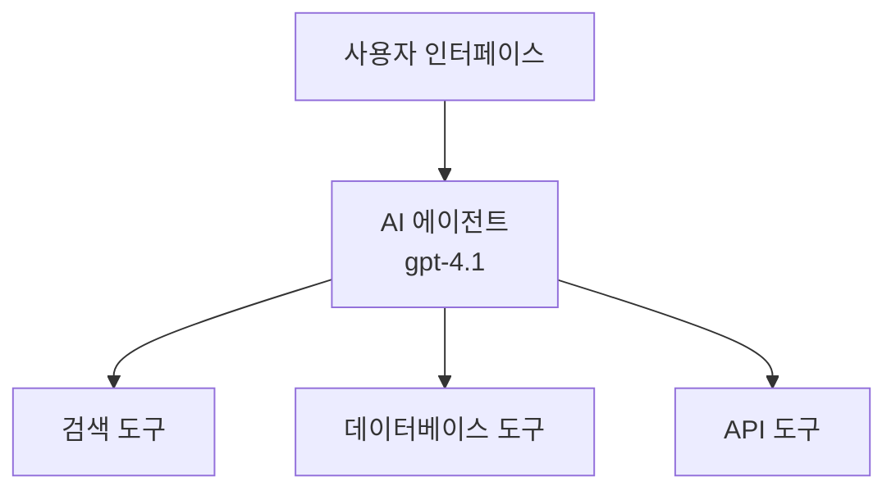
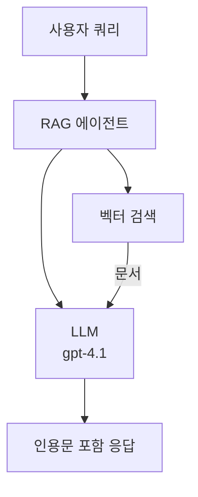
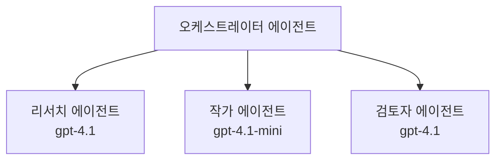

# Azure Developer CLI와 AI 에이전트

**챕터 내비게이션:**
- **📚 코스 홈**: [AZD 초보자를 위한 안내](../../README.md)
- **📖 현재 챕터**: 챕터 2 - AI 우선 개발
- **⬅️ 이전**: [Microsoft Foundry 통합](microsoft-foundry-integration.md)
- **➡️ 다음**: [AI 모델 배포](ai-model-deployment.md)
- **🚀 고급**: [멀티 에이전트 솔루션](../../examples/retail-scenario.md)

---

## 소개

AI 에이전트는 환경을 인지하고, 의사 결정을 내리며, 특정 목표를 달성하기 위해 행동할 수 있는 자율 프로그램입니다. 단순히 프롬프트에 응답하는 챗봇과 달리, 에이전트는:

- **도구를 사용** - API 호출, 데이터베이스 검색, 코드 실행
- **계획 및 추론** - 복잡한 작업을 단계로 나누기
- **컨텍스트에서 학습** - 기억을 유지하고 행동을 적응
- <strong>협업</strong> - 다른 에이전트와 협력(멀티 에이전트 시스템)

이 가이드에서는 Azure Developer CLI(azd)를 사용해 AI 에이전트를 Azure에 배포하는 방법을 알려드립니다.

## 학습 목표

이 가이드를 완료하면 다음을 할 수 있습니다:
- AI 에이전트가 무엇인지, 챗봇과 어떻게 다른지 이해하기
- AZD를 사용해 사전 빌드된 AI 에이전트 템플릿 배포
- 맞춤형 에이전트를 위한 Foundry 에이전트 구성
- 기본 에이전트 패턴 구현(도구 사용, RAG, 멀티 에이전트)
- 배포된 에이전트 모니터링 및 디버깅

## 학습 결과

완료 후 다음 역량을 갖추게 됩니다:
- 단일 명령으로 AI 에이전트 애플리케이션을 Azure에 배포
- 에이전트 도구 및 기능 구성
- 에이전트와 함께 검색 확장 생성(RAG) 구현
- 복잡한 워크플로를 위한 멀티 에이전트 아키텍처 설계
- 일반적인 에이전트 배포 문제 해결

---

## 🤖 에이전트와 챗봇의 차이점은?

| 특성 | 챗봇 | AI 에이전트 |
|---------|---------|----------|
| <strong>행동</strong> | 프롬프트에 응답 | 자율적 행동 수행 |
| **도구 사용** | 없음 | API 호출, 검색, 코드 실행 가능 |
| <strong>기억</strong> | 세션 기반만 | 세션 간 지속 메모리 |
| <strong>계획</strong> | 단일 응답 | 다단계 추론 |
| <strong>협업</strong> | 단일 개체 | 다른 에이전트와 협력 가능 |

### 간단한 비유

- <strong>챗봇</strong> = 정보 데스크에서 질문에 답해주는 친절한 사람
- **AI 에이전트** = 전화 걸기, 약속 예약, 작업 완료가 가능한 개인 비서

---

## 🚀 빠른 시작: 첫 번째 에이전트 배포

### 옵션 1: Foundry Agents 템플릿 (권장)

```bash
# AI 에이전트 템플릿 초기화
azd init --template get-started-with-ai-agents

# Azure에 배포하기
azd up
```

**배포되는 항목:**
- ✅ Foundry Agents
- ✅ Microsoft Foundry 모델(gpt-4.1)
- ✅ Azure AI Search (RAG용)
- ✅ Azure Container Apps (웹 인터페이스)
- ✅ Application Insights (모니터링)

**소요 시간:** 약 15-20분  
**비용:** 약 $100-150/월 (개발용)

### 옵션 2: Prompty가 포함된 OpenAI 에이전트

```bash
# Prompty 기반 에이전트 템플릿 초기화
azd init --template agent-openai-python-prompty

# Azure에 배포하기
azd up
```

**배포되는 항목:**
- ✅ Azure Functions (서버리스 에이전트 실행)
- ✅ Microsoft Foundry 모델
- ✅ Prompty 구성 파일
- ✅ 샘플 에이전트 구현

**소요 시간:** 약 10-15분  
**비용:** 약 $50-100/월 (개발용)

### 옵션 3: RAG 챗 에이전트

```bash
# RAG 채팅 템플릿 초기화
azd init --template azure-search-openai-demo

# Azure에 배포하기
azd up
```

**배포되는 항목:**
- ✅ Microsoft Foundry 모델
- ✅ 샘플 데이터가 포함된 Azure AI Search
- ✅ 문서 처리 파이프라인
- ✅ 인용 포함 채팅 인터페이스

**소요 시간:** 약 15-25분  
**비용:** 약 $80-150/월 (개발용)

### 옵션 4: AZD AI Agent Init (매니페스트 기반)

에이전트 매니페스트 파일이 있다면 `azd ai` 명령을 사용해 Foundry Agent Service 프로젝트를 바로 스캐폴딩할 수 있습니다:

```bash
# AI 에이전트 확장 프로그램 설치
azd extension install azure.ai.agents

# 에이전트 매니페스트에서 초기화
azd ai agent init -m agent-manifest.yaml

# Azure에 배포
azd up
```

**`azd ai agent init` 와 `azd init --template` 사용 시기:**

| 접근 방법 | 적합 대상 | 방식 |
|----------|----------|------|
| `azd init --template` | 작동하는 샘플 앱에서 시작할 때 | 코드 + 인프라가 포함된 전체 템플릿 리포 복제 |
| `azd ai agent init -m` | 직접 작성한 에이전트 매니페스트로 빌드할 때 | 에이전트 정의에서 프로젝트 구조 스캐폴드 |

> **팁:** 학습 시에는 `azd init --template` 사용(위 옵션 1-3). 실제 운영용 에이전트는 `azd ai agent init`를 사용해 매니페스트 기반으로 빌드하세요. 전체 참조는 [AZD AI CLI 명령](../chapter-08-production/production-ai-practices.md#azd-ai-cli-commands-and-extensions)을 확인하세요.

---

## 🏗️ 에이전트 아키텍처 패턴

### 패턴 1: 도구가 있는 단일 에이전트

가장 간단한 에이전트 패턴 - 하나의 에이전트가 여러 도구 사용 가능.


**적합 대상:**
- 고객 지원 봇
- 연구 지원 도우미
- 데이터 분석 에이전트

**AZD 템플릿:** `azure-search-openai-demo`

### 패턴 2: RAG 에이전트 (검색 확장 생성)

응답을 생성하기 전에 관련 문서를 검색하는 에이전트.


**적합 대상:**
- 기업 지식 베이스
- 문서 Q&A 시스템
- 컴플라이언스 및 법률 조사

**AZD 템플릿:** `azure-search-openai-demo`

### 패턴 3: 멀티 에이전트 시스템

다양한 전문 영역의 에이전트들이 복잡한 작업을 협력해 수행.


**적합 대상:**
- 복잡한 콘텐츠 생성
- 다단계 워크플로우
- 다양한 전문 지식 요구 작업

**더 알아보기:** [멀티 에이전트 협력 패턴](../chapter-06-pre-deployment/coordination-patterns.md)

---

## ⚙️ 에이전트 도구 구성

에이전트는 도구를 사용할 때 강력해집니다. 일반 도구 구성 방법은 다음과 같습니다:

### Foundry Agents 도구 구성

```python
# agent_config.py
from azure.ai.projects import AIProjectClient
from azure.ai.projects.models import FunctionTool, CodeInterpreterTool

# 사용자 지정 도구 정의
search_tool = FunctionTool(
    name="search_knowledge_base",
    description="Search the company knowledge base for relevant documents",
    parameters={
        "type": "object",
        "properties": {
            "query": {
                "type": "string",
                "description": "The search query"
            }
        },
        "required": ["query"]
    }
)

# 도구로 에이전트 생성
agent = project_client.agents.create_agent(
    model="gpt-4.1",
    name="Support Agent",
    instructions="You are a helpful support agent. Use the search tool to find relevant information.",
    tools=[search_tool, CodeInterpreterTool()]
)
```

### 환경 설정

```bash
# 에이전트별 환경 변수 설정
azd env set AZURE_OPENAI_MODEL "gpt-4.1"
azd env set AGENT_INSTRUCTIONS "You are a helpful assistant..."
azd env set ENABLE_CODE_INTERPRETER "true"
azd env set ENABLE_FILE_SEARCH "true"

# 업데이트된 구성으로 배포
azd deploy
```

---

## 📊 에이전트 모니터링

### Application Insights 통합

모든 AZD 에이전트 템플릿에는 모니터링을 위한 Application Insights가 포함됩니다:

```bash
# 모니터링 대시보드 열기
azd monitor --overview

# 실시간 로그 보기
azd monitor --logs

# 실시간 지표 보기
azd monitor --live
```

### 추적할 주요 지표

| 지표 | 설명 | 목표 |
|--------|-------------|--------|
| 응답 지연 시간 | 응답 생성 시간 | 5초 미만 |
| 토큰 사용량 | 요청당 토큰 수 | 비용 모니터링 |
| 도구 호출 성공률 | 도구 실행 성공 비율 | 95% 이상 |
| 오류율 | 실패한 에이전트 요청 | 1% 미만 |
| 사용자 만족도 | 피드백 점수 | 4.0/5.0 이상 |

### 에이전트 맞춤 로깅

```python
import os
from azure.monitor.opentelemetry import configure_azure_monitor
from opentelemetry import trace

# OpenTelemetry로 Azure Monitor 구성
configure_azure_monitor(
    connection_string=os.environ["APPLICATIONINSIGHTS_CONNECTION_STRING"]
)

tracer = trace.get_tracer(__name__)

def log_agent_interaction(user_query, agent_response, tools_used, latency_ms):
    with tracer.start_as_current_span("agent_interaction") as span:
        span.set_attributes({
            "user_query": user_query,
            "response_length": len(agent_response),
            "tools_used": tools_used,
            "latency_ms": latency_ms
        })
```

> **참고:** 필요한 패키지 설치: `pip install azure-monitor-opentelemetry opentelemetry`

---

## 💰 비용 고려사항

### 패턴별 예상 월간 비용

| 패턴 | 개발 환경 | 운영 환경 |
|---------|-----------------|------------|
| 단일 에이전트 | $50-100 | $200-500 |
| RAG 에이전트 | $80-150 | $300-800 |
| 멀티 에이전트 (2-3개) | $150-300 | $500-1,500 |
| 엔터프라이즈 멀티 에이전트 | $300-500 | $1,500-5,000+ |

### 비용 최적화 팁

1. **간단한 작업에는 gpt-4.1-mini 사용**
   ```bash
   azd env set AZURE_OPENAI_MODEL "gpt-4.1-mini"
   ```

2. **반복 쿼리에 캐싱 구현**
   ```python
   from functools import lru_cache
   
   @lru_cache(maxsize=1000)
   def get_cached_response(query_hash):
       return agent.run(query_hash)
   ```

3. **실행당 토큰 한도 설정**
   ```python
   # 에이전트를 실행할 때 max_completion_tokens를 설정하고 생성 시에는 설정하지 마세요
   run = project_client.agents.create_run(
       thread_id=thread.id,
       agent_id=agent.id,
       max_completion_tokens=1000  # 응답 길이를 제한하세요
   )
   ```

4. **사용하지 않을 때는 자동으로 스케일 투 제로 적용**
   ```bash
   # 컨테이너 앱은 자동으로 0까지 확장됩니다
   azd env set MIN_REPLICAS "0"
   ```

---

## 🔧 에이전트 문제 해결

### 일반 문제 및 해결책

<details>
<summary><strong>❌ 에이전트가 도구 호출에 응답하지 않음</strong></summary>

```bash
# 도구가 제대로 등록되었는지 확인하세요
azd show

# OpenAI 배포를 확인하세요
az cognitiveservices account deployment list \
  --name $AZURE_OPENAI_NAME \
  --resource-group $RG_NAME

# 에이전트 로그를 확인하세요
azd monitor --logs
```

**주요 원인:**
- 도구 함수 서명 불일치
- 필수 권한 누락
- API 엔드포인트 접근 불가
</details>

<details>
<summary><strong>❌ 에이전트 응답 지연 높음</strong></summary>

```bash
# 병목 현상을 확인하려면 Application Insights를 확인하세요
azd monitor --live

# 더 빠른 모델 사용을 고려하세요
azd env set AZURE_OPENAI_MODEL "gpt-4.1-mini"
azd deploy
```

**최적화 팁:**
- 스트리밍 응답 사용
- 응답 캐싱 구현
- 컨텍스트 윈도우 크기 축소
</details>

<details>
<summary><strong>❌ 에이전트가 부정확하거나 환각 정보 반환</strong></summary>

```python
# 더 나은 시스템 프롬프트로 개선
instructions = """
You are a helpful assistant. IMPORTANT:
- Only answer based on provided context
- If you don't know, say "I don't know"
- Always cite your sources
- Never make up information
"""

# 근거를 위한 검색 추가
agent = project_client.agents.create_agent(
    model="gpt-4.1",
    instructions=instructions,
    tools=[FileSearchTool()]  # 문서에 근거한 응답 작성
)
```
</details>

<details>
<summary><strong>❌ 토큰 초과 오류 발생</strong></summary>

```python
# 컨텍스트 창 관리를 구현합니다
def truncate_context(messages, max_tokens=8000, model="gpt-4.1"):
    """Keep only recent messages within token limit."""
    import tiktoken
    encoding = tiktoken.encoding_for_model(model)
    total_tokens = 0
    truncated = []
    
    for msg in reversed(messages):
        msg_tokens = len(encoding.encode(msg.content))
        if total_tokens + msg_tokens > max_tokens:
            break
        truncated.insert(0, msg)
        total_tokens += msg_tokens
    
    return truncated
```
</details>

---

## 🎓 실습 연습

### 연습 1: 기본 에이전트 배포 (20분)

**목표:** AZD를 사용해 첫 AI 에이전트 배포

```bash
# 1단계: 템플릿 초기화
azd init --template get-started-with-ai-agents

# 2단계: Azure에 로그인
azd auth login

# 3단계: 배포
azd up

# 4단계: 에이전트 테스트
# 배포 후 예상 출력:
#   배포 완료!
#   엔드포인트: https://<app-name>.<region>.azurecontainerapps.io
# 출력에 표시된 URL을 열고 질문해 보세요

# 5단계: 모니터링 보기
azd monitor --overview

# 6단계: 정리 작업
azd down --force --purge
```

**성공 기준:**
- [ ] 에이전트가 질문에 응답함
- [ ] `azd monitor`로 모니터링 대시보드 접근 가능
- [ ] 리소스 정상 정리 완료

### 연습 2: 커스텀 도구 추가 (30분)

**목표:** 에이전트에 커스텀 도구 확장하기

1. 에이전트 템플릿 배포:  
   ```bash
   azd init --template get-started-with-ai-agents
   azd up
   ```
  
2. 에이전트 코드에 새 도구 함수 작성:  
   ```python
   def get_weather(location: str) -> str:
       """Get current weather for a location."""
       # 날씨 서비스에 대한 API 호출
       return f"Weather in {location}: Sunny, 72°F"
   ```
  
3. 도구를 에이전트에 등록:  
   ```python
   from azure.ai.projects.models import FunctionTool

   weather_tool = FunctionTool(
       name="get_weather",
       description="Get current weather for a location",
       parameters={
           "type": "object",
           "properties": {
               "location": {"type": "string", "description": "City name"}
           },
           "required": ["location"]
       }
   )

   agent = project_client.agents.create_agent(
       model="gpt-4.1",
       name="Weather Agent",
       tools=[weather_tool]
   )
   ```
  
4. 재배포 및 테스트:  
   ```bash
   azd deploy
   # 묻기: "시애틀의 날씨는 어때?"
   # 예상: 에이전트가 get_weather("Seattle")를 호출하고 날씨 정보를 반환함
   ```
  
**성공 기준:**
- [ ] 에이전트가 날씨 관련 쿼리를 인식함
- [ ] 도구가 정상 호출됨
- [ ] 응답에 날씨 정보 포함됨

### 연습 3: RAG 에이전트 구축 (45분)

**목표:** 문서에서 질문에 답하는 에이전트 만들기

```bash
# 1단계: RAG 템플릿 배포
azd init --template azure-search-openai-demo
azd up

# 2단계: 문서 업로드
# PDF/TXT 파일을 data/ 디렉터리에 넣은 후, 다음을 실행하세요:
python scripts/prepdocs.py

# 3단계: 도메인별 질문으로 테스트
# azd up 출력에서 웹 앱 URL을 엽니다
# 업로드한 문서에 관한 질문을 하세요
# 응답에는 [doc.pdf]와 같은 인용 참조가 포함되어야 합니다
```

**성공 기준:**
- [ ] 업로드된 문서에서 답변 생성
- [ ] 응답에 인용 포함
- [ ] 범위 밖 질문에 환각 없음

---

## 📚 다음 단계

AI 에이전트를 이해한 후 다음 고급 주제들을 탐색하세요:

| 주제 | 설명 | 링크 |
|-------|-------------|------|
| **멀티 에이전트 시스템** | 다수 협력 에이전트 시스템 구축 | [리테일 멀티 에이전트 예제](../../examples/retail-scenario.md) |
| **조정 패턴** | 오케스트레이션 및 통신 패턴 학습 | [조정 패턴](../chapter-06-pre-deployment/coordination-patterns.md) |
| **운영 배포** | 엔터프라이즈급 에이전트 배포 | [운영 AI 실습](../chapter-08-production/production-ai-practices.md) |
| **에이전트 평가** | 에이전트 성능 테스트 및 평가 | [AI 문제 해결](../chapter-07-troubleshooting/ai-troubleshooting.md) |
| **AI 워크숍 랩** | 실습: AI 솔루션 AZD 준비하기 | [AI 워크숍 랩](ai-workshop-lab.md) |

---

## 📖 추가 자료

### 공식 문서
- [Azure AI Agent 서비스](https://learn.microsoft.com/azure/ai-services/agents/)
- [Azure AI Foundry Agent 서비스 빠른 시작](https://learn.microsoft.com/azure/ai-services/agents/quickstart)
- [Semantic Kernel 에이전트 프레임워크](https://learn.microsoft.com/semantic-kernel/)

### 에이전트용 AZD 템플릿
- [AI 에이전트 시작하기](https://github.com/Azure-Samples/get-started-with-ai-agents)
- [Agent OpenAI Python Prompty](https://github.com/Azure-Samples/agent-openai-python-prompty)
- [Azure Search OpenAI 데모](https://github.com/Azure-Samples/azure-search-openai-demo)

### 커뮤니티 리소스
- [Awesome AZD - 에이전트 템플릿](https://azure.github.io/awesome-azd/?tags=ai-agents)
- [Azure AI Discord](https://discord.gg/microsoft-azure)
- [Microsoft Foundry Discord](https://discord.gg/nTYy5BXMWG)

### 에디터용 에이전트 스킬
- [**Microsoft Azure Agent Skills**](https://skills.sh/microsoft/github-copilot-for-azure) - GitHub Copilot, Cursor 또는 지원하는 에이전트에서 Azure 개발용 재사용 가능한 AI 에이전트 스킬 설치. [Azure AI](https://skills.sh/microsoft/github-copilot-for-azure/azure-ai), [Microsoft Foundry](https://skills.sh/microsoft/github-copilot-for-azure/microsoft-foundry), [배포](https://skills.sh/microsoft/github-copilot-for-azure/azure-deploy), [진단](https://skills.sh/microsoft/github-copilot-for-azure/azure-diagnostics) 포함:
  ```bash
  npx skills add microsoft/github-copilot-for-azure
  ```

---

<strong>내비게이션</strong>
- **이전 레슨**: [Microsoft Foundry 통합](microsoft-foundry-integration.md)
- **다음 레슨**: [AI 모델 배포](ai-model-deployment.md)

---

<!-- CO-OP TRANSLATOR DISCLAIMER START -->
**면책 조항**:  
이 문서는 AI 번역 서비스 [Co-op Translator](https://github.com/Azure/co-op-translator)를 사용하여 번역되었습니다. 정확성을 위해 노력하고 있지만, 자동 번역에는 오류나 부정확성이 있을 수 있음을 유의하시기 바랍니다. 원문은 해당 언어의 원본 문서가 권위 있는 출처로 간주되어야 합니다. 중요한 정보의 경우 전문적인 인간 번역을 권장합니다. 이 번역 사용으로 인해 발생하는 오해나 잘못된 해석에 대해서는 책임을 지지 않습니다.
<!-- CO-OP TRANSLATOR DISCLAIMER END -->