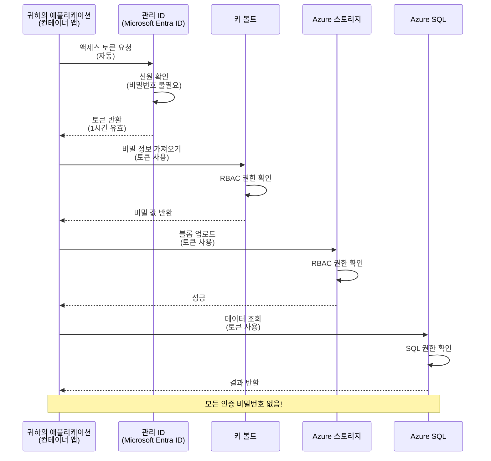
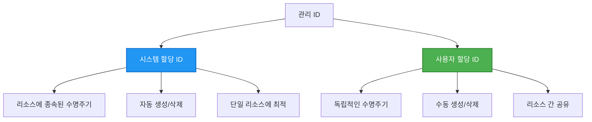

# 인증 패턴 및 관리형 ID

⏱️ **예상 소요 시간**: 45-60분 | 💰 **비용 영향**: 무료 (추가 요금 없음) | ⭐ <strong>난이도</strong>: 중급

**📚 학습 경로:**
- ← 이전: [구성 관리](configuration.md) - 환경 변수 및 비밀 관리
- 🎯 **현재 위치**: 인증 및 보안 (관리형 ID, 키 볼트, 보안 패턴)
- → 다음: [첫 번째 프로젝트](first-project.md) - 첫 번째 AZD 애플리케이션 빌드
- 🏠 [코스 홈](../../README.md)

---

## 학습 내용

이 과정을 완료하면 다음을 할 수 있습니다:
- Azure 인증 패턴 이해 (키, 연결 문자열, 관리형 ID)
- 비밀번호 없는 인증을 위한 **관리형 ID** 구현
- **Azure Key Vault** 통합을 통한 비밀 보안
- AZD 배포를 위한 **역할 기반 액세스 제어(RBAC)** 구성
- Container Apps 및 Azure 서비스에서 보안 모범 사례 적용
- 키 기반 인증에서 ID 기반 인증으로 마이그레이션

## 관리형 ID가 중요한 이유

### 문제점: 기존 인증 방식

**관리형 ID 이전:**
```javascript
// ❌ 보안 위험: 코드에 하드코딩된 비밀 정보
const connectionString = "Server=mydb.database.windows.net;User=admin;Password=P@ssw0rd123";
const storageKey = "xK7mN9pQ2wR5tY8uI0oP3aS6dF1gH4jK...";
const cosmosKey = "C2x7B9n4M1p8Q5w3E6r0T2y5U8i1O4p7...";
```

**문제점:**
- 🔴 코드, 구성 파일, 환경 변수에 비밀 노출
- 🔴 자격 증명 교체 시 코드 변경 및 재배포 필요
- 🔴 감사가 어려움 - 누가 언제 무엇에 접근했는지?
- 🔴 분산 - 여러 시스템에 비밀이 흩어짐
- 🔴 규정 준수 위험 - 보안 감사를 통과하지 못함

### 해결책: 관리형 ID

**관리형 ID 이후:**
```javascript
// ✅ 안전함: 코드에 비밀이 없음
const credential = new DefaultAzureCredential();
const client = new BlobServiceClient(
  "https://mystorageaccount.blob.core.windows.net",
  credential  // Azure가 자동으로 인증을 처리함
);
```

**장점:**
- ✅ 코드나 구성에 비밀이 전혀 없음
- ✅ 자동 교체 - Azure가 처리
- ✅ Microsoft Entra ID 로그에 전체 감사 기록
- ✅ 중앙 집중식 보안 - Azure 포털에서 관리
- ✅ 규정 준수 준비 완료 - 보안 표준 충족

<strong>비유</strong>: 기존 인증은 여러 문에 대한 물리적 열쇠를 들고 다니는 것과 같습니다. 관리형 ID는 당신이 누구인지에 따라 자동으로 출입 권한을 부여하는 보안 배지와 같아서 잃어버리거나 복사하거나 교체할 열쇠가 필요 없습니다.

---

## 아키텍처 개요

### 관리형 ID를 사용한 인증 흐름



### 관리형 ID 종류



| 특징 | 시스템 할당형 | 사용자 할당형 |
|---------|----------------|---------------|
| **수명 주기** | 리소스에 종속 | 독립적 |
| **생성 방법** | 리소스 생성 시 자동 | 수동 생성 |
| **삭제 시점** | 리소스 삭제 시 삭제 | 리소스 삭제 후에도 유지 |
| **공유 가능성** | 하나의 리소스만 | 여러 리소스 가능 |
| **사용 사례** | 간단한 시나리오 | 복잡한 다중 리소스 시나리오 |
| **AZD 기본값** | ✅ 권장 | 선택 사항 |

---

## 전제 조건

### 필요한 도구

이전 강의에서 이미 설치했어야 합니다:

```bash
# Azure Developer CLI 확인
azd version
# ✅ 예상: azd 버전 1.0.0 이상

# Azure CLI 확인
az --version
# ✅ 예상: azure-cli 2.50.0 이상
```

### Azure 요구 사항

- 활성 Azure 구독
- 다음 권한:
  - 관리형 ID 생성
  - RBAC 역할 할당
  - Key Vault 리소스 생성
  - Container Apps 배포

### 사전 지식

다음 과정을 완료했어야 합니다:
- [설치 가이드](installation.md) - AZD 설정
- [AZD 기본](azd-basics.md) - 핵심 개념
- [구성 관리](configuration.md) - 환경 변수

---

## 1강: 인증 패턴 이해

### 패턴 1: 연결 문자열 (레거시 - 사용 지양)

**동작 방식:**
```bash
# 연결 문자열에 자격 증명이 포함되어 있습니다
STORAGE_CONNECTION_STRING="DefaultEndpointsProtocol=https;AccountName=myaccount;AccountKey=xK7mN9pQ2wR5..."
COSMOS_CONNECTION_STRING="AccountEndpoint=https://myaccount.documents.azure.com:443/;AccountKey=C2x7..."
SQL_CONNECTION_STRING="Server=myserver.database.windows.net;User=admin;Password=P@ssw0rd..."
```

**문제점:**
- ❌ 환경 변수에 비밀 노출
- ❌ 배포 시스템에 로그로 기록
- ❌ 교체가 어려움
- ❌ 접근 감사 기록 없음

**사용 시기:** 로컬 개발에서만 사용, 절대 프로덕션에서 사용하지 말 것.

---

### 패턴 2: 키 볼트 참조 (더 나음)

**동작 방식:**
```bicep
// Store secret in Key Vault
resource keyVault 'Microsoft.KeyVault/vaults@2023-02-01' = {
  name: 'mykv'
  properties: {
    enableRbacAuthorization: true
  }
}

// Reference in Container App
env: [
  {
    name: 'STORAGE_KEY'
    secretRef: 'storage-key'  // References Key Vault
  }
]
```

**장점:**
- ✅ 비밀을 Key Vault에 안전하게 저장
- ✅ 중앙 집중식 비밀 관리
- ✅ 코드 변경 없이 비밀 교체 가능

**제한 사항:**
- ⚠️ 여전히 키/비밀번호 사용
- ⚠️ Key Vault 접근 관리 필요

**사용 시기:** 연결 문자열에서 관리형 ID로 전환하는 중간 단계.

---

### 패턴 3: 관리형 ID (권장 방식)

**동작 방식:**
```bicep
// Enable managed identity
resource containerApp 'Microsoft.App/containerApps@2023-05-01' = {
  name: 'myapp'
  identity: {
    type: 'SystemAssigned'  // Automatically creates identity
  }
}

// Grant permissions
resource roleAssignment 'Microsoft.Authorization/roleAssignments@2022-04-01' = {
  scope: storageAccount
  properties: {
    roleDefinitionId: storageBlobDataContributorRole
    principalId: containerApp.identity.principalId
  }
}
```

**애플리케이션 코드:**
```javascript
// 비밀이 필요 없습니다!
const { DefaultAzureCredential } = require('@azure/identity');
const { BlobServiceClient } = require('@azure/storage-blob');

const credential = new DefaultAzureCredential();
const blobServiceClient = new BlobServiceClient(
  'https://mystorageaccount.blob.core.windows.net',
  credential
);
```

**장점:**
- ✅ 코드나 구성에 전혀 비밀 없음
- ✅ 자동 자격 증명 교체
- ✅ 전체 감사 추적 가능
- ✅ RBAC 기반 권한 부여
- ✅ 규정 준수 준비 완료

**사용 시기:** 항상, 프로덕션 애플리케이션에 권장.

---

### 패턴 4: 서비스 주체 (CI/CD 및 자동화)

관리형 ID는 <em>Azure 내부에서 실행되는 리소스</em>에 권장되는 표준입니다. 하지만 빌드 에이전트에서 실행되는 CI/CD 파이프라인 또는 인터랙티브 로그인을 사용할 수 없는 노트북 스크립트 등 <strong>Azure 외부에서 실행되는 상황</strong>은 어떻게 할까요? 바로 <strong>서비스 주체</strong>가 등장합니다: 자동화된 프로세스가 로그인할 수 있는 자체 자격 증명을 가진 비인간 ID입니다.

**동작 방식:**

리소스 그룹 범위로 최소 권한 서비스 주체 생성:

```bash
az ad sp create-for-rbac \
  --name "myapp-cicd" \
  --role contributor \
  --scopes /subscriptions/<sub-id>/resourceGroups/<rg-name>
```

이 명령은 클라이언트 ID, 클라이언트 비밀, 테넌트 ID를 출력합니다. azd는 이를 사용하여 비대화형으로 로그인할 수 있습니다:

```bash
azd auth login \
  --client-id "<appId>" \
  --client-secret "<password>" \
  --tenant-id "<tenant>"
```

**비밀 대신 인증 연합(연합된 자격 증명, OIDC)를 선호하세요.** 장기 유효 클라이언트 비밀 대신, 연합된 자격 증명을 구성하여 파이프라인이 단기 토큰을 교환하도록 하여 비밀 노출 및 회전을 방지합니다:

```bash
azd auth login \
  --client-id "<appId>" \
  --federated-credential-provider "github" \
  --tenant-id "<tenant>"
```

> `azd pipeline config`가 자동으로 설정해줍니다. 자세한 내용은 [8장](../chapter-08-production/production-ai-practices.md)의 CI/CD 실습을 참고하세요.

**장점:**
- ✅ Azure 외부(빌드 에이전트, 온프레미스, 다른 클라우드)에서 작동
- ✅ 하나의 역할로 리소스 그룹 범위 지정 가능
- ✅ 연합(OIDC) 방식은 저장된 비밀 없음

**단점:**
- ⚠️ 비밀 기반 방식은 저장 및 교체 주의 필요
- ⚠️ 비밀 유출 시 SP 권한 범위 내 모든 권한 악용 가능 - 권한 범위 엄격히 제한

**사용 시기:** 관리형 ID를 사용할 수 없는 CI/CD 파이프라인과 자동화 용도. 항상 클라이언트 비밀 대신 **연합/OIDC** 방식을 선호하며, 작업이 Azure 내에서 실행된다면 관리형 ID를 우선 사용하세요.

**자격 증명 안전 저장법:**
- 비밀은 절대 커밋하지 말고 파이프라인의 비밀 저장소(GitHub Actions 비밀, Azure DevOps 변수 그룹/Key Vault) 사용
- SP를 필요한 최소 역할과 리소스 그룹에 범위 지정
- 만료 시점 설정 및 교체 또는 OIDC로 완전히 비밀 제거

---

## 2강: AZD를 사용한 관리형 ID 구현

### 단계별 구현

관리형 ID를 활용해 Azure Storage 및 Key Vault에 접근하는 보안 Container App을 구성해 봅니다.

### 프로젝트 구조

```
secure-app/
├── azure.yaml                 # AZD configuration
├── infra/
│   ├── main.bicep            # Main infrastructure
│   ├── core/
│   │   ├── identity.bicep    # Managed identity setup
│   │   ├── keyvault.bicep    # Key Vault configuration
│   │   └── storage.bicep     # Storage with RBAC
│   └── app/
│       └── container-app.bicep
└── src/
    ├── app.js                # Application code
    ├── package.json
    └── Dockerfile
```

### 1. AZD 구성 (azure.yaml)

```yaml
name: secure-app
metadata:
  template: secure-app@1.0.0

services:
  api:
    project: ./src
    language: js
    host: containerapp

# Enable managed identity (AZD handles this automatically)
```

### 2. 인프라: 관리형 ID 활성화

**파일: `infra/main.bicep`**

```bicep
targetScope = 'subscription'

param environmentName string
param location string = 'eastus'

var tags = { 'azd-env-name': environmentName }

// Resource group
resource rg 'Microsoft.Resources/resourceGroups@2021-04-01' = {
  name: 'rg-${environmentName}'
  location: location
  tags: tags
}

// Storage Account
module storage './core/storage.bicep' = {
  name: 'storage'
  scope: rg
  params: {
    name: 'st${uniqueString(rg.id)}'
    location: location
    tags: tags
  }
}

// Key Vault
module keyVault './core/keyvault.bicep' = {
  name: 'keyvault'
  scope: rg
  params: {
    name: 'kv-${uniqueString(rg.id)}'
    location: location
    tags: tags
  }
}

// Container App with Managed Identity
module containerApp './app/container-app.bicep' = {
  name: 'container-app'
  scope: rg
  params: {
    name: 'ca-${environmentName}'
    location: location
    tags: tags
    storageAccountName: storage.outputs.name
    keyVaultName: keyVault.outputs.name
  }
}

// Grant Container App access to Storage
module storageRoleAssignment './core/role-assignment.bicep' = {
  name: 'storage-role'
  scope: rg
  params: {
    principalId: containerApp.outputs.identityPrincipalId
    roleDefinitionId: 'ba92f5b4-2d11-453d-a403-e96b0029c9fe'  // Storage Blob Data Contributor
    targetResourceId: storage.outputs.id
  }
}

// Grant Container App access to Key Vault
module kvRoleAssignment './core/role-assignment.bicep' = {
  name: 'kv-role'
  scope: rg
  params: {
    principalId: containerApp.outputs.identityPrincipalId
    roleDefinitionId: '4633458b-17de-408a-b874-0445c86b69e6'  // Key Vault Secrets User
    targetResourceId: keyVault.outputs.id
  }
}

// Outputs
output AZURE_STORAGE_ACCOUNT_NAME string = storage.outputs.name
output AZURE_KEY_VAULT_NAME string = keyVault.outputs.name
output APP_URL string = containerApp.outputs.url
```

### 3. 시스템 할당 ID가 있는 Container App

**파일: `infra/app/container-app.bicep`**

```bicep
param name string
param location string
param tags object = {}
param storageAccountName string
param keyVaultName string

resource containerApp 'Microsoft.App/containerApps@2023-05-01' = {
  name: name
  location: location
  tags: tags
  identity: {
    type: 'SystemAssigned'  // 🔑 Enable managed identity
  }
  properties: {
    configuration: {
      ingress: {
        external: true
        targetPort: 3000
      }
    }
    template: {
      containers: [
        {
          name: 'api'
          image: 'myregistry.azurecr.io/api:latest'
          resources: {
            cpu: json('0.5')
            memory: '1Gi'
          }
          env: [
            {
              name: 'AZURE_STORAGE_ACCOUNT_NAME'
              value: storageAccountName
            }
            {
              name: 'AZURE_KEY_VAULT_NAME'
              value: keyVaultName
            }
            // 🔑 No secrets - managed identity handles authentication!
          ]
        }
      ]
    }
  }
}

// Output the identity for RBAC assignments
output identityPrincipalId string = containerApp.identity.principalId
output id string = containerApp.id
output url string = 'https://${containerApp.properties.configuration.ingress.fqdn}'
```

### 4. RBAC 역할 할당 모듈

**파일: `infra/core/role-assignment.bicep`**

```bicep
param principalId string
param roleDefinitionId string  // Azure built-in role ID
param targetResourceId string

resource roleAssignment 'Microsoft.Authorization/roleAssignments@2022-04-01' = {
  name: guid(principalId, roleDefinitionId, targetResourceId)
  scope: resourceId('Microsoft.Resources/resourceGroups', resourceGroup().name)
  properties: {
    roleDefinitionId: subscriptionResourceId('Microsoft.Authorization/roleDefinitions', roleDefinitionId)
    principalId: principalId
    principalType: 'ServicePrincipal'
  }
}

output id string = roleAssignment.id
```

### 5. 관리형 ID를 사용하는 애플리케이션 코드

**파일: `src/app.js`**

```javascript
const express = require('express');
const { DefaultAzureCredential } = require('@azure/identity');
const { BlobServiceClient } = require('@azure/storage-blob');
const { SecretClient } = require('@azure/keyvault-secrets');

const app = express();
const PORT = process.env.PORT || 3000;

// 🔑 자격 증명 초기화 (관리되는 ID로 자동 작동)
const credential = new DefaultAzureCredential();

// Azure 스토리지 설정
const storageAccountName = process.env.AZURE_STORAGE_ACCOUNT_NAME;
const blobServiceClient = new BlobServiceClient(
  `https://${storageAccountName}.blob.core.windows.net`,
  credential  // 키가 필요하지 않습니다!
);

// 키 볼트 설정
const keyVaultName = process.env.AZURE_KEY_VAULT_NAME;
const secretClient = new SecretClient(
  `https://${keyVaultName}.vault.azure.net`,
  credential  // 키가 필요하지 않습니다!
);

// 상태 확인
app.get('/health', (req, res) => {
  res.json({ status: 'healthy', authentication: 'managed-identity' });
});

// 파일을 블롭 스토리지에 업로드
app.post('/upload', async (req, res) => {
  try {
    const containerClient = blobServiceClient.getContainerClient('uploads');
    await containerClient.createIfNotExists();
    
    const blobName = `file-${Date.now()}.txt`;
    const blockBlobClient = containerClient.getBlockBlobClient(blobName);
    
    await blockBlobClient.upload('Hello from managed identity!', 30);
    
    res.json({
      success: true,
      blobName: blobName,
      message: 'File uploaded using managed identity!'
    });
  } catch (error) {
    console.error('Upload error:', error);
    res.status(500).json({ error: error.message });
  }
});

// 키 볼트에서 비밀 가져오기
app.get('/secret/:name', async (req, res) => {
  try {
    const secretName = req.params.name;
    const secret = await secretClient.getSecret(secretName);
    
    res.json({
      name: secretName,
      value: secret.value,
      message: 'Secret retrieved using managed identity!'
    });
  } catch (error) {
    console.error('Secret error:', error);
    res.status(500).json({ error: error.message });
  }
});

// 블롭 컨테이너 목록 (읽기 권한 시연)
app.get('/containers', async (req, res) => {
  try {
    const containers = [];
    for await (const container of blobServiceClient.listContainers()) {
      containers.push(container.name);
    }
    
    res.json({
      containers: containers,
      count: containers.length,
      message: 'Containers listed using managed identity!'
    });
  } catch (error) {
    console.error('List error:', error);
    res.status(500).json({ error: error.message });
  }
});

app.listen(PORT, () => {
  console.log(`Secure API listening on port ${PORT}`);
  console.log('Authentication: Managed Identity (passwordless)');
});
```

**파일: `src/package.json`**

```json
{
  "name": "secure-app",
  "version": "1.0.0",
  "dependencies": {
    "express": "^4.18.2",
    "@azure/identity": "^4.0.0",
    "@azure/storage-blob": "^12.17.0",
    "@azure/keyvault-secrets": "^4.7.0"
  },
  "scripts": {
    "start": "node app.js"
  }
}
```

### 6. 배포 및 테스트

```bash
# AZD 환경 초기화
azd init

# 인프라와 애플리케이션 배포
azd up

# 앱 URL 가져오기
APP_URL=$(azd env get-values | grep APP_URL | cut -d '=' -f2 | tr -d '"')

# 상태 검사 테스트
curl $APP_URL/health
```

**✅ 예상 출력:**
```json
{
  "status": "healthy",
  "authentication": "managed-identity"
}
```

**블롭 업로드 테스트:**
```bash
curl -X POST $APP_URL/upload
```

**✅ 예상 출력:**
```json
{
  "success": true,
  "blobName": "file-1700404800000.txt",
  "message": "File uploaded using managed identity!"
}
```

**컨테이너 목록 테스트:**
```bash
curl $APP_URL/containers
```

**✅ 예상 출력:**
```json
{
  "containers": ["uploads"],
  "count": 1,
  "message": "Containers listed using managed identity!"
}
```

---

## 일반적인 Azure RBAC 역할

### 관리형 ID용 기본 제공 역할 ID

| 서비스 | 역할 이름 | 역할 ID | 권한 |
|---------|-----------|---------|-------------|
| **Storage** | Storage Blob Data Reader | `2a2b9908-6b94-4a3d-8e5a-a7d8f8cc8a12` | 블롭 및 컨테이너 읽기 |
| **Storage** | Storage Blob Data Contributor | `ba92f5b4-2d11-453d-a403-e96b0029c9fe` | 블롭 읽기, 쓰기, 삭제 |
| **Storage** | Storage Queue Data Contributor | `974c5e8b-45b9-4653-ba55-5f855dd0fb88` | 큐 메시지 읽기, 쓰기, 삭제 |
| **Key Vault** | Key Vault Secrets User | `4633458b-17de-408a-b874-0445c86b69e6` | 비밀 읽기 |
| **Key Vault** | Key Vault Secrets Officer | `b86a8fe4-44ce-4948-aee5-eccb2c155cd7` | 비밀 읽기, 쓰기, 삭제 |
| **Cosmos DB** | Cosmos DB Built-in Data Reader | `00000000-0000-0000-0000-000000000001` | Cosmos DB 데이터 읽기 |
| **Cosmos DB** | Cosmos DB Built-in Data Contributor | `00000000-0000-0000-0000-000000000002` | Cosmos DB 데이터 읽기, 쓰기 |
| **SQL Database** | SQL DB Contributor | `9b7fa17d-e63e-47b0-bb0a-15c516ac86ec` | SQL 데이터베이스 관리 |
| **Service Bus** | Azure Service Bus Data Owner | `090c5cfd-751d-490a-894a-3ce6f1109419` | 메시지 전송, 수신, 관리 |

### 역할 ID 찾는 방법

```bash
# 모든 내장 역할 목록
az role definition list --query "[].{Name:roleName, ID:name}" --output table

# 특정 역할 검색
az role definition list --query "[?contains(roleName, 'Storage Blob')].{Name:roleName, ID:name}" --output table

# 역할 세부 정보 가져오기
az role definition list --name "Storage Blob Data Contributor"
```

---

## 실습 과제

### 과제 1: 기존 앱에 관리형 ID 활성화 ⭐⭐ (중급)

<strong>목표</strong>: 관리형 ID를 기존 Container App 배포에 추가

<strong>시나리오</strong>: 연결 문자열을 사용하는 Container App을 관리형 ID로 전환하세요.

<strong>시작점</strong>: 이 구성의 Container App:

```bicep
// ❌ Current: Using connection string
env: [
  {
    name: 'STORAGE_CONNECTION_STRING'
    secretRef: 'storage-connection'
  }
]
```

**단계:**

1. **Bicep에 관리형 ID 활성화:**

```bicep
resource containerApp 'Microsoft.App/containerApps@2023-05-01' = {
  name: 'myapp'
  identity: {
    type: 'SystemAssigned'  // Add this
  }
  // ... rest of configuration
}
```

2. **Storage 접근 권한 부여:**

```bicep
// Get storage account reference
resource storageAccount 'Microsoft.Storage/storageAccounts@2023-01-01' existing = {
  name: storageAccountName
}

// Assign role
resource roleAssignment 'Microsoft.Authorization/roleAssignments@2022-04-01' = {
  name: guid(containerApp.id, 'ba92f5b4-2d11-453d-a403-e96b0029c9fe', storageAccount.id)
  scope: storageAccount
  properties: {
    roleDefinitionId: subscriptionResourceId('Microsoft.Authorization/roleDefinitions', 'ba92f5b4-2d11-453d-a403-e96b0029c9fe')
    principalId: containerApp.identity.principalId
    principalType: 'ServicePrincipal'
  }
}
```

3. **애플리케이션 코드 업데이트:**

**이전 (연결 문자열):**
```javascript
const { BlobServiceClient } = require('@azure/storage-blob');

const blobServiceClient = BlobServiceClient.fromConnectionString(
  process.env.STORAGE_CONNECTION_STRING
);
```

**이후 (관리형 ID):**
```javascript
const { DefaultAzureCredential } = require('@azure/identity');
const { BlobServiceClient } = require('@azure/storage-blob');

const credential = new DefaultAzureCredential();
const blobServiceClient = new BlobServiceClient(
  `https://${process.env.STORAGE_ACCOUNT_NAME}.blob.core.windows.net`,
  credential
);
```

4. **환경 변수 업데이트:**

```bicep
env: [
  {
    name: 'STORAGE_ACCOUNT_NAME'
    value: storageAccountName  // Just the name, no secrets!
  }
  // Remove STORAGE_CONNECTION_STRING
]
```

5. **배포 및 테스트:**

```bash
# 재배포
azd up

# 여전히 작동하는지 테스트하세요
curl https://myapp.azurecontainerapps.io/upload
```

**✅ 성공 기준:**
- ✅ 애플리케이션 오류 없이 배포 완료
- ✅ Storage 작업 정상 작동 (업로드, 목록 조회, 다운로드)
- ✅ 환경 변수에 연결 문자열 없음
- ✅ Azure 포털 "Identity" 블레이드에서 ID 확인 가능

**검증:**

```bash
# 관리 ID가 활성화되었는지 확인
az containerapp show \
  --name myapp \
  --resource-group rg-myapp \
  --query "identity.type"
# ✅ 예상: "SystemAssigned"

# 역할 할당 확인
az role assignment list \
  --assignee $(az containerapp show --name myapp --resource-group rg-myapp --query "identity.principalId" -o tsv) \
  --scope /subscriptions/{sub-id}/resourceGroups/rg-myapp/providers/Microsoft.Storage/storageAccounts/mystorageaccount
# ✅ 예상: "Storage Blob Data Contributor" 역할 표시
```

**소요 시간**: 20-30분

---

### 과제 2: 사용자 할당 ID로 다중 서비스 접근 ⭐⭐⭐ (고급)

<strong>목표</strong>: 여러 Container App 간에 공유되는 사용자 할당 ID 생성

<strong>시나리오</strong>: 3개의 마이크로서비스가 동일한 Storage 계정과 Key Vault에 모두 접근해야 합니다.

**단계:**

1. **사용자 할당 ID 생성:**

**파일: `infra/core/identity.bicep`**

```bicep
param name string
param location string
param tags object = {}

resource userAssignedIdentity 'Microsoft.ManagedIdentity/userAssignedIdentities@2023-01-31' = {
  name: name
  location: location
  tags: tags
}

output id string = userAssignedIdentity.id
output principalId string = userAssignedIdentity.properties.principalId
output clientId string = userAssignedIdentity.properties.clientId
```

2. **사용자 할당 ID에 역할 할당:**

```bicep
// In main.bicep
module userIdentity './core/identity.bicep' = {
  name: 'user-identity'
  scope: rg
  params: {
    name: 'id-${environmentName}'
    location: location
    tags: tags
  }
}

// Grant Storage access
resource storageRoleAssignment 'Microsoft.Authorization/roleAssignments@2022-04-01' = {
  name: guid(userIdentity.outputs.principalId, 'storage-contributor')
  scope: storageAccount
  properties: {
    roleDefinitionId: subscriptionResourceId('Microsoft.Authorization/roleDefinitions', 'ba92f5b4-2d11-453d-a403-e96b0029c9fe')
    principalId: userIdentity.outputs.principalId
    principalType: 'ServicePrincipal'
  }
}

// Grant Key Vault access
resource kvRoleAssignment 'Microsoft.Authorization/roleAssignments@2022-04-01' = {
  name: guid(userIdentity.outputs.principalId, 'kv-secrets-user')
  scope: keyVault
  properties: {
    roleDefinitionId: subscriptionResourceId('Microsoft.Authorization/roleDefinitions', '4633458b-17de-408a-b874-0445c86b69e6')
    principalId: userIdentity.outputs.principalId
    principalType: 'ServicePrincipal'
  }
}
```

3. **다수 Container App에 ID 할당:**

```bicep
resource apiGateway 'Microsoft.App/containerApps@2023-05-01' = {
  name: 'api-gateway'
  identity: {
    type: 'UserAssigned'
    userAssignedIdentities: {
      '${userIdentity.outputs.id}': {}
    }
  }
  // ... rest of config
}

resource productService 'Microsoft.App/containerApps@2023-05-01' = {
  name: 'product-service'
  identity: {
    type: 'UserAssigned'
    userAssignedIdentities: {
      '${userIdentity.outputs.id}': {}
    }
  }
  // ... rest of config
}

resource orderService 'Microsoft.App/containerApps@2023-05-01' = {
  name: 'order-service'
  identity: {
    type: 'UserAssigned'
    userAssignedIdentities: {
      '${userIdentity.outputs.id}': {}
    }
  }
  // ... rest of config
}
```

4. **애플리케이션 코드 (모든 서비스 동일 패턴 사용):**

```javascript
const { DefaultAzureCredential, ManagedIdentityCredential } = require('@azure/identity');

// 사용자 할당 ID의 경우 클라이언트 ID를 지정하세요
const credential = new ManagedIdentityCredential(
  process.env.AZURE_CLIENT_ID  // 사용자 할당 ID 클라이언트 ID
);

// 또는 DefaultAzureCredential(자동 감지 사용)을 사용하세요
const credential = new DefaultAzureCredential();

const blobServiceClient = new BlobServiceClient(
  `https://${process.env.STORAGE_ACCOUNT_NAME}.blob.core.windows.net`,
  credential
);
```

5. **배포 및 검증:**

```bash
azd up

# 모든 서비스가 스토리지에 접근할 수 있는지 테스트하십시오
curl https://api-gateway.azurecontainerapps.io/upload
curl https://product-service.azurecontainerapps.io/upload
curl https://order-service.azurecontainerapps.io/upload
```

**✅ 성공 기준:**
- ✅ 3개 서비스에서 단일 ID 공유
- ✅ 모든 서비스가 Storage 및 Key Vault 접근 가능
- ✅ 한 서비스 삭제 시에도 ID 유지
- ✅ 중앙 집중식 권한 관리

**사용자 할당 ID 장점:**
- 하나의 ID로 관리 간편
- 서비스 간 권한 일관성 유지
- 서비스 삭제 후에도 ID 유지
- 복잡한 아키텍처에 적합

**소요 시간**: 30-40분

---

### 과제 3: 키 볼트 비밀 교체 구현 ⭐⭐⭐ (고급)

<strong>목표</strong>: Key Vault에 서드파티 API 키 저장 및 관리형 ID로 접근

<strong>시나리오</strong>: 앱이 OpenAI, Stripe, SendGrid 등 외부 API 호출에 필요한 API 키를 사용해야 합니다.

**단계:**

1. **RBAC가 활성화된 Key Vault 생성:**

**파일: `infra/core/keyvault.bicep`**

```bicep
param name string
param location string
param tags object = {}

resource keyVault 'Microsoft.KeyVault/vaults@2023-02-01' = {
  name: name
  location: location
  tags: tags
  properties: {
    enableRbacAuthorization: true  // Use RBAC instead of access policies
    sku: {
      family: 'A'
      name: 'standard'
    }
    tenantId: subscription().tenantId
    enableSoftDelete: true
    softDeleteRetentionInDays: 90
  }
}

// Allow Container App to read secrets
output id string = keyVault.id
output name string = keyVault.name
output uri string = keyVault.properties.vaultUri
```

2. **Key Vault에 비밀 저장:**

```bash
# 키 볼트 이름 가져오기
KV_NAME=$(azd env get-values | grep AZURE_KEY_VAULT_NAME | cut -d '=' -f2 | tr -d '"')

# 타사 API 키 저장하기
az keyvault secret set \
  --vault-name $KV_NAME \
  --name "OpenAI-ApiKey" \
  --value "sk-proj-xxxxxxxxxxxxx"

az keyvault secret set \
  --vault-name $KV_NAME \
  --name "Stripe-ApiKey" \
  --value "sk_live_xxxxxxxxxxxxx"

az keyvault secret set \
  --vault-name $KV_NAME \
  --name "SendGrid-ApiKey" \
  --value "SG.xxxxxxxxxxxxx"
```

3. **비밀을 검색하는 애플리케이션 코드:**

**파일: `src/config.js`**

```javascript
const { DefaultAzureCredential } = require('@azure/identity');
const { SecretClient } = require('@azure/keyvault-secrets');

class Config {
  constructor() {
    this.credential = new DefaultAzureCredential();
    this.secretClient = new SecretClient(
      `https://${process.env.AZURE_KEY_VAULT_NAME}.vault.azure.net`,
      this.credential
    );
    this.cache = {};
  }

  async getSecret(secretName) {
    // 먼저 캐시를 확인하십시오
    if (this.cache[secretName]) {
      return this.cache[secretName];
    }

    try {
      const secret = await this.secretClient.getSecret(secretName);
      this.cache[secretName] = secret.value;
      console.log(`✅ Retrieved secret: ${secretName}`);
      return secret.value;
    } catch (error) {
      console.error(`❌ Failed to get secret ${secretName}:`, error.message);
      throw error;
    }
  }

  async getOpenAIKey() {
    return this.getSecret('OpenAI-ApiKey');
  }

  async getStripeKey() {
    return this.getSecret('Stripe-ApiKey');
  }

  async getSendGridKey() {
    return this.getSecret('SendGrid-ApiKey');
  }
}

module.exports = new Config();
```

4. **앱에서 비밀 사용:**

**파일: `src/app.js`**

```javascript
const express = require('express');
const config = require('./config');
const { OpenAI } = require('openai');

const app = express();

// 키 볼트에서 키로 OpenAI 초기화
let openaiClient;

async function initializeServices() {
  const openaiKey = await config.getOpenAIKey();
  openaiClient = new OpenAI({ apiKey: openaiKey });
  console.log('✅ Services initialized with secrets from Key Vault');
}

// 시작 시 호출
initializeServices().catch(console.error);

app.post('/chat', async (req, res) => {
  try {
    const completion = await openaiClient.chat.completions.create({
      model: 'gpt-4.1',
      messages: [{ role: 'user', content: 'Hello!' }]
    });
    
    res.json({
      response: completion.choices[0].message.content,
      authentication: 'Key from Key Vault via Managed Identity'
    });
  } catch (error) {
    res.status(500).json({ error: error.message });
  }
});

app.listen(3000, () => {
  console.log('Secure API with Key Vault integration running');
});
```

5. **배포 및 테스트:**

```bash
azd up

# API 키가 작동하는지 테스트하십시오
curl -X POST https://myapp.azurecontainerapps.io/chat \
  -H "Content-Type: application/json" \
  -d '{"message":"Hello AI"}'
```

**✅ 성공 기준:**
- ✅ 코드나 환경 변수에 API 키 없음
- ✅ 애플리케이션이 키를 키 볼트에서 가져옴
- ✅ 타사 API가 올바르게 작동함
- ✅ 코드 변경 없이 키 회전 가능

**비밀 값 회전하기:**

```bash
# 키 볼트에서 비밀 업데이트
az keyvault secret set \
  --vault-name $KV_NAME \
  --name "OpenAI-ApiKey" \
  --value "sk-proj-NEW_KEY_HERE"

# 새 키를 적용하려면 앱을 다시 시작하세요
az containerapp revision restart \
  --name myapp \
  --resource-group rg-myapp
```

**소요 시간**: 25-35분

---

## 지식 점검

### 1. 인증 패턴 ✓

이해도를 테스트하세요:

- [ ] **Q1**: 세 가지 주요 인증 패턴은 무엇인가요?
  - **A**: 연결 문자열(레거시), 키 볼트 참조(전환기), 관리 아이덴티티(최고)

- [ ] **Q2**: 관리 아이덴티티가 연결 문자열보다 나은 이유는 무엇인가요?
  - **A**: 코드에 비밀 값이 없고, 자동 회전, 전체 감사 로그, RBAC 권한 부여

- [ ] **Q3**: 언제 시스템 할당 대신 사용자 할당 아이덴티티를 사용하나요?
  - **A**: 여러 리소스 간 아이덴티티를 공유하거나 아이덴티티 수명 주기가 리소스 수명 주기와 독립적일 때

**실습 확인:**
```bash
# 앱이 사용하는 신원 유형을 확인하세요
az containerapp show \
  --name myapp \
  --resource-group rg-myapp \
  --query "identity.type"

# 신원의 모든 역할 할당 목록을 표시하세요
az role assignment list \
  --assignee $(az containerapp show --name myapp --resource-group rg-myapp --query "identity.principalId" -o tsv)
```

---

### 2. RBAC 및 권한 ✓

이해도를 테스트하세요:

- [ ] **Q1**: "Storage Blob Data Contributor" 역할 ID는 무엇인가요?
  - **A**: `ba92f5b4-2d11-453d-a403-e96b0029c9fe`

- [ ] **Q2**: "Key Vault Secrets User"가 부여하는 권한은 무엇인가요?
  - **A**: 비밀 값 읽기 권한만 (생성, 수정, 삭제 불가)

- [ ] **Q3**: Container App에 Azure SQL 접근 권한을 부여하려면 어떻게 해야 하나요?
  - **A**: "SQL DB Contributor" 역할 지정 또는 SQL에 Microsoft Entra ID 인증 구성

**실습 확인:**
```bash
# 특정 역할 찾기
az role definition list --name "Storage Blob Data Contributor"

# 귀하의 아이덴티티에 할당된 역할 확인하기
PRINCIPAL_ID=$(az containerapp show --name myapp --resource-group rg-myapp --query "identity.principalId" -o tsv)
az role assignment list --assignee $PRINCIPAL_ID --output table
```

---

### 3. 키 볼트 통합 ✓

이해도를 테스트하세요:

- [ ] **Q1**: 키 볼트에 대해 액세스 정책 대신 RBAC를 활성화하려면 어떻게 하나요?
  - **A**: Bicep에 `enableRbacAuthorization: true` 설정

- [ ] **Q2**: 관리 아이덴티티 인증을 처리하는 Azure SDK 라이브러리는 무엇인가요?
  - **A**: `@azure/identity`의 `DefaultAzureCredential` 클래스

- [ ] **Q3**: 키 볼트 비밀이 캐시에 얼마나 오래 유지되나요?
  - **A**: 애플리케이션에 따라 다름; 직접 캐싱 전략을 구현해야 함

**실습 확인:**
```bash
# 키 볼트 액세스 테스트
az keyvault secret show \
  --vault-name $KV_NAME \
  --name "OpenAI-ApiKey" \
  --query "value"

# RBAC가 활성화되었는지 확인
az keyvault show \
  --name $KV_NAME \
  --query "properties.enableRbacAuthorization"
# ✅ 예상: 참
```

---

## 보안 모범 사례

### ✅ 해야 할 사항:

1. **프로덕션 환경에서는 항상 관리 아이덴티티 사용**
   ```bicep
   identity: {
     type: 'SystemAssigned'
   }
   ```

2. **최소 권한 원칙의 RBAC 역할 사용**
   - 가능하면 "Reader" 역할 사용
   - 필요하지 않으면 "Owner" 또는 "Contributor"는 피함

3. **타사 키를 키 볼트에 저장**
   ```javascript
   const apiKey = await secretClient.getSecret('ThirdPartyApiKey');
   ```

4. **감사 로깅 활성화**
   ```bicep
   diagnosticSettings: {
     logs: [{ category: 'AuditEvent', enabled: true }]
   }
   ```

5. **개발/스테이징/프로덕션에 서로 다른 아이덴티티 사용**
   ```bash
   azd env new dev
   azd env new staging
   azd env new prod
   ```

6. **비밀 값 정기적으로 회전**
   - 키 볼트 비밀에 만료일 설정
   - Azure Functions로 회전 자동화

### ❌ 하지 말아야 할 사항:

1. **비밀 값을 하드코딩하지 말 것**
   ```javascript
   // ❌ 나쁨
   const apiKey = "sk-proj-xxxxxxxxxxxxx";
   ```

2. **프로덕션에서 연결 문자열 사용하지 말 것**
   ```javascript
   // ❌ 나쁨
   BlobServiceClient.fromConnectionString(process.env.STORAGE_CONNECTION_STRING)
   ```

3. **과도한 권한 부여하지 말 것**
   ```bicep
   // ❌ BAD - too much access
   roleDefinitionId: 'Owner'
   
   // ✅ GOOD - least privilege
   roleDefinitionId: 'Storage Blob Data Reader'
   ```

4. **비밀 값을 로그에 남기지 말 것**
   ```javascript
   // ❌ 나쁨
   console.log('API Key:', apiKey);
   
   // ✅ 좋음
   console.log('API Key retrieved successfully');
   ```

5. **프로덕션 아이덴티티를 환경 간에 공유하지 말 것**
   ```bicep
   // ❌ BAD - same identity for dev and prod
   // ✅ GOOD - separate identities per environment
   ```

---

## 문제 해결 가이드

### 문제: Azure Storage 접근 시 "권한 없음" 발생

**증상:**
```
Error: Unauthorized (403)
AuthorizationPermissionMismatch: This request is not authorized to perform this operation
```

**진단:**

```bash
# 관리 ID가 활성화되었는지 확인
az containerapp show \
  --name myapp \
  --resource-group rg-myapp \
  --query "identity.type"
# ✅ 예상: "SystemAssigned" 또는 "UserAssigned"

# 역할 할당 확인
PRINCIPAL_ID=$(az containerapp show --name myapp --resource-group rg-myapp --query "identity.principalId" -o tsv)
az role assignment list --assignee $PRINCIPAL_ID

# 예상: "Storage Blob Data Contributor" 또는 유사 역할이 표시되어야 함
```

**해결책:**

1. **적절한 RBAC 역할 할당:**
```bash
STORAGE_ID=$(az storage account show --name mystorageaccount --resource-group rg-myapp --query "id" -o tsv)
az role assignment create \
  --assignee $PRINCIPAL_ID \
  --role "Storage Blob Data Contributor" \
  --scope $STORAGE_ID
```

2. **전파 대기(5~10분 소요 가능):**
```bash
# 역할 할당 상태 확인
az role assignment list --assignee $PRINCIPAL_ID --scope $STORAGE_ID
```

3. **애플리케이션 코드가 올바른 자격 증명 사용 확인:**
```javascript
// DefaultAzureCredential를 사용하고 있는지 확인하세요
const credential = new DefaultAzureCredential();
```

---

### 문제: 키 볼트 접근 거부

**증상:**
```
Error: Forbidden (403)
The user, group or application does not have secrets get permission
```

**진단:**

```bash
# 키 볼트 RBAC가 활성화되어 있는지 확인
az keyvault show \
  --name $KV_NAME \
  --query "properties.enableRbacAuthorization"
# ✅ 예상: true

# 역할 할당 확인
az role assignment list \
  --assignee $PRINCIPAL_ID \
  --scope /subscriptions/{sub-id}/resourceGroups/rg-myapp/providers/Microsoft.KeyVault/vaults/$KV_NAME
```

**해결책:**

1. **키 볼트에 RBAC 활성화:**
```bash
az keyvault update \
  --name $KV_NAME \
  --enable-rbac-authorization true
```

2. **Key Vault Secrets User 역할 부여:**
```bash
KV_ID=$(az keyvault show --name $KV_NAME --query "id" -o tsv)
az role assignment create \
  --assignee $PRINCIPAL_ID \
  --role "Key Vault Secrets User" \
  --scope $KV_ID
```

---

### 문제: DefaultAzureCredential이 로컬에서 실패

**증상:**
```
Error: DefaultAzureCredential failed to retrieve a token
CredentialUnavailableError: No credential available
```

**진단:**

```bash
# 로그인했는지 확인하세요
az account show

# Azure CLI 인증을 확인하세요
az ad signed-in-user show
```

**해결책:**

1. **Azure CLI 로그인:**
```bash
az login
```

2. **Azure 구독 설정:**
```bash
az account set --subscription "Your Subscription Name"
```

3. **로컬 개발 시 환경 변수 사용:**
```bash
export AZURE_TENANT_ID="your-tenant-id"
export AZURE_CLIENT_ID="your-client-id"
export AZURE_CLIENT_SECRET="your-client-secret"
```

4. **또는 로컬에서 다른 자격 증명 사용:**
```javascript
const { DefaultAzureCredential, AzureCliCredential } = require('@azure/identity');

// 로컬 개발을 위해 AzureCliCredential 사용
const credential = process.env.NODE_ENV === 'production' 
  ? new DefaultAzureCredential()
  : new AzureCliCredential();
```

---

### 문제: 역할 할당 전파가 너무 오래 걸림

**증상:**
- 역할은 성공적으로 할당됨
- 여전히 403 오류 발생
- 간헐적 접근 가능 (가끔은 되고 가끔은 안 됨)

**설명:**
Azure RBAC 변경 사항은 전역에 전파되는데 5~10분이 걸릴 수 있음.

**해결책:**

```bash
# 기다렸다가 다시 시도하세요
echo "Waiting for RBAC propagation..."
sleep 300  # 5분 기다리세요

# 접근 테스트
curl https://myapp.azurecontainerapps.io/upload

# 그래도 실패하면 앱을 재시작하세요
az containerapp revision restart \
  --name myapp \
  --resource-group rg-myapp
```

---

## 비용 고려 사항

### 관리 아이덴티티 비용

| 리소스 | 비용 |
|----------|------|
| **관리 아이덴티티** | 🆓 <strong>무료</strong> - 비용 없음 |
| **RBAC 역할 할당** | 🆓 <strong>무료</strong> - 비용 없음 |
| **Microsoft Entra ID 토큰 요청** | 🆓 <strong>무료</strong> - 포함됨 |
| **키 볼트 작업** | 10,000회 작업당 $0.03 |
| **키 볼트 저장소** | 비밀당 월 $0.024 |

**관리 아이덴티티가 비용을 절감하는 이유:**
- ✅ 서비스 간 인증에 키 볼트 작업 불필요
- ✅ 유출된 자격 증명 없는 보안 사고 감소
- ✅ 수동 회전 불필요로 운영 오버헤드 감소

**비용 예시 비교(월별):**

| 시나리오 | 연결 문자열 | 관리 아이덴티티 | 절감액 |
|----------|--------------|-----------------|---------|
| 소규모 앱(100만 요청) | 약 $50 (키 볼트 + 작업) | 약 $0 | $50/월 |
| 중간 앱(1000만 요청) | 약 $200 | 약 $0 | $200/월 |
| 대규모 앱(1억 요청) | 약 $1,500 | 약 $0 | $1,500/월 |

---

## 더 알아보기

### 공식 문서
- [Azure 관리 아이덴티티](https://learn.microsoft.com/entra/identity/managed-identities-azure-resources/overview)
- [Azure RBAC](https://learn.microsoft.com/azure/role-based-access-control/overview)
- [Azure 키 볼트](https://learn.microsoft.com/azure/key-vault/general/overview)
- [DefaultAzureCredential](https://learn.microsoft.com/dotnet/api/azure.identity.defaultazurecredential)

### SDK 문서
- [@azure/identity (Node.js)](https://www.npmjs.com/package/@azure/identity)
- [Azure.Identity (C#)](https://www.nuget.org/packages/Azure.Identity/)
- [azure-identity (Python)](https://pypi.org/project/azure-identity/)

### 이 과정의 다음 단계
- ← 이전: [구성 관리](configuration.md)
- → 다음: [첫 프로젝트](first-project.md)
- 🏠 [과정 홈](../../README.md)

### 관련 예제
- [Microsoft Foundry Models 채팅 예제](../../../../examples/azure-openai-chat) - Microsoft Foundry Models에 관리 아이덴티티 사용
- [마이크로서비스 예제](../../../../examples/microservices) - 다중 서비스 인증 패턴

---

## 요약

**배운 내용:**
- ✅ 세 가지 인증 패턴 (연결 문자열, 키 볼트, 관리 아이덴티티)
- ✅ AZD에서 관리 아이덴티티 활성화 및 구성 방법
- ✅ Azure 서비스용 RBAC 역할 할당
- ✅ 타사 비밀용 키 볼트 통합
- ✅ 사용자 할당 vs 시스템 할당 아이덴티티
- ✅ 보안 모범 사례 및 문제 해결

**주요 요점:**
1. **프로덕션에서는 항상 관리 아이덴티티 사용** - 비밀값 제로, 자동 회전
2. **최소 권한 RBAC 역할 사용** - 필요한 권한만 부여
3. **타사 키는 키 볼트에 저장** - 중앙집중식 비밀 관리
4. **환경별로 아이덴티티 분리** - 개발, 스테이징, 프로덕션 격리
5. **감사 로깅 활성화** - 누가 무엇을 접근했는지 추적

**다음 단계:**
1. 위의 실습 완료
2. 기존 앱을 연결 문자열에서 관리 아이덴티티로 이전
3. 보안을 처음부터 적용해 AZD 프로젝트 첫 번째 빌드: [첫 프로젝트](first-project.md)

---

<!-- CO-OP TRANSLATOR DISCLAIMER START -->
**면책 조항**:
이 문서는 AI 번역 서비스 [Co-op Translator](https://github.com/Azure/co-op-translator)를 사용하여 번역되었습니다. 정확성을 기하기 위해 노력하고 있으나, 자동 번역은 오류나 부정확한 부분이 있을 수 있음을 유의하시기 바랍니다. 원본 문서의 원어본이 권위 있는 자료로 간주되어야 합니다. 중요한 정보의 경우, 전문가의 인간 번역을 권장합니다. 이 번역 사용으로 인해 발생하는 오해나 잘못된 해석에 대해 당사는 책임을 지지 않습니다.
<!-- CO-OP TRANSLATOR DISCLAIMER END -->