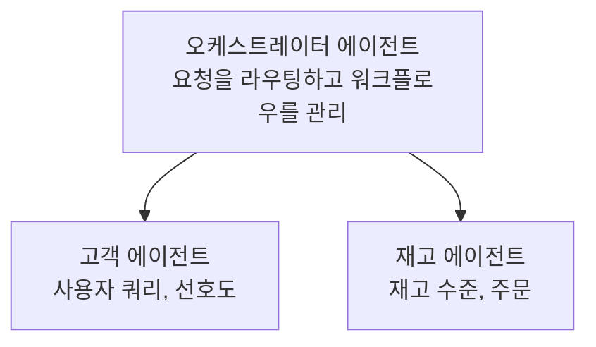

# 챕터 5: 멀티 에이전트 AI 솔루션

**📚 Course**: [AZD 초보자용](../../README.md) | **⏱️ Duration**: 2-3 hours | **⭐ Complexity**: 고급

---

## 개요

이 장에서는 고급 멀티 에이전트 아키텍처 패턴, 에이전트 오케스트레이션 및 복잡한 시나리오를 위한 프로덕션 준비 AI 배포에 대해 다룹니다.

> `azd 1.23.12`에 대해 2026년 3월에 검증됨.

## 학습 목표

이 장을 완료하면 다음을 할 수 있습니다:
- 멀티 에이전트 아키텍처 패턴 이해
- 조정된 AI 에이전트 시스템 배포
- 에이전트 간 통신 구현
- 프로덕션 수준의 멀티 에이전트 솔루션 구축

---

## 📚 강의

| # | 강의 | 설명 | 시간 |
|---|--------|-------------|------|
| 1 | [리테일 멀티 에이전트 솔루션](../../examples/retail-scenario.md) | 전체 구현 워크스루 | 90분 |
| 2 | [조정 패턴](../chapter-06-pre-deployment/coordination-patterns.md) | 에이전트 오케스트레이션 전략 | 30분 |
| 3 | [ARM 템플릿 배포](../../examples/retail-multiagent-arm-template/README.md) | 원클릭 배포 | 30분 |

---

## 🚀 빠른 시작

```bash
# 옵션 1: 템플릿에서 배포
azd init --template agent-openai-python-prompty
azd up

# 옵션 2: 에이전트 매니페스트에서 배포 (azure.ai.agents 확장 필요)
azd extension install azure.ai.agents
azd ai agent init -m agent-manifest.yaml
azd up
```

> **어떤 접근법을 사용해야 하나요?** 작동하는 샘플에서 시작하려면 `azd init --template`을 사용하세요. 자체 에이전트 매니페스트가 있는 경우 `azd ai agent init`을 사용하세요. 전체 세부정보는 [AZD AI CLI 참조](../chapter-08-production/production-ai-practices.md#azd-ai-cli-commands-and-extensions)를 참조하세요.

---

## 🤖 멀티 에이전트 아키텍처


---

## 🎯 주요 솔루션: 리테일 멀티 에이전트

[리테일 멀티 에이전트 솔루션](../../examples/retail-scenario.md)은 다음을 시연합니다:

- **고객 에이전트**: 사용자 상호작용 및 선호도 처리
- **재고 에이전트**: 재고 및 주문 처리 관리
- <strong>오케스트레이터</strong>: 에이전트 간 조정
- **공유 메모리**: 교차 에이전트 컨텍스트 관리

### 사용 서비스

| 서비스 | 목적 |
|---------|---------|
| Microsoft Foundry Models | 언어 이해 |
| Azure AI Search | 제품 카탈로그 |
| Cosmos DB | 에이전트 상태 및 메모리 |
| Container Apps | 에이전트 호스팅 |
| Application Insights | 모니터링 |

---

## 🔗 탐색

| 방향 | 챕터 |
|-----------|---------|
| <strong>이전</strong> | [챕터 4: 인프라](../chapter-04-infrastructure/README.md) |
| <strong>다음</strong> | [챕터 6: 사전 배포](../chapter-06-pre-deployment/README.md) |

---

## 📖 관련 자료

- [AI 에이전트 가이드](../chapter-02-ai-development/agents.md)
- [프로덕션 AI 실무](../chapter-08-production/production-ai-practices.md)
- [AI 문제 해결](../chapter-07-troubleshooting/ai-troubleshooting.md)

---

<!-- CO-OP TRANSLATOR DISCLAIMER START -->
**면책사항**:
이 문서는 AI 번역 서비스 [Co-op Translator](https://github.com/Azure/co-op-translator)를 사용하여 번역되었습니다. 정확성을 위해 노력하고 있지만, 자동 번역에는 오류나 부정확성이 포함될 수 있음을 유의하시기 바랍니다. 원문(원어) 문서는 권위 있는 출처로 간주되어야 합니다. 중요한 정보의 경우 전문 번역가에 의한 번역을 권장합니다. 본 번역의 사용으로 인해 발생하는 모든 오해 또는 잘못된 해석에 대해 당사는 책임을 지지 않습니다.
<!-- CO-OP TRANSLATOR DISCLAIMER END -->