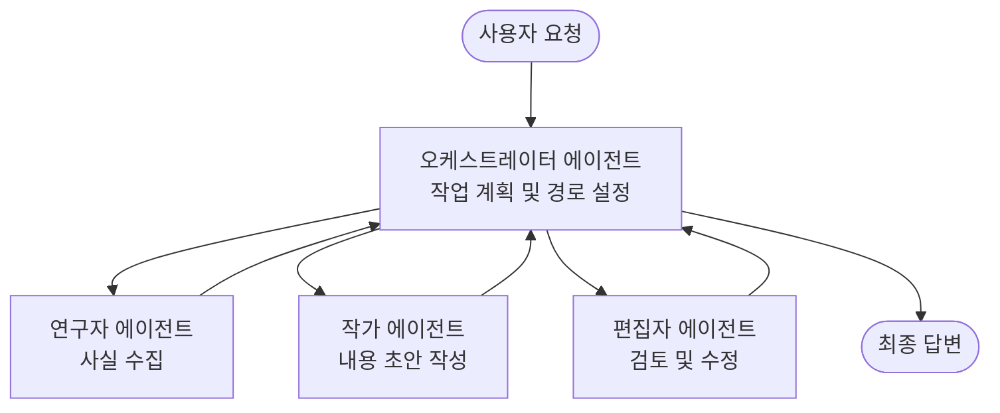

# 다중 에이전트 기본 - 첫 번째 협업 AI 시스템 배포

**챕터 탐색:** 
- **📚 강좌 홈**: [초보자를 위한 AZD](../../README.md)
- **📖 현재 챕터**: 5장 - 다중 에이전트 AI 솔루션
- **⬅️ 이전**: [4장: 인프라](../chapter-04-infrastructure/README.md)
- **➡️ 다음**: [협업 패턴](../chapter-06-pre-deployment/coordination-patterns.md)

> 2026년 7월 `azd 1.27.1`로 검증됨.

## 소개

이전 장에서는 단일 애플리케이션을 배포했고, 2장에서는 단일 AI 에이전트를 배포했습니다. 이번 수업에서는 여러 전문 에이전트가 함께 협력하여 단일 에이전트가 혼자 처리하기 어려운 문제를 해결하는 <strong>다중 에이전트 시스템</strong>을 배포하는 다음 단계를 다룹니다.

초보자를 위한 좋은 소식: **새로운 명령어가 필요하지 않습니다.** 다중 에이전트 솔루션도 여전히 azd 프로젝트입니다. `azd init`, `azd up`, 테스트, `azd down`을 하며—이미 아는 워크플로우를 그대로 사용합니다. 바뀌는 것은 내부 앱의 <em>형태</em>입니다.

## 학습 목표

이 수업이 끝나면:
- "다중 에이전트"가 무엇인지, 그리고 언제 그 추가 복잡성이 가치 있는지를 이해합니다.
- 다중 에이전트 시스템의 일반적인 역할(조율자 + 전문가)을 인식합니다.
- `azd up`으로 실제 작동하는 다중 에이전트 템플릿을 배포합니다.
- 다중 에이전트 앱을 지원하는 Azure 리소스를 이해합니다.
- 솔루션을 안전하게 검증, 맞춤화, 해체하는 방법을 압니다.

## 학습 성과

이 수업을 마치면 다음을 할 수 있습니다:
- 단일 에이전트와 다중 에이전트 시스템의 차이를 설명합니다.
- 도구를 사용하는 단일 에이전트와 실제 다중 에이전트 설계 중 선택합니다.
- azd로 다중 에이전트 템플릿을 끝까지 배포하고 테스트합니다.
- 각 에이전트의 실행 위치와 통신 방식을 식별합니다.
- 지속적인 비용 발생을 막기 위해 모든 리소스를 정리합니다.

---

## 다중 에이전트 시스템이란?

단일 AI 에이전트는 하나의 모델과 명령 집합, (선택적으로) 일부 도구를 포함합니다. 집중된 작업에는 효과적입니다. 그러나 작업이 연구, 작성, 편집, 사실 검사로 확장되면 모든 것을 하나의 프롬프트에 넣는 것이 에이전트를 느리게 하고, 신뢰성을 떨어뜨리며, 디버그를 어렵게 만듭니다.

<strong>다중 에이전트 시스템</strong>은 작업을 각각 하나씩 잘 수행하는 전문가들로 분할하며, 이를 조율자가 관리합니다:



### 항상 볼 수 있는 두 역할

| 역할 | 업무 | 예시 |
|------|-----|---------|
| <strong>조율자</strong> | *다음에 무슨 일이 일어날지* 결정하고 에이전트 간 작업을 분배 | "먼저 연구, 다음 작성, 그 다음 편집" |
| <strong>전문가</strong> | 한 가지 집중된 업무를 수행하고 결과를 반환 | 사실만 수집하는 "연구자" |

### 정말 여러 에이전트가 필요한가요?

간단하게 시작하세요. 다음 경우에만 다중 에이전트를 사용합니다:

- ✅ 작업에 서로 다른 명령이 필요한 <strong>구분된 단계</strong>가 있을 때 (연구 vs. 작성 vs. 검토)
- ✅ 시간을 절약하기 위해 전문가들이 <strong>병렬로</strong> 실행되길 원할 때
- ✅ 각 단계에 <strong>서로 다른 도구나 데이터 소스</strong>가 필요할 때
- ✅ 각 단계를 <strong>독립적으로 테스트하고 디버깅</strong>할 필요가 있을 때

과제나 단순 도구 호출이라면, **도구가 있는 단일 에이전트**(2장)가 더 간단하고, 저렴하며, 운영하기 쉽습니다.

> **초보자 팁:** "에이전트가 많을수록" 좋지 않습니다. 각 에이전트는 지연, 비용, 모니터링 부담을 추가합니다. 작업이 명확히 분할될 때만 에이전트를 추가하세요.

---

## Azure에서 다중 에이전트 구축하는 두 방법

| 방식 | 설명 | 사용 적합 예 |
|----------|-----------|----------|
| **단일 에이전트 + 도구** | 함수/도구를 호출하는 단일 Foundry 에이전트 | 간단한 워크플로우, 시작용 |
| **여러 협업 에이전트** | 여러 에이전트와 조율자 | 구분된 단계, 병렬 작업, 전문성 |

이 수업은 두 번째 방식을 다루며, <strong>준비된 템플릿</strong>을 사용해 직접 다중 에이전트 시스템이 작동하는 것을 볼 수 있습니다.

---

## 실습: 작동하는 다중 에이전트 앱 배포

여러 에이전트(연구자, 작가, 편집자)가 협력해 기사를 작성하는 공식 Azure 샘플인 <strong>Contoso Creative Writer</strong>를 배포할 것입니다. 역할이 명확하여 다중 에이전트 앱 입문에 적합합니다.

### 1단계: 템플릿 초기화

```bash
# 작업 폴더 생성
mkdir creative-writer && cd creative-writer

# 공식 다중 에이전트 템플릿에서 초기화
azd init --template contoso-creative-writer
```

> 항상 [Awesome AZD AI 갤러리](https://azure.github.io/awesome-azd/?tags=ai)에서 다양한 다중 에이전트 템플릿을 찾아보세요. 초보자용으로 `get-started-with-ai-agents`와 `azure-ai-travel-agents`도 추천됩니다.

### 2단계: 인증

```bash
# azd 워크플로우에 필요합니다
azd auth login
```

### 3단계: 환경 생성

```bash
azd env new dev
```

### 4단계: 미리보기 후 배포

```bash
# 비용을 지출하기 전에 생성될 내용을 확인하세요 (권장)
azd provision --preview

# 인프라를 준비하고 모든 에이전트를 한 번에 배포하기
azd up
```

`azd up`을 실행하면 구독과 지역을 묻고, Azure 리소스를 프로비저닝하고 앱을 배포합니다. AI 배포는 단순 웹 앱보다 오래 걸릴 수 있습니다—큰 모델일 경우 배포 시간 제한을 늘릴 수 있습니다:

```bash
azd deploy --timeout 1800
```

> **비용 및 용량 주의:** 다중 에이전트 앱은 쿼터를 소모하고 비용이 발생하는 AI 모델을 배포합니다. `azd up`이 모델 쿼터 문제로 실패하면 [AI 문제 해결](../chapter-07-troubleshooting/ai-troubleshooting.md)을 참조하여 지역 및 쿼터 문제를 해결하고, 6장 [용량 계획](../chapter-06-pre-deployment/capacity-planning.md)도 확인하세요.

---

## 배포한 내용 이해하기

이런 다중 에이전트 앱은 위 다이어그램의 역할에 직접 연관된 Azure 리소스를 구성합니다:

| 리소스 | 존재 이유 |
|----------|----------------|
| **Microsoft Foundry / 모델** | 각 에이전트가 사용하는 언어 모델 호스팅 |
| **Azure AI Search** | 연구자 에이전트에 기반 데이터 검색 제공 |
| **컨테이너 앱** (또는 앱 서비스) | 조율자 및 에이전트 코드를 호스팅 |
| **Cosmos DB** (일부 샘플) | 에이전트 간 공유 상태/메모리 저장 |
| **Application Insights** | 에이전트 간 요청 흐름 추적, 디버깅 지원 |

### 에이전트 간 통신 방식

대부분 azd 다중 에이전트 샘플에서 <strong>조율자는 애플리케이션 코드 내에서 실행</strong>됩니다(예: Semantic Kernel이나 Microsoft Agent Framework 사용). 조율자가 각 전문가 에이전트를 순차적으로 호출하고 결과를 전달해 최종 답변을 만듭니다. 에이전트는 다음을 통해 컨텍스트를 공유합니다:

- **함수/도구 호출** — 조율자가 전문가를 호출하여 결과를 받음
- **공유 메모리** — 데이터베이스(주로 Cosmos DB)가 양쪽 에이전트가 읽을 수 있는 상태를 저장
- **메시지/이벤트** — 느슨한 결합을 위해 에이전트가 큐 또는 Service Bus로 통신

> **디버깅에 왜 중요한가:** 각 단계가 분리되어 있어 Application Insights에서 어느 에이전트가 느리거나 실패했는지 보여줍니다. 이것이 작업을 에이전트별로 나누는 주된 이유 중 하나입니다.

---

## 배포 확인

시스템이 실제 작동하는지 확인하려면:

```bash
# 배포된 엔드포인트를 표시
azd show

# 앱의 모니터링 대시보드 열기
azd monitor

# 문제가 있어 보이면 로그 실시간 확인
azd monitor --logs
```

그런 다음 `azd show`의 앱 URL을 열고 모든 에이전트를 활용하는 요청을 시도하세요(예: Creative Writer에 주제에 관한 짧은 기사를 작성 요청). Application Insights의 <strong>트랜잭션 검색</strong>에서 연구자, 작가, 편집자 단계별 요청 분산을 볼 수 있습니다.

**성공 기준:**
- ✅ `azd show`가 도달 가능한 엔드포인트를 표시함
- ✅ 요청 결과가 여러 단계를 거쳤음을 명확히 보여줌
- ✅ Application Insights에 두 개 이상의 에이전트 단계 추적이 있음

---

## 맞춤화: 에이전트 추가 또는 조정

각 에이전트는 명령과 도구만으로 구성되어 맞춤화가 쉽습니다:

1. 템플릿 내 에이전트 정의 부분 찾기(보통 `prompts/`, `agents/`, 또는 `*.prompty` 파일 세트)
2. 에이전트 명령 조정 — 예를 들어, 편집자 에이전트에 특정 톤이나 단어 수를 강제 지정
3. 코드만 재배포 (인프라는 변경 없음)

   ```bash
   azd deploy
   ```

나아가서 <em>자신만의</em> 매니페스트로 에이전트를 만들려면 에이전트 확장과 그 완전한 생명주기를 사용하세요:

```bash
azd extension install azure.ai.agents
azd ai agent init -m agent-manifest.yaml
azd up
azd ai agent invoke      # 응답 시간과 함께 테스트
```

전체 에이전트 생명 주기(`invoke`, `eval generate`, `optimize`, `delete`)는 [2장: 에이전트](../chapter-02-ai-development/agents.md) 및 [AZD AI CLI 참고](../chapter-08-production/production-ai-practices.md#azd-ai-cli-commands-and-extensions)를 참조하세요.

---

## 정리

다중 에이전트 앱은 여러 청구 가능한 서비스를 실행합니다. 완료 후 모두 해제하세요:

```bash
azd down --force --purge
```

`--purge` 플래그는 Foundry/Azure AI 서비스 계정 같은 소프트 삭제된 AI 리소스도 제거하여, 향후 재배포를 방해하거나 비용 발생을 방지합니다.

---

## 프로덕션 다중 에이전트 시스템 참고

이 리포지토리의 [소매 다중 에이전트 솔루션](../../examples/retail-scenario.md)은 <strong>아키텍처 설계도</strong>로서, 한 번의 명령 템플릿이 아니라 프로덕션 소매 시스템이 <em>어떻게</em> 구축되는지 문서화합니다(전체 구축은 상당한 작업임을 명시). 여기서 작동하는 샘플을 배포한 뒤 설계 참고용으로 사용하세요. 프로덕션 관련 사항(복원력, 비용, 모니터링, 거버넌스)은 8장 [프로덕션 AI 실무](../chapter-08-production/production-ai-practices.md)를 이어서 읽으세요.

---

## 요약

- 다중 에이전트 시스템은 조율자가 관리하는 전문가들로 작업을 나눕니다.
- 작업에 구분된 단계, 병렬성 또는 단계별 다른 도구가 있을 때만 사용하세요—그렇지 않으면 단일 에이전트를 선호합니다.
- azd 워크플로우는 동일합니다: `azd init` → `azd up` → 테스트 → `azd down`.
- `contoso-creative-writer` 같은 실제 템플릿을 통해 지금 다중 에이전트 앱을 보고 맞춤화할 수 있습니다.
- 에이전트 간 Application Insights 추적은 다중 에이전트 설계의 가장 큰 실용적 장점 중 하나입니다.

---

## 🔗 탐색

| 방향 | 수업 |
|-----------|--------|
| <strong>이전</strong> | [4장: 인프라](../chapter-04-infrastructure/README.md) |
| <strong>다음</strong> | [협업 패턴](../chapter-06-pre-deployment/coordination-patterns.md) |

## 📖 관련 자료

- [AI 에이전트 가이드](../chapter-02-ai-development/agents.md)
- [협업 패턴](../chapter-06-pre-deployment/coordination-patterns.md)
- [프로덕션 AI 실무](../chapter-08-production/production-ai-practices.md)
- [AI 문제 해결](../chapter-07-troubleshooting/ai-troubleshooting.md)

---

<!-- CO-OP TRANSLATOR DISCLAIMER START -->
**면책 조항**:
이 문서는 AI 번역 서비스 [Co-op Translator](https://github.com/Azure/co-op-translator)를 사용하여 번역되었습니다. 정확성을 기하기 위해 노력하고 있으나, 자동 번역은 오류나 부정확한 부분이 있을 수 있음을 유의하시기 바랍니다. 원본 문서의 원어본이 권위 있는 자료로 간주되어야 합니다. 중요한 정보의 경우, 전문가의 인간 번역을 권장합니다. 이 번역 사용으로 인해 발생하는 오해나 잘못된 해석에 대해 당사는 책임을 지지 않습니다.
<!-- CO-OP TRANSLATOR DISCLAIMER END -->