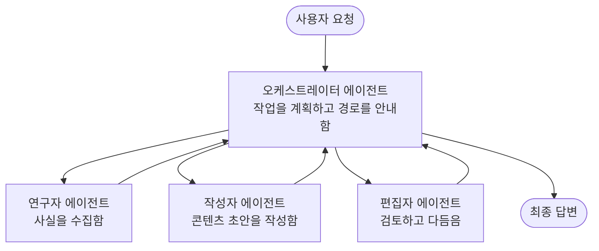

# 멀티에이전트 기초 - 첫 협업 AI 시스템 배포하기

**챕터 탐색:**
- **📚 코스 홈**: [AZD 초보자용](../../README.md)
- **📖 현재 챕터**: 챕터 5 - 멀티에이전트 AI 솔루션
- **⬅️ 이전**: [챕터 4: 인프라](../chapter-04-infrastructure/README.md)
- **➡️ 다음**: [조정 패턴](../chapter-06-pre-deployment/coordination-patterns.md)

> `azd 1.25.6`에 대해 2026년 6월에 검증되었습니다.

## 소개

이전 챕터들에서는 단일 애플리케이션을 배포했으며—챕터 2에서는 단일 AI 에이전트를 배포했습니다. 이 수업은 다음 단계로, 여러 전문 에이전트가 함께 문제를 해결하는 <strong>멀티에이전트 시스템</strong>을 배포합니다. 단일 에이전트가 잘 처리하기 어려운 문제를 여러 에이전트가 분담합니다.

초보자에게 좋은 소식: **새로운 명령어가 필요하지 않습니다.** 멀티에이전트 솔루션도 여전히 azd 프로젝트입니다. `azd init`, `azd up`, 테스트, `azd down`을 실행하는 동일한 워크플로를 사용합니다. 변경되는 것은 내부 애플리케이션의 <em>구성</em>입니다.

## 학습 목표

이 수업을 마치면 다음을 할 수 있습니다:
- "멀티에이전트"가 무엇을 의미하는지와 추가 복잡성이 정당한 경우를 이해한다
- 멀티에이전트 시스템에서 흔히 볼 수 있는 역할(오케스트레이터 + 스페셜리스트)을 식별한다
- `azd up`으로 실제 작동하는 멀티에이전트 템플릿을 배포한다
- 멀티에이전트 앱을 지원하는 Azure 리소스를 이해한다
- 솔루션을 안전하게 검증, 커스터마이즈, 제거하는 방법을 알게 된다

## 학습 성과

이 수업을 완료하면 다음을 수행할 수 있습니다:
- 단일 에이전트와 멀티에이전트 시스템의 차이를 설명한다
- 도구가 포함된 단일 에이전트와 진정한 멀티에이전트 설계 중에서 선택한다
- azd로 멀티에이전트 템플릿을 끝까지 배포하고 테스트한다
- 각 에이전트가 어디에서 실행되며 어떻게 통신하는지 식별한다
- 지속적인 요금 청구를 피하기 위해 모든 리소스를 정리한다

---

## 멀티에이전트 시스템이란?

단일 AI 에이전트는 일련의 지침과 (선택적으로) 일부 도구를 가진 하나의 모델입니다. 이는 집중된 작업에는 잘 작동합니다. 하지만 작업이 커지면—조사, 글쓰기, 편집, 사실 확인 등—모든 것을 하나의 프롬프트에 넣으면 에이전트가 느려지고 신뢰성이 떨어지며 디버깅이 어려워집니다.

<strong>멀티에이전트 시스템</strong>은 작업을 각자 하나의 작업을 잘 수행하는 스페셜리스트로 나누고, 오케스트레이터가 조정합니다:



### 항상 보게 될 두 가지 역할

| 역할 | 업무 | 예시 |
|------|-----|---------|
| <strong>오케스트레이터</strong> | *다음에 무엇을 할지* 결정하고 에이전트 간 작업을 라우팅함 | "먼저 조사, 그다음 작성, 그다음 편집" |
| <strong>스페셜리스트</strong> | 하나의 집중된 작업을 수행하고 결과를 반환함 | 사실만 수집하는 "연구자" |

### 실제로 여러 에이전트가 필요한가요?

간단하게 시작하세요. 다음 중 하나라도 해당될 때만 멀티에이전트를 고려하세요:

- ✅ 작업에 <strong>서로 다른 단계</strong>가 있어 각 단계에 다른 지침이 유리할 때 (조사 vs 작성 vs 검토)
- ✅ 시간을 절약하기 위해 스페셜리스트를 <strong>병렬로</strong> 실행하고 싶을 때
- ✅ 서로 다른 단계가 <strong>다른 도구나 데이터 소스</strong>를 필요로 할 때
- ✅ 각 단계를 <strong>독립적으로 테스트하고 디버깅</strong>할 필요가 있을 때

작업이 단일 질문-응답이나 간단한 도구 호출이라면, **도구가 포함된 단일 에이전트**(챕터 2)가 더 간단하고 비용이 적게 들며 운영하기 쉽습니다.

> **초보자 팁:** "에이전트가 많을수록"이 항상 "더 좋다"는 의미는 아닙니다. 각 에이전트는 대기 시간, 비용, 모니터링 대상이 추가됩니다. 문제를 명확히 부분으로 분리할 수 있을 때만 에이전트를 추가하세요.

---

## Azure에서 멀티에이전트를 구축하는 두 가지 방법

| 접근 방식 | 무엇인지 | 적합한 경우 |
|----------|-----------|----------|
| **단일 에이전트 + 도구** | 함수/도구를 호출하는 하나의 Foundry 에이전트 | 간단한 워크플로, 시작하기 좋음 |
| **여러 개의 조정된 에이전트** | 오케스트레이터가 있는 여러 에이전트 | 명확한 단계, 병렬 작업, 전문화 필요 시 |

이 수업은 두 번째 접근 방식을 준비된 <strong>템플릿</strong>을 사용하여 실제 멀티에이전트 시스템이 실행되는 모습을 볼 수 있게 합니다.

---

## 실습: 작동하는 멀티에이전트 앱 배포

여기서는 여러 에이전트(연구자, 작가, 편집자)를 사용하여 기사를 생성하는 공식 Azure 샘플인 <strong>Contoso Creative Writer</strong>를 배포합니다. 역할이 이해하기 쉬워 초보자에게 적합한 첫 멀티에이전트 앱입니다.

### 1단계: 템플릿 초기화

```bash
# 작업 폴더를 생성합니다
mkdir creative-writer && cd creative-writer

# 공식 다중 에이전트 템플릿으로 초기화
azd init --template contoso-creative-writer
```

> 언제든지 [Awesome AZD AI gallery](https://azure.github.io/awesome-azd/?tags=ai)에서 더 많은 멀티에이전트 템플릿을 찾아보세요. 초보자 친화적인 다른 옵션으로는 `get-started-with-ai-agents` 및 `azure-ai-travel-agents`가 있습니다.

### 2단계: 인증

```bash
# azd 워크플로우에 필요합니다
azd auth login
```

### 3단계: 환경 생성

```bash
azd env new dev
```

### 4단계: 미리보기 후 배포

```bash
# 무엇이 생성될지 비용을 지출하기 전에 확인하세요 (권장)
azd provision --preview

# 인프라를 프로비저닝하고 모든 에이전트를 한 번에 배포하세요
azd up
```

`azd up`는 구독과 리전을 묻는 프롬프트를 표시한 다음 Azure 리소스를 프로비저닝하고 애플리케이션을 배포합니다. AI 배포는 간단한 웹 앱보다 더 오래 걸릴 수 있으며—더 큰 모델을 배포할 경우 배포 시간 초과를 연장할 수 있습니다:

```bash
azd deploy --timeout 1800
```

> **비용과 용량에 대한 알림:** 멀티에이전트 앱은 할당량을 소비하고 비용이 발생하는 AI 모델을 배포합니다. `azd up`가 모델 쿼터 문제로 실패하면 지역 및 쿼터 수정 방법은 [AI 문제 해결](../chapter-07-troubleshooting/ai-troubleshooting.md)을 참조하고, 용량 관련 내용은 챕터 6 [용량 계획](../chapter-06-pre-deployment/capacity-planning.md)을 참고하세요.

---

## 배포한 내용 이해하기

이와 같은 일반적인 멀티에이전트 앱은 위 다이어그램의 책임과 직접 매핑되는 일련의 Azure 리소스를 프로비저닝합니다:

| 리소스 | 존재 이유 |
|----------|----------------|
| **Microsoft Foundry / Models** | 각 에이전트가 사용하는 언어 모델을 호스팅함 |
| **Azure AI Search** | 연구자 에이전트가 검색할 수 있는 근거 있는 데이터를 제공함 |
| **컨테이너 앱**(또는 App Service) | 오케스트레이터와 에이전트 코드를 호스팅함 |
| **Cosmos DB**(일부 샘플) | 에이전트 간에 전달되는 공유 상태/메모리를 저장함 |
| **Application Insights** | 에이전트 전체에 걸친 요청을 추적하여 흐름을 디버깅할 수 있게 함 |

### 에이전트 간 통신 방식

대부분의 azd 멀티에이전트 샘플에서 <strong>오케스트레이터는 애플리케이션 코드에서 실행</strong>됩니다(예: Semantic Kernel 또는 Microsoft Agent Framework 같은 프레임워크 사용). 오케스트레이터는 각 스페셜리스트 에이전트를 순차적으로 호출하고 결과를 전달하며 최종 답변을 조합합니다. 에이전트들은 다음을 통해 컨텍스트를 공유합니다:

- **함수/도구 호출** — 오케스트레이터가 스페셜리스트를 호출하고 결과를 받음
- **공유 메모리** — 데이터베이스(종종 Cosmos DB)가 에이전트 모두가 읽을 수 있는 상태를 보관
- **메시지/이벤트** — 느슨한 결합을 위해 큐나 Service Bus를 통해 통신

> **디버깅에 있어 이 점이 중요한 이유:** 각 단계가 분리되어 있기 때문에 Application Insights가 느리거나 실패한 <em>어떤</em> 에이전트인지 보여줍니다. 이것이 작업을 에이전트로 분할하는 주요 이유 중 하나입니다.

---

## 배포 검증

다음 작업을 진행하기 전에 시스템이 실제로 작동하는지 확인하세요:

```bash
# 배포된 엔드포인트 표시
azd show

# 앱의 모니터링 대시보드 열기
azd monitor

# 무언가 이상해 보이면 로그를 실시간으로 확인
azd monitor --logs
```

그런 다음 `azd show`에서 앱 URL을 열고 모든 에이전트를 사용하는 요청을 시도하세요(예: Creative Writer에는 특정 주제로 짧은 기사를 작성해 달라고 요청). Application Insights의 <strong>transaction search</strong>에서 요청이 연구자, 작가, 편집자 단계로 확산되는 것을 볼 수 있어야 합니다.

**성공 기준:**
- ✅ `azd show`가 접근 가능한 엔드포인트를 나열함
- ✅ 요청이 여러 단계로 분명히 처리되어 결과가 생성됨
- ✅ Application Insights가 하나 이상의 에이전트 단계에 대한 트레이스를 표시함

---

## 맞춤화: 에이전트 추가 또는 조정

각 에이전트는 지침과 도구로 구성되어 있으므로 맞춤화는 접근하기 쉽습니다:

1. 템플릿에서 **에이전트 정의 찾기**(종종 `prompts/`, `agents/` 또는 `*.prompty` 파일 집합).
2. **에이전트 지침 조정** — 예: 편집자 에이전트에게 특정 톤이나 단어 수를 강제하도록 지시.
3. **코드만 재배포**(인프라는 변경 없음):

   ```bash
   azd deploy
   ```

자체 매니페스트로부터 에이전트를 더 구축하고 전체 수명주기를 사용하려면 에이전트 확장과 그 전체 수명주기를 사용하세요:

```bash
azd extension install azure.ai.agents
azd ai agent init -m agent-manifest.yaml
azd up
azd ai agent invoke      # 응답 타이밍을 포함한 테스트
```

전체 에이전트 수명주기(`invoke`, `eval generate`, `optimize`, `delete`)에 대한 내용은 [챕터 2: 에이전트](../chapter-02-ai-development/agents.md) 및 [AZD AI CLI 참조](../chapter-08-production/production-ai-practices.md#azd-ai-cli-commands-and-extensions)를 참조하세요.

---

## 정리

멀티에이전트 앱은 여러 청구 가능한 서비스를 실행합니다. 작업을 마치면 모두 제거하세요:

```bash
azd down --force --purge
```

`--purge` 플래그는 Foundry/Azure AI Services 계정과 같은 소프트 삭제된 AI 리소스도 제거하여 향후 재배포를 차단하거나 비용이 계속 발생하는 것을 방지합니다.

---

## 운영 환경 멀티에이전트 시스템에 대한 참고

이 저장소의 [Retail Multi-Agent Solution](../../examples/retail-scenario.md)은 <strong>아키텍처 청사진</strong>이며, 원클릭 템플릿이 아닙니다 — 이는 운영 환경 소매 시스템이 <em>어떻게</em> 구축될지 문서화한 것이며(전체 구축이 상당한 노력이 필요함을 명시) 작동하는 샘플을 배포한 후 디자인 참조로 사용하세요. 운영 관련 고려사항(복원력, 비용, 모니터링, 거버넌스)은 [챕터 8: 운영 AI 관행](../chapter-08-production/production-ai-practices.md)을 계속 참조하세요.

---

## 요약

- 멀티에이전트 시스템은 오케스트레이터가 조정하는 스페셜리스트로 작업을 분할합니다.
- 작업에 명확한 단계, 병렬성 또는 단계별 다른 도구가 필요한 경우에만 사용하세요 — 그렇지 않으면 단일 에이전트를 우선하세요.
- azd 워크플로는 변경되지 않습니다: `azd init` → `azd up` → 테스트 → `azd down`.
- `contoso-creative-writer` 같은 실제 템플릿을 통해 오늘 바로 작동하는 멀티에이전트 앱을 보고 커스터마이즈할 수 있습니다.
- 에이전트 간의 Application Insights 추적은 멀티에이전트 설계의 가장 실용적인 이점 중 하나입니다.

---

## 🔗 탐색

| 방향 | 수업 |
|-----------|--------|
| <strong>이전</strong> | [챕터 4: 인프라](../chapter-04-infrastructure/README.md) |
| <strong>다음</strong> | [조정 패턴](../chapter-06-pre-deployment/coordination-patterns.md) |

## 📖 관련 자료

- [AI 에이전트 가이드](../chapter-02-ai-development/agents.md)
- [조정 패턴](../chapter-06-pre-deployment/coordination-patterns.md)
- [운영 AI 관행](../chapter-08-production/production-ai-practices.md)
- [AI 문제 해결](../chapter-07-troubleshooting/ai-troubleshooting.md)

---

<!-- CO-OP TRANSLATOR DISCLAIMER START -->
**면책 조항**:
이 문서는 AI 번역 서비스 [Co-op Translator](https://github.com/Azure/co-op-translator)를 사용하여 번역되었습니다. 정확성을 기하기 위해 노력하고 있으나, 자동 번역은 오류나 부정확한 부분이 있을 수 있음을 유의하시기 바랍니다. 원본 문서의 원어본이 권위 있는 자료로 간주되어야 합니다. 중요한 정보의 경우, 전문가의 인간 번역을 권장합니다. 이 번역 사용으로 인해 발생하는 오해나 잘못된 해석에 대해 당사는 책임을 지지 않습니다.
<!-- CO-OP TRANSLATOR DISCLAIMER END -->