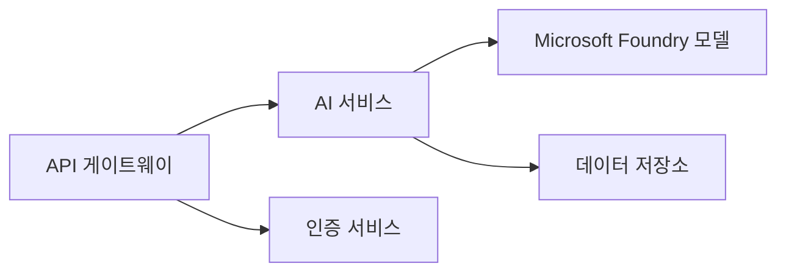

# Chapter 8: 프로덕션 및 엔터프라이즈 패턴

**📚 과정**: [AZD 입문자용](../../README.md) | **⏱️ 소요 시간**: 2-3 시간 | **⭐ 난이도**: 고급

---

## 개요

이 장에서는 엔터프라이즈 준비가 된 배포 패턴, 보안 강화, 모니터링 및 프로덕션 AI 작업 부하에 대한 비용 최적화를 다룹니다.

> `azd 1.25.6` (2026년 6월 기준)에서 검증됨.

## 학습 목표

이 장을 완료하면 다음을 수행할 수 있습니다:
- 다중 지역 복원력 있는 애플리케이션 배포
- 엔터프라이즈 보안 패턴 구현
- 종합적인 모니터링 구성
- 대규모 비용 최적화
- AZD를 이용한 CI/CD 파이프라인 설정

---

## 📚 강의

| # | 강의 | 설명 | 시간 |
|---|--------|-------------|------|
| 1 | [프로덕션 AI 관행](production-ai-practices.md) | 엔터프라이즈 배포 패턴 | 90 분 |

---

## 🚀 프로덕션 체크리스트

- [ ] 복원력을 위한 다중 지역 배포
- [ ] 인증을 위한 관리 ID 사용 (키 없음)
- [ ] 모니터링용 Application Insights 구성
- [ ] 비용 예산 및 알림 설정
- [ ] 보안 스캔 활성화
- [ ] CI/CD 파이프라인 통합
- [ ] 재해 복구 계획

---

## 🏗️ 아키텍처 패턴

### 패턴 1: 마이크로서비스 AI



### 패턴 2: 이벤트 기반 AI


---

## 🔐 보안 모범 사례

```bicep
// Use managed identity
identity: {
  type: 'SystemAssigned'
}

// Private endpoints for AI services
properties: {
  publicNetworkAccess: 'Disabled'
  networkAcls: {
    defaultAction: 'Deny'
  }
}
```

---

## 💰 비용 최적화

| 전략 | 절감 효과 |
|----------|---------|
| 스케일 투 제로 (컨테이너 앱) | 60-80% |
| 개발용 소비 계층 사용 | 50-70% |
| 예약된 스케일링 | 30-50% |
| 예약 용량 | 20-40% |

```bash
# 예산 알림 설정
az consumption budget create \
  --budget-name "AI-Budget" \
  --amount 500 \
  --category Cost \
  --time-grain Monthly
```

---

## 📊 모니터링 설정

```bash
# 스트림 로그
azd monitor --logs

# 애플리케이션 인사이트 확인
azd monitor --overview

# 메트릭 보기
az monitor metrics list --resource <resource-id>
```

---

## 🔗 내비게이션

| 방향 | 장 |
|-----------|---------|
| <strong>이전</strong> | [7장: 문제 해결](../chapter-07-troubleshooting/README.md) |
| **과정 완료** | [과정 홈](../../README.md) |

---

## 📖 관련 자료

- [AI 에이전트 가이드](../chapter-02-ai-development/agents.md)
- [Application Insights](../chapter-06-pre-deployment/application-insights.md)
- [다중 에이전트 솔루션](../chapter-05-multi-agent/README.md)
- [마이크로서비스 예제](../../examples/microservices/README.md)

---

<!-- CO-OP TRANSLATOR DISCLAIMER START -->
**면책 조항**:
이 문서는 AI 번역 서비스 [Co-op Translator](https://github.com/Azure/co-op-translator)를 사용하여 번역되었습니다. 정확성을 기하기 위해 노력하고 있으나, 자동 번역은 오류나 부정확한 부분이 있을 수 있음을 유의하시기 바랍니다. 원본 문서의 원어본이 권위 있는 자료로 간주되어야 합니다. 중요한 정보의 경우, 전문가의 인간 번역을 권장합니다. 이 번역 사용으로 인해 발생하는 오해나 잘못된 해석에 대해 당사는 책임을 지지 않습니다.
<!-- CO-OP TRANSLATOR DISCLAIMER END -->