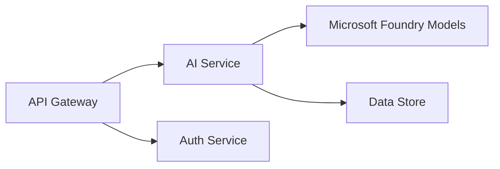
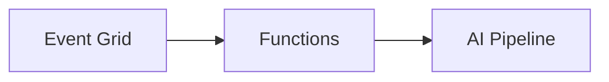

# 8장: 프로덕션 및 엔터프라이즈 패턴

**📚 강의**: [초보자를 위한 AZD](../../README.md) | **⏱️ 소요 시간**: 2-3시간 | **⭐ 난이도**: 고급

---

## 개요

이 장에서는 엔터프라이즈 준비가 된 배포 패턴, 보안 강화, 모니터링 및 프로덕션 AI 작업 부하의 비용 최적화를 다룹니다.

이 문서는 아키텍처 참조용이며 완전한 배포 가능한 프로덕션 템플릿이 아닙니다. 예제들은 귀하의 애플리케이션에서 제공하고 테스트해야 할 통합 세부 사항을 생략합니다; 체크리스트를 읽었다고 해서 프로덕션 준비가 인증되는 것은 아닙니다.

> **릴리스 검토(2026-11-04):** AI CLI 안내는 `azd 1.37.2`, 에이전트 `1.0.0-beta.23` 및 평가 `1.0.0-beta.2` 문서/소스를 기준으로 검토되었습니다. 호환성 요구 사항 및 마이그레이션 세부 정보는 [릴리스 변경사항 및 수정사항](production-ai-practices.md#recent-release-changes-and-fixes)을 참조하십시오; 이것은 실시간 배포 검증이 아닙니다.

## 학습 목표

이 장을 완료하면 다음을 할 수 있습니다:
- 다중 지역 탄력적인 애플리케이션 배포
- 엔터프라이즈 보안 패턴 구현
- 종합 모니터링 구성
- 규모에 따른 비용 최적화
- AZD로 CI/CD 파이프라인 설정

---

## 📚 강의 목록

| # | 강의 | 설명 | 시간 |
|---|--------|-------------|------|
| 1 | [프로덕션 AI 실습](production-ai-practices.md) | 엔터프라이즈 배포 패턴 | 90분 |

---

## 🚀 프로덕션 체크리스트

- [ ] 탄력성을 위한 다중 지역 배포
- [ ] 인증용 관리형 아이덴티티 (키 없음)
- [ ] 모니터링용 애플리케이션 인사이트
- [ ] 비용 예산 및 경고 설정
- [ ] 보안 스캐닝 활성화
- [ ] CI/CD 파이프라인 통합
- [ ] 재해 복구 계획

---

## 🏗️ 아키텍처 패턴

### 패턴 1: 마이크로서비스 AI


```mermaid
graph LR
    Gateway[API Gateway] --> AI[AI Service] --> Models[Microsoft Foundry Models]
    Gateway --> Auth[Auth Service]
    AI --> Data[Data Store]
```

### 패턴 2: 이벤트 기반 AI


```mermaid
graph LR
    EventGrid[Event Grid] --> Functions[Functions] --> Pipeline[AI Pipeline]
```

---

## 🔐 보안 모범 사례

```bicep
// Illustrative properties from different resources, NOT a standalone Bicep file.
// Attach identity to the application host:
identity: {
  type: 'SystemAssigned'
}

// AI account properties (also require private endpoints, DNS and app connectivity):
properties: {
  publicNetworkAccess: 'Disabled'
  networkAcls: {
    defaultAction: 'Deny'
  }
}
```

---

## 💰 비용 최적화

| 전략 | 주요 제약 조건 |
|----------|---------|
| 제로 스케일링 (컨테이너 앱) | 적합한 트리거 필요; 다른 서비스는 여전히 비용 발생 |
| 개발용 소비 등급 사용 | 선택한 서비스 가격 및 작업 부하 비교 |
| 예약된 스케일링 | 지원되는 인프라/자동화를 통한 스케일링 |
| 예약/프로비저닝 용량 | 지원 시에만; 약정은 유휴 비용 증가 가능성 |

유효한 시작 날짜, 청구 범위, 수신자 및 권한과 함께 [완전한 예산 리소스 패턴](production-ai-practices.md#2-cost-monitoring-and-budgets)을 사용하세요. 예산은 경고를 보내지만 지출 한도는 아닙니다. 절감액은 측정된 사용량에 따라 달라지며 보장된 비율이 아닙니다.

---

## 📊 모니터링 설정

```bash
# Open the Application Insights logs view (requires configured monitoring)
azd monitor --logs

# Check Application Insights
azd monitor --overview

# View metrics
az monitor metrics list --resource <resource-id>
```

---

## 🔗 탐색

| 방향 | 장 |
|-----------|---------|
| <strong>이전</strong> | [7장: 문제해결](../chapter-07-troubleshooting/README.md) |
| **강의 완료** | [강의 홈](../../README.md) |

---

## 📖 관련 자료

- [AI 에이전트 가이드](../chapter-02-ai-development/agents.md)
- [애플리케이션 인사이트](../chapter-06-pre-deployment/application-insights.md)
- [다중 에이전트 솔루션](../chapter-05-multi-agent/README.md)
- [마이크로서비스 예제](../../examples/microservices/README.md)

---

<!-- CO-OP TRANSLATOR DISCLAIMER START -->
**면책 조항**:
이 문서는 AI 번역 서비스 [Co-op Translator](https://github.com/Azure/co-op-translator)를 사용하여 번역되었습니다. 정확성을 기하기 위해 노력하고 있으나, 자동 번역은 오류나 부정확한 부분이 있을 수 있음을 유의하시기 바랍니다. 원본 문서의 원어본이 권위 있는 자료로 간주되어야 합니다. 중요한 정보의 경우, 전문가의 인간 번역을 권장합니다. 이 번역 사용으로 인해 발생하는 오해나 잘못된 해석에 대해 당사는 책임을 지지 않습니다.
<!-- CO-OP TRANSLATOR DISCLAIMER END -->