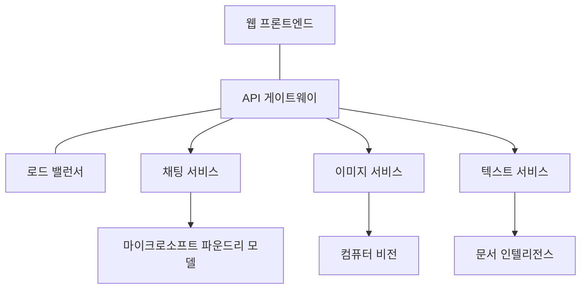

# 생산 AI 워크로드 모범 사례 - AZD

**챕터 내비게이션:**
- **📚 코스 홈**: [초보자를 위한 AZD](../../README.md)
- **📖 현재 챕터**: 8장 - 프로덕션 및 엔터프라이즈 패턴
- **⬅️ 이전 챕터**: [7장: 문제 해결](../chapter-07-troubleshooting/debugging.md)
- **⬅️ 관련 자료**: [AI 워크숍 랩](ai-workshop-lab.md)
- **🎯 코스 완료**: [초보자를 위한 AZD](../../README.md)

## 개요

이 가이드는 Azure Developer CLI(AZD)를 사용하여 프로덕션 준비가 된 AI 워크로드를 배포하기 위한 종합적인 모범 사례를 제공합니다. Microsoft Foundry Discord 커뮤니티의 피드백과 실제 고객 배포 사례를 기반으로 하여, 프로덕션 AI 시스템에서 가장 흔히 발생하는 문제들을 해결합니다.

## 해결되는 주요 과제

커뮤니티 투표 결과에 따른 개발자들이 직면하는 주요 과제는 다음과 같습니다:

- **45%** 다중 서비스 AI 배포에 어려움이 있음
- **38%** 자격 증명 및 비밀 관리 문제  
- **35%** 프로덕션 준비 및 확장 어려움
- **32%** 비용 최적화 전략 부족
- **29%** 모니터링 및 문제 해결 개선 필요

## 프로덕션 AI 아키텍처 패턴

### 패턴 1: 마이크로서비스 AI 아키텍처

**사용 시점**: 여러 기능을 가진 복잡한 AI 애플리케이션



**AZD 구현**:

```yaml
# azure.yaml
name: enterprise-ai-platform
services:
  web:
    project: ./web
    host: staticwebapp
  api-gateway:
    project: ./api-gateway
    host: containerapp
  chat-service:
    project: ./services/chat
    host: containerapp
  vision-service:
    project: ./services/vision
    host: containerapp
  text-service:
    project: ./services/text
    host: containerapp
```

### 패턴 2: 이벤트 기반 AI 처리

**사용 시점**: 배치 처리, 문서 분석, 비동기 워크플로우

```bicep
// Event Hub for AI processing pipeline
resource eventHub 'Microsoft.EventHub/namespaces@2023-01-01-preview' = {
  name: eventHubNamespaceName
  location: location
  sku: {
    name: 'Standard'
    tier: 'Standard'
    capacity: 1
  }
}

// Service Bus for reliable message processing
resource serviceBus 'Microsoft.ServiceBus/namespaces@2022-10-01-preview' = {
  name: serviceBusNamespaceName
  location: location
  sku: {
    name: 'Premium'
    tier: 'Premium'
    capacity: 1
  }
}

// Function App for processing
resource functionApp 'Microsoft.Web/sites@2023-01-01' = {
  name: functionAppName
  location: location
  kind: 'functionapp,linux'
  properties: {
    siteConfig: {
      appSettings: [
        {
          name: 'FUNCTIONS_EXTENSION_VERSION'
          value: '~4'
        }
        {
          name: 'AZURE_OPENAI_ENDPOINT'
          value: '@Microsoft.KeyVault(VaultName=${keyVault.name};SecretName=openai-endpoint)'
        }
      ]
    }
  }
}
```

## AI 에이전트 상태에 관한 고찰

전통적인 웹 앱이 고장 나면 징후는 익숙합니다: 페이지가 로드되지 않거나 API가 오류를 반환하거나 배포가 실패합니다. AI 기반 애플리케이션도 이러한 모든 문제로 고장 날 수 있지만, 명백한 오류 메시지를 생성하지 않는 더 미묘한 방식으로 문제를 일으킬 수도 있습니다.

이 섹션은 AI 워크로드 모니터링을 위한 사고 모델을 구축하는 데 도움이 되어 이상 징후가 있을 때 어디를 확인해야 할지 알려줍니다.

### 에이전트 건강이 전통적인 앱 건강과 다른 점

전통적인 앱은 작동하거나 작동하지 않습니다. AI 에이전트는 작동하는 것처럼 보이지만 결과가 부정확할 수 있습니다. 에이전트의 상태는 두 가지 층으로 생각해보세요:

| 층 | 주목할 점 | 확인 위치 |
|-------|--------------|---------------|
| **인프라 건강** | 서비스가 실행 중인가? 리소스가 프로비저닝 되었나? 엔드포인트에 접근 가능한가? | `azd monitor`, Azure 포털 리소스 상태, 컨테이너/앱 로그 |
| **행동 건강** | 에이전트가 정확하게 반응하는가? 응답이 적시에 이루어지는가? 모델이 올바르게 호출 되는가? | Application Insights 추적, 모델 호출 지연 시간 지표, 응답 품질 로그 |

인프라 건강은 익숙할 것입니다—어떤 azd 앱에서도 동일합니다. 행동 건강은 AI 워크로드에 새롭게 도입된 층입니다.

### AI 앱에서 예상치 못한 행동이 발생하면 어디를 봐야 할까요?

AI 애플리케이션이 기대한 결과를 내지 못한다면 다음 개념 체크리스트를 참고하세요:

1. **기본부터 점검하세요.** 앱이 실행 중인가? 종속성에 접근 가능한가? 모든 앱과 마찬가지로 `azd monitor`와 리소스 상태를 확인하세요.
2. **모델 연결 상태 확인.** 앱이 AI 모델에 성공적으로 호출을 하고 있는가? 실패하거나 타임아웃된 모델 호출은 AI 앱 문제의 가장 흔한 원인이며, 앱 로그에서 볼 수 있습니다.
3. **모델이 받은 입력 확인.** AI 응답은 입력값(프롬프트 및 검색된 컨텍스트)에 좌우됩니다. 출력이 잘못되었다면 입력이 일반적으로 잘못된 경우입니다. 앱이 올바른 데이터를 모델에 보내는지 확인하세요.
4. **응답 지연 시간 검토.** AI 모델 호출은 일반적인 API 호출보다 느립니다. 앱이 느리게 느껴진다면 모델 응답 시간이 증가하지 않았는지 확인하세요—이는 쓰로틀링, 용량 한도 또는 지역별 혼잡을 나타낼 수 있습니다.
5. **비용 신호 주시.** 토큰 사용량이나 API 호출에서 예기치 않은 급증은 루프, 잘못 구성된 프롬프트 또는 과도한 재시도를 의미할 수 있습니다.

즉시 모든 관측 도구를 마스터할 필요는 없습니다. 핵심은 AI 애플리케이션이 추가적인 행동 모니터링 층을 갖고 있으며, azd 내장 모니터링(`azd monitor`)이 두 층 모두를 조사할 시작점을 제공한다는 점입니다.

---

## 보안 모범 사례

### 1. 제로 트러스트 보안 모델

**구현 전략**:
- 인증 없는 서비스 간 통신 금지
- 모든 API 호출은 관리되는 ID 사용
- 프라이빗 엔드포인트를 통한 네트워크 분리
- 최소 권한 접근 제어

```bicep
// Managed Identity for each service
resource chatServiceIdentity 'Microsoft.ManagedIdentity/userAssignedIdentities@2023-01-31' = {
  name: 'chat-service-identity'
  location: location
}

// Role assignments with minimal permissions
resource openAIUserRole 'Microsoft.Authorization/roleAssignments@2022-04-01' = {
  scope: openAIAccount
  name: guid(openAIAccount.id, chatServiceIdentity.id, openAIUserRoleDefinitionId)
  properties: {
    roleDefinitionId: subscriptionResourceId('Microsoft.Authorization/roleDefinitions', '5e0bd9bd-7b93-4f28-af87-19fc36ad61bd')
    principalId: chatServiceIdentity.properties.principalId
    principalType: 'ServicePrincipal'
  }
}
```

### 2. 안전한 비밀 관리

**Key Vault 통합 패턴**:

```bicep
// Key Vault with proper access policies
resource keyVault 'Microsoft.KeyVault/vaults@2023-02-01' = {
  name: keyVaultName
  location: location
  properties: {
    tenantId: tenant().tenantId
    sku: {
      family: 'A'
      name: 'premium'  // Use premium for production
    }
    enableRbacAuthorization: true  // Use RBAC instead of access policies
    enablePurgeProtection: true    // Prevent accidental deletion
    enableSoftDelete: true
    softDeleteRetentionInDays: 90
  }
}

// Store all AI service credentials
resource openAIKeySecret 'Microsoft.KeyVault/vaults/secrets@2023-02-01' = {
  parent: keyVault
  name: 'openai-api-key'
  properties: {
    value: openAIAccount.listKeys().key1
    attributes: {
      enabled: true
    }
  }
}
```

### 3. 네트워크 보안

**프라이빗 엔드포인트 구성**:

```bicep
// Virtual Network for AI services
resource virtualNetwork 'Microsoft.Network/virtualNetworks@2023-04-01' = {
  name: vnetName
  location: location
  properties: {
    addressSpace: {
      addressPrefixes: ['10.0.0.0/16']
    }
    subnets: [
      {
        name: 'ai-services-subnet'
        properties: {
          addressPrefix: '10.0.1.0/24'
          privateEndpointNetworkPolicies: 'Disabled'
        }
      }
      {
        name: 'app-services-subnet'
        properties: {
          addressPrefix: '10.0.2.0/24'
          delegations: [
            {
              name: 'Microsoft.Web/serverFarms'
              properties: {
                serviceName: 'Microsoft.Web/serverFarms'
              }
            }
          ]
        }
      }
    ]
  }
}

// Private endpoints for all AI services
resource openAIPrivateEndpoint 'Microsoft.Network/privateEndpoints@2023-04-01' = {
  name: '${openAIAccountName}-pe'
  location: location
  properties: {
    subnet: {
      id: virtualNetwork.properties.subnets[0].id
    }
    privateLinkServiceConnections: [
      {
        name: 'openai-connection'
        properties: {
          privateLinkServiceId: openAIAccount.id
          groupIds: ['account']
        }
      }
    ]
  }
}
```

## 성능 및 확장

### 1. 자동 확장 전략

**컨테이너 앱 자동 확장**:

```bicep
resource containerApp 'Microsoft.App/containerApps@2023-05-01' = {
  name: containerAppName
  location: location
  properties: {
    configuration: {
      ingress: {
        external: true
        targetPort: 8000
        transport: 'http'
      }
    }
    template: {
      scale: {
        minReplicas: 2  // Always have 2 instances minimum
        maxReplicas: 50 // Scale up to 50 for high load
        rules: [
          {
            name: 'http-scaling'
            http: {
              metadata: {
                concurrentRequests: '20'  // Scale when >20 concurrent requests
              }
            }
          }
          {
            name: 'cpu-scaling'
            custom: {
              type: 'cpu'
              metadata: {
                type: 'Utilization'
                value: '70'  // Scale when CPU >70%
              }
            }
          }
        ]
      }
    }
  }
}
```

### 2. 캐싱 전략

**AI 응답을 위한 Redis 캐시**:

```bicep
// Redis Premium for production workloads
resource redisCache 'Microsoft.Cache/redis@2023-04-01' = {
  name: redisCacheName
  location: location
  properties: {
    sku: {
      name: 'Premium'
      family: 'P'
      capacity: 1
    }
    enableNonSslPort: false
    minimumTlsVersion: '1.2'
    redisConfiguration: {
      'maxmemory-policy': 'allkeys-lru'
    }
    // Enable clustering for high availability
    redisVersion: '6.0'
    shardCount: 2
  }
}

// Cache configuration in application
var cacheConnectionString = '${redisCache.properties.hostName}:6380,password=${redisCache.listKeys().primaryKey},ssl=True,abortConnect=False'
```

### 3. 부하 분산 및 트래픽 관리

**WAF가 포함된 애플리케이션 게이트웨이**:

```bicep
// Application Gateway with Web Application Firewall
resource applicationGateway 'Microsoft.Network/applicationGateways@2023-04-01' = {
  name: appGatewayName
  location: location
  properties: {
    sku: {
      name: 'WAF_v2'
      tier: 'WAF_v2'
      capacity: 2
    }
    webApplicationFirewallConfiguration: {
      enabled: true
      firewallMode: 'Prevention'
      ruleSetType: 'OWASP'
      ruleSetVersion: '3.2'
    }
    // Backend pools for AI services
    backendAddressPools: [
      {
        name: 'ai-services-pool'
        properties: {
          backendAddresses: [
            {
              fqdn: '${containerApp.properties.configuration.ingress.fqdn}'
            }
          ]
        }
      }
    ]
  }
}
```

## 💰 비용 최적화

### 1. 리소스 적정 크기 지정

**환경별 구성**:

```bash
# 개발 환경
azd env new development
azd env set AZURE_OPENAI_SKU "S0"
azd env set AZURE_OPENAI_CAPACITY 10
azd env set AZURE_SEARCH_SKU "basic"
azd env set CONTAINER_CPU 0.5
azd env set CONTAINER_MEMORY 1.0

# 운영 환경
azd env new production
azd env set AZURE_OPENAI_SKU "S0"
azd env set AZURE_OPENAI_CAPACITY 100
azd env set AZURE_SEARCH_SKU "standard"
azd env set CONTAINER_CPU 2.0
azd env set CONTAINER_MEMORY 4.0
```

### 2. 비용 모니터링 및 예산 관리

```bicep
// Cost management and budgets
resource budget 'Microsoft.Consumption/budgets@2023-05-01' = {
  name: 'ai-workload-budget'
  properties: {
    timePeriod: {
      startDate: '2024-01-01'
      endDate: '2024-12-31'
    }
    timeGrain: 'Monthly'
    amount: 2000  // $2000 monthly budget
    category: 'Cost'
    notifications: {
      warning: {
        enabled: true
        operator: 'GreaterThan'
        threshold: 80
        contactEmails: [
          'finance@company.com'
          'engineering@company.com'
        ]
        contactRoles: [
          'Owner'
          'Contributor'
        ]
      }
      critical: {
        enabled: true
        operator: 'GreaterThan'
        threshold: 95
        contactEmails: [
          'cto@company.com'
        ]
      }
    }
  }
}
```

### 3. 토큰 사용 최적화

**OpenAI 비용 관리**:

```typescript
// 애플리케이션 수준의 토큰 최적화
class TokenOptimizer {
  private readonly maxTokens = 4000;
  private readonly reserveTokens = 500;
  
  optimizePrompt(userInput: string, context: string): string {
    const availableTokens = this.maxTokens - this.reserveTokens;
    const estimatedTokens = this.estimateTokens(userInput + context);
    
    if (estimatedTokens > availableTokens) {
      // 사용자 입력이 아닌 컨텍스트를 자르기
      context = this.truncateContext(context, availableTokens - this.estimateTokens(userInput));
    }
    
    return `${context}\n\nUser: ${userInput}`;
  }
  
  private estimateTokens(text: string): number {
    // 대략적인 추정: 1 토큰 ≈ 4 문자
    return Math.ceil(text.length / 4);
  }
}
```

## 모니터링 및 가시성 확보

### 1. 포괄적인 Application Insights

```bicep
// Application Insights with advanced features
resource applicationInsights 'Microsoft.Insights/components@2020-02-02' = {
  name: applicationInsightsName
  location: location
  kind: 'web'
  properties: {
    Application_Type: 'web'
    WorkspaceResourceId: logAnalyticsWorkspace.id
    SamplingPercentage: 100  // Full sampling for AI apps
    DisableIpMasking: false  // Enable for security
  }
}

// Custom metrics for AI operations
resource aiMetricAlerts 'Microsoft.Insights/metricAlerts@2018-03-01' = {
  name: 'ai-high-error-rate'
  location: 'global'
  properties: {
    description: 'Alert when AI service error rate is high'
    severity: 2
    enabled: true
    scopes: [
      applicationInsights.id
    ]
    evaluationFrequency: 'PT1M'
    windowSize: 'PT5M'
    criteria: {
      'odata.type': 'Microsoft.Azure.Monitor.SingleResourceMultipleMetricCriteria'
      allOf: [
        {
          name: 'high-error-rate'
          metricName: 'requests/failed'
          operator: 'GreaterThan'
          threshold: 10
          timeAggregation: 'Count'
        }
      ]
    }
  }
}
```

### 2. AI 전용 모니터링

**AI 메트릭을 위한 맞춤 대시보드**:

```json
// Dashboard configuration for AI workloads
{
  "dashboard": {
    "name": "AI Application Monitoring",
    "tiles": [
      {
        "name": "OpenAI Request Volume",
        "query": "requests | where name contains 'openai' | summarize count() by bin(timestamp, 5m)"
      },
      {
        "name": "AI Response Latency",
        "query": "requests | where name contains 'openai' | summarize avg(duration) by bin(timestamp, 5m)"
      },
      {
        "name": "Token Usage",
        "query": "customMetrics | where name == 'openai_tokens_used' | summarize sum(value) by bin(timestamp, 1h)"
      },
      {
        "name": "Cost per Hour",
        "query": "customMetrics | where name == 'openai_cost' | summarize sum(value) by bin(timestamp, 1h)"
      }
    ]
  }
}
```

### 3. 상태 점검 및 가동 시간 모니터링

```bicep
// Application Insights availability tests
resource availabilityTest 'Microsoft.Insights/webtests@2022-06-15' = {
  name: 'ai-app-availability-test'
  location: location
  tags: {
    'hidden-link:${applicationInsights.id}': 'Resource'
  }
  properties: {
    SyntheticMonitorId: 'ai-app-availability-test'
    Name: 'AI Application Availability Test'
    Description: 'Tests AI application endpoints'
    Enabled: true
    Frequency: 300  // 5 minutes
    Timeout: 120    // 2 minutes
    Kind: 'ping'
    Locations: [
      {
        Id: 'us-east-2-azr'
      }
      {
        Id: 'us-west-2-azr'
      }
    ]
    Configuration: {
      WebTest: '''
        <WebTest Name="AI Health Check" 
                 Id="8d2de8d2-a2b0-4c2e-9a0d-8f9c9a0b8c8d" 
                 Enabled="True" 
                 CssProjectStructure="" 
                 CssIteration="" 
                 Timeout="120" 
                 WorkItemIds="" 
                 xmlns="http://microsoft.com/schemas/VisualStudio/TeamTest/2010" 
                 Description="" 
                 CredentialUserName="" 
                 CredentialPassword="" 
                 PreAuthenticate="True" 
                 Proxy="default" 
                 StopOnError="False" 
                 RecordedResultFile="" 
                 ResultsLocale="">
          <Items>
            <Request Method="GET" 
                     Guid="a5f10126-e4cd-570d-961c-cea43999a200" 
                     Version="1.1" 
                     Url="${webApp.properties.defaultHostName}/health" 
                     ThinkTime="0" 
                     Timeout="120" 
                     ParseDependentRequests="True" 
                     FollowRedirects="True" 
                     RecordResult="True" 
                     Cache="False" 
                     ResponseTimeGoal="0" 
                     Encoding="utf-8" 
                     ExpectedHttpStatusCode="200" 
                     ExpectedResponseUrl="" 
                     ReportingName="" 
                     IgnoreHttpStatusCode="False" />
          </Items>
        </WebTest>
      '''
    }
  }
}
```

## 재해 복구 및 고가용성

### 1. 다중 지역 배포

```yaml
# azure.yaml - Multi-region configuration
name: ai-app-multiregion
services:
  api-primary:
    project: ./api
    host: containerapp
    env:
      - AZURE_REGION=eastus
  api-secondary:
    project: ./api
    host: containerapp
    env:
      - AZURE_REGION=westus2
```

```bicep
// Traffic Manager for global load balancing
resource trafficManager 'Microsoft.Network/trafficManagerProfiles@2022-04-01' = {
  name: trafficManagerProfileName
  location: 'global'
  properties: {
    profileStatus: 'Enabled'
    trafficRoutingMethod: 'Priority'
    dnsConfig: {
      relativeName: trafficManagerProfileName
      ttl: 30
    }
    monitorConfig: {
      protocol: 'HTTPS'
      port: 443
      path: '/health'
      intervalInSeconds: 30
      toleratedNumberOfFailures: 3
      timeoutInSeconds: 10
    }
    endpoints: [
      {
        name: 'primary-endpoint'
        type: 'Microsoft.Network/trafficManagerProfiles/azureEndpoints'
        properties: {
          targetResourceId: primaryAppService.id
          endpointStatus: 'Enabled'
          priority: 1
        }
      }
      {
        name: 'secondary-endpoint'
        type: 'Microsoft.Network/trafficManagerProfiles/azureEndpoints'
        properties: {
          targetResourceId: secondaryAppService.id
          endpointStatus: 'Enabled'
          priority: 2
        }
      }
    ]
  }
}
```

### 2. 데이터 백업 및 복구

```bicep
// Backup configuration for critical data
resource backupVault 'Microsoft.DataProtection/backupVaults@2023-05-01' = {
  name: backupVaultName
  location: location
  identity: {
    type: 'SystemAssigned'
  }
  properties: {
    storageSettings: [
      {
        datastoreType: 'VaultStore'
        type: 'LocallyRedundant'
      }
    ]
  }
}

// Backup policy for AI models and data
resource backupPolicy 'Microsoft.DataProtection/backupVaults/backupPolicies@2023-05-01' = {
  parent: backupVault
  name: 'ai-data-backup-policy'
  properties: {
    policyRules: [
      {
        backupParameters: {
          backupType: 'Full'
          objectType: 'AzureBackupParams'
        }
        trigger: {
          schedule: {
            repeatingTimeIntervals: [
              'R/2024-01-01T02:00:00+00:00/P1D'  // Daily at 2 AM
            ]
          }
          objectType: 'ScheduleBasedTriggerContext'
        }
        dataStore: {
          datastoreType: 'VaultStore'
          objectType: 'DataStoreInfoBase'
        }
        name: 'BackupDaily'
        objectType: 'AzureBackupRule'
      }
    ]
  }
}
```

## DevOps 및 CI/CD 통합

### 1. GitHub Actions 워크플로우

```yaml
# .github/workflows/deploy-ai-app.yml
name: Deploy AI Application

on:
  push:
    branches: [main]
  pull_request:
    branches: [main]

jobs:
  test:
    runs-on: ubuntu-latest
    steps:
      - uses: actions/checkout@v4
      
      - name: Setup Python
        uses: actions/setup-python@v4
        with:
          python-version: '3.11'
          
      - name: Install dependencies
        run: |
          pip install -r requirements.txt
          pip install pytest
          
      - name: Run tests
        run: pytest tests/
        
      - name: AI Safety Tests
        run: |
          python scripts/test_ai_safety.py
          python scripts/validate_prompts.py

  deploy-staging:
    needs: test
    if: github.event_name == 'pull_request'
    runs-on: ubuntu-latest
    steps:
      - uses: actions/checkout@v4
      
      - name: Setup AZD
        uses: Azure/setup-azd@v2
        
      - name: Login to Azure
        uses: azure/login@v1
        with:
          creds: ${{ secrets.AZURE_CREDENTIALS }}
          
      - name: Deploy to Staging
        run: |
          azd env select staging
          azd deploy

  deploy-production:
    needs: test
    if: github.ref == 'refs/heads/main'
    runs-on: ubuntu-latest
    steps:
      - uses: actions/checkout@v4
      
      - name: Setup AZD
        uses: Azure/setup-azd@v2
        
      - name: Login to Azure
        uses: azure/login@v1
        with:
          creds: ${{ secrets.AZURE_CREDENTIALS }}
          
      - name: Deploy to Production
        run: |
          azd env select production
          azd deploy
          
      - name: Run Production Health Checks
        run: |
          python scripts/health_check.py --env production
```

### 2. 인프라 검증

```bash
# scripts/validate_infrastructure.sh
#!/bin/bash

echo "Validating AI infrastructure deployment..."

# 모든 필수 서비스가 실행 중인지 확인
services=("openai" "search" "storage" "keyvault")
for service in "${services[@]}"; do
    echo "Checking $service..."
    if ! az resource list --resource-type "Microsoft.CognitiveServices/accounts" --query "[?contains(name, '$service')]" -o tsv; then
        echo "ERROR: $service not found"
        exit 1
    fi
done

# OpenAI 모델 배포 검증
echo "Validating OpenAI model deployments..."
models=$(az cognitiveservices account deployment list --name $AZURE_OPENAI_NAME --resource-group $AZURE_RESOURCE_GROUP --query "[].name" -o tsv)
if [[ ! $models == *"gpt-4.1-mini"* ]]; then
  echo "ERROR: Required model gpt-4.1-mini not deployed"
    exit 1
fi

# AI 서비스 연결 테스트
echo "Testing AI service connectivity..."
python scripts/test_connectivity.py

echo "Infrastructure validation completed successfully!"
```

## 프로덕션 준비 체크리스트

### 보안 ✅
- [ ] 모든 서비스에 관리되는 ID 사용
- [ ] Key Vault에 비밀 저장
- [ ] 프라이빗 엔드포인트 구성
- [ ] 네트워크 보안 그룹 구현
- [ ] 최소 권한 RBAC
- [ ] 공개 엔드포인트에 WAF 활성화

### 성능 ✅
- [ ] 자동 확장 구성
- [ ] 캐시 구현
- [ ] 부하 분산 설정
- [ ] 정적 콘텐츠용 CDN
- [ ] 데이터베이스 연결 풀링
- [ ] 토큰 사용 최적화

### 모니터링 ✅
- [ ] Application Insights 구성
- [ ] 맞춤 메트릭 정의
- [ ] 경고 규칙 설정
- [ ] 대시보드 생성
- [ ] 상태 점검 구현
- [ ] 로그 보존 정책

### 신뢰성 ✅
- [ ] 다중 지역 배포
- [ ] 백업 및 복구 계획
- [ ] 서킷 브레이커 구현
- [ ] 재시도 정책 설정
- [ ] 정상 종료 처리
- [ ] 상태 점검 엔드포인트

### 비용 관리 ✅
- [ ] 예산 알림 설정
- [ ] 리소스 적정 크기 조정
- [ ] 개발/테스트 할인 적용
- [ ] 예약 인스턴스 구매
- [ ] 비용 모니터링 대시보드
- [ ] 정기 비용 검토

### 준수 ✅
- [ ] 데이터 거주 요건 충족
- [ ] 감사 로깅 활성화
- [ ] 준수 정책 적용
- [ ] 보안 기준 구현
- [ ] 정기 보안 평가
- [ ] 사고 대응 계획

## 성능 벤치마크

### 일반적인 프로덕션 지표

| 지표 | 목표 | 모니터링 |
|--------|--------|------------|
| **응답 시간** | 2초 미만 | Application Insights |
| <strong>가용성</strong> | 99.9% | 가동 시간 모니터링 |
| <strong>오류율</strong> | 0.1% 미만 | 애플리케이션 로그 |
| **토큰 사용량** | 월 $500 미만 | 비용 관리 |
| **동시 사용자 수** | 1000 이상 | 부하 테스트 |
| **복구 시간** | 1시간 미만 | 재해 복구 테스트 |

### 부하 테스트

```bash
# AI 애플리케이션용 부하 테스트 스크립트
python scripts/load_test.py \
  --endpoint https://your-ai-app.azurewebsites.net \
  --concurrent-users 100 \
  --duration 300 \
  --ramp-up 60
```

## 🤝 커뮤니티 모범 사례

Microsoft Foundry Discord 커뮤니티 피드백 기반:

### 커뮤니티 최우선 권장 사항:

1. **작게 시작하고 점진적으로 확장하세요**: 기본 SKU로 시작해 실제 사용량에 따라 확장
2. **모든 것을 모니터링하세요**: 첫날부터 포괄적 모니터링 설정
3. **보안 자동화**: 인프라를 코드로 관리하여 일관된 보안 유지
4. **철저한 테스트 수행**: 파이프라인에 AI 전용 테스트 포함
5. **비용 계획 수립**: 토큰 사용 모니터링 및 예산 알림 조기 설정

### 피해야 할 흔한 실수:

- ❌ 코드에 API 키 하드코딩
- ❌ 적절한 모니터링 미설정
- ❌ 비용 최적화 무시
- ❌ 실패 시나리오 미테스트
- ❌ 상태 점검 없이 배포

## AZD AI CLI 명령어 및 확장

AZD는 프로덕션 AI 워크플로를 간소화하는 AI 전용 명령어 및 확장 기능을 점점 더 많이 포함하고 있습니다. 이 도구들은 로컬 개발과 AI 워크로드 생산 배포 간의 격차를 줄여줍니다.

### AI용 AZD 확장 기능

AZD는 확장 시스템을 사용하여 AI 전용 기능을 추가합니다. 다음을 사용해 확장 기능을 설치 및 관리할 수 있습니다:

```bash
# 사용 가능한 모든 확장 프로그램 나열 (AI 포함)
azd extension list

# 설치된 확장 프로그램 세부 정보 확인
azd extension show azure.ai.agents

# Foundry 에이전트 확장 프로그램 설치
azd extension install azure.ai.agents

# 미세 조정 확장 프로그램 설치
azd extension install azure.ai.finetune

# 맞춤형 모델 확장 프로그램 설치
azd extension install azure.ai.models

# 설치된 모든 확장 프로그램 업데이트
azd extension upgrade --all
```

**사용 가능한 AI 확장:**

| 확장 | 용도 | 상태 |
|-----------|---------|--------|
| `azure.ai.agents` | Foundry 에이전트 서비스 관리 | 프리뷰 |
| `azure.ai.skills` | 재사용 가능한 에이전트 스킬 | 프리뷰 |
| `azure.ai.connections` | Foundry 연결(데이터 소스, 도구) | 프리뷰 |
| `azure.ai.finetune` | Foundry 모델 파인튜닝 | 프리뷰 |
| `azure.ai.models` | Foundry 맞춤 모델 | 프리뷰 |
| `azure.coding-agent` | 코딩 에이전트 구성 | 사용 가능 |

> `azure.ai.agents` 확장은 빠르게 발전 중입니다. 이 코스는 `0.1.40-preview` 버전에 맞춰 검증되었습니다. `azd extension upgrade --all` 명령으로 최신 명령 세트를 받고, `azd extension show azure.ai.agents`로 설치 버전을 확인하세요.

**`skills` 및 `connections` 확장 기능은 무엇인가요?**

에이전트 툴링과 함께 등장한 두 가지 프리뷰 확장 기능으로, 초보자라도 이해할 가치가 있습니다:

- **`azure.ai.skills`<strong> — </strong>스킬**은 재사용 가능한 기능(포장된 도구 또는 동작)으로, 각각의 에이전트가 매번 구현하는 대신 첨부할 수 있습니다. 예를 들어 "문서 검색"이나 "주문 조회" 스킬을 한 번 정의하고 여러 에이전트에서 재사용하면 복사&붙여넣기를 줄이고 다중 에이전트 시스템(5장)의 일관성을 유지할 수 있습니다.
- **`azure.ai.connections`<strong> — </strong>연결**은 Foundry 프로젝트에서 에이전트가 필요로 하는 외부 리소스(데이터 소스, 도구 엔드포인트, 기타 서비스)로의 관리형 링크입니다. 연결은 에이전트가 데이터를 접근하는 <em>위치</em>와 <em>방법</em>을 중앙 집중화하여 자격 증명과 엔드포인트가 코드에 흩어지지 않도록 합니다.

첫 에이전트 배포에는 필요 없으며, 학습할 때는 `azure.ai.agents`를 사용하세요. 동일한 도구를 여러 에이전트에서 반복하면 `skills`를, 여러 에이전트가 동일 데이터 소스를 공유하면 `connections`를 도입하세요.

### `azd ai agent init`으로 에이전트 프로젝트 초기화

`azd ai agent init` 명령은 Microsoft Foundry Agent Service와 통합된 프로덕션 준비 AI 에이전트 프로젝트의 스캐폴딩을 지원합니다:

```bash
# 에이전트 매니페스트로부터 새 에이전트 프로젝트를 초기화합니다
azd ai agent init -m <manifest-path-or-uri>

# 특정 Foundry 프로젝트를 초기화하고 대상 지정합니다
azd ai agent init -m agent-manifest.yaml --project-id <foundry-project-id>

# 사용자 지정 소스 디렉토리로 초기화합니다
azd ai agent init -m agent-manifest.yaml --src ./agents/my-agent

# 호스트로서 컨테이너 앱을 대상 지정합니다
azd ai agent init -m agent-manifest.yaml --host containerapp
```

**주요 플래그:**

| 플래그 | 설명 |
|------|-------------|
| `-m, --manifest` | 프로젝트에 추가할 에이전트 매니페스트 경로나 URI |
| `-p, --project-id` | azd 환경에 연결할 기존 Microsoft Foundry 프로젝트 ID |
| `-s, --src` | 에이전트 정의 다운로드 디렉터리 (`src/<agent-id>`가 기본) |
| `--host` | 기본 호스트 재정의 (예: `containerapp`) |
| `-e, --environment` | 사용할 azd 환경 |

**프로덕션 팁**: `--project-id`를 사용해 기존 Foundry 프로젝트에 직접 연결하면, 에이전트 코드와 클라우드 리소스를 처음부터 연동할 수 있습니다.

### 에이전트 수명 주기 관리

`init` 외에도, `azure.ai.agents` 확장은 호스팅된 에이전트의 전체 수명주기(테스트, 평가, 최적화, 폐기)를 위한 명령을 제공합니다:

```bash
# 배포된 에이전트를 호출하고 서버 응답 시간을 확인합니다
# (총 지연 시간 및 첫 바이트까지의 시간)
azd ai agent invoke

# 변경하기 전에 라이브 엔드포인트 구성을 표시합니다
azd ai agent endpoint show

# 에이전트 평가용 데이터셋을 생성합니다
azd ai agent eval generate --dataset ./eval/dataset.jsonl

# 평가 데이터에 맞춰 에이전트 지침을 최적화합니다
# (에이전트 프로젝트에 optimization_model이 필요합니다)
azd ai agent optimize

# 코드 기반 호스팅 에이전트의 배포된 소스를 다운로드합니다
# (SHA-256 검증 포함)
azd ai agent code download

# 호스팅 에이전트와 모든 버전을 삭제합니다
# (--force는 활성 세션을 종료합니다)
azd ai agent delete --force
```

**수명 주기 요약:**

| 단계 | 명령어 | 프로덕션 활용 |
|-------|---------|----------------|
| 테스트 | `azd ai agent invoke` | 배포 전 응답 검증 및 지연 시간 측정 |
| 점검 | `azd ai agent endpoint show` | 엔드포인트 인증/구성 검토 및 변경점 조기 발견 |
| 측정 | `azd ai agent eval generate` | 실제 추적을 바탕으로 반복 가능한 평가 세트 구축 |
| 개선 | `azd ai agent optimize` | 측정된 품질 기준에 따라 지침 튜닝 |
| 복구 | `azd ai agent code download` | 정확한 배포 소스 확보(감사/롤백용) |
| 폐기 | `azd ai agent delete --force` | 에이전트 및 버전 완전 삭제 |

> 이 명령어들은 프리뷰 상태로 확장 버전에 따라 변경될 수 있습니다. 설치된 버전에서 사용 가능한 정확한 하위 명령은 `azd ai agent --help`를 실행하여 확인하세요.

### 모델 컨텍스트 프로토콜 (MCP)와 `azd mcp`
AZD에는 표준화된 프로토콜을 통해 AI 에이전트와 도구가 Azure 리소스와 상호 작용할 수 있도록 하는 내장 MCP 서버 지원(알파)이 포함되어 있습니다:

```bash
# 프로젝트용 MCP 서버 시작
azd mcp start

# 도구 실행을 위한 현재 Copilot 동의 규칙 검토
azd copilot consent list
```

MCP 서버는 azd 프로젝트 컨텍스트—환경, 서비스 및 Azure 리소스—를 AI 기반 개발 도구에 노출합니다. 이를 통해 다음을 가능하게 합니다:

- **AI 지원 배포**: 코딩 에이전트가 프로젝트 상태를 조회하고 배포를 트리거할 수 있습니다
- **리소스 검색**: AI 도구가 프로젝트에서 사용하는 Azure 리소스를 찾아낼 수 있습니다
- **환경 관리**: 에이전트가 개발/스테이징/프로덕션 환경 간 전환할 수 있습니다

### `azd infra generate`로 인프라 생성

프로덕션 AI 워크로드의 경우 자동 프로비저닝 대신 인프라를 코드로 생성 및 사용자 지정할 수 있습니다:

```bash
# 프로젝트 정의에서 Bicep/Terraform 파일 생성
azd infra generate
```

이렇게 하면 IaC가 디스크에 기록되어 다음이 가능합니다:
- 배포 전에 인프라 검토 및 감사
- 사용자 지정 보안 정책 추가(네트워크 규칙, 프라이빗 엔드포인트)
- 기존 IaC 검토 프로세스와 통합
- 애플리케이션 코드와 별도로 인프라 변경 사항 버전 관리

### 프로덕션 라이프사이클 훅

AZD 훅을 사용하면 배포 라이프사이클의 모든 단계에서 사용자 지정 로직을 주입할 수 있어 프로덕션 AI 워크플로우에 매우 중요합니다:

```yaml
# azure.yaml - Production hooks example
name: ai-production-app
hooks:
  preprovision:
    shell: sh
    run: scripts/validate-quotas.sh    # Check AI model quota before provisioning
  postprovision:
    shell: sh
    run: scripts/configure-networking.sh  # Set up private endpoints
  predeploy:
    shell: sh
    run: scripts/run-ai-safety-tests.sh  # Run prompt safety checks
  postdeploy:
    shell: sh
    run: scripts/smoke-test.sh           # Verify agent responses post-deploy
services:
  agent-api:
    project: ./src/agent
    host: containerapp
    hooks:
      predeploy:
        shell: sh
        run: scripts/validate-model-access.sh  # Per-service hook
```

```bash
# 개발 중에 특정 훅을 수동으로 실행하기
azd hooks run predeploy
```

**AI 워크로드를 위한 권장 프로덕션 훅:**

| 훅 | 사용 사례 |
|------|----------|
| `preprovision` | AI 모델 용량에 대한 구독 할당량 검증 |
| `postprovision` | 프라이빗 엔드포인트 구성, 모델 가중치 배포 |
| `predeploy` | AI 안전성 테스트 실행, 프롬프트 템플릿 검증 |
| `postdeploy` | 에이전트 응답 스모크 테스트, 모델 연결성 확인 |

### CI/CD 파이프라인 구성

`azd pipeline config`를 사용하여 안전한 Azure 인증과 함께 프로젝트를 GitHub Actions 또는 Azure Pipelines에 연결할 수 있습니다:

```bash
# CI/CD 파이프라인 구성 (대화형)
azd pipeline config

# 특정 공급자와 구성하기
azd pipeline config --provider github
```

이 명령은:
- 최소 권한 액세스를 가진 서비스 주체 생성
- 페더레이션 인증(OIDC, 비밀 저장 없음) 구성
- 파이프라인 정의 파일 생성 또는 업데이트
- CI/CD 시스템에 필요한 환경 변수 설정

#### 단계별: 첫 번째 GitHub Actions 파이프라인

작동 중인 azd 프로젝트에서 모든 푸시 시 자동 배포까지 전체 과정을 설명합니다.

**1. 프로젝트가 GitHub에 올라가 있는지 확인**

```bash
git init
git add .
git commit -m "Initial azd project"
gh repo create my-ai-app --private --source=. --push
```

**2. pipeline config 실행**

```bash
azd pipeline config --provider github
```

azd는 대화형으로:
- 대상 Azure 구독과 환경을 묻습니다
- 파이프라인용 Entra <strong>앱 등록 + 서비스 주체</strong>를 생성합니다
- GitHub가 비밀 없이 단기 토큰으로 Azure 인증하는 **페더레이션 인증 (OIDC)** 설정
- 필요한 <strong>변수</strong>를 GitHub 리포지토리에 푸시 (`AZURE_CLIENT_ID`, `AZURE_TENANT_ID`, `AZURE_SUBSCRIPTION_ID`, `AZURE_ENV_NAME`, `AZURE_LOCATION`)

**3. 생성된 워크플로우 이해**

azd는 `.github/workflows/azure-dev.yml`을 추가합니다. 주요 부분은 다음과 같습니다:

```yaml
# .github/workflows/azure-dev.yml
on:
  push:
    branches: [ main ]
  workflow_dispatch:        # lets you run it manually too

permissions:
  id-token: write           # required for OIDC federated login
  contents: read

jobs:
  build:
    runs-on: ubuntu-latest
    env:
      AZURE_CLIENT_ID: ${{ vars.AZURE_CLIENT_ID }}
      AZURE_TENANT_ID: ${{ vars.AZURE_TENANT_ID }}
      AZURE_SUBSCRIPTION_ID: ${{ vars.AZURE_SUBSCRIPTION_ID }}
      AZURE_ENV_NAME: ${{ vars.AZURE_ENV_NAME }}
      AZURE_LOCATION: ${{ vars.AZURE_LOCATION }}
    steps:
      - uses: actions/checkout@v4
      - name: Install azd
        uses: Azure/setup-azd@v2
      - name: Log in with OIDC
        run: azd auth login --client-id "$AZURE_CLIENT_ID" --federated-credential-provider "github" --tenant-id "$AZURE_TENANT_ID"
      - name: Provision infrastructure
        run: azd provision --no-prompt
      - name: Deploy application
        run: azd deploy --no-prompt
```

**4. 작동 확인**

```bash
# 파이프라인을 트리거하기 위해 변경 사항을 푸시하세요
git commit -am "Trigger pipeline" --allow-empty
git push
```

GitHub 리포지토리의 **Actions** 탭을 열고 워크플로우가 `azd provision` 및 `azd deploy`를 자동으로 실행하는지 확인하세요.

> **페더레이션 인증이 중요한 이유:** 이전 파이프라인은 GitHub에 클라이언트 비밀을 저장했습니다. OIDC 페더레이션 인증은 비밀을 전혀 저장하지 않고 실행 시 단기 토큰을 요청하기 때문에 훨씬 안전하며 비밀을 회전하거나 유출할 위험이 없습니다. 이것이 `azd pipeline config` 기본 설정입니다.

> **비밀과 변수:** 민감하지 않은 식별자(`AZURE_CLIENT_ID` 등)는 리포지토리 <strong>변수</strong>에 저장합니다. 앱에 빌드 시점 암호가 실제로 필요한 경우 GitHub <strong>비밀</strong>로 추가하고 `${{ secrets.NAME }}`로 참조하세요—하지만 런타임에는 Key Vault + 관리 ID를 선호하세요 ([3장](../chapter-03-configuration/authsecurity.md) 참조).

**pipeline config를 사용한 프로덕션 워크플로우:**

```bash
# 1. 프로덕션 환경 설정
azd env new production
azd env set AZURE_OPENAI_CAPACITY 100

# 2. 파이프라인 구성
azd pipeline config --provider github

# 3. 파이프라인은 메인 브랜치에 푸시할 때마다 azd deploy를 실행합니다
```

#### 단계별: Azure DevOps 파이프라인

GitHub Actions 대신 Azure DevOps를 선호하나요? azd는 `azdo` 프로바이더로 이를 기본 지원합니다. 흐름은 거의 동일하며 azd는 파이프라인 파일 생성, 서비스 연결 생성 및 인증 연결을 처리합니다.

**1. Azure DevOps 프로젝트가 있는지 확인**

`https://dev.azure.com/<your-org>`에 조직과 프로젝트가 필요합니다. **Build(읽기 및 실행)**, **Code(읽기 및 쓰기)**, **Service Connections(읽기, 쿼리 및 관리)** 권한을 가진 개인 액세스 토큰(PAT)을 생성하세요. azd가 이를 물어봅니다.

**2. 파이프라인 구성**

```bash
azd pipeline config --provider azdo
```

azd는:
- Azure DevOps 조직과 프로젝트를 묻습니다
- 서비스 주체를 사용해 Azure에 대한 <strong>서비스 연결</strong>을 생성 또는 재사용합니다
- 클라이언트 비밀 저장 없이 실행 시 토큰 교환이 가능한 **작업 부하 ID 페더레이션(OIDC)** 구성
- `azure-dev.yml` 파이프라인 정의를 리포지토리에 커밋합니다

**3. 생성된 `azure-dev.yml` 검토**

azd는 `main` 브랜치의 푸시마다 프로비저닝 및 배포하는 파이프라인을 작성합니다:

```yaml
# azure-dev.yml
trigger:
  - main

pool:
  vmImage: ubuntu-latest

steps:
  - task: setup-azd@1
    displayName: Install azd

  - script: azd provision --no-prompt
    displayName: Provision Infrastructure
    env:
      AZURE_SUBSCRIPTION_ID: $(AZURE_SUBSCRIPTION_ID)
      AZURE_ENV_NAME: $(AZURE_ENV_NAME)
      AZURE_LOCATION: $(AZURE_LOCATION)

  - script: azd deploy --no-prompt
    displayName: Deploy Application
    env:
      AZURE_SUBSCRIPTION_ID: $(AZURE_SUBSCRIPTION_ID)
      AZURE_ENV_NAME: $(AZURE_ENV_NAME)
      AZURE_LOCATION: $(AZURE_LOCATION)
```

**4. 변수 출처**

azd는 환경 변수(`AZURE_ENV_NAME`, `AZURE_LOCATION`, `AZURE_SUBSCRIPTION_ID`)를 Azure DevOps의 <strong>변수 그룹</strong>에 저장하여 파이프라인이 읽을 수 있게 합니다. 이는 <strong>파이프라인 → 라이브러리</strong>에서 확인하고 편집할 수 있습니다.

> **GitHub와 마찬가지로 OIDC 장점:** `azdo` 프로바이더도 작업 부하 ID 페더레이션을 기본 구성하여 서비스 연결에 클라이언트 비밀을 저장하지 않습니다—Azure DevOps가 실행 시 단기 토큰을 교환합니다. 조직에서 OIDC를 사용할 수 없는 경우에만 `--auth-type client-credentials` 플래그를 사용하세요.

**5. 실행하기**

```bash
git commit -am "Add Azure DevOps pipeline" --allow-empty
git push
```

Azure DevOps의 <strong>파이프라인</strong>에서 `azd provision`과 `azd deploy` 실행을 확인합니다.

### `azd add`로 구성 요소 추가

기존 프로젝트에 Azure 서비스를 점진적으로 추가하세요:

```bash
# 새 서비스 구성 요소를 대화형으로 추가
azd add
```

이는 특히 프로덕션 AI 애플리케이션 확장에 유용합니다. 예를 들어 벡터 검색 서비스, 신규 에이전트 엔드포인트 또는 모니터링 구성 요소를 기존 배포에 추가하는 경우입니다.

## 추가 자료

- **Azure Well-Architected Framework**: [AI 워크로드 가이드](https://learn.microsoft.com/azure/well-architected/ai/)
- **Microsoft Foundry 문서**: [공식 문서](https://learn.microsoft.com/azure/ai-studio/)
- **커뮤니티 템플릿**: [Azure Samples](https://github.com/Azure-Samples)
- **Discord 커뮤니티**: [#Azure 채널](https://discord.gg/microsoft-azure)
- **Azure용 에이전트 스킬**: [microsoft/github-copilot-for-azure on skills.sh](https://skills.sh/microsoft/github-copilot-for-azure) - Azure AI, Foundry, 배포, 비용 최적화 및 진단을 위한 37개 공개 에이전트 스킬. 에디터에 설치:
  ```bash
  npx skills add microsoft/github-copilot-for-azure
  ```

---

**챕터 네비게이션:**
- **📚 코스 홈**: [AZD For Beginners](../../README.md)
- **📖 현재 챕터**: 챕터 8 - 프로덕션 및 엔터프라이즈 패턴
- **⬅️ 이전 챕터**: [챕터 7: 문제 해결](../chapter-07-troubleshooting/debugging.md)
- **⬅️ 관련 챕터**: [AI 워크샵 실습](ai-workshop-lab.md)
- **🏁 코스 완료**: [AZD For Beginners](../../README.md)

<strong>기억하세요</strong>: 프로덕션 AI 워크로드는 신중한 계획, 모니터링 및 지속적인 최적화가 필요합니다. 이 패턴을 시작점으로 삼아 필요에 맞게 조정하세요.

---

<!-- CO-OP TRANSLATOR DISCLAIMER START -->
**면책 조항**:
이 문서는 AI 번역 서비스 [Co-op Translator](https://github.com/Azure/co-op-translator)를 사용하여 번역되었습니다. 정확성을 기하기 위해 노력하고 있으나, 자동 번역은 오류나 부정확한 부분이 있을 수 있음을 유의하시기 바랍니다. 원본 문서의 원어본이 권위 있는 자료로 간주되어야 합니다. 중요한 정보의 경우, 전문가의 인간 번역을 권장합니다. 이 번역 사용으로 인해 발생하는 오해나 잘못된 해석에 대해 당사는 책임을 지지 않습니다.
<!-- CO-OP TRANSLATOR DISCLAIMER END -->