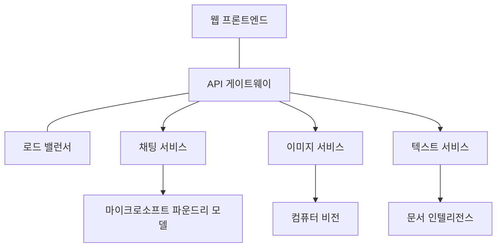

# AZD를 이용한 프로덕션 AI 워크로드 모범 사례

**챕터 탐색:**
- **📚 코스 홈**: [AZD For Beginners](../../README.md)
- **📖 현재 챕터**: 챕터 8 - 프로덕션 및 엔터프라이즈 패턴
- **⬅️ 이전 챕터**: [챕터 7: 문제해결](../chapter-07-troubleshooting/debugging.md)
- **⬅️ 관련 자료**: [AI Workshop Lab](ai-workshop-lab.md)
- **🎯 코스 완료**: [AZD For Beginners](../../README.md)

## 개요

이 가이드는 Azure Developer CLI(AZD)를 사용하여 프로덕션 준비가 된 AI 워크로드를 배포하기 위한 종합적인 모범 사례를 제공합니다. Microsoft Foundry Discord 커뮤니티의 피드백과 실제 고객 배포 사례를 바탕으로, 이 권장사항들은 프로덕션 AI 시스템에서 가장 흔히 발생하는 문제들을 다룹니다.

## 해결해야 할 주요 과제

커뮤니티 설문 결과를 기반으로, 개발자들이 직면한 주요 과제는 다음과 같습니다:

- <strong>45%</strong>는 다중 서비스 AI 배포에 어려움이 있음
- <strong>38%</strong>는 자격 증명 및 비밀 관리에 문제를 겪음  
- <strong>35%</strong>는 프로덕션 준비 및 확장에 어려움을 느낌
- <strong>32%</strong>는 비용 최적화 전략이 필요함
- <strong>29%</strong>는 모니터링 및 문제해결 개선이 필요함

## 프로덕션 AI 아키텍처 패턴

### 패턴 1: 마이크로서비스 AI 아키텍처

**사용 시기**: 여러 기능을 가진 복잡한 AI 애플리케이션


**AZD 구현**:

```yaml
# azure.yaml
name: enterprise-ai-platform
services:
  web:
    project: ./web
    host: staticwebapp
  api-gateway:
    project: ./api-gateway
    host: containerapp
  chat-service:
    project: ./services/chat
    host: containerapp
  vision-service:
    project: ./services/vision
    host: containerapp
  text-service:
    project: ./services/text
    host: containerapp
```

### 패턴 2: 이벤트 기반 AI 처리

**사용 시기**: 배치 처리, 문서 분석, 비동기 워크플로

```bicep
// Event Hub for AI processing pipeline
resource eventHub 'Microsoft.EventHub/namespaces@2023-01-01-preview' = {
  name: eventHubNamespaceName
  location: location
  sku: {
    name: 'Standard'
    tier: 'Standard'
    capacity: 1
  }
}

// Service Bus for reliable message processing
resource serviceBus 'Microsoft.ServiceBus/namespaces@2022-10-01-preview' = {
  name: serviceBusNamespaceName
  location: location
  sku: {
    name: 'Premium'
    tier: 'Premium'
    capacity: 1
  }
}

// Function App for processing
resource functionApp 'Microsoft.Web/sites@2023-01-01' = {
  name: functionAppName
  location: location
  kind: 'functionapp,linux'
  properties: {
    siteConfig: {
      appSettings: [
        {
          name: 'FUNCTIONS_EXTENSION_VERSION'
          value: '~4'
        }
        {
          name: 'AZURE_OPENAI_ENDPOINT'
          value: '@Microsoft.KeyVault(VaultName=${keyVault.name};SecretName=openai-endpoint)'
        }
      ]
    }
  }
}
```

## AI 에이전트 상태(헬스)에 대한 사고

전통적인 웹 앱이 깨지면 증상은 익숙합니다: 페이지가 로드되지 않거나, API가 오류를 반환하거나, 배포가 실패합니다. AI 기반 애플리케이션도 그런 방식으로 실패할 수 있지만, 명확한 오류 메시지를 생성하지 않는 더 미묘한 방식으로 오작동할 수도 있습니다.

이 섹션은 AI 워크로드를 모니터링하기 위한 사고 모델을 구축하는 데 도움을 주어 문제가 있을 때 어디를 봐야 할지 알 수 있게 합니다.

### 에이전트 상태가 전통적인 앱 상태와 다른 점

전통적인 앱은 제대로 작동하거나 작동하지 않습니다. AI 에이전트는 작동하는 것처럼 보이지만 품질이 낮은 결과를 생성할 수 있습니다. 에이전트 상태는 두 개의 레이어로 생각하세요:

| 레이어 | 관찰 포인트 | 어디를 볼 것인가 |
|-------|--------------|---------------|
| **인프라 상태** | 서비스가 실행 중인가? 리소스가 프로비저닝되었는가? 엔드포인트에 접근 가능한가? | `azd monitor`, Azure Portal 리소스 상태, 컨테이너/앱 로그 |
| **동작 상태** | 에이전트가 정확하게 응답하는가? 응답이 적시에 이루어지는가? 모델이 올바르게 호출되고 있는가? | Application Insights 추적, 모델 호출 지연 시간 메트릭, 응답 품질 로그 |

인프라 상태는 익숙한 항목입니다—모든 azd 앱에 동일합니다. 동작 상태는 AI 워크로드가 도입하는 새로운 레이어입니다.

### AI 앱이 예상대로 작동하지 않을 때 어디를 볼 것인가

AI 애플리케이션이 기대하는 결과를 내지 못할 경우, 다음 개념적 체크리스트를 따르세요:

1. **기본부터 확인하세요.** 앱이 실행 중인가요? 종속성에 도달할 수 있나요? 다른 앱에서 하듯 `azd monitor`와 리소스 상태를 확인하세요.
2. **모델 연결을 확인하세요.** 애플리케이션이 AI 모델을 제대로 호출하고 있나요? 실패하거나 시간초과된 모델 호출은 AI 앱 문제의 가장 흔한 원인이며 애플리케이션 로그에 나타납니다.
3. **모델이 받은 내용을 확인하세요.** AI 응답은 입력(프롬프트와 검색된 컨텍스트)에 따라 달라집니다. 출력이 잘못되었다면 입력이 대개 잘못된 경우가 많습니다. 애플리케이션이 모델에 올바른 데이터를 보내고 있는지 확인하세요.
4. **응답 지연 시간을 검토하세요.** AI 모델 호출은 일반 API 호출보다 느립니다. 앱이 느리게 느껴진다면 모델 응답 시간이 증가했는지 확인하세요—이는 스로틀링, 용량 한계 또는 리전 수준 혼잡을 나타낼 수 있습니다.
5. **비용 신호를 주시하세요.** 토큰 사용량이나 API 호출의 예상치 못한 급증은 루프, 잘못 구성된 프롬프트 또는 과도한 재시도를 나타낼 수 있습니다.

관찰 도구를 바로 마스터할 필요는 없습니다. 핵심 요점은 AI 애플리케이션은 모니터링해야 할 추가적인 동작 레이어가 있으며, azd의 내장 모니터링(`azd monitor`)이 양 레이어를 조사할 수 있는 출발점을 제공한다는 것입니다.

---

## 보안 모범 사례

### 1. 제로 트러스트 보안 모델

**구현 전략**:
- 인증 없는 서비스 간 통신 금지
- 모든 API 호출에 관리형 ID 사용
- 프라이빗 엔드포인트를 통한 네트워크 분리
- 최소 권한 접근 제어

```bicep
// Managed Identity for each service
resource chatServiceIdentity 'Microsoft.ManagedIdentity/userAssignedIdentities@2023-01-31' = {
  name: 'chat-service-identity'
  location: location
}

// Role assignments with minimal permissions
resource openAIUserRole 'Microsoft.Authorization/roleAssignments@2022-04-01' = {
  scope: openAIAccount
  name: guid(openAIAccount.id, chatServiceIdentity.id, openAIUserRoleDefinitionId)
  properties: {
    roleDefinitionId: subscriptionResourceId('Microsoft.Authorization/roleDefinitions', '5e0bd9bd-7b93-4f28-af87-19fc36ad61bd')
    principalId: chatServiceIdentity.properties.principalId
    principalType: 'ServicePrincipal'
  }
}
```

### 2. 안전한 비밀 관리

**Key Vault 통합 패턴**:

```bicep
// Key Vault with proper access policies
resource keyVault 'Microsoft.KeyVault/vaults@2023-02-01' = {
  name: keyVaultName
  location: location
  properties: {
    tenantId: tenant().tenantId
    sku: {
      family: 'A'
      name: 'premium'  // Use premium for production
    }
    enableRbacAuthorization: true  // Use RBAC instead of access policies
    enablePurgeProtection: true    // Prevent accidental deletion
    enableSoftDelete: true
    softDeleteRetentionInDays: 90
  }
}

// Store all AI service credentials
resource openAIKeySecret 'Microsoft.KeyVault/vaults/secrets@2023-02-01' = {
  parent: keyVault
  name: 'openai-api-key'
  properties: {
    value: openAIAccount.listKeys().key1
    attributes: {
      enabled: true
    }
  }
}
```

### 3. 네트워크 보안

**프라이빗 엔드포인트 구성**:

```bicep
// Virtual Network for AI services
resource virtualNetwork 'Microsoft.Network/virtualNetworks@2023-04-01' = {
  name: vnetName
  location: location
  properties: {
    addressSpace: {
      addressPrefixes: ['10.0.0.0/16']
    }
    subnets: [
      {
        name: 'ai-services-subnet'
        properties: {
          addressPrefix: '10.0.1.0/24'
          privateEndpointNetworkPolicies: 'Disabled'
        }
      }
      {
        name: 'app-services-subnet'
        properties: {
          addressPrefix: '10.0.2.0/24'
          delegations: [
            {
              name: 'Microsoft.Web/serverFarms'
              properties: {
                serviceName: 'Microsoft.Web/serverFarms'
              }
            }
          ]
        }
      }
    ]
  }
}

// Private endpoints for all AI services
resource openAIPrivateEndpoint 'Microsoft.Network/privateEndpoints@2023-04-01' = {
  name: '${openAIAccountName}-pe'
  location: location
  properties: {
    subnet: {
      id: virtualNetwork.properties.subnets[0].id
    }
    privateLinkServiceConnections: [
      {
        name: 'openai-connection'
        properties: {
          privateLinkServiceId: openAIAccount.id
          groupIds: ['account']
        }
      }
    ]
  }
}
```

## 성능 및 확장

### 1. 자동 확장 전략

**컨테이너 앱 자동 확장**:

```bicep
resource containerApp 'Microsoft.App/containerApps@2023-05-01' = {
  name: containerAppName
  location: location
  properties: {
    configuration: {
      ingress: {
        external: true
        targetPort: 8000
        transport: 'http'
      }
    }
    template: {
      scale: {
        minReplicas: 2  // Always have 2 instances minimum
        maxReplicas: 50 // Scale up to 50 for high load
        rules: [
          {
            name: 'http-scaling'
            http: {
              metadata: {
                concurrentRequests: '20'  // Scale when >20 concurrent requests
              }
            }
          }
          {
            name: 'cpu-scaling'
            custom: {
              type: 'cpu'
              metadata: {
                type: 'Utilization'
                value: '70'  // Scale when CPU >70%
              }
            }
          }
        ]
      }
    }
  }
}
```

### 2. 캐싱 전략

**AI 응답을 위한 Redis 캐시**:

```bicep
// Redis Premium for production workloads
resource redisCache 'Microsoft.Cache/redis@2023-04-01' = {
  name: redisCacheName
  location: location
  properties: {
    sku: {
      name: 'Premium'
      family: 'P'
      capacity: 1
    }
    enableNonSslPort: false
    minimumTlsVersion: '1.2'
    redisConfiguration: {
      'maxmemory-policy': 'allkeys-lru'
    }
    // Enable clustering for high availability
    redisVersion: '6.0'
    shardCount: 2
  }
}

// Cache configuration in application
var cacheConnectionString = '${redisCache.properties.hostName}:6380,password=${redisCache.listKeys().primaryKey},ssl=True,abortConnect=False'
```

### 3. 로드 밸런싱 및 트래픽 관리

**WAF가 적용된 Application Gateway**:

```bicep
// Application Gateway with Web Application Firewall
resource applicationGateway 'Microsoft.Network/applicationGateways@2023-04-01' = {
  name: appGatewayName
  location: location
  properties: {
    sku: {
      name: 'WAF_v2'
      tier: 'WAF_v2'
      capacity: 2
    }
    webApplicationFirewallConfiguration: {
      enabled: true
      firewallMode: 'Prevention'
      ruleSetType: 'OWASP'
      ruleSetVersion: '3.2'
    }
    // Backend pools for AI services
    backendAddressPools: [
      {
        name: 'ai-services-pool'
        properties: {
          backendAddresses: [
            {
              fqdn: '${containerApp.properties.configuration.ingress.fqdn}'
            }
          ]
        }
      }
    ]
  }
}
```

## 💰 비용 최적화

### 1. 리소스 적정 크기 지정

**환경별 구성**:

```bash
# 개발 환경
azd env new development
azd env set AZURE_OPENAI_SKU "S0"
azd env set AZURE_OPENAI_CAPACITY 10
azd env set AZURE_SEARCH_SKU "basic"
azd env set CONTAINER_CPU 0.5
azd env set CONTAINER_MEMORY 1.0

# 운영 환경
azd env new production
azd env set AZURE_OPENAI_SKU "S0"
azd env set AZURE_OPENAI_CAPACITY 100
azd env set AZURE_SEARCH_SKU "standard"
azd env set CONTAINER_CPU 2.0
azd env set CONTAINER_MEMORY 4.0
```

### 2. 비용 모니터링 및 예산

```bicep
// Cost management and budgets
resource budget 'Microsoft.Consumption/budgets@2023-05-01' = {
  name: 'ai-workload-budget'
  properties: {
    timePeriod: {
      startDate: '2024-01-01'
      endDate: '2024-12-31'
    }
    timeGrain: 'Monthly'
    amount: 2000  // $2000 monthly budget
    category: 'Cost'
    notifications: {
      warning: {
        enabled: true
        operator: 'GreaterThan'
        threshold: 80
        contactEmails: [
          'finance@company.com'
          'engineering@company.com'
        ]
        contactRoles: [
          'Owner'
          'Contributor'
        ]
      }
      critical: {
        enabled: true
        operator: 'GreaterThan'
        threshold: 95
        contactEmails: [
          'cto@company.com'
        ]
      }
    }
  }
}
```

### 3. 토큰 사용 최적화

**OpenAI 비용 관리**:

```typescript
// 애플리케이션 수준 토큰 최적화
class TokenOptimizer {
  private readonly maxTokens = 4000;
  private readonly reserveTokens = 500;
  
  optimizePrompt(userInput: string, context: string): string {
    const availableTokens = this.maxTokens - this.reserveTokens;
    const estimatedTokens = this.estimateTokens(userInput + context);
    
    if (estimatedTokens > availableTokens) {
      // 컨텍스트는 축소하되 사용자 입력은 자르지 마세요
      context = this.truncateContext(context, availableTokens - this.estimateTokens(userInput));
    }
    
    return `${context}\n\nUser: ${userInput}`;
  }
  
  private estimateTokens(text: string): number {
    // 대략적인 추정: 1 토큰 ≈ 4자
    return Math.ceil(text.length / 4);
  }
}
```

## 모니터링 및 관측성

### 1. 종합적인 Application Insights

```bicep
// Application Insights with advanced features
resource applicationInsights 'Microsoft.Insights/components@2020-02-02' = {
  name: applicationInsightsName
  location: location
  kind: 'web'
  properties: {
    Application_Type: 'web'
    WorkspaceResourceId: logAnalyticsWorkspace.id
    SamplingPercentage: 100  // Full sampling for AI apps
    DisableIpMasking: false  // Enable for security
  }
}

// Custom metrics for AI operations
resource aiMetricAlerts 'Microsoft.Insights/metricAlerts@2018-03-01' = {
  name: 'ai-high-error-rate'
  location: 'global'
  properties: {
    description: 'Alert when AI service error rate is high'
    severity: 2
    enabled: true
    scopes: [
      applicationInsights.id
    ]
    evaluationFrequency: 'PT1M'
    windowSize: 'PT5M'
    criteria: {
      'odata.type': 'Microsoft.Azure.Monitor.SingleResourceMultipleMetricCriteria'
      allOf: [
        {
          name: 'high-error-rate'
          metricName: 'requests/failed'
          operator: 'GreaterThan'
          threshold: 10
          timeAggregation: 'Count'
        }
      ]
    }
  }
}
```

### 2. AI 전용 모니터링

**AI 메트릭을 위한 커스텀 대시보드**:

```json
// Dashboard configuration for AI workloads
{
  "dashboard": {
    "name": "AI Application Monitoring",
    "tiles": [
      {
        "name": "OpenAI Request Volume",
        "query": "requests | where name contains 'openai' | summarize count() by bin(timestamp, 5m)"
      },
      {
        "name": "AI Response Latency",
        "query": "requests | where name contains 'openai' | summarize avg(duration) by bin(timestamp, 5m)"
      },
      {
        "name": "Token Usage",
        "query": "customMetrics | where name == 'openai_tokens_used' | summarize sum(value) by bin(timestamp, 1h)"
      },
      {
        "name": "Cost per Hour",
        "query": "customMetrics | where name == 'openai_cost' | summarize sum(value) by bin(timestamp, 1h)"
      }
    ]
  }
}
```

### 3. 상태 검사 및 가동 시간 모니터링

```bicep
// Application Insights availability tests
resource availabilityTest 'Microsoft.Insights/webtests@2022-06-15' = {
  name: 'ai-app-availability-test'
  location: location
  tags: {
    'hidden-link:${applicationInsights.id}': 'Resource'
  }
  properties: {
    SyntheticMonitorId: 'ai-app-availability-test'
    Name: 'AI Application Availability Test'
    Description: 'Tests AI application endpoints'
    Enabled: true
    Frequency: 300  // 5 minutes
    Timeout: 120    // 2 minutes
    Kind: 'ping'
    Locations: [
      {
        Id: 'us-east-2-azr'
      }
      {
        Id: 'us-west-2-azr'
      }
    ]
    Configuration: {
      WebTest: '''
        <WebTest Name="AI Health Check" 
                 Id="8d2de8d2-a2b0-4c2e-9a0d-8f9c9a0b8c8d" 
                 Enabled="True" 
                 CssProjectStructure="" 
                 CssIteration="" 
                 Timeout="120" 
                 WorkItemIds="" 
                 xmlns="http://microsoft.com/schemas/VisualStudio/TeamTest/2010" 
                 Description="" 
                 CredentialUserName="" 
                 CredentialPassword="" 
                 PreAuthenticate="True" 
                 Proxy="default" 
                 StopOnError="False" 
                 RecordedResultFile="" 
                 ResultsLocale="">
          <Items>
            <Request Method="GET" 
                     Guid="a5f10126-e4cd-570d-961c-cea43999a200" 
                     Version="1.1" 
                     Url="${webApp.properties.defaultHostName}/health" 
                     ThinkTime="0" 
                     Timeout="120" 
                     ParseDependentRequests="True" 
                     FollowRedirects="True" 
                     RecordResult="True" 
                     Cache="False" 
                     ResponseTimeGoal="0" 
                     Encoding="utf-8" 
                     ExpectedHttpStatusCode="200" 
                     ExpectedResponseUrl="" 
                     ReportingName="" 
                     IgnoreHttpStatusCode="False" />
          </Items>
        </WebTest>
      '''
    }
  }
}
```

## 재해 복구 및 고가용성

### 1. 멀티 리전 배포

```yaml
# azure.yaml - Multi-region configuration
name: ai-app-multiregion
services:
  api-primary:
    project: ./api
    host: containerapp
    env:
      - AZURE_REGION=eastus
  api-secondary:
    project: ./api
    host: containerapp
    env:
      - AZURE_REGION=westus2
```

```bicep
// Traffic Manager for global load balancing
resource trafficManager 'Microsoft.Network/trafficManagerProfiles@2022-04-01' = {
  name: trafficManagerProfileName
  location: 'global'
  properties: {
    profileStatus: 'Enabled'
    trafficRoutingMethod: 'Priority'
    dnsConfig: {
      relativeName: trafficManagerProfileName
      ttl: 30
    }
    monitorConfig: {
      protocol: 'HTTPS'
      port: 443
      path: '/health'
      intervalInSeconds: 30
      toleratedNumberOfFailures: 3
      timeoutInSeconds: 10
    }
    endpoints: [
      {
        name: 'primary-endpoint'
        type: 'Microsoft.Network/trafficManagerProfiles/azureEndpoints'
        properties: {
          targetResourceId: primaryAppService.id
          endpointStatus: 'Enabled'
          priority: 1
        }
      }
      {
        name: 'secondary-endpoint'
        type: 'Microsoft.Network/trafficManagerProfiles/azureEndpoints'
        properties: {
          targetResourceId: secondaryAppService.id
          endpointStatus: 'Enabled'
          priority: 2
        }
      }
    ]
  }
}
```

### 2. 데이터 백업 및 복구

```bicep
// Backup configuration for critical data
resource backupVault 'Microsoft.DataProtection/backupVaults@2023-05-01' = {
  name: backupVaultName
  location: location
  identity: {
    type: 'SystemAssigned'
  }
  properties: {
    storageSettings: [
      {
        datastoreType: 'VaultStore'
        type: 'LocallyRedundant'
      }
    ]
  }
}

// Backup policy for AI models and data
resource backupPolicy 'Microsoft.DataProtection/backupVaults/backupPolicies@2023-05-01' = {
  parent: backupVault
  name: 'ai-data-backup-policy'
  properties: {
    policyRules: [
      {
        backupParameters: {
          backupType: 'Full'
          objectType: 'AzureBackupParams'
        }
        trigger: {
          schedule: {
            repeatingTimeIntervals: [
              'R/2024-01-01T02:00:00+00:00/P1D'  // Daily at 2 AM
            ]
          }
          objectType: 'ScheduleBasedTriggerContext'
        }
        dataStore: {
          datastoreType: 'VaultStore'
          objectType: 'DataStoreInfoBase'
        }
        name: 'BackupDaily'
        objectType: 'AzureBackupRule'
      }
    ]
  }
}
```

## DevOps 및 CI/CD 통합

### 1. GitHub Actions 워크플로

```yaml
# .github/workflows/deploy-ai-app.yml
name: Deploy AI Application

on:
  push:
    branches: [main]
  pull_request:
    branches: [main]

jobs:
  test:
    runs-on: ubuntu-latest
    steps:
      - uses: actions/checkout@v4
      
      - name: Setup Python
        uses: actions/setup-python@v4
        with:
          python-version: '3.11'
          
      - name: Install dependencies
        run: |
          pip install -r requirements.txt
          pip install pytest
          
      - name: Run tests
        run: pytest tests/
        
      - name: AI Safety Tests
        run: |
          python scripts/test_ai_safety.py
          python scripts/validate_prompts.py

  deploy-staging:
    needs: test
    if: github.event_name == 'pull_request'
    runs-on: ubuntu-latest
    steps:
      - uses: actions/checkout@v4
      
      - name: Setup AZD
        uses: Azure/setup-azd@v2
        
      - name: Login to Azure
        uses: azure/login@v1
        with:
          creds: ${{ secrets.AZURE_CREDENTIALS }}
          
      - name: Deploy to Staging
        run: |
          azd env select staging
          azd deploy

  deploy-production:
    needs: test
    if: github.ref == 'refs/heads/main'
    runs-on: ubuntu-latest
    steps:
      - uses: actions/checkout@v4
      
      - name: Setup AZD
        uses: Azure/setup-azd@v2
        
      - name: Login to Azure
        uses: azure/login@v1
        with:
          creds: ${{ secrets.AZURE_CREDENTIALS }}
          
      - name: Deploy to Production
        run: |
          azd env select production
          azd deploy
          
      - name: Run Production Health Checks
        run: |
          python scripts/health_check.py --env production
```

### 2. 인프라 검증

```bash
# scripts/validate_infrastructure.sh
#!/bin/bash

echo "Validating AI infrastructure deployment..."

# 모든 필수 서비스가 실행 중인지 확인합니다
services=("openai" "search" "storage" "keyvault")
for service in "${services[@]}"; do
    echo "Checking $service..."
    if ! az resource list --resource-type "Microsoft.CognitiveServices/accounts" --query "[?contains(name, '$service')]" -o tsv; then
        echo "ERROR: $service not found"
        exit 1
    fi
done

# OpenAI 모델 배포를 검증합니다
echo "Validating OpenAI model deployments..."
models=$(az cognitiveservices account deployment list --name $AZURE_OPENAI_NAME --resource-group $AZURE_RESOURCE_GROUP --query "[].name" -o tsv)
if [[ ! $models == *"gpt-4.1-mini"* ]]; then
  echo "ERROR: Required model gpt-4.1-mini not deployed"
    exit 1
fi

# AI 서비스 연결을 테스트합니다
echo "Testing AI service connectivity..."
python scripts/test_connectivity.py

echo "Infrastructure validation completed successfully!"
```

## 프로덕션 준비 체크리스트

### 보안 ✅
- [ ] 모든 서비스가 관리형 ID 사용
- [ ] 비밀이 Key Vault에 저장됨
- [ ] 프라이빗 엔드포인트 구성됨
- [ ] 네트워크 보안 그룹 구현됨
- [ ] 최소 권한의 RBAC
- [ ] 퍼블릭 엔드포인트에 WAF 적용됨

### 성능 ✅
- [ ] 자동 확장 구성됨
- [ ] 캐싱 구현됨
- [ ] 로드 밸런싱 설정됨
- [ ] 정적 콘텐츠에 대한 CDN
- [ ] 데이터베이스 연결 풀링
- [ ] 토큰 사용 최적화

### 모니터링 ✅
- [ ] Application Insights 구성됨
- [ ] 커스텀 메트릭 정의됨
- [ ] 경보 규칙 설정됨
- [ ] 대시보드 생성됨
- [ ] 상태 검사 구현됨
- [ ] 로그 보존 정책

### 안정성 ✅
- [ ] 멀티 리전 배포
- [ ] 백업 및 복구 계획
- [ ] 회로 차단기 구현
- [ ] 재시도 정책 구성
- [ ] 점진적 성능 저하(graceful degradation)
- [ ] 상태 검사 엔드포인트

### 비용 관리 ✅
- [ ] 예산 경보 구성됨
- [ ] 리소스 적정 크기 지정
- [ ] 개발/테스트 할인 적용
- [ ] 예약 인스턴스 구매
- [ ] 비용 모니터링 대시보드
- [ ] 정기 비용 검토

### 규정 준수 ✅
- [ ] 데이터 거주 요건 충족
- [ ] 감사 로깅 활성화
- [ ] 규정 준수 정책 적용
- [ ] 보안 베이스라인 구현
- [ ] 정기 보안 평가
- [ ] 사고 대응 계획

## 성능 벤치마크

### 일반적인 프로덕션 메트릭

| 메트릭 | 목표 | 모니터링 |
|--------|--------|------------|
| **응답 시간** | < 2초 | Application Insights |
| <strong>가용성</strong> | 99.9% | 가동 시간 모니터링 |
| <strong>오류율</strong> | < 0.1% | 애플리케이션 로그 |
| **토큰 사용** | < $500/month | 비용 관리 |
| **동시 사용자** | 1000+ | 부하 테스트 |
| **복구 시간** | < 1시간 | 재해 복구 테스트 |

### 부하 테스트

```bash
# AI 애플리케이션을 위한 부하 테스트 스크립트
python scripts/load_test.py \
  --endpoint https://your-ai-app.azurewebsites.net \
  --concurrent-users 100 \
  --duration 300 \
  --ramp-up 60
```

## 🤝 커뮤니티 모범 사례

Microsoft Foundry Discord 커뮤니티 피드백을 기반으로:

### 커뮤니티의 주요 권장사항:

1. **작게 시작하고 점진적으로 확장하세요**: 기본 SKU로 시작하고 실제 사용량에 따라 확장하세요
2. **모든 것을 모니터링하세요**: 첫날부터 종합적인 모니터링을 설정하세요
3. **보안을 자동화하세요**: 일관된 보안을 위해 인프라를 코드로 관리하세요
4. **철저히 테스트하세요**: 파이프라인에 AI 전용 테스트를 포함하세요
5. **비용을 계획하세요**: 토큰 사용을 모니터링하고 초기에 예산 경보를 설정하세요

### 피해야 할 일반적인 실수:

- ❌ 코드에 API 키 하드코딩
- ❌ 적절한 모니터링 설정 안 함
- ❌ 비용 최적화 무시
- ❌ 실패 시나리오 테스트 안 함
- ❌ 상태 검사 없이 배포

## AZD AI CLI 명령 및 확장

AZD에는 프로덕션 AI 워크플로를 간소화하는 AI 전용 명령 및 확장 기능 세트가 점점 더 추가되고 있습니다. 이러한 도구들은 로컬 개발과 AI 워크로드의 프로덕션 배포 간 격차를 연결합니다.

### AI용 AZD 확장

AZD는 AI 전용 기능을 추가하기 위한 확장 시스템을 사용합니다. 확장을 설치하고 관리하려면:

```bash
# 사용 가능한 모든 확장(인공지능 포함) 나열
azd extension list

# 설치된 확장 세부 정보 확인
azd extension show azure.ai.agents

# Foundry agents 확장 설치
azd extension install azure.ai.agents

# 파인튜닝 확장 설치
azd extension install azure.ai.finetune

# 사용자 정의 모델 확장 설치
azd extension install azure.ai.models

# 설치된 모든 확장 업그레이드
azd extension upgrade --all
```

**사용 가능한 AI 확장:**

| 확장 | 목적 | 상태 |
|-----------|---------|--------|
| `azure.ai.agents` | Foundry Agent Service 관리 | 미리보기 |
| `azure.ai.finetune` | Foundry 모델 미세조정 | 미리보기 |
| `azure.ai.models` | Foundry 커스텀 모델 | 미리보기 |
| `azure.coding-agent` | 코딩 에이전트 구성 | 사용 가능 |

### `azd ai agent init`으로 에이전트 프로젝트 초기화

`azd ai agent init` 명령은 Microsoft Foundry Agent Service와 통합된 프로덕션 준비가 된 AI 에이전트 프로젝트의 스캐폴드를 생성합니다:

```bash
# 에이전트 매니페스트에서 새 에이전트 프로젝트를 초기화합니다
azd ai agent init -m <manifest-path-or-uri>

# 특정 Foundry 프로젝트를 초기화하고 대상으로 설정합니다
azd ai agent init -m agent-manifest.yaml --project-id <foundry-project-id>

# 사용자 지정 소스 디렉터리로 초기화합니다
azd ai agent init -m agent-manifest.yaml --src ./agents/my-agent

# Container Apps를 호스트로 설정합니다
azd ai agent init -m agent-manifest.yaml --host containerapp
```

**주요 플래그:**

| 플래그 | 설명 |
|------|-------------|
| `-m, --manifest` | 프로젝트에 추가할 에이전트 매니페스트의 경로 또는 URI |
| `-p, --project-id` | azd 환경에 사용할 기존 Microsoft Foundry Project ID |
| `-s, --src` | 에이전트 정의를 다운로드할 디렉터리(기본값: `src/<agent-id>`) |
| `--host` | 기본 호스트 재정의(예: `containerapp`) |
| `-e, --environment` | 사용할 azd 환경 |

**프로덕션 팁**: `--project-id`를 사용하여 기존 Foundry 프로젝트에 직접 연결하면 에이전트 코드와 클라우드 리소스를 처음부터 연결된 상태로 유지할 수 있습니다.

### `azd mcp`를 통한 모델 컨텍스트 프로토콜(MCP)

AZD에는 AI 에이전트와 도구가 표준화된 프로토콜을 통해 Azure 리소스와 상호작용할 수 있게 하는 내장 MCP 서버 지원(Alpha)이 포함되어 있습니다:

```bash
# 프로젝트의 MCP 서버를 시작합니다
azd mcp start

# 도구 실행을 위한 현재 Copilot 동의 규칙을 검토합니다
azd copilot consent list
```

MCP 서버는 azd 프로젝트 컨텍스트—환경, 서비스, Azure 리소스—를 AI 기반 개발 도구에 노출합니다. 이를 통해 다음이 가능합니다:

- **AI 지원 배포**: 코딩 에이전트가 프로젝트 상태를 조회하고 배포를 트리거할 수 있음
- **리소스 탐색**: AI 도구가 프로젝트에서 사용하는 Azure 리소스를 발견할 수 있음
- **환경 관리**: 에이전트가 dev/staging/production 환경 간 전환 가능

### `azd infra generate`로 인프라 생성

프로덕션 AI 워크로드의 경우 자동 프로비저닝에만 의존하지 않고 인프라스트럭처를 코드로 생성하고 사용자 정의할 수 있습니다:

```bash
# 프로젝트 정의에서 Bicep/Terraform 파일을 생성합니다
azd infra generate
```

이 명령은 IaC를 디스크에 기록하므로 다음을 수행할 수 있습니다:
- 배포 전에 인프라를 검토하고 감사
- 맞춤형 보안 정책 추가(네트워크 규칙, 프라이빗 엔드포인트)
- 기존 IaC 검토 프로세스와 통합
- 애플리케이션 코드와 별도로 인프라 변경을 버전 관리

### 프로덕션 라이프사이클 훅

AZD 훅을 사용하면 배포 라이프사이클의 모든 단계에 커스텀 로직을 주입할 수 있습니다—프로덕션 AI 워크플로에 필수적입니다:

```yaml
# azure.yaml - Production hooks example
name: ai-production-app
hooks:
  preprovision:
    shell: sh
    run: scripts/validate-quotas.sh    # Check AI model quota before provisioning
  postprovision:
    shell: sh
    run: scripts/configure-networking.sh  # Set up private endpoints
  predeploy:
    shell: sh
    run: scripts/run-ai-safety-tests.sh  # Run prompt safety checks
  postdeploy:
    shell: sh
    run: scripts/smoke-test.sh           # Verify agent responses post-deploy
services:
  agent-api:
    project: ./src/agent
    host: containerapp
    hooks:
      predeploy:
        shell: sh
        run: scripts/validate-model-access.sh  # Per-service hook
```

```bash
# 개발 중 특정 훅을 수동으로 실행하기
azd hooks run predeploy
```

**AI 워크로드를 위한 권장 프로덕션 훅:**

| 훅 | 사용 사례 |
|------|----------|
| `preprovision` | AI 모델 용량을 위한 구독 할당량 검증 |
| `postprovision` | 프라이빗 엔드포인트 구성, 모델 웨이트 배포 |
| `predeploy` | AI 안전성 테스트 실행, 프롬프트 템플릿 검증 |
| `postdeploy` | 에이전트 응답 스모크 테스트, 모델 연결성 확인 |

### CI/CD 파이프라인 구성

`azd pipeline config`를 사용하여 프로젝트를 GitHub Actions나 Azure Pipelines에 안전한 Azure 인증과 함께 연결하세요:

```bash
# CI/CD 파이프라인 구성 (대화형)
azd pipeline config

# 특정 제공업체로 구성
azd pipeline config --provider github
```

이 명령은:
- 최소 권한 접근을 가진 서비스 프린시펄 생성
- 연동 자격 증명 구성(저장된 비밀 없음)
- 파이프라인 정의 파일 생성 또는 업데이트
- CI/CD 시스템에 필요한 환경 변수를 설정

**파이프라인 구성으로 구현하는 프로덕션 워크플로:**

```bash
# 1. 프로덕션 환경을 설정합니다
azd env new production
azd env set AZURE_OPENAI_CAPACITY 100

# 2. 파이프라인을 구성합니다
azd pipeline config --provider github

# 3. 파이프라인은 main 브랜치로의 모든 푸시마다 azd deploy를 실행합니다
```

### `azd add`로 구성 요소 추가

기존 프로젝트에 Azure 서비스를 점진적으로 추가하세요:

```bash
# 대화형으로 새 서비스 구성 요소를 추가
azd add
```

이는 예를 들어 벡터 검색 서비스, 새로운 에이전트 엔드포인트 또는 기존 배포에 모니터링 구성요소를 추가하는 등 프로덕션 AI 애플리케이션을 확장하는 데 특히 유용합니다.

## 추가 리소스
- **Azure Well-Architected Framework**: [AI 워크로드 안내](https://learn.microsoft.com/azure/well-architected/ai/)
- **Microsoft Foundry Documentation**: [공식 문서](https://learn.microsoft.com/azure/ai-studio/)
- **커뮤니티 템플릿**: [Azure Samples](https://github.com/Azure-Samples)
- **Discord 커뮤니티**: [#Azure 채널](https://discord.gg/microsoft-azure)
- **Azure용 에이전트 스킬**: [microsoft/github-copilot-for-azure on skills.sh](https://skills.sh/microsoft/github-copilot-for-azure) - Azure AI, Foundry, 배포, 비용 최적화 및 진단을 위한 37개의 오픈 에이전트 스킬. 에디터에 설치:
  ```bash
  npx skills add microsoft/github-copilot-for-azure
  ```

---

**챕터 네비게이션:**
- **📚 코스 홈**: [AZD For Beginners](../../README.md)
- **📖 현재 챕터**: 챕터 8 - 프로덕션 및 엔터프라이즈 패턴
- **⬅️ 이전 챕터**: [챕터 7: 문제 해결](../chapter-07-troubleshooting/debugging.md)
- **⬅️ 또한 관련**: [AI 워크숍 실습](ai-workshop-lab.md)
- **� 코스 완료**: [AZD For Beginners](../../README.md)

<strong>기억하세요</strong>: 프로덕션 AI 워크로드는 신중한 기획, 모니터링 및 지속적인 최적화가 필요합니다. 이러한 패턴으로 시작하여 특정 요구사항에 맞게 조정하십시오.

---

<!-- CO-OP TRANSLATOR DISCLAIMER START -->
**면책 고지**:
이 문서는 AI 번역 서비스 [Co-op Translator](https://github.com/Azure/co-op-translator)를 사용하여 번역되었습니다. 정확성을 위해 노력하고 있으나 자동 번역에는 오류나 부정확성이 포함될 수 있음을 알려드립니다. 원문(원어) 문서는 권위 있는 출처로 간주되어야 합니다. 중요한 정보의 경우 전문적인 인간 번역을 권장합니다. 본 번역의 사용으로 인해 발생하는 모든 오해나 잘못된 해석에 대해서 당사는 책임을 지지 않습니다.
<!-- CO-OP TRANSLATOR DISCLAIMER END -->