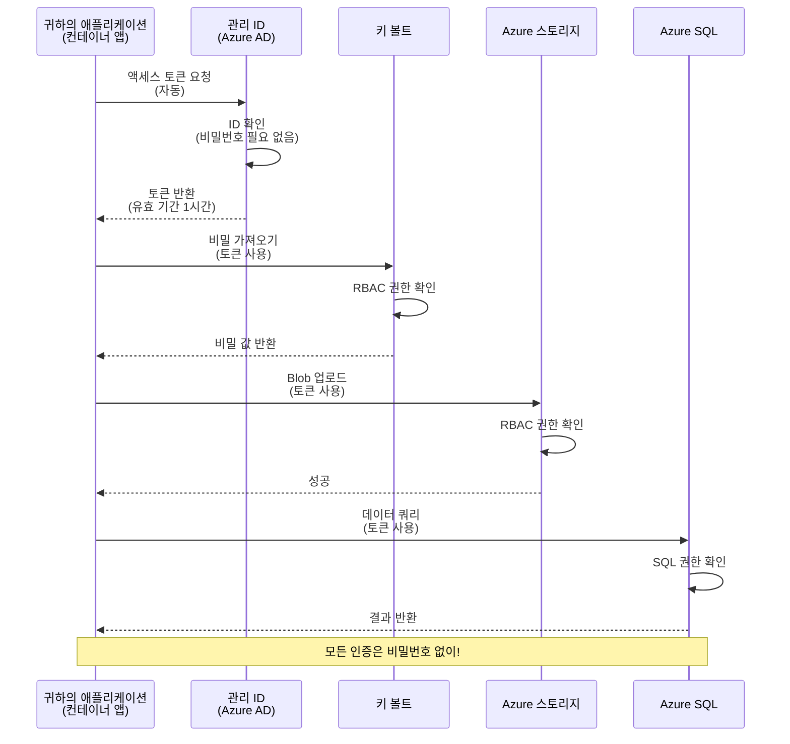

<!--
CO_OP_TRANSLATOR_METADATA:
{
  "original_hash": "e13ff6e1197e0a7462ed0aede7df9f23",
  "translation_date": "2025-11-19T22:10:42+00:00",
  "source_file": "docs/getting-started/authsecurity.md",
  "language_code": "ko"
}
-->
# 인증 패턴과 관리 ID

⏱️ **예상 소요 시간**: 45-60분 | 💰 **비용 영향**: 무료 (추가 요금 없음) | ⭐ **난이도**: 중급

**📚 학습 경로:**
- ← 이전: [구성 관리](configuration.md) - 환경 변수와 비밀 관리
- 🎯 **현재 위치**: 인증 및 보안 (관리 ID, Key Vault, 보안 패턴)
- → 다음: [첫 번째 프로젝트](first-project.md) - 첫 AZD 애플리케이션 빌드
- 🏠 [코스 홈](../../README.md)

---

## 학습 목표

이 강의를 완료하면 다음을 배울 수 있습니다:
- Azure 인증 패턴 이해 (키, 연결 문자열, 관리 ID)
- **관리 ID**를 사용한 비밀번호 없는 인증 구현
- **Azure Key Vault** 통합으로 비밀 보호
- AZD 배포를 위한 **역할 기반 액세스 제어(RBAC)** 구성
- 컨테이너 앱 및 Azure 서비스에서 보안 모범 사례 적용
- 키 기반 인증에서 ID 기반 인증으로 마이그레이션

## 관리 ID의 중요성

### 문제: 전통적인 인증 방식

**관리 ID 이전:**
```javascript
// ❌ 보안 위험: 코드에 하드코딩된 비밀
const connectionString = "Server=mydb.database.windows.net;User=admin;Password=P@ssw0rd123";
const storageKey = "xK7mN9pQ2wR5tY8uI0oP3aS6dF1gH4jK...";
const cosmosKey = "C2x7B9n4M1p8Q5w3E6r0T2y5U8i1O4p7...";
```

**문제점:**
- 🔴 코드, 구성 파일, 환경 변수에 **노출된 비밀**
- 🔴 **자격 증명 회전** 시 코드 변경 및 재배포 필요
- 🔴 **감사 악몽** - 누가 언제 무엇을 액세스했는지 추적 어려움
- 🔴 **분산** - 여러 시스템에 흩어진 비밀
- 🔴 **컴플라이언스 위험** - 보안 감사 실패

### 해결책: 관리 ID

**관리 ID 이후:**
```javascript
// ✅ 보안: 코드에 비밀 없음
const credential = new DefaultAzureCredential();
const client = new BlobServiceClient(
  "https://mystorageaccount.blob.core.windows.net",
  credential  // Azure는 인증을 자동으로 처리합니다
);
```

**장점:**
- ✅ 코드나 구성에 **비밀 없음**
- ✅ **자동 회전** - Azure에서 처리
- ✅ Azure AD 로그에서 **완전한 감사 기록**
- ✅ **중앙 집중식 보안** - Azure 포털에서 관리
- ✅ **컴플라이언스 준비 완료** - 보안 표준 충족

**비유**: 전통적인 인증은 여러 문을 위한 물리적 열쇠를 들고 다니는 것과 같습니다. 관리 ID는 보안 배지와 같아서 사용자의 신원에 따라 자동으로 액세스를 부여합니다. 열쇠를 잃어버리거나 복사하거나 회전할 필요가 없습니다.

---

## 아키텍처 개요

### 관리 ID를 사용한 인증 흐름


### 관리 ID의 유형

```mermaid
graph TB
    MI[관리되는 ID]
    SystemAssigned[시스템 할당 ID]
    UserAssigned[사용자 할당 ID]
    
    MI --> SystemAssigned
    MI --> UserAssigned
    
    SystemAssigned --> SA1[리소스와 수명 주기 연결]
    SystemAssigned --> SA2[자동 생성/삭제]
    SystemAssigned --> SA3[단일 리소스에 적합]
    
    UserAssigned --> UA1[독립적인 수명 주기]
    UserAssigned --> UA2[수동 생성/삭제]
    UserAssigned --> UA3[리소스 간 공유]
    
    style SystemAssigned fill:#2196F3,stroke:#1976D2,stroke-width:2px,color:#fff
    style UserAssigned fill:#4CAF50,stroke:#388E3C,stroke-width:2px,color:#fff
```


| 기능 | 시스템 할당 | 사용자 할당 |
|------|------------|------------|
| **수명 주기** | 리소스에 연결 | 독립적 |
| **생성** | 리소스와 함께 자동 생성 | 수동 생성 |
| **삭제** | 리소스 삭제 시 삭제 | 리소스 삭제 후에도 유지 |
| **공유** | 단일 리소스만 | 여러 리소스 |
| **사용 사례** | 간단한 시나리오 | 복잡한 다중 리소스 시나리오 |
| **AZD 기본값** | ✅ 권장 | 선택 사항 |

---

## 사전 준비 사항

### 필수 도구

이전 강의에서 이미 설치했어야 합니다:

```bash
# Azure Developer CLI 확인
azd version
# ✅ 예상: azd 버전 1.0.0 이상

# Azure CLI 확인
az --version
# ✅ 예상: azure-cli 2.50.0 이상
```

### Azure 요구 사항

- 활성 Azure 구독
- 다음 작업에 대한 권한:
  - 관리 ID 생성
  - RBAC 역할 할당
  - Key Vault 리소스 생성
  - 컨테이너 앱 배포

### 지식 요구 사항

다음을 완료했어야 합니다:
- [설치 가이드](installation.md) - AZD 설정
- [AZD 기본](azd-basics.md) - 핵심 개념
- [구성 관리](configuration.md) - 환경 변수

---

## 1강: 인증 패턴 이해하기

### 패턴 1: 연결 문자열 (레거시 - 사용 지양)

**작동 방식:**
```bash
# 연결 문자열에 자격 증명이 포함되어 있습니다
STORAGE_CONNECTION_STRING="DefaultEndpointsProtocol=https;AccountName=myaccount;AccountKey=xK7mN9pQ2wR5..."
COSMOS_CONNECTION_STRING="AccountEndpoint=https://myaccount.documents.azure.com:443/;AccountKey=C2x7..."
SQL_CONNECTION_STRING="Server=myserver.database.windows.net;User=admin;Password=P@ssw0rd..."
```

**문제점:**
- ❌ 환경 변수에 비밀 노출
- ❌ 배포 시스템에 기록됨
- ❌ 회전 어려움
- ❌ 액세스 감사 기록 없음

**사용 시점:** 로컬 개발에만 사용, 프로덕션에서는 절대 사용 금지.

---

### 패턴 2: Key Vault 참조 (더 나은 방법)

**작동 방식:**
```bicep
// Store secret in Key Vault
resource keyVault 'Microsoft.KeyVault/vaults@2023-02-01' = {
  name: 'mykv'
  properties: {
    enableRbacAuthorization: true
  }
}

// Reference in Container App
env: [
  {
    name: 'STORAGE_KEY'
    secretRef: 'storage-key'  // References Key Vault
  }
]
```

**장점:**
- ✅ Key Vault에 비밀 안전하게 저장
- ✅ 중앙 집중식 비밀 관리
- ✅ 코드 변경 없이 회전 가능

**제한 사항:**
- ⚠️ 여전히 키/비밀번호 사용
- ⚠️ Key Vault 액세스 관리 필요

**사용 시점:** 연결 문자열에서 관리 ID로 전환하는 중간 단계.

---

### 패턴 3: 관리 ID (최고의 모범 사례)

**작동 방식:**
```bicep
// Enable managed identity
resource containerApp 'Microsoft.App/containerApps@2023-05-01' = {
  name: 'myapp'
  identity: {
    type: 'SystemAssigned'  // Automatically creates identity
  }
}

// Grant permissions
resource roleAssignment 'Microsoft.Authorization/roleAssignments@2022-04-01' = {
  scope: storageAccount
  properties: {
    roleDefinitionId: storageBlobDataContributorRole
    principalId: containerApp.identity.principalId
  }
}
```

**애플리케이션 코드:**
```javascript
// 비밀은 필요하지 않습니다!
const { DefaultAzureCredential } = require('@azure/identity');
const { BlobServiceClient } = require('@azure/storage-blob');

const credential = new DefaultAzureCredential();
const blobServiceClient = new BlobServiceClient(
  'https://mystorageaccount.blob.core.windows.net',
  credential
);
```

**장점:**
- ✅ 코드/구성에 비밀 없음
- ✅ 자격 증명 자동 회전
- ✅ 완전한 감사 기록
- ✅ RBAC 기반 권한
- ✅ 컴플라이언스 준비 완료

**사용 시점:** 항상, 프로덕션 애플리케이션에 사용.

---

## 2강: AZD로 관리 ID 구현하기

### 단계별 구현

관리 ID를 사용하여 Azure Storage와 Key Vault에 액세스하는 보안 컨테이너 앱을 만들어 봅시다.

### 프로젝트 구조

```
secure-app/
├── azure.yaml                 # AZD configuration
├── infra/
│   ├── main.bicep            # Main infrastructure
│   ├── core/
│   │   ├── identity.bicep    # Managed identity setup
│   │   ├── keyvault.bicep    # Key Vault configuration
│   │   └── storage.bicep     # Storage with RBAC
│   └── app/
│       └── container-app.bicep
└── src/
    ├── app.js                # Application code
    ├── package.json
    └── Dockerfile
```

### 1. AZD 구성 (azure.yaml)

```yaml
name: secure-app
metadata:
  template: secure-app@1.0.0

services:
  api:
    project: ./src
    language: js
    host: containerapp

# Enable managed identity (AZD handles this automatically)
```

### 2. 인프라: 관리 ID 활성화

**파일: `infra/main.bicep`**

```bicep
targetScope = 'subscription'

param environmentName string
param location string = 'eastus'

var tags = { 'azd-env-name': environmentName }

// Resource group
resource rg 'Microsoft.Resources/resourceGroups@2021-04-01' = {
  name: 'rg-${environmentName}'
  location: location
  tags: tags
}

// Storage Account
module storage './core/storage.bicep' = {
  name: 'storage'
  scope: rg
  params: {
    name: 'st${uniqueString(rg.id)}'
    location: location
    tags: tags
  }
}

// Key Vault
module keyVault './core/keyvault.bicep' = {
  name: 'keyvault'
  scope: rg
  params: {
    name: 'kv-${uniqueString(rg.id)}'
    location: location
    tags: tags
  }
}

// Container App with Managed Identity
module containerApp './app/container-app.bicep' = {
  name: 'container-app'
  scope: rg
  params: {
    name: 'ca-${environmentName}'
    location: location
    tags: tags
    storageAccountName: storage.outputs.name
    keyVaultName: keyVault.outputs.name
  }
}

// Grant Container App access to Storage
module storageRoleAssignment './core/role-assignment.bicep' = {
  name: 'storage-role'
  scope: rg
  params: {
    principalId: containerApp.outputs.identityPrincipalId
    roleDefinitionId: 'ba92f5b4-2d11-453d-a403-e96b0029c9fe'  // Storage Blob Data Contributor
    targetResourceId: storage.outputs.id
  }
}

// Grant Container App access to Key Vault
module kvRoleAssignment './core/role-assignment.bicep' = {
  name: 'kv-role'
  scope: rg
  params: {
    principalId: containerApp.outputs.identityPrincipalId
    roleDefinitionId: '4633458b-17de-408a-b874-0445c86b69e6'  // Key Vault Secrets User
    targetResourceId: keyVault.outputs.id
  }
}

// Outputs
output AZURE_STORAGE_ACCOUNT_NAME string = storage.outputs.name
output AZURE_KEY_VAULT_NAME string = keyVault.outputs.name
output APP_URL string = containerApp.outputs.url
```

### 3. 시스템 할당 ID가 있는 컨테이너 앱

**파일: `infra/app/container-app.bicep`**

```bicep
param name string
param location string
param tags object = {}
param storageAccountName string
param keyVaultName string

resource containerApp 'Microsoft.App/containerApps@2023-05-01' = {
  name: name
  location: location
  tags: tags
  identity: {
    type: 'SystemAssigned'  // 🔑 Enable managed identity
  }
  properties: {
    configuration: {
      ingress: {
        external: true
        targetPort: 3000
      }
    }
    template: {
      containers: [
        {
          name: 'api'
          image: 'myregistry.azurecr.io/api:latest'
          resources: {
            cpu: json('0.5')
            memory: '1Gi'
          }
          env: [
            {
              name: 'AZURE_STORAGE_ACCOUNT_NAME'
              value: storageAccountName
            }
            {
              name: 'AZURE_KEY_VAULT_NAME'
              value: keyVaultName
            }
            // 🔑 No secrets - managed identity handles authentication!
          ]
        }
      ]
    }
  }
}

// Output the identity for RBAC assignments
output identityPrincipalId string = containerApp.identity.principalId
output id string = containerApp.id
output url string = 'https://${containerApp.properties.configuration.ingress.fqdn}'
```

### 4. RBAC 역할 할당 모듈

**파일: `infra/core/role-assignment.bicep`**

```bicep
param principalId string
param roleDefinitionId string  // Azure built-in role ID
param targetResourceId string

resource roleAssignment 'Microsoft.Authorization/roleAssignments@2022-04-01' = {
  name: guid(principalId, roleDefinitionId, targetResourceId)
  scope: resourceId('Microsoft.Resources/resourceGroups', resourceGroup().name)
  properties: {
    roleDefinitionId: subscriptionResourceId('Microsoft.Authorization/roleDefinitions', roleDefinitionId)
    principalId: principalId
    principalType: 'ServicePrincipal'
  }
}

output id string = roleAssignment.id
```

### 5. 관리 ID를 사용하는 애플리케이션 코드

**파일: `src/app.js`**

```javascript
const express = require('express');
const { DefaultAzureCredential } = require('@azure/identity');
const { BlobServiceClient } = require('@azure/storage-blob');
const { SecretClient } = require('@azure/keyvault-secrets');

const app = express();
const PORT = process.env.PORT || 3000;

// 🔑 자격 증명 초기화 (관리되는 ID로 자동 작동)
const credential = new DefaultAzureCredential();

// Azure Storage 설정
const storageAccountName = process.env.AZURE_STORAGE_ACCOUNT_NAME;
const blobServiceClient = new BlobServiceClient(
  `https://${storageAccountName}.blob.core.windows.net`,
  credential  // 키가 필요하지 않습니다!
);

// Key Vault 설정
const keyVaultName = process.env.AZURE_KEY_VAULT_NAME;
const secretClient = new SecretClient(
  `https://${keyVaultName}.vault.azure.net`,
  credential  // 키가 필요하지 않습니다!
);

// 상태 확인
app.get('/health', (req, res) => {
  res.json({ status: 'healthy', authentication: 'managed-identity' });
});

// Blob Storage에 파일 업로드
app.post('/upload', async (req, res) => {
  try {
    const containerClient = blobServiceClient.getContainerClient('uploads');
    await containerClient.createIfNotExists();
    
    const blobName = `file-${Date.now()}.txt`;
    const blockBlobClient = containerClient.getBlockBlobClient(blobName);
    
    await blockBlobClient.upload('Hello from managed identity!', 30);
    
    res.json({
      success: true,
      blobName: blobName,
      message: 'File uploaded using managed identity!'
    });
  } catch (error) {
    console.error('Upload error:', error);
    res.status(500).json({ error: error.message });
  }
});

// Key Vault에서 비밀 가져오기
app.get('/secret/:name', async (req, res) => {
  try {
    const secretName = req.params.name;
    const secret = await secretClient.getSecret(secretName);
    
    res.json({
      name: secretName,
      value: secret.value,
      message: 'Secret retrieved using managed identity!'
    });
  } catch (error) {
    console.error('Secret error:', error);
    res.status(500).json({ error: error.message });
  }
});

// Blob 컨테이너 나열 (읽기 액세스 시연)
app.get('/containers', async (req, res) => {
  try {
    const containers = [];
    for await (const container of blobServiceClient.listContainers()) {
      containers.push(container.name);
    }
    
    res.json({
      containers: containers,
      count: containers.length,
      message: 'Containers listed using managed identity!'
    });
  } catch (error) {
    console.error('List error:', error);
    res.status(500).json({ error: error.message });
  }
});

app.listen(PORT, () => {
  console.log(`Secure API listening on port ${PORT}`);
  console.log('Authentication: Managed Identity (passwordless)');
});
```

**파일: `src/package.json`**

```json
{
  "name": "secure-app",
  "version": "1.0.0",
  "dependencies": {
    "express": "^4.18.2",
    "@azure/identity": "^4.0.0",
    "@azure/storage-blob": "^12.17.0",
    "@azure/keyvault-secrets": "^4.7.0"
  },
  "scripts": {
    "start": "node app.js"
  }
}
```

### 6. 배포 및 테스트

```bash
# AZD 환경 초기화
azd init

# 인프라 및 애플리케이션 배포
azd up

# 앱 URL 가져오기
APP_URL=$(azd env get-values | grep APP_URL | cut -d '=' -f2 | tr -d '"')

# 상태 점검 테스트
curl $APP_URL/health
```

**✅ 예상 출력:**
```json
{
  "status": "healthy",
  "authentication": "managed-identity"
}
```

**Blob 업로드 테스트:**
```bash
curl -X POST $APP_URL/upload
```

**✅ 예상 출력:**
```json
{
  "success": true,
  "blobName": "file-1700404800000.txt",
  "message": "File uploaded using managed identity!"
}
```

**컨테이너 목록 테스트:**
```bash
curl $APP_URL/containers
```

**✅ 예상 출력:**
```json
{
  "containers": ["uploads"],
  "count": 1,
  "message": "Containers listed using managed identity!"
}
```

---

## 일반적인 Azure RBAC 역할

### 관리 ID를 위한 기본 제공 역할 ID

| 서비스 | 역할 이름 | 역할 ID | 권한 |
|--------|----------|---------|------|
| **Storage** | Storage Blob Data Reader | `2a2b9908-6b94-4a3d-8e5a-a7d8f8cc8a12` | Blob 및 컨테이너 읽기 |
| **Storage** | Storage Blob Data Contributor | `ba92f5b4-2d11-453d-a403-e96b0029c9fe` | Blob 읽기, 쓰기, 삭제 |
| **Storage** | Storage Queue Data Contributor | `974c5e8b-45b9-4653-ba55-5f855dd0fb88` | 큐 메시지 읽기, 쓰기, 삭제 |
| **Key Vault** | Key Vault Secrets User | `4633458b-17de-408a-b874-0445c86b69e6` | 비밀 읽기 |
| **Key Vault** | Key Vault Secrets Officer | `b86a8fe4-44ce-4948-aee5-eccb2c155cd7` | 비밀 읽기, 쓰기, 삭제 |
| **Cosmos DB** | Cosmos DB Built-in Data Reader | `00000000-0000-0000-0000-000000000001` | Cosmos DB 데이터 읽기 |
| **Cosmos DB** | Cosmos DB Built-in Data Contributor | `00000000-0000-0000-0000-000000000002` | Cosmos DB 데이터 읽기, 쓰기 |
| **SQL Database** | SQL DB Contributor | `9b7fa17d-e63e-47b0-bb0a-15c516ac86ec` | SQL 데이터베이스 관리 |
| **Service Bus** | Azure Service Bus Data Owner | `090c5cfd-751d-490a-894a-3ce6f1109419` | 메시지 전송, 수신, 관리 |

### 역할 ID 찾는 방법

```bash
# 모든 내장 역할 나열
az role definition list --query "[].{Name:roleName, ID:name}" --output table

# 특정 역할 검색
az role definition list --query "[?contains(roleName, 'Storage Blob')].{Name:roleName, ID:name}" --output table

# 역할 세부 정보 가져오기
az role definition list --name "Storage Blob Data Contributor"
```

---

## 실습 과제

### 과제 1: 기존 앱에 관리 ID 활성화 ⭐⭐ (중급)

**목표**: 기존 컨테이너 앱 배포에 관리 ID 추가

**시나리오**: 연결 문자열을 사용하는 컨테이너 앱이 있습니다. 이를 관리 ID로 전환하세요.

**시작점**: 다음 구성을 가진 컨테이너 앱:

```bicep
// ❌ Current: Using connection string
env: [
  {
    name: 'STORAGE_CONNECTION_STRING'
    secretRef: 'storage-connection'
  }
]
```

**단계**:

1. **Bicep에서 관리 ID 활성화:**

```bicep
resource containerApp 'Microsoft.App/containerApps@2023-05-01' = {
  name: 'myapp'
  identity: {
    type: 'SystemAssigned'  // Add this
  }
  // ... rest of configuration
}
```

2. **Storage 액세스 권한 부여:**

```bicep
// Get storage account reference
resource storageAccount 'Microsoft.Storage/storageAccounts@2023-01-01' existing = {
  name: storageAccountName
}

// Assign role
resource roleAssignment 'Microsoft.Authorization/roleAssignments@2022-04-01' = {
  name: guid(containerApp.id, 'ba92f5b4-2d11-453d-a403-e96b0029c9fe', storageAccount.id)
  scope: storageAccount
  properties: {
    roleDefinitionId: subscriptionResourceId('Microsoft.Authorization/roleDefinitions', 'ba92f5b4-2d11-453d-a403-e96b0029c9fe')
    principalId: containerApp.identity.principalId
    principalType: 'ServicePrincipal'
  }
}
```

3. **애플리케이션 코드 업데이트:**

**이전 (연결 문자열):**
```javascript
const { BlobServiceClient } = require('@azure/storage-blob');

const blobServiceClient = BlobServiceClient.fromConnectionString(
  process.env.STORAGE_CONNECTION_STRING
);
```

**이후 (관리 ID):**
```javascript
const { DefaultAzureCredential } = require('@azure/identity');
const { BlobServiceClient } = require('@azure/storage-blob');

const credential = new DefaultAzureCredential();
const blobServiceClient = new BlobServiceClient(
  `https://${process.env.STORAGE_ACCOUNT_NAME}.blob.core.windows.net`,
  credential
);
```

4. **환경 변수 업데이트:**

```bicep
env: [
  {
    name: 'STORAGE_ACCOUNT_NAME'
    value: storageAccountName  // Just the name, no secrets!
  }
  // Remove STORAGE_CONNECTION_STRING
]
```

5. **배포 및 테스트:**

```bash
# 재배포
azd up

# 여전히 작동하는지 테스트
curl https://myapp.azurecontainerapps.io/upload
```

**✅ 성공 기준:**
- ✅ 애플리케이션이 오류 없이 배포됨
- ✅ Storage 작업이 작동 (업로드, 목록, 다운로드)
- ✅ 환경 변수에 연결 문자열 없음
- ✅ Azure 포털의 "Identity" 블레이드에서 ID 확인 가능

**검증:**

```bash
# 관리되는 ID가 활성화되었는지 확인
az containerapp show \
  --name myapp \
  --resource-group rg-myapp \
  --query "identity.type"
# ✅ 예상: "SystemAssigned"

# 역할 할당 확인
az role assignment list \
  --assignee $(az containerapp show --name myapp --resource-group rg-myapp --query "identity.principalId" -o tsv) \
  --scope /subscriptions/{sub-id}/resourceGroups/rg-myapp/providers/Microsoft.Storage/storageAccounts/mystorageaccount
# ✅ 예상: "Storage Blob Data Contributor" 역할 표시
```

**시간**: 20-30분

---

### 과제 2: 사용자 할당 ID를 사용한 다중 서비스 액세스 ⭐⭐⭐ (고급)

**목표**: 여러 컨테이너 앱에서 공유되는 사용자 할당 ID 생성

**시나리오**: 동일한 Storage 계정과 Key Vault에 액세스해야 하는 3개의 마이크로서비스가 있습니다.

**단계**:

1. **사용자 할당 ID 생성:**

**파일: `infra/core/identity.bicep`**

```bicep
param name string
param location string
param tags object = {}

resource userAssignedIdentity 'Microsoft.ManagedIdentity/userAssignedIdentities@2023-01-31' = {
  name: name
  location: location
  tags: tags
}

output id string = userAssignedIdentity.id
output principalId string = userAssignedIdentity.properties.principalId
output clientId string = userAssignedIdentity.properties.clientId
```

2. **사용자 할당 ID에 역할 할당:**

```bicep
// In main.bicep
module userIdentity './core/identity.bicep' = {
  name: 'user-identity'
  scope: rg
  params: {
    name: 'id-${environmentName}'
    location: location
    tags: tags
  }
}

// Grant Storage access
resource storageRoleAssignment 'Microsoft.Authorization/roleAssignments@2022-04-01' = {
  name: guid(userIdentity.outputs.principalId, 'storage-contributor')
  scope: storageAccount
  properties: {
    roleDefinitionId: subscriptionResourceId('Microsoft.Authorization/roleDefinitions', 'ba92f5b4-2d11-453d-a403-e96b0029c9fe')
    principalId: userIdentity.outputs.principalId
    principalType: 'ServicePrincipal'
  }
}

// Grant Key Vault access
resource kvRoleAssignment 'Microsoft.Authorization/roleAssignments@2022-04-01' = {
  name: guid(userIdentity.outputs.principalId, 'kv-secrets-user')
  scope: keyVault
  properties: {
    roleDefinitionId: subscriptionResourceId('Microsoft.Authorization/roleDefinitions', '4633458b-17de-408a-b874-0445c86b69e6')
    principalId: userIdentity.outputs.principalId
    principalType: 'ServicePrincipal'
  }
}
```

3. **여러 컨테이너 앱에 ID 할당:**

```bicep
resource apiGateway 'Microsoft.App/containerApps@2023-05-01' = {
  name: 'api-gateway'
  identity: {
    type: 'UserAssigned'
    userAssignedIdentities: {
      '${userIdentity.outputs.id}': {}
    }
  }
  // ... rest of config
}

resource productService 'Microsoft.App/containerApps@2023-05-01' = {
  name: 'product-service'
  identity: {
    type: 'UserAssigned'
    userAssignedIdentities: {
      '${userIdentity.outputs.id}': {}
    }
  }
  // ... rest of config
}

resource orderService 'Microsoft.App/containerApps@2023-05-01' = {
  name: 'order-service'
  identity: {
    type: 'UserAssigned'
    userAssignedIdentities: {
      '${userIdentity.outputs.id}': {}
    }
  }
  // ... rest of config
}
```

4. **애플리케이션 코드 (모든 서비스 동일 패턴 사용):**

```javascript
const { DefaultAzureCredential, ManagedIdentityCredential } = require('@azure/identity');

// 사용자 할당 ID의 경우 클라이언트 ID를 지정합니다
const credential = new ManagedIdentityCredential(
  process.env.AZURE_CLIENT_ID  // 사용자 할당 ID 클라이언트 ID
);

// 또는 DefaultAzureCredential(자동 감지)을 사용합니다
const credential = new DefaultAzureCredential();

const blobServiceClient = new BlobServiceClient(
  `https://${process.env.STORAGE_ACCOUNT_NAME}.blob.core.windows.net`,
  credential
);
```

5. **배포 및 검증:**

```bash
azd up

# 모든 서비스가 스토리지에 접근할 수 있는지 테스트합니다
curl https://api-gateway.azurecontainerapps.io/upload
curl https://product-service.azurecontainerapps.io/upload
curl https://order-service.azurecontainerapps.io/upload
```

**✅ 성공 기준:**
- ✅ 3개의 서비스에서 하나의 ID 공유
- ✅ 모든 서비스가 Storage와 Key Vault에 액세스 가능
- ✅ 서비스 하나를 삭제해도 ID 유지
- ✅ 중앙 집중식 권한 관리

**사용자 할당 ID의 장점:**
- 관리할 ID가 하나뿐
- 서비스 간 일관된 권한
- 서비스 삭제 시에도 ID 유지
- 복잡한 아키텍처에 적합

**시간**: 30-40분

---

### 과제 3: Key Vault 비밀 회전 구현 ⭐⭐⭐ (고급)

**목표**: Key Vault에 제3자 API 키를 저장하고 관리 ID를 사용해 액세스

**시나리오**: OpenAI, Stripe, SendGrid와 같은 외부 API를 호출해야 하는 앱이 있습니다.

**단계**:

1. **RBAC가 있는 Key Vault 생성:**

**파일: `infra/core/keyvault.bicep`**

```bicep
param name string
param location string
param tags object = {}

resource keyVault 'Microsoft.KeyVault/vaults@2023-02-01' = {
  name: name
  location: location
  tags: tags
  properties: {
    enableRbacAuthorization: true  // Use RBAC instead of access policies
    sku: {
      family: 'A'
      name: 'standard'
    }
    tenantId: subscription().tenantId
    enableSoftDelete: true
    softDeleteRetentionInDays: 90
  }
}

// Allow Container App to read secrets
output id string = keyVault.id
output name string = keyVault.name
output uri string = keyVault.properties.vaultUri
```

2. **Key Vault에 비밀 저장:**

```bash
# 키 자물쇠 이름 가져오기
KV_NAME=$(azd env get-values | grep AZURE_KEY_VAULT_NAME | cut -d '=' -f2 | tr -d '"')

# 타사 API 키 저장
az keyvault secret set \
  --vault-name $KV_NAME \
  --name "OpenAI-ApiKey" \
  --value "sk-proj-xxxxxxxxxxxxx"

az keyvault secret set \
  --vault-name $KV_NAME \
  --name "Stripe-ApiKey" \
  --value "sk_live_xxxxxxxxxxxxx"

az keyvault secret set \
  --vault-name $KV_NAME \
  --name "SendGrid-ApiKey" \
  --value "SG.xxxxxxxxxxxxx"
```

3. **비밀을 검색하는 애플리케이션 코드:**

**파일: `src/config.js`**

```javascript
const { DefaultAzureCredential } = require('@azure/identity');
const { SecretClient } = require('@azure/keyvault-secrets');

class Config {
  constructor() {
    this.credential = new DefaultAzureCredential();
    this.secretClient = new SecretClient(
      `https://${process.env.AZURE_KEY_VAULT_NAME}.vault.azure.net`,
      this.credential
    );
    this.cache = {};
  }

  async getSecret(secretName) {
    // 먼저 캐시를 확인하세요
    if (this.cache[secretName]) {
      return this.cache[secretName];
    }

    try {
      const secret = await this.secretClient.getSecret(secretName);
      this.cache[secretName] = secret.value;
      console.log(`✅ Retrieved secret: ${secretName}`);
      return secret.value;
    } catch (error) {
      console.error(`❌ Failed to get secret ${secretName}:`, error.message);
      throw error;
    }
  }

  async getOpenAIKey() {
    return this.getSecret('OpenAI-ApiKey');
  }

  async getStripeKey() {
    return this.getSecret('Stripe-ApiKey');
  }

  async getSendGridKey() {
    return this.getSecret('SendGrid-ApiKey');
  }
}

module.exports = new Config();
```

4. **애플리케이션에서 비밀 사용:**

**파일: `src/app.js`**

```javascript
const express = require('express');
const config = require('./config');
const { OpenAI } = require('openai');

const app = express();

// Key Vault에서 키로 OpenAI 초기화
let openaiClient;

async function initializeServices() {
  const openaiKey = await config.getOpenAIKey();
  openaiClient = new OpenAI({ apiKey: openaiKey });
  console.log('✅ Services initialized with secrets from Key Vault');
}

// 시작 시 호출
initializeServices().catch(console.error);

app.post('/chat', async (req, res) => {
  try {
    const completion = await openaiClient.chat.completions.create({
      model: 'gpt-4',
      messages: [{ role: 'user', content: 'Hello!' }]
    });
    
    res.json({
      response: completion.choices[0].message.content,
      authentication: 'Key from Key Vault via Managed Identity'
    });
  } catch (error) {
    res.status(500).json({ error: error.message });
  }
});

app.listen(3000, () => {
  console.log('Secure API with Key Vault integration running');
});
```

5. **배포 및 테스트:**

```bash
azd up

# API 키가 작동하는지 테스트합니다
curl -X POST https://myapp.azurecontainerapps.io/chat \
  -H "Content-Type: application/json" \
  -d '{"message":"Hello AI"}'
```

**✅ 성공 기준:**
- ✅ 코드나 환경 변수에 API 키 없음
- ✅ 애플리케이션이 Key Vault에서 키 검색
- ✅ 제3자 API가 정상 작동
- ✅ 코드 변경 없이 키 회전 가능

**비밀 회전:**

```bash
# Key Vault에서 비밀 업데이트
az keyvault secret set \
  --vault-name $KV_NAME \
  --name "OpenAI-ApiKey" \
  --value "sk-proj-NEW_KEY_HERE"

# 새로운 키를 적용하기 위해 앱 재시작
az containerapp revision restart \
  --name myapp \
  --resource-group rg-myapp
```

**시간**: 25-35분

---

## 지식 점검

### 1. 인증 패턴 ✓

이해도 테스트:

- [ ] **Q1**: 주요 인증 패턴 세 가지는 무엇인가요? 
  - **A**: 연결 문자열 (레거시), Key Vault 참조 (전환), 관리 ID (최고)

- [ ] **Q2**: 관리 ID가 연결 문자열보다 나은 이유는 무엇인가요?
  - **A**: 코드에 비밀 없음, 자동 회전, 완전한 감사 기록, RBAC 권한

- [ ] **Q3**: 시스템 할당 ID 대신 사용자 할당 ID를 사용하는 경우는 언제인가요?
  - **A**: 여러 리소스 간 ID를 공유하거나 ID 수명이 리소스 수명과 독립적일 때

**실습 검증:**
```bash
# 앱이 사용하는 ID 유형 확인
az containerapp show \
  --name myapp \
  --resource-group rg-myapp \
  --query "identity.type"

# ID에 대한 모든 역할 할당 나열
az role assignment list \
  --assignee $(az containerapp show --name myapp --resource-group rg-myapp --query "identity.principalId" -o tsv)
```

---

### 2. RBAC 및 권한 ✓

이해도 테스트:

- [ ] **Q1**: "Storage Blob Data Contributor"의 역할 ID는 무엇인가요?
  - **A**: `ba92f5b4-2d11-453d-a403-e96b0029c9fe`

- [ ] **Q2**: "Key Vault Secrets User"가 제공하는 권한은 무엇인가요?
  - **A**: 비밀 읽기 전용 (생성, 업데이트, 삭제 불가)

- [ ] **Q3**: 컨테이너 앱에 Azure SQL 액세스를 부여하려면 어떻게 해야 하나요?
  - **A**: "SQL DB Contributor" 역할 할당 또는 SQL에 Azure AD 인증 구성

**실습 검증:**
```bash
# 특정 역할 찾기
az role definition list --name "Storage Blob Data Contributor"

# 귀하의 ID에 할당된 역할 확인
PRINCIPAL_ID=$(az containerapp show --name myapp --resource-group rg-myapp --query "identity.principalId" -o tsv)
az role assignment list --assignee $PRINCIPAL_ID --output table
```

---

### 3. Key Vault 통합 ✓

이해도 테스트:
- [ ] **Q1**: Key Vault에서 액세스 정책 대신 RBAC를 활성화하려면 어떻게 해야 하나요?
  - **A**: Bicep에서 `enableRbacAuthorization: true`를 설정하세요.

- [ ] **Q2**: 관리 ID 인증을 처리하는 Azure SDK 라이브러리는 무엇인가요?
  - **A**: `@azure/identity`와 `DefaultAzureCredential` 클래스

- [ ] **Q3**: Key Vault 비밀은 캐시에 얼마나 오래 유지되나요?
  - **A**: 애플리케이션에 따라 다릅니다. 자체 캐싱 전략을 구현하세요.

**실습 확인:**
```bash
# 키 자격 증명 모음 액세스 테스트
az keyvault secret show \
  --vault-name $KV_NAME \
  --name "OpenAI-ApiKey" \
  --query "value"

# RBAC가 활성화되어 있는지 확인
az keyvault show \
  --name $KV_NAME \
  --query "properties.enableRbacAuthorization"
# ✅ 예상: true
```

---

## 보안 모범 사례

### ✅ 해야 할 일:

1. **프로덕션 환경에서는 항상 관리 ID를 사용하세요**
   ```bicep
   identity: {
     type: 'SystemAssigned'
   }
   ```

2. **최소 권한 RBAC 역할을 사용하세요**
   - 가능하면 "Reader" 역할을 사용하세요.
   - "Owner"나 "Contributor"는 꼭 필요할 때만 사용하세요.

3. **타사 키를 Key Vault에 저장하세요**
   ```javascript
   const apiKey = await secretClient.getSecret('ThirdPartyApiKey');
   ```

4. **감사 로깅을 활성화하세요**
   ```bicep
   diagnosticSettings: {
     logs: [{ category: 'AuditEvent', enabled: true }]
   }
   ```

5. **개발/스테이징/프로덕션 환경별로 다른 ID를 사용하세요**
   ```bash
   azd env new dev
   azd env new staging
   azd env new prod
   ```

6. **비밀을 정기적으로 회전하세요**
   - Key Vault 비밀에 만료 날짜를 설정하세요.
   - Azure Functions를 사용해 회전을 자동화하세요.

### ❌ 하지 말아야 할 일:

1. **비밀을 하드코딩하지 마세요**
   ```javascript
   // ❌ 나쁨
   const apiKey = "sk-proj-xxxxxxxxxxxxx";
   ```

2. **프로덕션에서 연결 문자열을 사용하지 마세요**
   ```javascript
   // ❌ 나쁨
   BlobServiceClient.fromConnectionString(process.env.STORAGE_CONNECTION_STRING)
   ```

3. **과도한 권한을 부여하지 마세요**
   ```bicep
   // ❌ BAD - too much access
   roleDefinitionId: 'Owner'
   
   // ✅ GOOD - least privilege
   roleDefinitionId: 'Storage Blob Data Reader'
   ```

4. **비밀을 로그에 기록하지 마세요**
   ```javascript
   // ❌ 나쁨
   console.log('API Key:', apiKey);
   
   // ✅ 좋음
   console.log('API Key retrieved successfully');
   ```

5. **프로덕션 ID를 환경 간에 공유하지 마세요**
   ```bicep
   // ❌ BAD - same identity for dev and prod
   // ✅ GOOD - separate identities per environment
   ```

---

## 문제 해결 가이드

### 문제: Azure Storage에 액세스할 때 "Unauthorized" 오류 발생

**증상:**
```
Error: Unauthorized (403)
AuthorizationPermissionMismatch: This request is not authorized to perform this operation
```

**진단:**

```bash
# 관리 ID가 활성화되었는지 확인
az containerapp show \
  --name myapp \
  --resource-group rg-myapp \
  --query "identity.type"
# ✅ 예상: "SystemAssigned" 또는 "UserAssigned"

# 역할 할당 확인
PRINCIPAL_ID=$(az containerapp show --name myapp --resource-group rg-myapp --query "identity.principalId" -o tsv)
az role assignment list --assignee $PRINCIPAL_ID

# 예상: "Storage Blob Data Contributor" 또는 유사한 역할을 확인해야 함
```

**해결책:**

1. **올바른 RBAC 역할 부여:**
```bash
STORAGE_ID=$(az storage account show --name mystorageaccount --resource-group rg-myapp --query "id" -o tsv)
az role assignment create \
  --assignee $PRINCIPAL_ID \
  --role "Storage Blob Data Contributor" \
  --scope $STORAGE_ID
```

2. **전파를 기다리세요 (5-10분 소요될 수 있음):**
```bash
# 역할 할당 상태 확인
az role assignment list --assignee $PRINCIPAL_ID --scope $STORAGE_ID
```

3. **애플리케이션 코드가 올바른 자격 증명을 사용하는지 확인하세요:**
```javascript
// DefaultAzureCredential을 사용하고 있는지 확인하세요
const credential = new DefaultAzureCredential();
```

---

### 문제: Key Vault 액세스 거부

**증상:**
```
Error: Forbidden (403)
The user, group or application does not have secrets get permission
```

**진단:**

```bash
# 키 자격 증명 모음 RBAC가 활성화되었는지 확인
az keyvault show \
  --name $KV_NAME \
  --query "properties.enableRbacAuthorization"
# ✅ 예상: true

# 역할 할당 확인
az role assignment list \
  --assignee $PRINCIPAL_ID \
  --scope /subscriptions/{sub-id}/resourceGroups/rg-myapp/providers/Microsoft.KeyVault/vaults/$KV_NAME
```

**해결책:**

1. **Key Vault에서 RBAC를 활성화하세요:**
```bash
az keyvault update \
  --name $KV_NAME \
  --enable-rbac-authorization true
```

2. **Key Vault Secrets User 역할을 부여하세요:**
```bash
KV_ID=$(az keyvault show --name $KV_NAME --query "id" -o tsv)
az role assignment create \
  --assignee $PRINCIPAL_ID \
  --role "Key Vault Secrets User" \
  --scope $KV_ID
```

---

### 문제: DefaultAzureCredential이 로컬에서 실패함

**증상:**
```
Error: DefaultAzureCredential failed to retrieve a token
CredentialUnavailableError: No credential available
```

**진단:**

```bash
# 로그인되어 있는지 확인하십시오
az account show

# Azure CLI 인증을 확인하십시오
az ad signed-in-user show
```

**해결책:**

1. **Azure CLI에 로그인하세요:**
```bash
az login
```

2. **Azure 구독을 설정하세요:**
```bash
az account set --subscription "Your Subscription Name"
```

3. **로컬 개발에서는 환경 변수를 사용하세요:**
```bash
export AZURE_TENANT_ID="your-tenant-id"
export AZURE_CLIENT_ID="your-client-id"
export AZURE_CLIENT_SECRET="your-client-secret"
```

4. **또는 로컬에서 다른 자격 증명을 사용하세요:**
```javascript
const { DefaultAzureCredential, AzureCliCredential } = require('@azure/identity');

// 로컬 개발을 위해 AzureCliCredential 사용
const credential = process.env.NODE_ENV === 'production' 
  ? new DefaultAzureCredential()
  : new AzureCliCredential();
```

---

### 문제: 역할 할당 전파가 너무 오래 걸림

**증상:**
- 역할이 성공적으로 할당됨
- 여전히 403 오류 발생
- 간헐적으로 액세스 가능 (가끔 작동, 가끔 안 됨)

**설명:**
Azure RBAC 변경 사항은 전 세계적으로 전파되는 데 5-10분이 걸릴 수 있습니다.

**해결책:**

```bash
# 기다렸다가 다시 시도
echo "Waiting for RBAC propagation..."
sleep 300  # 5분 기다리기

# 접근 테스트
curl https://myapp.azurecontainerapps.io/upload

# 여전히 실패하면 앱을 재시작
az containerapp revision restart \
  --name myapp \
  --resource-group rg-myapp
```

---

## 비용 고려 사항

### 관리 ID 비용

| 리소스 | 비용 |
|--------|------|
| **관리 ID** | 🆓 **무료** - 비용 없음 |
| **RBAC 역할 할당** | 🆓 **무료** - 비용 없음 |
| **Azure AD 토큰 요청** | 🆓 **무료** - 포함됨 |
| **Key Vault 작업** | $0.03 / 10,000 작업당 |
| **Key Vault 저장소** | $0.024 / 비밀당 월 |

**관리 ID는 다음을 통해 비용을 절감합니다:**
- ✅ 서비스 간 인증을 위한 Key Vault 작업 제거
- ✅ 보안 사고 감소 (유출된 자격 증명 없음)
- ✅ 운영 오버헤드 감소 (수동 회전 불필요)

**예제 비용 비교 (월별):**

| 시나리오 | 연결 문자열 | 관리 ID | 절감액 |
|----------|------------|---------|--------|
| 소규모 앱 (1M 요청) | ~$50 (Key Vault + 작업) | ~$0 | $50/월 |
| 중간 규모 앱 (10M 요청) | ~$200 | ~$0 | $200/월 |
| 대규모 앱 (100M 요청) | ~$1,500 | ~$0 | $1,500/월 |

---

## 더 알아보기

### 공식 문서
- [Azure Managed Identity](https://learn.microsoft.com/entra/identity/managed-identities-azure-resources/overview)
- [Azure RBAC](https://learn.microsoft.com/azure/role-based-access-control/overview)
- [Azure Key Vault](https://learn.microsoft.com/azure/key-vault/general/overview)
- [DefaultAzureCredential](https://learn.microsoft.com/dotnet/api/azure.identity.defaultazurecredential)

### SDK 문서
- [@azure/identity (Node.js)](https://www.npmjs.com/package/@azure/identity)
- [Azure.Identity (C#)](https://www.nuget.org/packages/Azure.Identity/)
- [azure-identity (Python)](https://pypi.org/project/azure-identity/)

### 이 과정의 다음 단계
- ← 이전: [구성 관리](configuration.md)
- → 다음: [첫 번째 프로젝트](first-project.md)
- 🏠 [과정 홈](../../README.md)

### 관련 예제
- [Azure OpenAI Chat 예제](../../../../examples/azure-openai-chat) - Azure OpenAI를 위한 관리 ID 사용
- [마이크로서비스 예제](../../../../examples/microservices) - 다중 서비스 인증 패턴

---

## 요약

**배운 내용:**
- ✅ 세 가지 인증 패턴 (연결 문자열, Key Vault, 관리 ID)
- ✅ AZD에서 관리 ID를 활성화하고 구성하는 방법
- ✅ Azure 서비스에 대한 RBAC 역할 할당
- ✅ 타사 비밀을 위한 Key Vault 통합
- ✅ 사용자 할당 ID와 시스템 할당 ID의 차이점
- ✅ 보안 모범 사례 및 문제 해결

**핵심 요점:**
1. **프로덕션 환경에서는 항상 관리 ID를 사용하세요** - 비밀 없음, 자동 회전
2. **최소 권한 RBAC 역할을 사용하세요** - 필요한 권한만 부여
3. **타사 키를 Key Vault에 저장하세요** - 중앙 집중식 비밀 관리
4. **환경별로 ID를 분리하세요** - 개발, 스테이징, 프로덕션 격리
5. **감사 로깅을 활성화하세요** - 누가 무엇을 액세스했는지 추적

**다음 단계:**
1. 위의 실습을 완료하세요.
2. 기존 앱을 연결 문자열에서 관리 ID로 마이그레이션하세요.
3. 첫 번째 AZD 프로젝트를 보안 중심으로 구축하세요: [첫 번째 프로젝트](first-project.md)

---

<!-- CO-OP TRANSLATOR DISCLAIMER START -->
**면책 조항**:  
이 문서는 AI 번역 서비스 [Co-op Translator](https://github.com/Azure/co-op-translator)를 사용하여 번역되었습니다. 정확성을 위해 노력하고 있지만, 자동 번역에는 오류나 부정확성이 포함될 수 있습니다. 원본 문서의 원어 버전이 권위 있는 자료로 간주되어야 합니다. 중요한 정보의 경우, 전문적인 인간 번역을 권장합니다. 이 번역 사용으로 인해 발생하는 오해나 잘못된 해석에 대해 당사는 책임을 지지 않습니다.
<!-- CO-OP TRANSLATOR DISCLAIMER END -->