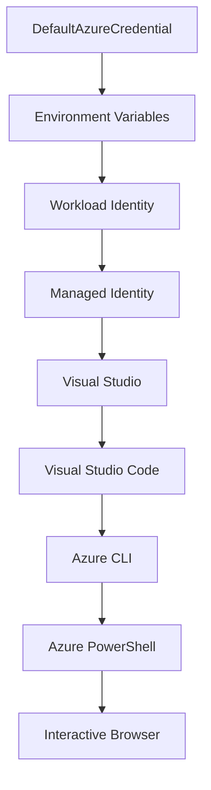

<!--
CO_OP_TRANSLATOR_METADATA:
{
  "original_hash": "4dc26ed8004b58a51875efd07203340f",
  "translation_date": "2025-09-26T18:30:22+00:00",
  "source_file": "docs/getting-started/azd-basics.md",
  "language_code": "ko"
}
-->
# AZD 기초 - Azure Developer CLI 이해하기

# AZD 기초 - 핵심 개념과 기본 사항

**챕터 탐색:**
- **📚 코스 홈**: [AZD 초보자용](../../README.md)
- **📖 현재 챕터**: 챕터 1 - 기초 및 빠른 시작
- **⬅️ 이전**: [코스 개요](../../README.md#-chapter-1-foundation--quick-start)
- **➡️ 다음**: [설치 및 설정](installation.md)
- **🚀 다음 챕터**: [챕터 2: AI 중심 개발](../ai-foundry/azure-ai-foundry-integration.md)

## 소개

이 강의에서는 Azure Developer CLI(azd)를 소개합니다. azd는 로컬 개발에서 Azure 배포까지의 과정을 가속화하는 강력한 명령줄 도구입니다. 기본 개념, 핵심 기능을 배우고 azd가 클라우드 네이티브 애플리케이션 배포를 어떻게 간소화하는지 이해하게 됩니다.

## 학습 목표

이 강의를 마치면 다음을 이해할 수 있습니다:
- Azure Developer CLI가 무엇이며 주요 목적
- 템플릿, 환경, 서비스의 핵심 개념
- 템플릿 기반 개발 및 코드로서의 인프라(Infrastructure as Code)의 주요 기능
- azd 프로젝트 구조와 워크플로
- 개발 환경에 azd를 설치하고 구성할 준비

## 학습 결과

이 강의를 완료하면 다음을 수행할 수 있습니다:
- 현대 클라우드 개발 워크플로에서 azd의 역할 설명
- azd 프로젝트 구조의 구성 요소 식별
- 템플릿, 환경, 서비스가 어떻게 함께 작동하는지 설명
- azd를 사용한 코드로서의 인프라의 이점 이해
- 다양한 azd 명령과 그 목적 인식

## Azure Developer CLI(azd)란 무엇인가?

Azure Developer CLI(azd)는 로컬 개발에서 Azure 배포까지의 과정을 가속화하도록 설계된 명령줄 도구입니다. 클라우드 네이티브 애플리케이션을 Azure에서 빌드, 배포 및 관리하는 과정을 간소화합니다.

## 핵심 개념

### 템플릿
템플릿은 azd의 기반입니다. 템플릿에는 다음이 포함됩니다:
- **애플리케이션 코드** - 소스 코드와 종속성
- **인프라 정의** - Bicep 또는 Terraform으로 정의된 Azure 리소스
- **구성 파일** - 설정 및 환경 변수
- **배포 스크립트** - 자동화된 배포 워크플로

### 환경
환경은 서로 다른 배포 대상을 나타냅니다:
- **개발** - 테스트 및 개발용
- **스테이징** - 사전 프로덕션 환경
- **프로덕션** - 실제 운영 환경

각 환경은 고유한 다음 항목을 유지합니다:
- Azure 리소스 그룹
- 구성 설정
- 배포 상태

### 서비스
서비스는 애플리케이션의 구성 요소입니다:
- **프론트엔드** - 웹 애플리케이션, SPA
- **백엔드** - API, 마이크로서비스
- **데이터베이스** - 데이터 저장 솔루션
- **스토리지** - 파일 및 Blob 스토리지

## 주요 기능

### 1. 템플릿 기반 개발
```bash
# Browse available templates
azd template list

# Initialize from a template
azd init --template <template-name>
```

### 2. 코드로서의 인프라
- **Bicep** - Azure의 도메인 특화 언어
- **Terraform** - 멀티 클라우드 인프라 도구
- **ARM 템플릿** - Azure Resource Manager 템플릿

### 3. 통합 워크플로
```bash
# Complete deployment workflow
azd up            # Provision + Deploy this is hands off for first time setup
azd provision     # Create Azure resources if you update the infrastructure use this
azd deploy        # Deploy application code or redeploy application code once update
azd down          # Clean up resources
```

### 4. 환경 관리
```bash
# Create and manage environments
azd env new <environment-name>
azd env select <environment-name>
azd env list
```

## 📁 프로젝트 구조

일반적인 azd 프로젝트 구조:
```
my-app/
├── .azd/                    # azd configuration
│   └── config.json
├── .azure/                  # Azure deployment artifacts
├── .devcontainer/          # Development container config
├── .github/workflows/      # GitHub Actions
├── .vscode/               # VS Code settings
├── infra/                 # Infrastructure code
│   ├── main.bicep        # Main infrastructure template
│   ├── main.parameters.json
│   └── modules/          # Reusable modules
├── src/                  # Application source code
│   ├── api/             # Backend services
│   └── web/             # Frontend application
├── azure.yaml           # azd project configuration
└── README.md
```

## 🔧 구성 파일

### azure.yaml
주요 프로젝트 구성 파일:
```yaml
name: my-awesome-app
metadata:
  template: my-template@1.0.0

services:
  web:
    project: ./src/web
    language: js
    host: appservice
  api:
    project: ./src/api
    language: js
    host: appservice

hooks:
  preprovision:
    shell: pwsh
    run: echo "Preparing to provision..."
```

### .azure/config.json
환경별 구성:
```json
{
  "version": 1,
  "defaultEnvironment": "dev",
  "environments": {
    "dev": {
      "subscriptionId": "your-subscription-id",
      "location": "eastus"
    }
  }
}
```

## 🎪 일반적인 워크플로

### 새 프로젝트 시작
```bash
# Method 1: Use existing template
azd init --template todo-nodejs-mongo

# Method 2: Start from scratch
azd init

# Method 3: Use current directory
azd init .
```

### 개발 주기
```bash
# Set up development environment
azd auth login
azd env new dev
azd env select dev

# Deploy everything
azd up

# Make changes and redeploy
azd deploy

# Clean up when done
azd down --force --purge # command in the Azure Developer CLI is a **hard reset** for your environment—especially useful when you're troubleshooting failed deployments, cleaning up orphaned resources, or prepping for a fresh redeploy.
```

## `azd down --force --purge` 이해하기
`azd down --force --purge` 명령은 azd 환경과 관련된 모든 리소스를 완전히 제거하는 강력한 방법입니다. 각 플래그의 역할은 다음과 같습니다:
```
--force
```
- 확인 프롬프트를 건너뜁니다.
- 수동 입력이 어려운 자동화 또는 스크립팅에 유용합니다.
- CLI가 불일치를 감지하더라도 중단 없이 제거를 진행합니다.

```
--purge
```
**모든 관련 메타데이터**를 삭제합니다. 여기에는 다음이 포함됩니다:
환경 상태
로컬 `.azure` 폴더
캐시된 배포 정보
azd가 이전 배포를 "기억"하지 못하게 하여 리소스 그룹 불일치나 오래된 레지스트리 참조와 같은 문제를 방지합니다.

### 왜 둘 다 사용해야 할까요?
`azd up`에서 남아 있는 상태나 부분 배포로 인해 문제가 발생했을 때, 이 조합은 **깨끗한 상태**를 보장합니다.

특히 Azure 포털에서 리소스를 수동으로 삭제한 후 또는 템플릿, 환경, 리소스 그룹 명명 규칙을 변경할 때 유용합니다.

### 여러 환경 관리
```bash
# Create staging environment
azd env new staging
azd env select staging
azd up

# Switch back to dev
azd env select dev

# Compare environments
azd env list
```

## 🔐 인증 및 자격 증명

성공적인 azd 배포를 위해 인증을 이해하는 것이 중요합니다. Azure는 여러 인증 방법을 사용하며, azd는 다른 Azure 도구에서 사용하는 동일한 자격 증명 체인을 활용합니다.

### Azure CLI 인증 (`az login`)

azd를 사용하기 전에 Azure에 인증해야 합니다. 가장 일반적인 방법은 Azure CLI를 사용하는 것입니다:

```bash
# Interactive login (opens browser)
az login

# Login with specific tenant
az login --tenant <tenant-id>

# Login with service principal
az login --service-principal -u <app-id> -p <password> --tenant <tenant-id>

# Check current login status
az account show

# List available subscriptions
az account list --output table

# Set default subscription
az account set --subscription <subscription-id>
```

### 인증 흐름
1. **인터랙티브 로그인**: 기본 브라우저를 열어 인증
2. **디바이스 코드 흐름**: 브라우저 접근이 없는 환경용
3. **서비스 주체**: 자동화 및 CI/CD 시나리오용
4. **관리 ID**: Azure에 호스팅된 애플리케이션용

### DefaultAzureCredential 체인

`DefaultAzureCredential`은 여러 자격 증명 소스를 특정 순서로 자동으로 시도하여 간소화된 인증 경험을 제공하는 자격 증명 유형입니다:

#### 자격 증명 체인 순서


#### 1. 환경 변수
```bash
# Set environment variables for service principal
export AZURE_CLIENT_ID="<app-id>"
export AZURE_CLIENT_SECRET="<password>"
export AZURE_TENANT_ID="<tenant-id>"
```

#### 2. 워크로드 ID (Kubernetes/GitHub Actions)
자동으로 사용되는 경우:
- Azure Kubernetes Service(AKS)와 워크로드 ID
- GitHub Actions와 OIDC 연동
- 기타 연동된 ID 시나리오

#### 3. 관리 ID
Azure 리소스용:
- 가상 머신
- 앱 서비스
- Azure Functions
- 컨테이너 인스턴스

```bash
# Check if running on Azure resource with managed identity
az account show --query "user.type" --output tsv
# Returns: "servicePrincipal" if using managed identity
```

#### 4. 개발 도구 통합
- **Visual Studio**: 로그인된 계정을 자동으로 사용
- **VS Code**: Azure Account 확장 프로그램 자격 증명 사용
- **Azure CLI**: `az login` 자격 증명 사용 (로컬 개발에 가장 일반적)

### AZD 인증 설정

```bash
# Method 1: Use Azure CLI (Recommended for development)
az login
azd auth login  # Uses existing Azure CLI credentials

# Method 2: Direct azd authentication
azd auth login --use-device-code  # For headless environments

# Method 3: Check authentication status
azd auth login --check-status

# Method 4: Logout and re-authenticate
azd auth logout
azd auth login
```

### 인증 모범 사례

#### 로컬 개발용
```bash
# 1. Login with Azure CLI
az login

# 2. Verify correct subscription
az account show
az account set --subscription "Your Subscription Name"

# 3. Use azd with existing credentials
azd auth login
```

#### CI/CD 파이프라인용
```yaml
# GitHub Actions example
- name: Azure Login
  uses: azure/login@v1
  with:
    creds: ${{ secrets.AZURE_CREDENTIALS }}

- name: Deploy with azd
  run: |
    azd auth login --client-id ${{ secrets.AZURE_CLIENT_ID }} \
                    --client-secret ${{ secrets.AZURE_CLIENT_SECRET }} \
                    --tenant-id ${{ secrets.AZURE_TENANT_ID }}
    azd up --no-prompt
```

#### 프로덕션 환경용
- Azure 리소스를 실행할 때 **관리 ID** 사용
- 자동화 시나리오에 **서비스 주체** 사용
- 코드나 구성 파일에 자격 증명을 저장하지 않기
- 민감한 구성에는 **Azure Key Vault** 사용

### 일반적인 인증 문제와 해결책

#### 문제: "구독을 찾을 수 없음"
```bash
# Solution: Set default subscription
az account list --output table
az account set --subscription "<subscription-id>"
azd env set AZURE_SUBSCRIPTION_ID "<subscription-id>"
```

#### 문제: "권한 부족"
```bash
# Solution: Check and assign required roles
az role assignment list --assignee $(az account show --query user.name --output tsv)

# Common required roles:
# - Contributor (for resource management)
# - User Access Administrator (for role assignments)
```

#### 문제: "토큰 만료"
```bash
# Solution: Re-authenticate
az logout
az login
azd auth logout
azd auth login
```

### 다양한 시나리오에서의 인증

#### 로컬 개발
```bash
# Personal development account
az login
azd auth login
```

#### 팀 개발
```bash
# Use specific tenant for organization
az login --tenant contoso.onmicrosoft.com
azd auth login
```

#### 멀티 테넌트 시나리오
```bash
# Switch between tenants
az login --tenant tenant1.onmicrosoft.com
# Deploy to tenant 1
azd up

az login --tenant tenant2.onmicrosoft.com  
# Deploy to tenant 2
azd up
```

### 보안 고려 사항

1. **자격 증명 저장**: 소스 코드에 자격 증명을 저장하지 않기
2. **범위 제한**: 서비스 주체에 최소 권한 원칙 적용
3. **토큰 회전**: 서비스 주체 비밀을 정기적으로 회전
4. **감사 추적**: 인증 및 배포 활동 모니터링
5. **네트워크 보안**: 가능하면 프라이빗 엔드포인트 사용

### 인증 문제 해결

```bash
# Debug authentication issues
azd auth login --check-status
az account show
az account get-access-token

# Common diagnostic commands
whoami                          # Current user context
az ad signed-in-user show      # Azure AD user details
az group list                  # Test resource access
```

## `azd down --force --purge` 이해하기

### 발견
```bash
azd template list              # Browse templates
azd template show <template>   # Template details
azd init --help               # Initialization options
```

### 프로젝트 관리
```bash
azd show                     # Project overview
azd env show                 # Current environment
azd config list             # Configuration settings
```

### 모니터링
```bash
azd monitor                  # Open Azure portal
azd pipeline config          # Set up CI/CD
azd logs                     # View application logs
```

## 모범 사례

### 1. 의미 있는 이름 사용
```bash
# Good
azd env new production-east
azd init --template web-app-secure

# Avoid
azd env new env1
azd init --template template1
```

### 2. 템플릿 활용
- 기존 템플릿으로 시작
- 필요에 맞게 커스터마이징
- 조직을 위한 재사용 가능한 템플릿 생성

### 3. 환경 분리
- 개발/스테이징/프로덕션 환경을 분리하여 사용
- 로컬 머신에서 직접 프로덕션에 배포하지 않기
- 프로덕션 배포에는 CI/CD 파이프라인 사용

### 4. 구성 관리
- 민감한 데이터에는 환경 변수를 사용
- 구성은 버전 관리에 포함
- 환경별 설정 문서화

## 학습 진행

### 초급 (1-2주차)
1. azd 설치 및 인증
2. 간단한 템플릿 배포
3. 프로젝트 구조 이해
4. 기본 명령 학습 (up, down, deploy)

### 중급 (3-4주차)
1. 템플릿 커스터마이징
2. 여러 환경 관리
3. 인프라 코드 이해
4. CI/CD 파이프라인 설정

### 고급 (5주차 이상)
1. 커스텀 템플릿 생성
2. 고급 인프라 패턴
3. 멀티 지역 배포
4. 엔터프라이즈급 구성

## 다음 단계

**📖 챕터 1 학습 계속하기:**
- [설치 및 설정](installation.md) - azd 설치 및 구성
- [첫 번째 프로젝트](first-project.md) - 실습 튜토리얼 완료
- [구성 가이드](configuration.md) - 고급 구성 옵션

**🎯 다음 챕터 준비:**
- [챕터 2: AI 중심 개발](../ai-foundry/azure-ai-foundry-integration.md) - AI 애플리케이션 빌드 시작

## 추가 자료

- [Azure Developer CLI 개요](https://learn.microsoft.com/en-us/azure/developer/azure-developer-cli/)
- [템플릿 갤러리](https://azure.github.io/awesome-azd/)
- [커뮤니티 샘플](https://github.com/Azure-Samples)

---

**챕터 탐색:**
- **📚 코스 홈**: [AZD 초보자용](../../README.md)
- **📖 현재 챕터**: 챕터 1 - 기초 및 빠른 시작  
- **⬅️ 이전**: [코스 개요](../../README.md#-chapter-1-foundation--quick-start)
- **➡️ 다음**: [설치 및 설정](installation.md)
- **🚀 다음 챕터**: [챕터 2: AI 중심 개발](../ai-foundry/azure-ai-foundry-integration.md)

---

