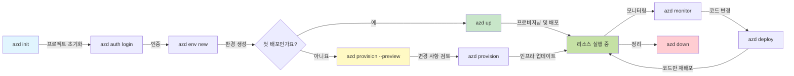
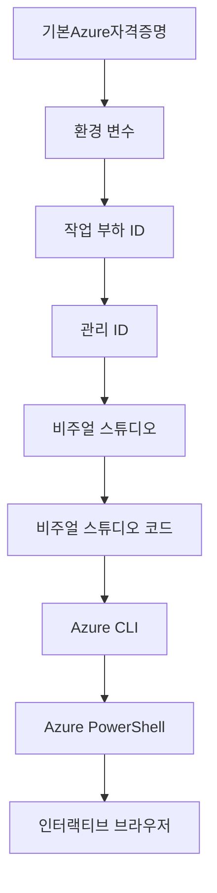

# AZD 기본 - Azure Developer CLI 이해하기

# AZD 기본 - 핵심 개념과 기초

**챕터 탐색:**
- **📚 코스 홈**: [AZD 초보자용](../../README.md)
- **📖 현재 챕터**: 챕터 1 - 기초 및 빠른 시작
- **⬅️ 이전**: [코스 개요](../../README.md#-chapter-1-foundation--quick-start)
- **➡️ 다음**: [설치 및 설정](installation.md)
- **🚀 다음 챕터**: [챕터 2: AI 우선 개발](../microsoft-foundry/microsoft-foundry-integration.md)

## 소개

이 강의에서는 Azure Developer CLI(azd)를 소개합니다. azd는 로컬 개발에서 Azure 배포까지의 여정을 가속화하는 강력한 명령줄 도구입니다. 기본 개념, 핵심 기능을 배우고 azd가 클라우드 네이티브 애플리케이션 배포를 어떻게 간소화하는지 이해하게 됩니다.

## 학습 목표

이 강의를 마치면 다음을 이해할 수 있습니다:
- Azure Developer CLI가 무엇이며 주요 목적
- 템플릿, 환경, 서비스의 핵심 개념 학습
- 템플릿 기반 개발 및 코드로서의 인프라(Infrastructure as Code) 주요 기능 탐색
- azd 프로젝트 구조와 워크플로 이해
- 개발 환경을 위해 azd를 설치하고 구성할 준비 완료

## 학습 결과

이 강의를 완료한 후, 다음을 수행할 수 있습니다:
- 현대 클라우드 개발 워크플로에서 azd의 역할 설명
- azd 프로젝트 구조의 구성 요소 식별
- 템플릿, 환경, 서비스가 어떻게 함께 작동하는지 설명
- azd를 사용한 코드로서의 인프라의 이점 이해
- 다양한 azd 명령과 그 목적 인식

## Azure Developer CLI(azd)란 무엇인가?

Azure Developer CLI(azd)는 로컬 개발에서 Azure 배포까지의 여정을 가속화하도록 설계된 명령줄 도구입니다. Azure에서 클라우드 네이티브 애플리케이션을 구축, 배포 및 관리하는 과정을 간소화합니다.

### 🎯 AZD를 사용하는 이유? 실제 사례 비교

간단한 데이터베이스가 포함된 웹 앱 배포를 비교해 봅시다:

#### ❌ AZD 없이: 수동 Azure 배포 (30분 이상 소요)

```bash
# 1단계: 리소스 그룹 생성
az group create --name myapp-rg --location eastus

# 2단계: 앱 서비스 플랜 생성
az appservice plan create --name myapp-plan \
  --resource-group myapp-rg \
  --sku B1 --is-linux

# 3단계: 웹 앱 생성
az webapp create --name myapp-web-unique123 \
  --resource-group myapp-rg \
  --plan myapp-plan \
  --runtime "NODE:18-lts"

# 4단계: Cosmos DB 계정 생성 (10-15분 소요)
az cosmosdb create --name myapp-cosmos-unique123 \
  --resource-group myapp-rg \
  --kind MongoDB

# 5단계: 데이터베이스 생성
az cosmosdb mongodb database create \
  --account-name myapp-cosmos-unique123 \
  --resource-group myapp-rg \
  --name tododb

# 6단계: 컬렉션 생성
az cosmosdb mongodb collection create \
  --account-name myapp-cosmos-unique123 \
  --resource-group myapp-rg \
  --database-name tododb \
  --name todos

# 7단계: 연결 문자열 가져오기
CONN_STR=$(az cosmosdb keys list \
  --name myapp-cosmos-unique123 \
  --resource-group myapp-rg \
  --type connection-strings \
  --query "connectionStrings[0].connectionString" -o tsv)

# 8단계: 앱 설정 구성
az webapp config appsettings set \
  --name myapp-web-unique123 \
  --resource-group myapp-rg \
  --settings MONGODB_URI="$CONN_STR"

# 9단계: 로깅 활성화
az webapp log config --name myapp-web-unique123 \
  --resource-group myapp-rg \
  --application-logging filesystem \
  --detailed-error-messages true

# 10단계: Application Insights 설정
az monitor app-insights component create \
  --app myapp-insights \
  --location eastus \
  --resource-group myapp-rg

# 11단계: App Insights를 웹 앱에 연결
INSTRUMENTATION_KEY=$(az monitor app-insights component show \
  --app myapp-insights \
  --resource-group myapp-rg \
  --query "instrumentationKey" -o tsv)

az webapp config appsettings set \
  --name myapp-web-unique123 \
  --resource-group myapp-rg \
  --settings APPINSIGHTS_INSTRUMENTATIONKEY="$INSTRUMENTATION_KEY"

# 12단계: 애플리케이션을 로컬에서 빌드
npm install
npm run build

# 13단계: 배포 패키지 생성
zip -r app.zip . -x "*.git*" "node_modules/*"

# 14단계: 애플리케이션 배포
az webapp deployment source config-zip \
  --resource-group myapp-rg \
  --name myapp-web-unique123 \
  --src app.zip

# 15단계: 기다리며 잘 작동하기를 기도 🙏
# (자동화된 검증 없음, 수동 테스트 필요)
```

**문제점:**
- ❌ 15개 이상의 명령어를 기억하고 실행해야 함
- ❌ 30-45분의 수작업 필요
- ❌ 실수하기 쉬움(오타, 잘못된 매개변수)
- ❌ 연결 문자열이 터미널 기록에 노출됨
- ❌ 실패 시 자동 롤백 없음
- ❌ 팀원이 재현하기 어려움
- ❌ 매번 다름(재현 불가능)

#### ✅ AZD 사용: 자동화된 배포 (5개의 명령어, 10-15분 소요)

```bash
# 1단계: 템플릿에서 초기화
azd init --template todo-nodejs-mongo

# 2단계: 인증
azd auth login

# 3단계: 환경 생성
azd env new dev

# 4단계: 변경 사항 미리보기 (선택 사항이지만 권장됨)
azd provision --preview

# 5단계: 모든 것을 배포
azd up

# ✨ 완료! 모든 것이 배포되고, 구성되고, 모니터링되었습니다
```

**이점:**
- ✅ **5개의 명령어** vs. 15개 이상의 수동 단계
- ✅ **10-15분** 총 소요 시간(대부분 Azure 대기 시간)
- ✅ **오류 없음** - 자동화 및 테스트 완료
- ✅ **비밀 정보 안전 관리** - Key Vault 사용
- ✅ **자동 롤백** - 실패 시 자동 복구
- ✅ **완전 재현 가능** - 매번 동일한 결과
- ✅ **팀 준비 완료** - 누구나 동일한 명령어로 배포 가능
- ✅ **코드로서의 인프라** - 버전 관리된 Bicep 템플릿
- ✅ **내장 모니터링** - Application Insights 자동 구성

### 📊 시간 및 오류 감소

| 지표 | 수동 배포 | AZD 배포 | 개선 |
|:-------|:------------------|:---------------|:------------|
| **명령어 수** | 15개 이상 | 5개 | 67% 감소 |
| **시간** | 30-45분 | 10-15분 | 60% 더 빠름 |
| **오류율** | 약 40% | 5% 미만 | 88% 감소 |
| **일관성** | 낮음(수동) | 100%(자동화) | 완벽 |
| **팀 온보딩** | 2-4시간 | 30분 | 75% 더 빠름 |
| **롤백 시간** | 30분 이상(수동) | 2분(자동화) | 93% 더 빠름 |

## 핵심 개념

### 템플릿
템플릿은 azd의 기초입니다. 템플릿에는 다음이 포함됩니다:
- **애플리케이션 코드** - 소스 코드 및 종속성
- **인프라 정의** - Bicep 또는 Terraform으로 정의된 Azure 리소스
- **구성 파일** - 설정 및 환경 변수
- **배포 스크립트** - 자동화된 배포 워크플로

### 환경
환경은 서로 다른 배포 대상을 나타냅니다:
- **개발** - 테스트 및 개발용
- **스테이징** - 사전 프로덕션 환경
- **프로덕션** - 실제 운영 환경

각 환경은 고유한 다음 항목을 유지합니다:
- Azure 리소스 그룹
- 구성 설정
- 배포 상태

### 서비스
서비스는 애플리케이션의 구성 요소입니다:
- **프론트엔드** - 웹 애플리케이션, SPA
- **백엔드** - API, 마이크로서비스
- **데이터베이스** - 데이터 저장 솔루션
- **스토리지** - 파일 및 Blob 저장소

## 주요 기능

### 1. 템플릿 기반 개발
```bash
# 사용 가능한 템플릿 탐색
azd template list

# 템플릿에서 초기화
azd init --template <template-name>
```

### 2. 코드로서의 인프라
- **Bicep** - Azure의 도메인 특화 언어
- **Terraform** - 멀티 클라우드 인프라 도구
- **ARM 템플릿** - Azure Resource Manager 템플릿

### 3. 통합 워크플로
```bash
# 배포 워크플로 완료
azd up            # 프로비저닝 + 배포, 첫 설정 시 자동으로 진행

# 🧪 새 기능: 배포 전에 인프라 변경 사항 미리보기 (안전)
azd provision --preview    # 변경 없이 인프라 배포 시뮬레이션

azd provision     # 인프라를 업데이트하면 Azure 리소스를 생성
azd deploy        # 애플리케이션 코드를 배포하거나 업데이트 후 다시 배포
azd down          # 리소스 정리
```

#### 🛡️ 안전한 인프라 계획을 위한 미리보기
`azd provision --preview` 명령어는 안전한 배포를 위한 혁신적인 기능입니다:
- **드라이런 분석** - 생성, 수정, 삭제될 항목 표시
- **위험 없음** - Azure 환경에 실제 변경 없음
- **팀 협업** - 배포 전에 미리보기 결과 공유
- **비용 추정** - 리소스 비용을 사전에 이해

```bash
# 예제 미리보기 워크플로우
azd provision --preview           # 무엇이 변경될지 확인
# 출력을 검토하고 팀과 논의
azd provision                     # 자신감을 가지고 변경 사항 적용
```

### 📊 시각적: AZD 개발 워크플로


**워크플로 설명:**
1. **Init** - 템플릿 또는 새 프로젝트로 시작
2. **Auth** - Azure 인증
3. **Environment** - 격리된 배포 환경 생성
4. **Preview** - 🆕 항상 인프라 변경 사항 미리보기(안전한 관행)
5. **Provision** - Azure 리소스 생성/업데이트
6. **Deploy** - 애플리케이션 코드 푸시
7. **Monitor** - 애플리케이션 성능 관찰
8. **Iterate** - 변경 사항 적용 및 코드 재배포
9. **Cleanup** - 완료 후 리소스 제거

### 4. 환경 관리
```bash
# 환경 생성 및 관리
azd env new <environment-name>
azd env select <environment-name>
azd env list
```

## 📁 프로젝트 구조

일반적인 azd 프로젝트 구조:
```
my-app/
├── .azd/                    # azd configuration
│   └── config.json
├── .azure/                  # Azure deployment artifacts
├── .devcontainer/          # Development container config
├── .github/workflows/      # GitHub Actions
├── .vscode/               # VS Code settings
├── infra/                 # Infrastructure code
│   ├── main.bicep        # Main infrastructure template
│   ├── main.parameters.json
│   └── modules/          # Reusable modules
├── src/                  # Application source code
│   ├── api/             # Backend services
│   └── web/             # Frontend application
├── azure.yaml           # azd project configuration
└── README.md
```

## 🔧 구성 파일

### azure.yaml
주요 프로젝트 구성 파일:
```yaml
name: my-awesome-app
metadata:
  template: my-template@1.0.0

services:
  web:
    project: ./src/web
    language: js
    host: appservice
  api:
    project: ./src/api
    language: js
    host: appservice

hooks:
  preprovision:
    shell: pwsh
    run: echo "Preparing to provision..."
```

### .azure/config.json
환경별 구성:
```json
{
  "version": 1,
  "defaultEnvironment": "dev",
  "environments": {
    "dev": {
      "subscriptionId": "your-subscription-id",
      "location": "eastus"
    }
  }
}
```

## 🎪 일반 워크플로와 실습

> **💡 학습 팁:** 이 실습을 순서대로 따라하며 AZD 기술을 점진적으로 향상시키세요.

### 🎯 실습 1: 첫 번째 프로젝트 초기화

**목표:** AZD 프로젝트를 생성하고 구조를 탐색

**단계:**
```bash
# 검증된 템플릿을 사용하세요
azd init --template todo-nodejs-mongo

# 생성된 파일을 탐색하세요
ls -la  # 숨겨진 파일을 포함한 모든 파일을 보세요

# 생성된 주요 파일:
# - azure.yaml (주요 설정 파일)
# - infra/ (인프라 코드)
# - src/ (애플리케이션 코드)
```

**✅ 성공:** azure.yaml, infra/, src/ 디렉토리가 생성됨

---

### 🎯 실습 2: Azure에 배포

**목표:** 끝에서 끝까지 배포 완료

**단계:**
```bash
# 1. 인증
az login && azd auth login

# 2. 환경 생성
azd env new dev
azd env set AZURE_LOCATION eastus

# 3. 변경 사항 미리보기 (권장)
azd provision --preview

# 4. 모든 것 배포
azd up

# 5. 배포 확인
azd show    # 앱 URL 보기
```

**예상 시간:** 10-15분  
**✅ 성공:** 브라우저에서 애플리케이션 URL 열림

---

### 🎯 실습 3: 여러 환경

**목표:** 개발 및 스테이징에 배포

**단계:**
```bash
# 이미 dev가 있으니, staging을 만드세요
azd env new staging
azd env set AZURE_LOCATION westus2
azd up

# 그들 사이를 전환하세요
azd env list
azd env select dev
```

**✅ 성공:** Azure 포털에서 두 개의 별도 리소스 그룹 확인

---

### 🛡️ 초기화: `azd down --force --purge`

완전히 초기화가 필요할 때:

```bash
azd down --force --purge
```

**기능:**
- `--force`: 확인 프롬프트 없음
- `--purge`: 모든 로컬 상태 및 Azure 리소스 삭제

**사용 시점:**
- 배포가 중간에 실패했을 때
- 프로젝트 전환 시
- 새로 시작해야 할 때

---

## 🎪 원래 워크플로 참조

### 새 프로젝트 시작
```bash
# 방법 1: 기존 템플릿 사용
azd init --template todo-nodejs-mongo

# 방법 2: 처음부터 시작
azd init

# 방법 3: 현재 디렉토리 사용
azd init .
```

### 개발 주기
```bash
# 개발 환경 설정
azd auth login
azd env new dev
azd env select dev

# 모든 것을 배포
azd up

# 변경 사항을 적용하고 다시 배포
azd deploy

# 완료되면 정리
azd down --force --purge # Azure Developer CLI의 명령은 환경에 대한 **강제 초기화**입니다. 특히 배포 실패 문제를 해결하거나 고아 리소스를 정리하거나 새로 배포를 준비할 때 유용합니다.
```

## `azd down --force --purge` 이해하기
`azd down --force --purge` 명령어는 azd 환경과 관련된 모든 리소스를 완전히 제거하는 강력한 방법입니다. 각 플래그의 기능은 다음과 같습니다:
```
--force
```
- 확인 프롬프트를 건너뜁니다.
- 수동 입력이 불가능한 자동화 또는 스크립팅에 유용합니다.
- CLI가 불일치를 감지하더라도 중단 없이 초기화가 진행됩니다.

```
--purge
```
**모든 관련 메타데이터**를 삭제합니다:
환경 상태
로컬 `.azure` 폴더
캐시된 배포 정보
이전 배포를 "기억"하지 않도록 하여 리소스 그룹 불일치 또는 오래된 레지스트리 참조와 같은 문제를 방지합니다.

### 왜 둘 다 사용해야 할까?
`azd up`이 남아 있는 상태나 부분 배포로 인해 벽에 부딪혔을 때, 이 조합은 **깨끗한 상태**를 보장합니다.

특히 Azure 포털에서 수동으로 리소스를 삭제한 후 또는 템플릿, 환경, 리소스 그룹 명명 규칙을 변경할 때 유용합니다.

### 여러 환경 관리
```bash
# 스테이징 환경 생성
azd env new staging
azd env select staging
azd up

# 개발 환경으로 전환
azd env select dev

# 환경 비교
azd env list
```

## 🔐 인증 및 자격 증명

성공적인 azd 배포를 위해 인증을 이해하는 것이 중요합니다. Azure는 여러 인증 방법을 사용하며, azd는 다른 Azure 도구에서 사용하는 동일한 자격 증명 체인을 활용합니다.

### Azure CLI 인증 (`az login`)

azd를 사용하기 전에 Azure에 인증해야 합니다. 가장 일반적인 방법은 Azure CLI를 사용하는 것입니다:

```bash
# 대화형 로그인 (브라우저 열기)
az login

# 특정 테넌트로 로그인
az login --tenant <tenant-id>

# 서비스 주체로 로그인
az login --service-principal -u <app-id> -p <password> --tenant <tenant-id>

# 현재 로그인 상태 확인
az account show

# 사용 가능한 구독 목록
az account list --output table

# 기본 구독 설정
az account set --subscription <subscription-id>
```

### 인증 흐름
1. **인터랙티브 로그인**: 기본 브라우저를 열어 인증
2. **디바이스 코드 흐름**: 브라우저 접근이 없는 환경용
3. **서비스 주체**: 자동화 및 CI/CD 시나리오용
4. **관리 ID**: Azure에 호스팅된 애플리케이션용

### DefaultAzureCredential 체인

`DefaultAzureCredential`은 여러 자격 증명 소스를 특정 순서로 자동으로 시도하여 간소화된 인증 경험을 제공하는 자격 증명 유형입니다:

#### 자격 증명 체인 순서

#### 1. 환경 변수
```bash
# 서비스 주체에 대한 환경 변수를 설정합니다
export AZURE_CLIENT_ID="<app-id>"
export AZURE_CLIENT_SECRET="<password>"
export AZURE_TENANT_ID="<tenant-id>"
```

#### 2. 워크로드 ID(Kubernetes/GitHub Actions)
자동으로 사용되는 경우:
- Azure Kubernetes Service(AKS)와 워크로드 ID
- GitHub Actions와 OIDC 연동
- 기타 연동된 ID 시나리오

#### 3. 관리 ID
Azure 리소스용:
- 가상 머신
- 앱 서비스
- Azure Functions
- 컨테이너 인스턴스

```bash
# 관리 ID가 있는 Azure 리소스에서 실행 중인지 확인
az account show --query "user.type" --output tsv
# 관리 ID를 사용하는 경우 "servicePrincipal"을 반환합니다
```

#### 4. 개발 도구 통합
- **Visual Studio**: 로그인된 계정을 자동으로 사용
- **VS Code**: Azure 계정 확장 프로그램 자격 증명 사용
- **Azure CLI**: `az login` 자격 증명 사용(로컬 개발에 가장 일반적)

### AZD 인증 설정

```bash
# 방법 1: Azure CLI 사용 (개발에 권장됨)
az login
azd auth login  # 기존 Azure CLI 자격 증명 사용

# 방법 2: 직접 azd 인증
azd auth login --use-device-code  # 헤드리스 환경용

# 방법 3: 인증 상태 확인
azd auth login --check-status

# 방법 4: 로그아웃 및 재인증
azd auth logout
azd auth login
```

### 인증 모범 사례

#### 로컬 개발용
```bash
# 1. Azure CLI로 로그인
az login

# 2. 올바른 구독 확인
az account show
az account set --subscription "Your Subscription Name"

# 3. 기존 자격 증명으로 azd 사용
azd auth login
```

#### CI/CD 파이프라인용
```yaml
# GitHub Actions example
- name: Azure Login
  uses: azure/login@v1
  with:
    creds: ${{ secrets.AZURE_CREDENTIALS }}

- name: Deploy with azd
  run: |
    azd auth login --client-id ${{ secrets.AZURE_CLIENT_ID }} \
                    --client-secret ${{ secrets.AZURE_CLIENT_SECRET }} \
                    --tenant-id ${{ secrets.AZURE_TENANT_ID }}
    azd up --no-prompt
```

#### 프로덕션 환경용
- Azure 리소스에서 실행 시 **관리 ID** 사용
- 자동화 시나리오에 **서비스 주체** 사용
- 코드나 구성 파일에 자격 증명을 저장하지 않기
- 민감한 구성은 **Azure Key Vault** 사용

### 일반적인 인증 문제 및 해결책

#### 문제: "구독을 찾을 수 없음"
```bash
# 솔루션: 기본 구독 설정
az account list --output table
az account set --subscription "<subscription-id>"
azd env set AZURE_SUBSCRIPTION_ID "<subscription-id>"
```

#### 문제: "권한 부족"
```bash
# 해결책: 필요한 역할 확인 및 할당
az role assignment list --assignee $(az account show --query user.name --output tsv)

# 공통적으로 필요한 역할:
# - 기여자 (리소스 관리용)
# - 사용자 액세스 관리자 (역할 할당용)
```

#### 문제: "토큰 만료"
```bash
# 해결책: 다시 인증하십시오
az logout
az login
azd auth logout
azd auth login
```

### 다양한 시나리오에서의 인증

#### 로컬 개발
```bash
# 개인 개발 계정
az login
azd auth login
```

#### 팀 개발
```bash
# 조직을 위해 특정 테넌트를 사용하십시오
az login --tenant contoso.onmicrosoft.com
azd auth login
```

#### 멀티 테넌트 시나리오
```bash
# 테넌트 간 전환
az login --tenant tenant1.onmicrosoft.com
# 테넌트 1에 배포
azd up

az login --tenant tenant2.onmicrosoft.com  
# 테넌트 2에 배포
azd up
```

### 보안 고려 사항

1. **자격 증명 저장**: 자격 증명을 소스 코드에 저장하지 않기
2. **범위 제한**: 서비스 주체에 최소 권한 원칙 적용
3. **토큰 회전**: 서비스 주체 비밀을 정기적으로 회전
4. **감사 추적**: 인증 및 배포 활동 모니터링
5. **네트워크 보안**: 가능하면 프라이빗 엔드포인트 사용

### 인증 문제 해결

```bash
# 인증 문제 디버그
azd auth login --check-status
az account show
az account get-access-token

# 일반적인 진단 명령
whoami                          # 현재 사용자 컨텍스트
az ad signed-in-user show      # Azure AD 사용자 세부 정보
az group list                  # 리소스 액세스 테스트
```

## `azd down --force --purge` 이해하기

### 발견
```bash
azd template list              # 템플릿 탐색
azd template show <template>   # 템플릿 세부 정보
azd init --help               # 초기화 옵션
```

### 프로젝트 관리
```bash
azd show                     # 프로젝트 개요
azd env show                 # 현재 환경
azd config list             # 구성 설정
```

### 모니터링
```bash
azd monitor                  # Azure 포털 열기
azd pipeline config          # CI/CD 설정
azd logs                     # 애플리케이션 로그 보기
```

## 모범 사례

### 1. 의미 있는 이름 사용
```bash
# 좋음
azd env new production-east
azd init --template web-app-secure

# 피하기
azd env new env1
azd init --template template1
```

### 2. 템플릿 활용
- 기존 템플릿으로 시작
- 필요에 맞게 커스터마이즈
- 조직을 위한 재사용 가능한 템플릿 생성

### 3. 환경 격리
- 개발/스테이징/프로덕션에 별도 환경 사용
- 로컬 머신에서 직접 프로덕션에 배포하지 않기
- 프로덕션 배포는 CI/CD 파이프라인 사용

### 4. 구성 관리
- 민감한 데이터는 환경 변수 사용
- 구성은 버전 관리에 포함
- 환경별 설정 문서화

## 학습 진행

### 초급 (1-2주차)
1. azd 설치 및 인증
2. 간단한 템플릿 배포
3. 프로젝트 구조 이해
4. 기본 명령어 학습(up, down, deploy)

### 중급 (3-4주차)
1. 템플릿 커스터마이즈
2. 여러 환경 관리
3. 인프라 코드 이해
4. CI/CD 파이프라인 설정

### 고급 (5주차 이상)
1. 커스텀 템플릿 생성
2. 고급 인프라 패턴
3. 멀티 지역 배포
4. 엔터프라이즈급 구성

## 다음 단계

**📖 챕터 1 학습 계속:**
- [설치 및 설정](installation.md) - azd 설치 및 구성하기
- [첫 번째 프로젝트](first-project.md) - 실습 튜토리얼 완료하기
- [구성 가이드](configuration.md) - 고급 구성 옵션

**🎯 다음 챕터로 준비되셨나요?**
- [챕터 2: AI 우선 개발](../microsoft-foundry/microsoft-foundry-integration.md) - AI 애플리케이션 개발 시작하기

## 추가 자료

- [Azure Developer CLI 개요](https://learn.microsoft.com/en-us/azure/developer/azure-developer-cli/)
- [템플릿 갤러리](https://azure.github.io/awesome-azd/)
- [커뮤니티 샘플](https://github.com/Azure-Samples)

---

## 🙋 자주 묻는 질문

### 일반 질문

**Q: AZD와 Azure CLI의 차이점은 무엇인가요?**

A: Azure CLI (`az`)는 개별 Azure 리소스를 관리하는 데 사용됩니다. AZD (`azd`)는 전체 애플리케이션을 관리합니다:

```bash
# Azure CLI - 저수준 리소스 관리
az webapp create --name myapp --resource-group rg
az sql server create --name myserver --resource-group rg
# ...더 많은 명령이 필요함

# AZD - 애플리케이션 수준 관리
azd up  # 모든 리소스를 포함한 전체 앱 배포
```

**이렇게 생각해보세요:**
- `az` = 개별 레고 블록 작업
- `azd` = 완성된 레고 세트 작업

---

**Q: AZD를 사용하려면 Bicep이나 Terraform을 알아야 하나요?**

A: 아닙니다! 템플릿으로 시작하세요:
```bash
# 기존 템플릿 사용 - IaC 지식 불필요
azd init --template todo-nodejs-mongo
azd up
```

나중에 Bicep을 배워서 인프라를 맞춤화할 수 있습니다. 템플릿은 학습할 수 있는 작동 예제를 제공합니다.

---

**Q: AZD 템플릿을 실행하는 데 비용이 얼마나 드나요?**

A: 템플릿에 따라 비용이 다릅니다. 대부분의 개발 템플릿은 월 $50-150 정도입니다:

```bash
# 배포 전에 비용 미리보기
azd provision --preview

# 사용하지 않을 때 항상 정리
azd down --force --purge  # 모든 리소스 제거
```

**팁:** 무료 티어를 사용할 수 있는 경우 활용하세요:
- App Service: F1 (무료) 티어
- Azure OpenAI: 월 50,000 토큰 무료
- Cosmos DB: 1000 RU/s 무료 티어

---

**Q: 기존 Azure 리소스와 AZD를 함께 사용할 수 있나요?**

A: 가능합니다. 하지만 새로 시작하는 것이 더 쉽습니다. AZD는 전체 라이프사이클을 관리할 때 가장 잘 작동합니다. 기존 리소스의 경우:

```bash
# 옵션 1: 기존 리소스 가져오기 (고급)
azd init
# 그런 다음 infra/를 수정하여 기존 리소스를 참조합니다

# 옵션 2: 새로 시작하기 (권장)
azd init --template matching-your-stack
azd up  # 새 환경 생성
```

---

**Q: 내 프로젝트를 팀원들과 공유하려면 어떻게 해야 하나요?**

A: AZD 프로젝트를 Git에 커밋하세요 (단, .azure 폴더는 제외):

```bash
# 기본적으로 .gitignore에 이미 포함되어 있음
.azure/        # 비밀 및 환경 데이터를 포함함
*.env          # 환경 변수

# 팀원들 당시:
git clone <your-repo>
azd auth login
azd env new <their-name>-dev
azd up
```

모든 팀원이 동일한 템플릿에서 동일한 인프라를 얻을 수 있습니다.

---

### 문제 해결 질문

**Q: "azd up"이 중간에 실패했습니다. 어떻게 해야 하나요?**

A: 오류를 확인하고 수정한 후 다시 시도하세요:

```bash
# 자세한 로그 보기
azd show

# 일반적인 수정 사항:

# 1. 할당량 초과 시:
azd env set AZURE_LOCATION "westus2"  # 다른 지역 시도

# 2. 리소스 이름 충돌 시:
azd down --force --purge  # 초기화
azd up  # 다시 시도

# 3. 인증 만료 시:
az login
azd auth login
azd up
```

**가장 흔한 문제:** 잘못된 Azure 구독 선택
```bash
az account list --output table
az account set --subscription "<correct-subscription>"
```

---

**Q: 인프라를 다시 프로비저닝하지 않고 코드 변경만 배포하려면 어떻게 해야 하나요?**

A: `azd up` 대신 `azd deploy`를 사용하세요:

```bash
azd up          # 처음에는: 프로비저닝 + 배포 (느림)

# 코드 변경하기...

azd deploy      # 이후에는: 배포만 (빠름)
```

속도 비교:
- `azd up`: 10-15분 (인프라 프로비저닝)
- `azd deploy`: 2-5분 (코드만)

---

**Q: 인프라 템플릿을 맞춤화할 수 있나요?**

A: 가능합니다! `infra/` 폴더의 Bicep 파일을 편집하세요:

```bash
# azd init 후
cd infra/
code main.bicep  # VS Code에서 편집

# 변경 사항 미리 보기
azd provision --preview

# 변경 사항 적용
azd provision
```

**팁:** 작은 변경부터 시작하세요 - 먼저 SKU를 변경해보세요:
```bicep
// infra/main.bicep
sku: {
  name: 'B1'  // Change to 'P1V2' for production
}
```

---

**Q: AZD가 생성한 모든 것을 삭제하려면 어떻게 해야 하나요?**

A: 한 명령어로 모든 리소스를 제거할 수 있습니다:

```bash
azd down --force --purge

# 이것을 삭제합니다:
# - 모든 Azure 리소스
# - 리소스 그룹
# - 로컬 환경 상태
# - 캐시된 배포 데이터
```

**다음 상황에서 항상 실행하세요:**
- 템플릿 테스트를 마쳤을 때
- 다른 프로젝트로 전환할 때
- 새로 시작하고 싶을 때

**비용 절감:** 사용하지 않는 리소스를 삭제하면 $0 청구

---

**Q: Azure 포털에서 리소스를 실수로 삭제했다면 어떻게 하나요?**

A: AZD 상태가 동기화되지 않을 수 있습니다. 초기화 접근법을 사용하세요:

```bash
# 1. 로컬 상태 제거
azd down --force --purge

# 2. 새로 시작
azd up

# 대안: AZD가 감지하고 수정하도록 허용
azd provision  # 누락된 리소스를 생성할 것입니다
```

---

### 고급 질문

**Q: CI/CD 파이프라인에서 AZD를 사용할 수 있나요?**

A: 가능합니다! GitHub Actions 예제:

```yaml
# .github/workflows/deploy.yml
name: Deploy with AZD

on:
  push:
    branches: [main]

jobs:
  deploy:
    runs-on: ubuntu-latest
    steps:
      - uses: actions/checkout@v2
      
      - name: Install azd
        run: curl -fsSL https://aka.ms/install-azd.sh | bash
      
      - name: Azure Login
        run: |
          azd auth login \
            --client-id ${{ secrets.AZURE_CLIENT_ID }} \
            --client-secret ${{ secrets.AZURE_CLIENT_SECRET }} \
            --tenant-id ${{ secrets.AZURE_TENANT_ID }}
      
      - name: Deploy
        run: azd up --no-prompt
```

---

**Q: 비밀 정보와 민감한 데이터를 어떻게 처리하나요?**

A: AZD는 Azure Key Vault와 자동으로 통합됩니다:

```bash
# 비밀은 코드가 아닌 Key Vault에 저장됩니다
azd env set DATABASE_PASSWORD "$(openssl rand -base64 32)"

# AZD는 자동으로:
# 1. Key Vault를 생성합니다
# 2. 비밀을 저장합니다
# 3. Managed Identity를 통해 앱 접근 권한을 부여합니다
# 4. 런타임에 주입합니다
```

**절대 커밋하지 마세요:**
- `.azure/` 폴더 (환경 데이터 포함)
- `.env` 파일 (로컬 비밀)
- 연결 문자열

---

**Q: 여러 지역에 배포할 수 있나요?**

A: 가능합니다. 지역별로 환경을 생성하세요:

```bash
# 동부 미국 환경
azd env new prod-eastus
azd env set AZURE_LOCATION eastus
azd up

# 서부 유럽 환경
azd env new prod-westeurope
azd env set AZURE_LOCATION westeurope
azd up

# 각 환경은 독립적임
azd env list
```

진정한 다중 지역 앱의 경우, Bicep 템플릿을 맞춤화하여 여러 지역에 동시에 배포하세요.

---

**Q: 문제가 생겼을 때 어디에서 도움을 받을 수 있나요?**

1. **AZD 문서:** https://learn.microsoft.com/azure/developer/azure-developer-cli/
2. **GitHub 이슈:** https://github.com/Azure/azure-dev/issues
3. **Discord:** [Azure Discord](https://discord.gg/microsoft-azure) - #azure-developer-cli 채널
4. **Stack Overflow:** 태그 `azure-developer-cli`
5. **이 강의:** [문제 해결 가이드](../troubleshooting/common-issues.md)

**팁:** 질문하기 전에 다음을 실행하세요:
```bash
azd show       # 현재 상태를 표시합니다
azd version    # 버전을 표시합니다
```
질문에 이 정보를 포함하면 더 빠른 도움을 받을 수 있습니다.

---

## 🎓 다음 단계는?

이제 AZD의 기본을 이해하셨습니다. 다음 경로를 선택하세요:

### 🎯 초보자를 위한 경로:
1. **다음:** [설치 및 설정](installation.md) - AZD를 컴퓨터에 설치하세요
2. **그다음:** [첫 번째 프로젝트](first-project.md) - 첫 번째 앱을 배포하세요
3. **연습:** 이 강의의 모든 3가지 연습을 완료하세요

### 🚀 AI 개발자를 위한 경로:
1. **건너뛰기:** [챕터 2: AI 우선 개발](../microsoft-foundry/microsoft-foundry-integration.md)
2. **배포:** `azd init --template get-started-with-ai-chat`로 시작하세요
3. **학습:** 배포하면서 배우세요

### 🏗️ 숙련된 개발자를 위한 경로:
1. **검토:** [구성 가이드](configuration.md) - 고급 설정
2. **탐색:** [코드로 인프라 관리](../deployment/provisioning.md) - Bicep 심화 학습
3. **구축:** 스택에 맞는 맞춤 템플릿을 만드세요

---

**챕터 탐색:**
- **📚 강의 홈**: [AZD 초보자용](../../README.md)
- **📖 현재 챕터**: 챕터 1 - 기초 및 빠른 시작  
- **⬅️ 이전**: [강의 개요](../../README.md#-chapter-1-foundation--quick-start)
- **➡️ 다음**: [설치 및 설정](installation.md)
- **🚀 다음 챕터**: [챕터 2: AI 우선 개발](../microsoft-foundry/microsoft-foundry-integration.md)

---

<!-- CO-OP TRANSLATOR DISCLAIMER START -->
**면책 조항**:  
이 문서는 AI 번역 서비스 [Co-op Translator](https://github.com/Azure/co-op-translator)를 사용하여 번역되었습니다. 정확성을 위해 노력하고 있지만, 자동 번역에는 오류나 부정확성이 포함될 수 있습니다. 원본 문서를 해당 언어로 작성된 상태에서 권위 있는 자료로 간주해야 합니다. 중요한 정보의 경우, 전문적인 인간 번역을 권장합니다. 이 번역 사용으로 인해 발생하는 오해나 잘못된 해석에 대해 책임을 지지 않습니다.
<!-- CO-OP TRANSLATOR DISCLAIMER END -->