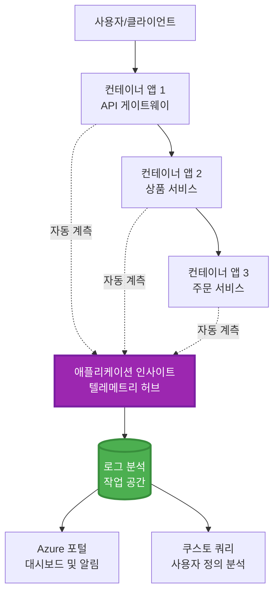
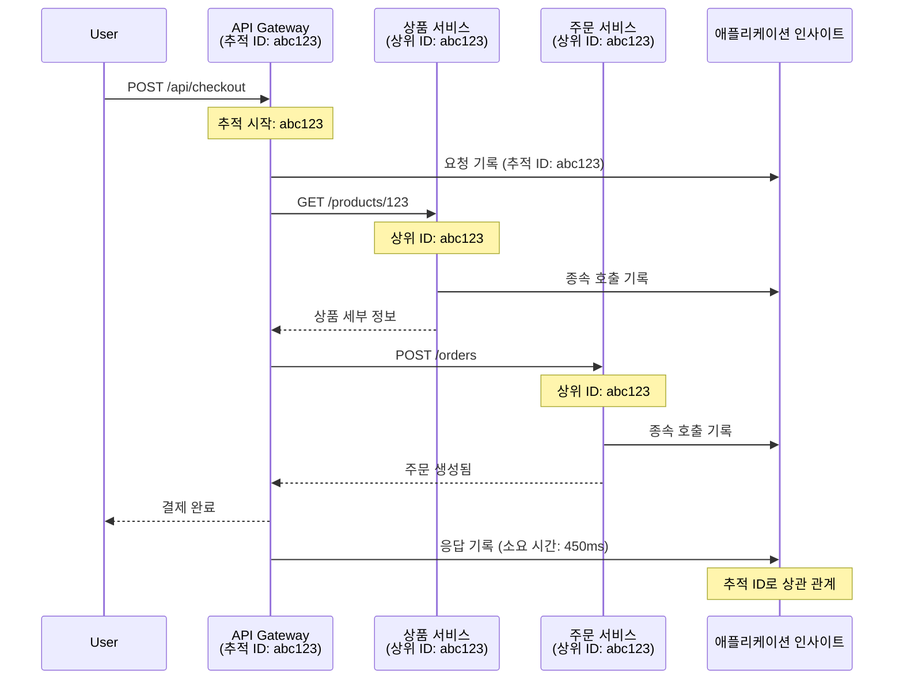

<!--
CO_OP_TRANSLATOR_METADATA:
{
  "original_hash": "e5aa37cdb6378c09099500ac31600b8c",
  "translation_date": "2025-11-19T21:47:05+00:00",
  "source_file": "docs/pre-deployment/application-insights.md",
  "language_code": "ko"
}
-->
# AZD와 Application Insights 통합

⏱️ **예상 소요 시간**: 40-50분 | 💰 **비용 영향**: 약 $5-15/월 | ⭐ **난이도**: 중급

**📚 학습 경로:**
- ← 이전: [사전 점검](preflight-checks.md) - 배포 전 검증
- 🎯 **현재 위치**: Application Insights 통합 (모니터링, 텔레메트리, 디버깅)
- → 다음: [배포 가이드](../deployment/deployment-guide.md) - Azure로 배포
- 🏠 [코스 홈](../../README.md)

---

## 학습 목표

이 강의를 완료하면 다음을 배울 수 있습니다:
- **Application Insights**를 AZD 프로젝트에 자동으로 통합
- 마이크로서비스를 위한 **분산 추적** 구성
- **사용자 정의 텔레메트리** 구현 (메트릭, 이벤트, 종속성)
- 실시간 모니터링을 위한 **라이브 메트릭** 설정
- AZD 배포에서 **알림 및 대시보드** 생성
- **텔레메트리 쿼리**로 프로덕션 문제 디버깅
- **비용 및 샘플링** 전략 최적화
- **AI/LLM 애플리케이션** 모니터링 (토큰, 지연 시간, 비용)

## AZD와 Application Insights의 중요성

### 도전 과제: 프로덕션 가시성

**Application Insights가 없는 경우:**
```
❌ No visibility into production behavior
❌ Manual log aggregation across services
❌ Reactive debugging (wait for customer complaints)
❌ No performance metrics
❌ Cannot trace requests across services
❌ Unknown failure rates and bottlenecks
```

**Application Insights + AZD가 있는 경우:**
```
✅ Automatic telemetry collection
✅ Centralized logs from all services
✅ Proactive issue detection
✅ End-to-end request tracing
✅ Performance metrics and insights
✅ Real-time dashboards
✅ AZD provisions everything automatically
```

**비유**: Application Insights는 애플리케이션의 "블랙박스" 비행 기록 장치 + 조종석 대시보드와 같습니다. 실시간으로 모든 상황을 확인하고, 어떤 사고든 재생할 수 있습니다.

---

## 아키텍처 개요

### AZD 아키텍처에서의 Application Insights


### 자동으로 모니터링되는 항목

| 텔레메트리 유형 | 캡처 내용 | 사용 사례 |
|----------------|----------|----------|
| **요청** | HTTP 요청, 상태 코드, 지속 시간 | API 성능 모니터링 |
| **종속성** | 외부 호출 (DB, API, 스토리지) | 병목 현상 식별 |
| **예외** | 스택 추적이 포함된 처리되지 않은 오류 | 실패 디버깅 |
| **사용자 정의 이벤트** | 비즈니스 이벤트 (가입, 구매) | 분석 및 퍼널 |
| **메트릭** | 성능 카운터, 사용자 정의 메트릭 | 용량 계획 |
| **추적** | 심각도가 포함된 로그 메시지 | 디버깅 및 감사 |
| **가용성** | 가동 시간 및 응답 시간 테스트 | SLA 모니터링 |

---

## 사전 준비 사항

### 필수 도구

```bash
# Azure Developer CLI 확인
azd version
# ✅ 예상: azd 버전 1.0.0 이상

# Azure CLI 확인
az --version
# ✅ 예상: azure-cli 2.50.0 이상
```

### Azure 요구 사항

- 활성 Azure 구독
- 다음을 생성할 수 있는 권한:
  - Application Insights 리소스
  - Log Analytics 작업 영역
  - 컨테이너 앱
  - 리소스 그룹

### 사전 지식

다음을 완료했어야 합니다:
- [AZD 기본 사항](../getting-started/azd-basics.md) - AZD 핵심 개념
- [구성](../getting-started/configuration.md) - 환경 설정
- [첫 번째 프로젝트](../getting-started/first-project.md) - 기본 배포

---

## 1단계: AZD로 Application Insights 자동화

### AZD가 Application Insights를 프로비저닝하는 방법

AZD는 배포 시 Application Insights를 자동으로 생성하고 구성합니다. 작동 방식을 살펴보겠습니다.

### 프로젝트 구조

```
monitored-app/
├── azure.yaml                     # AZD configuration
├── infra/
│   ├── main.bicep                # Main infrastructure
│   ├── core/
│   │   └── monitoring.bicep      # Application Insights + Log Analytics
│   └── app/
│       └── api.bicep             # Container App with monitoring
└── src/
    ├── app.py                    # Application with telemetry
    ├── requirements.txt
    └── Dockerfile
```

---

### 1단계: AZD 구성 (azure.yaml)

**파일: `azure.yaml`**

```yaml
name: monitored-app
metadata:
  template: monitored-app@1.0.0

services:
  api:
    project: ./src
    language: python
    host: containerapp

# AZD automatically provisions monitoring!
```

**끝입니다!** AZD는 기본 모니터링을 위해 기본적으로 Application Insights를 생성합니다. 추가 구성은 필요하지 않습니다.

---

### 2단계: 모니터링 인프라 (Bicep)

**파일: `infra/core/monitoring.bicep`**

```bicep
param logAnalyticsName string
param applicationInsightsName string
param location string = resourceGroup().location
param tags object = {}

// Log Analytics Workspace (required for Application Insights)
resource logAnalytics 'Microsoft.OperationalInsights/workspaces@2022-10-01' = {
  name: logAnalyticsName
  location: location
  tags: tags
  properties: {
    sku: {
      name: 'PerGB2018'  // Pay-as-you-go pricing
    }
    retentionInDays: 30  // Keep logs for 30 days
    features: {
      enableLogAccessUsingOnlyResourcePermissions: true
    }
  }
}

// Application Insights
resource applicationInsights 'Microsoft.Insights/components@2020-02-02' = {
  name: applicationInsightsName
  location: location
  tags: tags
  kind: 'web'
  properties: {
    Application_Type: 'web'
    WorkspaceResourceId: logAnalytics.id
    IngestionMode: 'LogAnalytics'
    publicNetworkAccessForIngestion: 'Enabled'
    publicNetworkAccessForQuery: 'Enabled'
  }
}

// Outputs for Container Apps
output logAnalyticsWorkspaceId string = logAnalytics.id
output logAnalyticsWorkspaceName string = logAnalytics.name
output applicationInsightsConnectionString string = applicationInsights.properties.ConnectionString
output applicationInsightsInstrumentationKey string = applicationInsights.properties.InstrumentationKey
output applicationInsightsName string = applicationInsights.name
```

---

### 3단계: 컨테이너 앱을 Application Insights에 연결

**파일: `infra/app/api.bicep`**

```bicep
param name string
param location string
param tags object = {}
param containerAppsEnvironmentName string
param applicationInsightsConnectionString string

resource containerApp 'Microsoft.App/containerApps@2023-05-01' = {
  name: name
  location: location
  tags: tags
  properties: {
    configuration: {
      ingress: {
        external: true
        targetPort: 8000
      }
      secrets: [
        {
          name: 'appinsights-connection-string'
          value: applicationInsightsConnectionString
        }
      ]
    }
    template: {
      containers: [
        {
          name: 'api'
          image: 'myregistry.azurecr.io/api:latest'
          resources: {
            cpu: json('0.5')
            memory: '1Gi'
          }
          env: [
            {
              name: 'APPLICATIONINSIGHTS_CONNECTION_STRING'
              secretRef: 'appinsights-connection-string'
            }
            {
              name: 'APPLICATIONINSIGHTS_ENABLED'
              value: 'true'
            }
          ]
        }
      ]
    }
  }
}

output uri string = 'https://${containerApp.properties.configuration.ingress.fqdn}'
```

---

### 4단계: 텔레메트리가 포함된 애플리케이션 코드

**파일: `src/app.py`**

```python
from flask import Flask, request, jsonify
from opencensus.ext.azure.log_exporter import AzureLogHandler
from opencensus.ext.azure.trace_exporter import AzureExporter
from opencensus.ext.flask.flask_middleware import FlaskMiddleware
from opencensus.trace.samplers import ProbabilitySampler
import logging
import os

app = Flask(__name__)

# 애플리케이션 인사이트 연결 문자열 가져오기
connection_string = os.environ.get('APPLICATIONINSIGHTS_CONNECTION_STRING')

if connection_string:
    # 분산 추적 구성
    middleware = FlaskMiddleware(
        app,
        exporter=AzureExporter(connection_string=connection_string),
        sampler=ProbabilitySampler(rate=1.0)  # 개발 환경에서 100% 샘플링
    )
    
    # 로깅 구성
    logger = logging.getLogger(__name__)
    logger.addHandler(AzureLogHandler(connection_string=connection_string))
    logger.setLevel(logging.INFO)
    
    print("✅ Application Insights enabled")
else:
    logger = logging.getLogger(__name__)
    logger.setLevel(logging.INFO)
    print("⚠️ Application Insights not configured")

@app.route('/health')
def health():
    logger.info('Health check endpoint called')
    return jsonify({'status': 'healthy', 'monitoring': 'enabled'})

@app.route('/api/products')
def get_products():
    logger.info('Fetching products')
    
    # 데이터베이스 호출 시뮬레이션 (종속성으로 자동 추적됨)
    products = [
        {'id': 1, 'name': 'Laptop', 'price': 999.99},
        {'id': 2, 'name': 'Mouse', 'price': 29.99},
        {'id': 3, 'name': 'Keyboard', 'price': 79.99}
    ]
    
    logger.info(f'Returned {len(products)} products')
    return jsonify(products)

@app.route('/api/error-test')
def error_test():
    """Test error tracking"""
    logger.error('Testing error tracking')
    try:
        raise ValueError('This is a test exception')
    except Exception as e:
        logger.exception('Exception occurred in error-test endpoint')
        return jsonify({'error': str(e)}), 500

@app.route('/api/slow')
def slow_endpoint():
    """Test performance tracking"""
    import time
    logger.info('Slow endpoint called')
    time.sleep(3)  # 느린 작업 시뮬레이션
    logger.warning('Endpoint took 3 seconds to respond')
    return jsonify({'message': 'Slow operation completed'})

if __name__ == '__main__':
    app.run(host='0.0.0.0', port=8000)
```

**파일: `src/requirements.txt`**

```txt
Flask==3.0.0
opencensus-ext-azure==1.1.13
opencensus-ext-flask==0.8.1
gunicorn==21.2.0
```

---

### 5단계: 배포 및 확인

```bash
# AZD 초기화
azd init

# 배포 (Application Insights를 자동으로 프로비저닝)
azd up

# 앱 URL 가져오기
APP_URL=$(azd env get-values | grep API_URL | cut -d '=' -f2 | tr -d '"')

# 텔레메트리 생성
curl $APP_URL/health
curl $APP_URL/api/products
curl $APP_URL/api/error-test
curl $APP_URL/api/slow
```

**✅ 예상 출력:**
```json
{
  "status": "healthy",
  "monitoring": "enabled"
}
```

---

### 6단계: Azure 포털에서 텔레메트리 보기

```bash
# 애플리케이션 인사이트 세부정보 가져오기
azd env get-values | grep APPLICATIONINSIGHTS

# Azure 포털에서 열기
az monitor app-insights component show \
  --app $(azd env get-values | grep APPLICATIONINSIGHTS_NAME | cut -d '=' -f2 | tr -d '"') \
  --resource-group $(azd env get-values | grep AZURE_RESOURCE_GROUP | cut -d '=' -f2 | tr -d '"') \
  --query "appId" -o tsv
```

**Azure 포털 → Application Insights → 트랜잭션 검색**으로 이동

다음을 확인할 수 있습니다:
- ✅ 상태 코드가 포함된 HTTP 요청
- ✅ 요청 지속 시간 (`/api/slow`의 경우 3초 이상)
- ✅ `/api/error-test`의 예외 세부 정보
- ✅ 사용자 정의 로그 메시지

---

## 2단계: 사용자 정의 텔레메트리 및 이벤트

### 비즈니스 이벤트 추적

비즈니스에 중요한 이벤트를 위한 사용자 정의 텔레메트리를 추가해 봅시다.

**파일: `src/telemetry.py`**

```python
from opencensus.ext.azure import metrics_exporter
from opencensus.stats import aggregation as aggregation_module
from opencensus.stats import measure as measure_module
from opencensus.stats import stats as stats_module
from opencensus.stats import view as view_module
from opencensus.tags import tag_map as tag_map_module
from opencensus.ext.azure.log_exporter import AzureLogHandler
from opencensus.ext.azure.trace_exporter import AzureExporter
from opencensus.trace import tracer as tracer_module
import logging
import os

class TelemetryClient:
    """Custom telemetry client for Application Insights"""
    
    def __init__(self, connection_string=None):
        self.connection_string = connection_string or os.environ.get('APPLICATIONINSIGHTS_CONNECTION_STRING')
        
        if not self.connection_string:
            print("⚠️ Application Insights connection string not found")
            return
        
        # 로거 설정
        self.logger = logging.getLogger(__name__)
        self.logger.addHandler(AzureLogHandler(connection_string=self.connection_string))
        self.logger.setLevel(logging.INFO)
        
        # 메트릭스 익스포터 설정
        self.stats = stats_module.stats
        self.view_manager = self.stats.view_manager
        self.stats_recorder = self.stats.stats_recorder
        
        exporter = metrics_exporter.new_metrics_exporter(
            connection_string=self.connection_string
        )
        self.view_manager.register_exporter(exporter)
        
        # 트레이서 설정
        self.tracer = tracer_module.Tracer(
            exporter=AzureExporter(connection_string=self.connection_string)
        )
        
        print("✅ Custom telemetry client initialized")
    
    def track_event(self, event_name: str, properties: dict = None):
        """Track custom business event"""
        properties = properties or {}
        self.logger.info(
            f"CustomEvent: {event_name}",
            extra={
                'custom_dimensions': {
                    'event_name': event_name,
                    **properties
                }
            }
        )
    
    def track_metric(self, metric_name: str, value: float, properties: dict = None):
        """Track custom metric"""
        properties = properties or {}
        self.logger.info(
            f"CustomMetric: {metric_name} = {value}",
            extra={
                'custom_dimensions': {
                    'metric_name': metric_name,
                    'value': value,
                    **properties
                }
            }
        )
    
    def track_dependency(self, name: str, dependency_type: str, duration: float, success: bool):
        """Track external dependency call"""
        with self.tracer.span(name=name) as span:
            span.add_attribute('dependency.type', dependency_type)
            span.add_attribute('duration', duration)
            span.add_attribute('success', success)

# 글로벌 텔레메트리 클라이언트
telemetry = TelemetryClient()
```

### 사용자 정의 이벤트로 애플리케이션 업데이트

**파일: `src/app.py` (향상된 버전)**

```python
from flask import Flask, request, jsonify
from telemetry import telemetry
import time
import random

app = Flask(__name__)

@app.route('/api/purchase', methods=['POST'])
def purchase():
    """Track purchase event with custom telemetry"""
    data = request.json
    product_id = data.get('product_id')
    quantity = data.get('quantity', 1)
    price = data.get('price', 0)
    
    # 비즈니스 이벤트 추적
    telemetry.track_event('Purchase', {
        'product_id': product_id,
        'quantity': quantity,
        'total_amount': price * quantity,
        'user_id': request.headers.get('X-User-Id', 'anonymous')
    })
    
    # 수익 지표 추적
    telemetry.track_metric('Revenue', price * quantity, {
        'product_id': product_id,
        'currency': 'USD'
    })
    
    return jsonify({
        'order_id': f'ORD-{random.randint(1000, 9999)}',
        'status': 'confirmed',
        'total': price * quantity
    })

@app.route('/api/search')
def search():
    """Track search queries"""
    query = request.args.get('q', '')
    
    start_time = time.time()
    
    # 검색 시뮬레이션 (실제 데이터베이스 쿼리일 것임)
    results = [{'id': 1, 'name': f'Result for {query}'}]
    
    duration = (time.time() - start_time) * 1000  # 밀리초로 변환
    
    # 검색 이벤트 추적
    telemetry.track_event('Search', {
        'query': query,
        'results_count': len(results),
        'duration_ms': duration
    })
    
    # 검색 성능 지표 추적
    telemetry.track_metric('SearchDuration', duration, {
        'query_length': len(query)
    })
    
    return jsonify({'results': results, 'count': len(results)})

@app.route('/api/external-call')
def external_call():
    """Track external API dependency"""
    import requests
    
    start_time = time.time()
    success = True
    
    try:
        # 외부 API 호출 시뮬레이션
        response = requests.get('https://api.example.com/data', timeout=5)
        result = response.json()
    except Exception as e:
        success = False
        result = {'error': str(e)}
    
    duration = (time.time() - start_time) * 1000
    
    # 종속성 추적
    telemetry.track_dependency(
        name='ExternalAPI',
        dependency_type='HTTP',
        duration=duration,
        success=success
    )
    
    return jsonify(result)

if __name__ == '__main__':
    app.run(host='0.0.0.0', port=8000)
```

### 사용자 정의 텔레메트리 테스트

```bash
# 구매 이벤트 추적
curl -X POST $APP_URL/api/purchase \
  -H "Content-Type: application/json" \
  -H "X-User-Id: user123" \
  -d '{"product_id": 1, "quantity": 2, "price": 29.99}'

# 검색 이벤트 추적
curl "$APP_URL/api/search?q=laptop"

# 외부 종속성 추적
curl $APP_URL/api/external-call
```

**Azure 포털에서 보기:**

Application Insights → 로그로 이동한 후 다음을 실행:

```kusto
// View purchase events
traces
| where customDimensions.event_name == "Purchase"
| project 
    timestamp,
    product_id = tostring(customDimensions.product_id),
    total_amount = todouble(customDimensions.total_amount),
    user_id = tostring(customDimensions.user_id)
| order by timestamp desc

// View revenue metrics
traces
| where customDimensions.metric_name == "Revenue"
| summarize TotalRevenue = sum(todouble(customDimensions.value)) by bin(timestamp, 1h)
| render timechart

// View search performance
traces
| where customDimensions.event_name == "Search"
| summarize 
    AvgDuration = avg(todouble(customDimensions.duration_ms)),
    SearchCount = count()
  by bin(timestamp, 5m)
| render timechart
```

---

## 3단계: 마이크로서비스를 위한 분산 추적

### 교차 서비스 추적 활성화

마이크로서비스의 경우, Application Insights는 서비스 간 요청을 자동으로 상관시킵니다.

**파일: `infra/main.bicep`**

```bicep
targetScope = 'subscription'

param environmentName string
param location string = 'eastus'

var tags = { 'azd-env-name': environmentName }

resource rg 'Microsoft.Resources/resourceGroups@2021-04-01' = {
  name: 'rg-${environmentName}'
  location: location
  tags: tags
}

// Monitoring (shared by all services)
module monitoring './core/monitoring.bicep' = {
  name: 'monitoring'
  scope: rg
  params: {
    logAnalyticsName: 'log-${environmentName}'
    applicationInsightsName: 'appi-${environmentName}'
    location: location
    tags: tags
  }
}

// API Gateway
module apiGateway './app/api-gateway.bicep' = {
  name: 'api-gateway'
  scope: rg
  params: {
    name: 'ca-gateway-${environmentName}'
    location: location
    tags: union(tags, { 'azd-service-name': 'gateway' })
    applicationInsightsConnectionString: monitoring.outputs.applicationInsightsConnectionString
  }
}

// Product Service
module productService './app/product-service.bicep' = {
  name: 'product-service'
  scope: rg
  params: {
    name: 'ca-products-${environmentName}'
    location: location
    tags: union(tags, { 'azd-service-name': 'products' })
    applicationInsightsConnectionString: monitoring.outputs.applicationInsightsConnectionString
  }
}

// Order Service
module orderService './app/order-service.bicep' = {
  name: 'order-service'
  scope: rg
  params: {
    name: 'ca-orders-${environmentName}'
    location: location
    tags: union(tags, { 'azd-service-name': 'orders' })
    applicationInsightsConnectionString: monitoring.outputs.applicationInsightsConnectionString
  }
}

output APPLICATIONINSIGHTS_CONNECTION_STRING string = monitoring.outputs.applicationInsightsConnectionString
output GATEWAY_URL string = apiGateway.outputs.uri
```

### 엔드 투 엔드 트랜잭션 보기


**엔드 투 엔드 추적 쿼리:**

```kusto
// Find complete request flow
let traceId = "abc123...";  // Get from response header
dependencies
| union requests
| where operation_Id == traceId
| project 
    timestamp,
    type = itemType,
    name,
    duration,
    success,
    cloud_RoleName
| order by timestamp asc
```

---

## 4단계: 라이브 메트릭 및 실시간 모니터링

### 라이브 메트릭 스트림 활성화

라이브 메트릭은 <1초 지연 시간으로 실시간 텔레메트리를 제공합니다.

**라이브 메트릭 액세스:**

```bash
# 애플리케이션 인사이트 리소스 가져오기
APPI_NAME=$(azd env get-values | grep APPLICATIONINSIGHTS_NAME | cut -d '=' -f2 | tr -d '"')

# 리소스 그룹 가져오기
RG_NAME=$(azd env get-values | grep AZURE_RESOURCE_GROUP | cut -d '=' -f2 | tr -d '"')

echo "Navigate to: Azure Portal → Resource Groups → $RG_NAME → $APPI_NAME → Live Metrics"
```

**실시간으로 확인할 수 있는 항목:**
- ✅ 들어오는 요청 속도 (요청/초)
- ✅ 나가는 종속성 호출
- ✅ 예외 수
- ✅ CPU 및 메모리 사용량
- ✅ 활성 서버 수
- ✅ 샘플 텔레메트리

### 테스트를 위한 부하 생성

```bash
# 라이브 메트릭을 보기 위해 부하를 생성합니다
for i in {1..100}; do
  curl $APP_URL/api/products &
  curl $APP_URL/api/search?q=test$i &
done

# Azure 포털에서 라이브 메트릭을 확인하세요
# 요청 속도가 급증하는 것을 볼 수 있어야 합니다
```

---

## 실습 과제

### 과제 1: 알림 설정 ⭐⭐ (중급)

**목표**: 높은 오류율 및 느린 응답에 대한 알림 생성

**단계:**

1. **오류율에 대한 알림 생성:**

```bash
# 애플리케이션 인사이트 리소스 ID 가져오기
APPI_ID=$(az monitor app-insights component show \
  --app $APPI_NAME \
  --resource-group $RG_NAME \
  --query "id" -o tsv)

# 실패한 요청에 대한 메트릭 경고 생성
az monitor metrics alert create \
  --name "High-Error-Rate" \
  --resource-group $RG_NAME \
  --scopes $APPI_ID \
  --condition "count requests/failed > 10" \
  --window-size 5m \
  --evaluation-frequency 1m \
  --description "Alert when error rate exceeds 10 per 5 minutes"
```

2. **느린 응답에 대한 알림 생성:**

```bash
az monitor metrics alert create \
  --name "Slow-Responses" \
  --resource-group $RG_NAME \
  --scopes $APPI_ID \
  --condition "avg requests/duration > 3000" \
  --window-size 5m \
  --evaluation-frequency 1m \
  --description "Alert when average response time exceeds 3 seconds"
```

3. **Bicep을 통한 알림 생성 (AZD에 권장):**

**파일: `infra/core/alerts.bicep`**

```bicep
param applicationInsightsId string
param actionGroupId string = ''
param location string = resourceGroup().location

// High error rate alert
resource errorRateAlert 'Microsoft.Insights/metricAlerts@2018-03-01' = {
  name: 'high-error-rate'
  location: 'global'
  properties: {
    description: 'Alert when error rate exceeds threshold'
    severity: 2
    enabled: true
    scopes: [
      applicationInsightsId
    ]
    evaluationFrequency: 'PT1M'
    windowSize: 'PT5M'
    criteria: {
      'odata.type': 'Microsoft.Azure.Monitor.SingleResourceMultipleMetricCriteria'
      allOf: [
        {
          name: 'Error rate'
          metricName: 'requests/failed'
          operator: 'GreaterThan'
          threshold: 10
          timeAggregation: 'Count'
        }
      ]
    }
    actions: actionGroupId != '' ? [
      {
        actionGroupId: actionGroupId
      }
    ] : []
  }
}

// Slow response alert
resource slowResponseAlert 'Microsoft.Insights/metricAlerts@2018-03-01' = {
  name: 'slow-responses'
  location: 'global'
  properties: {
    description: 'Alert when response time is too high'
    severity: 3
    enabled: true
    scopes: [
      applicationInsightsId
    ]
    evaluationFrequency: 'PT1M'
    windowSize: 'PT5M'
    criteria: {
      'odata.type': 'Microsoft.Azure.Monitor.SingleResourceMultipleMetricCriteria'
      allOf: [
        {
          name: 'Response duration'
          metricName: 'requests/duration'
          operator: 'GreaterThan'
          threshold: 3000
          timeAggregation: 'Average'
        }
      ]
    }
  }
}

output errorAlertId string = errorRateAlert.id
output slowResponseAlertId string = slowResponseAlert.id
```

4. **알림 테스트:**

```bash
# 오류 생성
for i in {1..20}; do
  curl $APP_URL/api/error-test
done

# 느린 응답 생성
for i in {1..10}; do
  curl $APP_URL/api/slow
done

# 경고 상태 확인 (5-10분 대기)
az monitor metrics alert list \
  --resource-group $RG_NAME \
  --query "[].{Name:name, Enabled:enabled, State:properties.enabled}" \
  --output table
```

**✅ 성공 기준:**
- ✅ 알림이 성공적으로 생성됨
- ✅ 임계값 초과 시 알림 발생
- ✅ Azure 포털에서 알림 기록 확인 가능
- ✅ AZD 배포와 통합됨

**시간**: 20-25분

---

### 과제 2: 사용자 정의 대시보드 생성 ⭐⭐ (중급)

**목표**: 주요 애플리케이션 메트릭을 보여주는 대시보드 생성

**단계:**

1. **Azure 포털에서 대시보드 생성:**

Azure 포털 → 대시보드 → 새 대시보드로 이동

2. **주요 메트릭에 대한 타일 추가:**

- 요청 수 (지난 24시간)
- 평균 응답 시간
- 오류율
- 가장 느린 작업 상위 5개
- 사용자 지리적 분포

3. **Bicep을 통한 대시보드 생성:**

**파일: `infra/core/dashboard.bicep`**

```bicep
param dashboardName string
param applicationInsightsId string
param location string = resourceGroup().location

resource dashboard 'Microsoft.Portal/dashboards@2020-09-01-preview' = {
  name: dashboardName
  location: location
  properties: {
    lenses: [
      {
        order: 0
        parts: [
          // Request count
          {
            position: { x: 0, y: 0, rowSpan: 4, colSpan: 6 }
            metadata: {
              type: 'Extension/Microsoft_OperationsManagementSuite_Workspace/PartType/LogsDashboardPart'
              inputs: [
                {
                  name: 'resourceId'
                  value: applicationInsightsId
                }
                {
                  name: 'query'
                  value: '''
                    requests
                    | summarize RequestCount = count() by bin(timestamp, 1h)
                    | render timechart
                  '''
                }
              ]
            }
          }
          // Error rate
          {
            position: { x: 6, y: 0, rowSpan: 4, colSpan: 6 }
            metadata: {
              type: 'Extension/Microsoft_OperationsManagementSuite_Workspace/PartType/LogsDashboardPart'
              inputs: [
                {
                  name: 'resourceId'
                  value: applicationInsightsId
                }
                {
                  name: 'query'
                  value: '''
                    requests
                    | summarize 
                        Total = count(),
                        Failed = countif(success == false)
                    | extend ErrorRate = (Failed * 100.0) / Total
                    | project ErrorRate
                  '''
                }
              ]
            }
          }
        ]
      }
    ]
  }
}

output dashboardId string = dashboard.id
```

4. **대시보드 배포:**

```bash
# main.bicep에 추가
module dashboard './core/dashboard.bicep' = {
  name: 'dashboard'
  scope: rg
  params: {
    dashboardName: 'dashboard-${environmentName}'
    applicationInsightsId: monitoring.outputs.applicationInsightsId
    location: location
  }
}

# 배포
azd up
```

**✅ 성공 기준:**
- ✅ 대시보드에 주요 메트릭 표시
- ✅ Azure 포털 홈에 고정 가능
- ✅ 실시간으로 업데이트
- ✅ AZD를 통해 배포 가능

**시간**: 25-30분

---

### 과제 3: AI/LLM 애플리케이션 모니터링 ⭐⭐⭐ (고급)

**목표**: Azure OpenAI 사용량 (토큰, 비용, 지연 시간) 추적

**단계:**

1. **AI 모니터링 래퍼 생성:**

**파일: `src/ai_telemetry.py`**

```python
from telemetry import telemetry
from openai import AzureOpenAI
import time

class MonitoredAzureOpenAI:
    """Azure OpenAI client with automatic telemetry"""
    
    def __init__(self, api_key, endpoint, api_version="2024-02-01"):
        self.client = AzureOpenAI(
            api_key=api_key,
            api_version=api_version,
            azure_endpoint=endpoint
        )
    
    def chat_completion(self, model: str, messages: list, **kwargs):
        """Track chat completion with telemetry"""
        start_time = time.time()
        
        try:
            # Azure OpenAI 호출
            response = self.client.chat.completions.create(
                model=model,
                messages=messages,
                **kwargs
            )
            
            duration = (time.time() - start_time) * 1000  # ms
            
            # 사용량 추출
            usage = response.usage
            prompt_tokens = usage.prompt_tokens
            completion_tokens = usage.completion_tokens
            total_tokens = usage.total_tokens
            
            # 비용 계산 (GPT-4 가격 책정)
            prompt_cost = (prompt_tokens / 1000) * 0.03  # 1K 토큰당 $0.03
            completion_cost = (completion_tokens / 1000) * 0.06  # 1K 토큰당 $0.06
            total_cost = prompt_cost + completion_cost
            
            # 사용자 정의 이벤트 추적
            telemetry.track_event('OpenAI_Request', {
                'model': model,
                'prompt_tokens': prompt_tokens,
                'completion_tokens': completion_tokens,
                'total_tokens': total_tokens,
                'duration_ms': duration,
                'cost_usd': total_cost,
                'success': True
            })
            
            # 메트릭 추적
            telemetry.track_metric('OpenAI_Tokens', total_tokens, {
                'model': model,
                'type': 'total'
            })
            
            telemetry.track_metric('OpenAI_Cost', total_cost, {
                'model': model,
                'currency': 'USD'
            })
            
            telemetry.track_metric('OpenAI_Duration', duration, {
                'model': model
            })
            
            return response
            
        except Exception as e:
            duration = (time.time() - start_time) * 1000
            
            telemetry.track_event('OpenAI_Request', {
                'model': model,
                'duration_ms': duration,
                'success': False,
                'error': str(e)
            })
            
            raise
```

2. **모니터링된 클라이언트 사용:**

```python
from flask import Flask, request, jsonify
from ai_telemetry import MonitoredAzureOpenAI
import os

app = Flask(__name__)

# 모니터링된 OpenAI 클라이언트 초기화
openai_client = MonitoredAzureOpenAI(
    api_key=os.environ['AZURE_OPENAI_API_KEY'],
    endpoint=os.environ['AZURE_OPENAI_ENDPOINT']
)

@app.route('/api/chat', methods=['POST'])
def chat():
    data = request.json
    user_message = data.get('message')
    
    # 자동 모니터링으로 호출
    response = openai_client.chat_completion(
        model='gpt-4',
        messages=[
            {'role': 'user', 'content': user_message}
        ]
    )
    
    return jsonify({
        'response': response.choices[0].message.content,
        'tokens': response.usage.total_tokens
    })
```

3. **AI 메트릭 쿼리:**

```kusto
// Total AI spend over time
traces
| where customDimensions.event_name == "OpenAI_Request"
| where customDimensions.success == "True"
| summarize TotalCost = sum(todouble(customDimensions.cost_usd)) by bin(timestamp, 1h)
| render timechart

// Token usage by model
traces
| where customDimensions.event_name == "OpenAI_Request"
| summarize 
    TotalTokens = sum(toint(customDimensions.total_tokens)),
    RequestCount = count()
  by Model = tostring(customDimensions.model)

// Average latency
traces
| where customDimensions.event_name == "OpenAI_Request"
| summarize AvgDuration = avg(todouble(customDimensions.duration_ms))
| project AvgDurationSeconds = AvgDuration / 1000

// Cost per request
traces
| where customDimensions.event_name == "OpenAI_Request"
| extend Cost = todouble(customDimensions.cost_usd)
| summarize 
    TotalCost = sum(Cost),
    RequestCount = count(),
    AvgCostPerRequest = avg(Cost)
```

**✅ 성공 기준:**
- ✅ 모든 OpenAI 호출이 자동으로 추적됨
- ✅ 토큰 사용량 및 비용 확인 가능
- ✅ 지연 시간 모니터링
- ✅ 예산 알림 설정 가능

**시간**: 35-45분

---

## 비용 최적화

### 샘플링 전략

텔레메트리를 샘플링하여 비용을 제어:

```python
from opencensus.trace.samplers import ProbabilitySampler

# 개발: 100% 샘플링
sampler = ProbabilitySampler(rate=1.0)

# 프로덕션: 10% 샘플링 (비용을 90% 절감)
sampler = ProbabilitySampler(rate=0.1)

# 적응형 샘플링 (자동으로 조정)
from opencensus.trace.samplers import AdaptiveSampler
sampler = AdaptiveSampler()
```

**Bicep에서:**

```bicep
resource applicationInsights 'Microsoft.Insights/components@2020-02-02' = {
  name: applicationInsightsName
  properties: {
    SamplingPercentage: 10  // 10% sampling
  }
}
```

### 데이터 보존

```bicep
resource logAnalytics 'Microsoft.OperationalInsights/workspaces@2022-10-01' = {
  name: logAnalyticsName
  properties: {
    retentionInDays: 30  // Minimum (cheapest)
    // Options: 30, 31, 60, 90, 120, 180, 270, 365, 550, 730
  }
}
```

### 월별 비용 추정

| 데이터 볼륨 | 보존 기간 | 월별 비용 |
|-------------|-----------|----------|
| 1 GB/월 | 30일 | 약 $2-5 |
| 5 GB/월 | 30일 | 약 $10-15 |
| 10 GB/월 | 90일 | 약 $25-40 |
| 50 GB/월 | 90일 | 약 $100-150 |

**무료 등급**: 5 GB/월 포함

---

## 지식 점검

### 1. 기본 통합 ✓

이해도를 테스트하세요:

- [ ] **Q1**: AZD는 Application Insights를 어떻게 프로비저닝하나요?
  - **A**: `infra/core/monitoring.bicep`의 Bicep 템플릿을 통해 자동으로

- [ ] **Q2**: Application Insights를 활성화하는 환경 변수는 무엇인가요?
  - **A**: `APPLICATIONINSIGHTS_CONNECTION_STRING`

- [ ] **Q3**: 주요 텔레메트리 유형 세 가지는 무엇인가요?
  - **A**: 요청 (HTTP 호출), 종속성 (외부 호출), 예외 (오류)

**실습 확인:**
```bash
# Application Insights가 구성되었는지 확인
azd env get-values | grep APPLICATIONINSIGHTS

# 원격 측정 데이터가 흐르고 있는지 확인
az monitor app-insights metrics show \
  --app $APPI_NAME \
  --resource-group $RG_NAME \
  --metric "requests/count"
```

---

### 2. 사용자 정의 텔레메트리 ✓

이해도를 테스트하세요:

- [ ] **Q1**: 사용자 정의 비즈니스 이벤트를 어떻게 추적하나요?
  - **A**: `custom_dimensions`가 포함된 로거 또는 `TelemetryClient.track_event()` 사용

- [ ] **Q2**: 이벤트와 메트릭의 차이점은 무엇인가요?
  - **A**: 이벤트는 개별 발생, 메트릭은 숫자 측정값

- [ ] **Q3**: 서비스 간 텔레메트리를 어떻게 상관시키나요?
  - **A**: Application Insights는 자동으로 `operation_Id`를 사용하여 상관시킴

**실습 확인:**
```kusto
// Verify custom events
traces
| where customDimensions.event_name != ""
| summarize count() by tostring(customDimensions.event_name)
```

---

### 3. 프로덕션 모니터링 ✓

이해도를 테스트하세요:

- [ ] **Q1**: 샘플링이란 무엇이며 왜 사용하나요?
  - **A**: 샘플링은 텔레메트리의 일부만 캡처하여 데이터 볼륨 (및 비용)을 줄임

- [ ] **Q2**: 알림을 어떻게 설정하나요?
  - **A**: Application Insights 메트릭을 기반으로 Bicep 또는 Azure 포털에서 메트릭 알림 사용

- [ ] **Q3**: Log Analytics와 Application Insights의 차이점은 무엇인가요?
  - **A**: Application Insights는 데이터를 Log Analytics 작업 영역에 저장하며, App Insights는 애플리케이션별 뷰를 제공

**실습 확인:**
```bash
# 샘플링 구성 확인
az monitor app-insights component show \
  --app $APPI_NAME \
  --resource-group $RG_NAME \
  --query "properties.SamplingPercentage"
```

---

## 모범 사례

### ✅ 해야 할 일:

1. **상관 ID 사용**
   ```python
   logger.info('Processing order', extra={
       'custom_dimensions': {
           'order_id': order_id,
           'user_id': user_id
       }
   })
   ```

2. **중요 메트릭에 대한 알림 설정**
   ```bicep
   // Error rate, slow responses, availability
   ```

3. **구조화된 로깅 사용**
   ```python
   # ✅ 좋음: 구조화됨
   logger.info('User signup', extra={'custom_dimensions': {'user_id': 123}})
   
   # ❌ 나쁨: 비구조화됨
   logger.info(f'User 123 signed up')
   ```

4. **종속성 모니터링**
   ```python
   # 데이터베이스 호출, HTTP 요청 등을 자동으로 추적합니다.
   ```

5. **배포 중 라이브 메트릭 사용**

### ❌ 하지 말아야 할 일:

1. **민감한 데이터 로깅 금지**
   ```python
   # ❌ 나쁨
   logger.info(f'Login: {username}:{password}')
   
   # ✅ 좋음
   logger.info('Login attempt', extra={'custom_dimensions': {'username': username}})
   ```

2. **프로덕션에서 100% 샘플링 사용 금지**
   ```python
   # ❌ 비쌈
   sampler = ProbabilitySampler(rate=1.0)
   
   # ✅ 비용 효율적임
   sampler = ProbabilitySampler(rate=0.1)
   ```

3. **데드 레터 큐 무시 금지**

4. **데이터 보존 한도 설정 잊지 말기**

---

## 문제 해결

### 문제: 텔레메트리가 나타나지 않음

**진단:**
```bash
# 연결 문자열이 설정되었는지 확인
azd env get-values | grep APPLICATIONINSIGHTS

# 애플리케이션 로그를 확인
azd logs api --tail 50
```

**해결책:**
```bash
# 컨테이너 앱에서 연결 문자열 확인
az containerapp show \
  --name $APP_NAME \
  --resource-group $RG_NAME \
  --query "properties.template.containers[0].env" \
  | grep -i applicationinsights
```

---

### 문제: 높은 비용

**진단:**
```bash
# 데이터 수집 확인
az monitor app-insights metrics show \
  --app $APPI_NAME \
  --resource-group $RG_NAME \
  --metric "availabilityResults/count"
```

**해결책:**
- 샘플링 비율 줄이기
- 보존 기간 단축
- 자세한 로깅 제거

---

## 추가 학습

### 공식 문서
- [Application Insights 개요](https://learn.microsoft.com/azure/azure-monitor/app/app-insights-overview)
- [Python용 Application Insights](https://learn.microsoft.com/azure/azure-monitor/app/opencensus-python)
- [Kusto 쿼리 언어](https://learn.microsoft.com/azure/data-explorer/kusto/query/)
- [AZD 모니터링](https://learn.microsoft.com/azure/developer/azure-developer-cli/monitor-your-app)

### 이 코스의 다음 단계
- ← 이전: [사전 점검](preflight-checks.md)
- → 다음: [배포 가이드](../deployment/deployment-guide.md)
- 🏠 [코스 홈](../../README.md)

### 관련 예제
- [Azure OpenAI 예제](../../../../examples/azure-openai-chat) - AI 텔레메트리
- [마이크로서비스 예제](../../../../examples/microservices) - 분산 추적

---

## 요약

**배운 내용:**
- ✅ AZD를 사용한 Application Insights 자동 프로비저닝
- ✅ 사용자 정의 텔레메트리 (이벤트, 메트릭, 종속성)
- ✅ 마이크로서비스 간 분산 추적
- ✅ 라이브 메트릭 및 실시간 모니터링
- ✅ 알림 및 대시보드
- ✅ AI/LLM 애플리케이션 모니터링
- ✅ 비용 최적화 전략

**핵심 요약:**
1. **AZD가 모니터링을 자동으로 설정** - 수동 설정 불필요
2. **구조화된 로깅 사용** - 쿼리 작업이 더 쉬워짐
3. **비즈니스 이벤트 추적** - 기술적 지표뿐만 아니라
4. **AI 비용 모니터링** - 토큰과 지출 추적
5. **알림 설정** - 사후 대응이 아닌 사전 대응
6. **비용 최적화** - 샘플링 및 보존 한도 활용

**다음 단계:**
1. 실습 과제 완료
2. AZD 프로젝트에 Application Insights 추가
3. 팀을 위한 맞춤 대시보드 생성
4. [배포 가이드](../deployment/deployment-guide.md) 학습

---

<!-- CO-OP TRANSLATOR DISCLAIMER START -->
**면책 조항**:  
이 문서는 AI 번역 서비스 [Co-op Translator](https://github.com/Azure/co-op-translator)를 사용하여 번역되었습니다. 정확성을 위해 노력하고 있지만, 자동 번역에는 오류나 부정확성이 포함될 수 있습니다. 원본 문서의 원어 버전이 권위 있는 자료로 간주되어야 합니다. 중요한 정보의 경우, 전문적인 인간 번역을 권장합니다. 이 번역 사용으로 인해 발생하는 오해나 잘못된 해석에 대해 책임을 지지 않습니다.
<!-- CO-OP TRANSLATOR DISCLAIMER END -->