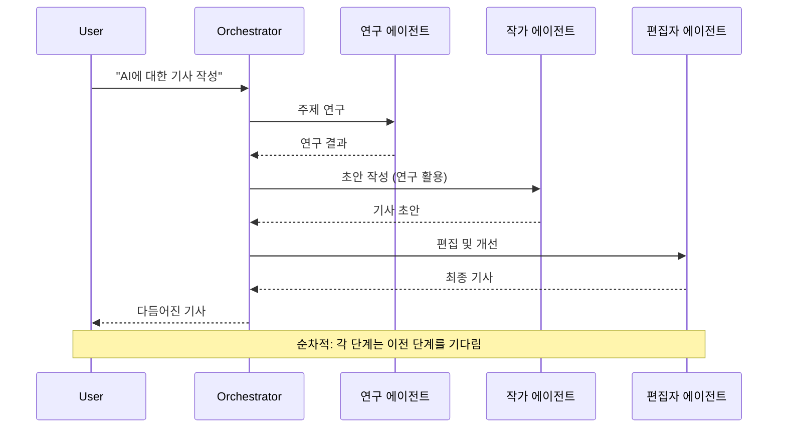
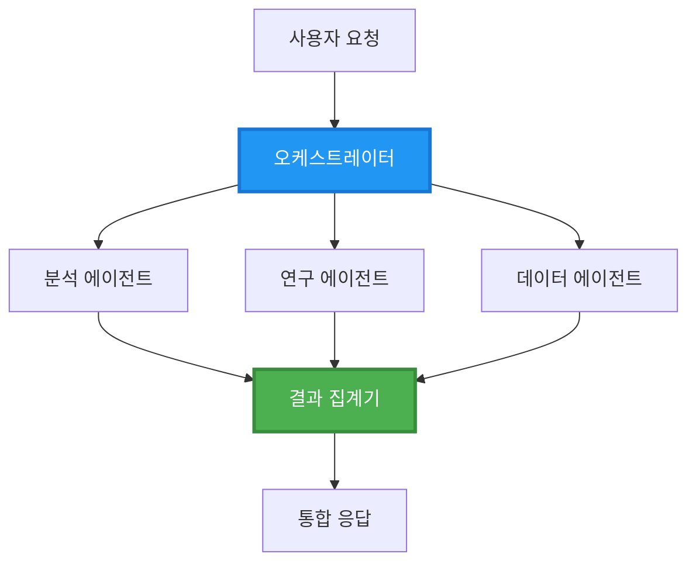
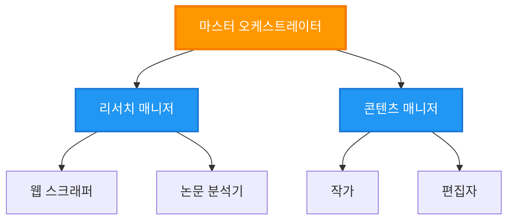
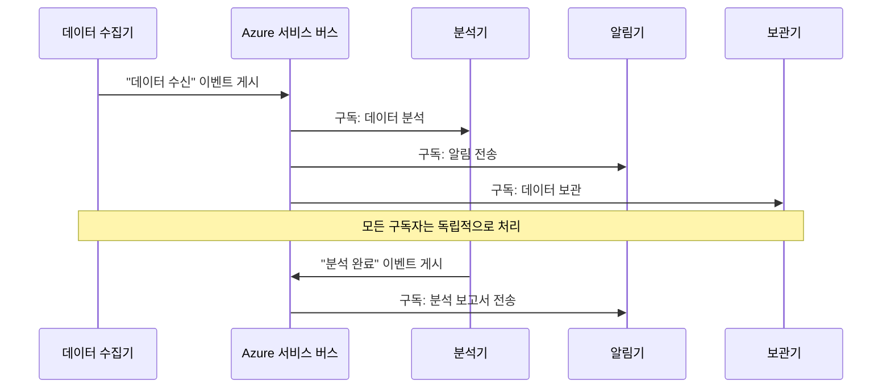
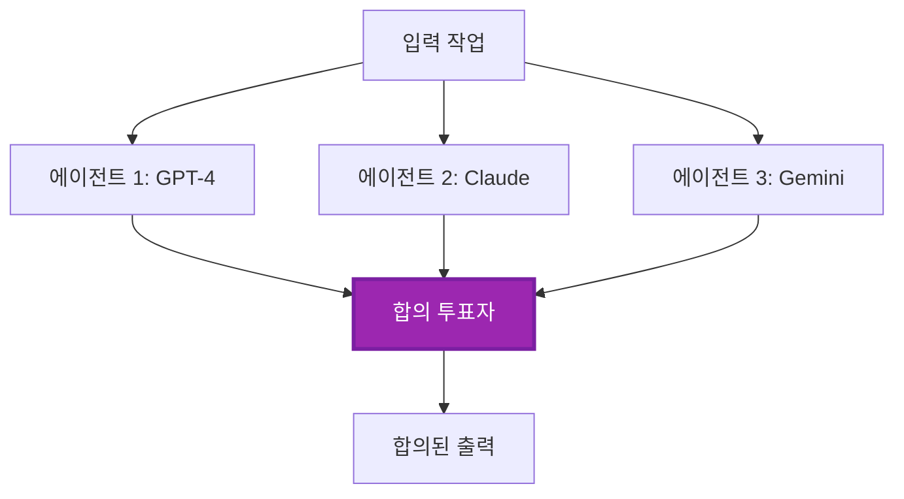
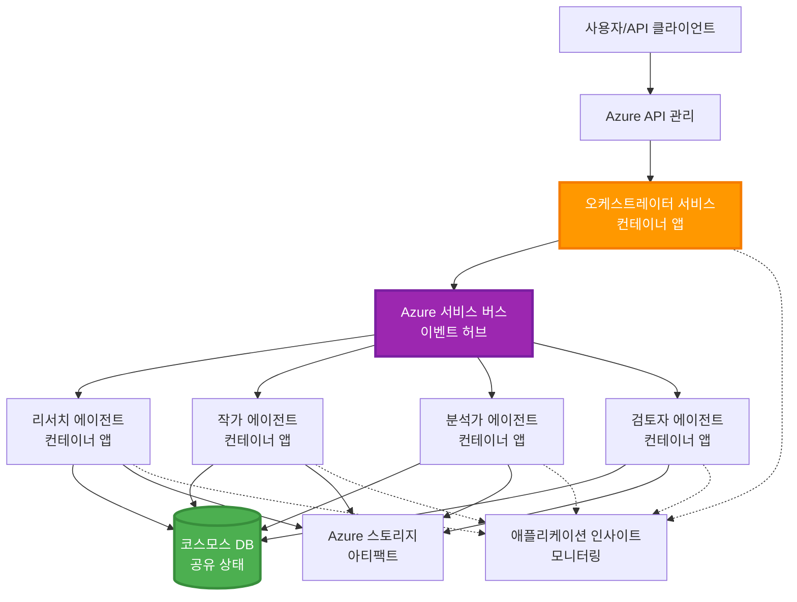

<!--
CO_OP_TRANSLATOR_METADATA:
{
  "original_hash": "bcefbd5d0107691ef3e6e33ba694d6f4",
  "translation_date": "2025-11-19T21:39:12+00:00",
  "source_file": "docs/pre-deployment/coordination-patterns.md",
  "language_code": "ko"
}
-->
# 다중 에이전트 조정 패턴

⏱️ **예상 소요 시간**: 60-75분 | 💰 **예상 비용**: ~$100-300/월 | ⭐ **난이도**: 고급

**📚 학습 경로:**
- ← 이전: [용량 계획](capacity-planning.md) - 리소스 크기 조정 및 확장 전략
- 🎯 **현재 위치**: 다중 에이전트 조정 패턴 (오케스트레이션, 통신, 상태 관리)
- → 다음: [SKU 선택](sku-selection.md) - 적합한 Azure 서비스 선택
- 🏠 [코스 홈](../../README.md)

---

## 학습 목표

이 강의를 완료하면 다음을 배울 수 있습니다:
- **다중 에이전트 아키텍처** 패턴과 사용 시점을 이해
- **오케스트레이션 패턴** 구현 (중앙 집중식, 분산형, 계층형)
- **에이전트 통신** 전략 설계 (동기식, 비동기식, 이벤트 기반)
- 분산 에이전트 간 **공유 상태** 관리
- AZD를 사용하여 **다중 에이전트 시스템** 배포
- 실제 AI 시나리오에 **조정 패턴** 적용
- 분산 에이전트 시스템 모니터링 및 디버깅

## 다중 에이전트 조정의 중요성

### 진화: 단일 에이전트에서 다중 에이전트로

**단일 에이전트 (단순):**
```
User → Agent → Response
```
- ✅ 이해 및 구현이 쉬움
- ✅ 간단한 작업에 빠름
- ❌ 단일 모델의 한계에 의해 제한됨
- ❌ 복잡한 작업 병렬화 불가
- ❌ 전문화 부족

**다중 에이전트 시스템 (고급):**
```
           ┌─────────────┐
           │ Orchestrator│
           └──────┬──────┘
        ┌─────────┼─────────┐
        │         │         │
    ┌───▼──┐  ┌──▼───┐  ┌──▼────┐
    │Agent1│  │Agent2│  │Agent3 │
    │(Plan)│  │(Code)│  │(Review)│
    └──────┘  └──────┘  └───────┘
```
- ✅ 특정 작업에 특화된 에이전트
- ✅ 속도를 위한 병렬 실행
- ✅ 모듈화 및 유지보수 용이
- ✅ 복잡한 워크플로우에 적합
- ⚠️ 조정 로직 필요

**비유**: 단일 에이전트는 모든 작업을 혼자 수행하는 한 사람과 같고, 다중 에이전트는 각 멤버가 전문 기술을 가진 팀(연구자, 코더, 리뷰어, 작가)처럼 협력하는 것과 같습니다.

---

## 핵심 조정 패턴

### 패턴 1: 순차적 조정 (책임 체인)

**사용 시점**: 작업이 특정 순서로 완료되어야 하며, 각 에이전트가 이전 출력물을 기반으로 작업할 때.


**장점:**
- ✅ 명확한 데이터 흐름
- ✅ 디버깅이 쉬움
- ✅ 예측 가능한 실행 순서

**제한사항:**
- ❌ 느림 (병렬 처리 불가)
- ❌ 하나의 실패가 전체 체인을 차단
- ❌ 상호 의존 작업 처리 불가

**예제 사용 사례:**
- 콘텐츠 제작 파이프라인 (연구 → 작성 → 편집 → 게시)
- 코드 생성 (계획 → 구현 → 테스트 → 배포)
- 보고서 생성 (데이터 수집 → 분석 → 시각화 → 요약)

---

### 패턴 2: 병렬 조정 (Fan-Out/Fan-In)

**사용 시점**: 독립적인 작업이 동시에 실행 가능하며, 결과를 마지막에 결합할 때.


**장점:**
- ✅ 빠름 (병렬 실행)
- ✅ 내결함성 (부분 결과 허용 가능)
- ✅ 수평 확장 가능

**제한사항:**
- ⚠️ 결과가 순서대로 도착하지 않을 수 있음
- ⚠️ 집계 로직 필요
- ⚠️ 복잡한 상태 관리

**예제 사용 사례:**
- 다중 소스 데이터 수집 (API + 데이터베이스 + 웹 스크래핑)
- 경쟁 분석 (여러 모델이 솔루션 생성, 최적 선택)
- 번역 서비스 (여러 언어로 동시에 번역)

---

### 패턴 3: 계층적 조정 (관리자-작업자)

**사용 시점**: 하위 작업이 있는 복잡한 워크플로우에서 위임이 필요할 때.


**장점:**
- ✅ 복잡한 워크플로우 처리 가능
- ✅ 모듈화 및 유지보수 용이
- ✅ 명확한 책임 경계

**제한사항:**
- ⚠️ 더 복잡한 아키텍처
- ⚠️ 더 높은 지연 시간 (여러 조정 계층)
- ⚠️ 정교한 오케스트레이션 필요

**예제 사용 사례:**
- 기업 문서 처리 (분류 → 라우팅 → 처리 → 보관)
- 다단계 데이터 파이프라인 (수집 → 정리 → 변환 → 분석 → 보고)
- 복잡한 자동화 워크플로우 (계획 → 리소스 할당 → 실행 → 모니터링)

---

### 패턴 4: 이벤트 기반 조정 (발행-구독)

**사용 시점**: 에이전트가 이벤트에 반응해야 하며, 느슨한 결합이 필요할 때.


**장점:**
- ✅ 에이전트 간 느슨한 결합
- ✅ 새로운 에이전트 추가 용이 (구독만 하면 됨)
- ✅ 비동기 처리
- ✅ 복원력 있음 (메시지 지속성)

**제한사항:**
- ⚠️ 최종 일관성
- ⚠️ 복잡한 디버깅
- ⚠️ 메시지 순서 문제

**예제 사용 사례:**
- 실시간 모니터링 시스템 (알림, 대시보드, 로그)
- 다중 채널 알림 (이메일, SMS, 푸시, Slack)
- 데이터 처리 파이프라인 (동일 데이터를 여러 소비자가 처리)

---

### 패턴 5: 합의 기반 조정 (투표/쿼럼)

**사용 시점**: 여러 에이전트의 동의가 필요할 때.


**장점:**
- ✅ 높은 정확도 (다수 의견 반영)
- ✅ 내결함성 (소수 실패 허용 가능)
- ✅ 품질 보증 내장

**제한사항:**
- ❌ 비용이 높음 (다중 모델 호출)
- ❌ 느림 (모든 에이전트 대기)
- ⚠️ 충돌 해결 필요

**예제 사용 사례:**
- 콘텐츠 검열 (여러 모델이 콘텐츠 검토)
- 코드 리뷰 (여러 린터/분석기)
- 의료 진단 (여러 AI 모델, 전문가 검증)

---

## 아키텍처 개요

### Azure에서의 완전한 다중 에이전트 시스템


**핵심 구성 요소:**

| 구성 요소 | 목적 | Azure 서비스 |
|-----------|---------|---------------|
| **API 게이트웨이** | 진입점, 속도 제한, 인증 | API Management |
| **오케스트레이터** | 에이전트 워크플로우 조정 | Container Apps |
| **메시지 큐** | 비동기 통신 | Service Bus / Event Hubs |
| **에이전트** | 특화된 AI 작업자 | Container Apps / Functions |
| **상태 저장소** | 공유 상태, 작업 추적 | Cosmos DB |
| **아티팩트 저장소** | 문서, 결과, 로그 | Blob Storage |
| **모니터링** | 분산 추적, 로그 | Application Insights |

---

## 사전 준비

### 필수 도구

```bash
# Azure Developer CLI 확인
azd version
# ✅ 예상: azd 버전 1.0.0 이상

# Azure CLI 확인
az --version
# ✅ 예상: azure-cli 2.50.0 이상

# Docker 확인 (로컬 테스트용)
docker --version
# ✅ 예상: Docker 버전 20.10 이상
```

### Azure 요구사항

- 활성 Azure 구독
- 다음을 생성할 수 있는 권한:
  - Container Apps
  - Service Bus 네임스페이스
  - Cosmos DB 계정
  - 스토리지 계정
  - Application Insights

### 지식 요구사항

다음을 완료했어야 합니다:
- [구성 관리](../getting-started/configuration.md)
- [인증 및 보안](../getting-started/authsecurity.md)
- [마이크로서비스 예제](../../../../examples/microservices)

---

## 구현 가이드

### 프로젝트 구조

```
multi-agent-system/
├── azure.yaml                    # AZD configuration
├── infra/
│   ├── main.bicep               # Main infrastructure
│   ├── core/
│   │   ├── servicebus.bicep     # Message queue
│   │   ├── cosmos.bicep         # State store
│   │   ├── storage.bicep        # Artifact storage
│   │   └── monitoring.bicep     # Application Insights
│   └── app/
│       ├── orchestrator.bicep   # Orchestrator service
│       └── agent.bicep          # Agent template
└── src/
    ├── orchestrator/            # Orchestration logic
    │   ├── app.py
    │   ├── workflows.py
    │   └── Dockerfile
    ├── agents/
    │   ├── research/            # Research agent
    │   ├── writer/              # Writer agent
    │   ├── analyst/             # Analyst agent
    │   └── reviewer/            # Reviewer agent
    └── shared/
        ├── state_manager.py     # Shared state logic
        └── message_handler.py   # Message handling
```

---

## 레슨 1: 순차적 조정 패턴

### 구현: 콘텐츠 제작 파이프라인

연구 → 작성 → 편집 → 게시의 순차적 파이프라인을 만들어 봅시다.

### 1. AZD 구성

**파일: `azure.yaml`**

```yaml
name: content-pipeline
metadata:
  template: multi-agent-sequential@1.0.0

services:
  orchestrator:
    project: ./src/orchestrator
    language: python
    host: containerapp
  
  research-agent:
    project: ./src/agents/research
    language: python
    host: containerapp
  
  writer-agent:
    project: ./src/agents/writer
    language: python
    host: containerapp
  
  editor-agent:
    project: ./src/agents/editor
    language: python
    host: containerapp
```

### 2. 인프라: 조정을 위한 Service Bus

**파일: `infra/core/servicebus.bicep`**

```bicep
param name string
param location string
param tags object = {}

resource serviceBusNamespace 'Microsoft.ServiceBus/namespaces@2022-10-01-preview' = {
  name: name
  location: location
  tags: tags
  sku: {
    name: 'Standard'
    tier: 'Standard'
  }
  properties: {
    minimumTlsVersion: '1.2'
  }
}

// Queue for orchestrator → research agent
resource researchQueue 'Microsoft.ServiceBus/namespaces/queues@2022-10-01-preview' = {
  parent: serviceBusNamespace
  name: 'research-tasks'
  properties: {
    maxDeliveryCount: 3
    lockDuration: 'PT5M'
    deadLetteringOnMessageExpiration: true
  }
}

// Queue for research agent → writer agent
resource writerQueue 'Microsoft.ServiceBus/namespaces/queues@2022-10-01-preview' = {
  parent: serviceBusNamespace
  name: 'writer-tasks'
  properties: {
    maxDeliveryCount: 3
    lockDuration: 'PT5M'
  }
}

// Queue for writer agent → editor agent
resource editorQueue 'Microsoft.ServiceBus/namespaces/queues@2022-10-01-preview' = {
  parent: serviceBusNamespace
  name: 'editor-tasks'
  properties: {
    maxDeliveryCount: 3
    lockDuration: 'PT5M'
  }
}

output namespace string = serviceBusNamespace.name
output connectionString string = listKeys('${serviceBusNamespace.id}/AuthorizationRules/RootManageSharedAccessKey', serviceBusNamespace.apiVersion).primaryConnectionString
```

### 3. 공유 상태 관리자

**파일: `src/shared/state_manager.py`**

```python
from azure.cosmos import CosmosClient, PartitionKey
from datetime import datetime
import os

class StateManager:
    """Manages shared state across agents using Cosmos DB"""
    
    def __init__(self):
        endpoint = os.environ['COSMOS_ENDPOINT']
        key = os.environ['COSMOS_KEY']
        
        self.client = CosmosClient(endpoint, key)
        self.database = self.client.get_database_client('agent-state')
        self.container = self.database.get_container_client('tasks')
    
    def create_task(self, task_id: str, task_type: str, input_data: dict):
        """Create a new task"""
        task = {
            'id': task_id,
            'type': task_type,
            'status': 'pending',
            'input': input_data,
            'created_at': datetime.utcnow().isoformat(),
            'steps': []
        }
        self.container.create_item(task)
        return task
    
    def update_task_step(self, task_id: str, step_name: str, result: dict):
        """Update task with completed step"""
        task = self.container.read_item(task_id, partition_key=task_id)
        
        task['steps'].append({
            'name': step_name,
            'completed_at': datetime.utcnow().isoformat(),
            'result': result
        })
        
        self.container.replace_item(task_id, task)
        return task
    
    def complete_task(self, task_id: str, final_result: dict):
        """Mark task as complete"""
        task = self.container.read_item(task_id, partition_key=task_id)
        task['status'] = 'completed'
        task['result'] = final_result
        task['completed_at'] = datetime.utcnow().isoformat()
        self.container.replace_item(task_id, task)
        return task
    
    def get_task(self, task_id: str):
        """Retrieve task state"""
        return self.container.read_item(task_id, partition_key=task_id)
```

### 4. 오케스트레이터 서비스

**파일: `src/orchestrator/app.py`**

```python
from flask import Flask, request, jsonify
from azure.servicebus import ServiceBusClient, ServiceBusMessage
import json
import uuid
import os
from shared.state_manager import StateManager

app = Flask(__name__)
state_manager = StateManager()

# 서비스 버스 연결
servicebus_connection_str = os.environ['SERVICEBUS_CONNECTION_STRING']
servicebus_client = ServiceBusClient.from_connection_string(servicebus_connection_str)

@app.route('/health', methods=['GET'])
def health():
    return jsonify({'status': 'healthy', 'service': 'orchestrator'})

@app.route('/create-content', methods=['POST'])
def create_content():
    """
    Sequential workflow: Research → Write → Edit → Publish
    """
    data = request.json
    topic = data.get('topic')
    
    if not topic:
        return jsonify({'error': 'Topic required'}), 400
    
    # 상태 저장소에서 작업 생성
    task_id = str(uuid.uuid4())
    task = state_manager.create_task(
        task_id=task_id,
        task_type='content_creation',
        input_data={'topic': topic}
    )
    
    # 연구 에이전트에게 메시지 전송 (첫 번째 단계)
    sender = servicebus_client.get_queue_sender('research-tasks')
    message = ServiceBusMessage(
        body=json.dumps({
            'task_id': task_id,
            'topic': topic,
            'next_queue': 'writer-tasks'  # 결과를 보낼 위치
        }),
        content_type='application/json'
    )
    
    with sender:
        sender.send_messages(message)
    
    return jsonify({
        'task_id': task_id,
        'status': 'started',
        'workflow': 'sequential',
        'steps': ['research', 'write', 'edit', 'publish'],
        'message': 'Content creation pipeline initiated'
    }), 202

@app.route('/task/<task_id>', methods=['GET'])
def get_task_status(task_id):
    """Check task status"""
    try:
        task = state_manager.get_task(task_id)
        return jsonify(task)
    except Exception as e:
        return jsonify({'error': str(e)}), 404

if __name__ == '__main__':
    app.run(host='0.0.0.0', port=8080)
```

### 5. 연구 에이전트

**파일: `src/agents/research/app.py`**

```python
from azure.servicebus import ServiceBusClient, ServiceBusMessage
from openai import AzureOpenAI
import json
import os
import time
from shared.state_manager import StateManager

# 클라이언트 초기화
state_manager = StateManager()
servicebus_client = ServiceBusClient.from_connection_string(
    os.environ['SERVICEBUS_CONNECTION_STRING']
)

openai_client = AzureOpenAI(
    api_key=os.environ['AZURE_OPENAI_API_KEY'],
    api_version="2024-02-01",
    azure_endpoint=os.environ['AZURE_OPENAI_ENDPOINT']
)

def process_research_task(message_data):
    """Process research request and pass to writer"""
    task_id = message_data['task_id']
    topic = message_data['topic']
    next_queue = message_data['next_queue']
    
    print(f"🔬 Researching: {topic}")
    
    # 연구를 위해 Azure OpenAI 호출
    response = openai_client.chat.completions.create(
        model="gpt-4",
        messages=[
            {"role": "system", "content": "You are a research assistant. Provide comprehensive research on the given topic."},
            {"role": "user", "content": f"Research this topic thoroughly: {topic}"}
        ],
        max_tokens=1500
    )
    
    research_results = response.choices[0].message.content
    
    # 상태 업데이트
    state_manager.update_task_step(
        task_id=task_id,
        step_name='research',
        result={'research': research_results}
    )
    
    # 다음 에이전트(작가)에게 전송
    sender = servicebus_client.get_queue_sender(next_queue)
    message = ServiceBusMessage(
        body=json.dumps({
            'task_id': task_id,
            'topic': topic,
            'research': research_results,
            'next_queue': 'editor-tasks'
        }),
        content_type='application/json'
    )
    
    with sender:
        sender.send_messages(message)
    
    print(f"✅ Research complete for task {task_id}")

def main():
    """Listen to research queue"""
    receiver = servicebus_client.get_queue_receiver('research-tasks')
    
    print("🔬 Research Agent started, listening for tasks...")
    
    with receiver:
        while True:
            messages = receiver.receive_messages(max_wait_time=5)
            for message in messages:
                try:
                    message_data = json.loads(str(message))
                    process_research_task(message_data)
                    receiver.complete_message(message)
                except Exception as e:
                    print(f"❌ Error processing message: {e}")
                    receiver.abandon_message(message)

if __name__ == '__main__':
    main()
```

### 6. 작성 에이전트

**파일: `src/agents/writer/app.py`**

```python
from azure.servicebus import ServiceBusClient, ServiceBusMessage
from openai import AzureOpenAI
import json
import os
from shared.state_manager import StateManager

state_manager = StateManager()
servicebus_client = ServiceBusClient.from_connection_string(
    os.environ['SERVICEBUS_CONNECTION_STRING']
)

openai_client = AzureOpenAI(
    api_key=os.environ['AZURE_OPENAI_API_KEY'],
    api_version="2024-02-01",
    azure_endpoint=os.environ['AZURE_OPENAI_ENDPOINT']
)

def process_writing_task(message_data):
    """Write article based on research"""
    task_id = message_data['task_id']
    topic = message_data['topic']
    research = message_data['research']
    next_queue = message_data['next_queue']
    
    print(f"✍️ Writing article: {topic}")
    
    # Azure OpenAI를 호출하여 기사 작성
    response = openai_client.chat.completions.create(
        model="gpt-4",
        messages=[
            {"role": "system", "content": "You are a professional writer. Write engaging, well-structured articles."},
            {"role": "user", "content": f"Based on this research:\n\n{research}\n\nWrite a comprehensive article about: {topic}"}
        ],
        max_tokens=2000
    )
    
    article_draft = response.choices[0].message.content
    
    # 상태 업데이트
    state_manager.update_task_step(
        task_id=task_id,
        step_name='writing',
        result={'draft': article_draft}
    )
    
    # 편집자에게 전송
    sender = servicebus_client.get_queue_sender(next_queue)
    message = ServiceBusMessage(
        body=json.dumps({
            'task_id': task_id,
            'topic': topic,
            'draft': article_draft
        }),
        content_type='application/json'
    )
    
    with sender:
        sender.send_messages(message)
    
    print(f"✅ Article draft complete for task {task_id}")

def main():
    """Listen to writer queue"""
    receiver = servicebus_client.get_queue_receiver('writer-tasks')
    
    print("✍️ Writer Agent started, listening for tasks...")
    
    with receiver:
        while True:
            messages = receiver.receive_messages(max_wait_time=5)
            for message in messages:
                try:
                    message_data = json.loads(str(message))
                    process_writing_task(message_data)
                    receiver.complete_message(message)
                except Exception as e:
                    print(f"❌ Error: {e}")
                    receiver.abandon_message(message)

if __name__ == '__main__':
    main()
```

### 7. 편집 에이전트

**파일: `src/agents/editor/app.py`**

```python
from azure.servicebus import ServiceBusClient
from openai import AzureOpenAI
import json
import os
from shared.state_manager import StateManager

state_manager = StateManager()
servicebus_client = ServiceBusClient.from_connection_string(
    os.environ['SERVICEBUS_CONNECTION_STRING']
)

openai_client = AzureOpenAI(
    api_key=os.environ['AZURE_OPENAI_API_KEY'],
    api_version="2024-02-01",
    azure_endpoint=os.environ['AZURE_OPENAI_ENDPOINT']
)

def process_editing_task(message_data):
    """Edit and finalize article"""
    task_id = message_data['task_id']
    topic = message_data['topic']
    draft = message_data['draft']
    
    print(f"📝 Editing article: {topic}")
    
    # Azure OpenAI 호출하여 편집
    response = openai_client.chat.completions.create(
        model="gpt-4",
        messages=[
            {"role": "system", "content": "You are an expert editor. Improve grammar, clarity, and structure."},
            {"role": "user", "content": f"Edit and improve this article:\n\n{draft}"}
        ],
        max_tokens=2000
    )
    
    final_article = response.choices[0].message.content
    
    # 작업을 완료로 표시
    state_manager.complete_task(
        task_id=task_id,
        final_result={
            'topic': topic,
            'final_article': final_article,
            'word_count': len(final_article.split())
        }
    )
    
    print(f"✅ Article finalized for task {task_id}")

def main():
    """Listen to editor queue"""
    receiver = servicebus_client.get_queue_receiver('editor-tasks')
    
    print("📝 Editor Agent started, listening for tasks...")
    
    with receiver:
        while True:
            messages = receiver.receive_messages(max_wait_time=5)
            for message in messages:
                try:
                    message_data = json.loads(str(message))
                    process_editing_task(message_data)
                    receiver.complete_message(message)
                except Exception as e:
                    print(f"❌ Error: {e}")
                    receiver.abandon_message(message)

if __name__ == '__main__':
    main()
```

### 8. 배포 및 테스트

```bash
# 초기화 및 배포
azd init
azd up

# 오케스트레이터 URL 가져오기
ORCHESTRATOR_URL=$(azd env get-values | grep ORCHESTRATOR_URL | cut -d '=' -f2 | tr -d '"')

# 콘텐츠 생성
curl -X POST $ORCHESTRATOR_URL/create-content \
  -H "Content-Type: application/json" \
  -d '{"topic": "The Future of AI in Healthcare"}'
```

**✅ 예상 출력:**
```json
{
  "task_id": "a1b2c3d4-e5f6-7890-abcd-ef1234567890",
  "status": "started",
  "workflow": "sequential",
  "steps": ["research", "write", "edit", "publish"],
  "message": "Content creation pipeline initiated"
}
```

**작업 진행 상황 확인:**
```bash
TASK_ID="a1b2c3d4-e5f6-7890-abcd-ef1234567890"
curl $ORCHESTRATOR_URL/task/$TASK_ID
```

**✅ 예상 출력 (완료):**
```json
{
  "id": "a1b2c3d4-e5f6-7890-abcd-ef1234567890",
  "type": "content_creation",
  "status": "completed",
  "steps": [
    {
      "name": "research",
      "completed_at": "2025-11-19T10:30:00Z",
      "result": {"research": "..."}
    },
    {
      "name": "writing",
      "completed_at": "2025-11-19T10:32:00Z",
      "result": {"draft": "..."}
    }
  ],
  "result": {
    "topic": "The Future of AI in Healthcare",
    "final_article": "...",
    "word_count": 1500
  }
}
```

---

## 레슨 2: 병렬 조정 패턴

### 구현: 다중 소스 연구 집계기

여러 소스에서 동시에 정보를 수집하는 병렬 시스템을 만들어 봅시다.

### 병렬 오케스트레이터

**파일: `src/orchestrator/parallel_workflow.py`**

```python
from flask import Flask, request, jsonify
from azure.servicebus import ServiceBusClient, ServiceBusMessage
import json
import uuid
import os
from shared.state_manager import StateManager

app = Flask(__name__)
state_manager = StateManager()

servicebus_client = ServiceBusClient.from_connection_string(
    os.environ['SERVICEBUS_CONNECTION_STRING']
)

@app.route('/research-parallel', methods=['POST'])
def research_parallel():
    """
    Parallel workflow: Multiple agents work simultaneously
    """
    data = request.json
    query = data.get('query')
    
    task_id = str(uuid.uuid4())
    task = state_manager.create_task(
        task_id=task_id,
        task_type='parallel_research',
        input_data={
            'query': query,
            'agents': ['web', 'academic', 'news', 'social']
        }
    )
    
    # 팬아웃: 모든 에이전트에게 동시에 전송
    agents = [
        ('web-research-queue', 'web'),
        ('academic-research-queue', 'academic'),
        ('news-research-queue', 'news'),
        ('social-research-queue', 'social')
    ]
    
    for queue_name, agent_type in agents:
        sender = servicebus_client.get_queue_sender(queue_name)
        message = ServiceBusMessage(
            body=json.dumps({
                'task_id': task_id,
                'query': query,
                'agent_type': agent_type,
                'result_queue': 'aggregation-queue'
            }),
            content_type='application/json'
        )
        
        with sender:
            sender.send_messages(message)
    
    return jsonify({
        'task_id': task_id,
        'status': 'started',
        'workflow': 'parallel',
        'agents_dispatched': 4,
        'message': 'Parallel research initiated'
    }), 202

if __name__ == '__main__':
    app.run(host='0.0.0.0', port=8080)
```

### 집계 로직

**파일: `src/agents/aggregator/app.py`**

```python
from azure.servicebus import ServiceBusClient
import json
import os
from collections import defaultdict
from shared.state_manager import StateManager

state_manager = StateManager()
servicebus_client = ServiceBusClient.from_connection_string(
    os.environ['SERVICEBUS_CONNECTION_STRING']
)

# 작업별 결과 추적
task_results = defaultdict(list)
expected_agents = 4  # 웹, 학술, 뉴스, 소셜

def process_result(message_data):
    """Aggregate results from parallel agents"""
    task_id = message_data['task_id']
    agent_type = message_data['agent_type']
    result = message_data['result']
    
    # 결과 저장
    task_results[task_id].append({
        'agent': agent_type,
        'data': result
    })
    
    print(f"📊 Received result from {agent_type} agent ({len(task_results[task_id])}/{expected_agents})")
    
    # 모든 에이전트가 완료했는지 확인 (팬인)
    if len(task_results[task_id]) == expected_agents:
        print(f"✅ All agents completed for task {task_id}. Aggregating...")
        
        # 결과 결합
        aggregated = {
            'query': message_data['query'],
            'sources': task_results[task_id],
            'summary': generate_summary(task_results[task_id])
        }
        
        # 완료로 표시
        state_manager.complete_task(task_id, aggregated)
        
        # 정리
        del task_results[task_id]
        
        print(f"✅ Aggregation complete for task {task_id}")

def generate_summary(results):
    """Generate summary from all sources"""
    summaries = [r['data'].get('summary', '') for r in results]
    return '\n\n'.join(summaries)

def main():
    """Listen to aggregation queue"""
    receiver = servicebus_client.get_queue_receiver('aggregation-queue')
    
    print("📊 Aggregator started, listening for results...")
    
    with receiver:
        while True:
            messages = receiver.receive_messages(max_wait_time=5)
            for message in messages:
                try:
                    message_data = json.loads(str(message))
                    process_result(message_data)
                    receiver.complete_message(message)
                except Exception as e:
                    print(f"❌ Error: {e}")
                    receiver.abandon_message(message)

if __name__ == '__main__':
    main()
```

**병렬 패턴의 장점:**
- ⚡ **4배 빠름** (에이전트가 동시에 실행)
- 🔄 **내결함성** (부분 결과 허용 가능)
- 📈 **확장 가능** (에이전트 추가 용이)

---

## 실습 과제

### 과제 1: 타임아웃 처리 추가 ⭐⭐ (중간)

**목표**: 집계기가 느린 에이전트를 무한정 기다리지 않도록 타임아웃 로직 구현.

**단계**:

1. **집계기에 타임아웃 추적 추가:**

```python
from datetime import datetime, timedelta

task_timeouts = {}  # task_id -> 만료 시간

def process_result(message_data):
    task_id = message_data['task_id']
    
    # 첫 번째 결과에 대한 시간 초과 설정
    if task_id not in task_timeouts:
        task_timeouts[task_id] = datetime.utcnow() + timedelta(seconds=30)
    
    task_results[task_id].append({
        'agent': message_data['agent_type'],
        'data': message_data['result']
    })
    
    # 완료되었는지 또는 시간 초과인지 확인
    if len(task_results[task_id]) == expected_agents or \
       datetime.utcnow() > task_timeouts[task_id]:
        
        print(f"📊 Aggregating with {len(task_results[task_id])}/{expected_agents} results")
        
        aggregated = {
            'query': message_data['query'],
            'sources': task_results[task_id],
            'completed_agents': len(task_results[task_id]),
            'timed_out': len(task_results[task_id]) < expected_agents
        }
        
        state_manager.complete_task(task_id, aggregated)
        
        # 정리
        del task_results[task_id]
        del task_timeouts[task_id]
```

2. **인위적 지연으로 테스트:**

```python
# 한 에이전트에서 느린 처리를 시뮬레이션하기 위해 지연 추가
import time
time.sleep(35)  # 30초 제한 시간을 초과
```

3. **배포 및 확인:**

```bash
azd deploy aggregator

# 작업 제출
curl -X POST $ORCHESTRATOR_URL/research-parallel \
  -H "Content-Type: application/json" \
  -d '{"query": "AI safety research"}'

# 30초 후 결과 확인
curl $ORCHESTRATOR_URL/task/$TASK_ID
```

**✅ 성공 기준:**
- ✅ 에이전트가 완료되지 않아도 30초 후 작업 완료
- ✅ 응답에 부분 결과 표시 (`"timed_out": true`)
- ✅ 사용 가능한 결과 반환 (4개 중 3개 에이전트)

**시간**: 20-25분

---

### 과제 2: 재시도 로직 구현 ⭐⭐⭐ (고급)

**목표**: 실패한 에이전트 작업을 자동으로 재시도.

**단계**:

1. **오케스트레이터에 재시도 추적 추가:**

```python
from dataclasses import dataclass
from typing import Dict

@dataclass
class RetryConfig:
    max_retries: int = 3
    backoff_seconds: int = 5

retry_counts: Dict[str, int] = {}  # message_id -> retry_count

def send_with_retry(queue_name: str, message_data: dict, retry_config: RetryConfig):
    """Send message with retry metadata"""
    message_id = message_data.get('message_id', str(uuid.uuid4()))
    message_data['message_id'] = message_id
    message_data['retry_count'] = retry_counts.get(message_id, 0)
    message_data['max_retries'] = retry_config.max_retries
    
    sender = servicebus_client.get_queue_sender(queue_name)
    message = ServiceBusMessage(
        body=json.dumps(message_data),
        content_type='application/json',
        message_id=message_id
    )
    
    with sender:
        sender.send_messages(message)
```

2. **에이전트에 재시도 핸들러 추가:**

```python
def process_with_retry(message, receiver, process_func):
    """Process message with automatic retry on failure"""
    try:
        message_data = json.loads(str(message))
        
        # 메시지 처리
        process_func(message_data)
        
        # 성공 - 완료
        receiver.complete_message(message)
        
    except Exception as e:
        message_id = message.message_id
        retry_count = message_data.get('retry_count', 0)
        max_retries = message_data.get('max_retries', 3)
        
        if retry_count < max_retries:
            # 재시도: 포기하고 증가된 횟수로 다시 큐에 추가
            print(f"⚠️ Retry {retry_count + 1}/{max_retries} for message {message_id}")
            
            message_data['retry_count'] = retry_count + 1
            
            # 동일한 큐로 지연을 두고 다시 전송
            time.sleep(5 * (retry_count + 1))  # 지수적 백오프
            send_with_retry(queue_name, message_data, RetryConfig())
            
            receiver.complete_message(message)  # 원본 제거
        else:
            # 최대 재시도 횟수 초과 - 사망 편지 큐로 이동
            print(f"❌ Max retries exceeded for message {message_id}")
            receiver.dead_letter_message(
                message,
                reason="MaxRetriesExceeded",
                error_description=str(e)
            )
```

3. **데드 레터 큐 모니터링:**

```python
def monitor_dead_letters():
    """Check dead letter queue for failed messages"""
    receiver = servicebus_client.get_queue_receiver(
        'research-queue',
        sub_queue='deadletter'
    )
    
    with receiver:
        messages = receiver.receive_messages(max_wait_time=5)
        for message in messages:
            print(f"☠️ Dead letter: {message.message_id}")
            print(f"Reason: {message.dead_letter_reason}")
            print(f"Description: {message.dead_letter_error_description}")
```

**✅ 성공 기준:**
- ✅ 실패한 작업이 자동으로 재시도 (최대 3회)
- ✅ 재시도 간 지수 백오프 (5초, 10초, 15초)
- ✅ 최대 재시도 후 메시지가 데드 레터 큐로 이동
- ✅ 데드 레터 큐를 모니터링하고 재실행 가능

**시간**: 30-40분

---

### 과제 3: 회로 차단기 구현 ⭐⭐⭐ (고급)

**목표**: 실패하는 에이전트에 대한 요청을 중단하여 연쇄 실패 방지.

**단계**:

1. **회로 차단기 클래스 생성:**

```python
from enum import Enum
from datetime import datetime, timedelta

class CircuitState(Enum):
    CLOSED = "closed"      # 정상 작동
    OPEN = "open"          # 실패, 요청 거부
    HALF_OPEN = "half_open"  # 복구되었는지 테스트 중

class CircuitBreaker:
    def __init__(self, failure_threshold=5, timeout_seconds=60):
        self.failure_threshold = failure_threshold
        self.timeout_seconds = timeout_seconds
        self.failure_count = 0
        self.last_failure_time = None
        self.state = CircuitState.CLOSED
    
    def call(self, func):
        """Execute function with circuit breaker protection"""
        if self.state == CircuitState.OPEN:
            # 시간 초과가 만료되었는지 확인
            if datetime.utcnow() - self.last_failure_time > timedelta(seconds=self.timeout_seconds):
                self.state = CircuitState.HALF_OPEN
                print("🔄 Circuit breaker: HALF_OPEN (testing)")
            else:
                raise Exception(f"Circuit breaker OPEN for agent. Try again in {self.timeout_seconds}s")
        
        try:
            result = func()
            
            # 성공
            if self.state == CircuitState.HALF_OPEN:
                self.state = CircuitState.CLOSED
                self.failure_count = 0
                print("✅ Circuit breaker: CLOSED (recovered)")
            
            return result
            
        except Exception as e:
            self.failure_count += 1
            self.last_failure_time = datetime.utcnow()
            
            if self.failure_count >= self.failure_threshold:
                self.state = CircuitState.OPEN
                print(f"🔴 Circuit breaker: OPEN (too many failures)")
            
            raise e
```

2. **에이전트 호출에 적용:**

```python
# 오케스트레이터에서
agent_circuits = {
    'web': CircuitBreaker(failure_threshold=5, timeout_seconds=60),
    'academic': CircuitBreaker(failure_threshold=5, timeout_seconds=60),
    'news': CircuitBreaker(failure_threshold=5, timeout_seconds=60),
    'social': CircuitBreaker(failure_threshold=5, timeout_seconds=60)
}

def send_to_agent(agent_type, message_data):
    """Send with circuit breaker protection"""
    circuit = agent_circuits[agent_type]
    
    try:
        circuit.call(lambda: send_message(agent_type, message_data))
    except Exception as e:
        print(f"⚠️ Skipping {agent_type} agent: {e}")
        # 다른 에이전트와 계속 진행
```

3. **회로 차단기 테스트:**

```bash
# 반복적인 실패를 시뮬레이션합니다 (하나의 에이전트를 중지)
az containerapp stop --name web-research-agent --resource-group rg-agents

# 여러 요청을 보냅니다
for i in {1..10}; do
  curl -X POST $ORCHESTRATOR_URL/research-parallel \
    -H "Content-Type: application/json" \
    -d '{"query": "test query '$i'"}'
  sleep 2
done

# 로그를 확인합니다 - 5번 실패 후 회로가 열려야 합니다
azd logs orchestrator --tail 50
```

**✅ 성공 기준:**
- ✅ 5회 실패 후 회로 열림 (요청 거부)
- ✅ 60초 후 회로 반열림 (복구 테스트)
- ✅ 다른 에이전트는 정상 작동
- ✅ 에이전트 복구 시 회로 자동 닫힘

**시간**: 40-50분

---

## 모니터링 및 디버깅

### Application Insights를 사용한 분산 추적

**파일: `src/shared/tracing.py`**

```python
from opencensus.ext.azure.log_exporter import AzureLogHandler
from opencensus.ext.azure.trace_exporter import AzureExporter
from opencensus.trace import config_integration
from opencensus.trace.tracer import Tracer
from opencensus.trace.samplers import AlwaysOnSampler
import logging
import os

# 추적 구성
config_integration.trace_integrations(['requests', 'logging'])

connection_string = os.environ.get('APPLICATIONINSIGHTS_CONNECTION_STRING')

# 추적기 생성
tracer = Tracer(
    exporter=AzureExporter(connection_string=connection_string),
    sampler=AlwaysOnSampler()
)

# 로깅 구성
logger = logging.getLogger(__name__)
logger.addHandler(AzureLogHandler(connection_string=connection_string))
logger.setLevel(logging.INFO)

def trace_agent_call(agent_name, task_id, operation):
    """Trace agent operations"""
    with tracer.span(name=f'{agent_name}.{operation}') as span:
        span.add_attribute('agent', agent_name)
        span.add_attribute('task_id', task_id)
        span.add_attribute('operation', operation)
        
        try:
            result = operation()
            span.add_attribute('status', 'success')
            return result
        except Exception as e:
            span.add_attribute('status', 'error')
            span.add_attribute('error', str(e))
            raise
```

### Application Insights 쿼리

**다중 에이전트 워크플로우 추적:**

```kusto
// Trace complete workflow for a task
traces
| where customDimensions.task_id == "a1b2c3d4-..."
| project timestamp, message, customDimensions.agent, customDimensions.operation
| order by timestamp asc
```

**에이전트 성능 비교:**

```kusto
// Compare agent execution times
dependencies
| where name contains "agent"
| summarize 
    avg_duration = avg(duration),
    p95_duration = percentile(duration, 95),
    count = count()
  by agent = tostring(customDimensions.agent)
| order by avg_duration desc
```

**실패 분석:**

```kusto
// Find which agents fail most
exceptions
| where customDimensions.agent != ""
| summarize 
    failure_count = count(),
    unique_errors = dcount(outerMessage)
  by agent = tostring(customDimensions.agent)
| order by failure_count desc
```

---

## 비용 분석

### 다중 에이전트 시스템 비용 (월별 예상)

| 구성 요소 | 구성 | 비용 |
|-----------|--------------|------|
| **오케스트레이터** | 1 Container App (1 vCPU, 2GB) | $30-50 |
| **4 에이전트** | 4 Container Apps (0.5 vCPU, 1GB each) | $60-120 |
| **Service Bus** | 표준 등급, 10M 메시지 | $10-20 |
| **Cosmos DB** | 서버리스, 5GB 스토리지, 1M RUs | $25-50 |
| **Blob Storage** | 10GB 스토리지, 100K 작업 | $5-10 |
| **Application Insights** | 5GB 수집 | $10-15 |
| **Azure OpenAI** | GPT-4, 10M 토큰 | $100-300 |
| **합계** | | **$240-565/월** |

### 비용 최적화 전략

1. **가능한 경우 서버리스 사용:**
   ```bicep
   // Cosmos DB serverless (no minimum cost)
   properties: {
     databaseAccountOfferType: 'Standard'
     capabilities: [{ name: 'EnableServerless' }]
   }
   ```

2. **유휴 시 에이전트를 0으로 축소:**
   ```bicep
   scale: {
     minReplicas: 0  // Scale to zero when no messages
     maxReplicas: 10
   }
   ```

3. **Service Bus에 배치 사용:**
   ```python
   # 메시지를 배치로 전송 (더 저렴함)
   sender.send_messages([message1, message2, message3])
   ```

4. **자주 사용되는 결과 캐싱:**
   ```python
   # Azure Cache for Redis 사용
   if cache.exists(query_hash):
       return cache.get(query_hash)
   ```

---

## 모범 사례

### ✅ 해야 할 일:

1. **멱등 연산 사용**
   ```python
   # 에이전트는 동일한 메시지를 여러 번 안전하게 처리할 수 있습니다
   def process_task(task_id):
       if state_manager.task_exists(task_id):
           print(f"Task {task_id} already processed, skipping")
           return
       # 작업 처리 중...
   ```

2. **포괄적인 로깅 구현**
   ```python
   logger.info(f"Agent: {agent_name}, Task: {task_id}, Action: {action}")
   ```

3. **상관 ID 사용**
   ```python
   # 작업 ID를 전체 워크플로를 통해 전달
   message_data = {
       'task_id': task_id,  # 상관 ID
       'timestamp': datetime.utcnow().isoformat()
   }
   ```

4. **메시지 TTL(수명) 설정**
   ```bicep
   properties: {
     defaultMessageTimeToLive: 'PT1H'  // 1 hour max
   }
   ```

5. **데드 레터 큐 모니터링**
   ```python
   # 실패한 메시지의 정기적인 모니터링
   monitor_dead_letters()
   ```

### ❌ 하지 말아야 할 일:

1. **순환 의존성 생성 금지**
   ```python
   # ❌ 나쁨: 에이전트 A → 에이전트 B → 에이전트 A (무한 루프)
   # ✅ 좋음: 명확한 방향성 비순환 그래프(DAG) 정의
   ```

2. **에이전트 스레드 차단 금지**
   ```python
   # ❌ 나쁨: 동기 대기
   while not task_complete:
       time.sleep(1)
   
   # ✅ 좋음: 메시지 큐 콜백 사용
   ```

3. **부분 실패 무시 금지**
   ```python
   # ❌ 나쁨: 하나의 에이전트가 실패하면 전체 워크플로 실패
   # ✅ 좋음: 오류 표시와 함께 부분 결과 반환
   ```

4. **무한 재시도 사용 금지**
   ```python
   # ❌ 나쁨: 무한 재시도
   # ✅ 좋음: max_retries = 3, 그런 다음 데드 레터
   ```

---
## 문제 해결 가이드

### 문제: 메시지가 큐에 멈춤

**증상:**
- 메시지가 큐에 쌓임
- 에이전트가 처리하지 않음
- 작업 상태가 "대기 중"에서 멈춤

**진단:**
```bash
# 대기열 깊이 확인
az servicebus queue show \
  --namespace-name mybus \
  --name research-tasks \
  --query "countDetails"

# 에이전트 상태 확인
azd logs research-agent --tail 50
```

**해결 방법:**

1. **에이전트 복제본 수 증가:**
   ```bash
   az containerapp update \
     --name research-agent \
     --min-replicas 3 \
     --max-replicas 10
   ```

2. **데드 레터 큐 확인:**
   ```bash
   az servicebus queue show \
     --namespace-name mybus \
     --name research-tasks \
     --query "countDetails.deadLetterMessageCount"
   ```

---

### 문제: 작업 시간 초과/완료되지 않음

**증상:**
- 작업 상태가 "진행 중"에서 멈춤
- 일부 에이전트는 완료되지만, 다른 에이전트는 완료되지 않음
- 오류 메시지가 없음

**진단:**
```bash
# 작업 상태 확인
curl $ORCHESTRATOR_URL/task/$TASK_ID

# Application Insights 확인
# 쿼리 실행: traces | where customDimensions.task_id == "..."
```

**해결 방법:**

1. **집계기에 타임아웃 구현 (연습 1)**

2. **에이전트 실패 확인:**
   ```bash
   azd logs --follow | grep "ERROR\|FAIL"
   ```

3. **모든 에이전트가 실행 중인지 확인:**
   ```bash
   az containerapp list \
     --resource-group rg-agents \
     --query "[].{name:name, status:properties.runningStatus}"
   ```

---

## 더 알아보기

### 공식 문서
- [Azure Service Bus](https://learn.microsoft.com/azure/service-bus-messaging/service-bus-messaging-overview)
- [Cosmos DB](https://learn.microsoft.com/azure/cosmos-db/introduction)
- [Container Apps DAPR](https://learn.microsoft.com/azure/container-apps/dapr-overview)
- [다중 에이전트 디자인 패턴](https://learn.microsoft.com/azure/architecture/guide/ai/multi-agent-systems)

### 이 과정의 다음 단계
- ← 이전: [용량 계획](capacity-planning.md)
- → 다음: [SKU 선택](sku-selection.md)
- 🏠 [코스 홈](../../README.md)

### 관련 예제
- [마이크로서비스 예제](../../../../examples/microservices) - 서비스 통신 패턴
- [Azure OpenAI 예제](../../../../examples/azure-openai-chat) - AI 통합

---

## 요약

**배운 내용:**
- ✅ 다섯 가지 조정 패턴 (순차, 병렬, 계층적, 이벤트 기반, 합의)
- ✅ Azure에서의 다중 에이전트 아키텍처 (Service Bus, Cosmos DB, Container Apps)
- ✅ 분산 에이전트 간 상태 관리
- ✅ 타임아웃 처리, 재시도, 회로 차단기
- ✅ 분산 시스템 모니터링 및 디버깅
- ✅ 비용 최적화 전략

**핵심 요점:**
1. **적합한 패턴 선택** - 순차는 순서가 중요한 워크플로에, 병렬은 속도에, 이벤트 기반은 유연성에 적합
2. **상태를 신중히 관리** - 공유 상태를 위해 Cosmos DB 또는 유사한 도구 사용
3. **실패를 우아하게 처리** - 타임아웃, 재시도, 회로 차단기, 데드 레터 큐 활용
4. **모든 것을 모니터링** - 분산 추적은 디버깅에 필수적
5. **비용 최적화** - 제로 스케일링, 서버리스 사용, 캐싱 구현

**다음 단계:**
1. 실습 과제 완료
2. 자신의 사용 사례에 맞는 다중 에이전트 시스템 구축
3. [SKU 선택](sku-selection.md)을 학습하여 성능과 비용 최적화

---

<!-- CO-OP TRANSLATOR DISCLAIMER START -->
**면책 조항**:  
이 문서는 AI 번역 서비스 [Co-op Translator](https://github.com/Azure/co-op-translator)를 사용하여 번역되었습니다. 정확성을 위해 노력하고 있지만, 자동 번역에는 오류나 부정확성이 포함될 수 있습니다. 원본 문서를 해당 언어로 작성된 상태에서 권위 있는 자료로 간주해야 합니다. 중요한 정보의 경우, 전문적인 인간 번역을 권장합니다. 이 번역 사용으로 인해 발생하는 오해나 잘못된 해석에 대해 당사는 책임을 지지 않습니다.
<!-- CO-OP TRANSLATOR DISCLAIMER END -->