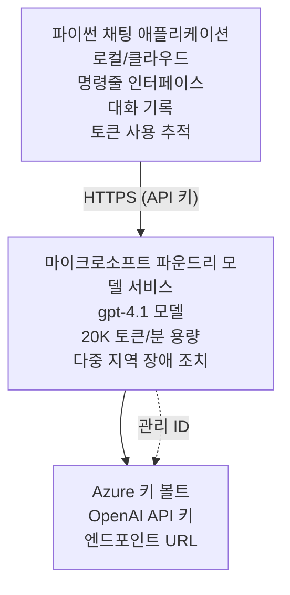

# Microsoft Foundry Models 채팅 애플리케이션

**학습 경로:** 중급 ⭐⭐ | **소요 시간:** 35-45분 | **비용:** $50-200/월

Azure Developer CLI(azd)를 사용하여 배포된 완전한 Microsoft Foundry Models 채팅 애플리케이션입니다. 이 예제는 gpt-4.1 배포, 안전한 API 액세스, 간단한 채팅 인터페이스를 시연합니다.

## 🎯 학습 내용

- gpt-4.1 모델을 사용한 Microsoft Foundry Models 서비스 배포
- Key Vault로 OpenAI API 키 보안
- Python으로 간단한 채팅 인터페이스 구축
- 토큰 사용량 및 비용 모니터링
- 속도 제한 및 오류 처리 구현

## 📦 포함된 내용

✅ **Microsoft Foundry Models 서비스** - gpt-4.1 모델 배포  
✅ **Python 채팅 앱** - 간단한 명령줄 채팅 인터페이스  
✅ **Key Vault 통합** - 안전한 API 키 저장  
✅ **ARM 템플릿** - 완전한 코드형 인프라  
✅ **비용 모니터링** - 토큰 사용 추적  
✅ **속도 제한** - 할당량 초과 방지  

## 아키텍처


## 사전 준비 사항

### 필수 사항

- **Azure Developer CLI (azd)** - [설치 가이드](https://learn.microsoft.com/azure/developer/azure-developer-cli/install-azd)
- **OpenAI 액세스 권한이 있는 Azure 구독** - [액세스 요청](https://aka.ms/oai/access)
- **Python 3.9 이상** - [Python 설치](https://www.python.org/downloads/)

### 사전 준비 확인

```bash
# azd 버전 확인 (1.5.0 이상 필요)
azd version

# Azure 로그인 확인
azd auth login

# Python 버전 확인
python --version  # 또는 python3 --version

# OpenAI 접근 권한 확인 (Azure 포털에서 확인)
az cognitiveservices account list-skus \
  --kind OpenAI \
  --location eastus
```

> **⚠️ 중요:** Microsoft Foundry Models는 애플리케이션 승인이 필요합니다. 아직 신청하지 않으셨다면 [aka.ms/oai/access](https://aka.ms/oai/access)를 방문하세요. 승인에는 일반적으로 1-2 영업일이 소요됩니다.

## ⏱️ 배포 일정

| 단계 | 소요 시간 | 진행 내용 |
|-------|----------|--------------|
| 사전 준비 확인 | 2-3분 | OpenAI 할당량 가용성 확인 |
| 인프라 배포 | 8-12분 | OpenAI, Key Vault, 모델 배포 생성 |
| 애플리케이션 구성 | 2-3분 | 환경 및 종속성 설정 |
| <strong>총합</strong> | **12-18분** | gpt-4.1과 대화 준비 완료 |

**참고:** 최초 OpenAI 배포 시 모델 프로비저닝 때문에 시간이 더 걸릴 수 있습니다.

## 빠른 시작

```bash
# 예제로 이동
cd examples/azure-openai-chat

# 환경 초기화
azd env new myopenai

# 모든 것 배포 (인프라 + 구성)
azd up
# 다음을 수행하라는 메시지가 표시됩니다:
# 1. Azure 구독 선택
# 2. OpenAI 이용 가능 지역 선택 (예: eastus, eastus2, westus)
# 3. 배포를 위해 12~18분 대기

# Python 의존성 설치
pip install -r requirements.txt

# 채팅 시작!
python chat.py
```

**예상 출력:**  
```
🤖 Microsoft Foundry Models Chat Application
Connected to: gpt-4.1 (eastus)
Type your message (or 'quit' to exit)

You: Hello! Tell me about Microsoft Foundry Models.
Assistant: Microsoft Foundry Models Service provides REST API access to OpenAI's powerful language models including gpt-4.1, GPT-3.5-Turbo, and Embeddings...

[Tokens used: 145 | Estimated cost: $0.0044]
```

## ✅ 배포 확인

### 1단계: Azure 리소스 확인

```bash
# 배포된 리소스 보기
azd show

# 예상 출력은 다음을 보여줍니다:
# - OpenAI 서비스: (리소스 이름)
# - 키 볼트: (리소스 이름)
# - 배포: gpt-4.1
# - 위치: eastus (또는 선택한 지역)
```

### 2단계: OpenAI API 테스트

```bash
# OpenAI 엔드포인트 및 키 가져오기
OPENAI_ENDPOINT=$(azd env get-value AZURE_OPENAI_ENDPOINT)
OPENAI_KEY=$(azd env get-value AZURE_OPENAI_API_KEY)

# API 호출 테스트하기
curl "$OPENAI_ENDPOINT/openai/deployments/gpt-4.1/chat/completions?api-version=2024-08-01-preview" \
  -H "Content-Type: application/json" \
  -H "api-key: $OPENAI_KEY" \
  -d '{
    "messages": [{"role": "user", "content": "Say hello!"}],
    "max_tokens": 50
  }'
```

**예상 응답:**  
```json
{
  "choices": [
    {
      "message": {
        "role": "assistant",
        "content": "Hello! How can I assist you today?"
      }
    }
  ],
  "usage": {
    "prompt_tokens": 8,
    "completion_tokens": 9,
    "total_tokens": 17
  }
}
```

### 3단계: Key Vault 액세스 확인

```bash
# 키 볼트에 있는 비밀 목록을 표시합니다
KV_NAME=$(azd env get-value AZURE_KEY_VAULT_NAME)

az keyvault secret list \
  --vault-name $KV_NAME \
  --query "[].name" \
  --output table
```

**예상 비밀 값:**  
- `openai-api-key`  
- `openai-endpoint`  

**성공 기준:**  
- ✅ gpt-4.1로 OpenAI 서비스 배포 완료  
- ✅ API 호출이 유효한 완성 결과 반환  
- ✅ Key Vault에 비밀 저장 완료  
- ✅ 토큰 사용량 추적 정상 작동  

## 프로젝트 구조

```
azure-openai-chat/
├── README.md                   ✅ This guide
├── azure.yaml                  ✅ AZD configuration
├── infra/                      ✅ Infrastructure as Code
│   ├── main.bicep             ✅ Main Bicep template
│   ├── main.parameters.json   ✅ Parameters
│   └── openai.bicep           ✅ OpenAI resource definition
├── src/                        ✅ Application code
│   ├── chat.py                ✅ Chat interface
│   ├── config.py              ✅ Configuration loader
│   └── requirements.txt       ✅ Python dependencies
└── .gitignore                  ✅ Git ignore rules
```

## 애플리케이션 기능

### 채팅 인터페이스 (`chat.py`)

채팅 애플리케이션은 다음을 포함합니다:

- **대화 기록** - 메시지 간 맥락 유지  
- **토큰 계산** - 사용량 추적 및 비용 추정  
- **오류 처리** - 속도 제한 및 API 오류 대응  
- **비용 추정** - 메시지별 실시간 비용 계산  
- **스트리밍 지원** - 선택적 스트리밍 응답  

### 명령어

채팅 중 다음 명령어를 사용할 수 있습니다:  
- `quit` 또는 `exit` - 세션 종료  
- `clear` - 대화 기록 삭제  
- `tokens` - 총 토큰 사용량 표시  
- `cost` - 추정된 총 비용 표시  

### 구성 (`config.py`)

환경 변수에서 구성 로드:  
```python
AZURE_OPENAI_ENDPOINT  # 키 볼트에서
AZURE_OPENAI_API_KEY   # 키 볼트에서
AZURE_OPENAI_MODEL     # 기본값: gpt-4.1
AZURE_OPENAI_MAX_TOKENS # 기본값: 800
```

## 사용 예시

### 기본 채팅

```bash
python chat.py
```

### 맞춤 모델 채팅

```bash
export AZURE_OPENAI_MODEL=gpt-35-turbo
python chat.py
```

### 스트리밍 채팅

```bash
python chat.py --stream
```

### 예시 대화

```
You: Explain Microsoft Foundry Models Service in 3 sentences.
Assistant: Microsoft Foundry Models Service is Microsoft Azure's cloud platform offering 
that provides access to OpenAI's powerful language models. It enables developers 
to integrate capabilities like gpt-4.1 into their applications with enterprise-grade 
security and compliance. The service includes features for content filtering, 
abuse monitoring, and responsible AI practices.

[Tokens used: 89 | Estimated cost: $0.0027]

You: What models are available?
Assistant: Microsoft Foundry Models Service offers several model families including gpt-4.1 
(most capable), GPT-3.5-Turbo (faster and cost-effective), and Embeddings models 
for vector search. Each model has different capabilities, pricing, and token limits.

[Tokens used: 67 | Estimated cost: $0.0020]

Total session: 156 tokens | $0.0047
```

## 비용 관리

### 토큰 가격 (gpt-4.1)

| 모델 | 입력 (1K 토큰당) | 출력 (1K 토큰당) |
|-------|----------------------|------------------------|
| gpt-4.1 | $0.03 | $0.06 |
| GPT-3.5-Turbo | $0.0015 | $0.002 |

### 예상 월간 비용

사용 패턴 기준:

| 사용 수준 | 일일 메시지 | 일일 토큰 | 월별 비용 |
|-------------|--------------|------------|--------------|
| <strong>경량</strong> | 20 메시지 | 3,000 토큰 | $3-5 |
| <strong>중간</strong> | 100 메시지 | 15,000 토큰 | $15-25 |
| <strong>고강도</strong> | 500 메시지 | 75,000 토큰 | $75-125 |

**기본 인프라 비용:** $1-2/월 (Key Vault + 최소 컴퓨팅)

### 비용 최적화 팁

```bash
# 1. 더 간단한 작업에는 GPT-3.5-Turbo를 사용하세요 (20배 저렴)
export AZURE_OPENAI_MODEL=gpt-35-turbo

# 2. 더 짧은 응답을 위해 최대 토큰 수를 줄이세요
export AZURE_OPENAI_MAX_TOKENS=400

# 3. 토큰 사용량을 모니터링하세요
python chat.py --show-tokens

# 4. 예산 알림을 설정하세요
az consumption budget create \
  --budget-name "openai-budget" \
  --amount 50 \
  --time-grain Monthly
```

## 모니터링

### 토큰 사용량 보기

```bash
# Azure 포털에서:
# OpenAI 리소스 → 메트릭 → "토큰 거래" 선택

# 또는 Azure CLI를 통해:
az monitor metrics list \
  --resource $(azd env get-value AZURE_OPENAI_RESOURCE_ID) \
  --metric "TokenTransaction" \
  --start-time $(date -u -d '1 hour ago' '+%Y-%m-%dT%H:%M:%S') \
  --interval PT1M
```

### API 로그 보기

```bash
# 진단 로그 스트리밍
az monitor diagnostic-settings create \
  --resource $(azd env get-value AZURE_OPENAI_RESOURCE_ID) \
  --name openai-logs \
  --logs '[{"category": "Audit", "enabled": true}]' \
  --workspace $(azd env get-value LOG_ANALYTICS_WORKSPACE_ID)

# 쿼리 로그
az monitor log-analytics query \
  --workspace $(azd env get-value LOG_ANALYTICS_WORKSPACE_ID) \
  --analytics-query "AzureDiagnostics | where Category == 'Audit' | top 10 by TimeGenerated"
```

## 문제 해결

### 문제: "액세스 거부" 오류

**증상:** API 호출 시 403 Forbidden 발생

**해결책:**  
```bash
# 1. OpenAI 접근 권한이 승인되었는지 확인하세요
az cognitiveservices account show \
  --name $(azd env get-value AZURE_OPENAI_NAME) \
  --resource-group $(azd env get-value AZURE_RESOURCE_GROUP)

# 2. API 키가 올바른지 확인하세요
azd env get-value AZURE_OPENAI_API_KEY

# 3. 엔드포인트 URL 형식을 확인하세요
azd env get-value AZURE_OPENAI_ENDPOINT
# 형식은 다음과 같아야 합니다: https://[name].openai.azure.com/
```

### 문제: "속도 제한 초과"

**증상:** 429 Too Many Requests 발생

**해결책:**  
```bash
# 1. 현재 할당량 확인
az cognitiveservices account deployment show \
  --name $(azd env get-value AZURE_OPENAI_NAME) \
  --resource-group $(azd env get-value AZURE_RESOURCE_GROUP) \
  --deployment-name gpt-4.1

# 2. 할당량 증가 요청 (필요한 경우)
# Azure 포털 → OpenAI 리소스 → 할당량 → 증가 요청으로 이동

# 3. 재시도 로직 구현 (이미 chat.py에 있음)
# 애플리케이션이 자동으로 지수 백오프로 재시도함
```

### 문제: "모델을 찾을 수 없음"

**증상:** 배포 시 404 오류 발생

**해결책:**  
```bash
# 1. 사용 가능한 배포 목록
az cognitiveservices account deployment list \
  --name $(azd env get-value AZURE_OPENAI_NAME) \
  --resource-group $(azd env get-value AZURE_RESOURCE_GROUP)

# 2. 환경에서 모델 이름 확인
echo $AZURE_OPENAI_MODEL

# 3. 올바른 배포 이름으로 업데이트
export AZURE_OPENAI_MODEL=gpt-4.1  # 또는 gpt-35-turbo
```

### 문제: 높은 지연 시간

**증상:** 느린 응답 시간 (>5초)

**해결책:**  
```bash
# 1. 지역 지연 시간 확인
# 사용자와 가장 가까운 지역에 배포

# 2. 더 빠른 응답을 위해 max_tokens 감소
export AZURE_OPENAI_MAX_TOKENS=400

# 3. 더 나은 사용자 경험을 위해 스트리밍 사용
python chat.py --stream
```

## 보안 권장 사항

### 1. API 키 보호

```bash
# 키를 소스 제어에 절대 커밋하지 마세요
# 키 볼트 사용 (이미 구성됨)

# 키를 정기적으로 교체하세요
az cognitiveservices account keys regenerate \
  --name $(azd env get-value AZURE_OPENAI_NAME) \
  --resource-group $(azd env get-value AZURE_RESOURCE_GROUP) \
  --key-name key1
```

### 2. 콘텐츠 필터링 구현

```python
# Microsoft Foundry Models에는 내장된 콘텐츠 필터링이 포함되어 있습니다
# Azure 포털에서 구성:
# OpenAI 리소스 → 콘텐츠 필터 → 사용자 지정 필터 만들기

# 카테고리: 증오, 성적, 폭력, 자해
# 수준: 낮음, 중간, 높음 필터링
```

### 3. 관리형 아이덴티티 사용 (본番 환경)

```bash
# 프로덕션 배포의 경우 관리형 아이덴티티를 사용하세요
# API 키 대신 (Azure에서 앱 호스팅 필요)

# infra/openai.bicep를 다음을 포함하도록 업데이트하세요:
# identity: { type: 'SystemAssigned' }
```

## 개발

### 로컬 실행

```bash
# 종속성 설치
pip install -r src/requirements.txt

# 환경 변수 설정
export AZURE_OPENAI_ENDPOINT="https://[name].openai.azure.com/"
export AZURE_OPENAI_API_KEY="your-api-key"
export AZURE_OPENAI_MODEL="gpt-4.1"

# 애플리케이션 실행
python src/chat.py
```

### 테스트 실행

```bash
# 테스트 종속성 설치
pip install pytest pytest-cov

# 테스트 실행
pytest tests/ -v

# 커버리지와 함께
pytest tests/ --cov=src --cov-report=html
```

### 모델 배포 업데이트

```bash
# 다른 모델 버전 배포하기
az cognitiveservices account deployment create \
  --name $(azd env get-value AZURE_OPENAI_NAME) \
  --resource-group $(azd env get-value AZURE_RESOURCE_GROUP) \
  --deployment-name gpt-35-turbo \
  --model-name gpt-35-turbo \
  --model-version "0613" \
  --model-format OpenAI \
  --sku-capacity 20 \
  --sku-name "Standard"
```

## 정리

```bash
# 모든 Azure 리소스를 삭제합니다
azd down --force --purge

# 다음 항목을 제거합니다:
# - OpenAI 서비스
# - 키 볼트 (90일 소프트 삭제 포함)
# - 리소스 그룹
# - 모든 배포 및 구성
```

## 다음 단계

### 예제 확장

1. **웹 인터페이스 추가** - React/Vue 프런트엔드 구축  
   ```bash
   # frontend 서비스를 azure.yaml에 추가
   # Azure Static Web Apps에 배포
   ```

2. **RAG 구현** - Azure AI Search로 문서 검색 추가  
   ```python
   # Azure Cognitive Search 통합
   # 문서를 업로드하고 벡터 인덱스 생성
   ```

3. **함수 호출 추가** - 도구 사용 활성화  
   ```python
   # chat.py에서 함수 정의
   # gpt-4.1이 외부 API를 호출하도록 허용
   ```

4. **멀티 모델 지원** - 여러 모델 배포  
   ```bash
   # gpt-35-turbo, 임베딩 모델 추가
   # 모델 라우팅 로직 구현
   ```

### 관련 예제

- **[Retail Multi-Agent](../retail-scenario.md)** - 고급 멀티에이전트 아키텍처  
- **[Database App](../../../../examples/database-app)** - 지속 저장소 추가  
- **[Container Apps](../../../../examples/container-app)** - 컨테이너화된 서비스로 배포  

### 학습 자료

- 📚 [AZD 초보자 과정](../../README.md) - 메인 과정 홈  
- 📚 [Microsoft Foundry Models 문서](https://learn.microsoft.com/azure/ai-services/openai/) - 공식 문서  
- 📚 [OpenAI API 참조](https://platform.openai.com/docs/api-reference) - API 세부 정보  
- 📚 [책임감 있는 AI](https://www.microsoft.com/ai/responsible-ai) - 권장 관행  

## 추가 자료

### 문서
- **[Microsoft Foundry Models 서비스](https://learn.microsoft.com/azure/ai-services/openai/)** - 완전한 가이드  
- **[gpt-4.1 모델](https://learn.microsoft.com/azure/ai-services/openai/concepts/models)** - 모델 기능  
- **[콘텐츠 필터링](https://learn.microsoft.com/azure/ai-services/openai/concepts/content-filter)** - 안전 기능  
- **[Azure Developer CLI](https://learn.microsoft.com/azure/developer/azure-developer-cli/)** - azd 참조  

### 튜토리얼
- **[OpenAI 빠른 시작](https://learn.microsoft.com/azure/ai-services/openai/quickstart)** - 첫 배포  
- **[채팅 완성](https://learn.microsoft.com/azure/ai-services/openai/how-to/chatgpt)** - 채팅 앱 구축  
- **[함수 호출](https://learn.microsoft.com/azure/ai-services/openai/how-to/function-calling)** - 고급 기능  

### 도구
- **[Microsoft Foundry Models Studio](https://oai.azure.com/)** - 웹 기반 플레이그라운드  
- **[프롬프트 엔지니어링 가이드](https://platform.openai.com/docs/guides/prompt-engineering)** - 더 나은 프롬프트 작성법  
- **[토큰 계산기](https://platform.openai.com/tokenizer)** - 토큰 사용량 추정  

### 커뮤니티
- **[Azure AI Discord](https://discord.gg/azure)** - 커뮤니티 도움받기  
- **[GitHub 토론](https://github.com/Azure-Samples/openai/discussions)** - Q&A 포럼  
- **[Azure 블로그](https://azure.microsoft.com/blog/tag/azure-openai-service/)** - 최신 소식  

---

**🎉 성공!** Microsoft Foundry Models 배포 및 작동하는 채팅 애플리케이션을 구축했습니다. gpt-4.1의 기능을 탐색하고 다양한 프롬프트와 사용 사례를 실험해 보세요.

**질문이 있으신가요?** [이슈 열기](https://github.com/microsoft/AZD-for-beginners/issues) 또는 [FAQ](../../resources/faq.md)를 확인하세요.

**비용 알림:** 테스트가 끝나면 `azd down` 명령어를 실행하여 지속적인 비용 청구를 방지하세요 (~활성 사용 시 월 $50-100).

---

<!-- CO-OP TRANSLATOR DISCLAIMER START -->
**면책 조항**:  
이 문서는 AI 번역 서비스 [Co-op Translator](https://github.com/Azure/co-op-translator)를 사용하여 번역되었습니다. 정확성을 위해 노력하고 있으나 자동 번역에는 오류나 부정확성이 포함될 수 있음을 유의하시기 바랍니다. 원본 문서의 원어 버전을 권위 있는 출처로 간주해야 합니다. 중요한 정보의 경우 전문 인력에 의한 번역을 권장합니다. 본 번역 사용으로 인한 오해나 잘못된 해석에 대해 당사는 책임을 지지 않습니다.
<!-- CO-OP TRANSLATOR DISCLAIMER END -->