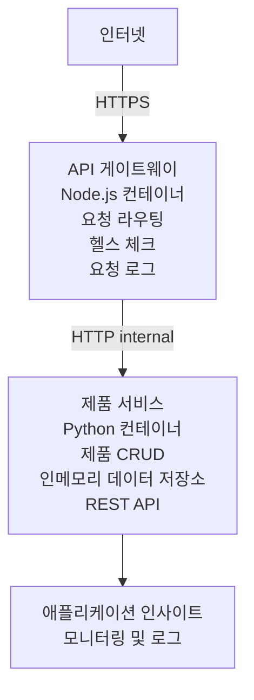

# 마이크로서비스 아키텍처 - 컨테이너 앱 예제

⏱️ **예상 소요 시간**: 25-35분 | 💰 **예상 비용**: 약 $50-100/월 | ⭐ <strong>난이도</strong>: 고급

AZD CLI를 사용하여 Azure Container Apps에 배포하는 **간단하지만 기능적인** 마이크로서비스 아키텍처 예제입니다. 이 예제는 서비스 간 통신, 컨테이너 오케스트레이션, 모니터링을 실용적인 2서비스 구성으로 시연합니다.

> **📚 학습 접근법**: 이 예제는 실제 배포하고 학습할 수 있는 최소한의 2서비스 아키텍처(API 게이트웨이 + 백엔드 서비스)로 시작합니다. 이 기반을 마스터한 후 전체 마이크로서비스 생태계 확장 방법에 대한 지침을 제공합니다.

## 학습 내용

이 예제를 완료하면 다음을 할 수 있습니다:
- 여러 컨테이너를 Azure Container Apps에 배포
- 내부 네트워킹을 통한 서비스 간 통신 구현
- 환경 기반 스케일링 및 헬스 체크 구성
- Application Insights로 분산 애플리케이션 모니터링
- 마이크로서비스 배포 패턴과 모범 사례 이해
- 단순한 아키텍처에서 복잡한 아키텍처로 점진적 확장 학습

## 아키텍처

### 1단계: 구축할 내용 (이 예제에 포함됨)


**왜 간단하게 시작할까?**
- ✅ 빠른 배포 및 이해 (25-35분)
- ✅ 복잡성 없이 핵심 마이크로서비스 패턴 학습
- ✅ 수정 및 실험 가능한 작동 코드
- ✅ 학습 비용 절감 (~$50-100/월 vs $300-1400/월)
- ✅ 데이터베이스 및 메시지 큐 추가 전 자신감 구축

<strong>비유</strong>: 운전 배우기와 같음. 빈 주차장(2개 서비스)에서 시작해 기본을 익히고, 도심 교통(5개 이상+데이터베이스)으로 진행.

### 2단계: 향후 확장 (참고 아키텍처)

2서비스 아키텍처를 마스터하면 다음으로 확장할 수 있습니다:

```
Full Architecture (Not Included - For Reference)
├── API Gateway (✅ Included)
├── Product Service (✅ Included)
├── Order Service (🔜 Add next)
├── User Service (🔜 Add next)
├── Notification Service (🔜 Add last)
├── Azure Service Bus (🔜 For async communication)
├── Cosmos DB (🔜 For product persistence)
├── Azure SQL (🔜 For order management)
└── Azure Storage (🔜 For file storage)
```

자세한 단계는 문서 마지막의 "확장 가이드" 섹션을 참조하세요.

## 포함된 기능

✅ **서비스 검색**: 컨테이너 간 자동 DNS 기반 검색  
✅ **부하 분산**: 복제본 간 기본 부하 분산  
✅ **자동 스케일링**: HTTP 요청 기준 서비스별 독립 스케일링  
✅ **헬스 모니터링**: 두 서비스 모두에 라이브니스 및 레디니스 검사  
✅ **분산 로깅**: Application Insights 중앙 로깅  
✅ **내부 네트워킹**: 안전한 서비스 간 통신  
✅ **컨테이너 오케스트레이션**: 자동 배포 및 스케일링  
✅ **무중단 업데이트**: 리비전 관리와 롤링 업데이트  

## 사전 준비 사항

### 필요 도구

시작 전에 다음 도구가 설치되어 있는지 확인하세요:

1. **[Azure Developer CLI (azd)](https://learn.microsoft.com/azure/developer/azure-developer-cli/install-azd)** (버전 1.0.0 이상)
   ```bash
   azd version
   # 예상 출력: azd 버전 1.0.0 이상
   ```

2. **[Azure CLI](https://learn.microsoft.com/cli/azure/install-azure-cli)** (버전 2.50.0 이상)
   ```bash
   az --version
   # 예상 출력: azure-cli 2.50.0 이상
   ```

3. **[Docker](https://www.docker.com/get-started)** (로컬 개발/테스트용 - 선택 사항)
   ```bash
   docker --version
   # 예상 출력: Docker 버전 20.10 이상
   ```

### Azure 요구 사항

- 활성 **Azure 구독** ([무료 계정 생성](https://azure.microsoft.com/free/))
- 구독 내 리소스 생성 권한
- 구독 또는 리소스 그룹에 대한 **기여자(Contributor)** 역할

### 지식 사전 조건

이것은 **고급 수준** 예제입니다. 다음을 알고 있어야 합니다:
- [간단한 Flask API 예제](../../../../../examples/container-app/simple-flask-api) 완료
- 마이크로서비스 아키텍처 기본 이해
- REST API 및 HTTP 친숙
- 컨테이너 개념 이해

**Container Apps가 처음인가요?** 기본부터 배우려면 먼저 [간단한 Flask API 예제](../../../../../examples/container-app/simple-flask-api)를 시작하세요.

## 빠른 시작 (단계별)

### 1단계: 클론 및 탐색

```bash
git clone https://github.com/microsoft/AZD-for-beginners.git
cd AZD-for-beginners/examples/container-app/microservices
```

**✓ 성공 확인**: `azure.yaml` 파일이 보여야 합니다:
```bash
ls
# 예상됨: README.md, azure.yaml, infra/, src/
```

### 2단계: Azure에 인증

```bash
azd auth login
```

브라우저가 열려 Azure 인증을 진행합니다. Azure 자격증명으로 로그인하세요.

**✓ 성공 확인**: 다음이 보여야 합니다:
```
Logged in to Azure.
```

### 3단계: 환경 초기화

```bash
azd init
```

**나오는 프롬프트**:
- **환경 이름**: 짧게 입력 (예: `microservices-dev`)
- **Azure 구독**: 구독 선택
- **Azure 위치**: 지역 선택 (예: `eastus`, `westeurope`)

**✓ 성공 확인**: 다음이 보여야 합니다:
```
SUCCESS: New project initialized!
```

### 4단계: 인프라 및 서비스 배포

```bash
azd up
```

**진행 내용** (8-12분 소요 예상):
1. Container Apps 환경 생성
2. 모니터링용 Application Insights 생성
3. API Gateway 컨테이너(Node.js) 빌드
4. Product Service 컨테이너(Python) 빌드
5. 두 컨테이너 Azure에 배포
6. 네트워킹 및 헬스 체크 구성
7. 모니터링 및 로깅 설정

**✓ 성공 확인**: 다음이 보여야 합니다:
```
SUCCESS: Your application was deployed to Azure in X minutes Y seconds.
Endpoint: https://api-gateway-<unique-id>.azurecontainerapps.io
```

**⏱️ 시간**: 8-12분

### 5단계: 배포 테스트

```bash
# 게이트웨이 엔드포인트 가져오기
GATEWAY_URL=$(azd env get-values | grep API_GATEWAY_URL | cut -d '=' -f2 | tr -d '"')

# API 게이트웨이 건강 상태 테스트
curl $GATEWAY_URL/health

# 예상 출력:
# {"status":"healthy","service":"api-gateway","timestamp":"2025-11-19T10:30:00Z"}
```

**게이트웨이를 통한 상품 서비스 테스트**:
```bash
# 제품 목록
curl $GATEWAY_URL/api/products

# 예상 출력:
# [
#   {"id":1,"name":"노트북","price":999.99,"stock":50},
#   {"id":2,"name":"마우스","price":29.99,"stock":200},
#   {"id":3,"name":"키보드","price":79.99,"stock":150}
# ]
```

**✓ 성공 확인**: 두 엔드포인트 모두 JSON 데이터를 오류 없이 반환해야 합니다.

---

**🎉 축하합니다!** 마이크로서비스 아키텍처를 Azure에 배포했습니다!

## 프로젝트 구조

모든 구현 파일이 포함되어 있으며 완전한 동작 예제입니다:

```
microservices/
│
├── README.md                         # This file
├── azure.yaml                        # AZD configuration
├── .gitignore                        # Git ignore patterns
│
├── infra/                           # Infrastructure as Code (Bicep)
│   ├── main.bicep                   # Main orchestration
│   ├── abbreviations.json           # Naming conventions
│   ├── core/                        # Shared infrastructure
│   │   ├── container-apps-environment.bicep  # Container environment + registry
│   │   └── monitor.bicep            # Application Insights + Log Analytics
│   └── app/                         # Service definitions
│       ├── api-gateway.bicep        # API Gateway container app
│       └── product-service.bicep    # Product Service container app
│
└── src/                             # Application source code
    ├── api-gateway/                 # Node.js API Gateway
    │   ├── app.js                   # Express server with routing
    │   ├── package.json             # Node dependencies
    │   └── Dockerfile               # Container definition
    └── product-service/             # Python Product Service
        ├── main.py                  # Flask API with product data
        ├── requirements.txt         # Python dependencies
        └── Dockerfile               # Container definition
```

**각 구성요소 역할:**

**인프라 (infra/)**:
- `main.bicep`: 모든 Azure 리소스 및 종속성 관리
- `core/container-apps-environment.bicep`: Container Apps 환경 및 ACR 생성
- `core/monitor.bicep`: 분산 로깅용 Application Insights 설정
- `app/*.bicep`: 스케일링 및 헬스 체크가 포함된 개별 컨테이너 앱 정의

**API 게이트웨이 (src/api-gateway/)**:
- 외부에 공개되는 서비스로 백엔드 서비스로 요청 라우팅
- 로깅, 오류 처리, 요청 전달 구현
- 서비스 간 HTTP 통신 시연

**상품 서비스 (src/product-service/)**:
- 간단한 인메모리 상품 카탈로그 내부 서비스
- REST API 및 헬스 체크 구현
- 백엔드 마이크로서비스 패턴 예시

## 서비스 개요

### API 게이트웨이 (Node.js/Express)

<strong>포트</strong>: 8080  
<strong>접근성</strong>: 공개 (외부 인그레스)  
<strong>목적</strong>: 들어오는 요청을 적절한 백엔드 서비스로 라우팅  

<strong>엔드포인트</strong>:
- `GET /` - 서비스 정보
- `GET /health` - 헬스 체크 엔드포인트
- `GET /api/products` - 상품 서비스에 전달 (전체 목록)
- `GET /api/products/:id` - 상품 서비스에 전달 (ID로 조회)

**주요 기능**:
- axios를 이용한 요청 라우팅
- 중앙 집중식 로깅
- 오류 처리 및 타임아웃 관리
- 환경변수를 통한 서비스 검색
- Application Insights 통합

**코드 하이라이트** (`src/api-gateway/app.js`):
```javascript
// 내부 서비스 통신
app.get('/api/products', async (req, res) => {
  const response = await axios.get(`${PRODUCT_SERVICE_URL}/products`);
  res.json(response.data);
});
```

### 상품 서비스 (Python/Flask)

<strong>포트</strong>: 8000  
<strong>접근성</strong>: 내부 전용 (외부 인그레스 없음)  
<strong>목적</strong>: 인메모리 상품 카탈로그 관리  

<strong>엔드포인트</strong>:
- `GET /` - 서비스 정보
- `GET /health` - 헬스 체크
- `GET /products` - 전체 상품 목록
- `GET /products/<id>` - ID로 상품 조회

**주요 기능**:
- Flask 기반 REST API
- 인메모리 상품 저장소 (간단하며 데이터베이스 불필요)
- 프로브를 이용한 헬스 모니터링
- 구조화된 로깅
- Application Insights 통합

**데이터 모델**:
```python
{
  "id": 1,
  "name": "Laptop",
  "description": "High-performance laptop",
  "price": 999.99,
  "stock": 50
}
```

**왜 내부 전용인가?**  
상품 서비스는 외부에 노출되지 않으며, 모든 요청은 API 게이트웨이를 통해서만 접근 가능:
- 보안: 제어된 접속 지점 제공
- 유연성: 백엔드 변경 시 클라이언트 영향 최소화
- 모니터링: 중앙 요청 로깅

## 서비스 통신 이해

### 서비스 간 통신 방식

이 예제에서 API 게이트웨이는 Product Service와 <strong>내부 HTTP 호출</strong>로 통신합니다:

```javascript
// API 게이트웨이 (src/api-gateway/app.js)
const PRODUCT_SERVICE_URL = process.env.PRODUCT_SERVICE_URL;

// 내부 HTTP 요청 만들기
const response = await axios.get(`${PRODUCT_SERVICE_URL}/products`);
```

**주요 포인트**:

1. **DNS 기반 검색**: Container Apps는 내부 서비스에 DNS 자동 제공  
   - Product Service FQDN: `product-service.internal.<environment>.azurecontainerapps.io`  
   - 간략화: `http://product-service` (Container Apps가 해결)

2. **공개 노출 없음**: Product Service는 Bicep 설정에 `external: false`  
   - Container Apps 환경 내부에서만 접근 가능  
   - 인터넷에서는 접근 불가

3. **환경 변수**: 서비스 URL은 배포 시 주입됨  
   - Bicep가 내부 FQDN을 게이트웨이에 전달  
   - 애플리케이션 코드에는 하드코딩된 URL 없음

<strong>비유</strong>: 이건 사무실 방처럼 생각하세요. API 게이트웨이는 접수 데스크(공개), Product Service는 사무실 방(내부 전용). 방문자는 접수를 거쳐야 방에 들어갈 수 있음.

## 배포 옵션

### 전체 배포 (권장)

```bash
# 인프라와 두 서비스를 배포하세요
azd up
```

배포 내용:
1. Container Apps 환경
2. Application Insights
3. 컨테이너 레지스트리
4. API 게이트웨이 컨테이너
5. 상품 서비스 컨테이너

<strong>시간</strong>: 8-12분

### 개별 서비스 배포

```bash
# 하나의 서비스만 배포합니다 (초기 azd up 후)
azd deploy api-gateway

# 또는 product 서비스를 배포합니다
azd deploy product-service
```

<strong>용도</strong>: 한 서비스 코드를 변경하고 그 서비스만 재배포할 때.

### 구성 업데이트

```bash
# 스케일링 매개변수 변경
azd env set GATEWAY_MAX_REPLICAS 30

# 새 구성으로 재배포
azd up
```

## 구성

### 스케일링 구성

두 서비스 모두 Bicep 파일에 HTTP 기반 자동 스케일링 설정 포함:

**API 게이트웨이**:
- 최소 복제본: 2 (가용성 위해 항상 2 이상)
- 최대 복제본: 20
- 스케일 트리거: 복제본 당 동시 50 요청

**상품 서비스**:
- 최소 복제본: 1 (필요시 0까지 축소 가능)
- 최대 복제본: 10
- 스케일 트리거: 복제본 당 동시 100 요청

**스케일링 사용자 지정** (`infra/app/*.bicep`에서):
```bicep
scale: {
  minReplicas: 1
  maxReplicas: 10
  rules: [
    {
      name: 'http-scale-rule'
      http: {
        metadata: {
          concurrentRequests: '100'  // Adjust this
        }
      }
    }
  ]
}
```

### 리소스 할당

**API 게이트웨이**:
- CPU: 1.0 vCPU
- 메모리: 2 GiB
- 이유: 모든 외부 트래픽 처리

**상품 서비스**:
- CPU: 0.5 vCPU
- 메모리: 1 GiB
- 이유: 가벼운 인메모리 작업

### 헬스 체크

두 서비스 모두 라이브니스 및 레디니스 프로브 포함:

```bicep
probes: [
  {
    type: 'Liveness'
    httpGet: {
      path: '/health'
      port: 8080
    }
    initialDelaySeconds: 10
    periodSeconds: 30
  }
  {
    type: 'Readiness'
    httpGet: {
      path: '/health'
      port: 8080
    }
    initialDelaySeconds: 5
    periodSeconds: 10
  }
]
```

<strong>의미</strong>:
- <strong>라이브니스</strong>: 헬스 검사 실패시 Container Apps가 컨테이너 재시작
- <strong>레디니스</strong>: 준비되지 않으면 Container Apps가 해당 복제본으로의 트래픽 중단

## 모니터링 및 관찰 가능성

### 서비스 로그 보기

```bash
# azd monitor를 사용하여 로그 보기
azd monitor --logs

# 또는 특정 컨테이너 앱에 대해 Azure CLI 사용:
# API 게이트웨이에서 로그 스트리밍
az containerapp logs show --name api-gateway --resource-group $RG_NAME --follow

# 최근 제품 서비스 로그 보기
az containerapp logs show --name product-service --resource-group $RG_NAME --tail 100
```

**예상 출력**:
```
[api-gateway] API Gateway listening on port 8080
[api-gateway] Product Service URL: http://product-service
[api-gateway] GET /api/products 200 - 45ms
[product-service] Retrieved 5 products
```

### Application Insights 쿼리

Azure 포탈에서 Application Insights에 접속 후 다음 쿼리 실행:

**느린 요청 찾기**:
```kusto
requests
| where timestamp > ago(1h)
| where duration > 1000  // Requests taking >1 second
| summarize count() by name, cloud_RoleName
| order by count_ desc
```

**서비스 간 호출 추적**:
```kusto
dependencies
| where timestamp > ago(1h)
| where type == "Http"
| project timestamp, name, target, duration, success
| order by timestamp desc
```

**서비스별 오류율**:
```kusto
exceptions
| where timestamp > ago(24h)
| summarize errorCount = count() by cloud_RoleName, type
| order by errorCount desc
```

**시간에 따른 요청량**:
```kusto
requests
| where timestamp > ago(1h)
| summarize requestCount = count() by bin(timestamp, 5m), cloud_RoleName
| render timechart
```

### 모니터링 대시보드 접속

```bash
# 애플리케이션 인사이트 세부 정보 가져오기
azd env get-values | grep APPLICATIONINSIGHTS

# Azure 포털 모니터링 열기
az monitor app-insights component show \
  --app $(azd env get-values | grep APPLICATIONINSIGHTS_CONNECTION_STRING | cut -d '=' -f2) \
  --resource-group $(azd env get-values | grep AZURE_RESOURCE_GROUP | cut -d '=' -f2) \
  --query "appId" -o tsv
```

### 라이브 메트릭

1. Azure 포털에서 Application Insights로 이동
2. "Live Metrics" 클릭
3. 실시간 요청, 실패, 성능 확인
4. 테스트: `curl $(azd env get-values | grep API_GATEWAY_URL | cut -d '=' -f2 | tr -d '"')/api/products` 실행

## 실습 연습

[참고: 자세한 단계별 실습은 위 "Practical Exercises" 섹션을 참조하세요. 배포 확인, 데이터 수정, 자동 스케일링 테스트, 오류 처리, 세 번째 서비스 추가 등이 포함됨.]

## 비용 분석

### 예상 월간 비용 (이 2서비스 예제 기준)

| 리소스 | 구성 | 예상 비용 |
|----------|--------------|----------------|
| API 게이트웨이 | 2-20 복제본, 1 vCPU, 2GB RAM | $30-150 |
| 상품 서비스 | 1-10 복제본, 0.5 vCPU, 1GB RAM | $15-75 |
| 컨테이너 레지스트리 | 기본 계층 | $5 |
| Application Insights | 1-2 GB/월 | $5-10 |
| 로그 분석 | 1 GB/월 | $3 |
| <strong>합계</strong> | | **$58-243/월** |

**사용량별 비용 분포**:
- **경량 트래픽** (테스트/학습용): 약 $60/월
- **중간 트래픽** (소규모 프로덕션): 약 $120/월
- <strong>고트래픽</strong> (바쁜 시기): 약 $240/월

### 비용 최적화 팁

1. **개발 시 제로 스케일링 활용**:
   ```bicep
   scale: {
     minReplicas: 0  // Save $30-40/month when not in use
     maxReplicas: 10
   }
   ```

2. **Cosmos DB는 사용량 기반 플랜 사용** (추가 시):
   - 사용한 만큼만 지불
   - 최소 요금 없음

3. **Application Insights 샘플링 설정**:
   ```javascript
   appInsights.defaultClient.config.samplingPercentage = 50; // 요청의 50% 샘플링
   ```

4. **불필요 시 리소스 정리**:
   ```bash
   azd down
   ```

### 무료 계층 옵션

학습/테스트용으로 고려하세요:
- Azure 무료 크레딧 사용 (첫 30일)
- 복제본 최소화 유지
- 테스트 후 삭제 (지속 요금 없음)

---

## 정리

지속 요금을 피하기 위해 모든 리소스를 삭제하세요:

```bash
azd down --force --purge
```

**확인 프롬프트**:
```
? Total resources to delete: 6, are you sure you want to continue? (y/N)
```

확인을 위해 `y`를 입력하세요.

**삭제되는 항목**:
- Container Apps 환경
- 두 개의 Container Apps (게이트웨이 & 제품 서비스)
- 컨테이너 레지스트리
- Application Insights
- Log Analytics 작업 영역
- 리소스 그룹

**✓ 정리 확인**:
```bash
az group list --query "[?starts_with(name,'rg-microservices')]" --output table
```

비어 있어야 합니다.

---

## 확장 가이드: 2개 서비스에서 5개 이상으로

이 2-서비스 아키텍처를 마스터한 후, 확장 방법은 다음과 같습니다:

### 1단계: 데이터베이스 지속성 추가 (다음 단계)

**제품 서비스용 Cosmos DB 추가**:

1. `infra/core/cosmos.bicep` 생성:
   ```bicep
   resource cosmosAccount 'Microsoft.DocumentDB/databaseAccounts@2023-04-15' = {
     name: name
     location: location
     kind: 'GlobalDocumentDB'
     properties: {
       databaseAccountOfferType: 'Standard'
       locations: [{ locationName: location, failoverPriority: 0 }]
     }
   }
   ```

2. 제품 서비스를 메모리 내 데이터 대신 Cosmos DB 사용하도록 업데이트

3. 추가 예상 비용: 약 $25/월 (서버리스)

### 2단계: 세 번째 서비스 추가 (주문 관리)

**주문 서비스 생성**:

1. 새 폴더: `src/order-service/` (Python/Node.js/C#)
2. 새 Bicep 파일: `infra/app/order-service.bicep`
3. API Gateway에서 `/api/orders` 라우팅 업데이트
4. 주문 지속성을 위한 Azure SQL Database 추가

**아키텍처 변경 사항**:
```
API Gateway → Product Service (Cosmos DB)
           → Order Service (Azure SQL)
```

### 3단계: 비동기 통신 추가 (Service Bus)

**이벤트 기반 아키텍처 구현**:

1. Azure Service Bus 추가: `infra/core/servicebus.bicep`
2. 제품 서비스가 "ProductCreated" 이벤트 게시
3. 주문 서비스는 제품 이벤트 구독
4. 이벤트 처리용 알림 서비스 추가

<strong>패턴</strong>: 요청/응답 (HTTP) + 이벤트 기반 (Service Bus)

### 4단계: 사용자 인증 추가

**사용자 서비스 구현**:

1. `src/user-service/` 생성 (Go/Node.js)
2. Azure AD B2C 또는 맞춤형 JWT 인증 추가
3. API Gateway가 토큰 검증
4. 서비스가 사용자 권한 확인

### 5단계: 운영 준비

**다음 구성요소 추가**:
- Azure Front Door (글로벌 로드 밸런싱)
- Azure Key Vault (비밀 관리)
- Azure Monitor Workbooks (맞춤 대시보드)
- CI/CD 파이프라인 (GitHub Actions)
- 블루-그린 배포
- 모든 서비스에 관리형 ID 적용

**전체 운영 아키텍처 비용**: 약 $300-1,400/월

---

## 추가 학습

### 관련 문서
- [Azure Container Apps 문서](https://learn.microsoft.com/azure/container-apps/)
- [마이크로서비스 아키텍처 가이드](https://learn.microsoft.com/azure/architecture/guide/architecture-styles/microservices)
- [분산 추적용 Application Insights](https://learn.microsoft.com/azure/azure-monitor/app/distributed-tracing)
- [Azure Developer CLI 문서](https://learn.microsoft.com/azure/developer/azure-developer-cli/)

### 이 강좌의 다음 단계
- ← 이전: [간단한 Flask API](../../../../../examples/container-app/simple-flask-api) - 초보용 단일 컨테이너 예제
- → 다음: [AI 통합 가이드](../../../../../examples/docs/ai-foundry) - AI 기능 추가
- 🏠 [강좌 홈](../../README.md)

### 비교: 언제 무엇을 사용할까

**단일 컨테이너 앱** (간단한 Flask API 예제):
- ✅ 단순한 애플리케이션
- ✅ 모놀리식 아키텍처
- ✅ 빠른 배포
- ❌ 확장성 제한
- <strong>비용</strong>: 약 $15-50/월

<strong>마이크로서비스</strong> (이 예제):
- ✅ 복잡한 애플리케이션
- ✅ 서비스별 독립 확장 가능
- ✅ 팀 자율성 (다른 서비스, 다른 팀)
- ❌ 관리 복잡도 증가
- <strong>비용</strong>: 약 $60-250/월

**쿠버네티스 (AKS)**:
- ✅ 최대 제어 및 유연성
- ✅ 멀티 클라우드 이식성
- ✅ 고급 네트워킹
- ❌ 쿠버네티스 전문 지식 필요
- <strong>비용</strong>: 최소 약 $150-500/월

<strong>추천</strong>: Container Apps(이 예제)로 시작하고, 쿠버네티스 전용 기능이 필요할 때 AKS로 이동하세요.

---

## 자주 묻는 질문

**Q: 왜 5개 이상의 서비스가 아니라 2개만 있나요?**  
A: 교육용 단계입니다. 복잡성을 추가하기 전에 간단한 예제로 기본(서비스 통신, 모니터링, 확장)을 익히세요. 여기서 배운 패턴은 100개 서비스 아키텍처에도 적용됩니다.

**Q: 서비스를 직접 더 추가할 수 있나요?**  
A: 물론입니다! 위 확장 가이드를 따라 하세요. 새 서비스마다 src 폴더 생성, Bicep 파일 작성, azure.yaml 업데이트, 배포순입니다.

**Q: 이 구성이 운영 환경에 적합한가요?**  
A: 견고한 기본입니다. 운영용으로는 관리형 ID, Key Vault, 영속 데이터베이스, CI/CD 파이프라인, 모니터링 알림, 백업 전략을 추가하세요.

**Q: 왜 Dapr이나 다른 서비스 메시는 사용하지 않나요?**  
A: 학습을 위해 단순하게 유지합니다. Container Apps 네이티브 네트워킹을 익힌 뒤 고급 시나리오에 Dapr 등을 추가하세요.

**Q: 로컬에서 어떻게 디버깅하나요?**  
A: Docker로 로컬에서 서비스를 실행하세요:
```bash
cd src/api-gateway
docker build -t local-gateway .
docker run -p 8080:8080 -e PRODUCT_SERVICE_URL=http://localhost:8000 local-gateway
```

**Q: 다른 프로그래밍 언어도 사용할 수 있나요?**  
A: 네! 이 예제는 Node.js(게이트웨이) + Python(제품 서비스)을 보여줍니다. 컨테이너에서 실행되는 어떤 언어도 혼합해서 사용할 수 있습니다.

**Q: Azure 크레딧이 없으면 어떻게 하나요?**  
A: Azure 무료 계정(첫 30일) 사용하거나 단기간 테스트 후 바로 삭제하세요.

---

> **🎓 학습 경로 요약**: 자동 확장, 내부 네트워킹, 중앙 집중식 모니터링, 운영 준비 패턴이 적용된 다중 서비스 아키텍처 배포법을 배웠습니다. 이 기반으로 복잡한 분산 시스템과 엔터프라이즈 마이크로서비스 아키텍처에 대비할 수 있습니다.

**📚 강좌 네비게이션:**
- ← 이전: [간단한 Flask API](../../../../../examples/container-app/simple-flask-api)
- → 다음: [데이터베이스 통합 예제](../../../../../examples/database-app)
- 🏠 [강좌 홈](../../../README.md)
- 📖 [Container Apps 모범 사례](../../../docs/chapter-04-infrastructure/deployment-guide.md)

---

<!-- CO-OP TRANSLATOR DISCLAIMER START -->
**면책 조항**:  
이 문서는 AI 번역 서비스 [Co-op Translator](https://github.com/Azure/co-op-translator)를 사용하여 번역되었습니다. 정확성을 위해 노력하고 있지만, 자동 번역에는 오류나 부정확성이 포함될 수 있음을 유의하시기 바랍니다. 원본 문서는 해당 언어의 원문이 권위 있는 자료로 간주되어야 합니다. 중요한 정보의 경우에는 전문적인 인간 번역을 권장합니다. 본 번역 사용으로 인해 발생하는 오해나 오해에 대해서는 당사가 책임지지 않습니다.
<!-- CO-OP TRANSLATOR DISCLAIMER END -->