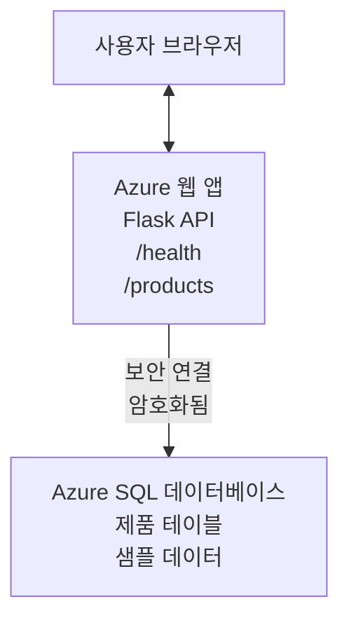

# AZD를 사용하여 Microsoft SQL 데이터베이스 및 웹 앱 배포

⏱️ **예상 소요 시간**: 20-30분 | 💰 **예상 비용**: ~$15-25/월 | ⭐ <strong>난이도</strong>: 중급

이 <strong>완전한 작동 예제</strong>는 [Azure Developer CLI(azd)](https://learn.microsoft.com/azure/developer/azure-developer-cli/)를 사용하여 Microsoft SQL 데이터베이스와 함께 Python Flask 웹 애플리케이션을 Azure에 배포하는 방법을 시연합니다. 모든 코드는 포함되어 있고 테스트되었으며 외부 종속성이 필요 없습니다.

## 학습 내용

이 예제를 완료하면 다음을 할 수 있습니다:
- 인프라 코드를 사용하여 다계층 애플리케이션(웹 앱 + 데이터베이스) 배포
- 비밀 정보를 하드코딩하지 않고 안전한 데이터베이스 연결 구성
- 애플리케이션 인사이트를 통한 애플리케이션 상태 모니터링
- AZD CLI를 사용한 Azure 리소스 효율적 관리
- 보안, 비용 최적화 및 관측을 위한 Azure 모범 사례 준수

## 시나리오 개요
- **웹 앱**: 데이터베이스 연결이 포함된 Python Flask REST API
- <strong>데이터베이스</strong>: 샘플 데이터가 있는 Azure SQL 데이터베이스
- <strong>인프라</strong>: Bicep(모듈식, 재사용 가능 템플릿) 사용하여 프로비저닝
- <strong>배포</strong>: `azd` 명령어로 완전 자동화
- <strong>모니터링</strong>: 로그 및 원격 분석을 위한 애플리케이션 인사이트

## 사전 요구 사항

### 필요 도구

시작하기 전에 다음 도구가 설치되어 있는지 확인하세요:

1. **[Azure CLI](https://learn.microsoft.com/cli/azure/install-azure-cli)** (버전 2.50.0 이상)
   ```sh
   az --version
   # 예상 출력: azure-cli 2.50.0 이상
   ```

2. **[Azure Developer CLI (azd)](https://learn.microsoft.com/azure/developer/azure-developer-cli/install-azd)** (버전 1.0.0 이상)
   ```sh
   azd version
   # 예상 출력: azd 버전 1.0.0 이상
   ```

3. **[Python 3.8+](https://www.python.org/downloads/)** (로컬 개발용)
   ```sh
   python --version
   # 예상 출력: 파이썬 3.8 이상
   ```

4. **[Docker](https://www.docker.com/get-started)** (선택 사항, 로컬 컨테이너 개발용)
   ```sh
   docker --version
   # 예상 출력: Docker 버전 20.10 이상
   ```

### Azure 요구 사항

- 활성 **Azure 구독** ([무료 계정 만들기](https://azure.microsoft.com/free/))
- 구독 내 리소스 생성 권한
- 구독 또는 리소스 그룹에 대한 <strong>소유자</strong> 또는 <strong>참여자</strong> 역할

### 지식 요구 사항

이 예제는 <strong>중급 수준</strong>입니다. 다음에 익숙해야 합니다:
- 기본 명령줄 작업
- 기본 클라우드 개념(리소스, 리소스 그룹)
- 웹 애플리케이션 및 데이터베이스 기본 이해

**AZD가 처음이라면?** 먼저 [시작하기 가이드](../../docs/chapter-01-foundation/azd-basics.md)를 확인하세요.

## 아키텍처

이 예제는 웹 애플리케이션과 SQL 데이터베이스가 포함된 2계층 아키텍처를 배포합니다:


**리소스 배포:**
- **리소스 그룹**: 모든 리소스 컨테이너
- **앱 서비스 플랜**: Linux 기반 호스팅 (비용 효율성 위해 B1 계층)
- **웹 앱**: Python 3.11 런타임과 Flask 애플리케이션
- **SQL 서버**: TLS 1.2 이상을 지원하는 관리형 데이터베이스 서버
- **SQL 데이터베이스**: 기본 계층(2GB, 개발/테스트에 적합)
- **애플리케이션 인사이트**: 모니터링 및 로깅
- **로그 분석 작업 영역**: 중앙 집중식 로그 저장

<strong>비유</strong>: 이것은 주문을 받는 레스토랑(웹 앱)과 냉동고(데이터베이스)로 생각하세요. 고객은 메뉴(API 엔드포인트)에서 주문하고 주방(Flask 앱)이 냉동고에서 재료(데이터)를 꺼냅니다. 식당 관리자(애플리케이션 인사이트)가 모든 상황을 추적합니다.

## 폴더 구조

이 예제에는 모든 파일이 포함되어 있어 외부 종속성이 필요 없습니다:

```
examples/database-app/
│
├── README.md                    # This file
├── azure.yaml                   # AZD configuration file
├── .env.sample                  # Sample environment variables
├── .gitignore                   # Git ignore patterns
│
├── infra/                       # Infrastructure as Code (Bicep)
│   ├── main.bicep              # Main orchestration template
│   ├── abbreviations.json      # Azure naming conventions
│   └── resources/              # Modular resource templates
│       ├── sql-server.bicep    # SQL Server configuration
│       ├── sql-database.bicep  # Database configuration
│       ├── app-service-plan.bicep  # Hosting plan
│       ├── app-insights.bicep  # Monitoring setup
│       └── web-app.bicep       # Web application
│
└── src/
    └── web/                    # Application source code
        ├── app.py              # Flask REST API
        ├── requirements.txt    # Python dependencies
        └── Dockerfile          # Container definition
```

**각 파일 역할:**
- **azure.yaml**: AZD가 무엇을 어디에 배포할지 지시
- **infra/main.bicep**: 모든 Azure 리소스 조율
- **infra/resources/*.bicep**: 개별 리소스 정의(재사용 가능하도록 모듈화)
- **src/web/app.py**: 데이터베이스 로직 포함 Flask 애플리케이션
- **requirements.txt**: Python 패키지 종속성
- **Dockerfile**: 배포용 컨테이너화 명령

## 빠른 시작 (단계별)

### 1단계: 복제 및 이동

```sh
git clone https://github.com/microsoft/AZD-for-beginners.git
cd AZD-for-beginners/examples/database-app
```

**✓ 성공 확인**: `azure.yaml` 및 `infra/` 폴더가 있는지 확인:
```sh
ls
# 예상: README.md, azure.yaml, infra/, src/
```

### 2단계: Azure 인증

```sh
azd auth login
```

이 명령어는 브라우저를 열어 Azure 인증을 합니다. Azure 계정으로 로그인하세요.

**✓ 성공 확인**: 다음이 표시되어야 합니다:
```
Logged in to Azure.
```

### 3단계: 환경 초기화

```sh
azd init
```

**동작 설명**: AZD가 배포를 위한 로컬 구성을 생성합니다.

**표시되는 입력 요청**:
- **환경 이름**: 짧은 이름 입력(예: `dev`, `myapp`)
- **Azure 구독**: 목록에서 구독 선택
- **Azure 위치**: 지역 선택(예: `eastus`, `westeurope`)

**✓ 성공 확인**: 다음이 표시되어야 합니다:
```
SUCCESS: New project initialized!
```

### 4단계: Azure 리소스 프로비저닝

```sh
azd provision
```

**동작 설명**: AZD가 모든 인프라를 배포합니다 (5~8분 소요):
1. 리소스 그룹 생성
2. SQL 서버 및 데이터베이스 생성
3. 앱 서비스 플랜 생성
4. 웹 앱 생성
5. 애플리케이션 인사이트 생성
6. 네트워킹 및 보안 구성

**입력 요청**:
- **SQL 관리자 사용자 이름**: 사용자 이름 입력(예: `sqladmin`)
- **SQL 관리자 비밀번호**: 강력한 비밀번호 입력(꼭 저장하세요!)

**✓ 성공 확인**: 다음이 표시되어야 합니다:
```
SUCCESS: Your application was provisioned in Azure in X minutes Y seconds.
You can view the resources created under the resource group rg-<env-name> in Azure Portal:
https://portal.azure.com/#@/resource/subscriptions/.../resourceGroups/rg-<env-name>
```

**⏱️ 소요 시간**: 5-8분

### 5단계: 애플리케이션 배포

```sh
azd deploy
```

**동작 설명**: AZD가 Flask 애플리케이션을 빌드하고 배포합니다:
1. Python 애플리케이션 패키징
2. Docker 컨테이너 빌드
3. Azure 웹 앱에 푸시
4. 샘플 데이터로 데이터베이스 초기화
5. 애플리케이션 시작

**✓ 성공 확인**: 다음이 표시되어야 합니다:
```
SUCCESS: Your application was deployed to Azure in X minutes Y seconds.
You can view the resources created under the resource group rg-<env-name> in Azure Portal:
https://portal.azure.com/#@/resource/subscriptions/.../resourceGroups/rg-<env-name>
```

**⏱️ 소요 시간**: 3-5분

### 6단계: 애플리케이션 브라우저 열기

```sh
azd browse
```

배포된 웹 앱을 `https://app-<unique-id>.azurewebsites.net`에서 브라우저로 엽니다.

**✓ 성공 확인**: JSON 출력이 보여야 합니다:
```json
{
  "message": "Welcome to the Database App API",
  "endpoints": {
    "/": "This help message",
    "/health": "Health check endpoint",
    "/products": "List all products",
    "/products/<id>": "Get product by ID"
  }
}
```

### 7단계: API 엔드포인트 테스트

**건강 상태 확인** (데이터베이스 연결 확인):
```sh
curl https://app-<your-id>.azurewebsites.net/health
```

**예상 응답**:
```json
{
  "status": "healthy",
  "database": "connected"
}
```

**제품 목록** (샘플 데이터):
```sh
curl https://app-<your-id>.azurewebsites.net/products
```

**예상 응답**:
```json
[
  {
    "id": 1,
    "name": "Laptop",
    "description": "High-performance laptop",
    "price": 1299.99,
    "created_at": "2025-11-19T10:30:00"
  },
  ...
]
```

**단일 제품 조회**:
```sh
curl https://app-<your-id>.azurewebsites.net/products/1
```

**✓ 성공 확인**: 모든 엔드포인트가 오류 없이 JSON 데이터를 반환합니다.

---

**🎉 축하합니다!** AZD를 사용해 데이터베이스와 웹 애플리케이션을 Azure에 성공적으로 배포했습니다.

## 구성 심층 분석

### 환경 변수

비밀은 Azure 앱 서비스 구성에서 안전하게 관리됩니다—**소스 코드에 절대 하드코딩하지 마세요**.

**AZD가 자동 구성**:
- `SQL_CONNECTION_STRING`: 암호화된 자격증명이 포함된 데이터베이스 연결 문자열
- `APPLICATIONINSIGHTS_CONNECTION_STRING`: 모니터링 원격 분석 엔드포인트
- `SCM_DO_BUILD_DURING_DEPLOYMENT`: 자동 의존성 설치 활성화

**비밀 저장 위치**:
1. `azd provision` 중 안전한 프롬프트로 SQL 자격증명 입력
2. AZD는 이를 로컬 `.azure/<env-name>/.env` 파일에 저장(깃 무시됨)
3. AZD가 Azure 앱 서비스 구성에 주입(저장 시 암호화)
4. 애플리케이션에서 런타임에 `os.getenv()`로 읽음

### 로컬 개발

로컬 테스트용으로 샘플에서 `.env` 파일 생성:

```sh
cp .env.sample .env
# 로컬 데이터베이스 연결 정보를 .env 파일에 수정하세요
```

**로컬 개발 워크플로우**:
```sh
# 종속성 설치
cd src/web
pip install -r requirements.txt

# 환경 변수 설정
export SQL_CONNECTION_STRING="your-local-connection-string"

# 애플리케이션 실행
python app.py
```

**로컬 테스트**:
```sh
curl http://localhost:8000/health
# 예상: {"status": "healthy", "database": "connected"}
```

### 인프라 코드

모든 Azure 리소스는 **Bicep 템플릿**(`infra/` 폴더)에 정의되어 있습니다:

- **모듈식 설계**: 각 리소스 유형별 별도 파일로 재사용 가능
- <strong>파라미터화</strong>: SKU, 지역, 명명 규칙 등 사용자 지정 가능
- **모범 사례 준수**: Azure 명명 규칙 및 보안 기본값 따름
- **버전 관리**: 인프라 변경 사항 Git에서 추적

**사용자 지정 예제**:
데이터베이스 계층을 변경하려면 `infra/resources/sql-database.bicep` 편집:
```bicep
sku: {
  name: 'Standard'  // Changed from 'Basic'
  tier: 'Standard'
  capacity: 10
}
```

## 보안 모범 사례

이 예제는 Azure 보안 모범 사례를 따릅니다:

### 1. **소스 코드에 비밀 없음**
- ✅ 자격 증명은 Azure 앱 서비스 구성에 저장(암호화)
- ✅ `.env` 파일은 `.gitignore`로 Git 제외
- ✅ 프로비저닝 중 안전한 매개 변수로 비밀 전달

### 2. **암호화된 연결**
- ✅ SQL 서버에 TLS 1.2 이상 사용
- ✅ 웹 앱에 HTTPS 전용 적용
- ✅ 데이터베이스 연결은 암호화 채널 사용

### 3. **네트워크 보안**
- ✅ SQL 서버 방화벽은 Azure 서비스만 허용
- ✅ 공개 네트워크 액세스 제한(프라이빗 엔드포인트로 추가 제한 가능)
- ✅ 웹 앱에서 FTPS 비활성화

### 4. **인증 및 권한 부여**
- ⚠️ <strong>현재</strong>: SQL 인증(사용자 이름/비밀번호)
- ✅ **운영 권장**: Azure 관리 ID로 비밀번호 없는 인증 사용

**관리 ID로 업그레이드하려면** (운영 환경):
1. 웹 앱에서 관리 ID 활성화
2. ID에 SQL 권한 부여
3. 연결 문자열에서 관리 ID 사용으로 변경
4. 비밀번호 기반 인증 제거

### 5. **감사 및 규정 준수**
- ✅ 애플리케이션 인사이트는 모든 요청 및 오류 기록
- ✅ SQL 데이터베이스 감사를 활성화(규정 준수 구성 가능)
- ✅ 모든 리소스는 거버넌스용 태그 지정

**운영 환경 전 보안 체크리스트**:
- [ ] SQL에 Azure Defender 활성화
- [ ] SQL 데이터베이스에 프라이빗 엔드포인트 구성
- [ ] 웹 애플리케이션 방화벽(WAF) 활성화
- [ ] Azure Key Vault로 비밀 회전 구현
- [ ] Azure AD 인증 구성
- [ ] 모든 리소스에 진단 로깅 활성화

## 비용 최적화

**월별 예상 비용** (2025년 11월 기준):

| 리소스 | SKU/계층 | 예상 비용 |
|----------|----------|----------------|
| 앱 서비스 플랜 | B1 (기본) | ~$13/월 |
| SQL 데이터베이스 | 기본 (2GB) | ~$5/월 |
| 애플리케이션 인사이트 | 종량제 | ~$2/월 (저트래픽) |
| <strong>총합</strong> | | **~$20/월** |

**💡 비용 절감 팁**:

1. **학습용 무료 계층 사용**:
   - 앱 서비스: F1 계층 (무료, 제한된 시간)
   - SQL 데이터베이스: Azure SQL Database 서버리스 사용
   - 애플리케이션 인사이트: 월 5GB 무료 수집

2. **사용하지 않을 때 리소스 중지**:
   ```sh
   # 웹 앱을 중지합니다 (데이터베이스는 여전히 비용이 발생합니다)
   az webapp stop --name <app-name> --resource-group <rg-name>
   
   # 필요할 때 다시 시작합니다
   az webapp start --name <app-name> --resource-group <rg-name>
   ```

3. **테스트 후 모든 리소스 삭제**:
   ```sh
   azd down
   ```
   이 작업은 전체 리소스를 제거하고 요금 부과를 중지합니다.

4. **개발 vs 운영 SKU**:
   - <strong>개발</strong>: 기본 계층(본 예제 사용)
   - <strong>운영</strong>: 중간/고급 계층과 중복성 포함

**비용 모니터링**:
- [Azure 비용 관리](https://portal.azure.com/#view/Microsoft_Azure_CostManagement)에서 비용 확인
- 비용 알림 설정으로 깜짝 비용 방지
- 모든 리소스에 `azd-env-name` 태그 추가해 추적

**무료 계층 대안**:
학습용으로 `infra/resources/app-service-plan.bicep` 수정 가능:
```bicep
sku: {
  name: 'F1'  // Free tier
  tier: 'Free'
}
```
<strong>참고</strong>: 무료 계층은 제한적임(일 60분 CPU, 항상 켜기 불가).

## 모니터링 및 관측

### 애플리케이션 인사이트 통합

이 예제에는 종합 모니터링을 위한 <strong>애플리케이션 인사이트</strong>가 포함됩니다:

**모니터링 항목**:
- ✅ HTTP 요청(지연 시간, 상태 코드, 엔드포인트)
- ✅ 애플리케이션 오류 및 예외
- ✅ Flask 앱의 사용자 지정 로깅
- ✅ 데이터베이스 연결 상태
- ✅ 성능 지표(CPU, 메모리)

**애플리케이션 인사이트 액세스**:
1. [Azure 포털](https://portal.azure.com) 열기
2. 리소스 그룹(`rg-<env-name>`)으로 이동
3. 애플리케이션 인사이트 리소스(`appi-<unique-id>`) 클릭

**유용한 쿼리** (애플리케이션 인사이트 → 로그):

**모든 요청 보기**:
```kusto
requests
| where timestamp > ago(1h)
| order by timestamp desc
| project timestamp, name, url, resultCode, duration
```

**오류 찾기**:
```kusto
exceptions
| where timestamp > ago(24h)
| order by timestamp desc
| project timestamp, type, outerMessage, operation_Name
```

**상태 확인 엔드포인트 검사**:
```kusto
requests
| where name contains "health"
| summarize count() by resultCode, bin(timestamp, 1h)
```

### SQL 데이터베이스 감사

**SQL 데이터베이스 감사가 활성화되어** 다음을 추적합니다:
- 데이터베이스 접근 패턴
- 로그인 실패 시도
- 스키마 변경 내역
- 데이터 접근(규정 준수용)

**감사 로그 액세스**:
1. Azure 포털 → SQL 데이터베이스 → 감사
2. 로그 분석 작업 영역에서 로그 보기

### 실시간 모니터링

**실시간 지표 보기**:
1. 애플리케이션 인사이트 → 라이브 메트릭
2. 요청, 실패 및 성능 실시간 확인

**알림 설정**:
주요 이벤트에 대한 알림 생성:
- 5분 내 HTTP 500 오류 5건 이상
- 데이터베이스 연결 실패
- 응답 시간 과다(2초 이상)

**알림 생성 예**:
```sh
az monitor metrics alert create \
  --name "High-Response-Time" \
  --resource-group <rg-name> \
  --scopes <app-insights-resource-id> \
  --condition "avg requests/duration > 2000" \
  --description "Alert when response time exceeds 2 seconds"
```

## 문제 해결
### 일반적인 문제 및 해결책

#### 1. `azd provision`이 "Location not available" 오류로 실패함

<strong>증상</strong>:  
```
Error: The subscription is not registered for the resource type 'components' in the location 'centralus'.
```
  
<strong>해결책</strong>:  
다른 Azure 지역을 선택하거나 리소스 공급자를 등록하세요:  
```sh
az provider register --namespace Microsoft.Insights
```
  
#### 2. 배포 중 SQL 연결 실패

<strong>증상</strong>:  
```
pyodbc.OperationalError: ('08001', '[08001] [Microsoft][ODBC Driver 18 for SQL Server]TCP Provider...')
```
  
<strong>해결책</strong>:  
- SQL 서버 방화벽이 Azure 서비스를 허용하는지 확인(자동 구성됨)  
- `azd provision` 중에 SQL 관리자 암호가 정확히 입력되었는지 확인  
- SQL 서버가 완전히 프로비저닝되었는지 확인(2-3분 소요될 수 있음)  

**연결 확인**:  
```sh
# Azure 포털에서 SQL 데이터베이스 → 쿼리 편집기로 이동하세요
# 자격 증명을 사용하여 연결을 시도하세요
```
  
#### 3. 웹 앱에서 "Application Error" 표시

<strong>증상</strong>:  
브라우저에 일반적인 오류 페이지가 표시됨.

<strong>해결책</strong>:  
애플리케이션 로그를 확인하세요:  
```sh
# 최근 로그 보기
az webapp log tail --name <app-name> --resource-group <rg-name>
```
  
**일반 원인**:  
- 누락된 환경 변수(App Service → 구성에서 확인)  
- Python 패키지 설치 실패(배포 로그 확인)  
- 데이터베이스 초기화 오류(SQL 연결 확인)  

#### 4. `azd deploy`가 "Build Error"로 실패함

<strong>증상</strong>:  
```
Error: Failed to build project
```
  
<strong>해결책</strong>:  
- `requirements.txt`에 구문 오류가 없는지 확인  
- `infra/resources/web-app.bicep`에 Python 3.11이 지정되어 있는지 확인  
- Dockerfile에 올바른 베이스 이미지가 있는지 확인  

**로컬에서 디버그하기**:  
```sh
cd src/web
docker build -t test-app .
docker run -p 8000:8000 test-app
```
  
#### 5. AZD 명령 실행 시 "Unauthorized" 오류 발생

<strong>증상</strong>:  
```
ERROR: (Unauthorized) The client '<id>' with object id '<id>' does not have authorization
```
  
<strong>해결책</strong>:  
Azure에 다시 인증하세요:  
```sh
azd auth login
az login
```
  
구독에 대한 권한(기여자 역할)이 있는지 확인하세요.

#### 6. 높은 데이터베이스 비용

<strong>증상</strong>:  
예상치 못한 Azure 청구서.

<strong>해결책</strong>:  
- 테스트 후 `azd down`을 실행하는 것을 잊지 않았는지 확인  
- SQL 데이터베이스가 Basic 계층을 사용 중인지 확인(프리미엄 아님)  
- Azure 비용 관리에서 비용 검토  
- 비용 알림 설정  

### 도움 받기

**모든 AZD 환경 변수 보기**:  
```sh
azd env get-values
```
  
**배포 상태 확인**:  
```sh
az webapp show --name <app-name> --resource-group <rg-name> --query state
```
  
**애플리케이션 로그 접근**:  
```sh
az webapp log download --name <app-name> --resource-group <rg-name> --log-file app-logs.zip
```
  
**추가 도움이 필요하신가요?**  
- [AZD 문제 해결 가이드](../../docs/chapter-07-troubleshooting/common-issues.md)  
- [Azure App Service 문제 해결](https://learn.microsoft.com/azure/app-service/troubleshoot-diagnostic-logs)  
- [Azure SQL 문제 해결](https://learn.microsoft.com/azure/azure-sql/database/troubleshoot-common-errors-issues)  

## 실습 과제

### 과제 1: 배포 상태 확인 (초급)

<strong>목표</strong>: 모든 리소스가 배포되었고 애플리케이션이 정상 작동하는지 확인합니다.

<strong>단계</strong>:  
1. 리소스 그룹 내 모든 리소스 목록 나열:  
   ```sh
   az resource list --resource-group rg-<env-name> --output table
   ```
  
   **예상 결과**: 6-7개의 리소스(Web App, SQL Server, SQL Database, App Service Plan, Application Insights, Log Analytics)

2. 모든 API 엔드포인트 테스트:  
   ```sh
   curl https://app-<your-id>.azurewebsites.net/
   curl https://app-<your-id>.azurewebsites.net/health
   curl https://app-<your-id>.azurewebsites.net/products
   curl https://app-<your-id>.azurewebsites.net/products/1
   ```
  
   **예상 결과**: 모든 엔드포인트가 오류 없이 유효한 JSON 반환

3. Application Insights 확인:  
   - Azure 포털의 Application Insights로 이동  
   - "Live Metrics" 탭 선택  
   - 웹 앱에서 브라우저 새로고침  
   **예상 결과**: 실시간으로 요청이 나타남

**성공 기준**: 6-7개의 리소스가 모두 존재하고, 모든 엔드포인트가 데이터를 반환하며, Live Metrics에 활동이 보임.

---

### 과제 2: 새 API 엔드포인트 추가 (중급)

<strong>목표</strong>: Flask 애플리케이션에 새 엔드포인트를 추가합니다.

**시작 코드**: 현재 `src/web/app.py` 내 엔드포인트

<strong>단계</strong>:  
1. `src/web/app.py`를 편집하여 `get_product()` 함수 뒤에 새 엔드포인트 추가:  
   ```python
   @app.route('/products/search/<keyword>')
   def search_products(keyword):
       """Search products by name or description."""
       try:
           conn = get_db_connection()
           cursor = conn.cursor()
           cursor.execute(
               "SELECT id, name, description, price, created_at FROM products WHERE name LIKE ? OR description LIKE ?",
               (f'%{keyword}%', f'%{keyword}%')
           )
           
           products = []
           for row in cursor.fetchall():
               products.append({
                   'id': row[0],
                   'name': row[1],
                   'description': row[2],
                   'price': float(row[3]) if row[3] else None,
                   'created_at': row[4].isoformat() if row[4] else None
               })
           
           cursor.close()
           conn.close()
           
           logger.info(f"Search for '{keyword}' returned {len(products)} results")
           return jsonify(products), 200
           
       except Exception as e:
           logger.error(f"Error searching products: {str(e)}")
           return jsonify({'error': str(e)}), 500
   ```
  
2. 업데이트된 애플리케이션 배포:  
   ```sh
   azd deploy
   ```
  
3. 새 엔드포인트 테스트:  
   ```sh
   curl https://app-<your-id>.azurewebsites.net/products/search/laptop
   ```
  
   **예상 결과**: "laptop"과 일치하는 제품을 반환

**성공 기준**: 새 엔드포인트가 정상 작동하고, 필터링된 결과를 반환하며 Application Insights 로그에 기록됨.

---

### 과제 3: 모니터링 및 알림 추가 (고급)

<strong>목표</strong>: 사전 대응 모니터링 및 알림을 설정합니다.

<strong>단계</strong>:  
1. HTTP 500 오류에 대한 알림 생성:  
   ```sh
   # Application Insights 리소스 ID 가져오기
   AI_ID=$(az monitor app-insights component show \
     --app appi-<your-id> \
     --resource-group rg-<env-name> \
     --query id -o tsv)
   
   # 경고 생성
   az monitor metrics alert create \
     --name "High-Error-Rate" \
     --resource-group rg-<env-name> \
     --scopes $AI_ID \
     --condition "count requests/failed > 5" \
     --window-size 5m \
     --evaluation-frequency 1m \
     --description "Alert when >5 failed requests in 5 minutes"
   ```
  
2. 오류를 발생시켜 알림 트리거:  
   ```sh
   # 존재하지 않는 제품 요청
   for i in {1..10}; do curl https://app-<your-id>.azurewebsites.net/products/999; done
   ```
  
3. 알림 발송 여부 확인:  
   - Azure 포털 → Alerts → Alert Rules  
   - 이메일(구성한 경우) 확인

**성공 기준**: 알림 규칙이 생성되고, 오류 발생 시 트리거되며, 알림을 받음.

---

### 과제 4: 데이터베이스 스키마 변경 (고급)

<strong>목표</strong>: 새 테이블을 추가하고 애플리케이션이 이를 사용하도록 수정합니다.

<strong>단계</strong>:  
1. Azure 포털 쿼리 편집기로 SQL 데이터베이스에 연결

2. 새 `categories` 테이블 생성:  
   ```sql
   CREATE TABLE categories (
       id INT PRIMARY KEY IDENTITY(1,1),
       name NVARCHAR(50) NOT NULL,
       description NVARCHAR(200)
   );
   
   INSERT INTO categories (name, description) VALUES
   ('Electronics', 'Electronic devices and accessories'),
   ('Office Supplies', 'Office equipment and supplies');
   
   -- Add category to products table
   ALTER TABLE products ADD category_id INT;
   UPDATE products SET category_id = 1; -- Set all to Electronics
   ```
  
3. `src/web/app.py` 수정하여 응답에 카테고리 정보 포함

4. 배포 후 테스트

**성공 기준**: 새 테이블이 존재하고, 제품에 카테고리 정보가 표시되며 애플리케이션이 정상 작동.

---

### 과제 5: 캐싱 구현 (전문가)

<strong>목표</strong>: Azure Redis Cache를 추가하여 성능을 향상합니다.

<strong>단계</strong>:  
1. `infra/main.bicep`에 Redis Cache 추가  
2. `src/web/app.py`를 수정하여 제품 쿼리를 캐싱  
3. Application Insights로 성능 향상 측정  
4. 캐싱 전후 응답 시간 비교

**성공 기준**: Redis가 배포되고, 캐싱이 작동하며 응답 시간이 50% 이상 개선됨.

<strong>힌트</strong>: [Azure Cache for Redis 문서](https://learn.microsoft.com/azure/azure-cache-for-redis/)를 참조하세요.

---

## 정리

지속적인 비용 발생을 방지하기 위해 작업 완료 후 모든 리소스를 삭제하세요:

```sh
azd down
```
  
**삭제 확인 메시지**:  
```
? Total resources to delete: 7, are you sure you want to continue? (y/N)
```
  
`y` 를 입력하여 확인하세요.

**✓ 성공 확인**:  
- Azure 포털에서 모든 리소스가 삭제됨  
- 비용 청구 없음  
- 로컬의 `.azure/<env-name>` 폴더 삭제 가능

<strong>대안</strong> (인프라 유지, 데이터만 삭제):  
```sh
# 리소스 그룹만 삭제합니다 (AZD 구성은 유지).
az group delete --name rg-<env-name> --yes
```
## 더 알아보기

### 관련 문서
- [Azure Developer CLI 문서](https://learn.microsoft.com/azure/developer/azure-developer-cli/)  
- [Azure SQL Database 문서](https://learn.microsoft.com/azure/azure-sql/database/)  
- [Azure App Service 문서](https://learn.microsoft.com/azure/app-service/)  
- [Application Insights 문서](https://learn.microsoft.com/azure/azure-monitor/app/app-insights-overview)  
- [Bicep 언어 참조](https://learn.microsoft.com/azure/azure-resource-manager/bicep/)  

### 이 과정의 다음 단계  
- **[Container Apps 예제](../../../../examples/container-app)**: Azure Container Apps와 함께 마이크로서비스 배포  
- **[AI 통합 가이드](../../../../docs/ai-foundry)**: 앱에 AI 기능 추가  
- **[배포 모범 사례](../../docs/chapter-04-infrastructure/deployment-guide.md)**: 프로덕션 배포 패턴  

### 고급 주제  
- **Managed Identity**: 비밀번호 제거 및 Azure AD 인증 사용  
- **Private Endpoints**: 가상 네트워크 내 데이터베이스 연결 보안  
- **CI/CD 통합**: GitHub Actions 또는 Azure DevOps를 통한 배포 자동화  
- **다중 환경**: 개발, 스테이징, 프로덕션 환경 설정  
- **데이터베이스 마이그레이션**: Alembic 또는 Entity Framework를 사용한 스키마 버전 관리  

### 다른 접근법과의 비교

**AZD vs. ARM 템플릿**:  
- ✅ AZD: 상위 수준 추상화, 간단한 명령어  
- ⚠️ ARM: 더 자세하고 세밀한 제어 가능  

**AZD vs. Terraform**:  
- ✅ AZD: Azure 네이티브, Azure 서비스와 통합  
- ⚠️ Terraform: 멀티 클라우드 지원, 더 큰 생태계  

**AZD vs. Azure Portal**:  
- ✅ AZD: 반복 가능, 버전 관리, 자동화 가능  
- ⚠️ Portal: 수동 클릭, 재현 어렵다  

**AZD를 생각할 때**: Azure를 위한 Docker Compose—복잡한 배포를 위한 간편한 구성.  

---

## 자주 묻는 질문

**Q: 다른 프로그래밍 언어를 사용할 수 있나요?**  
A: 네! `src/web/`를 Node.js, C#, Go 등 원하는 언어로 교체하고 `azure.yaml`과 Bicep를 업데이트하세요.

**Q: 데이터베이스를 더 추가하려면 어떻게 하나요?**  
A: `infra/main.bicep`에 추가 SQL Database 모듈을 추가하거나 Azure Database에서 PostgreSQL/MySQL을 사용하세요.

**Q: 프로덕션용으로 사용할 수 있나요?**  
A: 시작점입니다. 프로덕션 환경에는 관리형 아이덴티티, 프라이빗 엔드포인트, 중복성, 백업 전략, WAF, 향상된 모니터링 등을 추가하세요.

**Q: 코드 배포 대신 컨테이너를 사용하려면?**  
A: [Container Apps 예제](../../../../examples/container-app)를 참고하세요. 전체가 Docker 컨테이너를 사용합니다.

**Q: 내 로컬 PC에서 데이터베이스에 연결하려면?**  
A: SQL 서버 방화벽에 귀하의 IP를 추가하세요:  
```sh
az sql server firewall-rule create \
  --resource-group rg-<env-name> \
  --server sql-<unique-id> \
  --name AllowMyIP \
  --start-ip-address <your-ip> \
  --end-ip-address <your-ip>
```
  
**Q: 새 데이터베이스 대신 기존 데이터베이스를 사용할 수 있나요?**  
A: 네, `infra/main.bicep`에서 기존 SQL 서버를 참조하도록 수정하고 연결 문자열 매개변수를 업데이트하세요.

---

> **참고:** 이 예제는 AZD를 사용한 웹 앱과 데이터베이스 배포의 모범 사례를 보여줍니다. 작동하는 코드, 상세 문서 및 실습 과제를 포함하며, 프로덕션 배포 시에는 조직의 보안, 확장성, 컴플라이언스, 비용 요건을 검토하십시오.

**📚 과정 탐색:**  
- ← 이전: [Container Apps 예제](../../../../examples/container-app)  
- → 다음: [AI 통합 가이드](../../../../docs/ai-foundry)  
- 🏠 [과정 홈](../../README.md)

---

<!-- CO-OP TRANSLATOR DISCLAIMER START -->
**면책 조항**:  
이 문서는 AI 번역 서비스 [Co-op Translator](https://github.com/Azure/co-op-translator)를 사용하여 번역되었습니다. 정확성을 위해 노력하고 있으나, 자동 번역에는 오류나 부정확성이 포함될 수 있음을 유의해 주시기 바랍니다. 원문 문서는 권위 있는 출처로 간주되어야 합니다. 중요한 정보의 경우 전문적인 인간 번역을 권장합니다. 본 번역 사용으로 인한 오해나 잘못된 해석에 대해 당사는 책임을 지지 않습니다.
<!-- CO-OP TRANSLATOR DISCLAIMER END -->