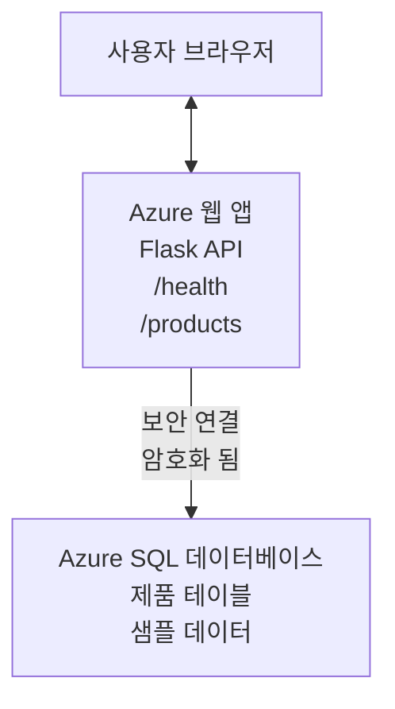

# AZD를 사용한 Microsoft SQL 데이터베이스 및 웹 앱 배포

⏱️ **예상 소요 시간**: 20-30분 | 💰 **예상 비용**: 약 $15-25/월 | ⭐ <strong>난이도</strong>: 중급

이 <strong>완전하고 작동하는 예제</strong>는 [Azure Developer CLI (azd)](https://learn.microsoft.com/azure/developer/azure-developer-cli/)를 사용하여 Python Flask 웹 애플리케이션과 Microsoft SQL 데이터베이스를 Azure에 배포하는 방법을 보여줍니다. 모든 코드는 포함되어 있으며 테스트 되었으며, 외부 종속성이 필요 없습니다.

## 배울 내용

이 예제를 완료하면 다음을 할 수 있습니다:
- 인프라를 코드로 사용해 다중 계층 애플리케이션(웹 앱 + 데이터베이스) 배포
- 비밀 정보를 하드코딩 없이 안전한 데이터베이스 연결 구성
- Application Insights를 통한 애플리케이션 상태 모니터링
- AZD CLI를 사용한 Azure 리소스 관리 효율화
- 보안, 비용 최적화, 관측 가능성에 대한 Azure 모범 사례 준수

## 시나리오 개요
- **웹 앱**: 데이터베이스 연결을 포함한 Python Flask REST API
- <strong>데이터베이스</strong>: 샘플 데이터를 포함한 Azure SQL 데이터베이스
- <strong>인프라</strong>: Bicep(모듈식, 재사용 가능한 템플릿)를 사용해 프로비저닝
- <strong>배포</strong>: `azd` 명령어로 완전 자동화
- <strong>모니터링</strong>: 로그 및 원격측정을 위한 Application Insights

## 사전 요구사항

### 필수 도구

시작하기 전에 다음 도구가 설치되어 있는지 확인하세요:

1. **[Azure CLI](https://learn.microsoft.com/cli/azure/install-azure-cli)** (버전 2.50.0 이상)
   ```sh
   az --version
   # 예상 출력: azure-cli 2.50.0 이상
   ```

2. **[Azure Developer CLI (azd)](https://learn.microsoft.com/azure/developer/azure-developer-cli/install-azd)** (버전 1.0.0 이상)
   ```sh
   azd version
   # 예상 출력: azd 버전 1.0.0 이상
   ```

3. **[Python 3.8+](https://www.python.org/downloads/)** (로컬 개발용)
   ```sh
   python --version
   # 예상 출력: Python 3.8 이상
   ```

4. **[Docker](https://www.docker.com/get-started)** (선택 사항, 로컬 컨테이너 개발용)
   ```sh
   docker --version
   # 예상 출력: Docker 버전 20.10 이상
   ```

### Azure 요구사항

- 활성 상태의 **Azure 구독** ([무료 계정 만들기](https://azure.microsoft.com/free/))
- 구독 내 리소스 생성 권한 보유
- 구독 또는 리소스 그룹에 대한 **소유자(Owner)** 또는 **기여자(Contributor)** 역할

### 지식 사전 조건

이 예제는 <strong>중급 수준</strong>입니다. 다음 사항에 익숙해야 합니다:
- 기본적인 명령줄 조작
- 클라우드 기본 개념(리소스, 리소스 그룹)
- 웹 애플리케이션 및 데이터베이스 기본 이해

**AZD가 처음인가요?** 먼저 [시작 가이드](../../docs/chapter-01-foundation/azd-basics.md)를 참고하세요.

## 아키텍처

이 예제는 웹 애플리케이션과 SQL 데이터베이스가 포함된 2계층 아키텍처를 배포합니다:



**리소스 배포:**
- **리소스 그룹**: 모든 리소스 컨테이너
- **앱 서비스 플랜**: Linux 기반 호스팅(B1 티어로 비용 효율적)
- **웹 앱**: Python 3.11 런타임에 Flask 앱
- **SQL 서버**: TLS 1.2 이상 지원 관리형 데이터베이스 서버
- **SQL 데이터베이스**: 개발/테스트용 기본 티어(2GB)
- **Application Insights**: 모니터링 및 로깅
- **로그 분석 작업 영역**: 중앙 집중식 로그 저장소

<strong>비유</strong>: 웹 앱이 식당, 데이터베이스가 냉동고라고 생각하세요. 고객이 메뉴(API 엔드포인트)에서 주문하면 주방(Flask 앱)이 냉동고에서 재료(데이터)를 꺼냅니다. 식당 관리자(Application Insights)가 모든 일을 추적합니다.

## 폴더 구조

모든 파일이 이 예제에 포함되어 있으며 외부 종속성은 없습니다:

```
examples/database-app/
│
├── README.md                    # This file
├── azure.yaml                   # AZD configuration file
├── .env.sample                  # Sample environment variables
├── .gitignore                   # Git ignore patterns
│
├── infra/                       # Infrastructure as Code (Bicep)
│   ├── main.bicep              # Main orchestration template
│   ├── abbreviations.json      # Azure naming conventions
│   └── resources/              # Modular resource templates
│       ├── sql-server.bicep    # SQL Server configuration
│       ├── sql-database.bicep  # Database configuration
│       ├── app-service-plan.bicep  # Hosting plan
│       ├── app-insights.bicep  # Monitoring setup
│       └── web-app.bicep       # Web application
│
└── src/
    └── web/                    # Application source code
        ├── app.py              # Flask REST API
        ├── requirements.txt    # Python dependencies
        └── Dockerfile          # Container definition
```

**각 파일 역할:**
- **azure.yaml**: AZD에 무엇을 어디에 배포할지 지시
- **infra/main.bicep**: 모든 Azure 리소스 조율
- **infra/resources/*.bicep**: 개별 리소스 정의(모듈식 재사용 가능)
- **src/web/app.py**: 데이터베이스 로직이 포함된 Flask 앱
- **requirements.txt**: Python 패키지 종속성
- **Dockerfile**: 배포용 컨테이너화 지침

## 빠른 시작 (단계별)

### 1단계: 복제 및 탐색

```sh
git clone https://github.com/microsoft/AZD-for-beginners.git
cd AZD-for-beginners/examples/database-app
```

**✓ 성공 확인**: `azure.yaml` 파일과 `infra/` 폴더가 보여야 합니다:
```sh
ls
# 예상됨: README.md, azure.yaml, infra/, src/
```

### 2단계: Azure 로그인

```sh
azd auth login
```

브라우저가 열려 Azure 인증을 진행합니다. Azure 계정으로 로그인하세요.

**✓ 성공 확인**: 다음이 보여야 합니다:
```
Logged in to Azure.
```

### 3단계: 환경 초기화

```sh
azd init
```

**무슨 일이 일어나나요**: AZD가 배포용 로컬 구성 생성

**보게 될 프롬프트**:
- **환경 이름**: 단축 이름 입력(예: `dev`, `myapp`)
- **Azure 구독 선택**: 구독 목록에서 선택
- **Azure 위치 선택**: 지역 선택(예: `eastus`, `westeurope`)

**✓ 성공 확인**: 다음이 보여야 합니다:
```
SUCCESS: New project initialized!
```

### 4단계: Azure 리소스 프로비저닝

```sh
azd provision
```

**무슨 일이 일어나나요**: AZD가 모든 인프라 배포(5-8분 소요):
1. 리소스 그룹 생성
2. SQL 서버 및 데이터베이스 생성
3. 앱 서비스 플랜 생성
4. 웹 앱 생성
5. Application Insights 생성
6. 네트워킹 및 보안 구성

**입력해야 할 내용**:
- **SQL 관리자 사용자 이름**: 사용자 이름 입력(예: `sqladmin`)
- **SQL 관리자 비밀번호**: 강력한 비밀번호 입력(저장 필수!)

**✓ 성공 확인**: 다음이 보여야 합니다:
```
SUCCESS: Your application was provisioned in Azure in X minutes Y seconds.
You can view the resources created under the resource group rg-<env-name> in Azure Portal:
https://portal.azure.com/#@/resource/subscriptions/.../resourceGroups/rg-<env-name>
```

**⏱️ 시간**: 5-8분

### 5단계: 애플리케이션 배포

```sh
azd deploy
```

**무슨 일이 일어나나요**: AZD가 Flask 앱 빌드 및 배포 수행:
1. Python 애플리케이션 패키징
2. Docker 컨테이너 빌드
3. Azure 웹 앱으로 푸시
4. 샘플 데이터로 데이터베이스 초기화
5. 애플리케이션 시작

**✓ 성공 확인**: 다음이 보여야 합니다:
```
SUCCESS: Your application was deployed to Azure in X minutes Y seconds.
You can view the resources created under the resource group rg-<env-name> in Azure Portal:
https://portal.azure.com/#@/resource/subscriptions/.../resourceGroups/rg-<env-name>
```

**⏱️ 시간**: 3-5분

### 6단계: 애플리케이션 브라우징

```sh
azd browse
```

배포된 웹 앱이 브라우저에서 `https://app-<unique-id>.azurewebsites.net`에서 열립니다.

**✓ 성공 확인**: JSON 출력이 보여야 합니다:
```json
{
  "message": "Welcome to the Database App API",
  "endpoints": {
    "/": "This help message",
    "/health": "Health check endpoint",
    "/products": "List all products",
    "/products/<id>": "Get product by ID"
  }
}
```

### 7단계: API 엔드포인트 테스트

**헬스 체크** (데이터베이스 연결 확인):
```sh
curl https://app-<your-id>.azurewebsites.net/health
```

**예상 응답**:
```json
{
  "status": "healthy",
  "database": "connected"
}
```

**제품 목록 조회** (샘플 데이터):
```sh
curl https://app-<your-id>.azurewebsites.net/products
```

**예상 응답**:
```json
[
  {
    "id": 1,
    "name": "Laptop",
    "description": "High-performance laptop",
    "price": 1299.99,
    "created_at": "2025-11-19T10:30:00"
  },
  ...
]
```

**단일 제품 조회**:
```sh
curl https://app-<your-id>.azurewebsites.net/products/1
```

**✓ 성공 확인**: 모든 엔드포인트가 오류 없이 JSON 데이터 반환.

---

**🎉 축하합니다!** AZD를 사용해 데이터베이스가 포함된 웹 애플리케이션을 성공적으로 Azure에 배포했습니다.

## 구성 상세 설명

### 환경 변수

비밀은 Azure App Service 구성에서 안전하게 관리됩니다—**소스 코드에 하드코딩 금지**.

**AZD가 자동으로 구성하는 항목**:
- `SQL_CONNECTION_STRING`: 암호화된 자격증명이 포함된 데이터베이스 연결 문자열
- `APPLICATIONINSIGHTS_CONNECTION_STRING`: 모니터링 원격측정 엔드포인트
- `SCM_DO_BUILD_DURING_DEPLOYMENT`: 자동 종속성 설치 활성화

**비밀 저장 위치**:
1. `azd provision` 시 SQL 자격증명을 보안 프롬프트로 제공
2. AZD가 로컬 `.azure/<env-name>/.env` 파일에 저장(깃 무시)
3. AZD가 이를 Azure App Service 구성에 주입(암호화 저장)
4. 애플리케이션이 `os.getenv()`로 실행 시 읽음

### 로컬 개발

로컬 테스트용으로 샘플에서 `.env` 파일 생성:

```sh
cp .env.sample .env
# 로컬 데이터베이스 연결 정보로 .env를 수정하세요
```

**로컬 개발 워크플로우**:
```sh
# 종속성 설치
cd src/web
pip install -r requirements.txt

# 환경 변수 설정
export SQL_CONNECTION_STRING="your-local-connection-string"

# 애플리케이션 실행
python app.py
```

**로컬 테스트 실행**:
```sh
curl http://localhost:8000/health
# 예상됨: {"status": "healthy", "database": "connected"}
```

### 코드형 인프라

모든 Azure 리소스는 **Bicep 템플릿**(`infra/` 폴더)에 정의되어 있습니다:

- **모듈식 설계**: 각 리소스 유형별 개별 파일로 재사용 가능
- <strong>파라미터화</strong>: SKU, 위치, 이름 규칙 커스터마이징 지원
- **모범 사례 준수**: Azure 명명 표준 및 보안 기본값 준수
- **버전 관리**: 인프라 변경 사항을 Git에서 추적

**커스터마이징 예시**:
데이터베이스 티어 변경은 `infra/resources/sql-database.bicep` 편집:
```bicep
sku: {
  name: 'Standard'  // Changed from 'Basic'
  tier: 'Standard'
  capacity: 10
}
```

## 보안 모범 사례

이 예제는 Azure 보안 모범 사례를 따릅니다:

### 1. **소스 코드에 비밀 금지**
- ✅ 자격증명은 Azure App Service 구성에 저장(암호화)
- ✅ `.env` 파일은 `.gitignore`에 포함되어 Git 제외
- ✅ 프로비저닝 중 보안 파라미터로 비밀 전달

### 2. **암호화 연결**
- ✅ SQL 서버에 TLS 1.2 이상 적용
- ✅ 웹 앱에 HTTPS 전용 적용
- ✅ 데이터베이스 연결은 암호화 채널 사용

### 3. **네트워크 보안**
- ✅ SQL 서버 방화벽을 Azure 서비스만 허용하도록 구성
- ✅ 공개 네트워크 액세스 제한(개인 엔드포인트로 추가 잠금 가능)
- ✅ 웹 앱에서 FTPS 비활성화

### 4. **인증 및 권한 부여**
- ⚠️ <strong>현재</strong>: SQL 인증(사용자 이름/비밀번호)
- ✅ **운영 환경 권장**: Azure 관리 ID를 이용한 비밀번호 없는 인증

**관리 ID 전환 방법** (운영용):
1. 웹 앱에서 관리 ID 활성화
2. 아이덴티티에 SQL 권한 부여
3. 연결 문자열을 관리 ID 사용으로 업데이트
4. 비밀번호 기반 인증 제거

### 5. **감사 및 준수**
- ✅ Application Insights에 모든 요청과 오류 로그 기록
- ✅ SQL 데이터베이스 감사 활성화(규정 준수 구성 가능)
- ✅ 모든 리소스에 거버넌스용 태그 적용

**운영 전 보안 체크리스트**:
- [ ] SQL용 Azure Defender 활성화
- [ ] SQL 데이터베이스용 개인 엔드포인트 구성
- [ ] 웹 애플리케이션 방화벽(WAF) 활성화
- [ ] Azure Key Vault로 비밀 자동 교체 구현
- [ ] Microsoft Entra ID 인증 구성
- [ ] 모든 리소스 진단 로깅 활성화

## 비용 최적화

**월 예상 비용** (2025년 11월 기준):

| 리소스 | SKU/티어 | 예상 비용 |
|----------|----------|----------------|
| 앱 서비스 플랜 | B1 (기본) | 약 $13/월 |
| SQL 데이터베이스 | 기본 (2GB) | 약 $5/월 |
| Application Insights | 종량제 | 약 $2/월 (저트래픽) |
| <strong>총합</strong> | | **약 $20/월** |

**💡 비용 절감 팁**:

1. **학습용 무료 티어 사용**:
   - 앱 서비스: F1 티어(무료, 시간 제한 있음)
   - SQL 데이터베이스: Azure SQL Database 서버리스 사용
   - Application Insights: 월 5GB 무료 수집

2. **미사용 시 리소스 중지**:
   ```sh
   # 웹 앱 중지 (데이터베이스는 계속 비용 청구)
   az webapp stop --name <app-name> --resource-group <rg-name>
   
   # 필요할 때 다시 시작
   az webapp start --name <app-name> --resource-group <rg-name>
   ```

3. **테스트 후 모든 리소스 삭제**:
   ```sh
   azd down
   ```
   이를 통해 모든 리소스를 삭제하고 비용 발생 중단.

4. **개발과 운영용 SKU 구분**:
   - <strong>개발용</strong>: 기본 티어(본 예제 사용)
   - <strong>운영용</strong>: 중복성 있는 표준/프리미엄 티어

**비용 모니터링**:
- [Azure 비용 관리](https://portal.azure.com/#view/Microsoft_Azure_CostManagement)에서 비용 확인
- 비용 알림 설정으로 예기치 않은 과금 방지
- 모든 리소스에 `azd-env-name` 태그 적용하여 추적

**무료 티어 대체법**:
학습 시 `infra/resources/app-service-plan.bicep` 수정:
```bicep
sku: {
  name: 'F1'  // Free tier
  tier: 'Free'
}
```
<strong>참고</strong>: 무료 티어 제한(일 CPU 60분, 항상 켜기 없음 있음).

## 모니터링 및 관측

### Application Insights 통합

이 예제는 전체 모니터링을 위한 <strong>Application Insights</strong>를 포함합니다:

**모니터링 항목**:
- ✅ HTTP 요청(지연시간, 상태 코드, 엔드포인트)
- ✅ 애플리케이션 오류 및 예외
- ✅ Flask 앱의 커스텀 로깅
- ✅ 데이터베이스 연결 상태
- ✅ 성능 지표(CPU, 메모리)

**Application Insights 접근법**:
1. [Azure 포털](https://portal.azure.com) 열기
2. 리소스 그룹(`rg-<env-name>`)으로 이동
3. Application Insights 리소스(`appi-<unique-id>`) 클릭

**유용한 쿼리** (Application Insights → 로그):

**모든 요청 보기**:
```kusto
requests
| where timestamp > ago(1h)
| order by timestamp desc
| project timestamp, name, url, resultCode, duration
```

**오류 찾기**:
```kusto
exceptions
| where timestamp > ago(24h)
| order by timestamp desc
| project timestamp, type, outerMessage, operation_Name
```

**헬스 엔드포인트 상태 확인**:
```kusto
requests
| where name contains "health"
| summarize count() by resultCode, bin(timestamp, 1h)
```

### SQL 데이터베이스 감사

<strong>SQL 데이터베이스 감사 활성화됨</strong>으로 다음 추적:
- 데이터베이스 접근 패턴
- 로그인 실패 시도
- 스키마 변경
- 데이터 접근(준수 목적)

**감사 로그 접근법**:
1. Azure 포털 → SQL 데이터베이스 → 감사
2. 로그 분석 작업 영역에서 로그 확인

### 실시간 모니터링

**라이브 메트릭 보기**:
1. Application Insights → 라이브 메트릭
2. 요청, 실패, 성능을 실시간으로 확인

**경보 설정**:
중요 이벤트에 대해 경보 설정:
- HTTP 500 오류 5분 내 5회 초과
- 데이터베이스 연결 실패
- 높은 응답 시간(2초 초과)

**경보 생성 예시**:
```sh
az monitor metrics alert create \
  --name "High-Response-Time" \
  --resource-group <rg-name> \
  --scopes <app-insights-resource-id> \
  --condition "avg requests/duration > 2000" \
  --description "Alert when response time exceeds 2 seconds"
```

## 문제 해결
### 일반적인 문제 및 해결책

#### 1. `azd provision`이 "Location not available" 오류로 실패함

<strong>증상</strong>:
```
Error: The subscription is not registered for the resource type 'components' in the location 'centralus'.
```

<strong>해결책</strong>:
다른 Azure 리전을 선택하거나 리소스 공급자를 등록하세요:
```sh
az provider register --namespace Microsoft.Insights
```

#### 2. 배포 중 SQL 연결 실패

<strong>증상</strong>:
```
pyodbc.OperationalError: ('08001', '[08001] [Microsoft][ODBC Driver 18 for SQL Server]TCP Provider...')
```

<strong>해결책</strong>:
- SQL 서버 방화벽이 Azure 서비스 허용 여부 확인 (자동 구성됨)
- `azd provision` 시 SQL 관리자 비밀번호가 올바르게 입력되었는지 확인
- SQL 서버가 완전히 프로비저닝되었는지 확인 (2-3분 소요될 수 있음)

**연결 확인**:
```sh
# Azure 포털에서 SQL 데이터베이스 → 쿼리 편집기로 이동합니다
# 자격 증명을 사용하여 연결을 시도합니다
```

#### 3. 웹 앱에서 "Application Error" 표시됨

<strong>증상</strong>:
브라우저에 일반적인 오류 페이지가 표시됨.

<strong>해결책</strong>:
애플리케이션 로그를 확인하세요:
```sh
# 최근 로그 보기
az webapp log tail --name <app-name> --resource-group <rg-name>
```

**일반적인 원인**:
- 누락된 환경 변수 (App Service → 구성에서 확인)
- Python 패키지 설치 실패 (배포 로그 확인)
- 데이터베이스 초기화 오류 (SQL 연결 확인)

#### 4. `azd deploy`가 "Build Error"로 실패함

<strong>증상</strong>:
```
Error: Failed to build project
```

<strong>해결책</strong>:
- `requirements.txt`에 문법 오류가 없는지 확인
- `infra/resources/web-app.bicep`에 Python 3.11이 지정되어 있는지 확인
- Dockerfile의 기본 이미지가 올바른지 확인

**로컬 디버깅**:
```sh
cd src/web
docker build -t test-app .
docker run -p 8000:8000 test-app
```

#### 5. AZD 명령 실행 시 "Unauthorized" 오류

<strong>증상</strong>:
```
ERROR: (Unauthorized) The client '<id>' with object id '<id>' does not have authorization
```

<strong>해결책</strong>:
Azure에 다시 인증하세요:
```sh
# AZD 워크플로우에 필요함
azd auth login

# Azure CLI 명령어를 직접 사용하는 경우 선택 사항임
az login
```

구독에 대해 올바른 권한(기여자 역할)을 가지고 있는지 확인하세요.

#### 6. 높은 데이터베이스 비용

<strong>증상</strong>:
예상치 못한 Azure 요금 청구.

<strong>해결책</strong>:
- 테스트 후 `azd down`을 실행하는 것을 잊지 않았는지 확인
- SQL 데이터베이스가 프리미엄이 아닌 기본 티어를 사용 중인지 확인
- Azure 비용 관리에서 비용 검토
- 비용 알림 설정

### 도움말 받기

**모든 AZD 환경 변수 보기**:
```sh
azd env get-values
```

**배포 상태 확인**:
```sh
az webapp show --name <app-name> --resource-group <rg-name> --query state
```

**애플리케이션 로그 접근**:
```sh
az webapp log download --name <app-name> --resource-group <rg-name> --log-file app-logs.zip
```

**추가 지원 필요?**
- [AZD 문제 해결 가이드](../../docs/chapter-07-troubleshooting/common-issues.md)
- [Azure App Service 문제 해결](https://learn.microsoft.com/azure/app-service/troubleshoot-diagnostic-logs)
- [Azure SQL 문제 해결](https://learn.microsoft.com/azure/azure-sql/database/troubleshoot-common-errors-issues)

## 실습 과제

### 과제 1: 배포 확인 (초급)

<strong>목표</strong>: 모든 리소스가 배포되고 애플리케이션이 정상 작동하는지 확인.

<strong>단계</strong>:
1. 리소스 그룹 내 모든 리소스 나열:
   ```sh
   az resource list --resource-group rg-<env-name> --output table
   ```
   **예상 결과**: 6-7개의 리소스 (웹 앱, SQL 서버, SQL 데이터베이스, 앱 서비스 플랜, 애플리케이션 인사이트, 로그 분석)

2. 모든 API 엔드포인트 테스트:
   ```sh
   curl https://app-<your-id>.azurewebsites.net/
   curl https://app-<your-id>.azurewebsites.net/health
   curl https://app-<your-id>.azurewebsites.net/products
   curl https://app-<your-id>.azurewebsites.net/products/1
   ```
   **예상 결과**: 오류 없이 모두 유효한 JSON 반환

3. 애플리케이션 인사이트 확인:
   - Azure 포털에서 Application Insights로 이동
   - "Live Metrics" 탭 선택
   - 웹 앱에서 브라우저 새로 고침
   **예상 결과**: 요청이 실시간으로 표시됨

**성공 기준**: 6-7개 리소스 존재, 모든 엔드포인트에서 데이터 반환, Live Metrics에서 활동 확인.

---

### 과제 2: 새로운 API 엔드포인트 추가 (중급)

<strong>목표</strong>: Flask 애플리케이션에 새 엔드포인트 확장.

**시작 코드**: 현재 엔드포인트는 `src/web/app.py`에 있음

<strong>단계</strong>:
1. `src/web/app.py` 편집, `get_product()` 함수 뒤에 새 엔드포인트 추가:
   ```python
   @app.route('/products/search/<keyword>')
   def search_products(keyword):
       """Search products by name or description."""
       try:
           conn = get_db_connection()
           cursor = conn.cursor()
           cursor.execute(
               "SELECT id, name, description, price, created_at FROM products WHERE name LIKE ? OR description LIKE ?",
               (f'%{keyword}%', f'%{keyword}%')
           )
           
           products = []
           for row in cursor.fetchall():
               products.append({
                   'id': row[0],
                   'name': row[1],
                   'description': row[2],
                   'price': float(row[3]) if row[3] else None,
                   'created_at': row[4].isoformat() if row[4] else None
               })
           
           cursor.close()
           conn.close()
           
           logger.info(f"Search for '{keyword}' returned {len(products)} results")
           return jsonify(products), 200
           
       except Exception as e:
           logger.error(f"Error searching products: {str(e)}")
           return jsonify({'error': str(e)}), 500
   ```

2. 업데이트된 애플리케이션 배포:
   ```sh
   azd deploy
   ```

3. 새 엔드포인트 테스트:
   ```sh
   curl https://app-<your-id>.azurewebsites.net/products/search/laptop
   ```
   **예상 결과**: "laptop"에 일치하는 제품 반환

**성공 기준**: 새 엔드포인트 정상 작동, 필터링된 결과 반환, 애플리케이션 인사이트 로그에 나타남.

---

### 과제 3: 모니터링 및 알림 추가 (고급)

<strong>목표</strong>: 사전 대응 모니터링 및 알림 설정.

<strong>단계</strong>:
1. HTTP 500 오류에 대한 알림 생성:
   ```sh
   # 애플리케이션 인사이트 리소스 ID 가져오기
   AI_ID=$(az monitor app-insights component show \
     --app appi-<your-id> \
     --resource-group rg-<env-name> \
     --query id -o tsv)
   
   # 경고 생성
   az monitor metrics alert create \
     --name "High-Error-Rate" \
     --resource-group rg-<env-name> \
     --scopes $AI_ID \
     --condition "count requests/failed > 5" \
     --window-size 5m \
     --evaluation-frequency 1m \
     --description "Alert when >5 failed requests in 5 minutes"
   ```

2. 오류 발생시켜 알림 트리거:
   ```sh
   # 존재하지 않는 제품 요청
   for i in {1..10}; do curl https://app-<your-id>.azurewebsites.net/products/999; done
   ```

3. 알림이 발생했는지 확인:
   - Azure 포털 → 알림 → 경고 규칙
   - 이메일 확인 (설정된 경우)

**성공 기준**: 알림 규칙 생성, 오류 발생 시 트리거, 알림 수신.

---

### 과제 4: 데이터베이스 스키마 변경 (고급)

<strong>목표</strong>: 새 테이블 추가 및 애플리케이션에서 사용하도록 수정.

<strong>단계</strong>:
1. Azure 포털 쿼리 편집기로 SQL 데이터베이스 연결

2. 새 `categories` 테이블 생성:
   ```sql
   CREATE TABLE categories (
       id INT PRIMARY KEY IDENTITY(1,1),
       name NVARCHAR(50) NOT NULL,
       description NVARCHAR(200)
   );
   
   INSERT INTO categories (name, description) VALUES
   ('Electronics', 'Electronic devices and accessories'),
   ('Office Supplies', 'Office equipment and supplies');
   
   -- Add category to products table
   ALTER TABLE products ADD category_id INT;
   UPDATE products SET category_id = 1; -- Set all to Electronics
   ```

3. `src/web/app.py` 업데이트하여 응답에 카테고리 정보 포함

4. 배포 및 테스트

**성공 기준**: 새 테이블 존재, 제품에 카테고리 정보 표시, 애플리케이션 정상 작동.

---

### 과제 5: 캐싱 구현 (전문가)

<strong>목표</strong>: Azure Redis Cache 추가하여 성능 개선.

<strong>단계</strong>:
1. `infra/main.bicep`에 Redis Cache 추가
2. `src/web/app.py` 업데이트하여 제품 쿼리 캐싱
3. 애플리케이션 인사이트로 성능 개선 측정
4. 캐싱 전후 응답 시간 비교

**성공 기준**: Redis 배포 완료, 캐싱 정상 작동, 응답 시간 50% 이상 개선.

<strong>팁</strong>: [Azure Cache for Redis 문서](https://learn.microsoft.com/azure/azure-cache-for-redis/)에서 시작하세요.

---

## 정리

지속적 요금 발생 방지를 위해 작업 완료 후 모든 리소스 삭제:

```sh
azd down
```

**확인 메시지**:
```
? Total resources to delete: 7, are you sure you want to continue? (y/N)
```

`y` 입력하여 확인.

**✓ 성공 확인**: 
- Azure 포털에서 모든 리소스 삭제됨
- 요금 청구 없음
- 로컬 `.azure/<env-name>` 폴더 삭제 가능

<strong>대안</strong> (인프라는 유지하고 데이터만 삭제):
```sh
# 리소스 그룹만 삭제합니다 (AZD 구성은 유지).
az group delete --name rg-<env-name> --yes
```
## 추가 학습

### 관련 문서
- [Azure Developer CLI 문서](https://learn.microsoft.com/azure/developer/azure-developer-cli/)
- [Azure SQL 데이터베이스 문서](https://learn.microsoft.com/azure/azure-sql/database/)
- [Azure App Service 문서](https://learn.microsoft.com/azure/app-service/)
- [Application Insights 문서](https://learn.microsoft.com/azure/azure-monitor/app/app-insights-overview)
- [Bicep 언어 참조](https://learn.microsoft.com/azure/azure-resource-manager/bicep/)

### 이 강의 다음 단계
- **[컨테이너 앱 예제](../../../../examples/container-app)**: Azure Container Apps를 이용해 마이크로서비스 배포
- **[AI 통합 가이드](../../../../docs/ai-foundry)**: 앱에 AI 기능 추가
- **[배포 모범 사례](../../docs/chapter-04-infrastructure/deployment-guide.md)**: 프로덕션 배포 패턴

### 고급 주제
- **관리형 ID**: 비밀번호 없이 Microsoft Entra ID 인증 사용
- **프라이빗 엔드포인트**: 가상 네트워크 내 데이터베이스 연결 보안 강화
- **CI/CD 통합**: GitHub Actions 또는 Azure DevOps로 배포 자동화
- **다중 환경**: 개발, 스테이징, 프로덕션 환경 구성
- **데이터베이스 마이그레이션**: Alembic 또는 Entity Framework로 스키마 버전 관리

### 다른 접근법과 비교

**AZD vs. ARM 템플릿**:
- ✅ AZD: 상위 수준 추상화, 간단한 명령어
- ⚠️ ARM: 더 자세하고 세밀한 제어

**AZD vs. Terraform**:
- ✅ AZD: Azure 네이티브, Azure 서비스와 통합
- ⚠️ Terraform: 다중 클라우드 지원, 대규모 생태계

**AZD vs. Azure 포털**:
- ✅ AZD: 반복 가능, 버전 관리, 자동화 가능
- ⚠️ 포털: 수동 클릭, 재현 어려움

**AZD를 생각하세요**: Azure용 Docker Compose—복잡한 배포를 간단하게 구성.

---

## 자주 묻는 질문

**Q: 다른 프로그래밍 언어를 사용할 수 있나요?**  
A: 네! `src/web/`를 Node.js, C#, Go 또는 다른 언어로 교체하세요. `azure.yaml`과 Bicep도 함께 업데이트하세요.

**Q: 데이터베이스를 더 추가하려면?**  
A: `infra/main.bicep`에 다른 SQL 데이터베이스 모듈을 추가하거나 Azure Database의 PostgreSQL/MySQL을 사용하세요.

**Q: 이걸 프로덕션에 쓸 수 있나요?**  
A: 시작점입니다. 프로덕션에는 관리형 ID, 프라이빗 엔드포인트, 중복성, 백업 전략, WAF, 고급 모니터링 등을 추가하세요.

**Q: 코드 배포 대신 컨테이너를 사용하고 싶으면?**  
A: [컨테이너 앱 예제](../../../../examples/container-app)를 참고하세요. 전체적으로 Docker 컨테이너를 사용합니다.

**Q: 내 로컬 컴퓨터에서 데이터베이스에 연결하려면?**  
A: SQL 서버 방화벽에 IP를 추가하세요:
```sh
az sql server firewall-rule create \
  --resource-group rg-<env-name> \
  --server sql-<unique-id> \
  --name AllowMyIP \
  --start-ip-address <your-ip> \
  --end-ip-address <your-ip>
```

**Q: 새 데이터베이스 대신 기존 데이터베이스를 사용할 수 있나요?**  
A: 네, `infra/main.bicep`를 수정하여 기존 SQL 서버를 참조하고 연결 문자열 매개변수를 업데이트하세요.

---

> **참고:** 이 예제는 AZD를 사용해 데이터베이스가 있는 웹 앱을 배포하는 모범 사례를 보여줍니다. 작동하는 코드, 포괄적 문서, 실습 과제를 포함하며 학습을 돕습니다. 프로덕션 배포 시 조직별 보안, 확장성, 규정 준수, 비용 요구 사항을 검토하세요.

**📚 강의 내비게이션:**
- ← 이전: [컨테이너 앱 예제](../../../../examples/container-app)
- → 다음: [AI 통합 가이드](../../../../docs/ai-foundry)
- 🏠 [강의 홈](../../README.md)

---

<!-- CO-OP TRANSLATOR DISCLAIMER START -->
**면책 조항**:
이 문서는 AI 번역 서비스 [Co-op Translator](https://github.com/Azure/co-op-translator)를 사용하여 번역되었습니다. 정확성을 기하기 위해 노력하고 있으나, 자동 번역은 오류나 부정확한 부분이 있을 수 있음을 유의하시기 바랍니다. 원본 문서의 원어본이 권위 있는 자료로 간주되어야 합니다. 중요한 정보의 경우, 전문가의 인간 번역을 권장합니다. 이 번역 사용으로 인해 발생하는 오해나 잘못된 해석에 대해 당사는 책임을 지지 않습니다.
<!-- CO-OP TRANSLATOR DISCLAIMER END -->