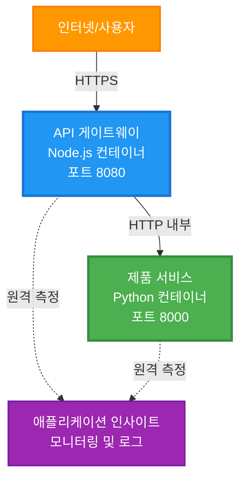
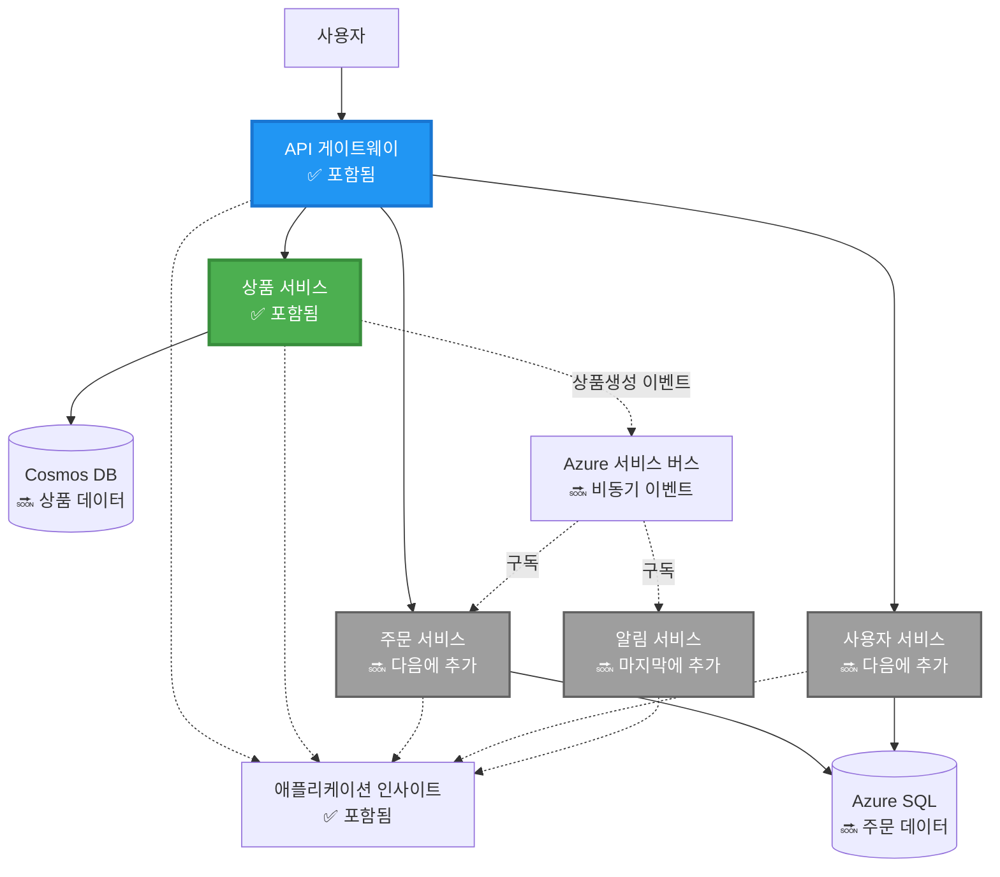
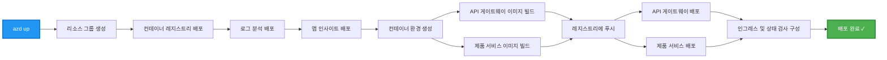
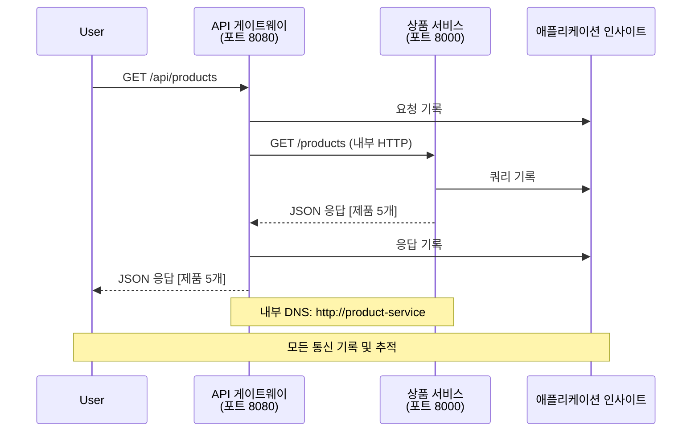

# 마이크로서비스 아키텍처 - 컨테이너 앱 예제

⏱️ **예상 소요 시간**: 25-35분 | 💰 **예상 비용**: 약 $50-100/월 | ⭐ **복잡도**: 고급

**📚 학습 경로:**
- ← 이전: [Simple Flask API](../../../../examples/container-app/simple-flask-api) - 단일 컨테이너 기초
- 🎯 **현재 위치**: 마이크로서비스 아키텍처 (2서비스 기반)
- → 다음: [AI Integration](../../../../docs/ai-foundry) - 서비스에 지능 추가
- 🏠 [강좌 홈](../../README.md)

---

AZD CLI를 사용하여 Azure Container Apps에 배포하는 **단순하지만 기능적인** 마이크로서비스 아키텍처 예제입니다. 이 예제는 서비스 간 통신, 컨테이너 오케스트레이션 및 모니터링을 2서비스 실습 환경에서 보여줍니다.

> **📚 학습 접근법**: 이 예제는 실제 배포하고 학습할 수 있는 최소 2서비스 아키텍처(API 게이트웨이 + 백엔드 서비스)부터 시작합니다. 이 기초를 마스터한 후 전체 마이크로서비스 생태계 확장 안내를 제공합니다.

## 학습 내용

이 예제를 완료하면 다음을 할 수 있습니다:
- 여러 컨테이너를 Azure Container Apps에 배포하기
- 내부 네트워킹을 이용한 서비스 간 통신 구현
- 환경 기반 스케일링 및 상태 검사 구성
- Application Insights로 분산 애플리케이션 모니터링
- 마이크로서비스 배포 패턴 및 모범 사례 이해
- 단순 구조에서 복잡한 아키텍처로 점진적 확장 학습

## 아키텍처

### 1단계: 구축할 내용 (이 예제 포함)


```mermaid
graph TB
    Internet[인터넷/사용자]
    Gateway[API 게이트웨이<br/>Node.js 컨테이너<br/>포트 8080]
    Product[제품 서비스<br/>Python 컨테이너<br/>포트 8000]
    AppInsights[애플리케이션 인사이트<br/>모니터링 및 로그]
    
    Internet -->|HTTPS| Gateway
    Gateway -->|HTTP 내부| Product
    Gateway -.->|원격 측정| AppInsights
    Product -.->|원격 측정| AppInsights
    
    style Gateway fill:#2196F3,stroke:#1976D2,stroke-width:3px,color:#fff
    style Product fill:#4CAF50,stroke:#388E3C,stroke-width:3px,color:#fff
    style Internet fill:#FF9800,stroke:#F57C00,stroke-width:2px,color:#fff
    style AppInsights fill:#9C27B0,stroke:#7B1FA2,stroke-width:2px,color:#fff
```
**구성 요소 상세:**

| 구성 요소 | 목적 | 접근 | 리소스 |
|-----------|---------|--------|-----------|
| **API 게이트웨이** | 외부 요청을 백엔드 서비스로 라우팅 | 공개 (HTTPS) | 1 vCPU, 2GB RAM, 2-20 복제본 |
| **제품 서비스** | 인메모리 데이터 기반 제품 카탈로그 관리 | 내부 전용 | 0.5 vCPU, 1GB RAM, 1-10 복제본 |
| **Application Insights** | 중앙 집중형 로깅 및 분산 추적 | Azure 포털 | 월 1-2 GB 데이터 수집 |

**왜 단순하게 시작할까?**
- ✅ 빠른 배포 및 이해 (25-35분)
- ✅ 복잡성 없이 핵심 마이크로서비스 패턴 학습
- ✅ 수정 및 실험 가능한 작동 코드
- ✅ 학습 비용 절감 (~월 $50-100 vs $300-1400)
- ✅ 데이터베이스 및 메시지 큐 추가 전 자신감 구축

**비유**: 운전 배우기처럼 생각하세요. 빈 주차장(2 서비스)에서 기본을 익히고, 이후 도심 교통(5개 이상 서비스 및 DB)으로 점차 확장합니다.

### 2단계: 향후 확장 (참조 아키텍처)

2서비스 아키텍처를 마스터하면 다음과 같이 확장할 수 있습니다:


```mermaid
graph TB
    User[사용자]
    Gateway[API 게이트웨이<br/>✅ 포함됨]
    Product[상품 서비스<br/>✅ 포함됨]
    Order[주문 서비스<br/>🔜 다음에 추가]
    UserSvc[사용자 서비스<br/>🔜 다음에 추가]
    Notify[알림 서비스<br/>🔜 마지막에 추가]
    
    CosmosDB[(Cosmos DB<br/>🔜 상품 데이터)]
    AzureSQL[(Azure SQL<br/>🔜 주문 데이터)]
    ServiceBus[Azure 서비스 버스<br/>🔜 비동기 이벤트]
    AppInsights[애플리케이션 인사이트<br/>✅ 포함됨]
    
    User --> Gateway
    Gateway --> Product
    Gateway --> Order
    Gateway --> UserSvc
    
    Product --> CosmosDB
    Order --> AzureSQL
    UserSvc --> AzureSQL
    
    Product -.->|상품생성 이벤트| ServiceBus
    ServiceBus -.->|구독| Notify
    ServiceBus -.->|구독| Order
    
    Gateway -.-> AppInsights
    Product -.-> AppInsights
    Order -.-> AppInsights
    UserSvc -.-> AppInsights
    Notify -.-> AppInsights
    
    style Product fill:#4CAF50,stroke:#388E3C,stroke-width:3px,color:#fff
    style Gateway fill:#2196F3,stroke:#1976D2,stroke-width:3px,color:#fff
    style Order fill:#9E9E9E,stroke:#616161,stroke-width:2px,color:#fff
    style UserSvc fill:#9E9E9E,stroke:#616161,stroke-width:2px,color:#fff
    style Notify fill:#9E9E9E,stroke:#616161,stroke-width:2px,color:#fff
```
단계별 지침은 문서 마지막의 "확장 가이드" 섹션을 참고하세요.

## 포함된 기능

✅ **서비스 검색**: 컨테이너 간 자동 DNS 기반 검색  
✅ **부하 분산**: 복제본 간 내장 부하 분산  
✅ **자동 스케일링**: HTTP 요청에 기반한 서비스별 독립 스케일링  
✅ **상태 모니터링**: 두 서비스 모두에 대한 liveness 및 readiness 프로브  
✅ **분산 로깅**: Application Insights로 중앙 집중형 로깅  
✅ **내부 네트워킹**: 안전한 서비스 간 통신  
✅ **컨테이너 오케스트레이션**: 자동 배포 및 스케일 조정  
✅ **무중단 업데이트**: 리비전 관리가 포함된 롤링 업데이트  

## 사전 요구 사항

### 필요한 도구

시작하기 전에 다음 도구들이 설치되어 있는지 확인하세요:

1. **[Azure Developer CLI (azd)](https://learn.microsoft.com/azure/developer/azure-developer-cli/install-azd)** (버전 1.0.0 이상)
   ```bash
   azd version
   # 예상 출력: azd 버전 1.0.0 이상
   ```

2. **[Azure CLI](https://learn.microsoft.com/cli/azure/install-azure-cli)** (버전 2.50.0 이상)
   ```bash
   az --version
   # 예상 출력: azure-cli 2.50.0 이상
   ```

3. **[Docker](https://www.docker.com/get-started)** (로컬 개발/테스트용 - 선택사항)
   ```bash
   docker --version
   # 예상 출력: Docker 버전 20.10 이상
   ```

### 환경 설정 확인

준비 상태를 확인하려면 다음 명령어를 실행하세요:

```bash
# Azure 개발자 CLI 확인
azd version
# ✅ 예상: azd 버전 1.0.0 이상

# Azure CLI 확인
az --version
# ✅ 예상: azure-cli 2.50.0 이상

# Docker 확인 (선택 사항)
docker --version
# ✅ 예상: Docker 버전 20.10 이상
```

**성공 기준**: 모든 명령어가 최소 요구 버전 이상을 반환해야 합니다.

### Azure 요구 사항

- 활성 **Azure 구독** ([무료 계정 생성](https://azure.microsoft.com/free/))
- 구독 내 리소스 생성 권한
- 구독 또는 리소스 그룹에 대한 **기여자(Contributor)** 역할

### 사전 지식

이 예제는 **고급 수준**입니다. 다음을 갖추고 있어야 합니다:
- [Simple Flask API 예제](../../../../examples/container-app/simple-flask-api) 완료
- 마이크로서비스 아키텍처 기본 이해
- REST API 및 HTTP 이해
- 컨테이너 개념 숙지

**컨테이너 앱 초보자?** 우선 [Simple Flask API 예제](../../../../examples/container-app/simple-flask-api)로 기초를 익히세요.

## 빠른 시작 (단계별 안내)

### 1단계: 클론 및 디렉터리 이동

```bash
git clone https://github.com/microsoft/AZD-for-beginners.git
cd AZD-for-beginners/examples/microservices
```

**✓ 성공 확인**: `azure.yaml` 파일이 있는지 확인:
```bash
ls
# 예상: README.md, azure.yaml, infra/, src/
```

### 2단계: Azure 인증

```bash
azd auth login
```

브라우저가 열리며 Azure 인증을 진행합니다. Azure 계정으로 로그인하세요.

**✓ 성공 확인**: 다음을 확인해야 합니다:
```
Logged in to Azure.
```

### 3단계: 환경 초기화

```bash
azd init
```

**나오는 프롬프트**:
- **환경 이름**: 짧은 이름 입력 (예: `microservices-dev`)
- **Azure 구독**: 구독 선택
- **Azure 위치**: 리전 선택 (예: `eastus`, `westeurope`)

**✓ 성공 확인**: 다음과 같은 출력이 보여야 합니다:
```
SUCCESS: New project initialized!
```

### 4단계: 인프라 및 서비스 배포

```bash
azd up
```

**진행 과정** (8-12분 소요):


```mermaid
graph LR
    A[azd up] --> B[리소스 그룹 생성]
    B --> C[컨테이너 레지스트리 배포]
    C --> D[로그 분석 배포]
    D --> E[앱 인사이트 배포]
    E --> F[컨테이너 환경 생성]
    F --> G[API 게이트웨이 이미지 빌드]
    F --> H[제품 서비스 이미지 빌드]
    G --> I[레지스트리에 푸시]
    H --> I
    I --> J[API 게이트웨이 배포]
    I --> K[제품 서비스 배포]
    J --> L[인그레스 및 상태 검사 구성]
    K --> L
    L --> M[배포 완료 ✓]
    
    style A fill:#2196F3,stroke:#1976D2,stroke-width:3px,color:#fff
    style M fill:#4CAF50,stroke:#388E3C,stroke-width:3px,color:#fff
```
**✓ 성공 확인**: 다음 메시지가 표시되어야 합니다:
```
SUCCESS: Your application was deployed to Azure in X minutes Y seconds.
Endpoint: https://api-gateway-<unique-id>.azurecontainerapps.io
```

**⏱️ 소요 시간**: 8-12분

### 5단계: 배포 테스트

```bash
# 게이트웨이 엔드포인트 가져오기
GATEWAY_URL=$(azd env get-values | grep API_GATEWAY_URL | cut -d '=' -f2 | tr -d '"')

# API 게이트웨이 상태 테스트
curl $GATEWAY_URL/health
```

**✅ 예상 결과:**
```json
{
  "status": "healthy",
  "service": "api-gateway",
  "timestamp": "2025-11-19T10:30:00Z"
}
```

**게이트웨이를 통한 제품 서비스 테스트**:
```bash
# 제품 목록
curl $GATEWAY_URL/api/products
```

**✅ 예상 결과:**
```json
[
  {"id":1,"name":"Laptop","price":999.99,"stock":50},
  {"id":2,"name":"Mouse","price":29.99,"stock":200},
  {"id":3,"name":"Keyboard","price":79.99,"stock":150}
]
```

**✓ 성공 확인**: 두 엔드포인트 모두 오류 없이 JSON 데이터를 반환해야 합니다.

---

**🎉 축하합니다!** Azure에 마이크로서비스 아키텍처를 성공적으로 배포했습니다!

## 프로젝트 구조

다음은 전체 구현 파일 목록으로 완전한 작동 예제입니다:

```
microservices/
│
├── README.md                         # This file
├── azure.yaml                        # AZD configuration
├── .gitignore                        # Git ignore patterns
│
├── infra/                           # Infrastructure as Code (Bicep)
│   ├── main.bicep                   # Main orchestration
│   ├── abbreviations.json           # Naming conventions
│   ├── core/                        # Shared infrastructure
│   │   ├── container-apps-environment.bicep  # Container environment + registry
│   │   └── monitor.bicep            # Application Insights + Log Analytics
│   └── app/                         # Service definitions
│       ├── api-gateway.bicep        # API Gateway container app
│       └── product-service.bicep    # Product Service container app
│
└── src/                             # Application source code
    ├── api-gateway/                 # Node.js API Gateway
    │   ├── app.js                   # Express server with routing
    │   ├── package.json             # Node dependencies
    │   └── Dockerfile               # Container definition
    └── product-service/             # Python Product Service
        ├── main.py                  # Flask API with product data
        ├── requirements.txt         # Python dependencies
        └── Dockerfile               # Container definition
```

**각 구성 요소 역할:**

**인프라(infra/)**:
- `main.bicep`: 모든 Azure 리소스 및 종속성 오케스트레이션
- `core/container-apps-environment.bicep`: Container Apps 환경 및 Azure Container Registry 생성
- `core/monitor.bicep`: Application Insights 설정 및 분산 로깅
- `app/*.bicep`: 컨테이너 앱별 정의, 스케일링 및 상태 검사 포함

**API 게이트웨이(src/api-gateway/)**:
- 백엔드 서비스로 요청을 라우팅하는 공개 서비스
- 로깅, 오류 처리 및 요청 전달 구현
- 서비스 간 HTTP 통신 데모 제공

**제품 서비스(src/product-service/)**:
- 제품 카탈로그 관리 (인메모리 간단 구현)
- REST API 및 상태 검사 포함
- 백엔드 마이크로서비스 패턴 예시

## 서비스 개요

### API 게이트웨이 (Node.js/Express)

**포트**: 8080  
**접근**: 공개 (외부 인그레스)  
**목적**: 적절한 백엔드 서비스로 들어오는 요청 라우팅  

**엔드포인트**:
- `GET /` - 서비스 정보
- `GET /health` - 상태 검사 엔드포인트
- `GET /api/products` - 제품 서비스로 전달 (전체 목록)
- `GET /api/products/:id` - 제품 서비스로 전달 (ID로 조회)

**주요 기능**:
- axios를 이용한 요청 라우팅
- 중앙 집중식 로깅
- 오류 처리 및 타임아웃 관리
- 환경 변수 기반 서비스 검색
- Application Insights 통합

**코드 하이라이트** (`src/api-gateway/app.js`):
```javascript
// 내부 서비스 통신
app.get('/api/products', async (req, res) => {
  const response = await axios.get(`${PRODUCT_SERVICE_URL}/products`, {
    timeout: 5000
  });
  res.json(response.data);
});
```

### 제품 서비스 (Python/Flask)

**포트**: 8000  
**접근**: 내부 전용 (외부 인그레스 없음)  
**목적**: 인메모리 데이터로 제품 카탈로그 관리  

**엔드포인트**:
- `GET /` - 서비스 정보
- `GET /health` - 상태 검사 엔드포인트
- `GET /products` - 모든 제품 목록
- `GET /products/<id>` - ID로 제품 조회

**주요 기능**:
- Flask를 이용한 REST API
- 인메모리 제품 저장소 (간단하며 데이터베이스 불필요)
- 상태 모니터링 프로브
- 구조화된 로깅
- Application Insights 통합

**데이터 모델**:
```python
{
  "id": 1,
  "name": "Laptop",
  "description": "High-performance laptop",
  "price": 999.99,
  "stock": 50
}
```

**내부 전용인 이유?**
제품 서비스는 공개되지 않습니다. 모든 요청은 API 게이트웨이를 통해야 하며, 게이트웨이는:
- 보안: 통제된 접점 제공
- 유연성: 백엔드 변경 시 클라이언트 영향 최소화
- 모니터링: 중앙 집중 요청 로깅 기능 제공

## 서비스 통신 이해

### 서비스 간 통신 방식


```mermaid
sequenceDiagram
    participant User
    participant Gateway as API 게이트웨이<br/>(포트 8080)
    participant Product as 상품 서비스<br/>(포트 8000)
    participant AI as 애플리케이션 인사이트
    
    User->>Gateway: GET /api/products
    Gateway->>AI: 요청 기록
    Gateway->>Product: GET /products (내부 HTTP)
    Product->>AI: 쿼리 기록
    Product-->>Gateway: JSON 응답 [제품 5개]
    Gateway->>AI: 응답 기록
    Gateway-->>User: JSON 응답 [제품 5개]
    
    Note over Gateway,Product: 내부 DNS: http://product-service
    Note over User,AI: 모든 통신 기록 및 추적
```
본 예제에서 API 게이트웨이는 제품 서비스와 **내부 HTTP 호출**로 통신합니다:

```javascript
// API 게이트웨이 (src/api-gateway/app.js)
const PRODUCT_SERVICE_URL = process.env.PRODUCT_SERVICE_URL;

// 내부 HTTP 요청 만들기
const response = await axios.get(`${PRODUCT_SERVICE_URL}/products`);
```

**핵심 포인트**:

1. **DNS 기반 검색**: Container Apps는 내부 서비스용 DNS를 자동 제공  
   - 제품 서비스 FQDN: `product-service.internal.<environment>.azurecontainerapps.io`  
   - 간소화: `http://product-service` (Container Apps가 해석)

2. **공개 노출 없음**: Bicep에서 `external: false` 설정  
   - Container Apps 환경 내부에서만 접근 가능  
   - 인터넷에서 접근 불가

3. **환경 변수 사용**: 배포 시 서비스 URL 주입  
   - Bicep가 내부 FQDN을 게이트웨이에 전달  
   - 애플리케이션 코드 내 하드코딩 URL 없음

**비유**: 사무실 건물처럼 생각하세요. API 게이트웨이는 안내 데스크(공개), 제품 서비스는 사무실(내부 전용)입니다. 방문자는 안내 데스크를 통해서만 사무실에 방문할 수 있습니다.

## 배포 옵션

### 전체 배포 (권장)

```bash
# 인프라와 두 서비스를 배포하세요
azd up
```

다음 리소스를 배포합니다:
1. Container Apps 환경  
2. Application Insights  
3. 컨테이너 레지스트리  
4. API 게이트웨이 컨테이너  
5. 제품 서비스 컨테이너  

**소요 시간**: 8-12분

### 개별 서비스 배포

```bash
# 하나의 서비스만 배포 (초기 azd up 후)
azd deploy api-gateway

# 또는 제품 서비스를 배포
azd deploy product-service
```

**용도**: 특정 서비스 코드 변경 후 해당 서비스만 재배포할 때 사용.

### 구성 업데이트

```bash
# 스케일링 매개변수 변경
azd env set GATEWAY_MAX_REPLICAS 30

# 새로운 구성으로 재배포
azd up
```

## 구성

### 스케일링 구성

두 서비스 모두 Bicep 파일에서 HTTP 기반 자동 스케일링 설정:

**API 게이트웨이**:
- 최소 복제본: 2 (항상 2 이상 유지)
- 최대 복제본: 20
- 스케일 조건: 복제본당 50 동시 요청

**제품 서비스**:
- 최소 복제본: 1 (필요 시 0까지 축소 가능)
- 최대 복제본: 10
- 스케일 조건: 복제본당 100 동시 요청

**스케일 커스터마이징** (`infra/app/*.bicep` 내):
```bicep
scale: {
  minReplicas: 1
  maxReplicas: 10
  rules: [
    {
      name: 'http-scale-rule'
      http: {
        metadata: {
          concurrentRequests: '100'  // Adjust this
        }
      }
    }
  ]
}
```

### 리소스 할당

**API 게이트웨이**:
- CPU: 1.0 vCPU
- 메모리: 2 GiB
- 이유: 모든 외부 트래픽 처리

**제품 서비스**:
- CPU: 0.5 vCPU
- 메모리: 1 GiB
- 이유: 가벼운 인메모리 작업

### 상태 검사

두 서비스 모두 liveness 및 readiness 프로브 포함:

```bicep
probes: [
  {
    type: 'Liveness'
    httpGet: {
      path: '/health'
      port: 8080
    }
    initialDelaySeconds: 10
    periodSeconds: 30
  }
  {
    type: 'Readiness'
    httpGet: {
      path: '/health'
      port: 8080
    }
    initialDelaySeconds: 5
    periodSeconds: 10
  }
]
```

**의미**:
- **Liveness**: 상태 검사 실패 시 Container Apps가 컨테이너 재시작
- **Readiness**: 준비되지 않으면 트래픽 라우팅 중단

## 모니터링 및 관측성

### 서비스 로그 조회

```bash
# azd monitor를 사용하여 로그 보기
azd monitor --logs

# 또는 특정 컨테이너 앱에 대해 Azure CLI 사용:
# API Gateway에서 로그 스트리밍
az containerapp logs show --name api-gateway --resource-group $RG_NAME --follow

# 최근 제품 서비스 로그 보기
az containerapp logs show --name product-service --resource-group $RG_NAME --tail 100
```

**예상 출력**:
```
[api-gateway] API Gateway listening on port 8080
[api-gateway] Product Service URL: http://product-service
[api-gateway] GET /api/products 200 - 45ms
[product-service] Retrieved 5 products
```

### Application Insights 쿼리

Azure 포털에서 Application Insights 접근 후 다음 쿼리 실행:

**속도 느린 요청 찾기**:
```kusto
requests
| where timestamp > ago(1h)
| where duration > 1000  // Requests taking >1 second
| summarize count() by name, cloud_RoleName
| order by count_ desc
```

**서비스 간 호출 추적**:
```kusto
dependencies
| where timestamp > ago(1h)
| where type == "Http"
| project timestamp, name, target, duration, success
| order by timestamp desc
```

**서비스별 오류율**:
```kusto
exceptions
| where timestamp > ago(24h)
| summarize errorCount = count() by cloud_RoleName, type
| order by errorCount desc
```

**시간별 요청량**:
```kusto
requests
| where timestamp > ago(1h)
| summarize requestCount = count() by bin(timestamp, 5m), cloud_RoleName
| render timechart
```

### 모니터링 대시보드 접근

```bash
# 애플리케이션 인사이트 세부 정보 가져오기
azd env get-values | grep APPLICATIONINSIGHTS

# Azure 포털 모니터링 열기
az monitor app-insights component show \
  --app $(azd env get-values | grep APPLICATIONINSIGHTS_CONNECTION_STRING | cut -d '=' -f2) \
  --resource-group $(azd env get-values | grep AZURE_RESOURCE_GROUP | cut -d '=' -f2) \
  --query "appId" -o tsv
```

### 실시간 메트릭

1. Azure 포털에서 Application Insights 접속  
2. "Live Metrics" 클릭  
3. 실시간 요청, 실패, 성능 확인  
4. 다음 명령 실행해 테스트: `curl $(azd env get-values | grep API_GATEWAY_URL | cut -d '=' -f2 | tr -d '"')/api/products`

## 실습 과제

### 과제 1: 새 제품 엔드포인트 추가 ⭐ (쉬움)

**목표**: 새 제품을 생성하는 POST 엔드포인트 추가

**시작점**: `src/product-service/main.py`

**단계**:

1. `get_product` 함수 뒤에 이 엔드포인트 추가:

```python
@app.route('/products', methods=['POST'])
def create_product():
    """Create a new product"""
    data = request.get_json()
    
    # 필수 필드를 검증하세요
    if not data or 'name' not in data or 'price' not in data:
        return jsonify({'error': 'Missing required fields: name, price'}), 400
    
    new_id = max(p['id'] for p in products) + 1
    new_product = {
        'id': new_id,
        'name': data['name'],
        'description': data.get('description', ''),
        'price': float(data['price']),
        'stock': int(data.get('stock', 0))
    }
    products.append(new_product)
    logger.info(f"Created product {new_id}")
    return jsonify(new_product), 201
```

2. API 게이트웨이에 POST 경로 추가 (`src/api-gateway/app.js`):

```javascript
// GET /api/products 경로 뒤에 이것을 추가하세요
app.post('/api/products', async (req, res) => {
  try {
    console.log(`Forwarding POST request to ${PRODUCT_SERVICE_URL}/products`);
    const response = await axios.post(`${PRODUCT_SERVICE_URL}/products`, req.body, {
      timeout: 5000
    });
    res.status(201).json(response.data);
  } catch (error) {
    console.error('Error calling product service:', error.message);
    res.status(503).json({
      error: 'Product service unavailable',
      message: error.message
    });
  }
});
```

3. 두 서비스를 모두 다시 배포합니다:

```bash
azd deploy product-service
azd deploy api-gateway
```

4. 새 엔드포인트를 테스트합니다:

```bash
GATEWAY_URL=$(azd env get-values | grep API_GATEWAY_URL | cut -d '=' -f2 | tr -d '"')

# 새 제품을 만듭니다
curl -X POST $GATEWAY_URL/api/products \
  -H "Content-Type: application/json" \
  -d '{"name":"USB Cable","price":9.99,"stock":500}'
```

**✅ 예상 출력:**
```json
{"id":6,"name":"USB Cable","description":"","price":9.99,"stock":500}
```

5. 목록에 나타나는지 확인합니다:

```bash
curl $GATEWAY_URL/api/products
# 이제 새로운 USB 케이블을 포함하여 6개의 제품이 표시되어야 합니다
```

**성공 기준**:
- ✅ POST 요청이 HTTP 201을 반환함
- ✅ 새 제품이 GET /api/products 목록에 나타남
- ✅ 제품에 자동 증가된 ID가 있음

**소요 시간**: 10-15분

---

### 연습 2: 자동 확장 규칙 수정 ⭐⭐ (중급)

**목표**: Product Service가 더 공격적으로 확장되도록 변경

**시작 지점**: `infra/app/product-service.bicep`

**단계**:

1. `infra/app/product-service.bicep`를 열고 `scale` 블록을 찾습니다 (대략 95라인 근처)

2. 다음에서:
```bicep
scale: {
  minReplicas: 1
  maxReplicas: 10
  rules: [
    {
      name: 'http-scale-rule'
      http: {
        metadata: {
          concurrentRequests: '100'  // OLD
        }
      }
    }
  ]
}
```

다음으로 변경:
```bicep
scale: {
  minReplicas: 2  // Always have 2 running
  maxReplicas: 20  // Allow more scaling
  rules: [
    {
      name: 'http-scale-rule'
      http: {
        metadata: {
          concurrentRequests: '20'  // Scale at lower threshold
        }
      }
    }
  ]
}
```

3. 인프라를 다시 배포합니다:

```bash
azd up
```

4. 새 확장 구성 확인:

```bash
az containerapp show \
  --name $(azd env get-values | grep PRODUCT_SERVICE | head -1 | cut -d '/' -f5) \
  --resource-group $(azd env get-values | grep AZURE_RESOURCE_GROUP | cut -d '=' -f2 | tr -d '"') \
  --query "properties.template.scale" -o json
```

**✅ 예상 출력:**
```json
{
  "minReplicas": 2,
  "maxReplicas": 20,
  "rules": [...]
}
```

5. 부하를 걸어 자동 확장을 테스트합니다:

```bash
# 동시 요청 생성
for i in {1..500}; do curl $GATEWAY_URL/api/products & done

# Azure CLI를 사용하여 스케일링 진행 상황 관찰
az containerapp logs show --name product-service --resource-group $RG_NAME --follow
# 확인할 항목: 컨테이너 앱 스케일링 이벤트
```

**성공 기준**:
- ✅ Product Service는 항상 최소 2개의 복제본을 실행함
- ✅ 부하 시 2개 이상의 복제본으로 확장됨
- ✅ Azure 포털에서 새 확장 규칙이 표시됨

**소요 시간**: 15-20분

---

### 연습 3: 맞춤 모니터링 쿼리 추가 ⭐⭐ (중급)

**목표**: 제품 API 성능을 추적하는 맞춤 Application Insights 쿼리 생성

**단계**:

1. Azure 포털에서 Application Insights로 이동:
   - Azure 포털 접속
   - 리소스 그룹(rg-microservices-*) 찾기
   - Application Insights 리소스 클릭

2. 왼쪽 메뉴에서 "Logs" 클릭

3. 다음 쿼리 생성:

```kusto
requests
| where timestamp > ago(1h)
| where name contains "products"
| summarize 
    RequestCount = count(),
    AvgDuration = avg(duration),
    P95Duration = percentile(duration, 95),
    SuccessRate = 100.0 * countif(success == true) / count()
  by bin(timestamp, 5m)
| render timechart
```

4. "Run" 클릭하여 쿼리 실행

5. 쿼리 저장:
   - "Save" 클릭
   - 이름: "Product API Performance"
   - 카테고리: "Performance"

6. 테스트 트래픽 생성:

```bash
for i in {1..100}; do curl $GATEWAY_URL/api/products; sleep 1; done
```

7. 쿼리를 새로 고쳐 데이터 확인

**✅ 예상 출력:**
- 시간에 따른 요청 수 차트
- 평균 지속 시간 < 500ms
- 성공률 100%
- 5분 단위 시간 구간

**성공 기준**:
- ✅ 쿼리에 100건 이상의 요청 표시
- ✅ 성공률 100%
- ✅ 평균 지속 시간 < 500ms
- ✅ 차트에 5분 단위 시간 구간 표시

**학습 목표**: 맞춤 쿼리로 서비스 성능 모니터링하는 방법 이해

**소요 시간**: 10-15분

---

### 연습 4: 재시도 로직 구현 ⭐⭐⭐ (고급)

**목표**: Product Service가 일시적으로 사용할 수 없을 때 API Gateway에 재시도 로직 추가

**시작 지점**: `src/api-gateway/app.js`

**단계**:

1. 재시도 라이브러리 설치:

```bash
cd src/api-gateway
npm install axios-retry --save
cd ../..
```

2. `src/api-gateway/app.js` 업데이트 (axios import 뒤에 추가):

```javascript
const axiosRetry = require('axios-retry');

// 재시도 로직 구성
axiosRetry(axios, {
  retries: 3,
  retryDelay: (retryCount) => {
    return retryCount * 1000; // 1초, 2초, 3초
  },
  retryCondition: (error) => {
    // 네트워크 오류 또는 5xx 응답 시 재시도
    return axiosRetry.isNetworkOrIdempotentRequestError(error) ||
           (error.response && error.response.status >= 500);
  }
});

console.log('Retry logic configured: 3 retries with exponential backoff');
```

3. API Gateway 재배포:

```bash
azd deploy api-gateway
```

4. 서비스 실패를 시뮬레이션하여 재시도 동작 테스트:

```bash
# 제품 서비스를 0으로 축소(장애 시뮬레이션)
az containerapp update \
  --name $(azd env get-values | grep PRODUCT_SERVICE | head -1 | cut -d '/' -f5) \
  --resource-group $(azd env get-values | grep AZURE_RESOURCE_GROUP | cut -d '=' -f2 | tr -d '"') \
  --min-replicas 0 \
  --max-replicas 0

# 제품에 접근 시도(3회 재시도 예정)
time curl -v $GATEWAY_URL/api/products
# 관찰: 응답에 약 6초 소요(1초 + 2초 + 3초 재시도)

# 제품 서비스 복원
az containerapp update \
  --name $(azd env get-values | grep PRODUCT_SERVICE | head -1 | cut -d '/' -f5) \
  --resource-group $(azd env get-values | grep AZURE_RESOURCE_GROUP | cut -d '=' -f2 | tr -d '"') \
  --min-replicas 1 \
  --max-replicas 10
```

5. 재시도 로그 확인:

```bash
az containerapp logs show --name api-gateway --resource-group $RG_NAME --tail 50
# 재시도 시도 메시지를 찾으세요
```

**✅ 예상 동작:**
- 요청이 실패 전 3회 재시도됨
- 각 재시도는 더 오랜 대기 시간 (1초, 2초, 3초)
- 서비스 재시작 후 성공적인 요청 처리
- 로그에 재시도 시도 기록 표시

**성공 기준**:
- ✅ 요청이 실패 전 3회 재시도됨
- ✅ 각 재시도는 점증 백오프 방식 대기
- ✅ 서비스 재시작 후 요청 성공
- ✅ 로그에 재시도 시도 표시

**학습 목표**: 마이크로서비스 내 복원력 패턴 이해 (서킷 브레이커, 재시도, 타임아웃)

**소요 시간**: 20-25분

---

## 지식 점검

이 예제를 완료한 후 이해도를 확인하세요:

### 1. 서비스 통신 ✓

지식을 테스트하세요:
- [ ] API Gateway가 Product Service를 어떻게 발견하는지 설명할 수 있나요? (DNS 기반 서비스 검색)
- [ ] Product Service가 다운되면 어떻게 되나요? (게이트웨이가 503 오류 반환)
- [ ] 세 번째 서비스를 어떻게 추가하나요? (새 Bicep 파일 생성, main.bicep에 추가, src 폴더 생성)

**실습 검증:**
```bash
# 서비스 실패 시뮬레이션
az containerapp update --name <product-service-name> --min-replicas 0 --max-replicas 0
curl $GATEWAY_URL/api/products
# ✅ 예상: 503 서비스를 사용할 수 없음

# 서비스 복구
az containerapp update --name <product-service-name> --min-replicas 1 --max-replicas 10
```

### 2. 모니터링 및 관찰 가능성 ✓

지식을 테스트하세요:
- [ ] 분산 로그는 어디서 볼 수 있나요? (Azure 포털의 Application Insights)
- [ ] 느린 요청은 어떻게 추적하나요? (Kusto 쿼리: `requests | where duration > 1000`)
- [ ] 어떤 서비스에서 오류가 발생했는지 어떻게 알 수 있나요? (로그의 `cloud_RoleName` 필드 확인)

**실습 검증:**
```bash
# 느린 요청 시뮬레이션 생성
curl "$GATEWAY_URL/api/products?delay=2000"

# 느린 요청에 대해 Application Insights 쿼리하기
# Azure 포털 → Application Insights → 로그로 이동
# 실행: requests | where duration > 1000 | project timestamp, name, duration, cloud_RoleName
```

### 3. 확장 및 성능 ✓

지식을 테스트하세요:
- [ ] 자동 확장은 어떤 조건으로 작동하나요? (HTTP 동시 요청 규칙: 게이트웨이는 50, 제품 서비스는 100)
- [ ] 현재 몇 개의 복제본이 실행 중인가요? (`az containerapp revision list` 명령어로 확인)
- [ ] Product Service를 5개 복제본으로 확장하려면 어떻게 하나요? (Bicep에서 minReplicas 업데이트)

**실습 검증:**
```bash
# 오토스케일링 테스트를 위한 부하 생성
for i in {1..1000}; do curl $GATEWAY_URL/api/products & done

# Azure CLI를 사용하여 복제본 증가 관찰
az containerapp logs show --name api-gateway --resource-group $RG_NAME --follow
# ✅ 예상: 로그에서 스케일링 이벤트 확인
```

**성공 기준**: 모든 질문에 답할 수 있고 실습 명령으로 검증 가능

---

## 비용 분석

### 추정 월별 비용 (2-서비스 예시 기준)

| 리소스 | 구성 | 추정 비용 |
|----------|--------------|------------|
| API Gateway | 2-20 복제본, 1 vCPU, 2GB RAM | $30-150 |
| Product Service | 1-10 복제본, 0.5 vCPU, 1GB RAM | $15-75 |
| 컨테이너 레지스트리 | 기본 티어 | $5 |
| Application Insights | 1-2 GB/월 | $5-10 |
| Log Analytics | 1 GB/월 | $3 |
| **합계** | | **$58-243/월** |

### 사용량별 비용 내역

**가벼운 트래픽** (테스트/학습): 약 $60/월
- API Gateway: 2 복제본 × 24/7 = $30
- Product Service: 1 복제본 × 24/7 = $15
- 모니터링 + 레지스트리 = $13

**보통 트래픽** (소규모 운영): 약 $120/월
- API Gateway: 평균 5 복제본 = $75
- Product Service: 평균 3 복제본 = $45
- 모니터링 + 레지스트리 = $13

**높은 트래픽** (바쁜 시간): 약 $240/월
- API Gateway: 평균 15 복제본 = $225
- Product Service: 평균 8 복제본 = $120
- 모니터링 + 레지스트리 = $13

### 비용 최적화 팁

1. **개발 중에 Zero Scale 적용**:
   ```bicep
   scale: {
     minReplicas: 0  // Save $30-40/month when not in use
     maxReplicas: 10
   }
   ```

2. **Cosmos DB는 Consumption Plan 사용** (추가 시):
   - 사용한 만큼만 비용 지불
   - 최소 비용 없음

3. **Application Insights 샘플링 설정**:
   ```javascript
   appInsights.defaultClient.config.samplingPercentage = 50; // 요청의 50% 샘플링
   ```

4. **필요 없을 때는 자원 정리**:
   ```bash
   azd down --force --purge
   ```

### 무료 요금제 옵션

학습/테스트용으로는:
- ✅ Azure 무료 크레딧 사용 (신규 계정 첫 30일간 $200)
- ✅ 최소 복제본 유지 (약 50% 비용 절감)
- ✅ 테스트 후 삭제 (추가 비용 없음)
- ✅ 학습 세션 사이에 0 복제본으로 확장

**예시**: 하루 2시간 × 30일 실행 시 ~$5/월, 기존 약 $60/월 대비 절감

---

## 문제 해결 빠른 참고

### 문제: `azd up` 실행 시 "Subscription not found" 오류

**해결책**:
```bash
# 명시적인 구독으로 다시 로그인하기
az account set --subscription <your-subscription-id>
azd env set AZURE_SUBSCRIPTION_ID <your-subscription-id>
azd up
```

### 문제: API Gateway가 503 "Product service unavailable" 반환

**진단**:
```bash
# Azure CLI를 사용하여 제품 서비스 로그를 확인하십시오
az containerapp logs show --name product-service --resource-group $RG_NAME --tail 50

# 제품 서비스 상태를 확인하십시오
az containerapp show \
  --name $(azd env get-values | grep PRODUCT_SERVICE | head -1 | cut -d '/' -f5) \
  --resource-group $(azd env get-values | grep AZURE_RESOURCE_GROUP | cut -d '=' -f2 | tr -d '"') \
  --query "properties.runningStatus"
```

**일반 원인**:
1. 제품 서비스가 시작되지 않음 (Python 오류 로그 확인)
2. 헬스 체크 실패 (/health 엔드포인트 작동 확인)
3. 컨테이너 이미지 빌드 실패 (레지스트리 이미지 확인)

### 문제: 자동 확장 작동 안 함

**진단**:
```bash
# 현재 복제본 수 확인
az containerapp revision list \
  --name $(azd env get-values | grep API_GATEWAY | head -1 | cut -d '/' -f5) \
  --resource-group $(azd env get-values | grep AZURE_RESOURCE_GROUP | cut -d '=' -f2 | tr -d '"') \
  --query "[].properties.replicas"

# 테스트를 위한 부하 생성
for i in {1..1000}; do curl $GATEWAY_URL/api/products & done

# Azure CLI를 사용하여 스케일링 이벤트 관찰
az containerapp logs show --name api-gateway --resource-group $RG_NAME --follow | grep -i scale
```

**일반 원인**:
1. 부하가 확장 규칙 트리거 기준에 못 미침 (50 이상의 동시 요청 필요)
2. 최대 복제본 수 도달 (Bicep 설정 확인)
3. Bicep에 확장 규칙 잘못 설정 (concurrentRequests 값 확인)

### 문제: Application Insights 로그가 보이지 않음

**진단**:
```bash
# 연결 문자열이 설정되었는지 확인
azd env get-values | grep APPLICATIONINSIGHTS

# 서비스가 원격 측정 데이터를 보내고 있는지 확인
az monitor app-insights component show \
  --app $(azd env get-values | grep APPLICATIONINSIGHTS_NAME | cut -d '=' -f2 | tr -d '"') \
  --resource-group $(azd env get-values | grep AZURE_RESOURCE_GROUP | cut -d '=' -f2 | tr -d '"') \
  --query "properties.InstrumentationKey"
```

**일반 원인**:
1. 컨테이너에 연결 문자열 미전달 (환경 변수 확인)
2. Application Insights SDK 미설정 (코드 내 import 확인)
3. 방화벽에서 텔레메트리 차단 (드물지만 네트워크 규칙 확인)

### 문제: 로컬에서 Docker 빌드 실패

**진단**:
```bash
# API Gateway 빌드 테스트
cd src/api-gateway
docker build -t test-gateway .

# Product Service 빌드 테스트
cd ../product-service
docker build -t test-product .
```

**일반 원인**:
1. package.json/requirements.txt에서 의존성 누락
2. Dockerfile 문법 오류
3. 의존성 다운로드 네트워크 문제

**아직 해결 안 됐나요?** [공통 문제 가이드](../../docs/chapter-07-troubleshooting/common-issues.md) 또는 [Azure Container Apps 문제 해결](https://learn.microsoft.com/azure/container-apps/troubleshooting) 참조

---

## 정리

지속 비용 발생 방지를 위해 모든 자원 삭제:

```bash
azd down --force --purge
```

**확인 프롬프트**:
```
? Total resources to delete: 6, are you sure you want to continue? (y/N)
```

확인을 위해 `y` 입력.

**삭제 항목**:
- Container Apps 환경
- 두 Container App (gateway & product service)
- 컨테이너 레지스트리
- Application Insights
- Log Analytics 작업 영역
- 리소스 그룹

**✓ 정리 확인**:
```bash
az group list --query "[?starts_with(name,'rg-microservices')]" --output table
```

빈 결과로 반환되어야 함

---

## 확장 가이드: 2개에서 5개 이상 서비스로 확장하기

이 2서비스 아키텍처를 숙달한 후 확장 방법:

### 1단계: 데이터베이스 영속성 추가 (다음 단계)

**Product Service용 Cosmos DB 추가**:

1. `infra/core/cosmos.bicep` 생성:
   ```bicep
   resource cosmosAccount 'Microsoft.DocumentDB/databaseAccounts@2023-04-15' = {
     name: name
     location: location
     kind: 'GlobalDocumentDB'
     properties: {
       databaseAccountOfferType: 'Standard'
       consistencyPolicy: { defaultConsistencyLevel: 'Session' }
       locations: [{ locationName: location, failoverPriority: 0 }]
     }
   }
   ```

2. 제품 서비스를 메모리 데이터 대신 Azure Cosmos DB Python SDK 사용하도록 수정

3. 예상 추가 비용: 약 $25/월 (서버리스)

### 2단계: 세 번째 서비스 추가 (주문 관리)

**Order Service 생성**:

1. 새 폴더: `src/order-service/` (Python/Node.js/C#)
2. 새 Bicep 파일: `infra/app/order-service.bicep`
3. API Gateway에서 `/api/orders` 경로 라우팅 추가
4. 주문 영속화를 위한 Azure SQL Database 추가

**아키텍처 모양**:
```
API Gateway → Product Service (Cosmos DB)
           → Order Service (Azure SQL)
```

### 3단계: 비동기 통신 추가 (서비스 버스)

**이벤트 기반 아키텍처 구현**:

1. Azure Service Bus 추가: `infra/core/servicebus.bicep`
2. Product Service가 "ProductCreated" 이벤트 발행
3. Order Service가 이벤트 구독
4. 이벤트 처리할 Notification Service 추가

**패턴**: 요청/응답(HTTP) + 이벤트 기반(Service Bus)

### 4단계: 사용자 인증 추가

**User Service 구현**:

1. `src/user-service/` 생성 (Go/Node.js)
2. Azure AD B2C 또는 커스텀 JWT 인증 추가
3. API Gateway에서 토큰 검증 후 라우팅
4. 서비스에서 사용자 권한 확인

### 5단계: 운영 준비

**다음 구성 요소 추가**:
- ✅ Azure Front Door (글로벌 부하 분산)
- ✅ Azure Key Vault (비밀 관리)
- ✅ Azure Monitor Workbooks (커스텀 대시보드)
- ✅ CI/CD 파이프라인 (GitHub Actions)
- ✅ 블루-그린 배포
- ✅ 모든 서비스에 관리형 아이덴티티 적용

**전체 운영 아키텍처 비용**: 약 $300-1,400/월

---

## 추가 학습 자료

### 관련 문서
- [Azure Container Apps 문서](https://learn.microsoft.com/azure/container-apps/)
- [마이크로서비스 아키텍처 가이드](https://learn.microsoft.com/azure/architecture/guide/architecture-styles/microservices)
- [분산 추적용 Application Insights](https://learn.microsoft.com/azure/azure-monitor/app/distributed-tracing)
- [Azure Developer CLI 문서](https://learn.microsoft.com/azure/developer/azure-developer-cli/)

### 이 과정의 다음 단계
- ← 이전: [간단한 Flask API](../../../../examples/container-app/simple-flask-api) - 초급 단일 컨테이너 예제
- → 다음: [AI 통합 가이드](../../../../docs/ai-foundry) - AI 기능 추가
- 🏠 [과정 홈](../../README.md)

### 비교: 언제 무엇을 사용하는가

| 기능 | 단일 컨테이너 | 마이크로서비스 (이 아키텍처) | 쿠버네티스 (AKS) |
|---------|-----------------|---------------------|------------------|
| **사용 사례** | 간단한 앱 | 복잡한 앱 | 엔터프라이즈 앱 |
| **확장성** | 단일 서비스 | 서비스별 확장 | 최고 유연성 |
| **복잡도** | 낮음 | 중간 | 높음 |
| **팀 규모** | 1-3명 | 3-10명 | 10명 이상 |
| **비용** | 약 $15-50/월 | 약 $60-250/월 | 약 $150-500/월 |
| **배포 시간** | 5-10분 | 8-12분 | 15-30분 |
| **적합 대상** | MVP, 프로토타입 | 프로덕션 앱 | 멀티클라우드, 고급 네트워킹 |

**추천 사항**: Container Apps(이 예제)로 시작하고, Kubernetes 특정 기능이 필요할 경우에만 AKS로 이동하세요.

---

## 자주 묻는 질문

**Q: 왜 5개 이상의 서비스가 아니라 2개 서비스만 있나요?**  
A: 교육적 진행 순서입니다. 복잡성을 추가하기 전에 간단한 예제로 기본(서비스 통신, 모니터링, 확장)을 숙달하세요. 여기서 배우는 패턴은 100개 서비스 아키텍처에도 적용됩니다.

**Q: 내가 직접 서비스를 더 추가할 수 있나요?**  
A: 물론입니다! 위 확장 가이드를 따르세요. 새 서비스마다 동일 패턴을 따릅니다: src 폴더 생성, Bicep 파일 작성, azure.yaml 업데이트, 배포.

**Q: 이게 프로덕션 준비가 된 건가요?**  
A: 견고한 기반입니다. 프로덕션용으로는 관리 ID, Key Vault, 영구 데이터베이스, CI/CD 파이프라인, 모니터링 알림, 백업 전략을 추가하세요.

**Q: 왜 Dapr이나 다른 서비스 메시를 사용하지 않나요?**  
A: 학습을 위해 단순하게 유지합니다. Container Apps 네트워킹을 이해한 후에는 상태 관리, pub/sub, 바인딩 같은 고급 시나리오에 Dapr을 추가할 수 있습니다.

**Q: 로컬에서 어떻게 디버깅하나요?**  
A: Docker로 서비스를 로컬 실행하세요:  
```bash
cd src/api-gateway
docker build -t local-gateway .
docker run -p 8080:8080 -e PRODUCT_SERVICE_URL=http://localhost:8000 local-gateway
```
  
**Q: 다른 프로그래밍 언어를 사용할 수 있나요?**  
A: 네! 이 예제는 Node.js(게이트웨이) + Python(제품 서비스)를 보여줍니다. 컨테이너에서 실행 가능한 C#, Go, Java, Ruby, PHP 등 모든 언어를 혼합해서 사용할 수 있습니다.

**Q: Azure 크레딧이 없으면 어떻게 하나요?**  
A: Azure 무료 등급(신규 계정은 첫 30일 동안 $200 크레딧 제공) 사용하거나 짧은 테스트 후 즉시 삭제하세요. 이 예제 비용은 약 하루 $2입니다.

**Q: Azure Kubernetes Service(AKS)와 어떻게 다른가요?**  
A: Container Apps는 더 간단해서 Kubernetes 지식이 필요 없지만 융통성은 적습니다. AKS는 완전한 Kubernetes 제어를 제공하지만 더 많은 전문 지식이 요구됩니다. Container Apps로 시작해 필요하면 AKS로 확장하세요.

**Q: 기존 Azure 서비스와 사용할 수 있나요?**  
A: 네! 기존 데이터베이스, 저장소 계정, Service Bus 등과 연결할 수 있습니다. 새 리소스 생성 대신 기존 리소스를 참조하도록 Bicep 파일을 업데이트하세요.

---

> **🎓 학습 경로 요약**: 자동 확장, 내부 네트워킹, 중앙 모니터링, 프로덕션용 패턴이 있는 다중 서비스 아키텍처를 배포하는 방법을 익혔습니다. 이 기반은 복잡한 분산 시스템과 엔터프라이즈 마이크로서비스 아키텍처 준비에 도움됩니다.

**📚 강의 내비게이션:**  
- ← 이전: [Simple Flask API](../../../../examples/container-app/simple-flask-api)  
- → 다음: [Database Integration Example](../../../../database-app)  
- 🏠 [강의 홈](../../README.md)  
- 📖 [Container Apps 모범 사례](../../docs/chapter-04-infrastructure/deployment-guide.md)  

---

**✨ 축하합니다!** 마이크로서비스 예제를 완료했습니다. 이제 Azure Container Apps에서 분산 애플리케이션을 구축, 배포, 모니터링하는 방법을 이해했습니다. AI 기능을 추가할 준비가 되셨나요? [AI Integration Guide](../../../../docs/ai-foundry)를 확인하세요!

---

<!-- CO-OP TRANSLATOR DISCLAIMER START -->
**면책 조항**:  
이 문서는 AI 번역 서비스 [Co-op Translator](https://github.com/Azure/co-op-translator)를 사용하여 번역되었습니다. 정확성을 위해 노력하고 있으나, 자동 번역에는 오류나 부정확한 내용이 포함될 수 있음을 유의하시기 바랍니다. 원문은 원어로 된 문서가 권위 있는 출처로 간주되어야 합니다. 중요한 정보의 경우에는 전문적인 인간 번역을 권장합니다. 본 번역 사용으로 인한 오해나 잘못된 해석에 대해 당사는 책임을 지지 않습니다.
<!-- CO-OP TRANSLATOR DISCLAIMER END -->