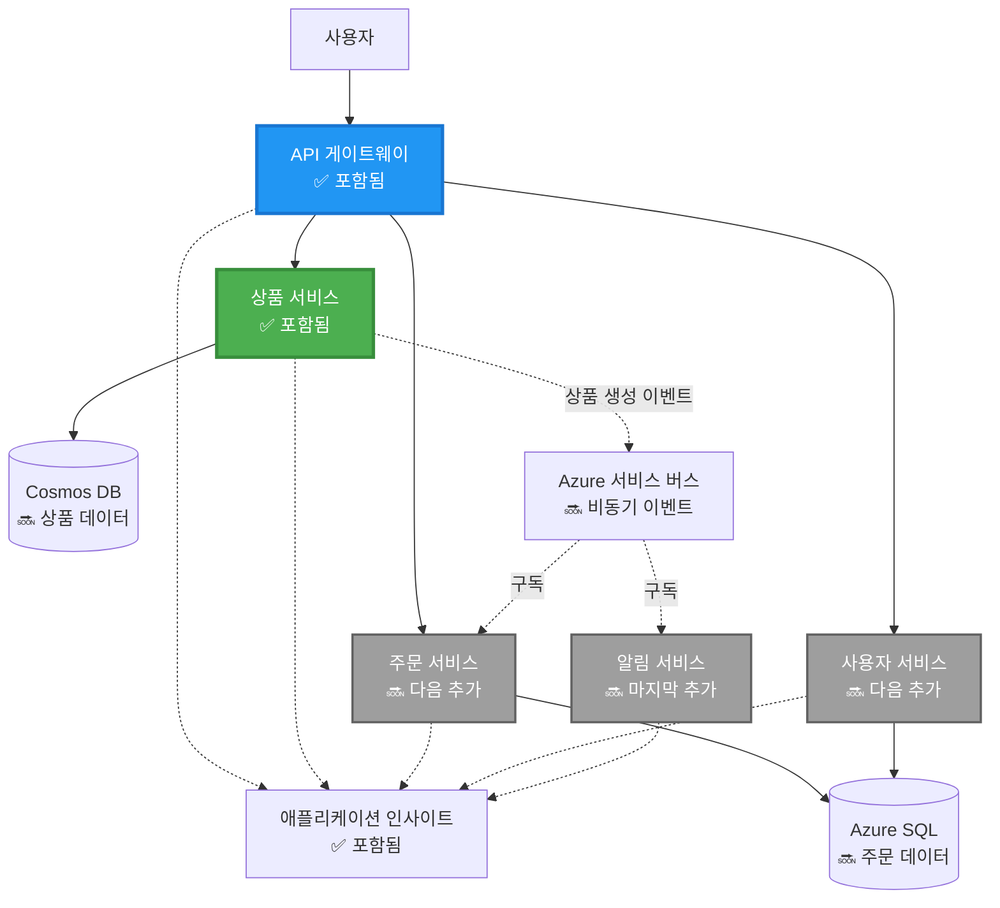

# 마이크로서비스 아키텍처 - 컨테이너 앱 예제

⏱️ **예상 소요 시간**: 25-35분 | 💰 **예상 비용**: 약 $50-100/월 | ⭐ **난이도**: 고급

**📚 학습 경로:**
- ← 이전: [간단한 Flask API](../../../../examples/container-app/simple-flask-api) - 단일 컨테이너 기본
- 🎯 **현재 위치**: 마이크로서비스 아키텍처 (2-서비스 기반)
- → 다음: [AI 통합](../../../../docs/ai-foundry) - 서비스에 인텔리전스 추가
- 🏠 [코스 홈](../../README.md)

---

AZD CLI를 사용하여 Azure Container Apps에 배포된 **간단하지만 기능적인** 마이크로서비스 아키텍처입니다. 이 예제는 서비스 간 통신, 컨테이너 오케스트레이션, 모니터링을 실용적인 2-서비스 설정으로 보여줍니다.

> **📚 학습 접근법**: 이 예제는 실제로 배포하고 학습할 수 있는 최소한의 2-서비스 아키텍처(API 게이트웨이 + 백엔드 서비스)로 시작합니다. 이 기반을 마스터한 후, 전체 마이크로서비스 생태계로 확장하는 가이드를 제공합니다.

## 학습 내용

이 예제를 완료하면 다음을 배울 수 있습니다:
- Azure Container Apps에 여러 컨테이너 배포
- 내부 네트워킹을 통한 서비스 간 통신 구현
- 환경 기반 스케일링 및 상태 확인 구성
- Application Insights를 사용한 분산 애플리케이션 모니터링
- 마이크로서비스 배포 패턴 및 모범 사례 이해
- 간단한 아키텍처에서 복잡한 아키텍처로 점진적 확장 학습

## 아키텍처

### 1단계: 우리가 구축할 것 (이 예제에 포함됨)


**구성 요소 세부사항:**

| 구성 요소 | 목적 | 접근 | 리소스 |
|-----------|---------|--------|-----------|
| **API 게이트웨이** | 외부 요청을 백엔드 서비스로 라우팅 | 공개 (HTTPS) | 1 vCPU, 2GB RAM, 2-20 복제본 |
| **상품 서비스** | 메모리 내 데이터를 사용하여 상품 카탈로그 관리 | 내부 전용 | 0.5 vCPU, 1GB RAM, 1-10 복제본 |
| **Application Insights** | 중앙 집중식 로깅 및 분산 추적 | Azure Portal | 월간 데이터 수집 1-2GB |

**왜 간단하게 시작해야 할까요?**
- ✅ 빠르게 배포하고 이해 가능 (25-35분)
- ✅ 복잡성 없이 핵심 마이크로서비스 패턴 학습
- ✅ 수정 및 실험 가능한 작동 코드 제공
- ✅ 학습 비용 절감 (~$50-100/월 vs $300-1400/월)
- ✅ 데이터베이스 및 메시지 큐 추가 전에 자신감 구축

**비유**: 운전을 배우는 것과 같습니다. 빈 주차장에서 시작(2 서비스), 기본을 마스터한 후 도시 교통으로 진행(5+ 서비스 및 데이터베이스 포함).

### 2단계: 미래 확장 (참조 아키텍처)

2-서비스 아키텍처를 마스터한 후 확장할 수 있습니다:


"확장 가이드" 섹션에서 단계별 지침을 확인하세요.

## 포함된 기능

✅ **서비스 검색**: 컨테이너 간 자동 DNS 기반 검색  
✅ **로드 밸런싱**: 복제본 간 내장 로드 밸런싱  
✅ **자동 스케일링**: HTTP 요청 기반 서비스별 독립적 스케일링  
✅ **상태 모니터링**: 두 서비스에 대한 라이브니스 및 준비 상태 확인  
✅ **분산 로깅**: Application Insights를 사용한 중앙 집중식 로깅  
✅ **내부 네트워킹**: 안전한 서비스 간 통신  
✅ **컨테이너 오케스트레이션**: 자동 배포 및 스케일링  
✅ **무중단 업데이트**: 리비전 관리와 함께 롤링 업데이트  

## 사전 준비 사항

### 필수 도구

시작하기 전에 다음 도구가 설치되어 있는지 확인하세요:

1. **[Azure Developer CLI (azd)](https://learn.microsoft.com/azure/developer/azure-developer-cli/install-azd)** (버전 1.0.0 이상)
   ```bash
   azd version
   # 예상 출력: azd 버전 1.0.0 이상
   ```

2. **[Azure CLI](https://learn.microsoft.com/cli/azure/install-azure-cli)** (버전 2.50.0 이상)
   ```bash
   az --version
   # 예상 출력: azure-cli 2.50.0 이상
   ```

3. **[Docker](https://www.docker.com/get-started)** (로컬 개발/테스트용 - 선택 사항)
   ```bash
   docker --version
   # 예상 출력: Docker 버전 20.10 이상
   ```

### 설정 확인

다음 명령어를 실행하여 준비 상태를 확인하세요:

```bash
# Azure Developer CLI 확인
azd version
# ✅ 예상: azd 버전 1.0.0 이상

# Azure CLI 확인
az --version
# ✅ 예상: azure-cli 2.50.0 이상

# Docker 확인 (선택 사항)
docker --version
# ✅ 예상: Docker 버전 20.10 이상
```

**성공 기준**: 모든 명령어가 최소 버전 이상을 반환해야 합니다.

### Azure 요구 사항

- 활성 **Azure 구독** ([무료 계정 생성](https://azure.microsoft.com/free/))
- 구독에서 리소스를 생성할 수 있는 권한
- 구독 또는 리소스 그룹에서 **Contributor** 역할

### 지식 요구 사항

이 예제는 **고급 수준**입니다. 다음을 알고 있어야 합니다:
- [간단한 Flask API 예제](../../../../examples/container-app/simple-flask-api) 완료
- 마이크로서비스 아키텍처 기본 이해
- REST API 및 HTTP에 대한 친숙함
- 컨테이너 개념 이해

**컨테이너 앱이 처음인가요?** 먼저 [간단한 Flask API 예제](../../../../examples/container-app/simple-flask-api)를 통해 기본을 배우세요.

## 빠른 시작 (단계별)

### 1단계: 클론 및 이동

```bash
git clone https://github.com/microsoft/AZD-for-beginners.git
cd AZD-for-beginners/examples/microservices
```

**✓ 성공 확인**: `azure.yaml` 파일이 보이는지 확인하세요:
```bash
ls
# 예상: README.md, azure.yaml, infra/, src/
```

### 2단계: Azure 인증

```bash
azd auth login
```

브라우저가 열리며 Azure 인증을 요청합니다. Azure 자격 증명으로 로그인하세요.

**✓ 성공 확인**: 다음이 표시되어야 합니다:
```
Logged in to Azure.
```

### 3단계: 환경 초기화

```bash
azd init
```

**보게 될 프롬프트**:
- **환경 이름**: 짧은 이름 입력 (예: `microservices-dev`)
- **Azure 구독**: 구독 선택
- **Azure 위치**: 지역 선택 (예: `eastus`, `westeurope`)

**✓ 성공 확인**: 다음이 표시되어야 합니다:
```
SUCCESS: New project initialized!
```

### 4단계: 인프라 및 서비스 배포

```bash
azd up
```

**발생하는 일** (8-12분 소요):


**✓ 성공 확인**: 다음이 표시되어야 합니다:
```
SUCCESS: Your application was deployed to Azure in X minutes Y seconds.
Endpoint: https://api-gateway-<unique-id>.azurecontainerapps.io
```

**⏱️ 시간**: 8-12분

### 5단계: 배포 테스트

```bash
# 게이트웨이 엔드포인트 가져오기
GATEWAY_URL=$(azd env get-values | grep API_GATEWAY_URL | cut -d '=' -f2 | tr -d '"')

# API 게이트웨이 상태 테스트
curl $GATEWAY_URL/health
```

**✅ 예상 출력**:
```json
{
  "status": "healthy",
  "service": "api-gateway",
  "timestamp": "2025-11-19T10:30:00Z"
}
```

**게이트웨이를 통해 상품 서비스 테스트**:
```bash
# 제품 나열
curl $GATEWAY_URL/api/products
```

**✅ 예상 출력**:
```json
[
  {"id":1,"name":"Laptop","price":999.99,"stock":50},
  {"id":2,"name":"Mouse","price":29.99,"stock":200},
  {"id":3,"name":"Keyboard","price":79.99,"stock":150}
]
```

**✓ 성공 확인**: 두 엔드포인트가 오류 없이 JSON 데이터를 반환해야 합니다.

---

**🎉 축하합니다!** Azure에 마이크로서비스 아키텍처를 배포했습니다!

## 프로젝트 구조

모든 구현 파일이 포함되어 있습니다—완전한 작동 예제입니다:

```
microservices/
│
├── README.md                         # This file
├── azure.yaml                        # AZD configuration
├── .gitignore                        # Git ignore patterns
│
├── infra/                           # Infrastructure as Code (Bicep)
│   ├── main.bicep                   # Main orchestration
│   ├── abbreviations.json           # Naming conventions
│   ├── core/                        # Shared infrastructure
│   │   ├── container-apps-environment.bicep  # Container environment + registry
│   │   └── monitor.bicep            # Application Insights + Log Analytics
│   └── app/                         # Service definitions
│       ├── api-gateway.bicep        # API Gateway container app
│       └── product-service.bicep    # Product Service container app
│
└── src/                             # Application source code
    ├── api-gateway/                 # Node.js API Gateway
    │   ├── app.js                   # Express server with routing
    │   ├── package.json             # Node dependencies
    │   └── Dockerfile               # Container definition
    └── product-service/             # Python Product Service
        ├── main.py                  # Flask API with product data
        ├── requirements.txt         # Python dependencies
        └── Dockerfile               # Container definition
```

**각 구성 요소의 역할:**

**인프라 (infra/)**:
- `main.bicep`: 모든 Azure 리소스와 종속성을 오케스트레이션
- `core/container-apps-environment.bicep`: 컨테이너 앱 환경 및 Azure Container Registry 생성
- `core/monitor.bicep`: 분산 로깅을 위한 Application Insights 설정
- `app/*.bicep`: 개별 컨테이너 앱 정의 (스케일링 및 상태 확인 포함)

**API 게이트웨이 (src/api-gateway/)**:
- 외부 요청을 백엔드 서비스로 라우팅하는 공개 서비스
- 로깅, 오류 처리, 요청 전달 구현
- 서비스 간 HTTP 통신 예제 제공

**상품 서비스 (src/product-service/)**:
- 상품 카탈로그를 관리하는 내부 서비스 (간단히 메모리 내 데이터 사용)
- 상태 확인이 포함된 REST API
- 백엔드 마이크로서비스 패턴 예제

## 서비스 개요

### API 게이트웨이 (Node.js/Express)

**포트**: 8080  
**접근**: 공개 (외부 인그레스)  
**목적**: 들어오는 요청을 적절한 백엔드 서비스로 라우팅  

**엔드포인트**:
- `GET /` - 서비스 정보
- `GET /health` - 상태 확인 엔드포인트
- `GET /api/products` - 상품 서비스로 전달 (전체 목록)
- `GET /api/products/:id` - 상품 서비스로 전달 (ID별 조회)

**주요 기능**:
- axios를 사용한 요청 라우팅
- 중앙 집중식 로깅
- 오류 처리 및 타임아웃 관리
- 환경 변수를 통한 서비스 검색
- Application Insights 통합

**코드 하이라이트** (`src/api-gateway/app.js`):
```javascript
// 내부 서비스 통신
app.get('/api/products', async (req, res) => {
  const response = await axios.get(`${PRODUCT_SERVICE_URL}/products`, {
    timeout: 5000
  });
  res.json(response.data);
});
```

### 상품 서비스 (Python/Flask)

**포트**: 8000  
**접근**: 내부 전용 (외부 인그레스 없음)  
**목적**: 메모리 내 데이터를 사용하여 상품 카탈로그 관리  

**엔드포인트**:
- `GET /` - 서비스 정보
- `GET /health` - 상태 확인 엔드포인트
- `GET /products` - 모든 상품 목록
- `GET /products/<id>` - ID별 상품 조회

**주요 기능**:
- Flask를 사용한 RESTful API
- 간단한 메모리 내 상품 저장소 (데이터베이스 필요 없음)
- 프로브를 사용한 상태 모니터링
- 구조화된 로깅
- Application Insights 통합

**데이터 모델**:
```python
{
  "id": 1,
  "name": "Laptop",
  "description": "High-performance laptop",
  "price": 999.99,
  "stock": 50
}
```

**왜 내부 전용인가요?**
상품 서비스는 공개적으로 노출되지 않습니다. 모든 요청은 API 게이트웨이를 통해야 하며, 이는 다음을 제공합니다:
- 보안: 제어된 접근 지점
- 유연성: 클라이언트에 영향을 주지 않고 백엔드 변경 가능
- 모니터링: 중앙 집중식 요청 로깅

## 서비스 간 통신 이해

### 서비스 간 통신 방식


이 예제에서 API 게이트웨이는 **내부 HTTP 호출**을 사용하여 상품 서비스와 통신합니다:

```javascript
// API 게이트웨이 (src/api-gateway/app.js)
const PRODUCT_SERVICE_URL = process.env.PRODUCT_SERVICE_URL;

// 내부 HTTP 요청 생성
const response = await axios.get(`${PRODUCT_SERVICE_URL}/products`);
```

**핵심 포인트**:

1. **DNS 기반 검색**: 컨테이너 앱은 내부 서비스에 대해 자동으로 DNS를 제공합니다
   - 상품 서비스 FQDN: `product-service.internal.<environment>.azurecontainerapps.io`
   - 간단히: `http://product-service` (컨테이너 앱이 이를 해결)

2. **공개 노출 없음**: 상품 서비스는 Bicep에서 `external: false`로 설정됨
   - 컨테이너 앱 환경 내에서만 접근 가능
   - 인터넷에서 접근 불가

3. **환경 변수**: 서비스 URL은 배포 시 주입됨
   - Bicep이 내부 FQDN을 게이트웨이에 전달
   - 애플리케이션 코드에 하드코딩된 URL 없음

**비유**: 사무실 방과 같습니다. API 게이트웨이는 접수 데스크(공개), 상품 서비스는 사무실 방(내부 전용)입니다. 방문자는 접수를 통해서만 사무실에 접근할 수 있습니다.

## 배포 옵션

### 전체 배포 (권장)

```bash
# 인프라와 두 서비스를 배포합니다
azd up
```

이 배포는 다음을 포함합니다:
1. 컨테이너 앱 환경
2. Application Insights
3. 컨테이너 레지스트리
4. API 게이트웨이 컨테이너
5. 상품 서비스 컨테이너

**시간**: 8-12분

### 개별 서비스 배포

```bash
# 초기 azd up 후 하나의 서비스만 배포
azd deploy api-gateway

# 또는 제품 서비스를 배포
azd deploy product-service
```

**사용 사례**: 코드가 업데이트된 서비스만 다시 배포하고 싶을 때.

### 구성 업데이트

```bash
# 스케일링 매개변수 변경
azd env set GATEWAY_MAX_REPLICAS 30

# 새 구성으로 다시 배포
azd up
```

## 구성

### 스케일링 구성

두 서비스는 Bicep 파일에서 HTTP 기반 자동 스케일링으로 구성됩니다:

**API 게이트웨이**:
- 최소 복제본: 2 (항상 최소 2개로 가용성 유지)
- 최대 복제본: 20
- 스케일 트리거: 복제본당 50개의 동시 요청

**상품 서비스**:
- 최소 복제본: 1 (필요 시 0으로 스케일 가능)
- 최대 복제본: 10
- 스케일 트리거: 복제본당 100개의 동시 요청

**스케일링 사용자 정의** (`infra/app/*.bicep`에서):
```bicep
scale: {
  minReplicas: 1
  maxReplicas: 10
  rules: [
    {
      name: 'http-scale-rule'
      http: {
        metadata: {
          concurrentRequests: '100'  // Adjust this
        }
      }
    }
  ]
}
```

### 리소스 할당

**API 게이트웨이**:
- CPU: 1.0 vCPU
- 메모리: 2 GiB
- 이유: 모든 외부 트래픽 처리

**상품 서비스**:
- CPU: 0.5 vCPU
- 메모리: 1 GiB
- 이유: 경량 메모리 내 작업

### 상태 확인

두 서비스는 라이브니스 및 준비 상태 프로브를 포함합니다:

```bicep
probes: [
  {
    type: 'Liveness'
    httpGet: {
      path: '/health'
      port: 8080
    }
    initialDelaySeconds: 10
    periodSeconds: 30
  }
  {
    type: 'Readiness'
    httpGet: {
      path: '/health'
      port: 8080
    }
    initialDelaySeconds: 5
    periodSeconds: 10
  }
]
```

**의미**:
- **라이브니스**: 상태 확인 실패 시 컨테이너 앱이 컨테이너를 재시작
- **준비 상태**: 준비되지 않은 경우 컨테이너 앱이 해당 복제본으로 트래픽 라우팅 중지

## 모니터링 및 관찰성

### 서비스 로그 보기

```bash
# API Gateway에서 로그 스트림
azd logs api-gateway --follow

# 최근 제품 서비스 로그 보기
azd logs product-service --tail 100

# 두 서비스의 모든 로그 보기
azd logs --follow
```

**예상 출력**:
```
[api-gateway] API Gateway listening on port 8080
[api-gateway] Product Service URL: http://product-service
[api-gateway] GET /api/products 200 - 45ms
[product-service] Retrieved 5 products
```

### Application Insights 쿼리

Azure Portal에서 Application Insights에 액세스한 후 다음 쿼리를 실행하세요:

**느린 요청 찾기**:
```kusto
requests
| where timestamp > ago(1h)
| where duration > 1000  // Requests taking >1 second
| summarize count() by name, cloud_RoleName
| order by count_ desc
```

**서비스 간 호출 추적**:
```kusto
dependencies
| where timestamp > ago(1h)
| where type == "Http"
| project timestamp, name, target, duration, success
| order by timestamp desc
```

**서비스별 오류율**:
```kusto
exceptions
| where timestamp > ago(24h)
| summarize errorCount = count() by cloud_RoleName, type
| order by errorCount desc
```

**시간별 요청량**:
```kusto
requests
| where timestamp > ago(1h)
| summarize requestCount = count() by bin(timestamp, 5m), cloud_RoleName
| render timechart
```

### 모니터링 대시보드 액세스

```bash
# 애플리케이션 인사이트 세부 정보 가져오기
azd env get-values | grep APPLICATIONINSIGHTS

# Azure 포털 모니터링 열기
az monitor app-insights component show \
  --app $(azd env get-values | grep APPLICATIONINSIGHTS_CONNECTION_STRING | cut -d '=' -f2) \
  --resource-group $(azd env get-values | grep AZURE_RESOURCE_GROUP | cut -d '=' -f2) \
  --query "appId" -o tsv
```

### 실시간 메트릭

1. Azure Portal에서 Application Insights로 이동
2. "Live Metrics" 클릭
3. 실시간 요청, 실패 및 성능 확인
4. 테스트 실행: `curl $(azd env get-values | grep API_GATEWAY_URL | cut -d '=' -f2 | tr -d '"')/api/products`

## 실습 과제

### 과제 1: 새로운 상품 엔드포인트 추가 ⭐ (쉬움)

**목표**: 새로운 상품을 생성하는 POST 엔드포인트 추가

**시작 지점**: `src/product-service/main.py`

**단계**:

1. `main.py`에서 `get_product` 함수 뒤에 다음 엔드포인트 추가:

```python
@app.route('/products', methods=['POST'])
def create_product():
    """Create a new product"""
    data = request.get_json()
    
    # 필수 필드 확인
    if not data or 'name' not in data or 'price' not in data:
        return jsonify({'error': 'Missing required fields: name, price'}), 400
    
    new_id = max(p['id'] for p in products) + 1
    new_product = {
        'id': new_id,
        'name': data['name'],
        'description': data.get('description', ''),
        'price': float(data['price']),
        'stock': int(data.get('stock', 0))
    }
    products.append(new_product)
    logger.info(f"Created product {new_id}")
    return jsonify(new_product), 201
```

2. API 게이트웨이에 POST 라우트 추가 (`src/api-gateway/app.js`):

```javascript
// GET /api/products 경로 뒤에 이것을 추가하세요
app.post('/api/products', async (req, res) => {
  try {
    console.log(`Forwarding POST request to ${PRODUCT_SERVICE_URL}/products`);
    const response = await axios.post(`${PRODUCT_SERVICE_URL}/products`, req.body, {
      timeout: 5000
    });
    res.status(201).json(response.data);
  } catch (error) {
    console.error('Error calling product service:', error.message);
    res.status(503).json({
      error: 'Product service unavailable',
      message: error.message
    });
  }
});
```

3. 두 서비스를 다시 배포하세요:

```bash
azd deploy product-service
azd deploy api-gateway
```

4. 새로운 엔드포인트를 테스트하세요:

```bash
GATEWAY_URL=$(azd env get-values | grep API_GATEWAY_URL | cut -d '=' -f2 | tr -d '"')

# 새 제품 생성
curl -X POST $GATEWAY_URL/api/products \
  -H "Content-Type: application/json" \
  -d '{"name":"USB Cable","price":9.99,"stock":500}'
```

**✅ 예상 출력:**
```json
{"id":6,"name":"USB Cable","description":"","price":9.99,"stock":500}
```

5. 목록에 나타나는지 확인하세요:

```bash
curl $GATEWAY_URL/api/products
# 이제 새로운 USB 케이블을 포함하여 6개의 제품이 표시되어야 합니다.
```

**성공 기준**:
- ✅ POST 요청이 HTTP 201을 반환
- ✅ 새로운 제품이 GET /api/products 목록에 나타남
- ✅ 제품이 자동 증가 ID를 가짐

**소요 시간**: 10-15분

---

### 연습 2: 자동 확장 규칙 수정 ⭐⭐ (중급)

**목표**: Product Service가 더 공격적으로 확장되도록 변경

**시작 지점**: `infra/app/product-service.bicep`

**단계**:

1. `infra/app/product-service.bicep` 파일을 열고 약 95번째 줄에 있는 `scale` 블록을 찾으세요.

2. 다음을 변경하세요:
```bicep
scale: {
  minReplicas: 1
  maxReplicas: 10
  rules: [
    {
      name: 'http-scale-rule'
      http: {
        metadata: {
          concurrentRequests: '100'  // OLD
        }
      }
    }
  ]
}
```

다음으로:
```bicep
scale: {
  minReplicas: 2  // Always have 2 running
  maxReplicas: 20  // Allow more scaling
  rules: [
    {
      name: 'http-scale-rule'
      http: {
        metadata: {
          concurrentRequests: '20'  // Scale at lower threshold
        }
      }
    }
  ]
}
```

3. 인프라를 다시 배포하세요:

```bash
azd up
```

4. 새로운 확장 구성을 확인하세요:

```bash
az containerapp show \
  --name $(azd env get-values | grep PRODUCT_SERVICE | head -1 | cut -d '/' -f5) \
  --resource-group $(azd env get-values | grep AZURE_RESOURCE_GROUP | cut -d '=' -f2 | tr -d '"') \
  --query "properties.template.scale" -o json
```

**✅ 예상 출력:**
```json
{
  "minReplicas": 2,
  "maxReplicas": 20,
  "rules": [...]
}
```

5. 부하를 통해 자동 확장을 테스트하세요:

```bash
# 동시 요청 생성
for i in {1..500}; do curl $GATEWAY_URL/api/products & done

# 스케일링 발생 관찰
azd logs product-service --follow
# 다음을 찾으세요: 컨테이너 앱 스케일링 이벤트
```

**성공 기준**:
- ✅ Product Service가 항상 최소 2개의 복제본을 실행
- ✅ 부하 시 2개 이상의 복제본으로 확장
- ✅ Azure Portal에서 새로운 확장 규칙이 표시됨

**소요 시간**: 15-20분

---

### 연습 3: 사용자 정의 모니터링 쿼리 추가 ⭐⭐ (중급)

**목표**: 제품 API 성능을 추적하기 위한 사용자 정의 Application Insights 쿼리 생성

**단계**:

1. Azure Portal에서 Application Insights로 이동:
   - Azure Portal로 이동
   - 리소스 그룹(rg-microservices-*)을 찾으세요
   - Application Insights 리소스를 클릭하세요

2. 왼쪽 메뉴에서 "Logs"를 클릭하세요.

3. 다음 쿼리를 생성하세요:

```kusto
requests
| where timestamp > ago(1h)
| where name contains "products"
| summarize 
    RequestCount = count(),
    AvgDuration = avg(duration),
    P95Duration = percentile(duration, 95),
    SuccessRate = 100.0 * countif(success == true) / count()
  by bin(timestamp, 5m)
| render timechart
```

4. 쿼리를 실행하려면 "Run"을 클릭하세요.

5. 쿼리를 저장하세요:
   - "Save"를 클릭
   - 이름: "Product API Performance"
   - 카테고리: "Performance"

6. 테스트 트래픽을 생성하세요:

```bash
for i in {1..100}; do curl $GATEWAY_URL/api/products; sleep 1; done
```

7. 데이터를 확인하려면 쿼리를 새로고침하세요.

**✅ 예상 출력:**
- 시간별 요청 수를 보여주는 차트
- 평균 지속 시간 < 500ms
- 성공률 = 100%
- 5분 단위의 시간 구간

**성공 기준**:
- ✅ 쿼리가 100개 이상의 요청을 표시
- ✅ 성공률이 100%
- ✅ 평균 지속 시간 < 500ms
- ✅ 차트가 5분 단위의 시간 구간을 표시

**학습 결과**: 사용자 정의 쿼리를 통해 서비스 성능을 모니터링하는 방법 이해

**소요 시간**: 10-15분

---

### 연습 4: 재시도 로직 구현 ⭐⭐⭐ (고급)

**목표**: Product Service가 일시적으로 사용 불가능할 때 API Gateway에 재시도 로직 추가

**시작 지점**: `src/api-gateway/app.js`

**단계**:

1. 재시도 라이브러리를 설치하세요:

```bash
cd src/api-gateway
npm install axios-retry --save
cd ../..
```

2. `src/api-gateway/app.js`를 업데이트하세요 (axios import 이후 추가):

```javascript
const axiosRetry = require('axios-retry');

// 재시도 로직 구성
axiosRetry(axios, {
  retries: 3,
  retryDelay: (retryCount) => {
    return retryCount * 1000; // 1초, 2초, 3초
  },
  retryCondition: (error) => {
    // 네트워크 오류 또는 5xx 응답에서 재시도
    return axiosRetry.isNetworkOrIdempotentRequestError(error) ||
           (error.response && error.response.status >= 500);
  }
});

console.log('Retry logic configured: 3 retries with exponential backoff');
```

3. API Gateway를 다시 배포하세요:

```bash
azd deploy api-gateway
```

4. 서비스 장애를 시뮬레이션하여 재시도 동작을 테스트하세요:

```bash
# 제품 서비스를 0으로 축소 (장애 시뮬레이션)
az containerapp update \
  --name $(azd env get-values | grep PRODUCT_SERVICE | head -1 | cut -d '/' -f5) \
  --resource-group $(azd env get-values | grep AZURE_RESOURCE_GROUP | cut -d '=' -f2 | tr -d '"') \
  --min-replicas 0 \
  --max-replicas 0

# 제품에 접근 시도 (3번 재시도 예정)
time curl -v $GATEWAY_URL/api/products
# 관찰: 응답 시간이 약 6초 소요 (1초 + 2초 + 3초 재시도)

# 제품 서비스 복원
az containerapp update \
  --name $(azd env get-values | grep PRODUCT_SERVICE | head -1 | cut -d '/' -f5) \
  --resource-group $(azd env get-values | grep AZURE_RESOURCE_GROUP | cut -d '=' -f2 | tr -d '"') \
  --min-replicas 1 \
  --max-replicas 10
```

5. 재시도 로그를 확인하세요:

```bash
azd logs api-gateway --tail 50
# 재시도 시도 메시지를 찾으세요
```

**✅ 예상 동작:**
- 요청이 실패하기 전에 3번 재시도
- 각 재시도는 더 오래 기다림 (1초, 2초, 3초)
- 서비스 재시작 후 성공적인 요청
- 로그에 재시도 시도가 표시됨

**성공 기준**:
- ✅ 요청이 실패하기 전에 3번 재시도
- ✅ 각 재시도가 더 오래 기다림 (지수적 백오프)
- ✅ 서비스 재시작 후 성공적인 요청
- ✅ 로그에 재시도 시도가 표시됨

**학습 결과**: 마이크로서비스의 복원력 패턴 이해 (회로 차단기, 재시도, 타임아웃)

**소요 시간**: 20-25분

---

## 지식 점검

이 예제를 완료한 후, 다음을 확인하세요:

### 1. 서비스 통신 ✓

지식을 테스트하세요:
- [ ] API Gateway가 Product Service를 어떻게 발견하는지 설명할 수 있나요? (DNS 기반 서비스 발견)
- [ ] Product Service가 다운되면 어떻게 되나요? (Gateway가 503 오류 반환)
- [ ] 세 번째 서비스를 추가하려면 어떻게 해야 하나요? (새 Bicep 파일 생성, main.bicep에 추가, src 폴더 생성)

**실습 확인**:
```bash
# 서비스 실패 시뮬레이션
az containerapp update --name <product-service-name> --min-replicas 0 --max-replicas 0
curl $GATEWAY_URL/api/products
# ✅ 예상: 503 서비스 사용 불가

# 서비스 복원
az containerapp update --name <product-service-name> --min-replicas 1 --max-replicas 10
```

### 2. 모니터링 및 관찰 가능성 ✓

지식을 테스트하세요:
- [ ] 분산 로그를 어디에서 볼 수 있나요? (Azure Portal의 Application Insights)
- [ ] 느린 요청을 어떻게 추적하나요? (Kusto 쿼리: `requests | where duration > 1000`)
- [ ] 오류를 유발한 서비스를 식별할 수 있나요? (로그의 `cloud_RoleName` 필드 확인)

**실습 확인**:
```bash
# 느린 요청 시뮬레이션 생성
curl "$GATEWAY_URL/api/products?delay=2000"

# 느린 요청에 대해 Application Insights 쿼리
# Azure Portal → Application Insights → Logs로 이동
# 실행: requests | where duration > 1000 | project timestamp, name, duration, cloud_RoleName
```

### 3. 확장 및 성능 ✓

지식을 테스트하세요:
- [ ] 자동 확장을 트리거하는 것은 무엇인가요? (HTTP 동시 요청 규칙: Gateway는 50, Product는 100)
- [ ] 현재 몇 개의 복제본이 실행 중인가요? (`az containerapp revision list`로 확인)
- [ ] Product Service를 5개의 복제본으로 확장하려면 어떻게 해야 하나요? (Bicep에서 minReplicas 업데이트)

**실습 확인**:
```bash
# 오토스케일링을 테스트하기 위해 부하 생성
for i in {1..1000}; do curl $GATEWAY_URL/api/products & done

# 복제본 증가 관찰
azd logs api-gateway --follow
# ✅ 예상: 로그에서 스케일링 이벤트 확인
```

**성공 기준**: 모든 질문에 답하고 실습 명령으로 확인할 수 있어야 합니다.

---

## 비용 분석

### 월별 예상 비용 (이 2-서비스 예제 기준)

| 리소스 | 구성 | 예상 비용 |
|--------|------|----------|
| API Gateway | 2-20 복제본, 1 vCPU, 2GB RAM | $30-150 |
| Product Service | 1-10 복제본, 0.5 vCPU, 1GB RAM | $15-75 |
| Container Registry | 기본 등급 | $5 |
| Application Insights | 월 1-2GB | $5-10 |
| Log Analytics | 월 1GB | $3 |
| **합계** | | **$58-243/월** |

### 사용량별 비용 분류

**가벼운 트래픽** (테스트/학습): 약 $60/월
- API Gateway: 2 복제본 × 24/7 = $30
- Product Service: 1 복제본 × 24/7 = $15
- 모니터링 + 레지스트리 = $13

**중간 트래픽** (소규모 프로덕션): 약 $120/월
- API Gateway: 평균 5 복제본 = $75
- Product Service: 평균 3 복제본 = $45
- 모니터링 + 레지스트리 = $13

**높은 트래픽** (바쁜 기간): 약 $240/월
- API Gateway: 평균 15 복제본 = $225
- Product Service: 평균 8 복제본 = $120
- 모니터링 + 레지스트리 = $13

### 비용 최적화 팁

1. **개발을 위해 Zero로 확장**:
   ```bicep
   scale: {
     minReplicas: 0  // Save $30-40/month when not in use
     maxReplicas: 10
   }
   ```

2. **Cosmos DB에 소비 계획 사용** (추가 시):
   - 사용한 만큼만 지불
   - 최소 요금 없음

3. **Application Insights 샘플링 설정**:
   ```javascript
   appInsights.defaultClient.config.samplingPercentage = 50; // 요청의 50%를 샘플링합니다
   ```

4. **필요하지 않을 때 정리**:
   ```bash
   azd down --force --purge
   ```

### 무료 등급 옵션

학습/테스트를 위해 다음을 고려하세요:
- ✅ Azure 무료 크레딧 사용 (새 계정의 경우 첫 30일 동안 $200)
- ✅ 최소 복제본 유지 (비용 약 50% 절감)
- ✅ 테스트 후 삭제 (지속적인 비용 없음)
- ✅ 학습 세션 사이에 Zero로 확장

**예시**: 이 예제를 하루 2시간 × 30일 동안 실행 = 약 $5/월 (기본 $60/월 대신)

---

## 문제 해결 빠른 참조

### 문제: `azd up`이 "Subscription not found" 오류로 실패

**해결 방법**:
```bash
# 명시적인 구독으로 다시 로그인하십시오
az account set --subscription <your-subscription-id>
azd env set AZURE_SUBSCRIPTION_ID <your-subscription-id>
azd up
```

### 문제: API Gateway가 503 "Product service unavailable" 반환

**진단**:
```bash
# 제품 서비스 로그 확인
azd logs product-service --tail 50

# 제품 서비스 상태 확인
az containerapp show \
  --name $(azd env get-values | grep PRODUCT_SERVICE | head -1 | cut -d '/' -f5) \
  --resource-group $(azd env get-values | grep AZURE_RESOURCE_GROUP | cut -d '=' -f2 | tr -d '"') \
  --query "properties.runningStatus"
```

**일반적인 원인**:
1. Product service가 시작되지 않음 (Python 오류 로그 확인)
2. 상태 확인 실패 (`/health` 엔드포인트 작동 확인)
3. 컨테이너 이미지 빌드 실패 (레지스트리에서 이미지 확인)

### 문제: 자동 확장이 작동하지 않음

**진단**:
```bash
# 현재 복제본 수를 확인합니다
az containerapp revision list \
  --name $(azd env get-values | grep API_GATEWAY | head -1 | cut -d '/' -f5) \
  --resource-group $(azd env get-values | grep AZURE_RESOURCE_GROUP | cut -d '=' -f2 | tr -d '"') \
  --query "[].properties.replicas"

# 테스트를 위해 부하를 생성합니다
for i in {1..1000}; do curl $GATEWAY_URL/api/products & done

# 스케일링 이벤트를 관찰합니다
azd logs api-gateway --follow | grep -i scale
```

**일반적인 원인**:
1. 확장 규칙을 트리거할 만큼 부하가 높지 않음 (50개 이상의 동시 요청 필요)
2. 최대 복제본에 이미 도달 (Bicep 구성 확인)
3. Bicep에서 확장 규칙이 잘못 구성됨 (concurrentRequests 값 확인)

### 문제: Application Insights가 로그를 표시하지 않음

**진단**:
```bash
# 연결 문자열이 설정되었는지 확인
azd env get-values | grep APPLICATIONINSIGHTS

# 서비스가 텔레메트리를 보내고 있는지 확인
az monitor app-insights component show \
  --app $(azd env get-values | grep APPLICATIONINSIGHTS_NAME | cut -d '=' -f2 | tr -d '"') \
  --resource-group $(azd env get-values | grep AZURE_RESOURCE_GROUP | cut -d '=' -f2 | tr -d '"') \
  --query "properties.InstrumentationKey"
```

**일반적인 원인**:
1. 컨테이너에 연결 문자열이 전달되지 않음 (환경 변수 확인)
2. Application Insights SDK가 구성되지 않음 (코드에서 import 확인)
3. 텔레메트리를 차단하는 방화벽 (드물게 발생, 네트워크 규칙 확인)

### 문제: Docker 빌드가 로컬에서 실패

**진단**:
```bash
# API Gateway 빌드 테스트
cd src/api-gateway
docker build -t test-gateway .

# Product Service 빌드 테스트
cd ../product-service
docker build -t test-product .
```

**일반적인 원인**:
1. package.json/requirements.txt에 누락된 종속성
2. Dockerfile 구문 오류
3. 종속성 다운로드 중 네트워크 문제

**여전히 해결되지 않나요?** [일반 문제 가이드](../../docs/troubleshooting/common-issues.md) 또는 [Azure Container Apps 문제 해결](https://learn.microsoft.com/azure/container-apps/troubleshooting)을 참조하세요.

---

## 정리

지속적인 비용을 피하기 위해 모든 리소스를 삭제하세요:

```bash
azd down --force --purge
```

**확인 프롬프트**:
```
? Total resources to delete: 6, are you sure you want to continue? (y/N)
```

`y`를 입력하여 확인하세요.

**삭제되는 항목**:
- Container Apps 환경
- 두 Container Apps (gateway 및 product service)
- Container Registry
- Application Insights
- Log Analytics 작업 공간
- 리소스 그룹

**✓ 정리 확인**:
```bash
az group list --query "[?starts_with(name,'rg-microservices')]" --output table
```

빈 결과를 반환해야 합니다.

---

## 확장 가이드: 2에서 5+ 서비스로

이 2-서비스 아키텍처를 마스터한 후 확장하는 방법:

### 1단계: 데이터베이스 지속성 추가 (다음 단계)

**Product Service에 Cosmos DB 추가**:

1. `infra/core/cosmos.bicep` 생성:
   ```bicep
   resource cosmosAccount 'Microsoft.DocumentDB/databaseAccounts@2023-04-15' = {
     name: name
     location: location
     kind: 'GlobalDocumentDB'
     properties: {
       databaseAccountOfferType: 'Standard'
       consistencyPolicy: { defaultConsistencyLevel: 'Session' }
       locations: [{ locationName: location, failoverPriority: 0 }]
     }
   }
   ```

2. Product Service를 메모리 데이터 대신 Azure Cosmos DB Python SDK를 사용하도록 업데이트

3. 추가 예상 비용: 약 $25/월 (서버리스)

### 2단계: 세 번째 서비스 추가 (주문 관리)

**Order Service 생성**:

1. 새 폴더: `src/order-service/` (Python/Node.js/C#)
2. 새 Bicep: `infra/app/order-service.bicep`
3. API Gateway를 업데이트하여 `/api/orders`로 라우팅
4. 주문 지속성을 위해 Azure SQL Database 추가

**아키텍처가 다음과 같이 변경됨**:
```
API Gateway → Product Service (Cosmos DB)
           → Order Service (Azure SQL)
```

### 3단계: 비동기 통신 추가 (Service Bus)

**이벤트 기반 아키텍처 구현**:

1. Azure Service Bus 추가: `infra/core/servicebus.bicep`
2. Product Service가 "ProductCreated" 이벤트를 게시
3. Order Service가 제품 이벤트를 구독
4. 이벤트를 처리하기 위해 Notification Service 추가

**패턴**: 요청/응답 (HTTP) + 이벤트 기반 (Service Bus)

### 4단계: 사용자 인증 추가

**User Service 구현**:

1. `src/user-service/` 생성 (Go/Node.js)
2. Azure AD B2C 또는 사용자 정의 JWT 인증 추가
3. API Gateway가 토큰을 검증한 후 라우팅
4. 서비스가 사용자 권한을 확인

### 5단계: 프로덕션 준비

**다음 구성 요소 추가**:
- ✅ Azure Front Door (글로벌 로드 밸런싱)
- ✅ Azure Key Vault (비밀 관리)
- ✅ Azure Monitor Workbooks (사용자 정의 대시보드)
- ✅ CI/CD 파이프라인 (GitHub Actions)
- ✅ 블루-그린 배포
- ✅ 모든 서비스에 대한 Managed Identity

**전체 프로덕션 아키텍처 비용**: 약 $300-1,400/월

---

## 추가 학습

### 관련 문서
- [Azure Container Apps 문서](https://learn.microsoft.com/azure/container-apps/)
- [마이크로서비스 아키텍처 가이드](https://learn.microsoft.com/azure/architecture/guide/architecture-styles/microservices)
- [분산 추적을 위한 Application Insights](https://learn.microsoft.com/azure/azure-monitor/app/distributed-tracing)
- [Azure Developer CLI 문서](https://learn.microsoft.com/azure/developer/azure-developer-cli/)

### 이 과정의 다음 단계
- ← 이전: [간단한 Flask API](../../../../examples/container-app/simple-flask-api) - 초급 단일 컨테이너 예제
- → 다음: [AI 통합 가이드](../../../../docs/ai-foundry) - AI 기능 추가
- 🏠 [코스 홈](../../README.md)

### 비교: 언제 무엇을 사용할지

| 기능 | 단일 컨테이너 | 마이크로서비스 (이 예제) | Kubernetes (AKS) |
|------|--------------|-----------------------|------------------|
| **사용 사례** | 간단한 앱 | 복잡한 앱 | 엔터프라이즈 앱 |
| **확장성** | 단일 서비스 | 서비스별 확장 | 최대 유연성 |
| **복잡성** | 낮음 | 중간 | 높음 |
| **팀 규모** | 1-3 개발자 | 3-10 개발자 | 10+ 개발자 |
| **비용** | 약 $15-50/월 | 약 $60-250/월 | 약 $150-500/월 |
| **배포 시간** | 5-10분 | 8-12분 | 15-30분 |
| **최적 용도** | MVP, 프로토타입 | 프로덕션 앱 | 멀티 클라우드, 고급 네트워킹 |

**추천**: Container Apps(이 예제)로 시작하고, Kubernetes 관련 기능이 필요할 경우 AKS로 이동하세요.

---

## 자주 묻는 질문

**Q: 왜 5개 이상의 서비스 대신 2개만 사용하나요?**  
A: 교육적 진행을 위해서입니다. 간단한 예제를 통해 기본적인 사항(서비스 통신, 모니터링, 확장)을 익힌 후 복잡성을 추가하세요. 여기서 배운 패턴은 100개 서비스 아키텍처에도 적용됩니다.

**Q: 제가 직접 서비스를 더 추가할 수 있나요?**  
A: 물론입니다! 위의 확장 가이드를 따라가세요. 새로운 서비스는 동일한 패턴을 따릅니다: src 폴더 생성, Bicep 파일 생성, azure.yaml 업데이트, 배포.

**Q: 이게 프로덕션 준비가 되었나요?**  
A: 탄탄한 기초입니다. 프로덕션을 위해서는 관리 ID, Key Vault, 영구 데이터베이스, CI/CD 파이프라인, 모니터링 알림, 백업 전략을 추가하세요.

**Q: 왜 Dapr이나 다른 서비스 메쉬를 사용하지 않나요?**  
A: 학습을 위해 간단하게 유지합니다. Container Apps 네트워킹을 이해한 후, Dapr을 추가하여 고급 시나리오(상태 관리, pub/sub, 바인딩)를 구현할 수 있습니다.

**Q: 로컬에서 디버깅하려면 어떻게 해야 하나요?**  
A: Docker를 사용하여 로컬에서 서비스를 실행하세요:
```bash
cd src/api-gateway
docker build -t local-gateway .
docker run -p 8080:8080 -e PRODUCT_SERVICE_URL=http://localhost:8000 local-gateway
```

**Q: 다른 프로그래밍 언어를 사용할 수 있나요?**  
A: 네! 이 예제는 Node.js(게이트웨이)와 Python(제품 서비스)을 보여줍니다. 컨테이너에서 실행되는 모든 언어를 혼합할 수 있습니다: C#, Go, Java, Ruby, PHP 등.

**Q: Azure 크레딧이 없으면 어떻게 하나요?**  
A: Azure 무료 계층을 사용하세요(새 계정은 첫 30일 동안 $200 크레딧 제공). 또는 짧은 테스트 기간 동안 배포하고 즉시 삭제하세요. 이 예제는 하루 약 $2의 비용이 듭니다.

**Q: Azure Kubernetes Service(AKS)와 어떻게 다른가요?**  
A: Container Apps는 더 간단하며 Kubernetes 지식이 필요하지 않습니다. 하지만 유연성이 떨어집니다. AKS는 완전한 Kubernetes 제어를 제공하지만 더 많은 전문 지식이 필요합니다. Container Apps로 시작하고 필요하면 AKS로 넘어가세요.

**Q: 기존 Azure 서비스와 함께 사용할 수 있나요?**  
A: 네! 기존 데이터베이스, 스토리지 계정, Service Bus 등에 연결할 수 있습니다. 새로운 리소스를 생성하는 대신 기존 리소스를 참조하도록 Bicep 파일을 업데이트하세요.

---

> **🎓 학습 경로 요약**: 자동 확장, 내부 네트워킹, 중앙 집중식 모니터링, 프로덕션 준비 패턴을 갖춘 멀티 서비스 아키텍처를 배포하는 방법을 배웠습니다. 이 기초는 복잡한 분산 시스템 및 엔터프라이즈 마이크로서비스 아키텍처를 준비하는 데 도움이 됩니다.

**📚 코스 내비게이션:**
- ← 이전: [Simple Flask API](../../../../examples/container-app/simple-flask-api)
- → 다음: [Database Integration Example](../../../../database-app)
- 🏠 [코스 홈](../../README.md)
- 📖 [Container Apps Best Practices](../../docs/deployment/deployment-guide.md)

---

**✨ 축하합니다!** 마이크로서비스 예제를 완료했습니다. 이제 Azure Container Apps에서 분산 애플리케이션을 구축, 배포, 모니터링하는 방법을 이해하게 되었습니다. AI 기능을 추가할 준비가 되셨나요? [AI Integration Guide](../../../../docs/ai-foundry)를 확인하세요!

---

<!-- CO-OP TRANSLATOR DISCLAIMER START -->
**면책 조항**:  
이 문서는 AI 번역 서비스 [Co-op Translator](https://github.com/Azure/co-op-translator)를 사용하여 번역되었습니다. 정확성을 위해 노력하고 있지만, 자동 번역에는 오류나 부정확성이 포함될 수 있습니다. 원본 문서를 해당 언어로 작성된 상태에서 권위 있는 자료로 간주해야 합니다. 중요한 정보의 경우, 전문적인 인간 번역을 권장합니다. 이 번역 사용으로 인해 발생하는 오해나 잘못된 해석에 대해 당사는 책임을 지지 않습니다.
<!-- CO-OP TRANSLATOR DISCLAIMER END -->