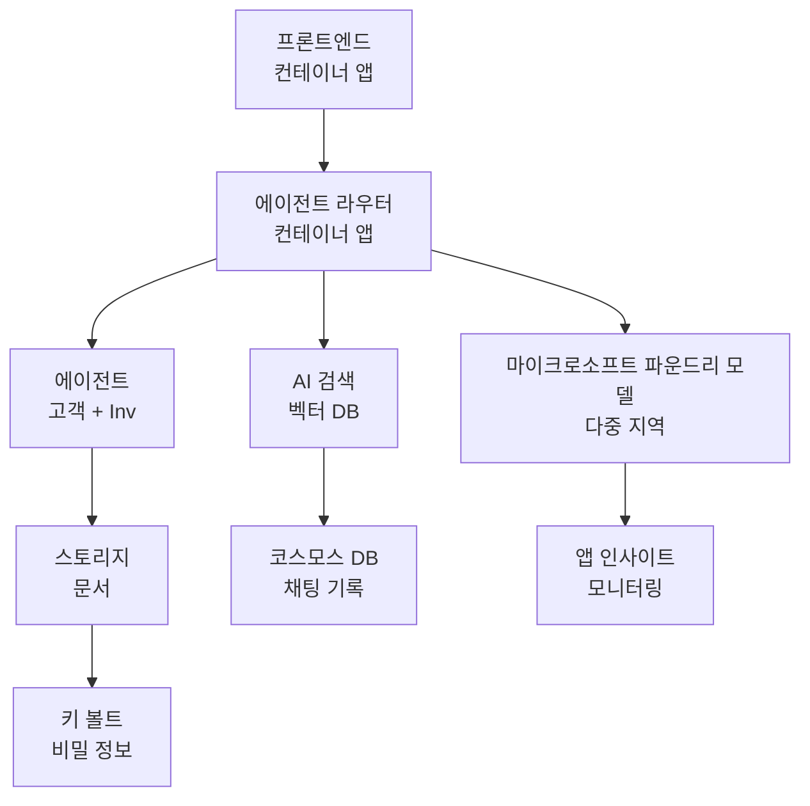

# Retail Multi-Agent Solution - 인프라 템플릿

**5장: 프로덕션 배포 패키지**
- **📚 코스 홈**: [AZD For Beginners](../../README.md)
- **📖 관련 장**: [5장: 멀티 에이전트 AI 솔루션](../../README.md#-chapter-5-multi-agent-ai-solutions-advanced)
- **📝 시나리오 가이드**: [완전한 아키텍처](../retail-scenario.md)
- **🎯 빠른 배포**: [원클릭 배포](#-quick-deployment)

> **⚠️ 인프라 템플릿 전용**  
> 이 ARM 템플릿은 <strong>멀티 에이전트 시스템용 Azure 리소스</strong>를 배포합니다.  
>  
> **배포 항목 (15-25분 소요):**
> - ✅ Microsoft Foundry 모델 (gpt-4.1, gpt-4.1-mini, 3개 리전 임베딩)
> - ✅ AI Search 서비스 (빈 상태, 인덱스 생성 준비 완료)
> - ✅ 컨테이너 앱 (플레이스홀더 이미지, 코드 배포 준비 완료)
> - ✅ 스토리지, Cosmos DB, Key Vault, Application Insights
>  
> **포함되지 않은 항목 (개발 필요):**
> - ❌ 에이전트 구현 코드 (고객 에이전트, 재고 에이전트)
> - ❌ 라우팅 로직 및 API 엔드포인트
> - ❌ 프론트엔드 채팅 UI
> - ❌ 검색 인덱스 스키마 및 데이터 파이프라인
> - ❌ **예상 개발 시간: 80-120시간**
>  
> **이 템플릿 사용 시:**
> - ✅ 멀티 에이전트 프로젝트용 Azure 인프라를 프로비저닝하고자 할 때
> - ✅ 에이전트 구현을 별도로 개발할 계획일 때
> - ✅ 프로덕션 준비된 인프라 기반이 필요할 때
>  
> **사용하지 말아야 할 경우:**
> - ❌ 즉시 작동하는 멀티 에이전트 데모를 기대할 때
> - ❌ 완전한 애플리케이션 코드 예제를 원하는 경우

## 개요

이 디렉터리는 멀티 에이전트 고객 지원 시스템의 <strong>인프라 기반</strong>을 배포하기 위한 종합적인 Azure Resource Manager (ARM) 템플릿을 포함합니다. 이 템플릿은 필요한 모든 Azure 서비스를 올바르게 구성하고 상호 연결하여, 애플리케이션 개발을 위한 준비 상태로 프로비저닝합니다.

**배포 후 보유하게 되는 것:** 프로덕션 준비 완료 Azure 인프라  
**시스템 완성을 위해 필요한 것:** 에이전트 코드, 프론트엔드 UI, 데이터 구성 ([아키텍처 가이드](../retail-scenario.md) 참조)

## 🎯 배포되는 항목

### 핵심 인프라 (배포 후 상태)

✅ **Microsoft Foundry 모델 서비스** (API 호출 준비 완료)
  - 기본 리전: gpt-4.1 배포 (20K TPM 용량)
  - 보조 리전: gpt-4.1-mini 배포 (10K TPM 용량)
  - 삼차 리전: 텍스트 임베딩 모델 (30K TPM 용량)
  - 평가 리전: gpt-4.1 그레이더 모델 (15K TPM 용량)
  - **상태:** 완전 작동 - 즉시 API 호출 가능

✅ **Azure AI Search** (빈 상태 - 구성 준비 완료)
  - 벡터 검색 기능 활성화
  - 표준 계층, 파티션 1개, 복제본 1개
  - **상태:** 서비스 실행 중, 인덱스 생성 필요
  - **조치 필요:** 스키마로 검색 인덱스 생성

✅ **Azure Storage 계정** (빈 상태 - 업로드 준비 완료)
  - Blob 컨테이너: `documents`, `uploads`
  - 보안 구성 (HTTPS 전용, 공개 액세스 없음)
  - **상태:** 파일 수신 준비 완료
  - **조치 필요:** 제품 데이터 및 문서 업로드

⚠️ **컨테이너 앱 환경** (플레이스홀더 이미지 배포됨)
  - 에이전트 라우터 앱 (nginx 기본 이미지)
  - 프론트엔드 앱 (nginx 기본 이미지)
  - 자동 스케일링 구성 (0-10 인스턴스)
  - **상태:** 플레이스홀더 컨테이너 실행 중
  - **조치 필요:** 에이전트 애플리케이션 빌드 및 배포

✅ **Azure Cosmos DB** (빈 상태 - 데이터 준비 완료)
  - 데이터베이스 및 컨테이너 사전 구성됨
  - 저지연 작업에 최적화
  - TTL 활성화로 자동 정리 지원
  - **상태:** 채팅 기록 저장 준비 완료

✅ **Azure Key Vault** (선택 사항 - 비밀 저장 준비 완료)
  - 소프트 삭제 활성화
  - 관리 ID용 RBAC 구성됨
  - **상태:** API 키 및 연결 문자열 저장 준비 완료

✅ **Application Insights** (선택 사항 - 모니터링 활성화)
  - Log Analytics 작업 공간에 연결됨
  - 사용자 지정 메트릭 및 경고 구성됨
  - **상태:** 앱의 텔레메트리 수신 준비 완료

✅ **Document Intelligence** (API 호출 준비 완료)
  - 프로덕션 워크로드용 S0 계층
  - **상태:** 업로드된 문서 처리 준비 완료

✅ **Bing Search API** (API 호출 준비 완료)
  - 실시간 검색용 S1 계층
  - **상태:** 웹 검색 쿼리 처리 준비 완료

### 배포 모드

| 모드 | OpenAI 용량 | 컨테이너 인스턴스 | 검색 계층 | 스토리지冗장성 | 용도 |
|------|-------------|-------------------|-----------|---------------|----------|
| <strong>최소</strong> | 10K-20K TPM | 0-2 복제본 | 기본 | LRS (로컬) | 개발/테스트, 학습, 개념 검증 |
| <strong>표준</strong> | 30K-60K TPM | 2-5 복제본 | 표준 | ZRS (존) | 프로덕션, 중간 트래픽 (<10K 사용자) |
| <strong>프리미엄</strong> | 80K-150K TPM | 5-10 복제본, 존冗장 | 프리미엄 | GRS (지리) | 엔터프라이즈, 고트래픽 (>10K 사용자), 99.99% SLA |

**비용 영향:**
- **최소 → 표준:** 약 4배 비용 증가 ($100-370/월 → $420-1,450/월)
- **표준 → 프리미엄:** 약 3배 비용 증가 ($420-1,450/월 → $1,150-3,500/월)
- **선택 기준:** 예상 부하, SLA 요구사항, 예산

**용량 계획:**
- **TPM (분당 토큰):** 모든 모델 배포의 총합
- **컨테이너 인스턴스:** 자동 스케일링 범위 (최소-최대 복제본)
- **검색 계층:** 쿼리 성능 및 인덱스 크기 제한 영향

## 📋 사전 요구 사항

### 필수 도구
1. **Azure CLI** (버전 2.50.0 이상)
   ```bash
   az --version  # 버전 확인
   az login      # 인증하기
   ```

2. **소유자 또는 기여자 권한이 있는 활성 Azure 구독**
   ```bash
   az account show  # 구독 확인
   ```

### Azure 할당량 사전 확인

배포 전에 대상 리전의 할당량이 충분한지 확인하세요:

```bash
# Microsoft Foundry 모델 사용 가능 여부를 지역에서 확인하세요
az cognitiveservices account list-skus \
  --kind OpenAI \
  --location eastus2

# OpenAI 쿼터를 확인하세요 (예: gpt-4.1)
az cognitiveservices usage list \
  --location eastus2 \
  --query "[?name.value=='OpenAI.Standard.gpt-4.1']"

# 컨테이너 앱 쿼터를 확인하세요
az provider show \
  --namespace Microsoft.App \
  --query "resourceTypes[?resourceType=='managedEnvironments'].locations"
```

**필수 최소 할당량:**
- **Microsoft Foundry 모델:** 리전별 3-4개 모델 배포
  - gpt-4.1: 20K TPM (분당 토큰)
  - gpt-4.1-mini: 10K TPM
  - text-embedding-ada-002: 30K TPM
  - **참고:** 일부 리전은 gpt-4.1 대기자 명단 있을 수 있음 - [모델 가용성 확인](https://learn.microsoft.com/azure/ai-services/openai/concepts/models)
- **컨테이너 앱:** 관리형 환경 + 2-10 컨테이너 인스턴스
- **AI Search:** 표준 계층 (벡터 검색에는 기본 계층 부족)
- **Cosmos DB:** 표준 프로비저닝 처리량

**할당량 부족 시:**
1. Azure 포털 → 할당량 → 증가 요청
2. 또는 Azure CLI 사용:
   ```bash
   az support tickets create \
     --ticket-name "OpenAI-Quota-Increase" \
     --severity "minimal" \
     --description "Request quota increase for Microsoft Foundry Models gpt-4.1 in eastus2"
   ```
3. 가용성 있는 다른 리전 고려

## 🚀 빠른 배포

### 옵션 1: Azure CLI 사용

```bash
# 템플릿 파일을 복제하거나 다운로드하세요
git clone <repository-url>
cd examples/retail-multiagent-arm-template

# 배포 스크립트에 실행 권한을 부여하세요
chmod +x deploy.sh

# 기본 설정으로 배포하세요
./deploy.sh -g myResourceGroup

# 프리미엄 기능을 사용하여 프로덕션 배포하세요
./deploy.sh -g myProdRG -e prod -m premium -l eastus2
```

### 옵션 2: Azure 포털 사용

[](https://portal.azure.com/#create/Microsoft.Template/uri/https%3A%2F%2Fraw.githubusercontent.com%2Fmicrosoft%2Fazd-for-beginners%2Fmain%2Fexamples%2Fretail-multiagent-arm-template%2Fazuredeploy.json)

### 옵션 3: Azure CLI 직접 사용

```bash
# 리소스 그룹 생성
az group create --name myResourceGroup --location eastus2

# 템플릿 배포
az deployment group create \
  --resource-group myResourceGroup \
  --template-file azuredeploy.json \
  --parameters azuredeploy.parameters.json
```

## ⏱️ 배포 일정

### 진행 단계

| 단계 | 소요 시간 | 발생 내용 |
|-------|------------|------------|
| **템플릿 검증** | 30-60초 | Azure가 ARM 템플릿 구문 및 매개변수 검증 |
| **리소스 그룹 설정** | 10-20초 | 리소스 그룹 생성 (필요 시) |
| **OpenAI 프로비저닝** | 5-8분 | 3-4개 OpenAI 계정 생성 및 모델 배포 |
| **컨테이너 앱 배포** | 3-5분 | 환경 생성 및 플레이스홀더 컨테이너 배포 |
| **검색 및 스토리지** | 2-4분 | AI Search 서비스 및 스토리지 계정 프로비저닝 |
| **Cosmos DB 설정** | 2-3분 | 데이터베이스 생성 및 컨테이너 구성 |
| **모니터링 설정** | 2-3분 | Application Insights 및 Log Analytics 구성 |
| **RBAC 구성** | 1-2분 | 관리 ID 및 권한 구성 |
| **총 배포 시간** | **15-25분** | 인프라 완전 준비 완료 |

**배포 후:**
- ✅ **인프라 준비 완료:** 모든 Azure 서비스 프로비저닝 및 실행 중
- ⏱️ **애플리케이션 개발:** 80-120시간 (사용자 책임)
- ⏱️ **인덱스 구성:** 15-30분 (스키마 필요)
- ⏱️ **데이터 업로드:** 데이터 크기에 따라 다름
- ⏱️ **테스트 및 검증:** 2-4시간

---

## ✅ 배포 성공 확인

### 1단계: 리소스 프로비저닝 확인 (2분)

```bash
# 모든 리소스가 성공적으로 배포되었는지 확인하세요
az resource list \
  --resource-group myResourceGroup \
  --query "[?provisioningState!='Succeeded'].{Name:name, Status:provisioningState, Type:type}" \
  --output table
```

**예상:** 빈 표 (모든 리소스 상태가 "Succeeded")

### 2단계: Microsoft Foundry 모델 배포 확인 (3분)

```bash
# 모든 OpenAI 계정 나열
az cognitiveservices account list \
  --resource-group myResourceGroup \
  --query "[?kind=='OpenAI'].{Name:name, Location:location, Status:properties.provisioningState}" \
  --output table

# 기본 지역에 대한 모델 배포 확인
OPENAI_NAME=$(az cognitiveservices account list \
  --resource-group myResourceGroup \
  --query "[?kind=='OpenAI'] | [0].name" -o tsv)

az cognitiveservices account deployment list \
  --name $OPENAI_NAME \
  --resource-group myResourceGroup \
  --output table
```

**예상:** 
- 3-4 개 OpenAI 계정 (기본, 보조, 삼차, 평가 리전)
- 계정당 1-2개 모델 배포 (gpt-4.1, gpt-4.1-mini, text-embedding-ada-002)

### 3단계: 인프라 엔드포인트 테스트 (5분)

```bash
# 컨테이너 앱 URL 가져오기
az containerapp list \
  --resource-group myResourceGroup \
  --query "[].{Name:name, URL:properties.configuration.ingress.fqdn, Status:properties.runningStatus}" \
  --output table

# 라우터 엔드포인트 테스트(플레이스홀더 이미지가 응답합니다)
ROUTER_URL=$(az containerapp show \
  --name retail-router \
  --resource-group myResourceGroup \
  --query "properties.configuration.ingress.fqdn" -o tsv)

echo "Testing: https://$ROUTER_URL"
curl -I https://$ROUTER_URL || echo "Container running (placeholder image - expected)"
```

**예상:** 
- 컨테이너 앱 상태는 "Running"
- 플레이스홀더 nginx가 HTTP 200 또는 404 응답 (애플리케이션 코드 없음)

### 4단계: Microsoft Foundry 모델 API 접근 확인 (3분)

```bash
# OpenAI 엔드포인트 및 키 가져오기
OPENAI_ENDPOINT=$(az cognitiveservices account show \
  --name $OPENAI_NAME \
  --resource-group myResourceGroup \
  --query "properties.endpoint" -o tsv)

OPENAI_KEY=$(az cognitiveservices account keys list \
  --name $OPENAI_NAME \
  --resource-group myResourceGroup \
  --query "key1" -o tsv)

# gpt-4.1 배포 테스트
curl "${OPENAI_ENDPOINT}openai/deployments/gpt-4.1/chat/completions?api-version=2024-08-01-preview" \
  -H "Content-Type: application/json" \
  -H "api-key: $OPENAI_KEY" \
  -d '{
    "messages": [{"role": "user", "content": "Say hello"}],
    "max_tokens": 10
  }'
```

**예상:** JSON 응답으로 채팅 완료 확인 (OpenAI 정상 작동 확인)

### 작동 중인 항목 vs 미작동 항목

**✅ 배포 후 작동 중:**
- Microsoft Foundry 모델 배포 완료 및 API 호출 가능
- AI Search 서비스 실행 중 (빈 상태, 인덱스 미생성)
- 컨테이너 앱 실행 중 (플레이스홀더 nginx 이미지)
- 스토리지 계정 접근 가능 및 업로드 준비 완료
- Cosmos DB 데이터 작업 준비 완료
- Application Insights로 인프라 텔레메트리 수집 중
- Key Vault 비밀 저장 준비 완료

**❌ 아직 작동하지 않음 (개발 필요):**
- 에이전트 엔드포인트 (애플리케이션 코드 미배포)
- 채팅 기능 (프론트엔드 + 백엔드 구현 필요)
- 검색 쿼리 (검색 인덱스 미생성)
- 문서 처리 파이프라인 (데이터 미업로드)
- 사용자 지정 텔레메트리 (앱 계측 필요)

**다음 단계:** [배포 후 구성](#-post-deployment-next-steps) 참조하여 애플리케이션 개발 및 배포

---

## ⚙️ 구성 옵션

### 템플릿 매개변수

| 매개변수 | 타입 | 기본값 | 설명 |
|-----------|------|---------|-------------|
| `projectName` | string | "retail" | 모든 리소스 이름 접두어 |
| `location` | string | 리소스 그룹 위치 | 기본 배포 리전 |
| `secondaryLocation` | string | "westus2" | 다중 리전 배포용 보조 리전 |
| `tertiaryLocation` | string | "francecentral" | 임베딩 모델용 리전 |
| `environmentName` | string | "dev" | 환경명 (dev/staging/prod) |
| `deploymentMode` | string | "standard" | 배포 구성 (minimal/standard/premium) |
| `enableMultiRegion` | bool | true | 다중 리전 배포 활성화 여부 |
| `enableMonitoring` | bool | true | Application Insights 및 로깅 활성화 |
| `enableSecurity` | bool | true | Key Vault 및 보안 강화 활성화 |

### 매개변수 커스터마이즈

`azuredeploy.parameters.json` 파일을 수정하세요:

```json
{
  "$schema": "https://schema.management.azure.com/schemas/2019-04-01/deploymentParameters.json#",
  "contentVersion": "1.0.0.0",
  "parameters": {
    "projectName": {
      "value": "mycompany"
    },
    "environmentName": {
      "value": "prod"
    },
    "deploymentMode": {
      "value": "premium"
    },
    "location": {
      "value": "eastus2"
    }
  }
}
```

## 🏗️ 아키텍처 개요


## 📖 배포 스크립트 사용법

`deploy.sh` 스크립트는 대화형 배포 경험을 제공합니다:

```bash
# 도움말 표시
./deploy.sh --help

# 기본 배포
./deploy.sh -g myResourceGroup

# 맞춤 설정을 사용한 고급 배포
./deploy.sh \
  -g myProductionRG \
  -p companyname \
  -e prod \
  -m premium \
  -l eastus2

# 다중 지역 없이 개발 배포
./deploy.sh \
  -g myDevRG \
  -e dev \
  -m minimal \
  --no-multi-region \
  --no-security
```

### 스크립트 기능

- ✅ **사전 요구 사항 검증** (Azure CLI, 로그인 상태, 템플릿 파일)
- ✅ **리소스 그룹 관리** (존재하지 않을 경우 생성)
- ✅ **배포 전 템플릿 검증**
- ✅ **진행 상황 모니터링** (컬러 출력)
- ✅ **배포 출력 표시**
- ✅ **배포 후 안내 제공**

## 📊 배포 모니터링

### 배포 상태 확인

```bash
# 배포 목록
az deployment group list --resource-group myResourceGroup --output table

# 배포 세부 정보 가져오기
az deployment group show \
  --resource-group myResourceGroup \
  --name retail-deployment-YYYYMMDD-HHMMSS

# 배포 진행 상황 감시
az deployment group create \
  --resource-group myResourceGroup \
  --template-file azuredeploy.json \
  --parameters azuredeploy.parameters.json \
  --verbose
```

### 배포 출력

배포 성공 후 다음 출력을 확인할 수 있습니다:

- **프론트엔드 URL**: 웹 인터페이스용 공개 엔드포인트
- **라우터 URL**: 에이전트 라우터용 API 엔드포인트
- **OpenAI 엔드포인트**: 기본 및 보조 OpenAI 서비스 엔드포인트
- **검색 서비스**: Azure AI Search 서비스 엔드포인트
- **스토리지 계정**: 문서용 스토리지 계정 이름
- **Key Vault**: Key Vault 이름 (활성화 시)
- **Application Insights**: 모니터링 서비스 이름 (활성화 시)

## 🔧 배포 후: 다음 단계
> **📝 중요:** 인프라가 배포되었지만 애플리케이션 코드를 개발하고 배포해야 합니다.

### 1단계: 에이전트 애플리케이션 개발 (사용자 책임)

ARM 템플릿은 자리 표시자 nginx 이미지가 있는 **빈 Container Apps** 를 생성합니다. 다음을 수행해야 합니다:

**필수 개발:**
1. **에이전트 구현** (30-40시간)
   - gpt-4.1 통합 고객 서비스 에이전트
   - gpt-4.1-mini 통합 재고 에이전트
   - 에이전트 라우팅 로직

2. **프런트엔드 개발** (20-30시간)
   - 채팅 인터페이스 UI (React/Vue/Angular)
   - 파일 업로드 기능
   - 응답 렌더링 및 포맷팅

3. **백엔드 서비스** (12-16시간)
   - FastAPI 또는 Express 라우터
   - 인증 미들웨어
   - 텔레메트리 통합

**참조:** 자세한 구현 패턴과 코드 예제는 [Architecture Guide](../retail-scenario.md) 참조

### 2단계: AI 검색 인덱스 구성 (15-30분)

데이터 모델에 맞는 검색 인덱스를 만드세요:

```bash
# 검색 서비스 세부 정보 가져오기
SEARCH_NAME=$(az search service list \
  --resource-group myResourceGroup \
  --query "[0].name" -o tsv)

SEARCH_KEY=$(az search admin-key show \
  --service-name $SEARCH_NAME \
  --resource-group myResourceGroup \
  --query "primaryKey" -o tsv)

# 스키마로 인덱스 만들기 (예제)
curl -X POST "https://${SEARCH_NAME}.search.windows.net/indexes?api-version=2023-11-01" \
  -H "Content-Type: application/json" \
  -H "api-key: ${SEARCH_KEY}" \
  -d '{
    "name": "products",
    "fields": [
      {"name": "id", "type": "Edm.String", "key": true},
      {"name": "title", "type": "Edm.String", "searchable": true},
      {"name": "content", "type": "Edm.String", "searchable": true},
      {"name": "category", "type": "Edm.String", "filterable": true},
      {"name": "content_vector", "type": "Collection(Edm.Single)", 
       "searchable": true, "dimensions": 1536, "vectorSearchProfile": "default"}
    ],
    "vectorSearch": {
      "algorithms": [{"name": "default", "kind": "hnsw"}],
      "profiles": [{"name": "default", "algorithm": "default"}]
    }
  }'
```

**리소스:**
- [AI 검색 인덱스 스키마 설계](https://learn.microsoft.com/azure/search/search-what-is-an-index)
- [벡터 검색 구성](https://learn.microsoft.com/azure/search/vector-search-how-to-create-index)

### 3단계: 데이터 업로드 (소요 시간 상이)

제품 데이터와 문서를 준비한 후:

```bash
# 스토리지 계정 세부 정보 가져오기
STORAGE_NAME=$(az storage account list \
  --resource-group myResourceGroup \
  --query "[0].name" -o tsv)

STORAGE_KEY=$(az storage account keys list \
  --account-name $STORAGE_NAME \
  --resource-group myResourceGroup \
  --query "[0].value" -o tsv)

# 문서 업로드
az storage blob upload-batch \
  --destination documents \
  --source /path/to/your/product/docs \
  --account-name $STORAGE_NAME \
  --account-key $STORAGE_KEY

# 예시: 단일 파일 업로드
az storage blob upload \
  --container-name documents \
  --name "product-manual.pdf" \
  --file /path/to/product-manual.pdf \
  --account-name $STORAGE_NAME \
  --account-key $STORAGE_KEY
```

### 4단계: 애플리케이션 빌드 및 배포 (8-12시간)

에이전트 코드를 개발한 후:

```bash
# 1. Azure 컨테이너 레지스트리 생성(필요한 경우)
az acr create \
  --name myregistry \
  --resource-group myResourceGroup \
  --sku Basic

# 2. 에이전트 라우터 이미지 빌드 및 푸시
docker build -t myregistry.azurecr.io/agent-router:v1 /path/to/your/router/code
az acr login --name myregistry
docker push myregistry.azurecr.io/agent-router:v1

# 3. 프론트엔드 이미지 빌드 및 푸시
docker build -t myregistry.azurecr.io/frontend:v1 /path/to/your/frontend/code
docker push myregistry.azurecr.io/frontend:v1

# 4. 컨테이너 앱을 자신의 이미지로 업데이트
az containerapp update \
  --name retail-router \
  --resource-group myResourceGroup \
  --image myregistry.azurecr.io/agent-router:v1

az containerapp update \
  --name retail-frontend \
  --resource-group myResourceGroup \
  --image myregistry.azurecr.io/frontend:v1

# 5. 환경 변수 구성
az containerapp update \
  --name retail-router \
  --resource-group myResourceGroup \
  --set-env-vars \
    OPENAI_ENDPOINT=secretref:openai-endpoint \
    OPENAI_KEY=secretref:openai-key \
    SEARCH_ENDPOINT=secretref:search-endpoint \
    SEARCH_KEY=secretref:search-key
```

### 5단계: 애플리케이션 테스트 (2-4시간)

```bash
# 애플리케이션 URL 가져오기
ROUTER_URL=$(az containerapp show \
  --name retail-router \
  --resource-group myResourceGroup \
  --query "properties.configuration.ingress.fqdn" -o tsv)

# 테스트 에이전트 엔드포인트(코드 배포 후)
curl -X POST "https://${ROUTER_URL}/chat" \
  -H "Content-Type: application/json" \
  -d '{
    "message": "Hello, I need help with my order",
    "agent": "customer"
  }'

# 애플리케이션 로그 확인하기
az containerapp logs show \
  --name retail-router \
  --resource-group myResourceGroup \
  --follow
```

### 구현 리소스

**아키텍처 & 설계:**
- 📖 [완전한 아키텍처 가이드](../retail-scenario.md) - 상세 구현 패턴
- 📖 [멀티 에이전트 설계 패턴](https://learn.microsoft.com/azure/architecture/ai-ml/guide/multi-agent-systems)

**코드 예제:**
- 🔗 [Microsoft Foundry Models 채팅 샘플](https://github.com/Azure-Samples/azure-search-openai-demo) - RAG 패턴
- 🔗 [Semantic Kernel](https://github.com/microsoft/semantic-kernel) - 에이전트 프레임워크 (C#)
- 🔗 [LangChain Azure](https://github.com/langchain-ai/langchain) - 에이전트 오케스트레이션 (Python)
- 🔗 [AutoGen](https://github.com/microsoft/autogen) - 멀티 에이전트 대화

**예상 총 노력:**
- 인프라 배포: 15-25분 (✅ 완료)
- 애플리케이션 개발: 80-120시간 (🔨 사용자 작업)
- 테스트 및 최적화: 15-25시간 (🔨 사용자 작업)

## 🛠️ 문제 해결

### 일반적인 문제

#### 1. Microsoft Foundry Models 할당량 초과

```bash
# 현재 할당량 사용량 확인
az cognitiveservices usage list --location eastus2

# 할당량 증가 요청
az support tickets create \
  --ticket-name "OpenAI-Quota-Increase" \
  --severity "minimal" \
  --description "Request quota increase for Microsoft Foundry Models in region X"
```

#### 2. Container Apps 배포 실패

```bash
# 컨테이너 앱 로그 확인
az containerapp logs show \
  --name retail-router \
  --resource-group myResourceGroup \
  --follow

# 컨테이너 앱 재시작
az containerapp revision restart \
  --name retail-router \
  --resource-group myResourceGroup
```

#### 3. 검색 서비스 초기화

```bash
# 검색 서비스 상태 확인
az search service show \
  --name <search-service-name> \
  --resource-group myResourceGroup

# 검색 서비스 연결 테스트
curl -X GET "https://<search-service-name>.search.windows.net/indexes?api-version=2023-11-01" \
  -H "api-key: <search-admin-key>"
```

### 배포 검증

```bash
# 모든 리소스가 생성되었는지 확인
az resource list \
  --resource-group myResourceGroup \
  --output table

# 리소스 상태 확인
az resource list \
  --resource-group myResourceGroup \
  --query "[?provisioningState!='Succeeded'].{Name:name, Status:provisioningState, Type:type}" \
  --output table
```

## 🔐 보안 고려 사항

### 키 관리
- 모든 비밀은 Azure Key Vault에 저장됨 (활성화 시)
- Container apps는 관리자 ID로 인증 수행
- 스토리지 계정은 안전한 기본값(HTTPS 전용, 공용 Blob 액세스 금지) 사용

### 네트워크 보안
- Container apps 가능한 내부 네트워킹 사용
- 검색 서비스는 프라이빗 엔드포인트 옵션 구성
- Cosmos DB는 최소 권한 설정

### RBAC 구성
```bash
# 관리된 ID에 필요한 역할 할당
az role assignment create \
  --assignee <container-app-managed-identity> \
  --role "Cognitive Services OpenAI User" \
  --scope <openai-resource-id>
```

## 💰 비용 최적화

### 비용 추정 (월별, USD)

| 모드 | OpenAI | Container Apps | 검색 | 저장소 | 총 예상 |
|------|--------|----------------|--------|---------|------------|
| 최소 | $50-200 | $20-50 | $25-100 | $5-20 | $100-370 |
| 표준 | $200-800 | $100-300 | $100-300 | $20-50 | $420-1450 |
| 프리미엄 | $500-2000 | $300-800 | $300-600 | $50-100 | $1150-3500 |

### 비용 모니터링

```bash
# 예산 알림 설정
az consumption budget create \
  --account-name <subscription-id> \
  --budget-name "retail-budget" \
  --amount 500 \
  --time-grain Monthly \
  --start-date 2024-01-01 \
  --end-date 2024-12-31
```

## 🔄 업데이트 및 유지 관리

### 템플릿 업데이트
- ARM 템플릿 파일 버전 관리
- 변경 사항은 개발 환경에서 먼저 테스트
- 업데이트 시 점진적 배포 모드 사용

### 리소스 업데이트
```bash
# 새로운 매개변수로 업데이트
az deployment group create \
  --resource-group myResourceGroup \
  --template-file azuredeploy.json \
  --parameters azuredeploy.parameters.json \
  --mode Incremental
```

### 백업 및 복구
- Cosmos DB 자동 백업 활성화
- Key Vault 소프트 삭제 활성화
- Container app 수정본 유지로 롤백 가능

## 📞 지원

- **템플릿 문제:** [GitHub Issues](https://github.com/microsoft/azd-for-beginners/issues)
- **Azure 지원:** [Azure 지원 포털](https://portal.azure.com/#blade/Microsoft_Azure_Support/HelpAndSupportBlade)
- **커뮤니티:** [Azure AI Discord](https://discord.gg/microsoft-azure)

---

**⚡ 멀티 에이전트 솔루션을 배포할 준비가 되셨나요?**

다음으로 시작하세요: `./deploy.sh -g myResourceGroup`

---

<!-- CO-OP TRANSLATOR DISCLAIMER START -->
**면책 조항**:  
이 문서는 AI 번역 서비스 [Co-op Translator](https://github.com/Azure/co-op-translator)를 사용하여 번역되었습니다. 정확성을 기하기 위해 노력하고 있으나, 자동 번역에는 오류나 부정확한 내용이 포함될 수 있음을 유의하시기 바랍니다. 원본 문서의 본래 언어 버전이 권위 있는 출처로 간주되어야 합니다. 중요한 정보에 대해서는 전문적인 사람 번역을 권장합니다. 본 번역 사용으로 인해 발생하는 오해나 오해석에 대해서는 당사가 책임지지 않습니다.
<!-- CO-OP TRANSLATOR DISCLAIMER END -->