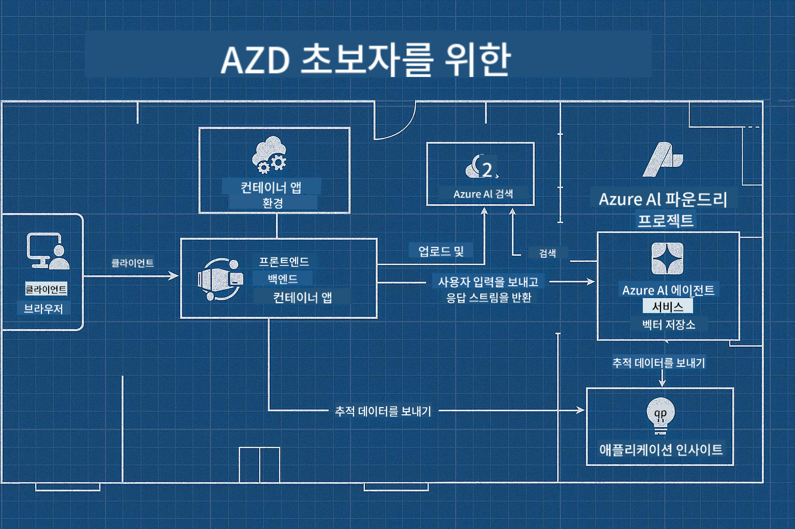

<!--
CO_OP_TRANSLATOR_METADATA:
{
  "original_hash": "245d24997bbcf2bae93bb2a503845d37",
  "translation_date": "2025-09-23T11:47:20+00:00",
  "source_file": "workshop/README.md",
  "language_code": "ko"
}
-->
# AZD for AI 개발자 워크숍

## AZD 템플릿

특정 시나리오에 맞는 엔터프라이즈급 AI 애플리케이션 솔루션을 구축하는 것은 마치 자신의 집을 짓는 것과 같습니다. 직접 설계하고, 벽돌 하나하나를 쌓으며, 모든 거버넌스와 개발 지침을 충족시키는 책임을 질 수 있습니다.

**혹은 ....**

건축가와 협력하여 _스타터 홈_에 대한 _청사진_을 받고, 이를 자신의 필요에 맞게 _맞춤화_할 수 있습니다. 이렇게 하면 **자신의 집**을 특별하게 만드는 데 집중할 수 있으며, 전문가들이 배선, 배관 및 기타 종속성을 처리하도록 맡길 수 있습니다.

**이것이 [AI App Templates](https://ai.azure.com/templates)**의 접근 방식입니다 - 핵심 요구 사항과 종속성에 따라 다양한 종류의 AI 애플리케이션 "집"을 구축하기 위한 일련의 청사진입니다.

## 템플릿 맞춤화

이 템플릿은 [Azure AI Foundry](https://ai.azure.com)를 기반으로 설계되었습니다. 이 플랫폼을 "건축 계약자"로 생각해보세요. 필요한 모든 리소스, 도구 및 전문 지식을 제공받아 작업을 완료할 수 있습니다!

[스타터 템플릿](https://learn.microsoft.com/en-us/azure/ai-foundry/how-to/develop/ai-template-get-started)을 선택하기만 하면 됩니다. 예를 들어, 우리는 _Get Started with AI Agents_ 템플릿에 집중하여 AI 검색, 레드 팀 테스트, 평가, 추적, 모니터링 등의 기능이 포함된 "Agentic AI Home"을 구축할 것입니다.



건축가와 시간을 예약하여 맞춤화 과정을 안내받기만 하면 됩니다. [GitHub Copilot for Azure](https://learn.microsoft.com/en-us/azure/developer/github-copilot-azure/get-started)가 그 가이드 역할을 할 수 있습니다. "대화"를 통해 다음을 수행할 수 있습니다:

- 템플릿에 포함된 Azure 기능에 대해 배우기
- Azure 리소스 배포
- 배포 정보 얻기
- 문제 진단 및 해결!

이 워크숍에서는 기존 템플릿을 _분석_하여 제공하는 내용을 배우고, 이를 _맞춤화_하여 요구 사항을 충족시키는 방법을 단계별로 배웁니다.

AI 템플릿은 **작동하게 만듭니다** - 워크숍을 완료하면 이를 **자신만의 것으로 만드는 방법**을 배우게 됩니다.

----

**워크숍 내비게이션**
- **📚 코스 홈**: [AZD For Beginners](../README.md)
- **📖 관련 챕터**: [Chapter 1](../README.md#-chapter-1-foundation--quick-start), [Chapter 2](../README.md#-chapter-2-ai-first-development-recommended-for-ai-developers), [Chapter 5](../README.md#-chapter-5-multi-agent-ai-solutions-advanced) 포함
- **🛠️ 실습 랩**: [AI Workshop Lab](../docs/ai-foundry/ai-workshop-lab.md)
- **🚀 다음 단계**: [워크숍 랩 모듈](../../../workshop)

Azure Developer CLI (AZD)를 배우고 AI 애플리케이션 배포에 중점을 둔 실습 워크숍에 오신 것을 환영합니다. 이 워크숍은 AZD 기본 사항부터 프로덕션 준비가 된 AI 솔루션 배포까지 안내합니다.

## 워크숍 개요

**소요 시간:** 2-3시간  
**수준:** 초급에서 중급  
**사전 요구 사항:** Azure, 명령줄 도구 및 AI 개념에 대한 기본 지식

### 학습 내용

- **AZD 기본 사항**: AZD를 활용한 코드 기반 인프라 이해
- 🤖 **AI 서비스 통합**: Azure OpenAI, AI 검색 및 기타 AI 서비스 배포
- **컨테이너 배포**: Azure Container Apps를 사용한 AI 애플리케이션 배포
- **보안 모범 사례**: Managed Identity 및 안전한 구성 구현
- **모니터링 및 관찰성**: AI 워크로드를 위한 Application Insights 설정
- **프로덕션 패턴**: 엔터프라이즈 준비 배포 전략

## 워크숍 구조

### 모듈 1: AZD 기초 (30분)
- AZD 설치 및 구성
- AZD 프로젝트 구조 이해
- 첫 번째 AZD 배포
- **랩**: 간단한 웹 애플리케이션 배포

### 모듈 2: Azure OpenAI 통합 (45분)
- Azure OpenAI 리소스 설정
- 모델 배포 전략
- API 액세스 및 인증 구성
- **랩**: GPT-4를 활용한 채팅 애플리케이션 배포

### 모듈 3: RAG 애플리케이션 (45분)
- Azure AI 검색 통합
- Azure Document Intelligence를 활용한 문서 처리
- 벡터 임베딩 및 의미 검색
- **랩**: 문서 Q&A 시스템 구축

### 모듈 4: 프로덕션 배포 (30분)
- 컨테이너 앱 구성
- 확장 및 성능 최적화
- 모니터링 및 로깅
- **랩**: 관찰성을 갖춘 프로덕션 배포

### 모듈 5: 고급 패턴 (15분)
- 다중 환경 배포
- CI/CD 통합
- 비용 최적화 전략
- **마무리**: 프로덕션 준비 체크리스트

## 사전 요구 사항

### 필수 도구

워크숍 전에 다음 도구를 설치하세요:

```bash
# Azure Developer CLI
curl -fsSL https://aka.ms/install-azd.sh | bash

# Azure CLI
curl -sL https://aka.ms/InstallAzureCLIDeb | sudo bash

# Git
sudo apt-get install git

# Docker
curl -fsSL https://get.docker.com -o get-docker.sh
sudo sh get-docker.sh

# Python 3.10+
sudo apt-get install python3.10 python3.10-venv python3-pip
```

### Azure 계정 설정

1. **Azure 구독**: [무료로 가입하기](https://azure.microsoft.com/free/)
2. **Azure OpenAI 액세스**: [액세스 요청](https://aka.ms/oai/access)
3. **필요한 권한**:
   - 구독 또는 리소스 그룹에 대한 Contributor 역할
   - RBAC 할당을 위한 User Access Administrator

### 사전 요구 사항 확인

다음 스크립트를 실행하여 설정을 확인하세요:

```bash
#!/bin/bash
echo "Verifying workshop prerequisites..."

# Check AZD installation
if command -v azd &> /dev/null; then
    echo "✅ Azure Developer CLI: $(azd --version)"
else
    echo "❌ Azure Developer CLI not found"
fi

# Check Azure CLI
if command -v az &> /dev/null; then
    echo "✅ Azure CLI: $(az --version | head -n1)"
else
    echo "❌ Azure CLI not found"
fi

# Check Docker
if command -v docker &> /dev/null; then
    echo "✅ Docker: $(docker --version)"
else
    echo "❌ Docker not found"
fi

# Check Python
if command -v python3 &> /dev/null; then
    echo "✅ Python: $(python3 --version)"
else
    echo "❌ Python 3 not found"
fi

# Check Azure login
if az account show &> /dev/null; then
    echo "✅ Azure: Logged in as $(az account show --query user.name -o tsv)"
else
    echo "❌ Azure: Not logged in (run 'az login')"
fi

echo "Setup verification complete!"
```

## 워크숍 자료

### 랩 실습

각 모듈에는 스타터 코드와 단계별 지침이 포함된 실습 랩이 있습니다:

- **[lab-1-azd-basics/](../../../workshop/lab-1-azd-basics)** - 첫 번째 AZD 배포
- **[lab-2-openai-chat/](../../../workshop/lab-2-openai-chat)** - Azure OpenAI를 활용한 채팅 애플리케이션
- **[lab-3-rag-search/](../../../workshop/lab-3-rag-search)** - AI 검색을 활용한 RAG 애플리케이션
- **[lab-4-production/](../../../workshop/lab-4-production)** - 프로덕션 배포 패턴
- **[lab-5-advanced/](../../../workshop/lab-5-advanced)** - 고급 배포 시나리오

### 참고 자료

- **[AI Foundry 통합 가이드](../docs/ai-foundry/azure-ai-foundry-integration.md)** - 종합적인 통합 패턴
- **[AI 모델 배포 가이드](../docs/ai-foundry/ai-model-deployment.md)** - 모델 배포 모범 사례
- **[프로덕션 AI 실습](../docs/ai-foundry/production-ai-practices.md)** - 엔터프라이즈 배포 패턴
- **[AI 문제 해결 가이드](../docs/troubleshooting/ai-troubleshooting.md)** - 일반적인 문제와 해결책

### 샘플 템플릿

일반적인 AI 시나리오를 위한 빠른 시작 템플릿:

```
workshop/templates/
├── minimal-chat/          # Basic OpenAI chat app
├── rag-application/       # RAG with AI Search
├── multi-model/          # Multiple AI services
└── production-ready/     # Enterprise template
```

## 시작하기

### 옵션 1: GitHub Codespaces (권장)

워크숍을 시작하는 가장 빠른 방법:

[](https://github.com/codespaces/new?hide_repo_select=true&ref=main&repo=YOUR_REPO_ID)

### 옵션 2: 로컬 개발

1. **워크숍 리포지토리 클론:**
```bash
git clone https://github.com/YOUR_ORG/AZD-for-beginners.git
cd AZD-for-beginners/workshop
```

2. **Azure 로그인:**
```bash
az login
azd auth login
```

3. **랩 1부터 시작:**
```bash
cd lab-1-azd-basics
cat README.md  # Follow the instructions
```

### 옵션 3: 강사 주도 워크숍

강사 주도 세션에 참석하는 경우:

- 🎥 **워크숍 녹화**: [온디맨드로 이용 가능](https://aka.ms/azd-ai-workshop)
- 💬 **Discord 커뮤니티**: [라이브 지원 참여](https://aka.ms/foundry/discord)
- **워크숍 피드백**: [경험 공유](https://aka.ms/azd-workshop-feedback)

## 워크숍 일정

### 자기 주도 학습 (3시간)

```
⏰ 00:00 - 00:30  Module 1: AZD Foundations
⏰ 00:30 - 01:15  Module 2: Azure OpenAI Integration
⏰ 01:15 - 02:00  Module 3: RAG Applications
⏰ 02:00 - 02:30  Module 4: Production Deployment
⏰ 02:30 - 02:45  Module 5: Advanced Patterns
⏰ 02:45 - 03:00  Q&A and Next Steps
```

### 강사 주도 세션 (2.5시간)

```
⏰ 00:00 - 00:15  Welcome & Prerequisites Check
⏰ 00:15 - 00:40  Module 1: Live Demo + Lab
⏰ 00:40 - 01:20  Module 2: OpenAI Integration
⏰ 01:20 - 01:30  Break
⏰ 01:30 - 02:10  Module 3: RAG Applications
⏰ 02:10 - 02:30  Module 4: Production Patterns
⏰ 02:30 - 02:45  Module 5: Advanced Topics
⏰ 02:45 - 03:00  Q&A and Resources
```

## 성공 기준

워크숍이 끝날 때까지 다음을 수행할 수 있습니다:

✅ **AZD 템플릿을 사용하여 AI 애플리케이션 배포**  
✅ **적절한 보안으로 Azure OpenAI 서비스 구성**  
✅ **Azure AI 검색 통합을 활용한 RAG 애플리케이션 구축**  
✅ **엔터프라이즈 AI 워크로드를 위한 프로덕션 패턴 구현**  
✅ **AI 애플리케이션 배포 모니터링 및 문제 해결**  
✅ **AI 워크로드 비용 최적화 전략 적용**  

## 커뮤니티 및 지원

### 워크숍 중

- 🙋 **질문**: 워크숍 채팅을 사용하거나 손을 들어 질문하세요
- 🐛 **문제**: [문제 해결 가이드](../docs/troubleshooting/ai-troubleshooting.md) 확인
- **팁**: 다른 참가자와 발견한 내용을 공유하세요

### 워크숍 후

- 💬 **Discord**: [Azure AI Foundry 커뮤니티](https://aka.ms/foundry/discord)
- **GitHub Issues**: [템플릿 문제 보고](https://github.com/YOUR_ORG/AZD-for-beginners/issues)
- 📧 **피드백**: [워크숍 평가 양식](https://aka.ms/azd-workshop-feedback)

## 다음 단계

### 학습 계속하기

1. **고급 시나리오**: [다중 지역 배포](../docs/ai-foundry/production-ai-practices.md#multi-region-deployment) 탐색
2. **CI/CD 통합**: [GitHub Actions 워크플로우 설정](../docs/deployment/github-actions.md)
3. **맞춤 템플릿**: [AZD 템플릿 생성](../docs/getting-started/custom-templates.md)

### 프로젝트에 적용하기

1. **평가**: [준비 체크리스트](./production-readiness-checklist.md) 사용
2. **템플릿**: [AI 전용 템플릿](../../../workshop/templates)로 시작
3. **지원**: [Azure AI Foundry Discord](https://aka.ms/foundry/discord) 참여

### 성공 공유하기

- ⭐ **리포지토리에 별표**를 달아 워크숍이 도움이 되었음을 알리세요
- 🐦 **소셜 미디어에 공유**: #AzureDeveloperCLI #AzureAI
- 📝 **블로그 게시물 작성**: AI 배포 여정에 대해 작성하세요

---

## 워크숍 피드백

여러분의 피드백은 워크숍 경험을 개선하는 데 도움이 됩니다:

| 항목 | 평가 (1-5) | 의견 |
|------|------------|------|
| 콘텐츠 품질 | ⭐⭐⭐⭐⭐ | |
| 실습 랩 | ⭐⭐⭐⭐⭐ | |
| 문서화 | ⭐⭐⭐⭐⭐ | |
| 난이도 수준 | ⭐⭐⭐⭐⭐ | |
| 전체 경험 | ⭐⭐⭐⭐⭐ | |

**피드백 제출**: [워크숍 평가 양식](https://aka.ms/azd-workshop-feedback)

---

**이전:** [AI 문제 해결 가이드](../docs/troubleshooting/ai-troubleshooting.md) | **다음:** [랩 1: AZD 기초 시작](../../../workshop/lab-1-azd-basics)

**AZD를 사용하여 AI 애플리케이션을 구축할 준비가 되셨나요?**

[랩 1: AZD 기초 시작 →](./lab-1-azd-basics/README.md)

---

