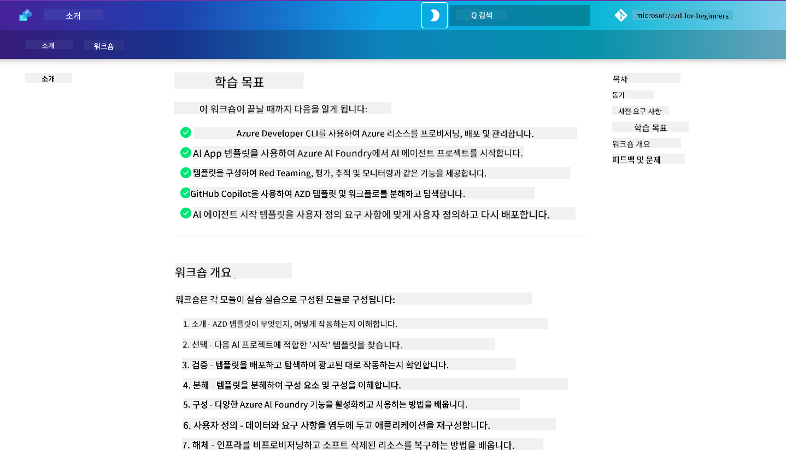

<!--
CO_OP_TRANSLATOR_METADATA:
{
  "original_hash": "9cc966416ab431c38b2ab863884b196c",
  "translation_date": "2025-09-24T09:47:16+00:00",
  "source_file": "workshop/README.md",
  "language_code": "ko"
}
-->
# AZD for AI 개발자 워크숍

Azure Developer CLI (AZD)를 배우고 AI 애플리케이션 배포에 중점을 둔 실습 워크숍에 오신 것을 환영합니다. 이 워크숍은 AZD 템플릿을 3단계로 학습할 수 있도록 도와줍니다:

1. **탐색** - 나에게 맞는 템플릿 찾기  
1. **배포** - 배포하고 작동 여부 확인  
1. **커스터마이징** - 수정하고 반복하여 나만의 것으로 만들기  

이 워크숍을 통해 핵심 개발 도구와 워크플로우도 소개받게 되며, 이를 통해 개발 여정을 더욱 효율적으로 진행할 수 있습니다.

<br/>

## 브라우저 기반 가이드

워크숍 레슨은 Markdown 형식으로 작성되어 있습니다. GitHub에서 직접 탐색하거나 아래 스크린샷과 같이 브라우저 기반 미리보기를 실행할 수 있습니다.



이 옵션을 사용하려면, 리포지토리를 본인의 프로필로 포크한 후 GitHub Codespaces를 실행하세요. VS Code 터미널이 활성화되면 다음 명령어를 입력하세요:

```bash title="" linenums="0"
mkdocs serve > /dev/null 2>&1 &
```
  
몇 초 후 팝업 대화 상자가 나타납니다. `브라우저에서 열기` 옵션을 선택하세요. 이제 웹 기반 가이드가 새 브라우저 탭에서 열립니다. 이 미리보기의 장점은 다음과 같습니다:

1. **내장 검색** - 키워드나 레슨을 빠르게 찾을 수 있음  
1. **복사 아이콘** - 코드 블록 위에 마우스를 올리면 복사 옵션 표시  
1. **테마 전환** - 다크 모드와 라이트 모드 간 전환 가능  
1. **도움 받기** - 하단의 Discord 아이콘을 클릭하여 참여  

<br/>

## 워크숍 개요

**소요 시간:** 3-4시간  
**레벨:** 초급에서 중급  
**사전 요구 사항:** Azure, AI 개념, VS Code 및 명령줄 도구에 대한 기본 지식  

이 워크숍은 실습을 통해 배우는 방식으로 진행됩니다. 모든 연습을 완료한 후에는 AZD 초보자 커리큘럼을 검토하여 보안 및 생산성 모범 사례에 대한 학습을 이어가길 권장합니다.

| 시간 | 모듈  | 목표 |
|:---|:---|:---|
| 15분 | [소개](docs/instructions/0-Introduction.md) | 목표 이해 및 준비 |
| 30분 | [AI 템플릿 선택](docs/instructions/1-Select-AI-Template.md) | 옵션 탐색 및 시작 템플릿 선택 | 
| 30분 | [AI 템플릿 검증](docs/instructions/2-Validate-AI-Template.md) | 기본 솔루션을 Azure에 배포 |
| 30분 | [AI 템플릿 분석](docs/instructions/3-Deconstruct-AI-Template.md) | 구조 및 구성 탐색 |
| 30분 | [AI 템플릿 구성](docs/instructions/4-Configure-AI-Template.md) | 사용 가능한 기능 활성화 및 테스트 |
| 30분 | [AI 템플릿 커스터마이징](docs/instructions/5-Customize-AI-Template.md) | 템플릿을 나만의 요구에 맞게 수정 |
| 30분 | [인프라 해체](docs/instructions/6-Teardown-Infrastructure.md) | 리소스 정리 및 해제 |
| 15분 | [마무리 및 다음 단계](docs/instructions/7-Wrap-up.md) | 학습 자료 및 워크숍 도전 과제 |

<br/>

## 학습 목표

AZD 템플릿을 Azure AI Foundry에서의 엔드 투 엔드 개발을 탐색할 수 있는 학습 샌드박스로 생각하세요. 워크숍이 끝날 때쯤, 다양한 도구와 개념에 대한 직관적인 이해를 얻게 될 것입니다.

| 개념  | 목표 |
|:---|:---|
| **Azure Developer CLI** | 도구 명령어 및 워크플로우 이해 |
| **AZD 템플릿**| 프로젝트 구조 및 구성 이해 |
| **Azure AI 에이전트**| Azure AI Foundry 프로젝트 프로비저닝 및 배포 |
| **Azure AI 검색**| 에이전트와 함께 컨텍스트 엔지니어링 활성화 |
| **관찰 가능성**| 추적, 모니터링 및 평가 탐색 |
| **레드 팀 테스트**| 적대적 테스트 및 완화 방법 탐색 |

<br/>

## 워크숍 구조

이 워크숍은 템플릿 탐색에서 시작하여 배포, 분석, 커스터마이징까지의 여정을 안내합니다. 공식 [AI 에이전트 시작하기](https://github.com/Azure-Samples/get-started-with-ai-agents) 시작 템플릿을 기반으로 진행됩니다.

### [모듈 1: AI 템플릿 선택](docs/instructions/1-Select-AI-Template.md) (30분)

- AI 템플릿이란 무엇인가?  
- AI 템플릿은 어디에서 찾을 수 있는가?  
- AI 에이전트를 어떻게 시작할 수 있는가?  
- **실습**: GitHub Codespaces로 빠르게 시작하기  

### [모듈 2: AI 템플릿 검증](docs/instructions/2-Validate-AI-Template.md) (30분)

- AI 템플릿 아키텍처란 무엇인가?  
- AZD 개발 워크플로우란 무엇인가?  
- AZD 개발 도움을 어디서 받을 수 있는가?  
- **실습**: AI 에이전트 템플릿 배포 및 검증  

### [모듈 3: AI 템플릿 분석](docs/instructions/3-Deconstruct-AI-Template.md) (30분)

- `.azure/` 환경 탐색  
- `infra/` 리소스 설정 탐색  
- `azure.yaml`의 AZD 구성 탐색  
- **실습**: 환경 변수 수정 및 재배포  

### [모듈 4: AI 템플릿 구성](docs/instructions/4-Configure-AI-Template.md) (30분)

- 탐색: Retrieval Augmented Generation  
- 탐색: 에이전트 평가 및 레드 팀 테스트  
- 탐색: 추적 및 모니터링  
- **실습**: AI 에이전트 + 관찰 가능성 탐색  

### [모듈 5: AI 템플릿 커스터마이징](docs/instructions/5-Customize-AI-Template.md) (30분)

- 정의: 시나리오 요구사항을 포함한 PRD  
- 구성: AZD 환경 변수 설정  
- 구현: 추가 작업을 위한 라이프사이클 훅  
- **실습**: 내 시나리오에 맞게 템플릿 커스터마이징  

### [모듈 6: 인프라 해체](docs/instructions/6-Teardown-Infrastructure.md) (30분)

- 요약: AZD 템플릿이란 무엇인가?  
- 요약: Azure Developer CLI를 사용하는 이유는?  
- 다음 단계: 다른 템플릿 시도하기!  
- **실습**: 인프라 해제 및 정리  

<br/>

## 워크숍 도전 과제

더 도전해보고 싶으신가요? 다음은 몇 가지 프로젝트 제안입니다. 또는 여러분의 아이디어를 공유해주세요!

| 프로젝트 | 설명 |
|:---|:---|
|1. **복잡한 AI 템플릿 분석** | 우리가 제시한 워크플로우와 도구를 사용하여 다른 AI 솔루션 템플릿을 배포, 검증, 커스터마이징해보세요. _무엇을 배웠나요?_ |
|2. **내 시나리오에 맞게 커스터마이징** | 다른 시나리오에 대한 PRD(제품 요구사항 문서)를 작성해보세요. 그런 다음 GitHub Copilot을 사용하여 에이전트 모델에서 템플릿 리포지토리를 열고, 커스터마이징 워크플로우를 생성하도록 요청하세요. _무엇을 배웠나요? 이 제안을 어떻게 개선할 수 있을까요?_ |
| | |

## 피드백이 있나요?

1. 이 리포지토리에 이슈를 게시하세요 - `Workshop` 태그를 추가하면 편리합니다.  
1. Azure AI Foundry Discord에 참여하여 동료들과 소통하세요!  

| | | 
|:---|:---|
| **📚 코스 홈**| [AZD 초보자용](../README.md)|
| **📖 문서** | [AI 템플릿 시작하기](https://learn.microsoft.com/en-us/azure/ai-foundry/how-to/develop/ai-template-get-started)|
| **🛠️AI 템플릿** | [Azure AI Foundry 템플릿](https://ai.azure.com/templates) |
|**🚀 다음 단계** | [도전 과제 수행하기](../../../workshop) |
| | |

<br/>

---

**이전:** [AI 문제 해결 가이드](../docs/troubleshooting/ai-troubleshooting.md) | **다음:** [랩 1: AZD 기본](../../../workshop/lab-1-azd-basics) 시작하기  

**AZD로 AI 애플리케이션을 구축할 준비가 되셨나요?**

[랩 1: AZD 기초 시작하기 →](./lab-1-azd-basics/README.md)  

---

