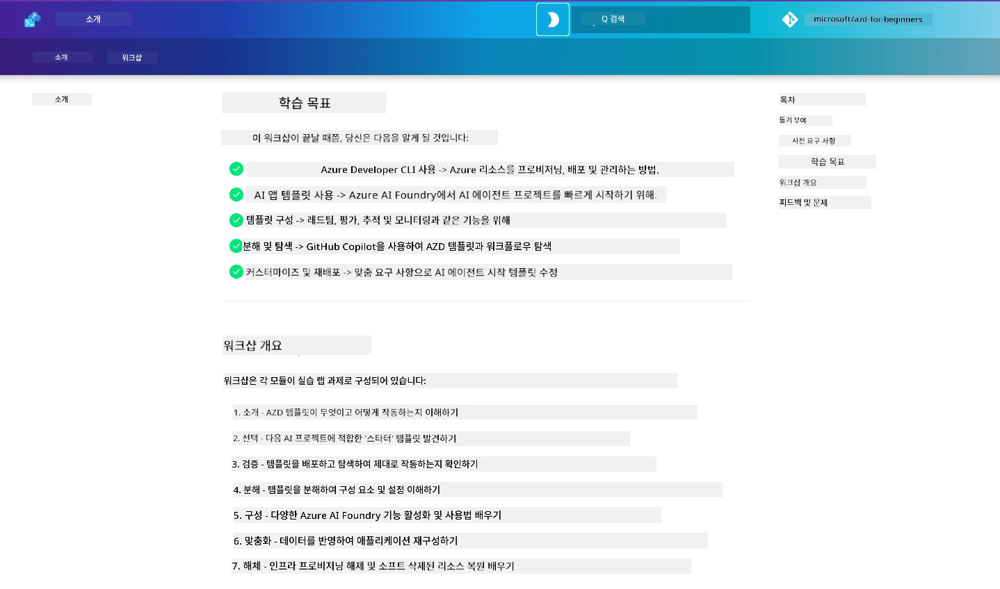

<div align="center">
  <div style="background: linear-gradient(135deg, #0078d4, #106ebe); border-radius: 10px; padding: 20px; margin: 20px 0; box-shadow: 0 4px 15px rgba(0, 120, 212, 0.3); border: 2px solid #005a9e;">
    <h2 style="color: white; margin: 0; font-size: 24px; text-shadow: 1px 1px 2px rgba(0,0,0,0.3);">
      🎯 AI 개발자를 위한 AZD 워크숍
    </h2>
    <p style="color: white; margin: 10px 0 0 0; font-size: 16px; text-shadow: 1px 1px 2px rgba(0,0,0,0.3);">
      <strong>Azure Developer CLI로 AI 애플리케이션을 구축하는 실습 워크숍입니다.</strong><br>
      AZD 템플릿과 AI 배포 워크플로를 마스터하기 위해 7개의 모듈을 완료하세요.
    </p>
    <div style="margin-top: 15px;">
      <span style="background: rgba(255,255,255,0.2); padding: 5px 10px; border-radius: 15px; color: white; font-size: 14px;">
        📅 최종 업데이트: 2026년 2월
      </span>
    </div>
  </div>
</div>

# AI 개발자를 위한 AZD 워크숍

AI 애플리케이션 배포에 중점을 둔 Azure Developer CLI(AZD)를 배우는 실습 워크숍에 오신 것을 환영합니다. 이 워크숍은 3단계로 AZD 템플릿을 실습할 수 있도록 도와줍니다:

1. **발견** - 자신에게 맞는 템플릿을 찾습니다.
1. **배포** - 배포 후 정상 작동 여부를 검증합니다.
1. **맞춤화** - 수정하고 반복하여 나만의 것을 만듭니다!

이 워크숍을 진행하는 동안 핵심 개발 도구와 워크플로도 소개하여 전체 개발 여정을 효율화할 수 있도록 도와드립니다.

<br/>

## 브라우저 기반 가이드

워크숍 강의는 마크다운 형식입니다. GitHub에서 직접 탐색하거나 아래 스크린샷과 같이 브라우저 기반 미리보기를 실행할 수 있습니다.



이 옵션을 사용하려면 저장소를 자신의 프로필로 포크하고 GitHub Codespaces를 실행하세요. VS Code 터미널이 활성화되면 다음 명령어를 입력합니다:

```bash title="" linenums="0"
mkdocs serve > /dev/null 2>&1 &
```

몇 초 후 팝업 대화상자가 나타납니다. `Open in browser` 옵션을 선택하세요. 웹 기반 가이드가 새 브라우저 탭에서 열립니다. 이 미리보기의 장점:

1. **내장 검색** - 키워드나 강의를 빠르게 찾을 수 있습니다.
1. **복사 아이콘** - 코드 블록 위에 마우스를 올리면 이 옵션이 표시됩니다.
1. **테마 전환** - 다크 및 라이트 테마 간 전환 가능합니다.
1. **도움 받기** - 하단의 Discord 아이콘을 클릭해 참여하세요!

<br/>

## 워크숍 개요

**소요 시간:** 3-4시간  
**난이도:** 초급 ~ 중급  
**사전 지식:** Azure, AI 개념, VS Code 및 커맨드라인 도구에 대한 기본 이해.

이 워크숍은 실습 중심으로 직접 배우는 형식입니다. 연습을 완료한 후에는 AZD 초급자 과정(AZD For Beginners)을 통해 보안 및 생산성 모범 사례 학습을 이어가시길 권장합니다.

| 시간| 모듈  | 목표 |
|:---|:---|:---|
| 15분 | [소개](docs/instructions/0-Introduction.md) | 개요 설정 및 목표 이해 |
| 30분 | [AI 템플릿 선택](docs/instructions/1-Select-AI-Template.md) | 옵션 탐색 및 시작 템플릿 선택 | 
| 30분 | [AI 템플릿 검증](docs/instructions/2-Validate-AI-Template.md) | 기본 솔루션을 Azure에 배포 |
| 30분 | [AI 템플릿 해체](docs/instructions/3-Deconstruct-AI-Template.md) | 구조 및 구성 탐색 |
| 30분 | [AI 템플릿 구성](docs/instructions/4-Configure-AI-Template.md) | 활성화 및 사용 가능한 기능 체험 |
| 30분 | [AI 템플릿 맞춤화](docs/instructions/5-Customize-AI-Template.md) | 필요에 맞게 템플릿 조정 |
| 30분 | [인프라 해체](docs/instructions/6-Teardown-Infrastructure.md) | 리소스 정리 및 해제 |
| 15분 | [마무리 및 다음 단계](docs/instructions/7-Wrap-up.md) | 학습 자료 및 워크숍 도전 과제 |

<br/>

## 학습 내용

AZD 템플릿을 마이크로소프트 파운드리에서 엔드투엔드 개발을 탐색할 수 있는 학습 샌드박스로 생각하세요. 이 워크숍이 끝나면 관련 도구와 개념에 대한 직관적인 이해를 갖게 될 것입니다.

| 개념  | 목표 |
|:---|:---|
| **Azure Developer CLI** | 도구 명령어 및 워크플로 이해 |
| **AZD 템플릿**| 프로젝트 구조 및 구성 이해 |
| **Azure AI 에이전트**| Microsoft Foundry 프로젝트 프로비저닝 및 배포 |
| **Azure AI 서치**| 에이전트를 통한 컨텍스트 엔지니어링 활성화 |
| **관측성**| 추적, 모니터링 및 평가 탐색 |
| **레드팀 테스트**| 적대적 테스트 및 대응책 탐색 |

<br/>

## 워크숍 구성

워크숍은 공식 [Getting Started with AI Agents](https://github.com/Azure-Samples/get-started-with-ai-agents) 시작 템플릿을 기반으로 템플릿 발견부터 배포, 해체, 맞춤화까지 여정을 진행합니다.

### [모듈 1: AI 템플릿 선택](docs/instructions/1-Select-AI-Template.md) (30분)

- AI 템플릿이란?
- AI 템플릿은 어디에서 찾을 수 있나요?
- AI 에이전트 구축을 어떻게 시작하나요?
- **실습**: GitHub Codespaces 빠른 시작

### [모듈 2: AI 템플릿 검증](docs/instructions/2-Validate-AI-Template.md) (30분)

- AI 템플릿 아키텍처는 무엇인가요?
- AZD 개발 워크플로란 무엇인가요?
- AZD 개발 도움을 어떻게 받나요?
- **실습**: AI 에이전트 템플릿 배포 및 검증

### [모듈 3: AI 템플릿 해체](docs/instructions/3-Deconstruct-AI-Template.md) (30분)

- `.azure/` 환경 탐색
- `infra/` 리소스 설정 탐색
- `azure.yaml` 내 AZD 구성 탐색
- **실습**: 환경 변수 수정 및 재배포

### [모듈 4: AI 템플릿 구성](docs/instructions/4-Configure-AI-Template.md) (30분)
- 탐색: 검색 기반 생성(Retrieval Augmented Generation)
- 탐색: 에이전트 평가 및 레드팀 테스트
- 탐색: 추적 및 모니터링
- **실습**: AI 에이전트 및 관측성 탐색

### [모듈 5: AI 템플릿 맞춤화](docs/instructions/5-Customize-AI-Template.md) (30분)
- 정의: 시나리오 요구사항이 포함된 PRD 작성
- 구성: AZD 환경 변수 설정
- 구현: 추가 작업의 라이프사이클 훅
- **실습**: 나만의 시나리오에 맞게 템플릿 맞춤화

### [모듈 6: 인프라 해체](docs/instructions/6-Teardown-Infrastructure.md) (30분)
- 복습: AZD 템플릿이란?
- 복습: Azure Developer CLI 사용 이유
- 다음 단계: 다른 템플릿 시도하기!
- **실습**: 인프라 제거 및 정리

<br/>

## 워크숍 도전 과제

더 많은 도전을 원하나요? 여기 몇 가지 프로젝트 제안을 드립니다 - 또는 아이디어를 공유해 주세요!!

| 프로젝트 | 설명 |
|:---|:---|
|1. **복잡한 AI 템플릿 해체** | 안내한 워크플로 및 도구를 활용해 다른 AI 솔루션 템플릿을 배포, 검증, 맞춤화 해보세요. _무엇을 배웠나요?_ |
|2. **나만의 시나리오로 맞춤화**  | 다른 시나리오에 대한 PRD(제품 요구사항 문서)를 작성해 보세요. 그런 다음 템플릿 저장소에서 GitHub Copilot을 Agent Model로 사용해 맞춤화 워크플로를 생성해 달라고 요청하세요. _무엇을 배웠나요? 어떻게 개선할 수 있을까요?_ |
| | |

## 피드백이 있나요?

1. 이 저장소에 이슈를 게시하세요 - 편리하게 `Workshop` 태그를 달아 주세요.
1. Microsoft Foundry Discord에 참여해 동료들과 소통하세요!


| | | 
|:---|:---|
| **📚 강의 홈**| [AZD 초급자 과정](../README.md)|
| **📖 문서** | [AI 템플릿 시작하기](https://learn.microsoft.com/en-us/azure/ai-foundry/how-to/develop/ai-template-get-started)|
| **🛠️ AI 템플릿** | [Microsoft Foundry 템플릿](https://ai.azure.com/templates) |
|**🚀 다음 단계** | [워크숍 시작하기](../../../workshop) |
| | |

<br/>

---

**탐색:** [메인 코스](../README.md) | [소개](docs/instructions/0-Introduction.md) | [모듈 1: 템플릿 선택](docs/instructions/1-Select-AI-Template.md)

**AZD로 AI 애플리케이션 구축을 시작할 준비가 되셨나요?**

[워크숍 시작: 소개 →](docs/instructions/0-Introduction.md)

---

<!-- CO-OP TRANSLATOR DISCLAIMER START -->
**면책 조항**:  
이 문서는 AI 번역 서비스 [Co-op Translator](https://github.com/Azure/co-op-translator)를 사용하여 번역되었습니다. 정확성을 위해 최선을 다하고 있으나, 자동 번역에는 오류나 부정확한 내용이 포함될 수 있음을 유의해 주시기 바랍니다. 원본 문서는 해당 언어의 공식 출처로 간주되어야 합니다. 중요한 정보의 경우 전문 인력에 의한 번역을 권장합니다. 본 번역의 사용으로 인해 발생하는 오해나 해석상의 문제에 대해 당사는 책임을 지지 않습니다.
<!-- CO-OP TRANSLATOR DISCLAIMER END -->