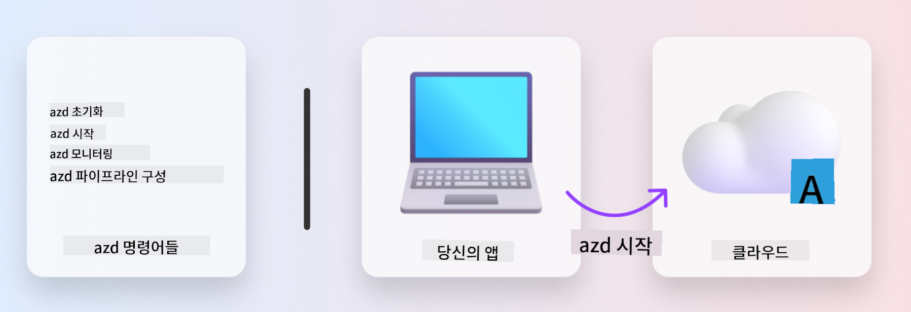
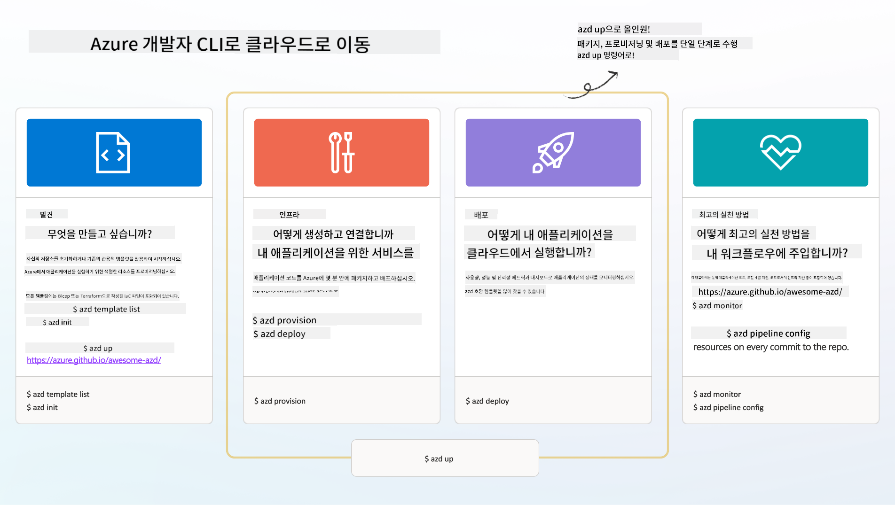

<!--
CO_OP_TRANSLATOR_METADATA:
{
  "original_hash": "06d6207eff634aefcaa41739490a5324",
  "translation_date": "2025-09-24T09:59:44+00:00",
  "source_file": "workshop/docs/instructions/1-Select-AI-Template.md",
  "language_code": "ko"
}
-->
# 1. 템플릿 선택하기

!!! tip "이 모듈을 완료하면 다음을 할 수 있습니다"

    - [ ] AZD 템플릿이 무엇인지 설명할 수 있습니다.
    - [ ] AI를 위한 AZD 템플릿을 발견하고 사용할 수 있습니다.
    - [ ] AI Agents 템플릿을 시작할 수 있습니다.
    - [ ] **실습 1:** GitHub Codespaces를 사용한 AZD 빠른 시작

---

## 1. 건축가 비유

최신 기업용 AI 애플리케이션을 _처음부터_ 구축하는 것은 매우 어려운 일입니다. 이는 마치 벽돌 하나하나를 쌓아가며 집을 직접 짓는 것과 같습니다. 물론 가능은 하지만, 원하는 결과를 얻기 위한 가장 효율적인 방법은 아닙니다!

대신, 우리는 종종 기존의 _설계 청사진_을 시작점으로 삼고, 이를 개인 요구사항에 맞게 맞춤화하기 위해 건축가와 협력합니다. 지능형 애플리케이션을 구축할 때도 동일한 접근 방식을 취해야 합니다. 먼저, 문제 영역에 적합한 설계 아키텍처를 찾고, 솔루션 아키텍트와 협력하여 특정 시나리오에 맞게 솔루션을 맞춤화하고 개발합니다.

그렇다면 이러한 설계 청사진은 어디에서 찾을 수 있을까요? 그리고 이러한 청사진을 맞춤화하고 배포하는 방법을 가르쳐줄 아키텍트를 어떻게 찾을 수 있을까요? 이 워크숍에서는 다음 세 가지 기술을 소개하며 이러한 질문에 답합니다:

1. [Azure Developer CLI](https://aka.ms/azd) - 로컬 개발(빌드)에서 클라우드 배포(출시)로의 개발 경로를 가속화하는 오픈소스 도구.
1. [Azure AI Foundry Templates](https://ai.azure.com/templates) - AI 솔루션 아키텍처를 배포하기 위한 샘플 코드, 인프라 및 구성 파일을 포함한 표준화된 오픈소스 저장소.
1. [GitHub Copilot Agent Mode](https://code.visualstudio.com/docs/copilot/chat/chat-agent-mode) - Azure 지식을 기반으로 한 코딩 에이전트로, 자연어를 사용하여 코드베이스를 탐색하고 변경 사항을 안내합니다.

이 도구들을 활용하면 적합한 템플릿을 _발견_하고, 이를 _배포_하여 작동 여부를 확인하며, 특정 시나리오에 맞게 _맞춤화_할 수 있습니다. 이제 이 도구들이 어떻게 작동하는지 알아보겠습니다.

---

## 2. Azure Developer CLI

[Azure Developer CLI](https://learn.microsoft.com/en-us/azure/developer/azure-developer-cli/) (또는 `azd`)는 개발 친화적인 명령어 세트를 통해 IDE(개발)와 CI/CD(DevOps) 환경에서 일관되게 작동하며 코드에서 클라우드로의 여정을 가속화하는 오픈소스 명령줄 도구입니다.

`azd`를 사용하면 배포 과정이 다음과 같이 간단해질 수 있습니다:

- `azd init` - 기존 AZD 템플릿에서 새로운 AI 프로젝트를 초기화합니다.
- `azd up` - 인프라를 프로비저닝하고 애플리케이션을 한 번에 배포합니다.
- `azd monitor` - 배포된 애플리케이션에 대한 실시간 모니터링 및 진단을 제공합니다.
- `azd pipeline config` - Azure로의 배포를 자동화하는 CI/CD 파이프라인을 설정합니다.

**🎯 | 실습**: <br/> GitHub Codespaces 환경에서 `azd` 명령줄 도구를 탐색해보세요. 아래 명령어를 입력하여 도구가 무엇을 할 수 있는지 확인해보세요:

```bash title="" linenums="0"
azd help
```



---

## 3. AZD 템플릿

`azd`가 이러한 작업을 수행하려면 프로비저닝할 인프라, 적용할 구성 설정, 배포할 애플리케이션에 대한 정보를 알아야 합니다. 바로 이때 [AZD 템플릿](https://learn.microsoft.com/en-us/azure/developer/azure-developer-cli/azd-templates?tabs=csharp)이 필요합니다.

AZD 템플릿은 솔루션 아키텍처를 배포하기 위해 필요한 샘플 코드와 인프라 및 구성 파일을 결합한 오픈소스 저장소입니다. 
_코드로서의 인프라_ (IaC) 접근 방식을 사용하여 템플릿 리소스 정의와 구성 설정을 애플리케이션 소스 코드처럼 버전 관리할 수 있습니다. 이를 통해 프로젝트 사용자 간에 재사용 가능하고 일관된 워크플로를 생성합니다.

_자신의_ 시나리오에 맞는 AZD 템플릿을 생성하거나 재사용할 때 다음 질문을 고려하세요:

1. 무엇을 구축하고 있습니까? → 해당 시나리오에 대한 시작 코드가 포함된 템플릿이 있습니까?
1. 솔루션은 어떻게 설계되었습니까? → 필요한 리소스를 포함한 템플릿이 있습니까?
1. 솔루션은 어떻게 배포됩니까? → `azd deploy`와 사전/사후 처리 훅을 생각해보세요!
1. 이를 어떻게 더 최적화할 수 있습니까? → 내장된 모니터링 및 자동화 파이프라인을 생각해보세요!

**🎯 | 실습**: <br/> 
[Awesome AZD](https://azure.github.io/awesome-azd/) 갤러리를 방문하여 현재 제공되는 250개 이상의 템플릿을 필터링하며 탐색해보세요. _자신의_ 시나리오 요구사항에 맞는 템플릿을 찾아보세요.



---

## 4. AI 애플리케이션 템플릿

---

