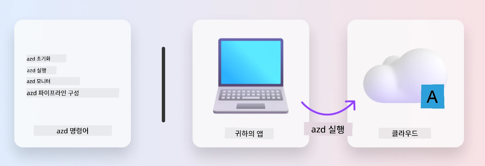
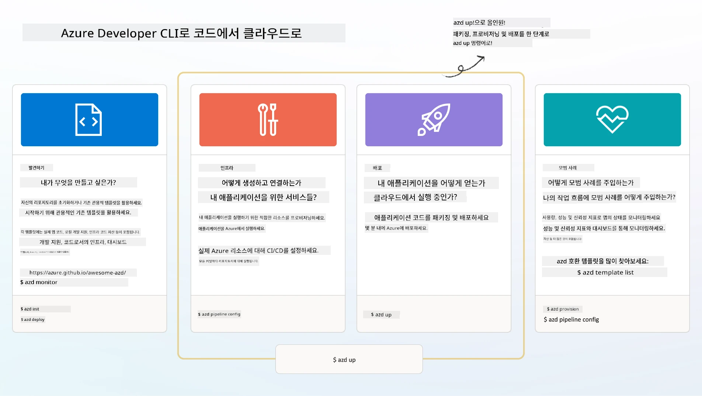

# 1. 템플릿 선택

!!! tip "이 모듈이 끝날 때쯤 당신은 다음을 할 수 있습니다"

    - [ ] AZD 템플릿이 무엇인지 설명하기
    - [ ] AI용 AZD 템플릿 찾아보고 사용하기
    - [ ] AI Agents 템플릿으로 시작하기
    - [ ] **Lab 1:** Codespaces 또는 개발 컨테이너에서의 AZD 빠른 시작

---

## 1. 건축가 비유

최신 엔터프라이즈급 AI 애플리케이션을 _처음부터_ 구축하는 것은 벅찰 수 있습니다. 이것은 마치 새 집을 벽돌 하나하나 쌓아가며 직접 지어야 하는 것과 비슷합니다. 물론 가능하긴 합니다! 하지만 원하는 최종 결과를 얻는 가장 효과적인 방법은 아닙니다!

대신 우리는 종종 기존의 _설계 청사진_으로 시작하고, 건축가와 협력해 개인의 요구사항에 맞게 맞춤화합니다. 지능형 애플리케이션을 구축할 때도 바로 이 접근 방식을 취합니다. 먼저, 문제 영역에 맞는 좋은 설계 아키텍처를 찾으세요. 그런 다음 솔루션 아키텍트와 협력해 특정 시나리오에 맞게 솔루션을 맞춤화하고 개발합니다.

그런데 이러한 설계 청사진은 어디에서 찾을 수 있을까요? 그리고 이러한 청사진을 스스로 맞춤화하고 배포하는 방법을 가르쳐줄 건축가는 어디서 찾을 수 있을까요? 이 워크숍에서는 다음 세 가지 기술을 소개하여 그 질문들에 답합니다:

1. [Azure Developer CLI](https://aka.ms/azd) - 로컬 개발(빌드)에서 클라우드 배포(배포)로 가는 개발자 경로를 가속화하는 오픈 소스 도구입니다.
1. [Microsoft Foundry Templates](https://ai.azure.com/templates) - AI 솔루션 아키텍처를 배포하기 위한 샘플 코드, 인프라 및 구성 파일을 포함한 표준화된 오픈 소스 저장소입니다.
1. [GitHub Copilot Agent Mode](https://code.visualstudio.com/docs/copilot/chat/chat-agent-mode) - Azure 지식을 기반으로 코드베이스를 탐색하고 자연어로 변경 사항을 안내해주는 코딩 에이전트입니다.

이 도구들을 사용하면 적절한 템플릿을 _발견_하고, 배포하여 작동 여부를 검증한 다음, 특정 시나리오에 맞게 _맞춤화_할 수 있습니다. 이제 어떻게 작동하는지 살펴보겠습니다.


---

## 2. Azure Developer CLI

The [Azure Developer CLI](https://learn.microsoft.com/en-us/azure/developer/azure-developer-cli/) (or `azd`) is an open-source commandline tool that can speed up your code-to-cloud journey with a set of developer-friendly commands that work consistently across your IDE (development) and CI/CD (devops) environments.

With `azd`, your deployment journey can be as simple as:

- `azd init` - Initializes a new AI project from an existing AZD template.
- `azd up` - Provisions infrastructure and deploy your application in one step.
- `azd monitor` - Get real-time monitoring and diagnostics for your deployed application.
- `azd pipeline config` - Setup CI/CD pipelines to automate deployment to Azure.

**🎯 | 연습**: <br/> 현재 워크숍 환경에서 `azd` 명령줄 도구를 탐색해 보세요. 이 환경은 GitHub Codespaces, 개발 컨테이너 또는 필수 조건이 설치된 로컬 클론일 수 있습니다. 먼저 다음 명령어를 입력하여 도구가 무엇을 할 수 있는지 확인하세요:

```bash title="" linenums="0"
azd help
```



---

## 3. AZD 템플릿

For `azd` to achieve this, it needs to know the infrastructure to provision, the configuration settings to enforce, and the application to deploy. This is where [AZD templates](https://learn.microsoft.com/en-us/azure/developer/azure-developer-cli/azd-templates?tabs=csharp) come in. 

AZD 템플릿은 솔루션 아키텍처를 배포하는 데 필요한 샘플 코드와 인프라 및 구성 파일을 결합한 오픈 소스 저장소입니다.
_Infrastructure-as-Code_ (IaC) 접근 방식을 사용함으로써, 템플릿 리소스 정의와 구성 설정을 버전 컨트롤러(앱 소스 코드와 마찬가지로)로 관리할 수 있게 하여 해당 프로젝트 사용자들 간에 재사용 가능하고 일관된 워크플로를 생성합니다.

_당신_의 시나리오에 맞게 AZD 템플릿을 생성하거나 재사용할 때는 다음 질문들을 고려하세요:

1. 무엇을 만들고 있나요? → 해당 시나리오에 대한 스타터 코드가 포함된 템플릿이 있나요?
1. 솔루션은 어떻게 설계되어 있나요? → 필요한 리소스를 가진 템플릿이 있나요?
1. 솔루션은 어떻게 배포되나요? → 사전/사후 처리 훅이 포함된 `azd deploy`를 생각하세요!
1. 어떻게 더 최적화할 수 있나요? → 내장 모니터링 및 자동화 파이프라인을 생각하세요!

**🎯 | 연습**: <br/> 
[Awesome AZD](https://azure.github.io/awesome-azd/) 갤러리를 방문하여 필터를 사용해 현재 사용 가능한 250개 이상의 템플릿을 탐색해 보세요. 여러분의 시나리오 요구사항에 맞는 템플릿을 찾을 수 있는지 확인해 보세요.



---

## 4. AI 앱 템플릿

AI 기반 애플리케이션을 위해 Microsoft는 **Microsoft Foundry** 및 <strong>Foundry Agents</strong>를 특징으로 하는 전문화된 템플릿을 제공합니다. 이러한 템플릿은 지능적이고 프로덕션 준비가 된 애플리케이션을 구축하는 경로를 가속화합니다.

### Microsoft Foundry 및 Foundry Agents 템플릿

아래에서 템플릿을 선택하여 배포하세요. 각 템플릿은 [Awesome AZD](https://azure.github.io/awesome-azd/)에 있으며 단일 명령으로 초기화할 수 있습니다.

| 템플릿 | 설명 | 배포 명령 |
|----------|-------------|----------------|
| **[AI Chat with RAG](https://azure.github.io/awesome-azd/?tags=ai&tags=rag)** | Microsoft Foundry를 사용한 검색 보강 생성(RAG) 기반 채팅 애플리케이션 | `azd init -t azure-samples/azure-search-openai-demo` |
| **[Foundry Agent Service Starter](https://azure.github.io/awesome-azd/?tags=ai&tags=agents)** | 자율 작업 실행을 위한 Foundry Agents로 AI 에이전트 구축 | `azd init -t azure-samples/foundry-agent-service-starter` |
| **[Multi-Agent Orchestration](https://azure.github.io/awesome-azd/?tags=ai&tags=agents)** | 복잡한 워크플로를 위한 다수의 Foundry Agents 조정 | `azd init -t azure-samples/multi-agent-orchestration` |
| **[AI Document Intelligence](https://azure.github.io/awesome-azd/?tags=ai&tags=document)** | Microsoft Foundry 모델로 문서를 추출하고 분석 | `azd init -t azure-samples/ai-document-processing` |
| **[Conversational AI Bot](https://azure.github.io/awesome-azd/?tags=ai&tags=bot)** | Microsoft Foundry 통합으로 지능형 챗봇 구축 | `azd init -t azure-samples/ai-chat-protocol` |
| **[AI Image Generation](https://azure.github.io/awesome-azd/?tags=ai&tags=dalle)** | Microsoft Foundry를 통해 DALL-E를 사용하여 이미지 생성 | `azd init -t azure-samples/ai-image-generation` |
| **[Semantic Kernel Agent](https://azure.github.io/awesome-azd/?tags=ai&tags=semantic-kernel)** | Foundry Agents와 함께 Semantic Kernel을 사용하는 AI 에이전트 | `azd init -t azure-samples/semantic-kernel-agent` |
| **[AutoGen Multi-Agent](https://azure.github.io/awesome-azd/?tags=ai&tags=autogen)** | AutoGen 프레임워크를 사용하는 다중 에이전트 시스템 | `azd init -t azure-samples/autogen-multi-agent` |

### 빠른 시작

1. **템플릿 찾아보기**: [https://azure.github.io/awesome-azd/](https://azure.github.io/awesome-azd/)를 방문하여 `AI`, `Agents`, 또는 `Microsoft Foundry`로 필터링하세요
2. **템플릿 선택**: 사용 사례에 맞는 템플릿을 선택하세요
3. <strong>초기화</strong>: 선택한 템플릿에 대한 `azd init` 명령을 실행하세요
4. <strong>배포</strong>: `azd up`을 실행하여 프로비저닝하고 배포하세요

**🎯 | 연습**: <br/>
위 템플릿 중 하나를 여러분의 시나리오에 맞게 선택하세요:

- **챗봇을 구축하나요?** → **AI Chat with RAG** 또는 <strong>Conversational AI Bot</strong>으로 시작하세요
- **자율 에이전트가 필요하나요?** → **Foundry Agent Service Starter** 또는 <strong>Multi-Agent Orchestration</strong>을 시도해 보세요
- **문서를 처리하나요?** → <strong>AI Document Intelligence</strong>를 사용하세요
- **AI 코딩 지원을 원하나요?** → **Semantic Kernel Agent** 또는 <strong>AutoGen Multi-Agent</strong>를 탐색해 보세요

```bash title="Example: Deploy the AI Chat with RAG template" linenums="0"
azd init -t azure-samples/azure-search-openai-demo
azd up
```

!!! info "템플릿 더 탐색하기"
    [Awesome AZD 갤러리](https://azure.github.io/awesome-azd/)에는 250개 이상의 템플릿이 포함되어 있습니다. 필터를 사용하여 언어, 프레임워크 및 Azure 서비스에 대한 특정 요구사항에 맞는 템플릿을 찾으세요.

---

<!-- CO-OP TRANSLATOR DISCLAIMER START -->
**면책 고지**:
이 문서는 AI 번역 서비스 [Co-op Translator](https://github.com/Azure/co-op-translator)를 사용하여 번역되었습니다. 정확성을 위해 노력하고 있으나, 자동 번역에는 오류나 부정확성이 포함될 수 있음을 유의하시기 바랍니다. 원문(원어로 작성된 문서)을 권위 있는 자료로 간주해야 합니다. 중요한 정보의 경우 전문 번역가에 의한 번역을 권장합니다. 본 번역의 사용으로 인해 발생하는 오해나 잘못된 해석에 대해 당사는 책임을 지지 않습니다.
<!-- CO-OP TRANSLATOR DISCLAIMER END -->