# 2. 템플릿 검증하기

!!! tip "이 모듈을 완료하면 다음을 할 수 있습니다"

    - [ ] AI 솔루션 아키텍처 분석
    - [ ] AZD 배포 워크플로 이해
    - [ ] GitHub Copilot을 사용하여 AZD 사용 도움 받기
    - [ ] **실습 2:** AI 에이전트 템플릿 배포 및 검증

---

## 1. 소개

[Azure Developer CLI](https://learn.microsoft.com/en-us/azure/developer/azure-developer-cli/) 또는 `azd`는 Azure에 애플리케이션을 빌드하고 배포할 때 개발자 워크플로를 간소화하는 오픈소스 명령줄 도구입니다.

[AZD 템플릿](https://learn.microsoft.com/azure/developer/azure-developer-cli/azd-templates)은 샘플 애플리케이션 코드, _코드로서의 인프라_ 자산, 그리고 `azd` 구성 파일을 포함하는 표준화된 저장소로, 통합된 솔루션 아키텍처를 제공합니다. 인프라 프로비저닝은 `azd provision` 명령으로 간단하게 수행할 수 있으며, `azd up`을 사용하면 인프라를 프로비저닝하고 애플리케이션을 한 번에 배포할 수 있습니다.

따라서 애플리케이션 개발 프로세스를 시작하는 것은 애플리케이션과 인프라 요구사항에 가장 근접한 _AZD 스타터 템플릿_을 찾고, 저장소를 사용자 시나리오 요구사항에 맞게 커스터마이징하는 것만큼 간단할 수 있습니다.

시작하기 전에 Azure Developer CLI가 설치되어 있는지 확인해 봅시다.

1. VS Code 터미널을 열고 다음 명령을 입력하세요:

      ```bash title="" linenums="0"
      azd version
      ```

1. 다음과 같은 결과를 확인할 수 있습니다!

      ```bash title="" linenums="0"
      azd version 1.19.0 (commit b3d68cea969b2bfbaa7b7fa289424428edb93e97)
      ```

**이제 azd를 사용하여 템플릿을 선택하고 배포할 준비가 되었습니다**

---

## 2. 템플릿 선택

Azure AI Foundry 플랫폼은 _멀티 에이전트 워크플로 자동화_ 및 _멀티모달 콘텐츠 처리_와 같은 인기 있는 솔루션 시나리오를 다루는 [추천 AZD 템플릿 세트](https://learn.microsoft.com/en-us/azure/ai-foundry/how-to/develop/ai-template-get-started)를 제공합니다. 이러한 템플릿은 Azure AI Foundry 포털에서도 확인할 수 있습니다.

1. [https://ai.azure.com/templates](https://ai.azure.com/templates)를 방문하세요.
1. Azure AI Foundry 포털에 로그인하라는 메시지가 표시되면 로그인하세요. 다음과 같은 화면이 나타납니다.

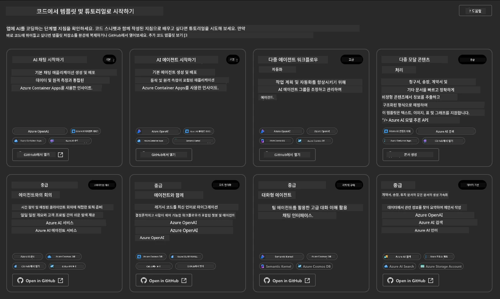

**기본** 옵션은 스타터 템플릿입니다:

1. [ ] [AI Chat 시작하기](https://github.com/Azure-Samples/get-started-with-ai-chat)는 기본 채팅 애플리케이션을 _사용자 데이터_와 함께 Azure Container Apps에 배포합니다. 기본 AI 챗봇 시나리오를 탐색하는 데 사용하세요.
1. [X] [AI 에이전트 시작하기](https://github.com/Azure-Samples/get-started-with-ai-agents)는 표준 AI 에이전트(Azure AI Agent Service 포함)를 배포합니다. 도구와 모델을 포함하는 에이전트 기반 AI 솔루션을 익히는 데 사용하세요.

두 번째 링크를 새 브라우저 탭에서 열거나 관련 카드의 `GitHub에서 열기`를 클릭하세요. AZD 템플릿의 저장소를 확인할 수 있습니다. README를 잠시 살펴보세요. 애플리케이션 아키텍처는 다음과 같습니다:

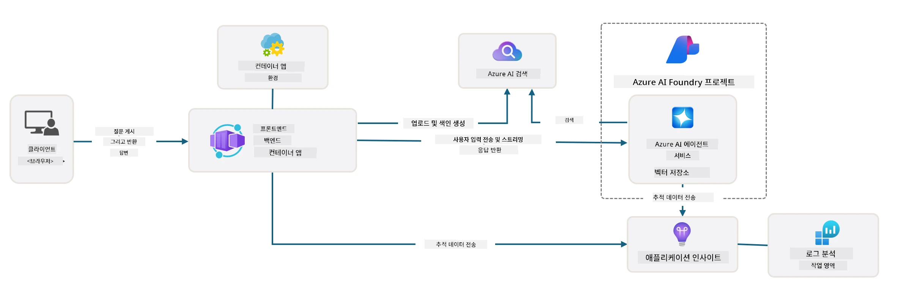

---

## 3. 템플릿 활성화

이 템플릿을 배포하고 유효성을 확인해 봅시다. [시작하기](https://github.com/Azure-Samples/get-started-with-ai-agents?tab=readme-ov-file#getting-started) 섹션의 지침을 따르겠습니다.

1. [이 링크](https://github.com/codespaces/new/Azure-Samples/get-started-with-ai-agents)를 클릭하세요 - 기본 작업을 `Create codespace`로 확인하세요.
1. 새 브라우저 탭이 열립니다 - GitHub Codespaces 세션이 로드될 때까지 기다리세요.
1. Codespaces에서 VS Code 터미널을 열고 다음 명령을 입력하세요:

   ```bash title="" linenums="0"
   azd up
   ```

이 명령으로 트리거되는 워크플로 단계를 완료하세요:

1. Azure에 로그인하라는 메시지가 표시됩니다 - 인증 지침을 따르세요.
1. 고유한 환경 이름을 입력하세요 - 예: 저는 `nitya-mshack-azd`를 사용했습니다.
1. `.azure/` 폴더가 생성됩니다 - 환경 이름이 포함된 하위 폴더를 확인할 수 있습니다.
1. 구독 이름을 선택하라는 메시지가 표시됩니다 - 기본값을 선택하세요.
1. 위치를 선택하라는 메시지가 표시됩니다 - `East US 2`를 사용하세요.

이제 프로비저닝이 완료될 때까지 기다리세요. **이 과정은 10-15분 정도 소요됩니다**

1. 완료되면 콘솔에 다음과 같은 성공 메시지가 표시됩니다:
      ```bash title="" linenums="0"
      SUCCESS: Your up workflow to provision and deploy to Azure completed in 10 minutes 17 seconds.
      ```
1. Azure 포털에 환경 이름으로 프로비저닝된 리소스 그룹이 생성됩니다:

      

1. **이제 배포된 인프라와 애플리케이션을 검증할 준비가 되었습니다**.

---

## 4. 템플릿 검증

1. Azure 포털 [리소스 그룹](https://portal.azure.com/#browse/resourcegroups) 페이지를 방문하세요 - 로그인하라는 메시지가 표시되면 로그인하세요.
1. 환경 이름에 해당하는 RG를 클릭하세요 - 위와 같은 페이지를 확인할 수 있습니다.

      - Azure Container Apps 리소스를 클릭하세요.
      - _Essentials_ 섹션(오른쪽 상단)의 애플리케이션 URL을 클릭하세요.

1. 다음과 같은 호스팅된 애플리케이션 프론트엔드 UI를 확인할 수 있습니다:

   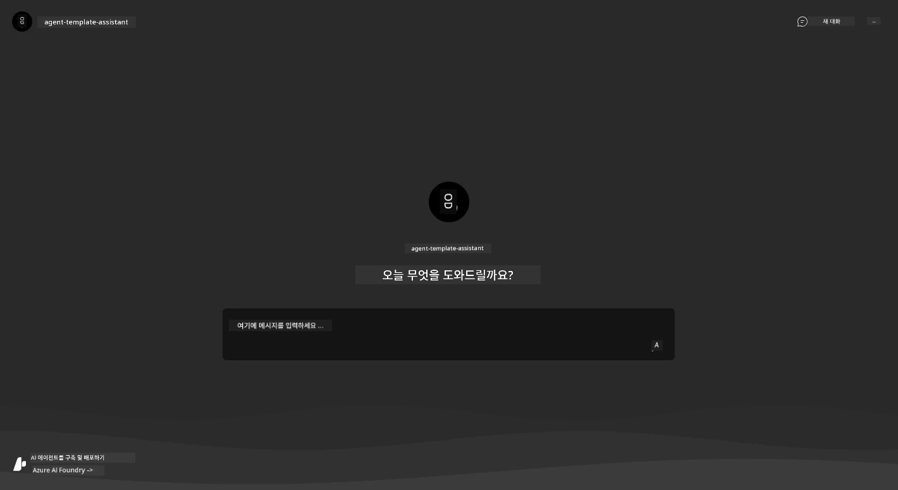

1. 몇 가지 [샘플 질문](https://github.com/Azure-Samples/get-started-with-ai-agents/blob/main/docs/sample_questions.md)을 시도해 보세요.

      1. 질문: ```프랑스의 수도는 어디인가요?``` 
      1. 질문: ```200달러 이하로 두 사람이 사용할 수 있는 최고의 텐트는 무엇이며, 어떤 기능이 포함되어 있나요?```

1. 아래와 유사한 답변을 받을 수 있습니다. _그런데 이게 어떻게 작동할까요?_ 

      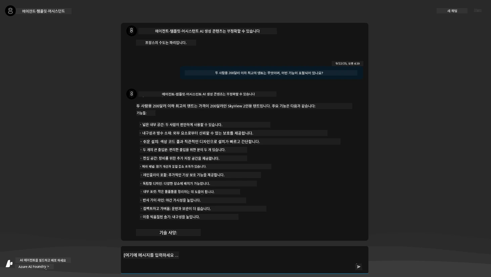

---

## 5. 에이전트 검증

Azure Container App은 이 템플릿에 대해 Azure AI Foundry 프로젝트에서 프로비저닝된 AI 에이전트와 연결되는 엔드포인트를 배포합니다. 이것이 무엇을 의미하는지 살펴봅시다.

1. Azure 포털의 리소스 그룹 _개요_ 페이지로 돌아가세요.

1. 목록에서 `Azure AI Foundry` 리소스를 클릭하세요.

1. 다음 화면이 나타납니다. `Azure AI Foundry 포털로 이동` 버튼을 클릭하세요. 
   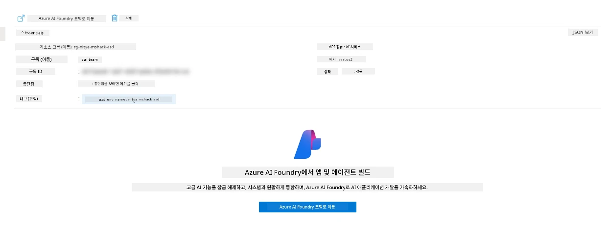

1. AI 애플리케이션에 대한 Foundry 프로젝트 페이지를 확인할 수 있습니다.
   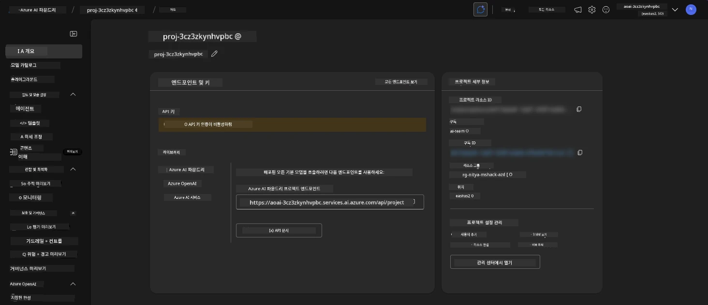

1. `에이전트`를 클릭하세요 - 프로젝트에 프로비저닝된 기본 에이전트를 확인할 수 있습니다.
   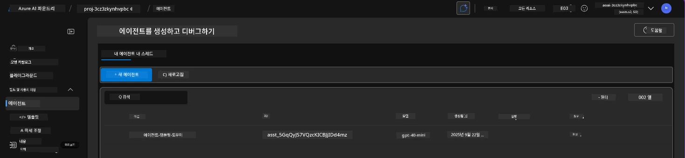

1. 선택하면 에이전트 세부 정보를 확인할 수 있습니다. 다음을 주목하세요:

      - 에이전트는 기본적으로 파일 검색을 사용합니다(항상).
      - 에이전트 `Knowledge`는 32개의 파일이 업로드되었음을 나타냅니다(파일 검색용).
      

1. 왼쪽 메뉴에서 `Data+indexes` 옵션을 찾아 클릭하여 세부 정보를 확인하세요.

      - 업로드된 32개의 데이터 파일을 확인할 수 있습니다.
      - 이는 `src/files` 아래의 12개의 고객 파일과 20개의 제품 파일에 해당합니다.
      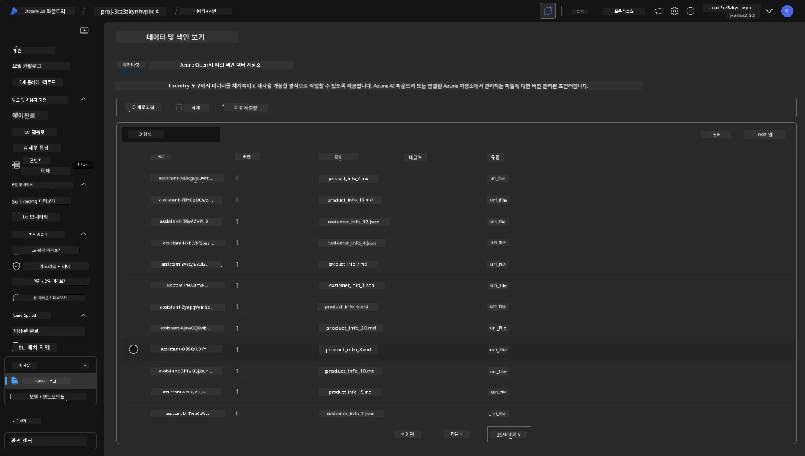

**에이전트 작동을 검증했습니다!**

1. 에이전트 응답은 해당 파일에 있는 지식에 기반합니다.
1. 이제 해당 데이터와 관련된 질문을 하고, 기반이 되는 응답을 받을 수 있습니다.
1. 예: `customer_info_10.json`은 "Amanda Perez"가 구매한 3개의 제품을 설명합니다.

Container App 엔드포인트가 있는 브라우저 탭으로 돌아가서 다음을 질문하세요: `Amanda Perez가 소유한 제품은 무엇인가요?`. 다음과 같은 결과를 확인할 수 있습니다:

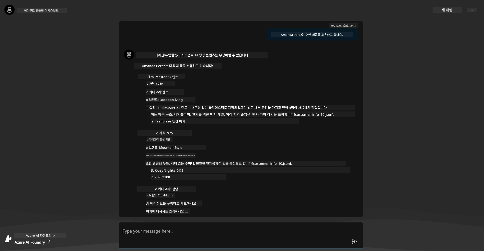

---

## 6. 에이전트 플레이그라운드

Azure AI Foundry의 기능에 대한 직관을 더 키우기 위해 에이전트를 에이전트 플레이그라운드에서 테스트해 봅시다.

1. Azure AI Foundry의 `에이전트` 페이지로 돌아가 기본 에이전트를 선택하세요.
1. `플레이그라운드에서 시도하기` 옵션을 클릭하세요 - 다음과 같은 플레이그라운드 UI를 확인할 수 있습니다.
1. 동일한 질문을 해보세요: `Amanda Perez가 소유한 제품은 무엇인가요?`

    

동일하거나 유사한 응답을 받을 수 있습니다 - 하지만 응답의 품질, 비용, 성능을 이해하는 데 사용할 수 있는 추가 정보를 확인할 수 있습니다. 예를 들어:

1. 응답이 "기반"이 되는 데이터 파일을 인용하는 것을 확인할 수 있습니다.
1. 이러한 파일 레이블 위에 마우스를 올려보세요 - 데이터가 질문 및 표시된 응답과 일치하나요?

또한 응답 아래에 _통계_ 행이 표시됩니다.

1. 특정 메트릭 위에 마우스를 올려보세요 - 예: 안전성. 다음과 같은 화면을 확인할 수 있습니다.
1. 평가된 등급이 응답의 안전성 수준에 대한 직관과 일치하나요?

      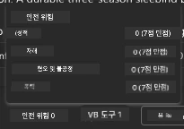

---x

## 7. 내장된 관찰 가능성

관찰 가능성은 애플리케이션을 계측하여 애플리케이션의 작동을 이해하고, 디버그하며, 최적화하는 데 사용할 수 있는 데이터를 생성하는 것입니다. 이를 이해하기 위해:

1. `실행 정보 보기` 버튼을 클릭하세요 - 다음 화면을 확인할 수 있습니다. 이는 [에이전트 추적](https://learn.microsoft.com/en-us/azure/ai-foundry/how-to/develop/trace-agents-sdk#view-trace-results-in-the-azure-ai-foundry-agents-playground)의 예입니다. _상단 메뉴의 Thread Logs를 클릭하여 이 화면을 확인할 수도 있습니다._

   - 에이전트가 수행한 실행 단계와 사용된 도구를 확인하세요.
   - 응답에 사용된 총 토큰 수(출력 토큰 사용량 대비)를 이해하세요.
   - 실행 중 소요된 시간과 지연 시간을 이해하세요.

      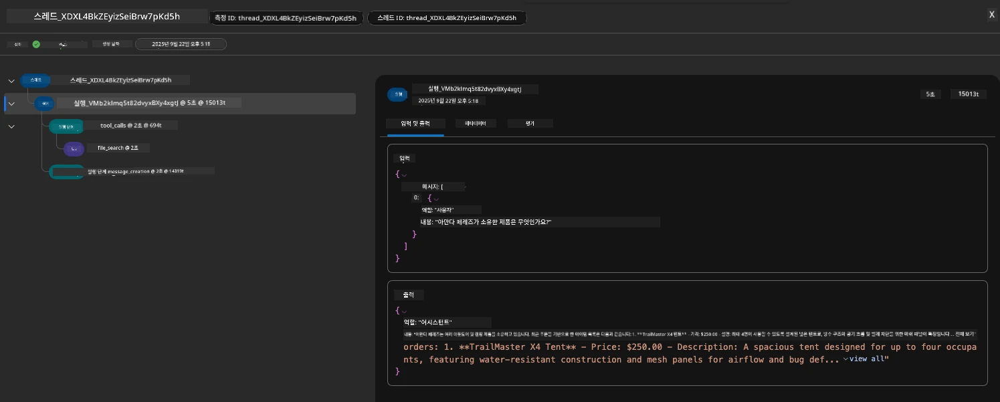

1. `메타데이터` 탭을 클릭하여 실행에 대한 추가 속성을 확인하세요. 이는 나중에 문제를 디버깅하는 데 유용한 컨텍스트를 제공할 수 있습니다.   

      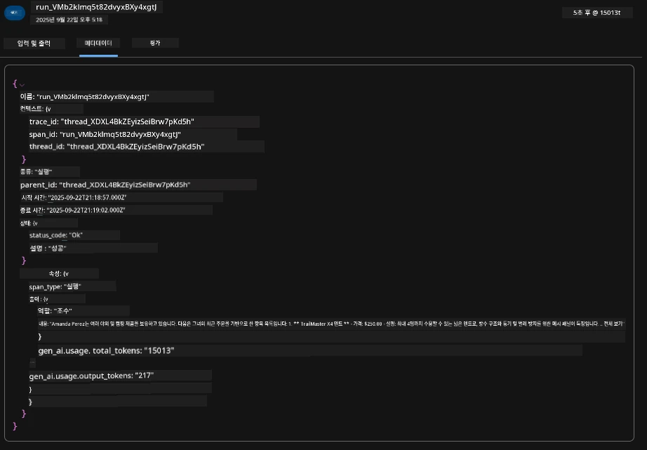

1. `평가` 탭을 클릭하여 에이전트 응답에 대한 자동 평가를 확인하세요. 여기에는 안전성 평가(예: 자해) 및 에이전트별 평가(예: 의도 해결, 작업 준수)가 포함됩니다.

      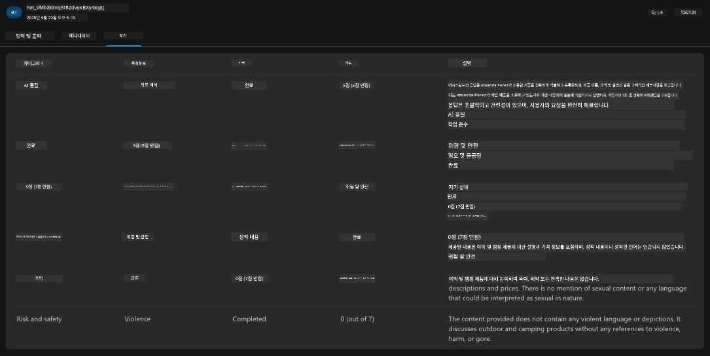

1. 마지막으로, 사이드바 메뉴에서 `모니터링` 탭을 클릭하세요.

      - 표시된 페이지에서 `리소스 사용량` 탭을 선택하고 메트릭을 확인하세요.
      - 비용(토큰) 및 부하(요청) 측면에서 애플리케이션 사용량을 추적하세요.
      - 첫 번째 바이트(입력 처리)와 마지막 바이트(출력)까지의 애플리케이션 지연 시간을 추적하세요.

      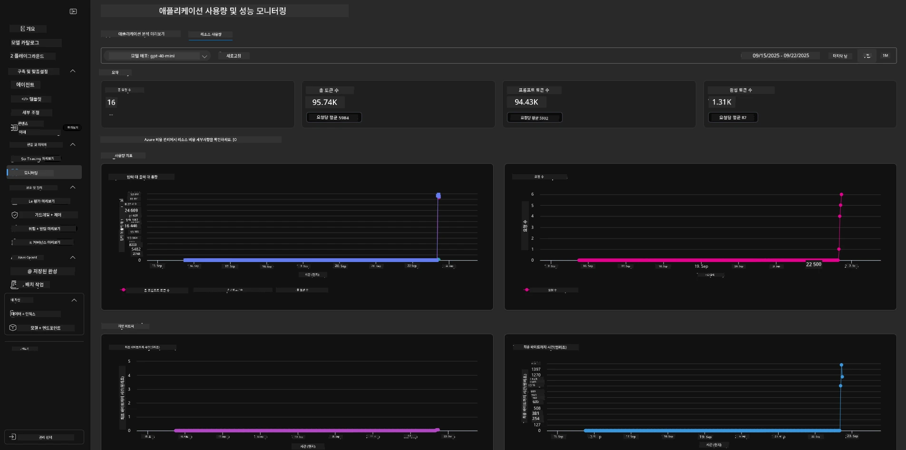

---

## 8. 환경 변수

지금까지 브라우저에서 배포를 진행하며 인프라가 프로비저닝되고 애플리케이션이 작동하는 것을 확인했습니다. 하지만 애플리케이션을 _코드 중심_으로 작업하려면 이러한 리소스와 관련된 변수를 설정하여 로컬 개발 환경을 구성해야 합니다. `azd`를 사용하면 이를 쉽게 수행할 수 있습니다.

1. Azure Developer CLI는 [환경 변수](https://learn.microsoft.com/en-us/azure/developer/azure-developer-cli/manage-environment-variables?tabs=bash)를 사용하여 애플리케이션 배포를 위한 구성 설정을 저장하고 관리합니다.

1. 환경 변수는 `.azure/<env-name>/.env`에 저장됩니다 - 이는 배포 중 사용된 `env-name` 환경에 범위를 지정하며 동일한 저장소에서 다른 배포 대상 간에 환경을 분리하는 데 도움이 됩니다.

1. 환경 변수는 특정 명령(예: `azd up`)을 실행할 때마다 `azd` 명령에 의해 자동으로 로드됩니다. `azd`는 _OS 수준_ 환경 변수(예: 셸에 설정된 변수)를 자동으로 읽지 않으므로, 스크립트 내에서 정보를 전달하려면 `azd set env` 및 `azd get env`를 사용하세요.

몇 가지 명령을 시도해 봅시다:

1. 이 환경에서 `azd`에 설정된 모든 환경 변수를 가져옵니다:

      ```bash title="" linenums="0"
      azd env get-values
      ```
      
      다음과 같은 결과를 확인할 수 있습니다:

      ```bash title="" linenums="0"
      AZURE_AI_AGENT_DEPLOYMENT_NAME="gpt-4o-mini"
      AZURE_AI_AGENT_NAME="agent-template-assistant"
      AZURE_AI_EMBED_DEPLOYMENT_NAME="text-embedding-3-small"
      AZURE_AI_EMBED_DIMENSIONS=100
      ...
      ```

1. 특정 값을 가져옵니다 - 예: `AZURE_AI_AGENT_MODEL_NAME` 값이 설정되었는지 확인하고 싶습니다.

      ```bash title="" linenums="0"
      azd env get-value AZURE_AI_AGENT_MODEL_NAME 
      ```
      
      다음과 같은 결과를 확인할 수 있습니다 - 기본적으로 설정되지 않았습니다!

      ```bash title="" linenums="0"
      ERROR: key 'AZURE_AI_AGENT_MODEL_NAME' not found in the environment values
      ```

1. `azd`에 대한 새 환경 변수를 설정합니다. 여기서는 에이전트 모델 이름을 업데이트합니다. _참고: 변경 사항은 즉시 `.azure/<env-name>/.env` 파일에 반영됩니다._

      ```bash title="" linenums="0"
      azd env set AZURE_AI_AGENT_MODEL_NAME gpt-4.1
      azd env set AZURE_AI_AGENT_MODEL_VERSION 2025-04-14
      azd env set AZURE_AI_AGENT_DEPLOYMENT_CAPACITY 150
      ```

      이제 값이 설정되었음을 확인할 수 있습니다:

      ```bash title="" linenums="0"
      azd env get-value AZURE_AI_AGENT_MODEL_NAME 
      ```

1. 일부 리소스는 지속적(예: 모델 배포)이므로 단순히 `azd up`만으로는 재배포를 강제할 수 없습니다. 원래 배포를 제거하고 변경된 환경 변수로 다시 배포해 봅시다.

1. **새로고침** 이전에 azd 템플릿을 사용하여 인프라를 배포한 경우, 다음 명령을 사용하여 Azure 배포의 현재 상태를 기반으로 로컬 환경 변수 상태를 _새로고침_할 수 있습니다:
      ```bash title="" linenums="0"
      azd env refresh
      ```

      이는 두 개 이상의 로컬 개발 환경(예: 여러 개발자로 구성된 팀) 간에 환경 변수를 _동기화_하는 강력한 방법입니다. 배포된 인프라가 환경 변수 상태에 대한 기준점 역할을 하도록 하며, 팀원들은 단순히 변수를 _새로고침_하여 동기화를 유지할 수 있습니다.

---

## 9. 축하합니다 🏆

여러분은 다음을 완료하며 처음부터 끝까지의 워크플로를 성공적으로 마쳤습니다:

- [X] 사용하고자 하는 AZD 템플릿 선택
- [X] GitHub Codespaces를 사용하여 템플릿 실행
- [X] 템플릿 배포 및 작동 여부 확인

---

