# 2. 템플릿 검증하기

!!! tip "이 모듈을 완료하면 할 수 있게 됩니다"

    - [ ] AI 솔루션 아키텍처 분석하기
    - [ ] AZD 배포 워크플로우 이해하기
    - [ ] AZD 사용법에 대해 GitHub Copilot 도움 받기
    - [ ] **랩 2:** AI 에이전트 템플릿 배포 및 검증하기

---


## 1. 소개

[Azure Developer CLI](https://learn.microsoft.com/en-us/azure/developer/azure-developer-cli/) 또는 `azd`는 Azure에 애플리케이션을 빌드하고 배포할 때 개발자 워크플로우를 간소화하는 오픈 소스 명령줄 도구입니다.

[AZD 템플릿](https://learn.microsoft.com/azure/developer/azure-developer-cli/azd-templates)은 샘플 애플리케이션 코드, _인프라 코드로서의 인프라(infrastructure-as-code)_ 자산, `azd` 구성 파일을 포함하여 일관된 솔루션 아키텍처를 제공하는 표준화된 저장소입니다. 인프라 프로비저닝은 `azd provision` 명령어 한 번으로 간단히 처리할 수 있으며, `azd up`을 사용하면 인프라를 프로비저닝함과 동시에 애플리케이션까지 한 번에 배포할 수 있습니다!

결과적으로, 애플리케이션 개발을 빠르게 시작하려면, 애플리케이션과 인프라 요구에 가장 잘 맞는 _AZD 스타터 템플릿_을 찾아 저장소를 시나리오 요구사항에 맞게 커스터마이징하기만 하면 됩니다.

시작하기 전에, Azure Developer CLI가 설치되어 있는지 확인해 보겠습니다.

1. VS Code 터미널을 열고 다음 명령어를 입력합니다:

      ```bash title="" linenums="0"
      azd version
      ```

1. 다음과 같은 출력이 나타날 것입니다!

      ```bash title="" linenums="0"
      azd version 1.19.0 (commit b3d68cea969b2bfbaa7b7fa289424428edb93e97)
      ```

**이제 azd로 템플릿을 선택해 배포할 준비가 되었습니다**

---

## 2. 템플릿 선택

Microsoft Foundry 플랫폼에는 _다중 에이전트 워크플로우 자동화_, _다중 모달 콘텐츠 처리_ 같은 인기 있는 솔루션 시나리오를 다루는 [추천 AZD 템플릿 세트](https://learn.microsoft.com/en-us/azure/ai-foundry/how-to/develop/ai-template-get-started)가 포함되어 있습니다. Microsoft Foundry 포털을 방문하여도 이 템플릿들을 발견할 수 있습니다.

1. [https://ai.azure.com/templates](https://ai.azure.com/templates) 방문
1. 로그인 요청 시 Microsoft Foundry 포털에 로그인 - 다음과 같은 화면이 나타납니다.

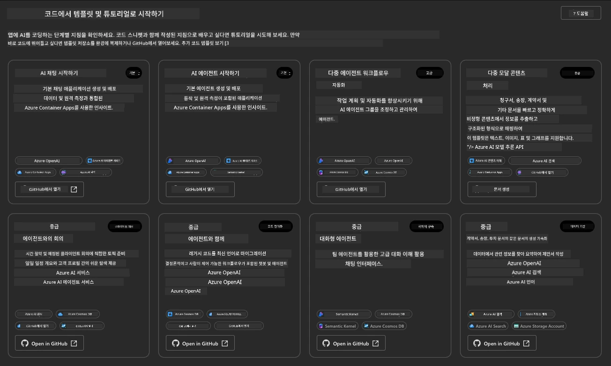


**Basic** 옵션이 스타터 템플릿입니다:

1. [ ] [AI 챗 시작하기](https://github.com/Azure-Samples/get-started-with-ai-chat) 템플릿으로, Azure Container Apps에 기본 채팅 애플리케이션을 _데이터와 함께_ 배포합니다. 기본 AI 챗봇 시나리오를 탐험할 때 사용하세요.
1. [X] [AI 에이전트 시작하기](https://github.com/Azure-Samples/get-started-with-ai-agents) 템플릿으로, Microsoft Foundry 에이전트를 포함하는 표준 AI 에이전트를 배포합니다. 도구와 모델을 활용한 에이전틱 AI 솔루션에 익숙해지는 데 사용합니다.

두 번째 링크를 새 브라우저 탭에서 열거나 관련 카드에서 `Open in GitHub`을 클릭하세요. 이 AZD 템플릿 저장소가 표시됩니다. README를 잠시 살펴보세요. 애플리케이션 아키텍처는 다음과 같습니다:

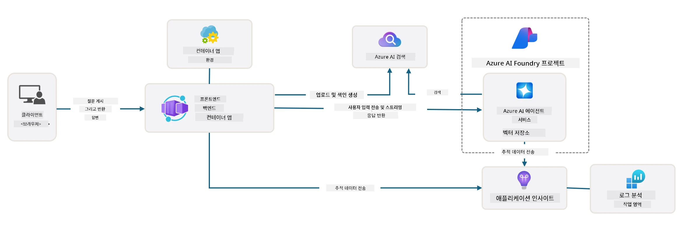

---

## 3. 템플릿 활성화

이 템플릿을 배포해 보고 유효한지 확인해 봅시다. [Getting Started](https://github.com/Azure-Samples/get-started-with-ai-agents?tab=readme-ov-file#getting-started) 섹션에 있는 가이드라인을 따릅니다.

1. [이 링크](https://github.com/codespaces/new/Azure-Samples/get-started-with-ai-agents)를 클릭하고 기본 동작으로 `Create codespace`를 확인하세요.
1. 새 브라우저 탭이 열리고 GitHub Codespaces 세션 로드가 완료될 때까지 기다립니다.
1. Codespaces 안에서 VS Code 터미널을 열고 다음 명령어를 입력하세요:

   ```bash title="" linenums="0"
   azd up
   ```

이 명령어가 트리거하는 워크플로우 단계를 완료하세요:

1. Azure 로그인을 요청받으면 지시에 따라 인증을 진행합니다.
1. 환경 이름을 고유하게 입력하세요 - 예: `nitya-mshack-azd`를 사용했습니다.
1. `.azure/` 폴더가 생성되며 환경 이름으로 된 하위 폴더가 만들어집니다.
1. 구독 이름을 선택하라는 요청이 나오면 기본값을 선택하세요.
1. 위치를 요청하면 `East US 2`를 사용하세요.

이제 프로비저닝 완료를 기다립니다. **약 10-15분이 소요됩니다**

1. 완료되면 콘솔에 다음과 같은 성공 메시지가 나타납니다:
      ```bash title="" linenums="0"
      SUCCESS: Your up workflow to provision and deploy to Azure completed in 10 minutes 17 seconds.
      ```

1. Azure Portal에서 해당 환경 이름으로 프로비저닝된 리소스 그룹을 확인할 수 있습니다:

      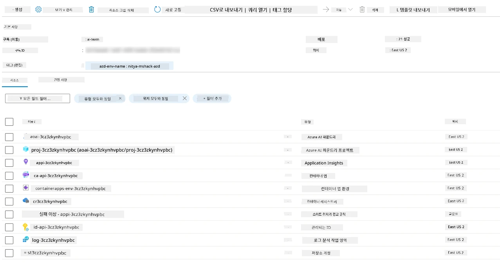

1. **이제 배포된 인프라와 애플리케이션을 검증할 준비가 되었습니다**.

---

## 4. 템플릿 검증

1. Azure Portal [리소스 그룹](https://portal.azure.com/#browse/resourcegroups) 페이지를 방문하고 로그인합니다.
1. 환경 이름에 해당하는 RG를 클릭하면 위 화면이 보입니다.

      - Azure Container Apps 리소스를 클릭하세요
      - _Essentials_ 섹션(우측 상단)의 Application Url을 클릭하세요

1. 다음과 같은 호스팅 애플리케이션 프런트엔드 UI가 보일 것입니다:

   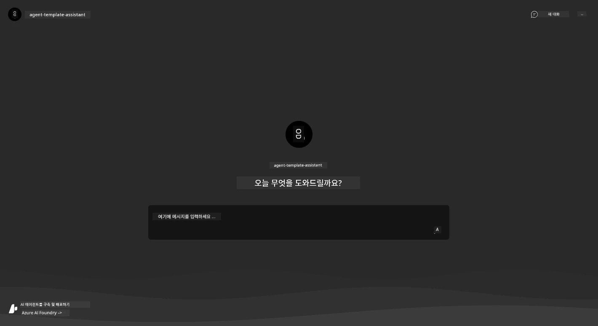

1. 몇 가지 [샘플 질문](https://github.com/Azure-Samples/get-started-with-ai-agents/blob/main/docs/sample_questions.md)을 해보세요.

      1. 질문: ```프랑스의 수도가 무엇인가요?```
      1. 질문: ```두 명이 사용할 수 있는 200달러 이하의 최고의 텐트는 무엇이며, 어떤 기능이 있나요?```

1. 다음과 유사한 답변을 받게 됩니다. _하지만 어떻게 작동할까요?_

      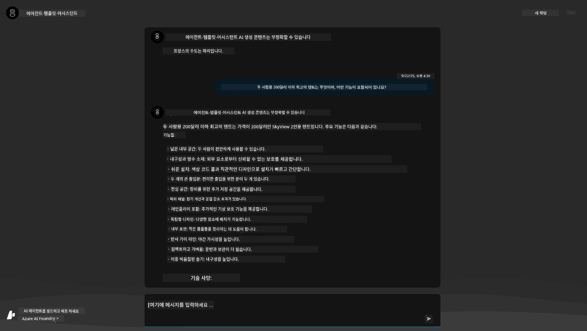

---

## 5. 에이전트 검증

Azure Container App은 이 템플릿을 위해 Microsoft Foundry 프로젝트에 프로비저닝된 AI 에이전트에 연결된 엔드포인트를 배포합니다. 이것이 의미하는 바를 살펴봅시다.

1. Azure Portal에서 리소스 그룹의 _개요_ 페이지로 돌아갑니다.

1. 해당 목록에서 `Microsoft Foundry` 리소스를 클릭하세요.

1. 다음 화면이 나타납니다. `Go to Microsoft Foundry Portal` 버튼을 클릭하세요.
   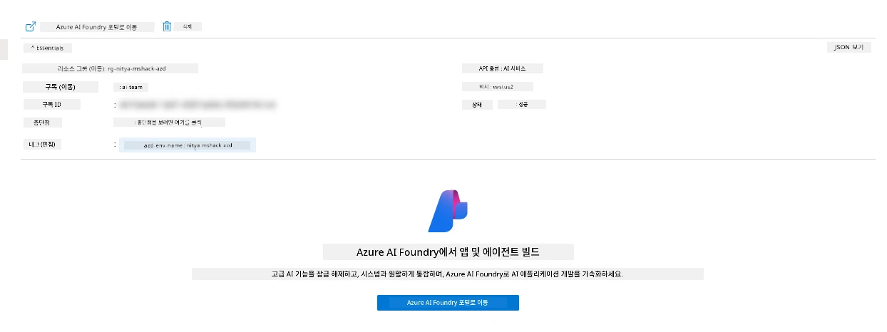

1. AI 애플리케이션에 대한 Foundry 프로젝트 페이지가 보입니다.
   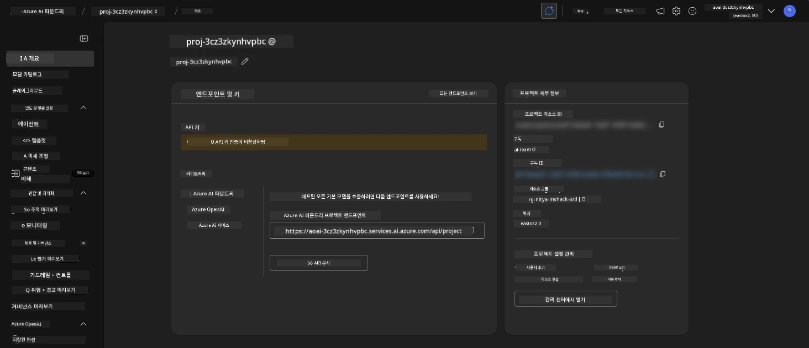

1. `Agents`를 클릭하면 프로젝트에 프로비저닝된 기본 에이전트가 보입니다.
   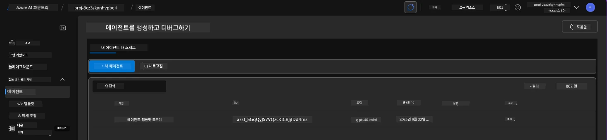

1. 선택하면 에이전트 세부 정보가 나타납니다. 다음을 확인하세요:

      - 에이전트는 기본으로 항상 파일 검색을 사용합니다.
      - 에이전트 `Knowledge` 항목에는 업로드된 32개의 파일이 표시됩니다 (파일 검색용).
      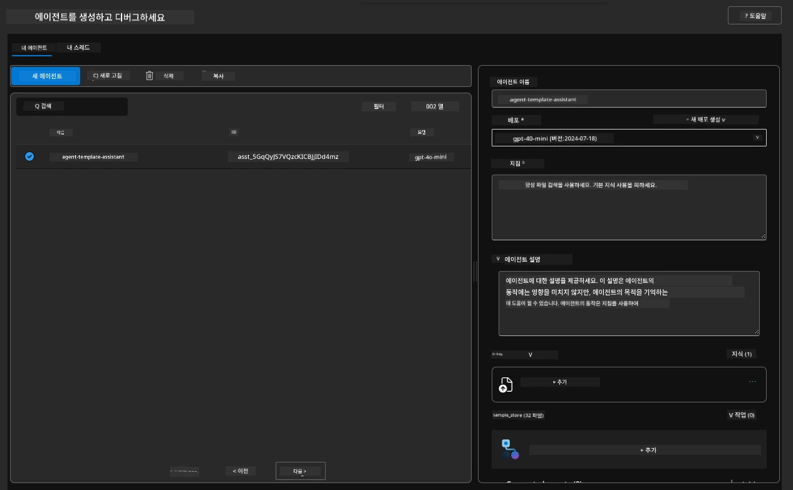

1. 왼쪽 메뉴에서 `Data+indexes` 옵션을 클릭하여 상세 정보를 확인하세요.

      - 업로드된 32개의 데이터 파일이 보일 것입니다.
      - 이들 파일은 `src/files` 아래 12개의 고객 파일과 20개의 제품 파일과 일치합니다.
      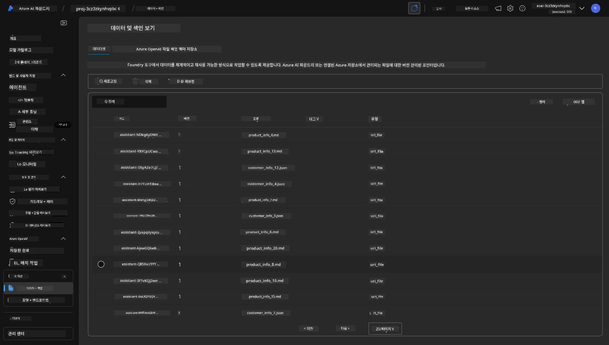

**에이전트 동작을 검증했습니다!**

1. 에이전트 답변은 해당 파일에 담긴 지식을 기반으로 합니다.
1. 이제 그 데이터와 관련된 질문을 할 수 있고, 근거 있는 답변을 받을 수 있습니다.
1. 예: `customer_info_10.json`은 "Amanda Perez"가 한 3건의 구매를 설명합니다.

Container App 엔드포인트가 있는 브라우저 탭에서 `Amanda Perez가 소유한 제품은 무엇인가요?`라고 물어보세요. 다음과 비슷한 내용을 볼 수 있습니다:

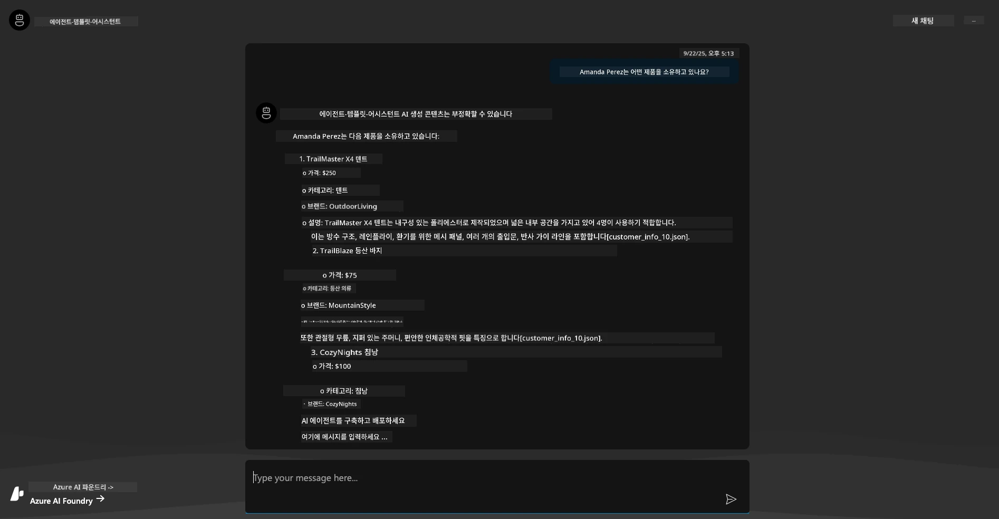

---

## 6. 에이전트 플레이그라운드

Microsoft Foundry의 기능에 대해 좀 더 직관적으로 이해하기 위해, 에이전트를 에이전트 플레이그라운드에서 시험해 봅시다.

1. Microsoft Foundry에서 `Agents` 페이지로 돌아가 기본 에이전트를 선택하세요.
1. `Try in Playground` 옵션을 클릭하면 다음과 같은 플레이그라운드 UI를 볼 수 있습니다.
1. 동일한 질문을 하세요: `Amanda Perez가 소유한 제품은 무엇인가요?`

    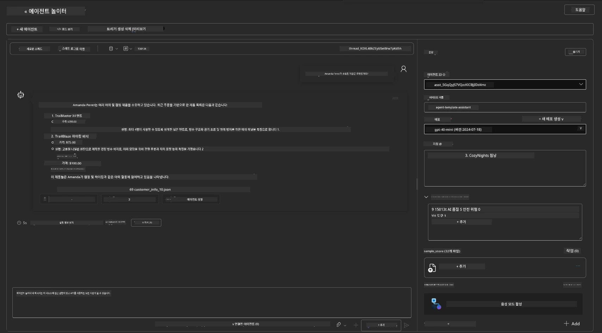

동일하거나 유사한 답변을 받게 되지만, 에이전틱 앱의 품질, 비용, 성능을 이해하는 데 도움이 되는 추가 정보도 볼 수 있습니다. 예를 들어:

1. 응답에 "근거"로 사용된 데이터 파일을 참고한 것을 확인하세요.
1. 파일 레이블 위에 마우스를 올리면 데이터가 질문과 표시된 응답에 부합하는지 확인할 수 있습니다.

응답 아래에 _통계_ 행도 보입니다.

1. 안전성(Safety)와 같은 지표 위에 마우스를 올려보세요. 다음과 같은 정보가 나타납니다.
1. 평가 점수가 응답 안전성 수준에 대한 직관과 일치하는지 확인하세요.

      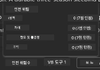

---

## 7. 내장된 관측 가능성(Observability)

관측 가능성은 애플리케이션에 데이터를 생성하도록 도구를 설치하여 운영을 이해, 디버그 및 최적화하는 데 사용하는 개념입니다. 이를 체험해 보겠습니다:

1. `View Run Info` 버튼을 클릭하면 다음 화면이 보입니다. 이것은 [에이전트 추적](https://learn.microsoft.com/en-us/azure/ai-foundry/how-to/develop/trace-agents-sdk#view-trace-results-in-the-azure-ai-foundry-agents-playground)의 예시입니다. _최상위 메뉴에서 Thread Logs를 클릭해도 같은 화면을 볼 수 있습니다_.

   - 에이전트가 수행한 실행 단계 및 사용 도구를 파악
   - 응답에 사용된 전체 토큰 수(출력 토큰 사용량 대비) 이해
   - 지연 시간과 실행 중 시간이 소요된 부분 이해

      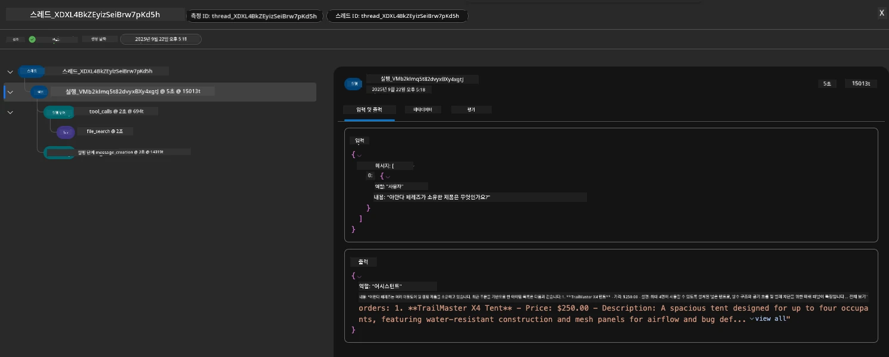

1. `Metadata` 탭을 클릭하면 실행과 관련된 추가 속성을 확인할 수 있으며, 이는 문제 디버깅에 유용한 문맥을 제공합니다.

      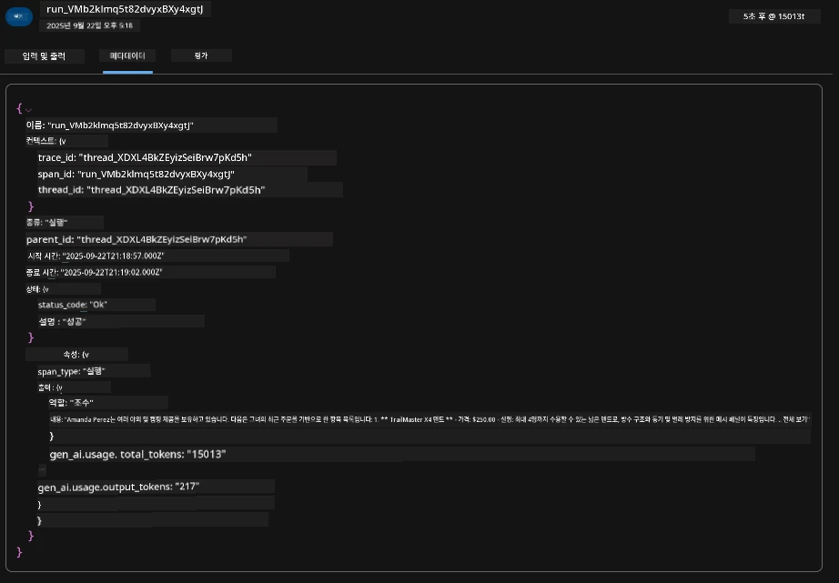


1. `Evaluations` 탭을 클릭하면 에이전트 응답에 대한 자동 평가 결과를 볼 수 있습니다. 여기에는 안전성 평가(예: 자기 피해 가능성)와 에이전트 특정 평가(예: 의도 해결, 작업 준수)가 포함됩니다.

      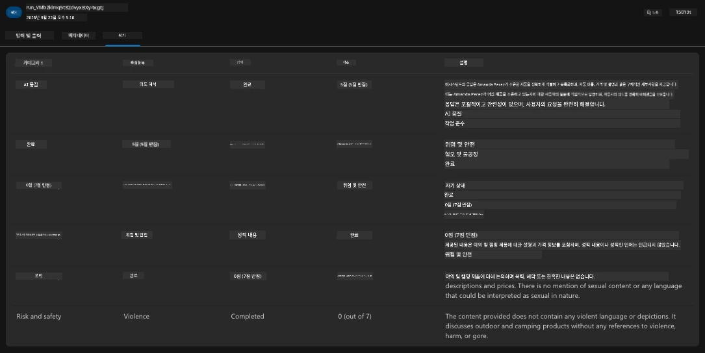

1. 마지막으로 사이드바 메뉴에서 `Monitoring` 탭을 클릭하세요.

      - 표시되는 페이지의 `Resource usage` 탭을 선택하여 메트릭을 확인하세요.
      - 비용(토큰)과 부하(요청) 측면에서 애플리케이션 사용량을 추적합니다.
      - 첫 바이트(입력 처리)와 마지막 바이트(출력)까지의 지연 시간도 추적합니다.

      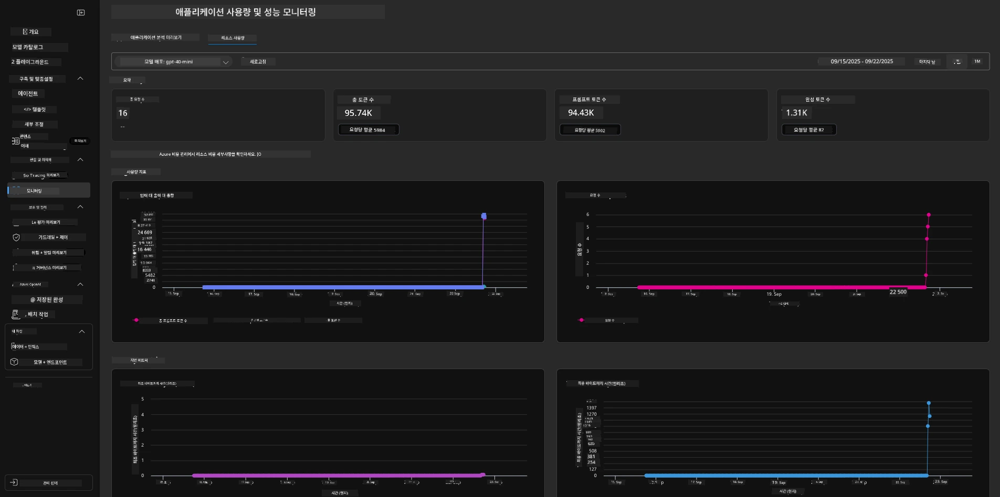

---

## 8. 환경 변수

지금까지 브라우저에서 배포 과정을 살펴보고 인프라 프로비저닝 및 애플리케이션 운영이 확인됐습니다. 코드를 기반으로 작업하려면, 이러한 리소스를 사용하기 위한 환경 변수를 로컬 개발 환경에 구성해야 합니다. `azd`를 사용하면 쉽습니다.

1. Azure Developer CLI는 애플리케이션 배포 구성을 저장 및 관리하기 위해 [환경 변수를 사용합니다](https://learn.microsoft.com/en-us/azure/developer/azure-developer-cli/manage-environment-variables?tabs=bash).

1. 환경 변수는 `.azure/<env-name>/.env`에 저장되어 배포 시 사용한 `env-name` 환경으로 범위가 제한되며, 동일 저장소 내 여러 배포 대상 환경을 격리하는 데 도움을 줍니다.

1. 환경 변수는 `azd` 명령어가 특정 명령(e.g., `azd up`)을 실행할 때 자동으로 로드됩니다. `azd`는 OS 수준 환경 변수(예: 셸에서 설정한 변수)를 자동으로 읽지 않으므로, 스크립트 내에서는 `azd set env`와 `azd get env`를 사용해 정보를 전달해야 합니다.

몇 가지 명령을 실행해 봅시다:

1. 이 환경에서 `azd`에 설정된 모든 환경 변수를 가져오기:

      ```bash title="" linenums="0"
      azd env get-values
      ```
      
      다음과 유사한 결과가 보입니다:

      ```bash title="" linenums="0"
      AZURE_AI_AGENT_DEPLOYMENT_NAME="gpt-4.1-mini"
      AZURE_AI_AGENT_NAME="agent-template-assistant"
      AZURE_AI_EMBED_DEPLOYMENT_NAME="text-embedding-3-small"
      AZURE_AI_EMBED_DIMENSIONS=100
      ...
      ```

1. 특정 값 가져오기 - 예: `AZURE_AI_AGENT_MODEL_NAME`이 설정되었는지 확인합니다:

      ```bash title="" linenums="0"
      azd env get-value AZURE_AI_AGENT_MODEL_NAME 
      ```
      
      다음과 같은 결과를 볼 수 있습니다 - 기본값으로는 설정되어 있지 않습니다!

      ```bash title="" linenums="0"
      ERROR: key 'AZURE_AI_AGENT_MODEL_NAME' not found in the environment values
      ```

1. `azd`에 새 환경 변수 설정하기. 여기서는 에이전트 모델 이름을 업데이트합니다. _참고: 변경 사항은 즉시 `.azure/<env-name>/.env` 파일에 반영됩니다._

      ```bash title="" linenums="0"
      azd env set AZURE_AI_AGENT_MODEL_NAME gpt-4.1
      azd env set AZURE_AI_AGENT_MODEL_VERSION 2025-04-14
      azd env set AZURE_AI_AGENT_DEPLOYMENT_CAPACITY 150
      ```

      이제 값이 설정된 것을 확인할 수 있습니다:

      ```bash title="" linenums="0"
      azd env get-value AZURE_AI_AGENT_MODEL_NAME 
      ```

1. 일부 리소스(예: 모델 배포)는 영속적이므로, `azd up` 명령만으로 재배포가 강제되지 않습니다. 원래 배포를 해제한 후 변경된 환경 변수로 재배포해 봅시다.

1. **새로 고침(Refresh)** 이전에 azd 템플릿으로 인프라를 배포한 경우, 현재 Azure 배포 상태를 기반으로 로컬 환경 변수 상태를 _새로 고침_할 수 있습니다. 다음 명령어를 사용하세요:

      ```bash title="" linenums="0"
      azd env refresh
      ```

이것은 두 개 이상의 로컬 개발 환경(예: 여러 개발자가 있는 팀)에서 환경 변수를 _동기화_하는 강력한 방법입니다. 배포된 인프라가 환경 변수 상태에 대한 기준 진실로 작용하게 됩니다. 팀원들은 단순히 변수를 _새로 고침_하여 다시 동기화 상태로 돌아갈 수 있습니다.

---

## 9. 축하합니다 🏆

다음 작업을 수행하는 엔드 투 엔드 워크플로를 완료했습니다:

- [X] 사용하려는 AZD 템플릿 선택
- [X] GitHub Codespaces로 템플릿 시작
- [X] 템플릿을 배포하고 작동 여부 검증 완료

---

<!-- CO-OP TRANSLATOR DISCLAIMER START -->
**면책 조항**:  
이 문서는 AI 번역 서비스 [Co-op Translator](https://github.com/Azure/co-op-translator)를 사용하여 번역되었습니다. 정확성을 위해 노력하고 있으나, 자동 번역에는 오류나 부정확성이 포함될 수 있음을 유의해 주시기 바랍니다. 원문 문서는 원어로 된 권위 있는 출처로 간주되어야 합니다. 중요한 정보의 경우 전문적인 인간 번역을 권장합니다. 본 번역 사용으로 인한 오해나 잘못된 해석에 대해 당사는 책임을 지지 않습니다.
<!-- CO-OP TRANSLATOR DISCLAIMER END -->