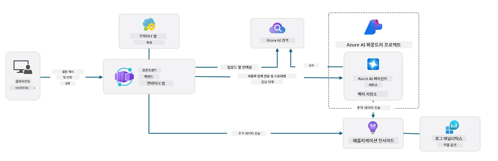

# 3. 템플릿 분해하기

!!! tip "이 모듈을 마칠 때까지 여러분은 다음을 할 수 있게 됩니다"

    - [ ] MCP 서버로 GitHub Copilot 활성화하여 Azure 지원 받기
    - [ ] AZD 템플릿 폴더 구조 및 구성 요소 이해하기
    - [ ] 인프라 코드로서의 구성(Bicep) 조직 패턴 탐색하기
    - [ ] **실습 3:** GitHub Copilot을 사용해 리포지토리 아키텍처 탐색 및 이해하기

---


AZD 템플릿과 Azure Developer CLI(`azd`)를 사용하면 샘플 코드, 인프라 및 구성 파일을 포함한 표준화된 리포지토리를 통해 빠르게 AI 개발 여정을 시작할 수 있습니다. 이 리포지토리는 배포 가능한 _스타터_ 프로젝트의 형태를 가집니다.

**하지만 이제는 프로젝트 구조와 코드베이스를 이해하고 - AZD에 대한 사전 경험이나 이해 없이도 AZD 템플릿을 커스터마이징할 수 있어야 합니다!**

---

## 1. GitHub Copilot 활성화하기

### 1.1 GitHub Copilot Chat 설치

이제 [GitHub Copilot의 에이전트 모드](https://code.visualstudio.com/docs/copilot/chat/chat-agent-mode)를 탐색할 시간입니다. 이제는 자연어로 작업을 상위 수준에서 설명하고 실행 지원을 받을 수 있습니다. 이 실습에서는 완성 및 채팅 인터랙션에 월간 제한이 있는 [Copilot 무료 플랜](https://github.com/github-copilot/signup)을 사용합니다.

확장 기능은 마켓플레이스에서 설치할 수 있지만, Codespaces 환경에 이미 설치되어 있을 수 있습니다. _Copilot 아이콘 드롭다운에서 `Open Chat`을 클릭하세요 - 그리고 `What can you do?`와 같은 프롬프트를 입력하세요_ - 로그인하라는 메시지가 뜰 수 있습니다. **GitHub Copilot Chat이 준비되었습니다**.

### 1.2 MCP 서버 설치

에이전트 모드를 효과적으로 사용하려면 적절한 도구에 접근할 수 있어야 지식을 검색하거나 작업을 수행할 수 있습니다. MCP 서버가 여기서 도움이 됩니다. 다음 서버를 구성할 것입니다:

1. [Azure MCP 서버](../../../../../workshop/docs/instructions)
1. [Microsoft Docs MCP 서버](../../../../../workshop/docs/instructions)

활성화 방법:

1. `.vscode/mcp.json` 파일이 없으면 생성하세요
1. 아래 내용을 복사해 그 파일에 붙여넣고 서버를 시작하세요!
   ```json title=".vscode/mcp.json"
   {
      "servers": {
         "Azure MCP Server": {
            "command": "npx",
            "args": [
            "-y",
            "@azure/mcp@latest",
            "server",
            "start"
            ]
         },
         "microsoft.docs.mcp": {
            "type": "http",
            "url": "https://learn.microsoft.com/api/mcp"
         }
      }
   }
   ```

??? warning "만약 `npx`가 설치되어 있지 않다는 오류가 발생하면 (펼치기 클릭하여 해결 방법 확인)"

      해결 방법: `.devcontainer/devcontainer.json` 파일을 열고 features 섹션에 다음 줄을 추가하세요. 컨테이너를 재빌드하면 `npx`가 설치됩니다.

      ```title="" linenums="0"
         "features": {
            "ghcr.io/devcontainers/features/node:1": {},
            ...
         },
      ```

---

### 1.3 GitHub Copilot Chat 테스트하기

**먼저 VS Code 명령줄에서 `az login`으로 Azure 인증을 하세요.**

이제 Azure 구독 상태를 조회하고 배포된 리소스나 구성에 대해 질문할 수 있습니다. 다음 프롬프트들을 시도해보세요:

1. `List my Azure resource groups`
1. `#foundry list my current deployments`

또한 Azure 문서에 대해 질문하고 Microsoft Docs MCP 서버를 기반으로 답변을 받을 수 있습니다. 다음 프롬프트들을 시도해보세요:

1. `#microsoft_docs_search What is Azure Developer CLI?`
1. `#microsoft_docs_search Show me a Python tutorial to chat with deployed model`

또는 작업을 완료할 코드 스니펫 요청도 가능합니다. 다음 프롬프트를 시도해보세요.

1. `Give me a Python code example that uses AAD for an interactive chat client`

`Ask` 모드에서는 복사-붙여넣기하여 시도할 수 있는 코드를 제공합니다. `Agent` 모드에서는 해당 작업을 수행할 수 있도록 필요한 리소스 생성, 설정 스크립트 및 문서 작성까지 포함할 수 있습니다.

**이제 템플릿 리포지토리 탐색을 시작할 준비가 되었습니다**

---

## 2. 아키텍처 분해하기

??? prompt "질문: docs/images/architecture.png에 있는 애플리케이션 아키텍처를 1단락으로 설명해주세요"

      이 애플리케이션은 Azure 기반의 AI 기반 채팅 애플리케이션으로 현대 에이전트 아키텍처를 시연합니다. 이 솔루션은 사용자 입력을 처리하고 AI 에이전트를 통해 지능형 응답을 생성하는 주요 애플리케이션 코드를 호스팅하는 Azure Container App을 중심으로 구성되어 있습니다.
      
      아키텍처는 Microsoft Foundry 프로젝트를 AI 기능의 기반으로 사용하며, GPT-4o-mini 같은 기본 언어 모델과 에이전트 기능을 제공하는 Azure AI 서비스에 연결됩니다. 사용자의 상호작용은 React 기반 프론트엔드에서 FastAPI 백엔드로 흐르며, AI 에이전트 서비스와 통신하여 문맥에 맞는 응답을 생성합니다.
      
      시스템은 파일 검색이나 Azure AI Search 서비스를 통한 지식 검색 기능도 포함하여 에이전트가 업로드된 문서에서 정보를 액세스하고 인용할 수 있도록 지원합니다. 운영 우수성을 위해 애플리케이션 인사이트와 로그 분석 작업 영역을 통한 통합 모니터링, 로깅 및 성능 최적화가 포함되어 있습니다.
      
      Azure 저장소는 애플리케이션 데이터와 파일 업로드를 위한 Blob 저장소를 제공하며, Managed Identity는 자격 증명 없이 Azure 리소스 간 보안 접근을 보장합니다. 전체 솔루션은 컨테이너화된 애플리케이션이 수요에 따라 자동으로 확장되며, Azure 관리형 서비스 생태계를 통해 내장된 보안, 모니터링 및 CI/CD 기능을 제공하도록 설계되었습니다.



---

## 3. 리포지토리 구조

!!! prompt "질문: 템플릿 폴더 구조를 설명해주세요. 시각적인 계층 다이어그램부터 시작하세요."

??? info "답변: 시각적 계층 다이어그램"

      ```bash title="" 
      get-started-with-ai-agents/
      ├── 📋 Configuration & Setup
      │   ├── azure.yaml                    # Azure Developer CLI 구성 파일
      │   ├── docker-compose.yaml           # 로컬 개발용 컨테이너
      │   ├── pyproject.toml                # Python 프로젝트 구성
      │   ├── requirements-dev.txt          # 개발 의존성
      │   └── .devcontainer/                # VS Code 개발 컨테이너 설정
      │
      ├── 🏗️ Infrastructure (infra/)
      │   ├── main.bicep                    # 주요 인프라 템플릿
      │   ├── api.bicep                     # API 전용 리소스
      │   ├── main.parameters.json          # 인프라 매개변수 파일
      │   └── core/                         # 모듈화된 인프라 구성요소
      │       ├── ai/                       # AI 서비스 구성
      │       ├── host/                     # 호스팅 인프라
      │       ├── monitor/                  # 모니터링 및 로깅
      │       ├── search/                   # Azure AI Search 설정
      │       ├── security/                 # 보안 및 ID 관리
      │       └── storage/                  # 스토리지 계정 구성
      │
      ├── 💻 Application Source (src/)
      │   ├── api/                          # 백엔드 API
      │   │   ├── main.py                   # FastAPI 애플리케이션 진입점
      │   │   ├── routes.py                 # API 라우트 정의
      │   │   ├── search_index_manager.py   # 검색 기능 관리
      │   │   ├── data/                     # API 데이터 처리
      │   │   ├── static/                   # 정적 웹 자산
      │   │   └── templates/                # HTML 템플릿
      │   ├── frontend/                     # React/TypeScript 프론트엔드
      │   │   ├── package.json              # Node.js 의존성
      │   │   ├── vite.config.ts            # Vite 빌드 설정
      │   │   └── src/                      # 프론트엔드 소스 코드
      │   ├── data/                         # 샘플 데이터 파일
      │   │   └── embeddings.csv            # 미리 계산된 임베딩 데이터
      │   ├── files/                        # 지식 기반 파일
      │   │   ├── customer_info_*.json      # 고객 데이터 샘플
      │   │   └── product_info_*.md         # 제품 문서
      │   ├── Dockerfile                    # 컨테이너 구성 파일
      │   └── requirements.txt              # Python 의존성
      │
      ├── 🔧 Automation & Scripts (scripts/)
      │   ├── postdeploy.sh/.ps1           # 배포 후 설정 스크립트
      │   ├── setup_credential.sh/.ps1     # 자격 증명 설정 스크립트
      │   ├── validate_env_vars.sh/.ps1    # 환경 변수 검증 스크립트
      │   └── resolve_model_quota.sh/.ps1  # 모델 할당량 관리 스크립트
      │
      ├── 🧪 Testing & Evaluation
      │   ├── tests/                        # 단위 및 통합 테스트
      │   │   └── test_search_index_manager.py
      │   ├── evals/                        # 에이전트 평가 프레임워크
      │   │   ├── evaluate.py               # 평가 실행기
      │   │   ├── eval-queries.json         # 테스트 쿼리
      │   │   └── eval-action-data-path.json
      │   ├── sandbox/                      # 개발용 테스트 공간
      │   │   ├── 1-quickstart.py           # 시작 예제
      │   │   └── aad-interactive-chat.py   # 인증 예제
      │   └── airedteaming/                 # AI 안전성 평가
      │       └── ai_redteaming.py          # 레드팀 테스트
      │
      ├── 📚 Documentation (docs/)
      │   ├── deployment.md                 # 배포 가이드
      │   ├── local_development.md          # 로컬 설정 지침
      │   ├── troubleshooting.md            # 일반 문제 및 해결 방법
      │   ├── azure_account_setup.md        # Azure 사전 조건
      │   └── images/                       # 문서용 자산
      │
      └── 📄 Project Metadata
         ├── README.md                     # 프로젝트 개요
         ├── CODE_OF_CONDUCT.md           # 커뮤니티 가이드라인
         ├── CONTRIBUTING.md              # 기여 가이드
         ├── LICENSE                      # 라이선스 조항
         └── next-steps.md                # 배포 후 가이드

### 3.1 핵심 애플리케이션 아키텍처

이 템플릿은 **풀스택 웹 애플리케이션** 패턴을 따릅니다:

- **백엔드**: Python FastAPI와 Azure AI 통합
- **프론트엔드**: TypeScript/React와 Vite 빌드 시스템
- **인프라**: Azure Bicep 템플릿으로 클라우드 리소스 관리
- **컨테이너화**: 일관된 배포를 위한 Docker 사용

### 3.2 코드로서의 인프라 (bicep)

인프라 계층은 **Azure Bicep** 템플릿으로 모듈화되어 구성됩니다:

   - **`main.bicep`**: 모든 Azure 리소스를 조율
   - **`core/` 모듈들**: 다양한 서비스용 재사용 컴포넌트
      - AI 서비스 (Azure OpenAI, AI Search)
      - 컨테이너 호스팅 (Azure Container Apps)
      - 모니터링 (Application Insights, Log Analytics)
      - 보안 (키 볼트, Managed Identity)

### 3.3 애플리케이션 소스 (`src/`)

**백엔드 API (`src/api/`)**:

- FastAPI 기반 REST API
- Foundry 에이전트 통합
- 지식 검색을 위한 검색 인덱스 관리
- 파일 업로드 및 처리 기능

**프론트엔드 (`src/frontend/`)**:

- 최신 React/TypeScript SPA
- 빠른 개발과 최적화된 빌드를 위한 Vite
- 에이전트와 상호작용 가능한 채팅 인터페이스

**지식 기반 (`src/files/`)**:

- 고객 및 제품 데이터 샘플
- 파일 기반 지식 검색 데모
- JSON 및 Markdown 형식 예제

### 3.4 DevOps 및 자동화

**스크립트 (`scripts/`)**:

- 크로스 플랫폼 PowerShell 및 Bash 스크립트
- 환경 변수 검증 및 설정
- 배포 후 구성
- 모델 할당량 관리

**Azure Developer CLI 통합**:

- `azure.yaml` 구성 파일로 `azd` 워크플로우 관리
- 자동 프로비저닝 및 배포
- 환경 변수 관리

### 3.5 테스트 및 품질 보증

**평가 프레임워크 (`evals/`)**:

- 에이전트 성능 평가
- 쿼리-응답 품질 테스트
- 자동화된 평가 파이프라인

**AI 안전성 (`airedteaming/`)**:

- AI 안전성 레드팀 테스트
- 보안 취약점 스캔
- 책임 있는 AI 실천

---

## 4. 축하합니다 🏆

GitHub Copilot Chat과 MCP 서버를 성공적으로 사용하여 리포지토리를 탐색했습니다.

- [X] Azure용 GitHub Copilot 활성화 완료
- [X] 애플리케이션 아키텍처 이해 완료
- [X] AZD 템플릿 구조 탐색 완료

이로써 이 템플릿의 _코드로서의 인프라_ 자산에 대한 감을 잡으셨습니다. 다음으로 AZD 구성 파일을 살펴보겠습니다.

---

<!-- CO-OP TRANSLATOR DISCLAIMER START -->
**면책 조항**:  
이 문서는 AI 번역 서비스 [Co-op Translator](https://github.com/Azure/co-op-translator)를 사용하여 번역되었습니다. 정확성을 위해 최선을 다하고 있으나, 자동 번역에는 오류나 부정확성이 포함될 수 있음을 유의하시기 바랍니다. 원문 문서가 권위 있는 출처로 간주되어야 합니다. 중요한 정보의 경우 전문 번역가의 번역을 권장합니다. 본 번역의 사용으로 인해 발생하는 오해나 잘못된 해석에 대해 당사는 책임을 지지 않습니다.
<!-- CO-OP TRANSLATOR DISCLAIMER END -->