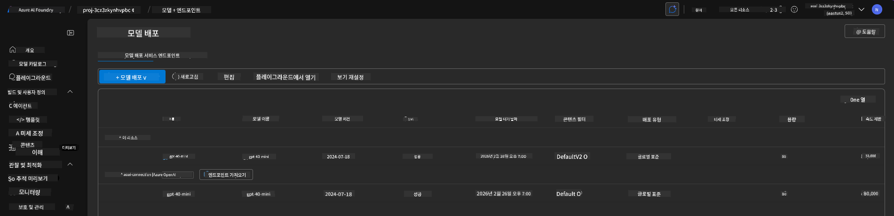
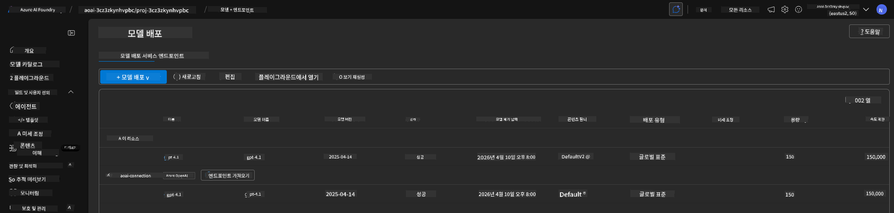

<!--
CO_OP_TRANSLATOR_METADATA:
{
  "original_hash": "6539a34c770f3ceff282370d72ee74dc",
  "translation_date": "2025-09-24T10:00:37+00:00",
  "source_file": "workshop/docs/instructions/6-Teardown-Infrastructure.md",
  "language_code": "ko"
}
-->
# 6. 인프라 해체

!!! tip "이 모듈을 완료하면 다음을 할 수 있습니다"

    - [ ] 항목
    - [ ] 항목
    - [ ] 항목

---

## 추가 연습 문제

프로젝트를 해체하기 전에 몇 분 동안 자유롭게 탐색해 보세요.

!!! danger "NITYA-TODO: 시도해볼 몇 가지 질문 작성"

---

## 인프라 해제

1. 인프라를 해체하는 것은 다음과 같이 간단합니다:
      
      ```bash title="" linenums="0"
      azd down --purge
      ```
1. `--purge` 플래그는 소프트 삭제된 Cognitive Service 리소스도 제거하여 이러한 리소스가 차지하고 있는 할당량을 해제합니다. 완료되면 다음과 같은 결과를 볼 수 있습니다:
      
      ```bash title="" linenums="0"
      ? Total resources to delete: 11, are you sure you want to continue? Yes
      Deleting your resources can take some time.
      (✓) Done: Deleted resource group rg-nitya-mshack-azd
      (✓) Done: Purging Cognitive Account: aoai-3cz3zkynhvpbc

      SUCCESS: Your application was removed from Azure in 11 minutes 4 seconds.
      ```

1. (선택 사항) 이제 `azd up`을 다시 실행하면 환경 변수가 로컬 `.azure` 폴더에 변경되어 저장되었기 때문에 gpt-4.1 모델이 배포되는 것을 확인할 수 있습니다.

      아래는 **이전** 모델 배포 상태입니다:

      

      그리고 이것은 **이후** 상태입니다:
      

---

