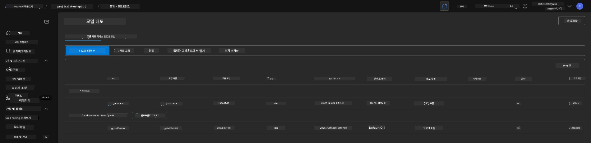
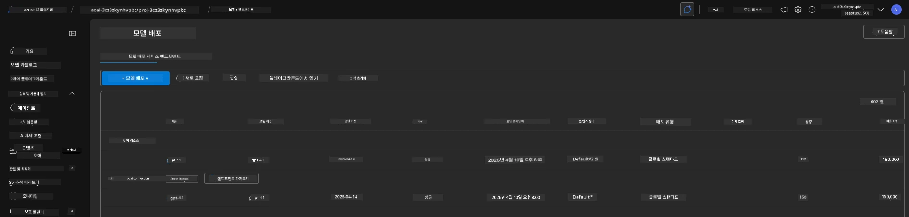

# 6. 인프라 해체

!!! tip "이 모듈을 완료하면 다음을 할 수 있습니다"

    - [ ] 자원 정리 및 비용 관리의 중요성 이해
    - [ ] `azd down`을 사용하여 인프라를 안전하게 해체
    - [ ] 필요 시 소프트 삭제된 인지 서비스 복구
    - [ ] **랩 6:** Azure 자원 정리 및 제거 확인

---

## 보너스 연습문제

프로젝트를 해체하기 전에 잠시 시간을 내어 몇 가지 탐색을 해보세요.

!!! info "다음 탐색 프롬프트를 시도해 보세요"

    **GitHub Copilot으로 실험해 보기:**
    
    1. 질문하기: `멀티 에이전트 시나리오에 사용할 수 있는 다른 AZD 템플릿은 무엇이 있나요?`
    2. 질문하기: `헬스케어 사용 사례에 맞게 에이전트 지침을 어떻게 맞춤화할 수 있나요?`
    3. 질문하기: `비용 최적화를 제어하는 환경 변수는 무엇인가요?`
    
    **Azure 포털 탐색:**
    
    1. 배포에 대한 Application Insights 메트릭 검토
    2. 프로비저닝된 자원의 비용 분석 확인
    3. Microsoft Foundry 포털 에이전트 플레이그라운드를 한 번 더 탐색

---

## 인프라 해체

1. 인프라 해체는 다음과 같이 매우 쉽습니다:
      
      ```bash title="" linenums="0"
      azd down --purge
      ```
1. `--purge` 플래그는 소프트 삭제된 인지 서비스 자원도 함께 정리하여, 이 자원들이 점유하고 있던 쿼터를 해제합니다. 완료되면 다음과 같은 메시지를 보게 됩니다:
      
      ```bash title="" linenums="0"
      ? Total resources to delete: 11, are you sure you want to continue? Yes
      Deleting your resources can take some time.
      (✓) Done: Deleted resource group rg-nitya-mshack-azd
      (✓) Done: Purging Cognitive Account: aoai-3cz3zkynhvpbc

      SUCCESS: Your application was removed from Azure in 11 minutes 4 seconds.
      ```

1. (선택 사항) 이제 `azd up`을 다시 실행하면, 환경 변수가 로컬 `.azure` 폴더에 변경되어 저장되었기 때문에 gpt-4.1 모델이 배포되는 것을 확인할 수 있습니다. 

      배포된 모델은 **이전** 상태입니다:

      

      그리고 **이후** 상태입니다:
      

---

<!-- CO-OP TRANSLATOR DISCLAIMER START -->
**면책 조항**:  
이 문서는 AI 번역 서비스 [Co-op Translator](https://github.com/Azure/co-op-translator)를 사용하여 번역되었습니다. 정확성을 위해 노력하고 있으나, 자동 번역에는 오류나 부정확한 내용이 포함될 수 있음을 유의하시기 바랍니다. 원문 문서가 권위 있는 출처로 간주되어야 합니다. 중요한 정보의 경우 전문적인 인간 번역을 권장합니다. 본 번역의 사용으로 인해 발생하는 오해나 오해석에 대해 당사는 책임지지 않습니다.
<!-- CO-OP TRANSLATOR DISCLAIMER END -->