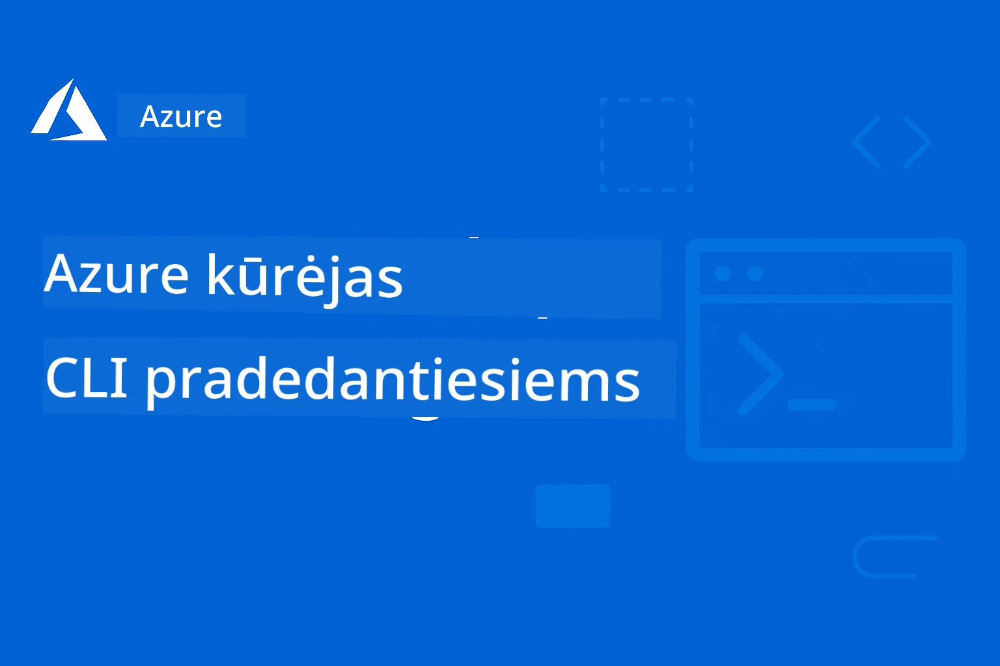

<!--
CO_OP_TRANSLATOR_METADATA:
{
  "original_hash": "068c87cc2641a81ca353ad7064ff326a",
  "translation_date": "2026-01-01T21:08:21+00:00",
  "source_file": "README.md",
  "language_code": "lt"
}
-->
# AZD Pradedantiesiems: Struktūruota mokymosi kelionė

 

[](https://GitHub.com/microsoft/azd-for-beginners/watchers/)
[](https://GitHub.com/microsoft/azd-for-beginners/network/)
[](https://GitHub.com/microsoft/azd-for-beginners/stargazers/)

[](https://discord.gg/microsoft-azure)
[](https://discord.gg/nTYy5BXMWG)

## Pradžia su šiuo kursu

Atlikite šiuos veiksmus, kad pradėtumėte savo AZD mokymosi kelionę:

1. **Sukurkite repozitorijos fork'ą**: Spustelėkite [](https://GitHub.com/microsoft/azd-for-beginners/fork)
2. **Klonuokite repozitoriją**: `git clone https://github.com/microsoft/azd-for-beginners.git`
3. **Prisijunkite prie bendruomenės**: [Azure Discord bendruomenės](https://discord.com/invite/ByRwuEEgH4) ekspertų palaikymui
4. **Pasirinkite mokymosi kelią**: Pasirinkite žemiau esantį skyrių, atitinkantį jūsų patirties lygį

### Daugiakalbė parama

#### Automatiniai vertimai (visada atnaujinami)

<!-- CO-OP TRANSLATOR LANGUAGES TABLE START -->
[Arabų](../ar/README.md) | [Bengalų](../bn/README.md) | [Bulgarų](../bg/README.md) | [Birmos (Mianmaras)](../my/README.md) | [Kinų (supaprastinta)](../zh/README.md) | [Kinų (tradicinė, Honkongas)](../hk/README.md) | [Kinų (tradicinė, Makao)](../mo/README.md) | [Kinų (tradicinė, Taivanas)](../tw/README.md) | [Kroatų](../hr/README.md) | [Čekų](../cs/README.md) | [Danų](../da/README.md) | [Olandų](../nl/README.md) | [Estų](../et/README.md) | [Suomių](../fi/README.md) | [Prancūzų](../fr/README.md) | [Vokiečių](../de/README.md) | [Graikų](../el/README.md) | [Hebrajų](../he/README.md) | [Hindų](../hi/README.md) | [Vengrų](../hu/README.md) | [Indoneziečių](../id/README.md) | [Italų](../it/README.md) | [Japonų](../ja/README.md) | [Kannadų](../kn/README.md) | [Korėjiečių](../ko/README.md) | [Lietuvių](./README.md) | [Malajiečių](../ms/README.md) | [Malajalamo](../ml/README.md) | [Maratų](../mr/README.md) | [Nepalų](../ne/README.md) | [Nigerijos pidžinas](../pcm/README.md) | [Norvegų](../no/README.md) | [Persų (Farsi)](../fa/README.md) | [Lenkų](../pl/README.md) | [Portugalų (Brazilija)](../br/README.md) | [Portugalų (Portugalija)](../pt/README.md) | [Pandžabų (Gurmukhi)](../pa/README.md) | [Rumunų](../ro/README.md) | [Rusų](../ru/README.md) | [Serbų (kirilica)](../sr/README.md) | [Slovakų](../sk/README.md) | [Slovenų](../sl/README.md) | [Ispanų](../es/README.md) | [Svahili](../sw/README.md) | [Švedų](../sv/README.md) | [Tagalogų (Filipinai)](../tl/README.md) | [Tamilių](../ta/README.md) | [Telugų](../te/README.md) | [Tajų](../th/README.md) | [Turkų](../tr/README.md) | [Ukrainiečių](../uk/README.md) | [Urdu](../ur/README.md) | [Vietnamių](../vi/README.md)
<!-- CO-OP TRANSLATOR LANGUAGES TABLE END -->

## Kurso apžvalga

Išmokite Azure Developer CLI (azd) per struktūrizuotus skyrius, sukurtus progresyviam mokymuisi. **Ypatingas dėmesys AI programų diegimui su Microsoft Foundry integracija.**

### Kodėl šis kursas yra būtinas šiuolaikiniams kūrėjams

Remiantis Microsoft Foundry Discord bendruomenės įžvalgomis, **45% kūrėjų nori naudoti AZD AI apkrovoms**, tačiau susiduria su iššūkiais:
- Sudėtinga daugiapaslaugė AI architektūra
- Geriausios praktikos AI diegimui gamyboje  
- Azure AI paslaugų integracija ir konfigūracija
- Kaštų optimizavimas AI apkrovoms
- AI specifinių diegimo problemų trikčių šalinimas

### Mokymosi tikslai

Baigę šį struktūrizuotą kursą, jūs:
- **Išmoksite AZD pagrindus**: pagrindinės sąvokos, diegimas ir konfigūracija
- **Įdiegsite AI programas**: naudokite AZD su Microsoft Foundry paslaugomis
- **Įgyvendinsite infrastruktūrą kaip kodą**: valdykite Azure išteklius su Bicep šablonais
- **Trikčių šalinimas diegimuose**: spręskite dažnias problemas ir derinkite klaidas
- **Optimizacija gamybai**: saugumas, mastelio keitimas, stebėsena ir kaštų valdymas
- **Kurkite daugiagentinius sprendimus**: diegkite sudėtingas AI architektūras

## 📚 Mokymosi skyriai

*Pasirinkite mokymosi kelią pagal patirties lygį ir tikslus*

### 🚀 1 skyrius: Pagrindai ir greitas startas
**Išankstiniai reikalavimai**: Azure prenumerata, pagrindinės komandinės eilutės žinios  
**Trukmė**: 30–45 minučių  
**Sudėtingumas**: ⭐

#### Ką išmoksite
- Azure Developer CLI pagrindų supratimas
- AZD diegimas jūsų platformoje
- Jūsų pirmasis sėkmingas diegimas

#### Mokymosi ištekliai
- **🎯 Pradėkite čia**: [Kas yra Azure Developer CLI?](../..)
- **📖 Teorija**: [AZD pagrindai](docs/getting-started/azd-basics.md) - Pagrindinės sąvokos ir terminologija
- **⚙️ Diegimas**: [Įdiegimas ir nustatymas](docs/getting-started/installation.md) - Platformai specifinės gairės
- **🛠️ Praktika**: [Jūsų pirmasis projektas](docs/getting-started/first-project.md) - Žingsnis po žingsnio vadovas
- **📋 Greita nuoroda**: [Komandų santrauka](resources/cheat-sheet.md)

#### Praktinės užduotys
```bash
# Greitas įdiegimo patikrinimas
azd version

# Įdiekite savo pirmąją programą
azd init --template todo-nodejs-mongo
azd up
```

**💡 Skyrelio rezultatas**: Įdiekite paprastą interneto programą į Azure naudodami AZD

**✅ Sėkmės patikrinimas:**
```bash
# Baigę 1 skyrių, turėtumėte sugebėti:
azd version              # Rodo įdiegtą versiją
azd init --template todo-nodejs-mongo  # Inicializuoja projektą
azd up                  # Diegia į Azure
azd show                # Rodo veikiančios programos URL
# Programa atsidaro naršyklėje ir veikia
azd down --force --purge  # Išvalo išteklius
```

**📊 Laiko investicija:** 30–45 minučių  
**📈 Gebėjimų lygis po:** Galite savarankiškai diegti pagrindines programas

**✅ Sėkmės patikrinimas:**
```bash
# Baigę 1-ąjį skyrių, turėtumėte sugebėti:
azd version              # Rodo įdiegtą versiją
azd init --template todo-nodejs-mongo  # Inicializuoja projektą
azd up                  # Diegia į Azure
azd show                # Rodo veikiančios programos URL
# Programa atsidaro naršyklėje ir veikia
azd down --force --purge  # Išvalo išteklius
```

**📊 Laiko investicija:** 30–45 minučių  
**📈 Gebėjimų lygis po:** Galite savarankiškai diegti pagrindines programas

---

### 🤖 2 skyrius: AI-pirmasis vystymas (rekomenduojama AI kūrėjams)
**Išankstiniai reikalavimai**: Baigtas 1 skyrius  
**Trukmė**: 1–2 valandos  
**Sudėtingumas**: ⭐⭐

#### Ką išmoksite
- Microsoft Foundry integracija su AZD
- AI varomų programų diegimas
- AI paslaugų konfigūracijų supratimas

#### Mokymosi ištekliai
- **🎯 Pradėkite čia**: [Microsoft Foundry integracija](docs/microsoft-foundry/microsoft-foundry-integration.md)
- **📖 Šablonai**: [AI modelių diegimas](docs/microsoft-foundry/ai-model-deployment.md) - Diegti ir valdyti AI modelius
- **🛠️ Dirbtuvės**: [AI dirbtuvių laboratorija](docs/microsoft-foundry/ai-workshop-lab.md) - Paruoškite AI sprendimus AZD
- **🎥 Interaktyvus vadovas**: [Dirbtuvių medžiaga](workshop/README.md) - Mokymasis naršyklėje su MkDocs * DevContainer Environment
- **📋 Šablonai**: [Microsoft Foundry šablonai](../..)
- **📝 Pavyzdžiai**: [AZD diegimo pavyzdžiai](examples/README.md)

#### Praktinės užduotys
```bash
# Diegti savo pirmąją dirbtinio intelekto programą
azd init --template azure-search-openai-demo
azd up

# Išbandyti papildomus dirbtinio intelekto šablonus
azd init --template openai-chat-app-quickstart
azd init --template agent-openai-python-prompty
```

**💡 Skyrelio rezultatas**: Įdiekite ir sukonfigūruokite AI pokalbių programą su RAG galimybėmis

**✅ Sėkmės patikrinimas:**
```bash
# Po antro skyriaus turėtumėte sugebėti:
azd init --template azure-search-openai-demo
azd up
# Išbandyti dirbtinio intelekto pokalbių sąsają
# Užduoti klausimus ir gauti dirbtinio intelekto atsakymus su šaltiniais
# Patikrinti, ar paieškos integracija veikia
azd monitor  # Patikrinti, ar Application Insights rodo telemetriją
azd down --force --purge
```

**📊 Laiko investicija:** 1–2 valandos  
**📈 Gebėjimų lygis po:** Galite įdiegti ir sukonfigūruoti gamybai paruoštas AI programas  
**💰 Kaštų suvokimas:** Suprasti $80–150/mėn kūrimo kaštus, $300–3500/mėn gamybos kaštus

#### 💰 Kainos aspektai AI diegimams

**Kūrimo aplinka (numatoma $80–150/mėn):**
- Azure OpenAI (mokėjimas pagal naudojimą): $0–50/mėn (priklausomai nuo tokenų naudojimo)
- AI Search (pagrindinis lygis): $75/mėn
- Container Apps (vartojimo modelis): $0–20/mėn
- Saugykla (standartinė): $1–5/mėn

**Gamybinė aplinka (numatyta $300–3,500+/mėn):**
- Azure OpenAI (PTU nuosekliam veikimui): $3,000+/mėn ARBA mokėjimas pagal naudojimą su dideliu kiekiu
- AI Search (standartinis lygis): $250/mėn
- Container Apps (dedikuotas): $50–100/mėn
- Application Insights: $5–50/mėn
- Saugykla (premium): $10–50/mėn

**💡 Patarimai, kaip optimizuoti kaštus:**
- Naudokite **nemokamą lygį** Azure OpenAI mokymuisi (įtraukti 50,000 tokenų/mėn)
- Paleiskite `azd down`, kad atlaisvintumėte išteklius, kai aktyviai neveikiate
- Pradėkite nuo vartojimu pagrįsto apmokestinimo, PTU pereikite tik produkcijai
- Naudokite `azd provision --preview`, kad įvertintumėte kaštus prieš diegdami
- Įgalinkite automatinį skalavimą: mokėkite tik už faktinį naudojimą

**Kaštų stebėjimas:**
```bash
# Patikrinkite numatomų mėnesinių išlaidų dydį
azd provision --preview

# Stebėkite faktines išlaidas Azure portale
az consumption budget list --resource-group <your-rg>
```

---

### ⚙️ 3 skyrius: Konfigūravimas ir autentifikacija
**Išankstiniai reikalavimai**: Baigtas 1 skyrius  
**Trukmė**: 45–60 minučių  
**Sudėtingumas**: ⭐⭐

#### Ką išmoksite
- Aplinkos konfigūravimas ir valdymas
- Autentifikacija ir geriausios saugumo praktikos
- Išteklių pavadinimų nustatymas ir organizavimas

#### Mokymosi ištekliai
- **📖 Konfigūracija**: [Konfigūracijos vadovas](docs/getting-started/configuration.md) - Aplinkos nustatymas
- **🔐 Saugumas**: [Autentifikacijos modeliai ir valdomos tapatybės](docs/getting-started/authsecurity.md) - Autentifikacijos modeliai
- **📝 Pavyzdžiai**: [Duomenų bazės programos pavyzdys](examples/database-app/README.md) - AZD duomenų bazės pavyzdžiai

#### Praktinės užduotys
- Konfigūruokite kelias aplinkas (dev, staging, prod)
- Sukonfigūruokite valdomos tapatybės autentifikaciją
- Įgyvendinkite aplinkai specifines konfigūracijas

**💡 Skyrelio rezultatas**: Valdyti kelias aplinkas su tinkama autentifikacija ir saugumu

---

### 🏗️ 4 skyrius: Infrastruktūra kaip kodas ir diegimas
**Išankstiniai reikalavimai**: 1–3 skyriūs baigti  
**Trukmė**: 1–1.5 valandos  
**Sudėtingumas**: ⭐⭐⭐

#### Ką išmoksite
- Išplėstiniai diegimo šablonai
- Infrastruktūra kaip kodas su Bicep
- Išteklių teikimo strategijos

#### Mokymosi ištekliai
- **📖 Diegimas**: [Diegimo vadovas](docs/deployment/deployment-guide.md) - Pilni darbų srautai
- **🏗️ Teikimas**: [Išteklių teikimas](docs/deployment/provisioning.md) - Azure išteklių valdymas
- **📝 Pavyzdžiai**: [Container App pavyzdys](../../examples/container-app) - Konteinerizuoti diegimai

#### Praktinės užduotys
- Sukurti pasirinktinius Bicep šablonus
- Įdiegti kelių paslaugų programas
- Įgyvendinti blue-green diegimo strategijas

**💡 Skyrelio rezultatas**: Diegti sudėtingas kelių paslaugų programas naudojant pasirinktinius infrastruktūros šablonus

---

### 🎯 5 skyrius: Daugiagentiniai AI sprendimai (pažengusiems)
**Išankstiniai reikalavimai**: 1–2 skyriūs baigti  
**Trukmė**: 2–3 valandos  
**Sudėtingumas**: ⭐⭐⭐⭐

#### Ką išmoksite
- Daugiagentiniai architektūros šablonai
- Agentų orkestracija ir koordinacija
- Gamybai paruošti AI diegimai

#### Mokymosi ištekliai
- **🤖 Pateiktas projektas**: [Mažmeninės prekybos daugiagentinis sprendimas](examples/retail-scenario.md) - Pilnas įgyvendinimas
- **🛠️ ARM Templates**: [ARM Template Package](../../examples/retail-multiagent-arm-template) - Vieno paspaudimo diegimas
- **📖 Architektūra**: [Daugiagentės koordinavimo šablonai](/docs/pre-deployment/coordination-patterns.md) - Šablonai

#### Praktinės užduotys
```bash
# Diegti pilną mažmeninės prekybos daugiagentinį sprendimą
cd examples/retail-multiagent-arm-template
./deploy.sh

# Tyrinėti agentų konfigūracijas
az deployment group show --resource-group <rg-name> --name <deployment-name>
```

**💡 Skyriaus rezultatas**: Diegti ir valdyti gamybai parengtą daugiagentę AI sprendimą su Customer ir Inventory agentais

---

### 🔍 Skyrius 6: Išankstinis diegimo patvirtinimas ir planavimas
**Išankstinės sąlygos**: Baigtas 4 skyrius  
**Trukmė**: 1 valanda  
**Sudėtingumas**: ⭐⭐

#### Ko išmoksite
- Talpos planavimas ir resursų patvirtinimas
- SKU pasirinkimo strategijos
- Išankstiniai patikrinimai ir automatizavimas

#### Mokymosi ištekliai
- **📊 Planavimas**: [Capacity Planning](docs/pre-deployment/capacity-planning.md) - Resursų patvirtinimas
- **💰 Pasirinkimas**: [SKU Selection](docs/pre-deployment/sku-selection.md) - Kaina ir efektyvumas
- **✅ Patikrinimas**: [Pre-flight Checks](docs/pre-deployment/preflight-checks.md) - Automatizuoti skriptai

#### Praktinės užduotys
- Paleisti talpos patvirtinimo skriptus
- Optimizuoti SKU pasirinkimus dėl kaštų
- Įdiegti automatizuotus išankstinius diegimo patikrinimus

**💡 Skyriaus rezultatas**: Patvirtinti ir optimizuoti diegimus prieš jų vykdymą

---

### 🚨 Skyrius 7: Gedimų šalinimas ir derinimas
**Išankstinės sąlygos**: Baigtas bet kuris diegimo skyrius  
**Trukmė**: 1–1,5 valandos  
**Sudėtingumas**: ⭐⭐

#### Ko išmoksite
- Sistemingi derinimo metodai
- Dažnos problemos ir sprendimai
- AI specifinis gedimų šalinimas

#### Mokymosi ištekliai
- **🔧 Dažnos problemos**: [Common Issues](docs/troubleshooting/common-issues.md) - DUK ir sprendimai
- **🕵️ Derinimas**: [Debugging Guide](docs/troubleshooting/debugging.md) - Žingsnis po žingsnio strategijos
- **🤖 AI problemos**: [AI-Specific Troubleshooting](docs/troubleshooting/ai-troubleshooting.md) - AI paslaugų problemos

#### Praktinės užduotys
- Diagnostikuoti diegimo gedimus
- Išspręsti autentifikacijos problemas
- Derinti AI paslaugų ryšį

**💡 Skyriaus rezultatas**: Savarankiškai diagnozuoti ir išspręsti dažnas diegimo problemas

---

### 🏢 Skyrius 8: Gamybiniai ir įmonių modeliai
**Išankstinės sąlygos**: Baigti 1–4 skyriai  
**Trukmė**: 2–3 valandos  
**Sudėtingumas**: ⭐⭐⭐⭐

#### Ko išmoksite
- Gamybinio diegimo strategijos
- Įmonių saugumo modeliai
- Stebėsena ir kaštų optimizavimas

#### Mokymosi ištekliai
- **🏭 Gamyba**: [Production AI Best Practices](docs/microsoft-foundry/production-ai-practices.md) - Įmonių modeliai
- **📝 Pavyzdžiai**: [Mikroservisų pavyzdys](../../examples/microservices) - Sudėtingos architektūros
- **📊 Stebėsena**: [Application Insights integracija](docs/pre-deployment/application-insights.md) - Stebėjimas

#### Praktinės užduotys
- Įdiegti įmonių saugumo modelius
- Nustatyti išsamią stebėseną
- Diegti į gamybą su tinkama valdymo tvarka

**💡 Skyriaus rezultatas**: Diegti įmonėms paruoštas programas su pilnomis gamybinėmis galimybėmis

---

## 🎓 Dirbtuvių apžvalga: praktinė mokymosi patirtis

> **⚠️ DIRBTUVIŲ BŪKLĖ: Vykdomas kūrimas**  
> Dirbtuvių medžiaga šiuo metu kuriama ir tobulinama. Pagrindiniai moduliai veikia, tačiau kai kurios pažangios dalys dar nepilnos. Aktyviai dirbame, kad užbaigtume visą turinį. [Stebėti pažangą →](workshop/README.md)

### Interaktyvios dirbtuvių medžiagos
**Išsamus praktinis mokymasis su naršyklėje veikiančiais įrankiais ir nukreiptomis užduotimis**

Mūsų dirbtuvės suteikia struktūrizuotą, interaktyvią mokymosi patirtį, kuri papildo aukščiau pateiktą skyrių programą. Dirbtuvės sukurtos tiek savarankiškam mokymuisi, tiek dėstytojo vedamoms sesijoms.

#### 🛠️ Dirbtuvių funkcijos
- **Naršyklėje veikianti sąsaja**: Pilnos MkDocs pagrindu veikiančios dirbtuvės su paieška, kopijavimo ir temos funkcijomis
- **GitHub Codespaces integracija**: Vieno paspaudimo vystymo aplinkos nustatymas
- **Struktūruota mokymosi eiga**: 7 žingsnių giduotos užduotys (iš viso 3,5 val.)
- **Atradimas → Diegimas → Pritaikymas**: Progresyvi metodologija
- **Interaktyvi DevContainer aplinka**: Iš anksto sukonfigūruoti įrankiai ir priklausomybės

#### 📚 Dirbtuvių struktūra
Dirbtuvės seka Atradimas → Diegimas → Pritaikymas metodiką:

1. **Atradimo fazė** (45 min)
   - Išnagrinėti Microsoft Foundry šablonus ir paslaugas
   - Suprasti daugiaagentės architektūros modelius
   - Peržiūrėti diegimo reikalavimus ir išankstines sąlygas

2. **Diegimo fazė** (2 val.)
   - Praktinis AI programų diegimas su AZD
   - Konfigūruoti Azure AI paslaugas ir galinius taškus
   - Taikyti saugumo ir autentifikacijos modelius

3. **Pritaikymo fazė** (45 min)
   - Modifikuoti programas konkretiems naudojimo atvejams
   - Optimizuoti diegimą gamybai
   - Įdiegti stebėseną ir kaštų valdymą

#### 🚀 Kaip pradėti dirbtuves
```bash
# Parinktis 1: GitHub Codespaces (rekomenduojama)
# Spustelėkite "Code" → "Create codespace on main" saugykloje

# Parinktis 2: Vietinis vystymas
git clone https://github.com/microsoft/azd-for-beginners.git
cd azd-for-beginners/workshop
# Sekite nustatymo instrukcijas faile workshop/README.md
```

#### 🎯 Dirbtuvių mokymosi rezultatai
Užbaigę dirbtuves, dalyviai:
- **Diegs gamybines AI programas**: Naudos AZD su Microsoft Foundry paslaugomis
- **Įvaldys daugiaagentines architektūras**: Įdiegs koordinuotus AI agentų sprendimus
- **Taikys saugumo gerąsias praktikas**: Konfigūruos autentifikaciją ir prieigos kontrolę
- **Optimizuos masteliui**: Projektuos kaštų efektyvius, našius diegimus
- **Spręs diegimų problemas**: Savarankiškai išspręs dažnas problemas

#### 📖 Dirbtuvių ištekliai
- **🎥 Interaktyvus gidas**: [Workshop Materials](workshop/README.md) - Naršyklėje veikianti mokymosi aplinka
- **📋 Žingsnis po žingsnio instrukcijos**: [Guided Exercises](../../workshop/docs/instructions) - Išsamios užduočių instrukcijos
- **🛠️ AI dirbtuvių laboratorija**: [AI Workshop Lab](docs/microsoft-foundry/ai-workshop-lab.md) - AI orientuotos užduotys
- **💡 Greitas startas**: [Workshop Setup Guide](workshop/README.md#quick-start) - Aplinkos konfigūracija

**Puikiai tinka**: Įmonių mokymams, universitetų kursams, savarankiškam mokymuisi ir kūrėjų stovykloms.

---

## 📖 Kas yra Azure Developer CLI?

Azure Developer CLI (azd) yra kūrėjams skirta komandų eilutės sąsaja, kuri pagreitina programų kūrimo ir diegimo į Azure procesą. Ji suteikia:

- **Diegimai pagal šablonus** - Naudokite iš anksto paruoštus šablonus dažnai pasitaikantiems programų modeliams
- **Infrastruktūra kaip kodas** - Valdykite Azure resursus naudodami Bicep arba Terraform  
- **Integruoti darbo procesai** - Sklandžiai teikite, diegkite ir stebėkite programas
- **Draugiška kūrėjui** - Optimizuota kūrėjo produktyvumui ir patirčiai

### **AZD + Microsoft Foundry: Puikiai tinka AI diegimams**

**Kodėl AZD AI sprendimams?** AZD sprendžia pagrindines problemas, su kuriomis susiduria AI kūrėjai:

- **AI paruošti šablonai** - Iš anksto sukonfigūruoti šablonai Azure OpenAI, Cognitive Services ir ML darbo krūviams
- **Saugūs AI diegimai** - Integruoti saugumo modeliai AI paslaugoms, API raktams ir modelių galiniams taškams  
- **Gamybiniai AI modeliai** - Geriausios praktikos mastomiems, kaštų efektyviems AI programų diegimams
- **Visapusiški AI darbo procesai** - Nuo modelio kūrimo iki gamybinio diegimo su tinkama stebėsena
- **Kaštų optimizavimas** - Išmanus resursų paskirstymas ir skalės strategijos AI darbo krūviams
- **Microsoft Foundry integracija** - Sklandi sąsaja su Microsoft Foundry modelių katalogu ir galiniais taškais

---

## 🎯 Šablonų ir pavyzdžių biblioteka

### Išskirtiniai: Microsoft Foundry šablonai
**Pradėkite čia, jei diegiate AI programas!**

> **Pastaba:** Šie šablonai demonstruoja įvairius AI modelius. Kai kurie yra išoriniai Azure Samples, kiti - vietinės implementacijos.

| Šablonas | Skyrius | Sudėtingumas | Paslaugos | Tipas |
|----------|---------|------------|----------|------|
| [**Get started with AI chat**](https://github.com/Azure-Samples/get-started-with-ai-chat) | Skyrius 2 | ⭐⭐ | AzureOpenAI + Azure AI Model Inference API + Azure AI Search + Azure Container Apps + Application Insights | Išorinis |
| [**Get started with AI agents**](https://github.com/Azure-Samples/get-started-with-ai-agents) | Skyrius 2 | ⭐⭐ | Azure AI Agent Service + AzureOpenAI + Azure AI Search + Azure Container Apps + Application Insights| Išorinis |
| [**Azure Search + OpenAI Demo**](https://github.com/Azure-Samples/azure-search-openai-demo) | Skyrius 2 | ⭐⭐ | AzureOpenAI + Azure AI Search + App Service + Storage | Išorinis |
| [**OpenAI Chat App Quickstart**](https://github.com/Azure-Samples/openai-chat-app-quickstart) | Skyrius 2 | ⭐ | AzureOpenAI + Container Apps + Application Insights | Išorinis |
| [**Agent OpenAI Python Prompty**](https://github.com/Azure-Samples/agent-openai-python-prompty) | Skyrius 5 | ⭐⭐⭐ | AzureOpenAI + Azure Functions + Prompty | Išorinis |
| [**Contoso Chat RAG**](https://github.com/Azure-Samples/contoso-chat) | Skyrius 8 | ⭐⭐⭐⭐ | AzureOpenAI + AI Search + Cosmos DB + Container Apps | Išorinis |
| [**Retail Multi-Agent Solution**](examples/retail-scenario.md) | Skyrius 5 | ⭐⭐⭐⭐ | AzureOpenAI + AI Search + Storage + Container Apps + Cosmos DB | **Vietinis** |

### Išskirtiniai: Pilni mokymosi scenarijai
**Gamybai paruošti programų šablonai, susieti su mokymosi skyriumi**

| Šablonas | Mokymosi skyrius | Sudėtingumas | Pagrindinė pamoka |
|----------|------------------|------------|--------------|
| [**openai-chat-app-quickstart**](https://github.com/Azure-Samples/openai-chat-app-quickstart) | Skyrius 2 | ⭐ | Pagrindiniai AI diegimo modeliai |
| [**azure-search-openai-demo**](https://github.com/Azure-Samples/azure-search-openai-demo) | Skyrius 2 | ⭐⭐ | RAG įgyvendinimas su Azure AI Search |
| [**ai-document-processing**](https://github.com/Azure-Samples/ai-document-processing) | Skyrius 4 | ⭐⭐ | Dokumentų intelekto integracija |
| [**agent-openai-python-prompty**](https://github.com/Azure-Samples/agent-openai-python-prompty) | Skyrius 5 | ⭐⭐⭐ | Agentų sistema ir funkcijų kvietimas |
| [**contoso-chat**](https://github.com/Azure-Samples/contoso-chat) | Skyrius 8 | ⭐⭐⭐ | Įmonių AI orkestracija |
| [**retail-multi-agent-solution**](examples/retail-scenario.md) | Skyrius 5 | ⭐⭐⭐⭐ | Daugiagentė architektūra su Customer ir Inventory agentais |

### Mokymasis per pavyzdžius pagal tipą

> **📌 Vietiniai vs. Išoriniai pavyzdžiai:**  
> **Vietiniai pavyzdžiai** (šioje saugykloje) = Paruošti naudoti iš karto  
> **Išoriniai pavyzdžiai** (Azure Samples) = Klonuokite iš susietų repozitorijų

#### Vietiniai pavyzdžiai (paruošti naudoti)
- [**Retail Multi-Agent Solution**](examples/retail-scenario.md) - Pilnas gamybai parengtas įgyvendinimas su ARM šablonais
  - Daugiagentė architektūra (Customer + Inventory agentai)
  - Išsami stebėsena ir vertinimas
  - Vieno paspaudimo diegimas per ARM šabloną

#### Vietiniai pavyzdžiai - Container Applications (Skyriai 2-5)
**Išsamūs konteinerių diegimo pavyzdžiai šiame repozitorijoje:**
- [**Container App Examples**](examples/container-app/README.md) - Išsamus vadovas konteinerizuotiems diegimams
  - [Simple Flask API](../../examples/container-app/simple-flask-api) - Pagrindinis REST API su scale-to-zero
  - [Microservices Architecture](../../examples/container-app/microservices) - Gamybai parengtas daugiapakopis diegimas
  - Greitas startas, gamyba ir pažangūs diegimo modeliai
  - Stebėsena, saugumas ir kaštų optimizavimo gairės

#### Išoriniai pavyzdžiai - Paprastos programos (Skyriai 1-2)
**Klonuokite šias Azure Samples saugyklas, kad pradėtumėte:**
- [Simple Web App - Node.js + MongoDB](https://github.com/Azure-Samples/todo-nodejs-mongo) - Pagrindiniai diegimo modeliai
- [Static Website - React SPA](https://github.com/Azure-Samples/todo-csharp-sql-swa-func) - Statinio turinio diegimas
- [Container App - Python Flask](https://github.com/Azure-Samples/container-apps-store-api-microservice) - REST API diegimas

#### Išoriniai pavyzdžiai - Duomenų bazės integracija (Skyriai 3-4)  
- [Database App - C# + SQL](https://github.com/Azure-Samples/todo-csharp-sql) - Duomenų bazės ryšio modeliai
- [Functions + Cosmos DB](https://github.com/Azure-Samples/todo-python-mongo-swa-func) - Serverless duomenų darbo eiga

#### Išoriniai pavyzdžiai - Pažangūs modeliai (Skyriai 4-8)
- [Java Microservices](https://github.com/Azure-Samples/java-microservices-aca-lab) - Daugiapakopės paslaugų architektūros
- [Container Apps Jobs](https://github.com/Azure-Samples/container-apps-jobs) - Fono apdorojimas  
- [Enterprise ML Pipeline](https://github.com/Azure-Samples/mlops-v2) - Gamybiniai ML modeliai

### Išorinės šablonų kolekcijos
- [**Official AZD Template Gallery**](https://azure.github.io/awesome-azd/) - Atrinkta oficialių ir bendruomenės šablonų kolekcija
- [**Azure Developer CLI Templates**](https://learn.microsoft.com/en-us/azure/developer/azure-developer-cli/azd-templates) - Microsoft Learn šablonų dokumentacija
- [**Examples Directory**](examples/README.md) - Vietiniai mokymosi pavyzdžiai su išsamiais paaiškinimais

---

## 📚 Mokymosi ištekliai ir nuorodos

### Greitos nuorodos
- [**Komandų santrauka**](resources/cheat-sheet.md) - Esminės azd komandos, suskirstytos pagal skyrius
- [**Žodynas**](resources/glossary.md) - Azure ir azd terminai  
- [**DUK**](resources/faq.md) - Dažniausi klausimai, suskirstyti pagal mokymosi skyrių
- [**Mokymosi vadovas**](resources/study-guide.md) - Išsamūs praktiniai pratimai

### Praktinės dirbtuvės
- [**AI dirbtuvės laboratorija**](docs/microsoft-foundry/ai-workshop-lab.md) - Padarykite savo AI sprendimus diegiamus su AZD (2-3 val.)
- [**Interaktyvus dirbtuvių vadovas**](workshop/README.md) - Naršyklėje vykdomos dirbtuvės su MkDocs ir DevContainer aplinka
- [**Struktūruotas mokymosi kelias**](../../workshop/docs/instructions) -7-žingsnių vadovaujami pratimai (Tyrimas → Diegimas → Pritaikymas)
- [**AZD pradedantiesiems dirbtuvės**](workshop/README.md) - Pilnos praktinių dirbtuvių medžiagos su GitHub Codespaces integracija

### Išoriniai mokymosi ištekliai
- [Azure Developer CLI dokumentacija](https://learn.microsoft.com/en-us/azure/developer/azure-developer-cli/)
- [Azure architektūros centras](https://learn.microsoft.com/en-us/azure/architecture/)
- [Azure kainų skaičiuoklė](https://azure.microsoft.com/pricing/calculator/)
- [Azure būklė](https://status.azure.com/)

---

## 🔧 Greitas trikčių šalinimo vadovas

**Dažniausios pradedančiųjų problemos ir greiti sprendimai:**

### ❌ "azd: command not found"

```bash
# Pirmiausia įdiekite AZD
# Windows (PowerShell):
winget install microsoft.azd

# macOS:
brew tap azure/azd && brew install azd

# Linux:
curl -fsSL https://aka.ms/install-azd.sh | bash

# Patikrinkite diegimą
azd version
```

### ❌ "No subscription found" or "Subscription not set"

```bash
# Rodyti prieinamas prenumeratas
az account list --output table

# Nustatyti numatytąją prenumeratą
az account set --subscription "<subscription-id-or-name>"

# Nustatyti AZD aplinkai
azd env set AZURE_SUBSCRIPTION_ID "<subscription-id>"

# Patikrinti
az account show
```

### ❌ "InsufficientQuota" or "Quota exceeded"

```bash
# Išbandykite kitą Azure regioną
azd env set AZURE_LOCATION "westus2"
azd up

# Arba kūrimo metu naudokite mažesnius SKU
# Redaguokite infra/main.parameters.json:
{
  "sku": "B1"  // Instead of "P1V2"
}
```

### ❌ "azd up" fails halfway through

```bash
# Parinktis 1: Išvalyti ir bandyti iš naujo
azd down --force --purge
azd up

# Parinktis 2: Tiesiog ištaisyti infrastruktūrą
azd provision

# Parinktis 3: Patikrinti išsamius žurnalus
azd show
azd logs
```

### ❌ "Authentication failed" or "Token expired"

```bash
# Autentikuoti iš naujo
az logout
az login

azd auth logout
azd auth login

# Patikrinti autentifikaciją
az account show
```

### ❌ "Resource already exists" or naming conflicts

```bash
# AZD generuoja unikalius pavadinimus, tačiau jei kyla konfliktas:
azd down --force --purge

# Tada bandykite iš naujo su švaria aplinka
azd env new dev-v2
azd up
```

### ❌ Template deployment taking too long

**Įprasti laukimo laikai:**
- Paprasta žiniatinklio programa: 5-10 minučių
- Programa su duomenų baze: 10-15 minučių
- AI programos: 15-25 minučių (OpenAI paruošimas vyksta lėtai)

```bash
# Patikrinkite pažangą
azd show

# Jei užstrigote ilgiau nei 30 minučių, patikrinkite Azure portalą:
azd monitor
# Ieškokite nepavykusių diegimų
```

### ❌ "Permission denied" or "Forbidden"

```bash
# Patikrinkite savo Azure vaidmenį
az role assignment list --assignee $(az account show --query user.name -o tsv)

# Jums reikia bent "Contributor" rolės
# Paprašykite savo Azure administratoriaus suteikti:
# - Contributor (resursams)
# - User Access Administrator (rolės priskyrimams)
```

### ❌ Can't find deployed application URL

```bash
# Rodyti visus paslaugų galinius taškus
azd show

# Arba atidarykite Azure portalą
azd monitor

# Patikrinti konkrečią paslaugą
azd env get-values
# Ieškoti *_URL kintamųjų
```

### 📚 Išsamūs trikčių šalinimo ištekliai

- **Dažniausių problemų vadovas:** [Detailed Solutions](docs/troubleshooting/common-issues.md)
- **AI specifinės problemos:** [AI Troubleshooting](docs/troubleshooting/ai-troubleshooting.md)
- **Derinimo vadovas:** [Step-by-step Debugging](docs/troubleshooting/debugging.md)
- **Gaukite pagalbą:** [Azure Discord](https://discord.gg/microsoft-azure) #azure-developer-cli

---

## 🔧 Greitas trikčių šalinimo vadovas

**Dažniausios pradedančiųjų problemos ir greiti sprendimai:**

<details>
<summary><strong>❌ "azd: command not found"</strong></summary>

```bash
# Pirmiausia įdiekite AZD
# Windows (PowerShell):
winget install microsoft.azd

# macOS:
brew tap azure/azd && brew install azd

# Linux:
curl -fsSL https://aka.ms/install-azd.sh | bash

# Patikrinkite diegimą
azd version
```
</details>

<details>
<summary><strong>❌ "No subscription found" or "Subscription not set"</strong></summary>

```bash
# Išvardinti galimas prenumeratas
az account list --output table

# Nustatyti numatytąją prenumeratą
az account set --subscription "<subscription-id-or-name>"

# Nustatyti AZD aplinkai
azd env set AZURE_SUBSCRIPTION_ID "<subscription-id>"

# Patikrinti
az account show
```
</details>

<details>
<summary><strong>❌ "InsufficientQuota" or "Quota exceeded"</strong></summary>

```bash
# Išbandykite kitą Azure regioną
azd env set AZURE_LOCATION "westus2"
azd up

# Arba vystymo metu naudokite mažesnius SKU
# Redaguokite infra/main.parameters.json:
{
  "sku": "B1"  // Instead of "P1V2"
}
```
</details>

<details>
<summary><strong>❌ "azd up" fails halfway through</strong></summary>

```bash
# Parinktis 1: Išvalyti ir bandyti dar kartą
azd down --force --purge
azd up

# Parinktis 2: Tiesiog sutvarkyti infrastruktūrą
azd provision

# Parinktis 3: Peržiūrėti išsamius žurnalus
azd show
azd logs
```
</details>

<details>
<summary><strong>❌ "Authentication failed" or "Token expired"</strong></summary>

```bash
# Autentifikuotis iš naujo
az logout
az login

azd auth logout
azd auth login

# Patikrinti autentifikaciją
az account show
```
</details>

<details>
<summary><strong>❌ "Resource already exists" or naming conflicts</strong></summary>

```bash
# AZD generuoja unikalius pavadinimus, tačiau jei įvyksta konfliktas:
azd down --force --purge

# Tada bandykite dar kartą su nauja aplinka
azd env new dev-v2
azd up
```
</details>

<details>
<summary><strong>❌ Template deployment taking too long</strong></summary>

**Įprasti laukimo laikai:**
- Paprasta žiniatinklio programa: 5-10 minučių
- Programa su duomenų baze: 10-15 minučių
- AI programos: 15-25 minučių (OpenAI paruošimas vyksta lėtai)

```bash
# Patikrinkite pažangą
azd show

# Jei užstrigote daugiau nei 30 minučių, patikrinkite Azure portalą:
azd monitor
# Ieškokite nepavykusių diegimų
```
</details>

<details>
<summary><strong>❌ "Permission denied" or "Forbidden"</strong></summary>

```bash
# Patikrinkite savo Azure vaidmenį
az role assignment list --assignee $(az account show --query user.name -o tsv)

# Jums reikia bent "Contributor" vaidmens
# Paprašykite savo Azure administratoriaus suteikti:
# - Contributor (resursams)
# - User Access Administrator (vaidmenų priskyrimams)
```
</details>

<details>
<summary><strong>❌ Can't find deployed application URL</strong></summary>

```bash
# Rodyti visus paslaugų galinius taškus
azd show

# Arba atidaryti Azure portalą
azd monitor

# Patikrinti konkrečią paslaugą
azd env get-values
# Ieškoti *_URL kintamųjų
```
</details>

### 📚 Išsamūs trikčių šalinimo ištekliai

- **Dažniausių problemų vadovas:** [Detailed Solutions](docs/troubleshooting/common-issues.md)
- **AI specifinės problemos:** [AI Troubleshooting](docs/troubleshooting/ai-troubleshooting.md)
- **Derinimo vadovas:** [Step-by-step Debugging](docs/troubleshooting/debugging.md)
- **Gaukite pagalbą:** [Azure Discord](https://discord.gg/microsoft-azure) #azure-developer-cli

---

## 🎓 Kurso užbaigimas ir sertifikavimas

### Pažangos sekimas
Stebėkite savo mokymosi pažangą per kiekvieną skyrių:

- [ ] **1 skyrius**: Pagrindai ir greitas pradėjimas ✅
- [ ] **2 skyrius**: AI orientuotas vystymas ✅  
- [ ] **3 skyrius**: Konfigūracija ir autentifikavimas ✅
- [ ] **4 skyrius**: Infrastruktūra kaip kodas ir diegimas ✅
- [ ] **5 skyrius**: Daugiagentinės AI sistemos ✅
- [ ] **6 skyrius**: Išankstinė validacija ir planavimas prieš diegimą ✅
- [ ] **7 skyrius**: Trikčių šalinimas ir derinimas ✅
- [ ] **8 skyrius**: Produkcija ir įmonių modeliai ✅

### Mokymosi patvirtinimas
Baigę kiekvieną skyrių, patvirtinkite savo žinias atlikdami:
1. **Praktinis uždavinys**: Atlikite skyriaus praktinį diegimą
2. **Žinių patikrinimas**: Peržiūrėkite savo skyriaus DUK skyrių
3. **Bendruomenės diskusija**: Pasidalinkite savo patirtimi Azure Discord
4. **Kitas skyrius**: Pereikite prie kito sudėtingumo lygio

### Naudos baigus kursą
Baigę visus skyrius, turėsite:
- **Gamybinė patirtis**: Išdiegėte realias AI programas Azure
- **Profesionalūs įgūdžiai**: Įmonėms pasiruošę diegimo gebėjimai  
- **Bendruomenės pripažinimas**: Aktyvus Azure kūrėjų bendruomenės narys
- **Karjeros kilimas**: Aukštos paklausos AZD ir AI diegimo kompetencijos

---

## 🤝 Bendruomenė ir palaikymas

### Gaukite pagalbą ir palaikymą
- **Techninės problemos**: [Praneškite apie klaidas ir prašykite funkcijų](https://github.com/microsoft/azd-for-beginners/issues)
- **Mokymosi klausimai**: [Microsoft Azure Discord Community](https://discord.gg/microsoft-azure) and [](https://discord.gg/nTYy5BXMWG)
- **AI specifinė pagalba**: Prisijunkite prie [](https://discord.gg/nTYy5BXMWG)
- **Dokumentacija**: [Oficiali Azure Developer CLI dokumentacija](https://learn.microsoft.com/en-us/azure/developer/azure-developer-cli/)

### Bendruomenės įžvalgos iš Microsoft Foundry Discord

**Naujausių apklausų rezultatai iš #Azure kanalo:**
- **45%** kūrėjų nori naudoti AZD AI darbo krūviams
- **Pagrindinės problemos**: Daugiaservisiai diegimai, kredencialų valdymas, parengimas gamybai  
- **Dažniausiai prašoma**: AI specifiniai šablonai, trikčių šalinimo vadovai, gerosios praktikos

**Prisijunkite prie mūsų bendruomenės, kad:**
- Dalintumėtės savo AZD + AI patirtimi ir gautumėte pagalbą
- Gaukite ankstyvas naujų AI šablonų peržiūras
- Prisidėtumėte prie AI diegimo gerųjų praktikų
- Įtakotumėte būsimų AI + AZD funkcijų vystymą

### Prisidėjimas prie kurso
Kviečiame prisidėti! Prašome perskaityti mūsų [Prisidėjimo vadovą](CONTRIBUTING.md) dėl detalių apie:
- **Turinio patobulinimai**: Pagerinkite esamus skyrius ir pavyzdžius
- **Nauji pavyzdžiai**: Pridėkite realaus pasaulio scenarijus ir šablonus  
- **Vertimas**: Padėkite palaikyti keliakalbį turinį
- **Klaidų ataskaitos**: Pagerinkite tikslumą ir aiškumą
- **Bendruomenės standartai**: Laikykitės mūsų įtraukiančių bendruomenės gairių

---

## 📄 Kurso informacija

### Licencija
Šis projektas licencijuotas pagal MIT licenciją - žr. [LICENSE](../../LICENSE) failą dėl detalių.

### Susiję Microsoft mokymosi ištekliai

Mūsų komanda kuria kitus išsamius mokymosi kursus:

<!-- CO-OP TRANSLATOR OTHER COURSES START -->
### LangChain
[](https://aka.ms/langchain4j-for-beginners)
[](https://aka.ms/langchainjs-for-beginners?WT.mc_id=m365-94501-dwahlin)

---

### Azure / Edge / MCP / Agentai
[](https://github.com/microsoft/AZD-for-beginners?WT.mc_id=academic-105485-koreyst)
[](https://github.com/microsoft/edgeai-for-beginners?WT.mc_id=academic-105485-koreyst)
[](https://github.com/microsoft/mcp-for-beginners?WT.mc_id=academic-105485-koreyst)
[](https://github.com/microsoft/ai-agents-for-beginners?WT.mc_id=academic-105485-koreyst)

---
 
### Generatyvinis AI
[](https://github.com/microsoft/generative-ai-for-beginners?WT.mc_id=academic-105485-koreyst)
[-9333EA?style=for-the-badge&labelColor=E5E7EB&color=9333EA)](https://github.com/microsoft/Generative-AI-for-beginners-dotnet?WT.mc_id=academic-105485-koreyst)
[-C084FC?style=for-the-badge&labelColor=E5E7EB&color=C084FC)](https://github.com/microsoft/generative-ai-for-beginners-java?WT.mc_id=academic-105485-koreyst)
[-E879F9?style=for-the-badge&labelColor=E5E7EB&color=E879F9)](https://github.com/microsoft/generative-ai-with-javascript?WT.mc_id=academic-105485-koreyst)

---
 
### Pagrindiniai mokymai
[](https://aka.ms/ml-beginners?WT.mc_id=academic-105485-koreyst)
[](https://aka.ms/datascience-beginners?WT.mc_id=academic-105485-koreyst)
[](https://aka.ms/ai-beginners?WT.mc_id=academic-105485-koreyst)
[](https://github.com/microsoft/Security-101?WT.mc_id=academic-96948-sayoung)
[](https://aka.ms/webdev-beginners?WT.mc_id=academic-105485-koreyst)
[](https://aka.ms/iot-beginners?WT.mc_id=academic-105485-koreyst)
[](https://github.com/microsoft/xr-development-for-beginners?WT.mc_id=academic-105485-koreyst)

---
 
### Copilot serijos
[](https://aka.ms/GitHubCopilotAI?WT.mc_id=academic-105485-koreyst)
[](https://github.com/microsoft/mastering-github-copilot-for-dotnet-csharp-developers?WT.mc_id=academic-105485-koreyst)
[](https://github.com/microsoft/CopilotAdventures?WT.mc_id=academic-105485-koreyst)
<!-- CO-OP TRANSLATOR OTHER COURSES END -->

---

## 🗺️ Kurso navigacija

**🚀 Pasiruošę pradėti mokytis?**

**Pradedantieji**: Pradėkite nuo [1 skyrius: Pagrindai & Greitas startas](../..)  
**DI kūrėjai**: Pereikite prie [2 skyrius: DI orientuotas kūrimas](../..)  
**Patyrę kūrėjai**: Pradėkite nuo [3 skyrius: Konfigūracija & Autentifikacija](../..)

**Tolimesni veiksmai**: [Pradėkite 1 skyrių - AZD pagrindai](docs/getting-started/azd-basics.md) →

---

<!-- CO-OP TRANSLATOR DISCLAIMER START -->
**Atsakomybės apribojimas**:
Šis dokumentas buvo išverstas naudojant dirbtinio intelekto vertimo paslaugą [Co-op Translator](https://github.com/Azure/co-op-translator). Nors siekiame tikslumo, prašome atkreipti dėmesį, kad automatizuoti vertimai gali turėti klaidų arba netikslumų. Originalų dokumentą jo gimtąja kalba reikėtų laikyti patikimiausiu šaltiniu. Kritinei informacijai rekomenduojama kreiptis į profesionalų vertėją. Mes neatsakome už jokius nesusipratimus ar neteisingus aiškinimus, kilusius dėl šio vertimo naudojimo.
<!-- CO-OP TRANSLATOR DISCLAIMER END -->