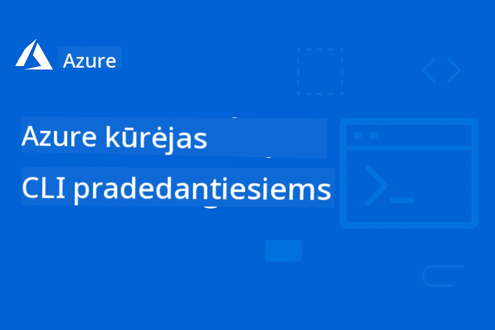

<!--
CO_OP_TRANSLATOR_METADATA:
{
  "original_hash": "ee9a026a572535444287d531dbd75d78",
  "translation_date": "2025-09-12T22:53:32+00:00",
  "source_file": "README.md",
  "language_code": "lt"
}
-->
# AZD Pradedantiesiems

 

[](https://GitHub.com/microsoft/azd-for-beginners/watchers/?WT.mc_id=academic-105485-koreyst)
[](https://GitHub.com/microsoft/azd-for-beginners/network/?WT.mc_id=academic-105485-koreyst)
[](https://GitHub.com/microsoft/azd-for-beginners/stargazers/?WT.mc_id=academic-105485-koreyst)


Sekite šiuos žingsnius, kad pradėtumėte naudotis šiais ištekliais:
1. **Fork Repozitoriją**: Spustelėkite [](https://GitHub.com/microsoft/azd-for-beginners/fork)
2. **Klonuokite Repozitoriją**:   `git clone https://github.com/microsoft/azd-for-beginners.git`
3. [**Prisijunkite prie Azure Discord bendruomenių ir susipažinkite su ekspertais bei kitais kūrėjais**](https://discord.com/invite/ByRwuEEgH4)

### Daugiakalbė Palaikymas

#### Palaikoma per GitHub Action (Automatizuota ir visada atnaujinta)

[Prancūzų](../fr/README.md) | [Ispanų](../es/README.md) | [Vokiečių](../de/README.md) | [Rusų](../ru/README.md) | [Arabų](../ar/README.md) | [Persų (Farsi)](../fa/README.md) | [Urdu](../ur/README.md) | [Kinų (Supaprastinta)](../zh/README.md) | [Kinų (Tradicinė, Makao)](../mo/README.md) | [Kinų (Tradicinė, Honkongas)](../hk/README.md) | [Kinų (Tradicinė, Taivanas)](../tw/README.md) | [Japonų](../ja/README.md) | [Korėjiečių](../ko/README.md) | [Hindi](../hi/README.md) | [Bengalų](../bn/README.md) | [Marathi](../mr/README.md) | [Nepalų](../ne/README.md) | [Pundžabi (Gurmukhi)](../pa/README.md) | [Portugalų (Portugalija)](../pt/README.md) | [Portugalų (Brazilija)](../br/README.md) | [Italų](../it/README.md) | [Lenkų](../pl/README.md) | [Turkų](../tr/README.md) | [Graikų](../el/README.md) | [Tajų](../th/README.md) | [Švedų](../sv/README.md) | [Danų](../da/README.md) | [Norvegų](../no/README.md) | [Suomių](../fi/README.md) | [Olandų](../nl/README.md) | [Hebrajų](../he/README.md) | [Vietnamiečių](../vi/README.md) | [Indoneziečių](../id/README.md) | [Malajų](../ms/README.md) | [Tagalog (Filipiniečių)](../tl/README.md) | [Svahilių](../sw/README.md) | [Vengrų](../hu/README.md) | [Čekų](../cs/README.md) | [Slovakų](../sk/README.md) | [Rumunų](../ro/README.md) | [Bulgarų](../bg/README.md) | [Serbų (Kirilica)](../sr/README.md) | [Kroatų](../hr/README.md) | [Slovėnų](../sl/README.md) | [Ukrainiečių](../uk/README.md) | [Birmos (Mianmaras)](../my/README.md)

**Jei norite pridėti papildomų vertimų, palaikomos kalbos pateiktos [čia](https://github.com/Azure/co-op-translator/blob/main/getting_started/supported-languages.md)**

## Įvadas

Sveiki atvykę į išsamų Azure Developer CLI (azd) vadovą. Šiame repozitorijoje pateikiama medžiaga, skirta padėti visų lygių kūrėjams – nuo studentų iki profesionalų – išmokti ir įvaldyti Azure Developer CLI efektyviam debesų diegimui, **ypatingą dėmesį skiriant AI programų diegimui naudojant Azure AI Foundry**. Šis struktūrizuotas mokymosi šaltinis suteikia praktinės patirties su Azure debesų diegimais, dažniausiai pasitaikančių problemų sprendimu ir geriausių praktikų įgyvendinimu sėkmingam AZD šablonų diegimui.

### **Kodėl šis vadovas svarbus AI kūrėjams**
Remiantis neseniai atlikta Azure AI Foundry Discord bendruomenės apklausa, **45% kūrėjų domisi AZD naudojimu AI darbo krūviams**, tačiau susiduria su iššūkiais:
- Sudėtingos daugiapaslaugės AI architektūros
- Geriausios praktikos AI diegimui produkcijoje
- Azure AI paslaugų integracija ir konfigūracija
- AI darbo krūvių kaštų optimizavimas
- AI specifinių diegimo problemų sprendimas

## Mokymosi Tikslai

Dirbdami su šiuo repozitoriumi, jūs:
- Įvaldysite Azure Developer CLI pagrindus ir pagrindines sąvokas
- Išmoksite diegti ir paruošti Azure išteklius naudojant infrastruktūrą kaip kodą
- Ugdysite problemų sprendimo įgūdžius, susijusius su AZD diegimo problemomis
- Suprasite prieš diegimą atliekamą patikrą ir pajėgumų planavimą
- Įgyvendinsite saugumo geriausias praktikas ir kaštų optimizavimo strategijas
- Įgysite pasitikėjimo diegiant produkcijai paruoštas programas į Azure

## Mokymosi Rezultatai

Baigę šį kursą, jūs galėsite:
- Sėkmingai įdiegti, konfigūruoti ir naudoti Azure Developer CLI
- Kurti ir diegti programas naudojant AZD šablonus
- Spręsti autentifikavimo, infrastruktūros ir diegimo problemas
- Atlikti prieš diegimą atliekamus patikrinimus, įskaitant pajėgumų planavimą ir SKU pasirinkimą
- Įgyvendinti stebėjimo, saugumo ir kaštų valdymo geriausias praktikas
- Integruoti AZD darbo eigas į CI/CD procesus

## Turinys

- [Kas yra Azure Developer CLI?](../..)
- [Greitas Pradėjimas](../..)
- [Mokymosi Kelias](../..)
  - [AI Kūrėjams (Rekomenduojama pradėti čia!)](../..)
  - [Studentams ir Pradedantiesiems](../..)
  - [Kūrėjams](../..)
  - [DevOps Inžinieriams](../..)
- [Dokumentacija](../..)
  - [Pradžia](../..)
  - [Diegimas ir Paruošimas](../..)
  - [Prieš Diegimą Atliekami Patikrinimai](../..)
  - [AI ir Azure AI Foundry](../..)
  - [Problemų Sprendimas](../..)
- [Pavyzdžiai ir Šablonai](../..)
  - [Rekomenduojami: Azure AI Foundry Šablonai](../..)
  - [Rekomenduojami: Azure AI Foundry E2E Scenarijai](../..)
  - [Papildomi AZD Šablonai](../..)
  - [Praktiniai Seminarai ir Dirbtuvės](../..)
- [Ištekliai](../..)
- [Prisidėjimas](../..)
- [Pagalba](../..)
- [Bendruomenė](../..)

## Kas yra Azure Developer CLI?

Azure Developer CLI (azd) yra kūrėjams pritaikyta komandinės eilutės sąsaja, kuri pagreitina programų kūrimo ir diegimo procesą Azure platformoje. Ji siūlo:

- **Šablonais pagrįsti diegimai** - Naudokite iš anksto paruoštus šablonus dažniausiai pasitaikančioms programų struktūroms
- **Infrastruktūra kaip kodas** - Valdykite Azure išteklius naudodami Bicep arba Terraform
- **Integruotos darbo eigos** - Sklandžiai paruoškite, diekite ir stebėkite programas
- **Draugiška kūrėjams** - Optimizuota kūrėjų produktyvumui ir patirčiai

### **AZD + Azure AI Foundry: Tobula AI Diegimams**

**Kodėl AZD AI sprendimams?** AZD sprendžia pagrindinius AI kūrėjų iššūkius:

- **AI Paruošti Šablonai** - Iš anksto sukonfigūruoti šablonai Azure OpenAI, Cognitive Services ir ML darbo krūviams
- **Saugūs AI Diegimai** - Įdiegti saugumo modeliai AI paslaugoms, API raktams ir modelių galiniams taškams
- **Produkcijos AI Modeliai** - Geriausios praktikos skalaujamiems, ekonomiškiems AI programų diegimams
- **Pilnos AI Darbo Eigos** - Nuo modelio kūrimo iki diegimo produkcijoje su tinkamu stebėjimu
- **Kaštų Optimizavimas** - Protingos išteklių paskirstymo ir skalavimo strategijos AI darbo krūviams
- **Azure AI Foundry Integracija** - Sklandus ryšys su AI Foundry modelių katalogu ir galiniais taškais

## Greitas Pradėjimas

### Reikalavimai
- Azure prenumerata
- Įdiegta Azure CLI
- Git (šablonų klonavimui)

### Diegimas
```bash
# Windows (PowerShell)
powershell -ex AllSigned -c "Invoke-RestMethod 'https://aka.ms/install-azd.ps1' | Invoke-Expression"

# macOS/Linux
curl -fsSL https://aka.ms/install-azd.sh | bash
```

### Pirmasis Diegimas
```bash
# Initialize a new project
azd init --template todo-nodejs-mongo

# Provision Azure resources and deploy
azd up
```

### Pirmasis AI Diegimas
```bash
# Initialize an AI-powered chat application with Azure OpenAI
azd init --template azure-search-openai-demo

# Configure AI services and deploy
azd up

# Or try other AI templates:
azd init --template openai-chat-app-quickstart
azd init --template ai-document-processing
azd init --template contoso-chat
```

## Mokymosi Kelias

### AI Kūrėjams (Rekomenduojama pradėti čia!)
1. **Greitas Pradėjimas**: Išbandykite [azure-search-openai-demo](https://github.com/Azure-Samples/azure-search-openai-demo) šabloną
2. **Išmokite Pagrindus**: [AZD Pagrindai](docs/getting-started/azd-basics.md) + [Azure AI Foundry Integracija](docs/ai-foundry/azure-ai-foundry-integration.md)
3. **Praktika**: Užbaikite [AI Dirbtuvių Laboratoriją](docs/ai-foundry/ai-workshop-lab.md)
4. **Produkcijos Paruošimas**: Peržiūrėkite [Produkcijos AI Geriausias Praktikas](docs/ai-foundry/production-ai-practices.md)
5. **Pažengusiems**: Diekite [contoso-chat](https://github.com/Azure-Samples/contoso-chat) įmonės šabloną

### Studentams ir Pradedantiesiems
1. Pradėkite nuo [AZD Pagrindų](docs/getting-started/azd-basics.md)
2. Sekite [Diegimo Gidą](docs/getting-started/installation.md)
3. Užbaikite [Pirmąjį Projektą](docs/getting-started/first-project.md)
4. Praktikuokitės su [Paprastos Web Programos Pavyzdžiu](../../examples/simple-web-app)

### Kūrėjams
1. Peržiūrėkite [Konfigūracijos Gidą](docs/getting-started/configuration.md)
2. Išstudijuokite [Diegimo Gidą](docs/deployment/deployment-guide.md)
3. Dirbkite su [Duomenų Bazės Programos Pavyzdžiu](../../examples/database-app)
4. Išbandykite [Konteinerių Programos Pavyzdį](../../examples/container-app)

### DevOps Inžinieriams
1. Įvaldykite [Išteklių Paruošimą](docs/deployment/provisioning.md)
2. Įgyvendinkite [Prieš Skrydį Patikrinimus](docs/pre-deployment/preflight-checks.md)
3. Praktikuokitės [Pajėgumų Planavimą](docs/pre-deployment/capacity-planning.md)
4. Pažengusiems [Mikropaslaugų Pavyzdys](../../examples/microservices)

## Dokumentacija

### Pradžia
- [**AZD Pagrindai**](docs/getting-started/azd-basics.md) - Pagrindinės sąvokos ir terminologija
- [**Diegimas ir Nustatymas**](docs/getting-started/installation.md) - Platformai specifiniai diegimo gidai
- [**Konfigūracija**](docs/getting-started/configuration.md) - Aplinkos nustatymas ir autentifikacija
- [**Pirmasis Projektas**](docs/getting-started/first-project.md) - Žingsnis po žingsnio pamoka

### Diegimas ir Paruošimas
- [**Diegimo Gidas**](docs/deployment/deployment-guide.md) - Pilnos diegimo darbo eigos
- [**Išteklių Paruošimas**](docs/deployment/provisioning.md) - Azure išteklių valdymas

### Prieš Diegimą Atliekami Patikrinimai
- [**Pajėgumų Planavimas**](docs/pre-deployment/capacity-planning.md) - Azure išteklių pajėgumų patvirtinimas
- [**SKU Pasirinkimas**](docs/pre-deployment/sku-selection.md) - Tinkamų Azure SKU pasirinkimas
- [**Prieš Skrydį Patikrinimai**](docs/pre-deployment/preflight-checks.md) - Automatiniai patvirtinimo scenarijai

### AI ir Azure AI Foundry
- [**Azure AI Foundry Integracija**](docs/ai-foundry/azure-ai-foundry-integration.md) - AZD prijungimas prie Azure AI Foundry paslaugų
- [**AI Modelių Diegimo Modeliai**](docs/ai-foundry/ai-model-deployment.md) - AI modelių diegimas ir valdymas su AZD
- [**AI Dirbtuvių Laboratorija**](docs/ai-foundry/ai-workshop-lab.md) - Praktinė laboratorija: AI sprendimų paruošimas AZD
- [**Produkcijos AI Geriausios Praktikos**](docs/ai-foundry/production-ai-practices.md) - Saugumas, skalavimas ir stebėjimas AI darbo krūviams

### Problemų Sprendimas
- [**Dažnos Problemos**](docs/troubleshooting/common-issues.md) - Dažniausiai pasitaikančios problemos ir jų sprendimai
- [**Derinimo vadovas**](docs/troubleshooting/debugging.md) - Žingsnis po žingsnio derinimo strategijos  
- [**AI-specifinis trikčių šalinimas**](docs/troubleshooting/ai-troubleshooting.md) - AI paslaugų ir modelių diegimo problemos  

## Pavyzdžiai ir šablonai  

### [Rekomenduojama: Azure AI Foundry šablonai](https://ai.azure.com/resource/build/templates)  
**Pradėkite čia, jei diegiate AI programas!**  

| Šablonas | Aprašymas | Sudėtingumas | Paslaugos |  
|----------|-------------|------------|----------|  
| [**Pradėkite nuo AI pokalbių**](https://github.com/Azure-Samples/get-started-with-ai-chat) | Sukurkite ir diekite pagrindinę pokalbių programą, integruotą su jūsų duomenimis ir telemetrijos įžvalgomis, naudodami Azure Container Apps |⭐⭐ | AzureOpenAI + Azure AI Model Inference API + Azure AI Search + Azure Container Apps + Application Insights |  
| [**Pradėkite nuo AI agentų**](https://github.com/Azure-Samples/get-started-with-ai-agents) | Sukurkite ir diekite pagrindinę agentų programą su veiksmais ir telemetrijos įžvalgomis, naudodami Azure Container Apps. |⭐⭐ | Azure AI Agent Service + AzureOpenAI + Azure AI Search + Azure Container Apps + Application Insights|  
| [**Daugiagentė darbo eigos automatizacija**](https://github.com/Azure-Samples/get-started-with-ai-chat) | Pagerinkite užduočių planavimą ir automatizavimą, koordinuodami ir valdydami AI agentų grupę.|⭐⭐⭐ | AzureOpenAI + Azure AI Agent Service + Semantic Kernel + Azure CosmosDB + Azure Container Apps|  
| [**Dokumentų generavimas iš jūsų duomenų**](https://github.com/Azure-Samples/get-started-with-ai-chat) | Paspartinkite dokumentų, tokių kaip sutartys, sąskaitos ir investicijų pasiūlymai, generavimą, surasdami ir apibendrindami svarbią informaciją iš jūsų duomenų. |⭐⭐⭐  | AzureOpenAI + Azure AI Search + Azure AI Services + Azure CosmosDB|  
| [**Pagerinkite klientų susitikimus su agentais**](https://github.com/Azure-Samples/get-started-with-ai-chat) | Perkelkite seną kodą į modernias kalbas, pasitelkdami agentų komandą. |⭐⭐⭐| AzureOpenAI + Azure AI Search + Azure CosmosDB + Azure SQL Database |  
| [**Modernizuokite savo kodą su agentais**](https://github.com/Azure-Samples/get-started-with-ai-chat) | Sukurkite ir diekite pagrindinę pokalbių programą, integruotą su jūsų duomenimis ir telemetrijos įžvalgomis, naudodami Azure Container Apps |⭐⭐⭐ | AzureOpenAI + Azure Agent Service + Semantic Kernel + Azure CosmosDB + Azure Container Apps|  
| [**Sukurkite savo pokalbių agentą**](https://github.com/Azure-Samples/get-started-with-ai-chat) | Pasinaudokite pažangiu pokalbių supratimu, kad sukurtumėte ir patobulintumėte pokalbių robotus bei agentus su deterministiniais ir žmogaus kontroliuojamais darbo procesais. |⭐⭐⭐ | AI Language + AzureOpenAI + AI Search + Azure Storage + Azure Container Registry|  
| [**Atraskite įžvalgas iš pokalbių duomenų**](https://github.com/Azure-Samples/get-started-with-ai-chat) | Pagerinkite kontaktų centro efektyvumą, atskleisdami įžvalgas iš didelių garso ir tekstinių duomenų rinkinių, naudodami pažangias turinio supratimo galimybes. |⭐⭐⭐ | AzureOpenAI + AI Search + Semantic Kernel + Azure Agent Service + AI AI Content Understanding|  
| [**Daugiarūšis turinio apdorojimas**](https://github.com/Azure-Samples/get-started-with-ai-chat) | Greitai ir tiksliai apdorokite pretenzijas, sąskaitas, sutartis ir kitus dokumentus, išskirdami informaciją iš nestruktūrizuoto turinio ir susiedami ją su struktūrizuotu formatu. Šis šablonas palaiko tekstą, vaizdus, lenteles ir grafikus. |⭐⭐⭐⭐ | AzureOpenAI + Azure Content Understanding + Azure CosmosDB + Azure Container Apps|  

### Rekomenduojama: Azure AI Foundry E2E scenarijai  
**Pradėkite čia, jei diegiate AI programas!**  

| Šablonas | Aprašymas | Sudėtingumas | Paslaugos |  
|----------|-------------|------------|----------|  
| [**openai-chat-app-quickstart**](https://github.com/Azure-Samples/openai-chat-app-quickstart) | Paprasta pokalbių sąsaja su Azure OpenAI | ⭐ | AzureOpenAI + Container Apps |  
| [**azure-search-openai-demo**](https://github.com/Azure-Samples/azure-search-openai-demo) | RAG palaikoma pokalbių programa su Azure OpenAI | ⭐⭐ | AzureOpenAI + Search + App Service |  
| [**ai-document-processing**](https://github.com/Azure-Samples/ai-document-processing) | Dokumentų analizė su AI paslaugomis | ⭐⭐ | Azure Document Intelligence + Functions |  
| [**agent-openai-python-prompty**](https://github.com/Azure-Samples/agent-openai-python-prompty) | AI agentų sistema su funkcijų iškvietimu | ⭐⭐⭐ | AzureOpenAI + Azure Container Apps + Functions |  
| [**contoso-chat**](https://github.com/Azure-Samples/contoso-chat) | Įmonės pokalbių programa su AI orkestracija | ⭐⭐⭐ | AzureOpenAI + Azure AI Search + Container Apps |  

### Papildomi AZD šablonai  
- [**Pavyzdžių katalogas**](examples/README.md) - Praktiniai pavyzdžiai, šablonai ir realūs scenarijai  
- [**Azure-Samples AZD šablonai**](https://github.com/Azure-Samples/azd-templates) - Oficialūs Microsoft pavyzdiniai šablonai  
- [**Awesome AZD galerija**](https://azure.github.io/awesome-azd/) - Bendruomenės sukurtų šablonų kolekcija  

### Praktiniai užsiėmimai ir dirbtuvės  
- [**AI dirbtuvių laboratorija**](docs/ai-foundry/ai-workshop-lab.md) - **NAUJA**: Padarykite savo AI sprendimus AZD diegiamus  
- [**AZD pradedantiesiems dirbtuvės**](workshop/README.md) - Dėmesys AI agentų AZD šablonų diegimui  

## Ištekliai  

### Greitos nuorodos  
- [**Komandų atmintinė**](resources/cheat-sheet.md) - Esminės azd komandos  
- [**Žodynas**](resources/glossary.md) - Azure ir azd terminologija  
- [**DUK**](resources/faq.md) - Dažniausiai užduodami klausimai  
- [**Mokymosi vadovas**](resources/study-guide.md) - Išsamūs mokymosi tikslai ir praktiniai pratimai  

### Išoriniai ištekliai  
- [Azure Developer CLI dokumentacija](https://learn.microsoft.com/en-us/azure/developer/azure-developer-cli/)  
- [Azure architektūros centras](https://learn.microsoft.com/en-us/azure/architecture/)  
- [Azure kainų skaičiuoklė](https://azure.microsoft.com/pricing/calculator/)  
- [Azure būklė](https://status.azure.com/)  

## Prisidėjimas  

Laukiame jūsų indėlio! Prašome perskaityti mūsų [Prisidėjimo vadovą](CONTRIBUTING.md), kuriame rasite:  
- Kaip pateikti problemas ir funkcijų užklausas  
- Kodo prisidėjimo gaires  
- Dokumentacijos tobulinimo galimybes  
- Bendruomenės standartus  

## Pagalba  

- **Problemos**: [Praneškite apie klaidas ir prašykite funkcijų](https://github.com/microsoft/azd-for-beginners/issues)  
- **Diskusijos**: [Microsoft Azure Discord bendruomenės klausimai ir diskusijos](https://discord.gg/microsoft-azure)  
- **AI-specifinė pagalba**: Prisijunkite prie [#Azure kanalo](https://discord.gg/microsoft-azure) AZD + AI Foundry diskusijoms  
- **El. paštas**: Privatiems užklausimams  
- **Microsoft Learn**: [Oficiali Azure Developer CLI dokumentacija](https://learn.microsoft.com/en-us/azure/developer/azure-developer-cli/)  

### Bendruomenės įžvalgos iš Azure AI Foundry Discord  

**Apklausos rezultatai iš #Azure kanalo:**  
- **45%** kūrėjų nori naudoti AZD AI darbo krūviams  
- **Pagrindiniai iššūkiai**: Daugiafunkcinės paslaugos diegimas, kredencialų valdymas, pasirengimas gamybai  
- **Labiausiai prašoma**: AI-specifiniai šablonai, trikčių šalinimo vadovai, geriausios praktikos  

**Prisijunkite prie mūsų bendruomenės, kad:**  
- Dalintumėtės savo AZD + AI patirtimi ir gautumėte pagalbą  
- Gaukite ankstyvą prieigą prie naujų AI šablonų  
- Prisidėtumėte prie AI diegimo geriausių praktikų  
- Darytumėte įtaką būsimoms AI + AZD funkcijų plėtrai  

## Licencija  

Šis projektas licencijuotas pagal MIT licenciją - žr. [LICENCIJA](../../LICENSE) failą, kad sužinotumėte daugiau.  

## Kiti kursai  

Mūsų komanda kuria kitus kursus! Peržiūrėkite:  

- [**NAUJA** Modelio konteksto protokolas (MCP) pradedantiesiems](https://github.com/microsoft/mcp-for-beginners?WT.mc_id=academic-105485-koreyst)  
- [AI agentai pradedantiesiems](https://github.com/microsoft/ai-agents-for-beginners?WT.mc_id=academic-105485-koreyst)  
- [Generatyvinis AI pradedantiesiems naudojant .NET](https://github.com/microsoft/Generative-AI-for-beginners-dotnet?WT.mc_id=academic-105485-koreyst)  
- [Generatyvinis AI pradedantiesiems](https://github.com/microsoft/generative-ai-for-beginners?WT.mc_id=academic-105485-koreyst)  
- [Generatyvinis AI pradedantiesiems naudojant Java](https://github.com/microsoft/generative-ai-for-beginners-java?WT.mc_id=academic-105485-koreyst)  
- [ML pradedantiesiems](https://aka.ms/ml-beginners?WT.mc_id=academic-105485-koreyst)  
- [Duomenų mokslas pradedantiesiems](https://aka.ms/datascience-beginners?WT.mc_id=academic-105485-koreyst)  
- [AI pradedantiesiems](https://aka.ms/ai-beginners?WT.mc_id=academic-105485-koreyst)  
- [Kibernetinis saugumas pradedantiesiems](https://github.com/microsoft/Security-101??WT.mc_id=academic-96948-sayoung)  
- [Web kūrimas pradedantiesiems](https://aka.ms/webdev-beginners?WT.mc_id=academic-105485-koreyst)  
- [IoT pradedantiesiems](https://aka.ms/iot-beginners?WT.mc_id=academic-105485-koreyst)  
- [XR kūrimas pradedantiesiems](https://github.com/microsoft/xr-development-for-beginners?WT.mc_id=academic-105485-koreyst)  
- [GitHub Copilot įvaldymas AI poriniam programavimui](https://aka.ms/GitHubCopilotAI?WT.mc_id=academic-105485-koreyst)  
- [GitHub Copilot įvaldymas C#/.NET kūrėjams](https://github.com/microsoft/mastering-github-copilot-for-dotnet-csharp-developers?WT.mc_id=academic-105485-koreyst)  
- [Pasirinkite savo Copilot nuotykį](https://github.com/microsoft/CopilotAdventures?WT.mc_id=academic-105485-koreyst)  

---

**Navigacija**  
- **Kita pamoka**: [AZD pagrindai](docs/getting-started/azd-basics.md)  

---

**Atsakomybės apribojimas**:  
Šis dokumentas buvo išverstas naudojant AI vertimo paslaugą [Co-op Translator](https://github.com/Azure/co-op-translator). Nors siekiame tikslumo, prašome atkreipti dėmesį, kad automatiniai vertimai gali turėti klaidų ar netikslumų. Originalus dokumentas jo gimtąja kalba turėtų būti laikomas autoritetingu šaltiniu. Kritinei informacijai rekomenduojama naudoti profesionalų žmogaus vertimą. Mes neprisiimame atsakomybės už nesusipratimus ar klaidingus interpretavimus, atsiradusius dėl šio vertimo naudojimo.