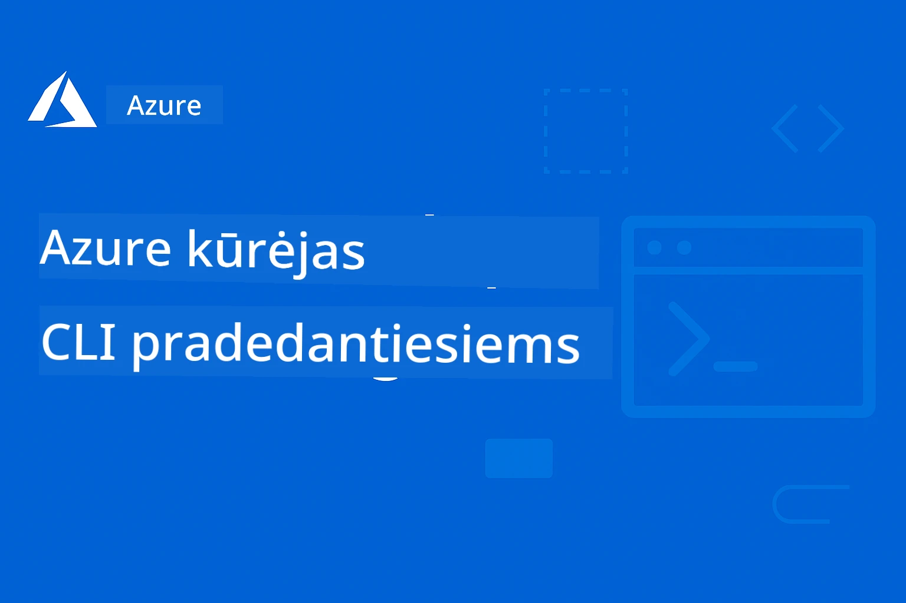

# AZD Pradedantiesiems: Struktūruota mokymosi kelionė

 

[](https://GitHub.com/microsoft/azd-for-beginners/watchers/)
[](https://GitHub.com/microsoft/azd-for-beginners/network/)
[](https://GitHub.com/microsoft/azd-for-beginners/stargazers/)

[](https://discord.com/invite/nkVh3dp)
[](https://discord.gg/nTYy5BXMWG)

---

### Automatiniai vertimai (visada atnaujinami)

<!-- CO-OP TRANSLATOR LANGUAGES TABLE START -->
[Arabic](../ar/README.md) | [Bengali](../bn/README.md) | [Bulgarian](../bg/README.md) | [Burmese (Myanmar)](../my/README.md) | [Chinese (Simplified)](../zh-CN/README.md) | [Chinese (Traditional, Hong Kong)](../zh-HK/README.md) | [Chinese (Traditional, Macau)](../zh-MO/README.md) | [Chinese (Traditional, Taiwan)](../zh-TW/README.md) | [Croatian](../hr/README.md) | [Czech](../cs/README.md) | [Danish](../da/README.md) | [Dutch](../nl/README.md) | [Estonian](../et/README.md) | [Finnish](../fi/README.md) | [French](../fr/README.md) | [German](../de/README.md) | [Greek](../el/README.md) | [Hebrew](../he/README.md) | [Hindi](../hi/README.md) | [Hungarian](../hu/README.md) | [Indonesian](../id/README.md) | [Italian](../it/README.md) | [Japanese](../ja/README.md) | [Kannada](../kn/README.md) | [Korean](../ko/README.md) | [Lithuanian](./README.md) | [Malay](../ms/README.md) | [Malayalam](../ml/README.md) | [Marathi](../mr/README.md) | [Nepali](../ne/README.md) | [Nigerian Pidgin](../pcm/README.md) | [Norwegian](../no/README.md) | [Persian (Farsi)](../fa/README.md) | [Polish](../pl/README.md) | [Portuguese (Brazil)](../pt-BR/README.md) | [Portuguese (Portugal)](../pt-PT/README.md) | [Punjabi (Gurmukhi)](../pa/README.md) | [Romanian](../ro/README.md) | [Russian](../ru/README.md) | [Serbian (Cyrillic)](../sr/README.md) | [Slovak](../sk/README.md) | [Slovenian](../sl/README.md) | [Spanish](../es/README.md) | [Swahili](../sw/README.md) | [Swedish](../sv/README.md) | [Tagalog (Filipino)](../tl/README.md) | [Tamil](../ta/README.md) | [Telugu](../te/README.md) | [Thai](../th/README.md) | [Turkish](../tr/README.md) | [Ukrainian](../uk/README.md) | [Urdu](../ur/README.md) | [Vietnamese](../vi/README.md)

> **Prefer to Clone Locally?**
>
> Šis saugykla turi 50+ kalbų vertimus, kurie gerokai padidina atsisiuntimo dydį. Norėdami klonuoti be vertimų, naudokite sparse checkout:
>
> **Bash / macOS / Linux:**
> ```bash
> git clone --filter=blob:none --sparse https://github.com/microsoft/AZD-for-beginners.git
> cd AZD-for-beginners
> git sparse-checkout set --no-cone '/*' '!translations' '!translated_images'
> ```
>
> **CMD (Windows):**
> ```cmd
> git clone --filter=blob:none --sparse https://github.com/microsoft/AZD-for-beginners.git
> cd AZD-for-beginners
> git sparse-checkout set --no-cone "/*" "!translations" "!translated_images"
> ```
>
> Tai suteiks jums viską, ko reikia kursui užbaigti, ir leis greičiau atsisiųsti.
<!-- CO-OP TRANSLATOR LANGUAGES TABLE END -->

## 🆕 Kas naujo azd šiandien

Azure Developer CLI išsiplėtė už tradicinių žiniatinklio programų ir API ribų. Dabar azd yra vienas įrankis, skirtas diegti bet kokią programą į Azure — įskaitant ir AI varomas programas bei intelektualius agentus.

Ką tai reiškia jums:

- **AI agentai dabar yra pirmos klasės azd darbo krūviai.** Galite inicijuoti, diegti ir valdyti AI agentų projektus naudodami tą pačią `azd init` → `azd up` darbo eigą, kurią jau pažįstate.
- **Microsoft Foundry integracija** leidžia modelių diegimą, agentų talpinimą ir AI paslaugų konfigūraciją tiesiogiai azd šablonų ekosistemoje.
- **Pagrindinė darbo eiga nepasikeitė.** Nesvarbu, ar diegiate todo programėlę, mikroservisą ar daugiaagentinį AI sprendimą, komandos yra tos pačios.

Jei jau naudojote azd anksčiau, AI palaikymas yra natūrali plėtra — ne atskiras įrankis ar pažengęs maršrutas. Jei pradedate nuo nulio, išmoksite vieną darbo eigą, kuri tinka viskam.

---

## 🚀 Kas yra Azure Developer CLI (azd)?

**Azure Developer CLI (azd)** yra developeriams draugiškas komandų eilutės įrankis, palengvinantis programų diegimą į Azure. Vietoje to, kad rankiniu būdu kurtumėte ir sujungtumėte dešimtis Azure išteklių, galite vienu komandu diegti visą programą.

### „azd up“ magija

```bash
# Ši viena komanda atlieka viską:
# ✅ Sukuria visus Azure išteklius
# ✅ Konfigūruoja tinklo ir saugumo nustatymus
# ✅ Sudidina jūsų programos kodą
# ✅ Diegia į Azure
# ✅ Pateikia veikiančią URL adresą
azd up
```

**Viskas!** Jokių paspaudimų Azure portale, jokių sudėtingų ARM šablonų, kuriuos reikia išmokti pirmiausia, jokių rankinių konfigūracijų — tik veikiantys sprendimai Azure.

---

## ❓ Azure Developer CLI vs Azure CLI: kuo jie skiriasi?

Tai pats dažniausias klausimas, kurį užduoda pradedantieji. Štai paprastas atsakymas:

| Feature | **Azure CLI (`az`)** | **Azure Developer CLI (`azd`)** |
|---------|---------------------|--------------------------------|
| **Purpose** | Tvarkyti atskirus Azure išteklius | Diegti pilnas programas |
| **Mindset** | Infrastruktūros orientuota | Programos orientuota |
| **Example** | `az webapp create --name myapp...` | `azd up` |
| **Learning Curve** | Reikia pažinti Azure paslaugas | Pakanka pažinti savo programą |
| **Best For** | DevOps, infrastruktūra | Kūrėjai, prototipavimas |

### Paprasta analogija

- **Azure CLI** yra tarsi turėti visus namo statybos įrankius — plaktukus, pjūklus, vinis. Galite pastatyti ką tik norite, bet reikia žinoti statybą.
- **Azure Developer CLI** yra tarsi samdyti rangovą — apibūdinate, ko norite, o jis pasirūpina statyba.

### Kada naudoti kurį

| Scenario | Use This |
|----------|----------|
| "Noriu greitai išdiegti savo žiniatinklio programą" | `azd up` |
| "Man reikia sukurti tik storage paskyrą" | `az storage account create` |
| "Kuriu visą AI programą" | `azd init --template azure-search-openai-demo` |
| "Reikia derinti konkretų Azure išteklių" | `az resource show` |
| "Noriu gamybai paruošto diegimo per kelias minutes" | `azd up --environment production` |

### Jie veikia kartu!

AZD naudoja Azure CLI kaip pagrindą. Galite naudoti abu:
```bash
# Diegkite savo programėlę naudodami AZD
azd up

# Tada tiksliai sureguliuokite konkrečius išteklius naudodami Azure CLI
az webapp config set --name myapp --always-on true
```

---

## 🌟 Raskite šablonus Awesome AZD

Nespręskite nuo nulio! **Awesome AZD** yra bendruomenės paruoštų diegti šablonų rinkinys:

| Resource | Description |
|----------|-------------|
| 🔗 [**Awesome AZD Gallery**](https://azure.github.io/awesome-azd/) | Naršykite 200+ šablonų ir diegkite vienu paspaudimu |
| 🔗 [**Submit a Template**](https://github.com/Azure/awesome-azd/issues) | Prisidėkite savo šablonu prie bendruomenės |
| 🔗 [**GitHub Repository**](https://github.com/Azure/awesome-azd) | Pažymėkite žvaigždute ir tyrinėkite šaltinį |

### Populiarūs AI šablonai iš Awesome AZD

```bash
# RAG pokalbis su Microsoft Foundry modeliais + AI paieška
azd init --template azure-search-openai-demo

# Greita AI pokalbių programa
azd init --template openai-chat-app-quickstart

# AI agentai su Foundry agentais
azd init --template get-started-with-ai-agents
```

---

## 🎯 Pradėkite per 3 žingsnius

### 1 žingsnis: įdiekite AZD (2 minutės)

**Windows:**
```powershell
winget install microsoft.azd
```

**macOS:**
```bash
brew tap azure/azd && brew install azd
```

**Linux:**
```bash
curl -fsSL https://aka.ms/install-azd.sh | bash
```

### 2 žingsnis: prisijunkite prie Azure

```bash
azd auth login
```

### 3 žingsnis: išdiekite savo pirmąją programą

```bash
# Inicializuoti iš šablono
azd init --template todo-nodejs-mongo

# Diegti į Azure (sukuria viską!)
azd up
```

**🎉 Viskas!** Jūsų programa dabar veikia Azure.

### Išvalymas (nepamirškite!)

```bash
# Remove all resources when done experimenting
azd down --force --purge
```

---

## 📚 Kaip naudotis šiuo kursu

Šis kursas sukurtas „progresyvaus mokymosi“ principu — pradėkite ten, kur jaučiatės patogiai, ir ženkite tolyn:

| Your Experience | Start Here |
|-----------------|------------|
| **Brand new to Azure** | [Chapter 1: Foundation](#-chapter-1-foundation--quick-start) |
| **Know Azure, new to AZD** | [Chapter 1: Foundation](#-chapter-1-foundation--quick-start) |
| **Want to deploy AI apps** | [Chapter 2: AI-First Development](#-chapter-2-ai-first-development-recommended-for-ai-developers) |
| **Want hands-on practice** | [🎓 Interactive Workshop](workshop/README.md) - 3-4 valandų vedamas laboratorinis darbas |
| **Need production patterns** | [Chapter 8: Production & Enterprise](#-chapter-8-production--enterprise-patterns) |

### Greitas nustatymas

1. **Šakinkite šią saugyklą**: [](https://GitHub.com/microsoft/azd-for-beginners/fork)
2. **Klonavimas**: `git clone https://github.com/YOUR-USERNAME/azd-for-beginners.git`
3. **Gaukite pagalbą**: [Azure Discord Community](https://discord.com/invite/ByRwuEEgH4)

> **Prefer to Clone Locally?**

> Šis saugykla turi 50+ kalbų vertimus, kurie gerokai padidina atsisiuntimo dydį. Norėdami klonuoti be vertimų, naudokite sparse checkout:
> ```bash
> git clone --filter=blob:none --sparse https://github.com/microsoft/AZD-for-beginners.git
> cd AZD-for-beginners
> git sparse-checkout set --no-cone '/*' '!translations' '!translated_images'
> ```
> Tai suteiks jums viską, ko reikia kursui užbaigti, ir leis greičiau atsisiųsti.


## Kurso apžvalga

Įvaldykite Azure Developer CLI (azd) per struktūrizuotas temas, sukurtas progresyviam mokymuisi. **Ypatingas dėmesys AI programų diegimui su Microsoft Foundry integracija.**

### Kodėl šis kursas svarbus šiandienos kūrėjams

Remiantis Microsoft Foundry Discord bendruomenės įžvalgomis, **45% kūrėjų nori naudoti AZD AI darbo krūviams**, tačiau susiduria su iššūkiais:
- Sudėtingos daugiaservisės AI architektūros
- Gamybai skirtos AI diegimo gerosios praktikos  
- Azure AI paslaugų integracija ir konfigūracija
- AI darbo krūvių kaštų optimizavimas
- Probleminių AI diegimų trikdymas

### Mokymosi tikslai

Baigę šį struktūrizuotą kursą, jūs:
- **Įvaldysite AZD pagrindus**: pagrindinės koncepcijos, įdiegimas ir konfigūracija
- **Išdiegsite AI programas**: naudodami AZD su Microsoft Foundry paslaugomis
- **Įgyvendinsite Infrastructure as Code**: valdysite Azure išteklius su Bicep šablonais
- **Spręsite diegimo problemas**: išspręsite dažnas problemas ir derinsite klaidas
- **Optimizuosite gamybai**: saugumas, skalavimas, stebėjimas ir sąnaudų valdymas
- **Kursite daugiaagentines sistemas**: diegsite sudėtingas AI architektūras

## 🗺️ Kurso žemėlapis: Greita navigacija pagal skyrius

Kiekvienas skyrius turi atskirą README su mokymosi tikslais, greitais pradžios vadovais ir pratimais:

| Chapter | Topic | Lessons | Duration | Complexity |
|---------|-------|---------|----------|------------|
| **[Ch 1: Foundation](docs/chapter-01-foundation/README.md)** | Getting Started | [AZD Basics](docs/chapter-01-foundation/azd-basics.md) &#124; [Installation](docs/chapter-01-foundation/installation.md) &#124; [First Project](docs/chapter-01-foundation/first-project.md) | 30-45 min | ⭐ |
| **[Skyrius 2: AI vystymas](docs/chapter-02-ai-development/README.md)** | AI pirmumo programos | [Foundry Integration](docs/chapter-02-ai-development/microsoft-foundry-integration.md) &#124; [AI Agents](docs/chapter-02-ai-development/agents.md) &#124; [Model Deployment](docs/chapter-02-ai-development/ai-model-deployment.md) &#124; [Workshop](docs/chapter-02-ai-development/ai-workshop-lab.md) | 1-2 val. | ⭐⭐ |
| **[Skyrius 3: Konfigūracija](docs/chapter-03-configuration/README.md)** | Auth & Security | [Configuration](docs/chapter-03-configuration/configuration.md) &#124; [Auth & Security](docs/chapter-03-configuration/authsecurity.md) | 45-60 min | ⭐⭐ |
| **[Skyrius 4: Infrastruktūra](docs/chapter-04-infrastructure/README.md)** | IaC & Deployment | [Deployment Guide](docs/chapter-04-infrastructure/deployment-guide.md) &#124; [Provisioning](docs/chapter-04-infrastructure/provisioning.md) | 1-1.5 val. | ⭐⭐⭐ |
| **[Skyrius 5: Multi-Agent](docs/chapter-05-multi-agent/README.md)** | AI Agent Solutions | [Retail Scenario](examples/retail-scenario.md) &#124; [Coordination Patterns](docs/chapter-06-pre-deployment/coordination-patterns.md) | 2-3 val. | ⭐⭐⭐⭐ |
| **[Skyrius 6: Pre-Deployment](docs/chapter-06-pre-deployment/README.md)** | Planning & Validation | [Preflight Checks](docs/chapter-06-pre-deployment/preflight-checks.md) &#124; [Capacity Planning](docs/chapter-06-pre-deployment/capacity-planning.md) &#124; [SKU Selection](docs/chapter-06-pre-deployment/sku-selection.md) &#124; [App Insights](docs/chapter-06-pre-deployment/application-insights.md) | 1 val. | ⭐⭐ |
| **[Skyrius 7: Troubleshooting](docs/chapter-07-troubleshooting/README.md)** | Debug & Fix | [Common Issues](docs/chapter-07-troubleshooting/common-issues.md) &#124; [Debugging](docs/chapter-07-troubleshooting/debugging.md) &#124; [AI Issues](docs/chapter-07-troubleshooting/ai-troubleshooting.md) | 1-1.5 val. | ⭐⭐ |
| **[Skyrius 8: Production](docs/chapter-08-production/README.md)** | Enterprise Patterns | [Production Practices](docs/chapter-08-production/production-ai-practices.md) | 2-3 val. | ⭐⭐⭐⭐ |
| **[🎓 Workshop](workshop/README.md)** | Hands-On Lab | [Introduction](workshop/docs/instructions/0-Introduction.md) &#124; [Selection](workshop/docs/instructions/1-Select-AI-Template.md) &#124; [Validation](workshop/docs/instructions/2-Validate-AI-Template.md) &#124; [Deconstruction](workshop/docs/instructions/3-Deconstruct-AI-Template.md) &#124; [Configuration](workshop/docs/instructions/4-Configure-AI-Template.md) &#124; [Customization](workshop/docs/instructions/5-Customize-AI-Template.md) &#124; [Teardown](workshop/docs/instructions/6-Teardown-Infrastructure.md) &#124; [Wrap-up](workshop/docs/instructions/7-Wrap-up.md) | 3-4 val. | ⭐⭐ |

**Bendra kurso trukmė:** ~10-14 val. | **Įgūdžių pažanga:** Pradedantysis → Paruoštas produkcijai

---

## 📚 Mokymosi skyriai

*Pasirinkite mokymosi kelią pagal patirties lygį ir tikslus*

### 🚀 Skyrius 1: Pagrindai ir greitas startas
**Išankstiniai reikalavimai**: Azure prenumerata, pagrindinės komandų eilutės žinios  
**Trukmė**: 30-45 minučių  
**Sudėtingumas**: ⭐

#### Ko išmoksite
- Azure Developer CLI pagrindų supratimas
- AZD diegimas jūsų platformoje
- Jūsų pirmasis sėkmingas diegimas

#### Mokymosi ištekliai
- **🎯 Pradėkite čia**: [Kas yra Azure Developer CLI?](#what-is-azure-developer-cli)
- **📖 Teorija**: [AZD pagrindai](docs/chapter-01-foundation/azd-basics.md) - Pagrindinės sąvokos ir terminai
- **⚙️ Diegimas**: [Diegimas ir nustatymas](docs/chapter-01-foundation/installation.md) - Platformos specifinės instrukcijos
- **🛠️ Praktika**: [Jūsų pirmasis projektas](docs/chapter-01-foundation/first-project.md) - Žingsnis po žingsnio vadovas
- **📋 Greita nuoroda**: [Komandų atmintinė](resources/cheat-sheet.md)

#### Praktiniai užsiėmimai
```bash
# Greitas diegimo patikrinimas
azd version

# Įdiekite savo pirmąją programą
azd init --template todo-nodejs-mongo
azd up
```

**💡 Skyrelio rezultatas**: Sėkmingai įdiekite paprastą interneto programą į Azure naudojant AZD

**✅ Sėkmės patikrinimas:**
```bash
# Baigę 1 skyrių, turėtumėte sugebėti:
azd version              # Rodo įdiegtą versiją
azd init --template todo-nodejs-mongo  # Inicializuoja projektą
azd up                  # Diegia į Azure
azd show                # Rodo veikiančios programos URL
# Programa atsidaro naršyklėje ir veikia
azd down --force --purge  # Išvalo išteklius
```

**📊 Laiko investicija:** 30-45 minučių  
**📈 Gebėjimų lygis po:** Gali savarankiškai diegti paprastas programas
**📈 Gebėjimų lygis po:** Gali savarankiškai diegti paprastas programas

---

### 🤖 Skyrius 2: AI-pirmumo vystymas (rekomenduojama AI kūrėjams)
**Išankstiniai reikalavimai**: Skyrius 1 baigtas  
**Trukmė**: 1-2 valandos  
**Sudėtingumas**: ⭐⭐

#### Ko išmoksite
- Microsoft Foundry integracija su AZD
- AI pagrįstų programų diegimas
- AI paslaugų konfigūravimo supratimas

#### Mokymosi ištekliai
- **🎯 Pradėkite čia**: [Microsoft Foundry Integracija](docs/chapter-02-ai-development/microsoft-foundry-integration.md)
- **🤖 AI agentai**: [AI agentų vadovas](docs/chapter-02-ai-development/agents.md) - Diegti intelektualius agentus su AZD
- **📖 Šablonai**: [AI modelių diegimas](docs/chapter-02-ai-development/ai-model-deployment.md) - Diegti ir valdyti AI modelius
- **🛠️ Dirbtuvės**: [AI dirbtuvių laboratorija](docs/chapter-02-ai-development/ai-workshop-lab.md) - Paruoškite savo AI sprendimus AZD
- **🎥 Interaktyvus vadovas**: [Dirbtuvių medžiaga](workshop/README.md) - Naršyklėje pagrįstas mokymasis su MkDocs * DevContainer aplinka
- **📋 Šablonai**: [Microsoft Foundry šablonai](#dirbtuvių-ištekliai)
- **📝 Pavyzdžiai**: [AZD diegimo pavyzdžiai](examples/README.md)

#### Praktiniai užsiėmimai
```bash
# Įdiekite savo pirmąją DI programą
azd init --template azure-search-openai-demo
azd up

# Išbandykite papildomas DI šablonus
azd init --template openai-chat-app-quickstart
azd init --template agent-openai-python-prompty
```

**💡 Skyrelio rezultatas**: Įdiegti ir sukonfigūruoti AI-pagrįstą pokalbių programą su RAG galimybėmis

**✅ Sėkmės patikrinimas:**
```bash
# Po antrojo skyriaus turėtumėte sugebėti:
azd init --template azure-search-openai-demo
azd up
# Išbandyti AI pokalbio sąsają
# Užduoti klausimus ir gauti dirbtinio intelekto generuotus atsakymus su šaltiniais
# Patikrinti, ar paieškos integracija veikia
azd monitor  # Patikrinti, ar Application Insights rodo telemetriją
azd down --force --purge
```

**📊 Laiko investicija:** 1-2 val.  
**📈 Gebėjimų lygis po:** Gali diegti ir konfigūruoti gamybai paruoštas AI programas  
**💰 Sąnaudų supratimas:** Suprasti $80-150/mėn kūrimo sąnaudas, $300-3500/mėn gamybos sąnaudas

#### 💰 Sąnaudų svarstymai AI diegimams

**Kūrimo aplinka (apytiksliai $80-150/mėn):**
- Microsoft Foundry modeliai (mokėkite pagal naudojimą): $0-50/mėn (priklausomai nuo žetonų naudojimo)
- AI Search (Basic tier): $75/mėn
- Container Apps (Consumption): $0-20/mėn
- Storage (Standard): $1-5/mėn

**Gamybinė aplinka (apytiksliai $300-3,500+/mėn):**
- Microsoft Foundry modeliai (PTU for consistent performance): $3,000+/mėn OR Pay-as-go with high volume
- AI Search (Standard tier): $250/mėn
- Container Apps (Dedicated): $50-100/mėn
- Application Insights: $5-50/mėn
- Storage (Premium): $10-50/mėn

**💡 Patarimai sąnaudoms optimizuoti:**
- Naudokite **Free Tier** Microsoft Foundry Models for learning (Azure OpenAI 50,000 tokens/month included)
- Vykdykite `azd down` to deallocate resources when not actively developing
- Pradėkite nuo consumption-based billing, upgrade to PTU only for production
- Naudokite `azd provision --preview` to estimate costs before deployment
- Įjunkite auto-scaling: pay only for actual usage

**Sąnaudų stebėjimas:**
```bash
# Patikrinkite numatomus mėnesinius kaštus
azd provision --preview

# Stebėkite faktines išlaidas Azure portale
az consumption budget list --resource-group <your-rg>
```

---

### ⚙️ Skyrius 3: Konfigūracija ir autentifikacija
**Išankstiniai reikalavimai**: Skyrius 1 baigtas  
**Trukmė**: 45-60 minučių  
**Sudėtingumas**: ⭐⭐

#### Ko išmoksite
- Aplinkos konfigūracija ir valdymas
- Autentifikacijos ir saugumo geriausios praktikos
- Išteklių vardinimas ir organizavimas

#### Mokymosi ištekliai
- **📖 Konfigūracija**: [Konfigūracijos vadovas](docs/chapter-03-configuration/configuration.md) - Aplinkos nustatymas
- **🔐 Saugumas**: [Autentifikacijos šablonai ir valdomoji tapatybė](docs/chapter-03-configuration/authsecurity.md) - Autentifikacijos šablonai
- **📝 Pavyzdžiai**: [Duomenų bazės programos pavyzdys](examples/database-app/README.md) - AZD duomenų bazės pavyzdžiai

#### Praktiniai užsiėmimai
- Sukonfigūruokite kelias aplinkas (dev, staging, prod)
- Nustatykite valdomos tapatybės autentifikaciją
- Įgyvendinkite aplinkai specifines konfigūracijas

**💡 Skyrelio rezultatas**: Valdyti kelias aplinkas su tinkama autentifikacija ir saugumu

---

### 🏗️ Skyrius 4: Infrastruktūra kaip kodas ir diegimas
**Išankstiniai reikalavimai**: Baigti 1-3 skyriai  
**Trukmė**: 1-1.5 val.  
**Sudėtingumas**: ⭐⭐⭐

#### Ko išmoksite
- Pažangūs diegimo šablonai
- Infrastruktūra kaip kodas naudojant Bicep
- Išteklių tiekimo strategijos

#### Mokymosi ištekliai
- **📖 Diegimas**: [Diegimo vadovas](docs/chapter-04-infrastructure/deployment-guide.md) - Visi procesai
- **🏗️ Tiekimas**: [Išteklių tiekimas](docs/chapter-04-infrastructure/provisioning.md) - Azure išteklių valdymas
- **📝 Pavyzdžiai**: [Konteinerinės programos pavyzdys](../../examples/container-app) - Programų diegimas konteineriuose

#### Praktiniai užsiėmimai
- Kurkite pasirinktines Bicep šablonus
- Diegti kelių paslaugų programas
- Įgyvendinti blue-green diegimo strategijas

**💡 Skyrelio rezultatas**: Diegti sudėtingas kelių paslaugų programas naudojant pasirinktinius infrastruktūros šablonus

---

### 🎯 Skyrius 5: Multi-agentų AI sprendimai (Pažengusiems)
**Išankstiniai reikalavimai**: Baigti 1-2 skyriai  
**Trukmė**: 2-3 val.  
**Sudėtingumas**: ⭐⭐⭐⭐

#### Ko išmoksite
- Multi-agentų architektūros šablonai
- Agentų orkestracija ir koordinavimas
- Gamybai paruošti AI diegimai

#### Mokymosi ištekliai
- **🤖 Pavyzdinis projektas**: [Mažmeninės prekybos multi-agentų sprendimas](examples/retail-scenario.md) - Pilna įgyvendinimo versija
- **🛠️ ARM šablonai**: [ARM šablonų paketas](../../examples/retail-multiagent-arm-template) - Vieno spustelėjimo diegimas
- **📖 Architektūra**: [Multi-agentų koordinavimo šablonai](docs/chapter-06-pre-deployment/coordination-patterns.md) - Šablonai

#### Praktiniai užsiėmimai
```bash
# Įdiekite visą mažmeninės prekybos daugiaagentį sprendimą
cd examples/retail-multiagent-arm-template
./deploy.sh

# Tyrinėkite agentų konfigūracijas
az deployment group show --resource-group <rg-name> --name <deployment-name>
```

**💡 Skyrelio rezultatas**: Diegti ir valdyti gamybai paruoštą multi-agentų AI sprendimą su kliento ir inventoriaus agentais

---

### 🔍 Skyrius 6: Išankstinė patikra ir planavimas prieš diegimą
**Išankstiniai reikalavimai**: Skyrius 4 baigtas  
**Trukmė**: 1 val.  
**Sudėtingumas**: ⭐⭐

#### Ko išmoksite
- Talpos planavimas ir išteklių patikra
- SKU pasirinkimo strategijos
- Išankstinės patikros ir automatizavimas

#### Mokymosi ištekliai
- **📊 Planavimas**: [Talpos planavimas](docs/chapter-06-pre-deployment/capacity-planning.md) - Išteklių patikra
- **💰 Pasirinkimas**: [SKU pasirinkimas](docs/chapter-06-pre-deployment/sku-selection.md) - Ekonomiški sprendimai
- **✅ Patikra**: [Išankstinės patikros](docs/chapter-06-pre-deployment/preflight-checks.md) - Automatizuoti skriptai

#### Praktiniai užsiėmimai
- Paleiskite talpos patikros skriptus
- Optimizuokite SKU pasirinkimus dėl sąnaudų
- Įgyvendinkite automatines išankstines patikras prieš diegimą

**💡 Skyrelio rezultatas**: Patikrinti ir optimizuoti diegimus prieš vykdymą

---

### 🚨 Skyrius 7: Trikčių šalinimas ir derinimas
**Išankstiniai reikalavimai**: Bet kuris diegimo skyrius įvykdytas  
**Trukmė**: 1-1.5 val.  
**Sudėtingumas**: ⭐⭐

#### Ko išmoksite
- Sisteminiai derinimo metodai
- Dažnos problemos ir sprendimai
- AI specifinis trikčių šalinimas

#### Mokymosi ištekliai
- **🔧 Dažnos problemos**: [Dažnos problemos](docs/chapter-07-troubleshooting/common-issues.md) - DUK ir sprendimai
- **🕵️ Derinimas**: [Derinimo vadovas](docs/chapter-07-troubleshooting/debugging.md) - Žingsnis po žingsnio strategijos
- **🤖 AI problemos**: [AI specifinis trikčių šalinimas](docs/chapter-07-troubleshooting/ai-troubleshooting.md) - AI paslaugų problemos

#### Praktiniai užsiėmimai
- Diagnostikuokite diegimo klaidas
- Išspręskite autentifikacijos problemas
- Derinkite AI paslaugų ryšio problemas

**💡 Skyrelio rezultatas**: Savarankiškai diagnozuoti ir išspręsti dažnas diegimo problemas

---

### 🏢 Skyrius 8: Gamyba ir įmonių šablonai
**Išankstiniai reikalavimai**: Baigti 1-4 skyriai  
**Trukmė**: 2-3 val.  
**Sudėtingumas**: ⭐⭐⭐⭐

#### Ko išmoksite
- Gamybinio diegimo strategijos
- Įmonių saugumo šablonai
- Stebėjimas ir sąnaudų optimizavimas

#### Mokymosi ištekliai
- **🏭 Produkcija**: [AI geriausios praktikos gamyboje](docs/chapter-08-production/production-ai-practices.md) - Įmonių modeliai
- **📝 Pavyzdžiai**: [Mikropaslaugų pavyzdys](../../examples/microservices) - Sudėtingos architektūros
- **📊 Stebėjimas**: [Application Insights integration](docs/chapter-06-pre-deployment/application-insights.md) - Stebėjimas

#### Praktinės užduotys
- Įgyvendinti įmonių saugumo modelius
- Nustatyti išsamų monitoringą
- Diegti į produkciją su tinkamu valdymu

**💡 Skyriaus rezultatas**: Diegti įmonėms paruoštas programas su pilnomis gamybinėmis galimybėmis

---

## 🎓 Dirbtuvių apžvalga: praktinė mokymosi patirtis

> **⚠️ DIRBTUVIŲ BŪKLĖ: Aktyvus vystymas**  
> Dirbtuvių medžiaga šiuo metu kuriama ir tobulinama. Pagrindiniai moduliai veikia, tačiau kai kurios pažangesnės skiltys yra neišbaigtos. Mes aktyviai dirbame, kad užbaigtume visą turinį. [Stebėti pažangą →](workshop/README.md)

### Interaktyvios dirbtuvių medžiagos
**Išsamus praktinis mokymasis su naršyklėje veikiančiais įrankiais ir vedamomis užduotimis**

Mūsų dirbtuvių medžiaga suteikia struktūrizuotą, interaktyvią mokymosi patirtį, kuri papildo aukščiau pateiktą skyrių pagrindu sudarytą mokymo programą. Dirbtuvės skirtos tiek savarankiškam mokymuisi, tiek su instruktoriaus vedimu.

#### 🛠️ Dirbtuvių ypatybės
- **Naršyklėje veikianti sąsaja**: Visos MkDocs pagrindu sukurtos dirbtuvės su paieška, kopijavimo ir temų funkcijomis
- **GitHub Codespaces integracija**: Vieno paspaudimo kūrimo aplinkos paruošimas
- **Struktūruotas mokymosi kelias**: 8 modulių vedamos užduotys (iš viso 3–4 val.)
- **Pažangi metodika**: Įvadas → Pasirinkimas → Patvirtinimas → Išardymas → Konfigūravimas → Pritaikymas → Pašalinimas → Apibendrinimas
- **Interaktyvi DevContainer aplinka**: Iš anksto sukonfigūruoti įrankiai ir priklausomybės

#### 📚 Dirbtuvių modulių struktūra
Dirbtuvės naudoja **8 modulių pažangią metodiką**, kuri nuveda jus nuo atradimo iki diegimo meistriškumo:

| Modulis | Tema | Ką darysite | Trukmė |
|--------|-------|----------------|----------|
| **0. Įvadas** | Dirbtuvių apžvalga | Suprasti mokymosi tikslus, išankstines sąlygas ir dirbtuvių struktūrą | 15 min |
| **1. Pasirinkimas** | Šablonų paieška | Išnagrinėti AZD šablonus ir pasirinkti tinkamą AI šabloną jūsų scenarijui | 20 min |
| **2. Patvirtinimas** | Diegimas ir tikrinimas | Įdiegti šabloną su `azd up` ir patikrinti, kad infrastruktūra veikia | 30 min |
| **3. Išardymas** | Suprasti struktūrą | Naudoti GitHub Copilot tyrinėti šablono architektūrą, Bicep failus ir kodo organizaciją | 30 min |
| **4. Konfigūravimas** | Detalus azure.yaml nagrinėjimas | Įvaldyti `azure.yaml` konfigūraciją, lifecycle hooks ir aplinkos kintamuosius | 30 min |
| **5. Pritaikymas** | Priderinkite sau | Įjungti AI Search, sekimą, vertinimą ir pritaikyti scenarijui | 45 min |
| **6. Pašalinimas** | Išvalymas | Saugiai pašalinti išteklius su `azd down --purge` | 15 min |
| **7. Apibendrinimas** | Tolimesni žingsniai | Peržiūrėti pasiekimus, pagrindines sąvokas ir tęsti mokymosi kelią | 15 min |

**Dirbtuvių eiga:**
```
Introduction → Selection → Validation → Deconstruction → Configuration → Customization → Teardown → Wrap-up
     ↓            ↓           ↓              ↓               ↓              ↓            ↓           ↓
  Overview    Find the     Deploy &      Explore        Master         Customize     Clean up    Review &
             right        verify        code &        azure.yaml      for your      resources   next steps
             template                   structure                     scenario
```

#### 🚀 Kaip pradėti dirbtuves
```bash
# Parinktis 1: GitHub Codespaces (rekomenduojama)
# Spustelėkite "Code" → "Create codespace on main" saugykloje

# Parinktis 2: Vietinis vystymas
git clone https://github.com/microsoft/azd-for-beginners.git
cd azd-for-beginners/workshop
# Sekite sąrankos instrukcijas faile workshop/README.md
```

#### 🎯 Dirbtuvių mokymosi rezultatai
Baigę dirbtuves, dalyviai:
- **Diegti gamybos AI taikomąsias programas**: Naudoti AZD su Microsoft Foundry paslaugomis
- **Valdyti daugiaagentines architektūras**: Įgyvendinti koordinuotas AI agentų sprendimus
- **Įgyvendinti saugumo gerąsias praktikas**: Konfigūruoti autentifikaciją ir prieigos valdymą
- **Optimizuoti mastelį**: Kurti ekonomiškus, našius diegimus
- **Išspręsti diegimo problemas**: Nepriklausomai spręsti dažniausias problemas

#### 📖 Dirbtuvių ištekliai
- **🎥 Interaktyvus vadovas**: [Dirbtuvių medžiaga](workshop/README.md) - Naršyklėje veikianti mokymosi aplinka
- **📋 Modulis po modulio instrukcijos**:
  - [0. Įvadas](workshop/docs/instructions/0-Introduction.md) - Dirbtuvių apžvalga ir tikslai
  - [1. Pasirinkimas](workshop/docs/instructions/1-Select-AI-Template.md) - Raskite ir pasirinkite AI šablonus
  - [2. Patvirtinimas](workshop/docs/instructions/2-Validate-AI-Template.md) - Įdiegti ir patikrinti šablonus
  - [3. Išardymas](workshop/docs/instructions/3-Deconstruct-AI-Template.md) - Tyrinėkite šablono architektūrą
  - [4. Konfigūravimas](workshop/docs/instructions/4-Configure-AI-Template.md) - Įvaldykite azure.yaml
  - [5. Pritaikymas](workshop/docs/instructions/5-Customize-AI-Template.md) - Pritaikyti scenarijui
  - [6. Pašalinimas](workshop/docs/instructions/6-Teardown-Infrastructure.md) - Išvalyti išteklius
  - [7. Apibendrinimas](workshop/docs/instructions/7-Wrap-up.md) - Peržiūra ir tolesni žingsniai
- **🛠️ AI dirbtuvių laboratorija**: [AI Workshop Lab](docs/chapter-02-ai-development/ai-workshop-lab.md) - Užduotys, orientuotos į AI
- **💡 Greitas startas**: [Workshop Setup Guide](workshop/README.md#quick-start) - Aplinkos konfigūracija

**Puikiai tinka**: Įmonių mokymams, universitetų kursams, savarankiškam mokymuisi ir kūrėjų stovykloms.

---

## 📖 Gilus panirimas: AZD galimybės

Be pagrindų, AZD suteikia galingas funkcijas gamybos diegimams:

- **Diegimai pagal šablonus** - Naudokite iš anksto paruoštus šablonus dažnai pasitaikančioms programų struktūroms
- **Infrastruktūra kaip kodas** - Valdykite Azure išteklius naudodami Bicep arba Terraform  
- **Integruotos darbo eigos** - Sklandžiai paruošti, diegti ir stebėti programas
- **Draugiškas kūrėjui** - Optimizuotas kūrėjo produktyvumui ir patirčiai

### **AZD + Microsoft Foundry: Puikiai tinka AI diegimams**

**Kodėl AZD AI sprendimams?** AZD sprendžia pagrindines problemas, su kuriomis susiduria AI kūrėjai:

- **AI paruošti šablonai** - Iš anksto sukonfigūruoti šablonai Microsoft Foundry modeliams, Cognitive Services ir ML darbo krūviams
- **Saugūs AI diegimai** - Įdiegti saugumo modeliai AI paslaugoms, API raktams ir modelio galiniams taškams  
- **Gamybiniai AI modeliai** - Geriausios praktikos masteliui, ekonomiškam AI taikomųjų programų diegimui
- **Nuo galo iki galo AI darbo eigos** - Nuo modelio kūrimo iki diegimo gamyboje su tinkamu stebėjimu
- **Kaštų optimizavimas** - Išmanus išteklių paskirstymas ir mastelio keitimo strategijos AI darbo krūviams
- **Microsoft Foundry integracija** - Sklandi sąsaja su Microsoft Foundry modelių katalogu ir galiniais taškais

---

## 🎯 Šablonų ir pavyzdžių biblioteka

### Rekomenduojama: Microsoft Foundry šablonai
**Pradėkite čia, jei diegiate AI programas!**

> **Pastaba:** Šie šablonai demonstruoja įvairius AI modelius. Kai kurie yra išoriniai Azure pavyzdžiai, kiti – vietiniai įgyvendinimai.

| Šablonas | Skyrius | Sudėtingumas | Paslaugos | Tipas |
|----------|---------|------------|----------|------|
| [**Pradėkite su AI pokalbiu**](https://github.com/Azure-Samples/get-started-with-ai-chat) | Skyrius 2 | ⭐⭐ | AzureOpenAI + Azure AI Model Inference API + Azure AI Search + Azure Container Apps + Application Insights | Išorinis |
| [**Pradėkite su AI agentais**](https://github.com/Azure-Samples/get-started-with-ai-agents) | Skyrius 2 | ⭐⭐ | Foundry Agents + AzureOpenAI + Azure AI Search + Azure Container Apps + Application Insights| Išorinis |
| [**Azure Search + OpenAI demonstracija**](https://github.com/Azure-Samples/azure-search-openai-demo) | Skyrius 2 | ⭐⭐ | AzureOpenAI + Azure AI Search + App Service + Storage | Išorinis |
| [**OpenAI pokalbių programos greitas pradėjimas**](https://github.com/Azure-Samples/openai-chat-app-quickstart) | Skyrius 2 | ⭐ | AzureOpenAI + Container Apps + Application Insights | Išorinis |
| [**Agent OpenAI Python Prompty**](https://github.com/Azure-Samples/agent-openai-python-prompty) | Skyrius 5 | ⭐⭐⭐ | AzureOpenAI + Azure Functions + Prompty | Išorinis |
| [**Contoso Chat RAG**](https://github.com/Azure-Samples/contoso-chat) | Skyrius 8 | ⭐⭐⭐⭐ | AzureOpenAI + AI Search + Cosmos DB + Container Apps | Išorinis |
| [**Mažmeninės prekybos daugiaagentis sprendimas**](examples/retail-scenario.md) | Skyrius 5 | ⭐⭐⭐⭐ | AzureOpenAI + AI Search + Storage + Container Apps + Cosmos DB | **Vietinis** |

### Rekomenduojama: Išsamios mokymosi scenarijos
**Gamybai paruošti programų šablonai, susieti su mokymosi skyriais**

| Šablonas | Mokymosi skyrius | Sudėtingumas | Pagrindinės žinios |
|----------|------------------|------------|--------------|
| [**openai-chat-app-quickstart**](https://github.com/Azure-Samples/openai-chat-app-quickstart) | Skyrius 2 | ⭐ | Paprasti AI diegimo modeliai |
| [**azure-search-openai-demo**](https://github.com/Azure-Samples/azure-search-openai-demo) | Skyrius 2 | ⭐⭐ | RAG įgyvendinimas su Azure AI Search |
| [**ai-document-processing**](https://github.com/Azure-Samples/ai-document-processing) | Skyrius 4 | ⭐⭐ | Dokumentų intelekto integracija |
| [**agent-openai-python-prompty**](https://github.com/Azure-Samples/agent-openai-python-prompty) | Skyrius 5 | ⭐⭐⭐ | Agentų sistema ir funkcijų kvietimas |
| [**contoso-chat**](https://github.com/Azure-Samples/contoso-chat) | Skyrius 8 | ⭐⭐⭐ | Įmonių lygmens AI orkestracija |
| [**retail-multi-agent-solution**](examples/retail-scenario.md) | Skyrius 5 | ⭐⭐⭐⭐ | Daugiaagentė architektūra su Kliento ir Inventoriaus agentais |

### Mokymasis pagal pavyzdžių tipą

> **📌 Vietiniai vs. Išoriniai pavyzdžiai:**  
> **Vietiniai pavyzdžiai** (šiame repozitorijoje) = Paruošti naudoti iš karto  
> **Išoriniai pavyzdžiai** (Azure Samples) = Nukopijuokite iš susietų repozitorijų

#### Vietiniai pavyzdžiai (paruošta naudoti)
- [**Mažmeninės prekybos daugiaagentis sprendimas**](examples/retail-scenario.md) - Visavertis gamybai paruoštas įgyvendinimas su ARM šablonais
  - Daugiaagentė architektūra (Klientas + Inventoriaus agentai)
  - Išsamus stebėjimas ir vertinimas
  - Vieno paspaudimo diegimas per ARM šabloną

#### Vietiniai pavyzdžiai - konteinerių programos (Skyriai 2–5)
**Išsamūs konteinerių diegimo pavyzdžiai šiame repozitorije:**
- [**Konteinerių programų pavyzdžiai**](examples/container-app/README.md) - Išsamus vadovas konteinerizuotam diegimui
  - [Paprasta Flask API](../../examples/container-app/simple-flask-api) - Pagrindinė REST API su scale-to-zero
  - [Mikropaslaugų architektūra](../../examples/container-app/microservices) - Gamybai paruoštas daugiaservis diegimas
  - Greitas startas, Produkcija ir Pažangūs diegimo modeliai
  - Stebėjimas, saugumas ir kaštų optimizavimo gairės

#### Išoriniai pavyzdžiai - paprastos programos (Skyriai 1–2)
Nukopijuokite šias Azure Samples repozitorijas, kad pradėtumėte:
- [Paprasta web programa - Node.js + MongoDB](https://github.com/Azure-Samples/todo-nodejs-mongo) - Pagrindiniai diegimo modeliai
- [Statinis tinklapis - React SPA](https://github.com/Azure-Samples/todo-csharp-sql-swa-func) - Statinio turinio diegimas
- [Konteinerio programa - Python Flask](https://github.com/Azure-Samples/container-apps-store-api-microservice) - REST API diegimas

#### Išoriniai pavyzdžiai - duomenų bazių integracija (Skyriai 3–4)  
- [Duomenų bazės programa - C# + SQL](https://github.com/Azure-Samples/todo-csharp-sql) - Duomenų bazės jungties modeliai
- [Functions + Cosmos DB](https://github.com/Azure-Samples/todo-python-mongo-swa-func) - Serverless duomenų darbo eiga

#### Išoriniai pavyzdžiai - pažangūs modeliai (Skyriai 4–8)
- [Java Microservices](https://github.com/Azure-Samples/java-microservices-aca-lab) - Daugiaservis architektūros
- [Container Apps Jobs](https://github.com/Azure-Samples/container-apps-jobs) - Fono apdorojimas  
- [Enterprise ML Pipeline](https://github.com/Azure-Samples/mlops-v2) - Gamybai paruošti ML modeliai

### Išorinės šablonų kolekcijos
- [**Oficiali AZD šablonų galerija**](https://azure.github.io/awesome-azd/) - Kruopščiai atrinkta oficialių ir bendruomenės šablonų kolekcija
- [**Azure Developer CLI šablonai**](https://learn.microsoft.com/en-us/azure/developer/azure-developer-cli/azd-templates) - Microsoft Learn šablonų dokumentacija
- [**Pavyzdžių katalogas**](examples/README.md) - Vietiniai mokymosi pavyzdžiai su išsamiais paaiškinimais

---

## 📚 Mokymosi ištekliai ir nuorodos

### Greitos nuorodos
- [**Komandų atmintinė**](resources/cheat-sheet.md) - Būtinos azd komandos, suskirstytos pagal skyrių
- [**Sąvokynas**](resources/glossary.md) - Azure ir azd terminai  
- [**DUK**](resources/faq.md) - Dažnai užduodami klausimai, suskirstyti pagal mokymosi skyrių
- [**Studijų vadovas**](resources/study-guide.md) - Išsamios praktinės užduotys

### Praktinės dirbtuvės
- [**AI dirbtuvių laboratorija**](docs/chapter-02-ai-development/ai-workshop-lab.md) - Padarykite savo AI sprendimus pritaikomus AZD diegimui (2–3 val.)
- [**Interaktyvios dirbtuvės**](workshop/README.md) - 8 modulių vedamos užduotys su MkDocs ir GitHub Codespaces
  - Sekama: Įvadas → Pasirinkimas → Patvirtinimas → Išardymas → Konfigūravimas → Pritaikymas → Pašalinimas → Apibendrinimas

### Išoriniai mokymosi ištekliai
- [Azure Developer CLI dokumentacija](https://learn.microsoft.com/en-us/azure/developer/azure-developer-cli/)
- [Azure architektūros centras](https://learn.microsoft.com/en-us/azure/architecture/)
- [Azure kainodaros skaičiuoklė](https://azure.microsoft.com/pricing/calculator/)
- [Azure būsena](https://status.azure.com/)

### AI agentų įgūdžiai jūsų redaktoriui
- [**Microsoft Azure Skills on skills.sh**](https://skills.sh/microsoft/github-copilot-for-azure) - 37 atviri agentų įgūdžiai Azure AI, Foundry, diegimo, diagnostikos, kaštų optimizavimo ir kt. srityse. Įdiekite juos į GitHub Copilot, Cursor, Claude Code arba bet kurį palaikomą agentą:
  ```bash
  npx skills add microsoft/github-copilot-for-azure
  ```

---

## 🔧 Greitas trikčių šalinimo vadovas

**Dažnos problemos, su kuriomis susiduria pradedantieji, ir greiti sprendimai:**

<details>
<summary><strong>❌ "azd: command not found"</strong></summary>

```bash
# Pirmiausia įdiekite AZD
# Windows (PowerShell):
winget install microsoft.azd

# macOS:
brew tap azure/azd && brew install azd

# Linux:
curl -fsSL https://aka.ms/install-azd.sh | bash

# Patikrinkite diegimą
azd version
```
</details>

<details>
<summary><strong>❌ "No subscription found" or "Subscription not set"</strong></summary>

```bash
# Išvardyti galimas prenumeratas
az account list --output table

# Nustatyti numatytąją prenumeratą
az account set --subscription "<subscription-id-or-name>"

# Nustatyti AZD aplinkai
azd env set AZURE_SUBSCRIPTION_ID "<subscription-id>"

# Patikrinti
az account show
```
</details>

<details>
<summary><strong>❌ "InsufficientQuota" or "Quota exceeded"</strong></summary>

```bash
# Išbandykite kitą Azure regioną
azd env set AZURE_LOCATION "westus2"
azd up

# Arba naudokite mažesnius SKU vystymo metu
# Redaguokite infra/main.parameters.json:
{
  "sku": "B1"  // Instead of "P1V2"
}
```
</details>

<details>
<summary><strong>❌ "azd up" fails halfway through</strong></summary>

```bash
# Parinktis 1: Išvalyti ir bandyti dar kartą
azd down --force --purge
azd up

# Parinktis 2: Tiesiog sutvarkyti infrastruktūrą
azd provision

# Parinktis 3: Patikrinti detalią būseną
azd show

# Parinktis 4: Patikrinti žurnalus Azure Monitor
azd monitor --logs
```
</details>

<details>
<summary><strong>❌ "Authentication failed" or "Token expired"</strong></summary>

```bash
# Autentifikuokitės iš naujo
az logout
az login

azd auth logout
azd auth login

# Patikrinkite autentifikaciją
az account show
```
</details>

<details>
<summary><strong>❌ "Resource already exists" or naming conflicts</strong></summary>

```bash
# AZD generuoja unikalius pavadinimus, bet jei konfliktas:
azd down --force --purge

# Tada bandykite iš naujo su nauja aplinka
azd env new dev-v2
azd up
```
</details>

<details>
<summary><strong>❌ Template deployment taking too long</strong></summary>

**Įprastas laukimo laikas:**
- Paprasta internetinė programa: 5-10 minučių
- Programa su duomenų baze: 10-15 minučių
- AI programos: 15-25 minučių (OpenAI išteklių suteikimas yra lėtas)

```bash
# Patikrinkite pažangą
azd show

# Jei užstrigote daugiau nei 30 minučių, patikrinkite Azure portalą:
azd monitor
# Ieškokite nepavykusių diegimų
```
</details>

<details>
<summary><strong>❌ "Permission denied" or "Forbidden"</strong></summary>

```bash
# Patikrinkite savo Azure rolę
az role assignment list --assignee $(az account show --query user.name -o tsv)

# Jums reikalinga bent "Contributor" rolė
# Paprašykite savo Azure administratoriaus suteikti:
# - Contributor (resursams)
# - User Access Administrator (vaidmenų priskyrimams)
```
</details>

<details>
<summary><strong>❌ Can't find deployed application URL</strong></summary>

```bash
# Rodyti visus paslaugų galinius taškus
azd show

# Arba atidarykite Azure portalą
azd monitor

# Patikrinkite konkrečią paslaugą
azd env get-values
# Ieškokite *_URL kintamųjų
```
</details>

### 📚 Išsamūs trikčių šalinimo ištekliai

- **Dažnų problemų vadovas:** [Išsamūs sprendimai](docs/chapter-07-troubleshooting/common-issues.md)
- **AI specifinės problemos:** [AI trikčių šalinimas](docs/chapter-07-troubleshooting/ai-troubleshooting.md)
- **Derinimo vadovas:** [Žingsnis po žingsnio derinimas](docs/chapter-07-troubleshooting/debugging.md)
- **Gaukite pagalbą:** [Azure Discord](https://discord.gg/microsoft-azure) #azure-developer-cli

---

## 🎓 Kurso baigimas ir sertifikavimas

### Progreso sekimas
Sekite savo mokymosi pažangą kiekviename skyriuje:

- [ ] **1 skyrius**: Pagrindai ir greitas pradėjimas ✅
- [ ] **2 skyrius**: DI orientuotas kūrimas ✅  
- [ ] **3 skyrius**: Konfigūracija ir autentifikavimas ✅
- [ ] **4 skyrius**: Infrastruktūra kaip kodas ir diegimas ✅
- [ ] **5 skyrius**: Daugiagentiniai DI sprendimai ✅
- [ ] **6 skyrius**: Patikra ir planavimas prieš diegimą ✅
- [ ] **7 skyrius**: Trikčių šalinimas ir derinimas ✅
- [ ] **8 skyrius**: Produkciniai ir įmonių modeliai ✅

### Mokymosi patikra
Baigus kiekvieną skyrių, patikrinkite savo žinias atlikdami:
1. **Praktinė užduotis**: Atlikite skyriaus praktinį diegimą
2. **Žinių patikra**: Peržiūrėkite DUK skirsnį savo skyriui
3. **Bendruomenės diskusija**: Pasidalykite savo patirtimi Azure Discord
4. **Kitas skyrius**: Pereikite prie aukštesnio sudėtingumo lygio

### Nauda baigus kursą
Baigę visus skyrius, jūs turėsite:
- **Gamybinė patirtis**: Išdiegėte tikras DI programas Azure
- **Profesiniai įgūdžiai**: Gebėjimas diegti sprendimus įmonės lygmenyje  
- **Bendruomenės pripažinimas**: Aktyvus Azure kūrėjų bendruomenės narys
- **Karjeros augimas**: Paklausi AZD ir DI diegimo ekspertizė

---

## 🤝 Bendruomenė ir palaikymas

### Gaukite pagalbą ir palaikymą
- **Techninės problemos:** [Praneškite apie klaidas ir prašykite funkcijų](https://github.com/microsoft/azd-for-beginners/issues)
- **Mokymosi klausimai:** [Microsoft Azure Discord bendruomenė](https://discord.gg/microsoft-azure) ir [](https://discord.gg/nTYy5BXMWG)
- **DI specifinė pagalba:** Prisijunkite prie [](https://discord.gg/nTYy5BXMWG)
- **Dokumentacija:** [Oficiali Azure Developer CLI dokumentacija](https://learn.microsoft.com/en-us/azure/developer/azure-developer-cli/)

### Bendruomenės įžvalgos iš Microsoft Foundry Discord

**Paskutiniai apklausos rezultatai iš #Azure kanalo:**
- **45%** kūrėjų nori naudoti AZD DI apkrovoms
- **Pagrindinės problemos**: kelių paslaugų diegimai, kredencialų valdymas, pasirengimas gamybai  
- **Dažniausiai prašoma**: DI specifiniai šablonai, trikčių šalinimo vadovai, geriausios praktikos

**Prisijunkite prie mūsų bendruomenės, kad:**
- Dalintumėtės savo AZD + DI patirtimi ir gautumėte pagalbą
- Gautumėte prieigą prie ankstyvųjų naujų DI šablonų peržiūrų
- Prisidėtumėte prie DI diegimo geriausių praktikų
- Įtakotumėte būsimų DI + AZD funkcijų kūrimą

### Prisidėjimas prie kurso
Kviečiame prisidėti! Prašome perskaityti mūsų [Prisidėjimo vadovą](CONTRIBUTING.md) dėl informacijos apie:
- **Turinio patobulinimai:** Pagerinkite esamus skyrius ir pavyzdžius
- **Nauji pavyzdžiai:** Pridėkite realaus pasaulio scenarijus ir šablonus  
- **Vertimas:** Pagalba palaikyti daugiakalbį turinį
- **Klaidų pranešimai:** Pagerinkite tikslumą ir aiškumą
- **Bendruomenės standartai:** Laikykitės mūsų įtraukiančių bendruomenės gairių

---

## 📄 Kurso informacija

### Licencija
Šis projektas licencijuotas pagal MIT licenciją - žr. [LICENSE](../../LICENSE) failą dėl detalių.

### Susiję Microsoft mokymosi ištekliai

Mūsų komanda rengia kitus išsamius mokymosi kursus:

<!-- CO-OP TRANSLATOR OTHER COURSES START -->
### LangChain
[](https://aka.ms/langchain4j-for-beginners)
[](https://aka.ms/langchainjs-for-beginners?WT.mc_id=m365-94501-dwahlin)
[](https://github.com/microsoft/langchain-for-beginners?WT.mc_id=m365-94501-dwahlin)
---

### Azure / Edge / MCP / Agentai
[](https://github.com/microsoft/AZD-for-beginners?WT.mc_id=academic-105485-koreyst)
[](https://github.com/microsoft/edgeai-for-beginners?WT.mc_id=academic-105485-koreyst)
[](https://github.com/microsoft/mcp-for-beginners?WT.mc_id=academic-105485-koreyst)
[](https://github.com/microsoft/ai-agents-for-beginners?WT.mc_id=academic-105485-koreyst)

---
 
### Generatyvinė DI serija
[](https://github.com/microsoft/generative-ai-for-beginners?WT.mc_id=academic-105485-koreyst)
[-9333EA?style=for-the-badge&labelColor=E5E7EB&color=9333EA)](https://github.com/microsoft/Generative-AI-for-beginners-dotnet?WT.mc_id=academic-105485-koreyst)
[-C084FC?style=for-the-badge&labelColor=E5E7EB&color=C084FC)](https://github.com/microsoft/generative-ai-for-beginners-java?WT.mc_id=academic-105485-koreyst)
[-E879F9?style=for-the-badge&labelColor=E5E7EB&color=E879F9)](https://github.com/microsoft/generative-ai-with-javascript?WT.mc_id=academic-105485-koreyst)

---
 
### Pagrindiniai mokymai
[](https://aka.ms/ml-beginners?WT.mc_id=academic-105485-koreyst)
[](https://aka.ms/datascience-beginners?WT.mc_id=academic-105485-koreyst)
[](https://aka.ms/ai-beginners?WT.mc_id=academic-105485-koreyst)
[](https://github.com/microsoft/Security-101?WT.mc_id=academic-96948-sayoung)
[](https://aka.ms/webdev-beginners?WT.mc_id=academic-105485-koreyst)
[](https://aka.ms/iot-beginners?WT.mc_id=academic-105485-koreyst)
[](https://github.com/microsoft/xr-development-for-beginners?WT.mc_id=academic-105485-koreyst)

---
 
### Copilot serija
[](https://aka.ms/GitHubCopilotAI?WT.mc_id=academic-105485-koreyst)
[](https://github.com/microsoft/mastering-github-copilot-for-dotnet-csharp-developers?WT.mc_id=academic-105485-koreyst)
[](https://github.com/microsoft/CopilotAdventures?WT.mc_id=academic-105485-koreyst)
<!-- CO-OP TRANSLATOR OTHER COURSES END -->

---

## 🗺️ Kurso naršymas

**🚀 Pasiruošę pradėti mokytis?**

**Pradedantiesiems**: Pradėkite nuo [1 skyrius: Pagrindai ir greitas pradėjimas](#-chapter-1-foundation--quick-start)  
**AI kūrėjai**: Pereikite į [2 skyrius: Vystymas, orientuotas į DI](#-chapter-2-ai-first-development-recommended-for-ai-developers)  
**Patyrę kūrėjai**: Pradėkite nuo [3 skyrius: Konfigūracija ir autentifikacija](#️-chapter-3-configuration--authentication)

**Kiti žingsniai**: [Pradėti 1 skyrių - AZD pagrindai](docs/chapter-01-foundation/azd-basics.md) →

---

<!-- CO-OP TRANSLATOR DISCLAIMER START -->
**Atsakomybės apribojimas**:
Šis dokumentas buvo išverstas naudojant dirbtinio intelekto vertimo paslaugą [Co-op Translator](https://github.com/Azure/co-op-translator). Nors siekiame tikslumo, atkreipkite dėmesį, kad automatiniai vertimai gali turėti klaidų ar netikslumų. Originalų dokumentą jo gimtąja kalba reikėtų laikyti pagrindiniu šaltiniu. Dėl svarbios informacijos rekomenduojamas profesionalus (žmogaus) vertimas. Mes neprisiimame atsakomybės už bet kokius nesusipratimus ar neteisingas interpretacijas, kylančias dėl šio vertimo naudojimo.
<!-- CO-OP TRANSLATOR DISCLAIMER END -->