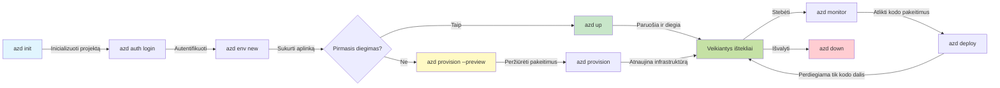
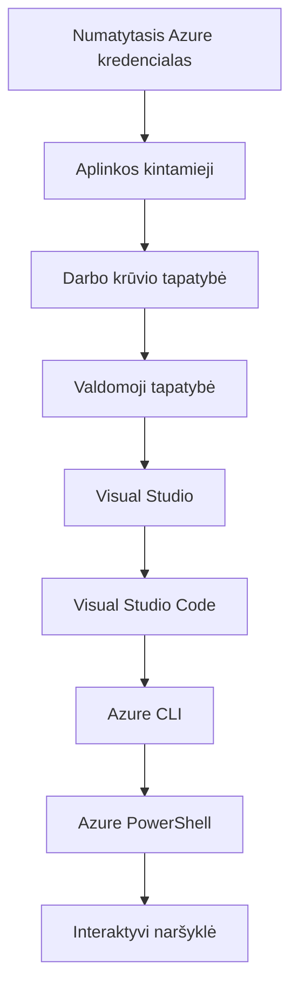

# AZD Basics - Supratimas apie Azure Developer CLI

# AZD Basics - Pagrindinės sąvokos ir pagrindai

**Chapter Navigation:**
- **📚 Course Home**: [AZD For Beginners](../../README.md)
- **📖 Current Chapter**: Chapter 1 - Foundation & Quick Start
- **⬅️ Previous**: [Course Overview](../../README.md#-chapter-1-foundation--quick-start)
- **➡️ Next**: [Installation & Setup](installation.md)
- **🚀 Next Chapter**: [Chapter 2: AI-First Development](../chapter-02-ai-development/microsoft-foundry-integration.md)

## Introduction

Ši pamoka supažindins jus su Azure Developer CLI (azd) — galingu komandine eilute dirbančiu įrankiu, kuris pagreitina jūsų kelią nuo vietinio vystymo iki diegimo Azure. Sužinosite pagrindines sąvokas, pagrindines funkcijas ir suprasite, kaip azd supaprastina debesų natyvių programų diegimą.

## Learning Goals

Pamokos pabaigoje jūs:
- Suprasite, kas yra Azure Developer CLI ir jo pagrindinė paskirtis
- Išmoksite pagrindines šablonų, aplinkų ir paslaugų sąvokas
- Išnagrinėsite pagrindines funkcijas, įskaitant šablonais pagrįstą vystymą ir Infrastruktūrą kaip Kodą
- Suprasite azd projekto struktūrą ir darbo eigą
- Būsite pasiruošę įdiegti ir konfigūruoti azd savo vystymo aplinkai

## Learning Outcomes

Baigę šią pamoką galėsite:
- Paaiškinti azd vaidmenį šiuolaikiniuose debesų vystymo darbo srautuose
- Nustatyti azd projekto struktūros komponentus
- Apibūdinti, kaip šablonai, aplinkos ir paslaugos veikia kartu
- Suprasti Infrastruktūros kaip Kodo privalumus naudojant azd
- Atpažinti įvairias azd komandas ir jų paskirtį

## What is Azure Developer CLI (azd)?

Azure Developer CLI (azd) yra komandine eilute valdoma priemonė, sukurta pagreitinti jūsų kelią nuo vietinio vystymo iki diegimo Azure. Ji supaprastina debesų natyvių programų kūrimą, diegimą ir valdymą Azure.

### 🎯 Kodėl naudoti AZD? Palyginimas iš realaus gyvenimo

Palyginkime paprasto žiniatinklio programos su duomenų baze diegimą:

#### ❌ BE AZD: Rankinis Azure diegimas (30+ minučių)

```bash
# 1 žingsnis: Sukurkite išteklių grupę
az group create --name myapp-rg --location eastus

# 2 žingsnis: Sukurkite App Service planą
az appservice plan create --name myapp-plan \
  --resource-group myapp-rg \
  --sku B1 --is-linux

# 3 žingsnis: Sukurkite Web App
az webapp create --name myapp-web-unique123 \
  --resource-group myapp-rg \
  --plan myapp-plan \
  --runtime "NODE:18-lts"

# 4 žingsnis: Sukurkite Cosmos DB paskyrą (10–15 minučių)
az cosmosdb create --name myapp-cosmos-unique123 \
  --resource-group myapp-rg \
  --kind MongoDB

# 5 žingsnis: Sukurkite duomenų bazę
az cosmosdb mongodb database create \
  --account-name myapp-cosmos-unique123 \
  --resource-group myapp-rg \
  --name tododb

# 6 žingsnis: Sukurkite kolekciją
az cosmosdb mongodb collection create \
  --account-name myapp-cosmos-unique123 \
  --resource-group myapp-rg \
  --database-name tododb \
  --name todos

# 7 žingsnis: Gaukite prisijungimo eilutę
CONN_STR=$(az cosmosdb keys list \
  --name myapp-cosmos-unique123 \
  --resource-group myapp-rg \
  --type connection-strings \
  --query "connectionStrings[0].connectionString" -o tsv)

# 8 žingsnis: Konfigūruokite programos nustatymus
az webapp config appsettings set \
  --name myapp-web-unique123 \
  --resource-group myapp-rg \
  --settings MONGODB_URI="$CONN_STR"

# 9 žingsnis: Įjunkite žurnalavimą
az webapp log config --name myapp-web-unique123 \
  --resource-group myapp-rg \
  --application-logging filesystem \
  --detailed-error-messages true

# 10 žingsnis: Nustatykite Application Insights
az monitor app-insights component create \
  --app myapp-insights \
  --location eastus \
  --resource-group myapp-rg

# 11 žingsnis: Susiekite App Insights su Web App
INSTRUMENTATION_KEY=$(az monitor app-insights component show \
  --app myapp-insights \
  --resource-group myapp-rg \
  --query "instrumentationKey" -o tsv)

az webapp config appsettings set \
  --name myapp-web-unique123 \
  --resource-group myapp-rg \
  --settings APPINSIGHTS_INSTRUMENTATIONKEY="$INSTRUMENTATION_KEY"

# 12 žingsnis: Sukurkite programą lokaliai
npm install
npm run build

# 13 žingsnis: Sukurkite diegimo paketą
zip -r app.zip . -x "*.git*" "node_modules/*"

# 14 žingsnis: Įdiekite programą
az webapp deployment source config-zip \
  --resource-group myapp-rg \
  --name myapp-web-unique123 \
  --src app.zip

# 15 žingsnis: Laukite ir melskite, kad tai veiktų 🙏
# (Nėra automatizuotos patikros, reikalingas rankinis testavimas)
```

**Problemos:**
- ❌ 15+ komandų, kurias reikia prisiminti ir vykdyti eilės tvarka
- ❌ 30–45 minutės rankinio darbo
- ❌ Lengva suklysti (rašybos klaidos, neteisingi parametrai)
- ❌ Ryšio eilutės atvirai lieka terminalo istorijoje
- ❌ Nėra automatizuoto atsitraukimo (rollback) gedimo atveju
- ❌ Sunku atkartoti kitiems komandos nariams
- ❌ Kiekvieną kartą skiriasi (neatkuriama)

#### ✅ SU AZD: Automatizuotas diegimas (5 komandos, 10-15 minučių)

```bash
# Žingsnis 1: Inicializuokite iš šablono
azd init --template todo-nodejs-mongo

# Žingsnis 2: Autentifikuokite
azd auth login

# Žingsnis 3: Sukurkite aplinką
azd env new dev

# Žingsnis 4: Peržiūrėkite pakeitimus (neprivaloma, bet rekomenduojama)
azd provision --preview

# Žingsnis 5: Įdiekite viską
azd up

# ✨ Baigta! Viskas įdiegta, sukonfigūruota ir stebima
```

**Privalumai:**
- ✅ **5 komandos** prieš 15+ rankinių veiksmų
- ✅ **10–15 minučių** bendrai (daugiausia laiko laukimas Azure)
- ✅ **Nėra klaidų** - automatizuota ir patikrinta
- ✅ **Slapukai saugomi saugiai** per Key Vault
- ✅ **Automatinis atsitraukimas** gedimų atveju
- ✅ **Pilnai atkuriama** - tas pats rezultatas kiekvieną kartą
- ✅ **Paruošta komandai** - bet kas gali diegti naudojant tas pačias komandas
- ✅ **Infrastruktūra kaip Kodas** - Bicep šablonai su versijų valdymu
- ✅ **Integruota stebėsena** - Application Insights sukonfigūruojama automatiškai

### 📊 Laiko ir klaidų sumažinimas

| Metric | Manual Deployment | AZD Deployment | Improvement |
|:-------|:------------------|:---------------|:------------|
| **Commands** | 15+ | 5 | 67% mažiau |
| **Time** | 30-45 min | 10-15 min | 60% greičiau |
| **Error Rate** | ~40% | <5% | 88% sumažėjimas |
| **Consistency** | Low (manual) | 100% (automated) | Tobulas |
| **Team Onboarding** | 2-4 hours | 30 minutes | 75% greičiau |
| **Rollback Time** | 30+ min (manual) | 2 min (automated) | 93% greičiau |

## Core Concepts

### Templates
Šablonai yra azd pagrindas. Jie talpina:
- **Application code** - Jūsų šaltinio kodas ir priklausomybės
- **Infrastructure definitions** - Azure ištekliai apibrėžti Bicep arba Terraform
- **Configuration files** - Nustatymai ir aplinkos kintamieji
- **Deployment scripts** - Automatizuoti diegimo darbo srautai

### Environments
Aplinkos atspindi skirtingus diegimo tikslus:
- **Development** - Testavimui ir vystymui
- **Staging** - Paruošimo aplinka prieš gamybą
- **Production** - Veikianti gamybinė aplinka

Kiekviena aplinka palaiko savo:
- Azure resursų grupę
- Konfigūracijos nustatymus
- Įdiegimo būseną

### Services
Paslaugos yra jūsų programos statybiniai blokai:
- **Frontend** - Žiniatinklio programos, SPA
- **Backend** - API, mikropaslaugos
- **Database** - Duomenų saugyklos sprendimai
- **Storage** - Failų ir blob saugykla

## Key Features

### 1. Template-Driven Development
```bash
# Naršyti prieinamus šablonus
azd template list

# Inicializuoti iš šablono
azd init --template <template-name>
```

### 2. Infrastructure as Code
- **Bicep** - Azure srities specifinė kalba
- **Terraform** - Daugiadebesų infrastruktūros įrankis
- **ARM Templates** - Azure Resource Manager šablonai

### 3. Integrated Workflows
```bash
# Pilna diegimo darbo eiga
azd up            # Paruošimas + diegimas — pirminei sąrankai be rankinio įsikišimo

# 🧪 NAUJA: Peržiūrėkite infrastruktūros pakeitimus prieš diegiant (SAUGU)
azd provision --preview    # Simuliuokite infrastruktūros diegimą nepadarydami pakeitimų

azd provision     # Sukurkite Azure išteklius — jei atnaujinate infrastruktūrą, naudokite tai
azd deploy        # Diegti programos kodą arba perdiegti jį po atnaujinimo
azd down          # Išvalyti išteklius
```

#### 🛡️ Saugus infrastruktūros planavimas per peržiūrą
Komanda `azd provision --preview` yra tikras pokyčių diegimams:
- **Saussėjimo analizė (dry-run)** - Rodo, kas bus sukurta, pakeista arba ištrinta
- **Nulinė rizika** - Faktinių pakeitimų Azure aplinkoje neatliekama
- **Komandinis bendradarbiavimas** - Dalinkitės peržiūros rezultatais prieš diegiant
- **Sąnaudų įvertinimas** - Supraskite išteklių sąnaudas prieš įsipareigojant

```bash
# Pavyzdinė peržiūros darbo eiga
azd provision --preview           # Peržiūrėkite, kas pasikeis
# Peržiūrėkite rezultatą, aptarkite su komanda
azd provision                     # Taikykite pakeitimus su pasitikėjimu
```

### 📊 Vizualizacija: AZD plėtros darbo eiga


**Darbo eigos paaiškinimas:**
1. **Init** - Pradėkite su šablonu arba nauju projektu
2. **Auth** - Autentifikuokitės su Azure
3. **Environment** - Sukurkite atskirtą diegimo aplinką
4. **Preview** - 🆕 Visada pirmiausia peržiūrėkite infrastruktūros pakeitimus (saugi praktika)
5. **Provision** - Sukurkite / atnaujinkite Azure išteklius
6. **Deploy** - Įkelkite savo programos kodą
7. **Monitor** - Stebėkite programos veikimą
8. **Iterate** - Atlikite pakeitimus ir iš naujo įdiekite kodą
9. **Cleanup** - Pašalinkite išteklius, kai baigta

### 4. Environment Management
```bash
# Kurti ir valdyti aplinkas
azd env new <environment-name>
azd env select <environment-name>
azd env list
```

## 📁 Projektų struktūra

Tipinė azd projekto struktūra:
```
my-app/
├── .azd/                    # azd configuration
│   └── config.json
├── .azure/                  # Azure deployment artifacts
├── .devcontainer/          # Development container config
├── .github/workflows/      # GitHub Actions
├── .vscode/               # VS Code settings
├── infra/                 # Infrastructure code
│   ├── main.bicep        # Main infrastructure template
│   ├── main.parameters.json
│   └── modules/          # Reusable modules
├── src/                  # Application source code
│   ├── api/             # Backend services
│   └── web/             # Frontend application
├── azure.yaml           # azd project configuration
└── README.md
```

## 🔧 Konfigūracijos failai

### azure.yaml
Pagrindinis projekto konfigūracijos failas:
```yaml
name: my-awesome-app
metadata:
  template: my-template@1.0.0

services:
  web:
    project: ./src/web
    language: js
    host: appservice
  api:
    project: ./src/api
    language: js
    host: appservice

hooks:
  preprovision:
    shell: pwsh
    run: echo "Preparing to provision..."
```

### .azure/config.json
Aplinkai būdingi konfigūracijos nustatymai:
```json
{
  "version": 1,
  "defaultEnvironment": "dev",
  "environments": {
    "dev": {
      "subscriptionId": "your-subscription-id",
      "location": "eastus"
    }
  }
}
```

## 🎪 Dažniausiai naudojami darbo srautai su praktiniais užsiėmimais

> **💡 Mokymosi patarimas:** Vykdykite šiuos pratimus iš eilės, kad laipsniškai tobulintumėte AZD įgūdžius.

### 🎯 Pratimas 1: Inicializuokite savo pirmą projektą

**Tikslas:** Sukurti AZD projektą ir išnagrinėti jo struktūrą

**Žingsniai:**
```bash
# Naudokite patikrintą šabloną
azd init --template todo-nodejs-mongo

# Peržiūrėkite sugeneruotus failus
ls -la  # Peržiūrėkite visus failus, įskaitant paslėptus

# Sukurti pagrindiniai failai:
# - azure.yaml (pagrindinė konfigūracija)
# - infra/ (infrastruktūros kodas)
# - src/ (programos kodas)
```

**✅ Sėkmė:** Jūs turite azure.yaml, infra/ ir src/ katalogus

---

### 🎯 Pratimas 2: Diegimas į Azure

**Tikslas:** Užbaigti end-to-end diegimą

**Žingsniai:**
```bash
# 1. Autentifikuokite
az login && azd auth login

# 2. Sukurkite aplinką
azd env new dev
azd env set AZURE_LOCATION eastus

# 3. Peržiūrėkite pakeitimus (REKOMENDUOJAMA)
azd provision --preview

# 4. Įdiekite viską
azd up

# 5. Patikrinkite diegimą
azd show    # Peržiūrėkite savo programos URL
```

**Tikėtinas laikas:** 10-15 minučių  
**✅ Sėkmė:** Programos URL atsidaro naršyklėje

---

### 🎯 Pratimas 3: Keli aplinkų diegimai

**Tikslas:** Diegti į dev ir staging aplinkas

**Žingsniai:**
```bash
# Jau yra dev, sukurkite staging
azd env new staging
azd env set AZURE_LOCATION westus2
azd up

# Perjungti tarp jų
azd env list
azd env select dev
```

**✅ Sėkmė:** Dvi atskiros resursų grupės Azure portale

---

### 🛡️ Nauja pradžia: `azd down --force --purge`

Kai reikia visiškai atstatyti:

```bash
azd down --force --purge
```

**Ką tai daro:**
- `--force`: Nėra patvirtinimo užklausų
- `--purge`: Ištrina visą vietinę būseną ir Azure išteklius

**Naudokite kai:**
- Diegimas nepavyko per vidurį
- Keičiate projektus
- Reikia švarios pradžios

---

## 🎪 Originali darbo eiga (angl. Original Workflow Reference)

### Pradedant naują projektą
```bash
# Metodas 1: Naudoti esamą šabloną
azd init --template todo-nodejs-mongo

# Metodas 2: Pradėti nuo nulio
azd init

# Metodas 3: Naudoti esamą katalogą
azd init .
```

### Vystymo ciklas
```bash
# Paruošti kūrimo aplinką
azd auth login
azd env new dev
azd env select dev

# Diegti viską
azd up

# Atlikti pakeitimus ir perdiegti
azd deploy

# Išvalyti, kai baigta
azd down --force --purge # Komanda Azure Developer CLI yra jūsų aplinkos **visiškas atstatymas**—ypač naudinga, kai sprendžiate nepavykusias diegimo problemas, išvalote apleistus išteklius arba ruošiatės švariam pakartotiniam diegimui.
```

## Supratimas apie `azd down --force --purge`
Komanda `azd down --force --purge` yra galingas būdas visiškai sunaikinti jūsų azd aplinką ir visus susijusius išteklius. Žemiau pateikiamas kiekvieno parametro paaiškinimas:
```
--force
```
- Praleidžia patvirtinimo užklausas.
- Naudinga automatizavimui ar skriptavimui, kai rankinis įsikišimas neįmanomas.
- Užtikrina, kad ardymas vyktų be pertraukų, net jei CLI aptinka neatitikimus.

```
--purge
```
Ištrina **visus susijusius metaduomenis**, įskaitant:
Aplinkos būseną
Vietinį `.azure` katalogą
Talpinamą diegimo informaciją
Neleidžia azd "atsiminti" ankstesnių diegimų, kurie gali sukelti problemų, pvz., nesutampančias resursų grupes ar pasenusias registro nuorodas.


### Kodėl naudoti abu?
Kai `azd up` stringa dėl likutinės būsenos ar dalinių diegimų, ši kombinacija užtikrina **švarią pradžią**.

Tai ypač naudinga po rankinių išteklių ištrynimų Azure portale arba keičiant šablonus, aplinkas ar resursų grupių pavadinimus.


### Kelių aplinkų valdymas
```bash
# Sukurti tarpinę (staging) aplinką
azd env new staging
azd env select staging
azd up

# Perjungti atgal į dev
azd env select dev

# Palyginti aplinkas
azd env list
```

## 🔐 Autentifikacija ir kredencialai

Autentifikacijos supratimas yra būtinas sėkmingiems azd diegimams. Azure naudoja kelis autentifikacijos metodus, ir azd naudoja tą patį kredencialų grandinės mechanizmą kaip ir kiti Azure įrankiai.

### Azure CLI Authentication (`az login`)

Prieš naudodami azd, turite autentifikuotis su Azure. Dažniausias metodas yra Azure CLI:

```bash
# Interaktyvus prisijungimas (atidaro naršyklę)
az login

# Prisijungti prie konkretaus nuomininko
az login --tenant <tenant-id>

# Prisijungti naudojant paslaugos principalą
az login --service-principal -u <app-id> -p <password> --tenant <tenant-id>

# Patikrinti esamą prisijungimo būseną
az account show

# Išvardinti galimas prenumeratas
az account list --output table

# Nustatyti numatytąją prenumeratą
az account set --subscription <subscription-id>
```

### Authentication Flow
1. **Interactive Login**: Atidaro numatytąją naršyklę autentifikacijai
2. **Device Code Flow**: Skirta aplinkoms be naršyklės prieigos
3. **Service Principal**: Automatizavimui ir CI/CD scenarijams
4. **Managed Identity**: Skirta Azure talpinamoms programoms

### DefaultAzureCredential Chain

`DefaultAzureCredential` yra kredencialų tipas, suteikiantis supaprastintą autentifikacijos patirtį, automatiškai bandantis kelis kredencialų šaltinius tam tikra tvarka:

#### Credential Chain Order

#### 1. Environment Variables
```bash
# Nustatykite aplinkos kintamuosius paslaugos paskyrai
export AZURE_CLIENT_ID="<app-id>"
export AZURE_CLIENT_SECRET="<password>"
export AZURE_TENANT_ID="<tenant-id>"
```

#### 2. Workload Identity (Kubernetes/GitHub Actions)
Naudojama automatiškai:
- Azure Kubernetes Service (AKS) su Workload Identity
- GitHub Actions su OIDC federacija
- Kitose federuotose identiteto situacijose

#### 3. Managed Identity
Skirta Azure resursams, pvz.:
- Virtual Machines
- App Service
- Azure Functions
- Container Instances

```bash
# Patikrina, ar vykdoma Azure resurse, turinčiame valdomą identitetą
az account show --query "user.type" --output tsv
# Grąžina: "servicePrincipal", jei naudojamas valdomas identitetas
```

#### 4. Developer Tools Integration
- **Visual Studio**: Automatiškai naudoja prisijungtą paskyrą
- **VS Code**: Naudoja Azure Account plėtinio kredencialus
- **Azure CLI**: Naudoja `az login` kredencialus (dažniausia vietiniam vystymui)

### AZD Authentication Setup

```bash
# Metodas 1: Naudokite Azure CLI (Rekomenduojama kūrimo metu)
az login
azd auth login  # Naudoja esamus Azure CLI kredencialus

# Metodas 2: Tiesioginė azd autentifikacija
azd auth login --use-device-code  # Skirta aplinkoms be grafinės sąsajos

# Metodas 3: Patikrinkite autentifikacijos būseną
azd auth login --check-status

# Metodas 4: Atsijunkite ir prisijunkite iš naujo
azd auth logout
azd auth login
```

### Authentication Best Practices

#### For Local Development
```bash
# 1. Prisijunkite naudodami Azure CLI
az login

# 2. Patikrinkite, ar prenumerata yra teisinga
az account show
az account set --subscription "Your Subscription Name"

# 3. Naudokite azd su esamais kredencialais
azd auth login
```

#### For CI/CD Pipelines
```yaml
# GitHub Actions example
- name: Azure Login
  uses: azure/login@v1
  with:
    creds: ${{ secrets.AZURE_CREDENTIALS }}

- name: Deploy with azd
  run: |
    azd auth login --client-id ${{ secrets.AZURE_CLIENT_ID }} \
                    --client-secret ${{ secrets.AZURE_CLIENT_SECRET }} \
                    --tenant-id ${{ secrets.AZURE_TENANT_ID }}
    azd up --no-prompt
```

#### For Production Environments
- Naudokite **Managed Identity** kai veikia Azure ištekliuose
- Naudokite **Service Principal** automatizavimo scenarijams
- Venkite kredencialų saugojimo kode ar konfigūracijos failuose
- Naudokite **Azure Key Vault** jautriai konfigūracijai

### Common Authentication Issues and Solutions

#### Issue: "No subscription found"
```bash
# Sprendimas: nustatyti numatytąją prenumeratą
az account list --output table
az account set --subscription "<subscription-id>"
azd env set AZURE_SUBSCRIPTION_ID "<subscription-id>"
```

#### Issue: "Insufficient permissions"
```bash
# Sprendimas: Patikrinkite ir priskirkite reikiamus vaidmenis
az role assignment list --assignee $(az account show --query user.name --output tsv)

# Dažniausiai reikalingi vaidmenys:
# - Prisidėtojas (resursų valdymui)
# - Naudotojų prieigos administratorius (vaidmenų priskyrimui)
```

#### Issue: "Token expired"
```bash
# Sprendimas: Prisijungti iš naujo
az logout
az login
azd auth logout
azd auth login
```

### Authentication in Different Scenarios

#### Local Development
```bash
# Asmeninio tobulėjimo paskyra
az login
azd auth login
```

#### Team Development
```bash
# Naudokite konkretų nuomininką organizacijai
az login --tenant contoso.onmicrosoft.com
azd auth login
```

#### Multi-tenant Scenarios
```bash
# Perjungti tarp nuomininkų
az login --tenant tenant1.onmicrosoft.com
# Diegti į nuomininką 1
azd up

az login --tenant tenant2.onmicrosoft.com  
# Diegti į nuomininką 2
azd up
```

### Security Considerations

1. **Credential Storage**: Niekada nesaugokite kredencialų šaltinio kode
2. **Scope Limitation**: Taikykite mažiausių teisių principą service principals
3. **Token Rotation**: Reguliariai keiskite service principal slaptažodžius
4. **Audit Trail**: Stebėkite autentifikacijos ir diegimo veiklą
5. **Network Security**: Naudokite privačius galinius taškus, kai įmanoma

### Troubleshooting Authentication

```bash
# Derinkite autentifikavimo problemas
azd auth login --check-status
az account show
az account get-access-token

# Bendros diagnostikos komandos
whoami                          # Dabartinis vartotojo kontekstas
az ad signed-in-user show      # Azure AD vartotojo informacija
az group list                  # Patikrinti prieigą prie išteklių
```

## Understanding `azd down --force --purge`

### Discovery
```bash
azd template list              # Naršyti šablonus
azd template show <template>   # Šablono detalės
azd init --help               # Inicializavimo parinktys
```

### Project Management
```bash
azd show                     # Projekto apžvalga
azd env show                 # Dabartinė aplinka
azd config list             # Konfigūracijos nustatymai
```

### Monitoring
```bash
azd monitor                  # Atidaryti Azure portalo stebėjimą
azd monitor --logs           # Peržiūrėti programos žurnalus
azd monitor --live           # Peržiūrėti tiesioginius rodiklius
azd pipeline config          # Nustatyti CI/CD
```

## Best Practices

### 1. Use Meaningful Names
```bash
# Gerai
azd env new production-east
azd init --template web-app-secure

# Venkite
azd env new env1
azd init --template template1
```

### 2. Leverage Templates
- Pradėkite nuo esamų šablonų
- Pridėkite pritaikymus savo reikmėms
- Kurkite pakartotinai naudojamus šablonus organizacijai

### 3. Environment Isolation
- Naudokite atskiras aplinkas dev/staging/prod
- Niekada nediekite tiesiogiai į gamybą iš vietinio kompiuterio
- Naudokite CI/CD darbo srautus gamybiniams diegimams

### 4. Configuration Management
- Naudokite aplinkos kintamuosius jautriai informacijai
- Laikykite konfigūraciją versijų valdymo sistemoje
- Dokumentuokite aplinkai specifinius nustatymus

## Learning Progression

### Beginner (Week 1-2)
1. Įdiekite azd ir autentifikuokitės
2. Įdiekite paprastą šabloną
3. Supraskite projekto struktūrą
4. Išmokite pagrindines komandas (up, down, deploy)

### Intermediate (Week 3-4)
1. Pritaikykite šablonus
2. Valdykite kelias aplinkas
3. Supraskite infrastruktūros kodą
4. Sukonfigūruokite CI/CD darbo srautus

### Advanced (Week 5+)
1. Kurkite pasirinktinius šablonus
2. Pažangios infrastruktūros architektūros
3. Diegimai keliuose regionuose
4. Įmonės lygio konfigūracijos

## Next Steps

**📖 Continue Chapter 1 Learning:**
- [Diegimas ir nustatymas](installation.md) - Įdiekite ir sukonfigūruokite azd
- [Jūsų pirmasis projektas](first-project.md) - Išsamus praktinis vadovas
- [Konfigūracijos vadovas](configuration.md) - Išplėstiniai konfigūracijos nustatymai

**🎯 Pasiruošę kitam skyriui?**
- [2 skyrius: DI orientuotas vystymas](../chapter-02-ai-development/microsoft-foundry-integration.md) - Pradėkite kurti DI programas

## Papildomi ištekliai

- [Azure Developer CLI apžvalga](https://learn.microsoft.com/en-us/azure/developer/azure-developer-cli/)
- [Šablonų galerija](https://azure.github.io/awesome-azd/)
- [Bendruomenės pavyzdžiai](https://github.com/Azure-Samples)

---

## 🙋 Dažnai užduodami klausimai

### Bendrieji klausimai

**Q: Kuo skiriasi AZD ir Azure CLI?**

A: Azure CLI (`az`) skirta valdyti atskirus Azure resursus. AZD (`azd`) skirta valdyti visas programas:

```bash
# Azure CLI - žemo lygio išteklių valdymas
az webapp create --name myapp --resource-group rg
az sql server create --name myserver --resource-group rg
# ...reikia dar daug komandų

# AZD - programos lygmens valdymas
azd up  # Diegia visą programą su visais ištekliais
```

**Pagalvokite apie tai taip:**
- `az` = Veikimas su atskiromis Lego kaladėlėmis
- `azd` = Darbas su pilnais Lego rinkiniais

---

**Q: Ar man reikia mokėti Bicep arba Terraform, kad naudotųsi AZD?**

A: Ne! Pradėkite nuo šablonų:
```bash
# Naudokite esamą šabloną - nereikia IaC žinių
azd init --template todo-nodejs-mongo
azd up
```

Bicep galite išmokti vėliau, kad pritaikytumėte infrastruktūrą. Šablonai pateikia veikiančius pavyzdžius, iš kurių galite mokytis.

---

**Q: Kiek kainuoja vykdyti AZD šablonus?**

A: Išlaidos priklauso nuo šablono. Daugeliui vystymo šablonų kainuoja $50-150/month:

```bash
# Peržiūrėkite išlaidas prieš diegiant
azd provision --preview

# Visada išvalykite, kai nenaudojate
azd down --force --purge  # Pašalina visus išteklius
```

**Pro patarimas:** Naudokite nemokamus lygius, kai jie prieinami:
- App Service: F1 (nemokamas lygis)
- Azure OpenAI: 50,000 žetonų/month nemokamai
- Cosmos DB: 1000 RU/s nemokamas lygis

---

**Q: Ar galiu naudoti AZD su esamais Azure ištekliais?**

A: Taip, bet lengviau pradėti nuo naujo. AZD geriausiai veikia, kai valdo visą gyvavimo ciklą. Dėl esamų išteklių:
```bash
# Parinktis 1: Importuoti esamus išteklius (pažengusiems)
azd init
# Tada pakeiskite infra/ taip, kad ji nurodytų esamus išteklius

# Parinktis 2: Pradėti nuo nulio (rekomenduojama)
azd init --template matching-your-stack
azd up  # Sukuria naują aplinką
```

---

**Q: Kaip aš galiu pasidalinti projektu su komandos nariais?**

A: Įkelkite AZD projektą į Git (bet NE .azure aplanko):
```bash
# Pagal numatytuosius nustatymus jau įtraukta į .gitignore
.azure/        # Sudėtyje yra slaptažodžių ir aplinkos duomenų
*.env          # Aplinkos kintamieji

# Komandos nariai tuomet:
git clone <your-repo>
azd auth login
azd env new <their-name>-dev
azd up
```

Visi gauna identišką infrastruktūrą iš tų pačių šablonų.

---

### Gedimų šalinimo klausimai

**Q: "azd up" nepavyko per pusę. Ką daryti?**

A: Patikrinkite klaidą, ištaisykite ją, tada bandykite dar kartą:
```bash
# Peržiūrėti išsamius žurnalus
azd show

# Bendri sprendimai:

# 1. Jei viršyta kvota:
azd env set AZURE_LOCATION "westus2"  # Pabandykite kitą regioną

# 2. Jei konfliktas dėl išteklių pavadinimo:
azd down --force --purge  # Pradėkite nuo nulio
azd up  # Pabandykite dar kartą

# 3. Jei autentifikacija pasibaigė:
az login
azd auth login
azd up
```

**Dažniausia problema:** Pasirinkta neteisinga Azure prenumerata
```bash
az account list --output table
az account set --subscription "<correct-subscription>"
```

---

**Q: Kaip diegti tik kodo pakeitimus, neperkonfigūruojant infrastruktūros?**

A: Naudokite `azd deploy` vietoje `azd up`:
```bash
azd up          # Pirmą kartą: paruošimas + diegimas (lėtai)

# Atlikite kodo pakeitimus...

azd deploy      # Kitais kartais: tik diegimas (greitai)
```

Greitumo palyginimas:
- `azd up`: 10-15 minutes (sukuria infrastruktūrą)
- `azd deploy`: 2-5 minutes (tik kodas)

---

**Q: Ar galiu suasmeninti infrastruktūros šablonus?**

A: Taip! Redaguokite Bicep failus `infra/`:
```bash
# Po azd init
cd infra/
code main.bicep  # Redaguoti VS Code programoje

# Peržiūrėti pakeitimus
azd provision --preview

# Taikyti pakeitimus
azd provision
```

**Patarimas:** Pradėkite nuo mažų pakeitimų - pirmiausia pakeiskite SKU:
```bicep
// infra/main.bicep
sku: {
  name: 'B1'  // Change to 'P1V2' for production
}
```

---

**Q: Kaip ištrinti viską, ką sukūrė AZD?**

A: Viena komanda pašalina visus išteklius:
```bash
azd down --force --purge

# Tai ištrina:
# - Visus Azure išteklius
# - Išteklų grupę
# - Vietinės aplinkos būseną
# - Talpykloje saugomus diegimo duomenis
```

**Visada vykdykite tai kai:**
- Baigėte testuoti šabloną
- Pereinate prie kito projekto
- Norite pradėti nuo nulio

**Išlaidų taupymas:** Ištrynus nenaudojamus išteklius = $0 mokesčiai

---

**Q: Kas nutiks, jei netyčia ištryniau išteklius Azure portale?**

A: AZD būklė gali nesutapti. Tinkamas būdas - pradėti nuo švaraus lapo:
```bash
# 1. Pašalinti vietinę būseną
azd down --force --purge

# 2. Pradėti iš naujo
azd up

# Alternatyva: Leisti AZD aptikti ir ištaisyti
azd provision  # Sukurs trūkstamus išteklius
```

---

### Pažangūs klausimai

**Q: Ar galiu naudoti AZD CI/CD pipeline'uose?**

A: Taip! Pavyzdys su GitHub Actions:
```yaml
# .github/workflows/deploy.yml
name: Deploy with AZD

on:
  push:
    branches: [main]

jobs:
  deploy:
    runs-on: ubuntu-latest
    steps:
      - uses: actions/checkout@v2
      
      - name: Install azd
        run: curl -fsSL https://aka.ms/install-azd.sh | bash
      
      - name: Azure Login
        run: |
          azd auth login \
            --client-id ${{ secrets.AZURE_CLIENT_ID }} \
            --client-secret ${{ secrets.AZURE_CLIENT_SECRET }} \
            --tenant-id ${{ secrets.AZURE_TENANT_ID }}
      
      - name: Deploy
        run: azd up --no-prompt
```

---

**Q: Kaip tvarkyti slaptus ir jautrius duomenis?**

A: AZD automatiškai integruojasi su Azure Key Vault:
```bash
# Slaptieji duomenys saugomi Key Vault, o ne kode
azd env set DATABASE_PASSWORD "$(openssl rand -base64 32)"

# AZD automatiškai:
# 1. Sukuria Key Vaultą
# 2. Saugo slaptą informaciją
# 3. Suteikia programai prieigą per valdomą tapatybę
# 4. Įterpia vykdymo metu
```

**Niekada neįtraukite:**
- `.azure/` aplankas (turi aplinkos duomenis)
- `.env` failai (lokalūs slaptieji duomenys)
- Prisijungimo eilutės

---

**Q: Ar galiu diegti į kelis regionus?**

A: Taip, sukurkite kiekvienam regionui atskirą aplinką:
```bash
# Rytų JAV aplinka
azd env new prod-eastus
azd env set AZURE_LOCATION eastus
azd up

# Vakarų Europos aplinka
azd env new prod-westeurope
azd env set AZURE_LOCATION westeurope
azd up

# Kiekviena aplinka yra nepriklausoma
azd env list
```

Tikroms kelių regionų programoms pritaikykite Bicep šablonus, kad diegtumėte keliuose regionuose vienu metu.

---

**Q: Kur galiu gauti pagalbą, jei užstrigsiu?**

1. **AZD dokumentacija:** https://learn.microsoft.com/azure/developer/azure-developer-cli/
2. **GitHub Issues:** https://github.com/Azure/azure-dev/issues
3. **Discord:** [Azure Discord](https://discord.gg/microsoft-azure) - #azure-developer-cli kanalas
4. **Stack Overflow:** žyma `azure-developer-cli`
5. **Šis kursas:** [Gedimų šalinimo vadovas](../chapter-07-troubleshooting/common-issues.md)

**Pro patarimas:** Prieš klausdami, paleiskite:
```bash
azd show       # Rodo dabartinę būseną
azd version    # Rodo jūsų versiją
```
Įtraukite šią informaciją į savo klausimą, kad gautumėte greitesnę pagalbą.

---

## 🎓 Kas toliau?

Dabar suprantate AZD pagrindus. Pasirinkite savo kelią:

### 🎯 Pradedantiesiems:
1. **Kitas:** [Diegimas ir nustatymas](installation.md) - Įdiekite AZD savo kompiuteryje
2. **Tada:** [Jūsų pirmasis projektas](first-project.md) - Diegti savo pirmąją programą
3. **Praktika:** Atlikite visus 3 pratimus šioje pamokoje

### 🚀 DI kūrėjams:
1. **Pereikite į:** [2 skyrius: DI orientuotas vystymas](../chapter-02-ai-development/microsoft-foundry-integration.md)
2. **Diegti:** Pradėkite su `azd init --template get-started-with-ai-chat`
3. **Mokykitės:** Kurkite diegdami

### 🏗️ Patyrusiems kūrėjams:
1. **Peržiūrėti:** [Konfigūracijos vadovas](configuration.md) - Išplėstiniai nustatymai
2. **Tyrinėti:** [Infrastructure as Code](../chapter-04-infrastructure/provisioning.md) - Išsamus Bicep nagrinėjimas
3. **Kurti:** Kurkite pritaikytus šablonus savo technologijų rinkiniui

---

**Skyrių naršymas:**
- **📚 Kurso pradžia**: [AZD pradedantiesiems](../../README.md)
- **📖 Dabartinis skyrius**: 1 skyrius - Pagrindai ir greitas startas  
- **⬅️ Ankstesnis**: [Kurso apžvalga](../../README.md#-chapter-1-foundation--quick-start)
- **➡️ Kitas**: [Diegimas ir nustatymas](installation.md)
- **🚀 Kitas skyrius**: [2 skyrius: DI orientuotas vystymas](../chapter-02-ai-development/microsoft-foundry-integration.md)

---

<!-- CO-OP TRANSLATOR DISCLAIMER START -->
Atsakomybės apribojimas:
Šis dokumentas buvo išverstas naudojant dirbtinio intelekto vertimo paslaugą Co-op Translator (https://github.com/Azure/co-op-translator). Nors stengiamės užtikrinti tikslumą, atkreipkite dėmesį, kad automatizuoti vertimai gali turėti klaidų ar netikslumų. Originalus dokumentas gimtąja kalba turėtų būti laikomas pagrindiniu šaltiniu. Kritinei informacijai rekomenduojamas profesionalus, žmogaus atliktas vertimas. Mes neatsakome už jokius nesusipratimus ar neteisingus aiškinimus, kilusius dėl šio vertimo naudojimo.
<!-- CO-OP TRANSLATOR DISCLAIMER END -->