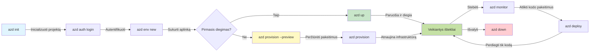
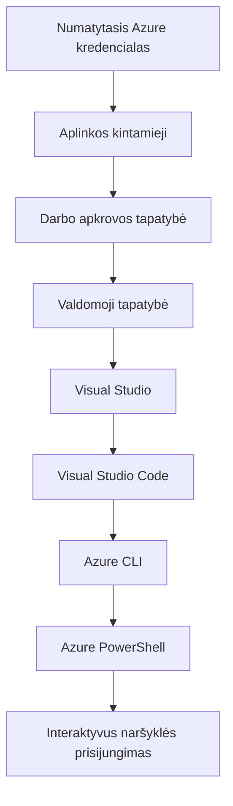

# AZD pagrindai - Azure Developer CLI supratimas

# AZD pagrindai - Pagrindinės sąvokos ir pagrindai

**Skyrių navigacija:**
- **📚 Kurso pradžia**: [AZD Pradedantiesiems](../../README.md)
- **📖 Dabartinis skyrius**: 1 skyrius - Pagrindai ir greitas startas
- **⬅️ Ankstesnis**: [Kurso apžvalga](../../README.md#-chapter-1-foundation--quick-start)
- **➡️ Kitas**: [Instaliavimas ir nustatymas](installation.md)
- **🚀 Kitas skyrius**: [2 skyrius: AI-pirmasis vystymas](../chapter-02-ai-development/microsoft-foundry-integration.md)

## Įvadas

Ši pamoka supažindins jus su Azure Developer CLI (azd) — galingu komandine eilutei skirtu įrankiu, kuris pagreitina jūsų kelią nuo vietinio vystymo iki diegimo Azure. Išmoksite pagrindines sąvokas, pagrindines funkcijas ir suprasite, kaip azd supaprastina debesų gimtąjų programų diegimą.

## Mokymosi tikslai

Pamokos pabaigoje jūs:
- Suprasite, kas yra Azure Developer CLI ir jo pagrindinį tikslą
- Išmoksite pagrindines šablonų, aplinkų ir paslaugų sąvokas
- Išnagrinėsite pagrindines funkcijas, įskaitant šablonais paremtą vystymą ir Infrastruktūrą kaip Kodą
- Suprasite azd projekto struktūrą ir darbo eigą
- Būsite pasirengę įdiegti ir sukonfigūruoti azd savo vystymo aplinkai

## Mokymosi rezultatai

Baigę šią pamoką, galėsite:
- Paaiškinti azd vaidmenį moderniuose debesų vystymo darbuose
- Nustatyti azd projekto struktūros komponentus
- Apibūdinti, kaip šablonai, aplinkos ir paslaugos veikia kartu
- Suprasti Infrastruktūros kaip Kodo privalumus naudojant azd
- Atpažinti skirtingas azd komandas ir jų paskirtis

## Kas yra Azure Developer CLI (azd)?

Azure Developer CLI (azd) yra komandine eilutei skirtas įrankis, sukurtas pagreitinti jūsų kelią nuo vietinio vystymo iki diegimo Azure. Jis supaprastina procesą kuriant, diegiant ir valdant debesų gimtąsias programas Azure.

### Ką galite diegti su azd?

azd palaiko platų darbo krūvių spektrą — ir sąrašas nuolat auga. Šiandien galite naudoti azd, kad diegtumėte:

| Darbo krūvio tipas | Pavyzdžiai | Tas pats darbo srautas? |
|---------------|----------|----------------|
| **Tradicinės programos** | Žiniatinklio programos, REST API, statiniai puslapiai | ✅ `azd up` |
| **Paslaugos ir mikroservisai** | Container Apps, Function Apps, daugiaservisiai back-end'ai | ✅ `azd up` |
| **Dirbtiniu intelektu paremtos programos** | Pokalbių programos su Microsoft Foundry modeliais, RAG sprendimai su AI Search | ✅ `azd up` |
| **Išmanieji agentai** | Foundry talpinami agentai, daugiaagentės orkestracijos | ✅ `azd up` |

Pagrindinė įžvalga ta, kad **azd gyvavimo ciklas išlieka toks pats nepriklausomai nuo to, ką diegiate**. Jūs inicijuojate projektą, paruošiate infrastruktūrą, diegiate savo kodą, stebite programą ir išvalote — ar tai paprastas tinklalapis, ar sudėtingas AI agentas.

Ši tolyga numatyta dizaino. azd traktuoja AI galimybes kaip dar vieną paslaugos tipą, kurią jūsų programa gali naudoti, o ne kaip kažką esminai skirto. Pokalbių galinis taškas, naudojantis Microsoft Foundry modeliais, azd požiūriu yra tiesiog dar viena paslauga, kurią reikia sukonfigūruoti ir išdiegti.

### 🎯 Kodėl naudoti AZD? Palyginimas iš realaus pasaulio

Palyginkime paprastos žiniatinklio programos su duomenų baze diegimą:

#### ❌ BE AZD: Rankinis Azure diegimas (30+ minučių)

```bash
# Žingsnis 1: Sukurti išteklių grupę
az group create --name myapp-rg --location eastus

# Žingsnis 2: Sukurti App Service planą
az appservice plan create --name myapp-plan \
  --resource-group myapp-rg \
  --sku B1 --is-linux

# Žingsnis 3: Sukurti Web programą
az webapp create --name myapp-web-unique123 \
  --resource-group myapp-rg \
  --plan myapp-plan \
  --runtime "NODE:18-lts"

# Žingsnis 4: Sukurti Cosmos DB paskyrą (10–15 minučių)
az cosmosdb create --name myapp-cosmos-unique123 \
  --resource-group myapp-rg \
  --kind MongoDB

# Žingsnis 5: Sukurti duomenų bazę
az cosmosdb mongodb database create \
  --account-name myapp-cosmos-unique123 \
  --resource-group myapp-rg \
  --name tododb

# Žingsnis 6: Sukurti kolekciją
az cosmosdb mongodb collection create \
  --account-name myapp-cosmos-unique123 \
  --resource-group myapp-rg \
  --database-name tododb \
  --name todos

# Žingsnis 7: Gauti prisijungimo eilutę
CONN_STR=$(az cosmosdb keys list \
  --name myapp-cosmos-unique123 \
  --resource-group myapp-rg \
  --type connection-strings \
  --query "connectionStrings[0].connectionString" -o tsv)

# Žingsnis 8: Konfigūruoti programos nustatymus
az webapp config appsettings set \
  --name myapp-web-unique123 \
  --resource-group myapp-rg \
  --settings MONGODB_URI="$CONN_STR"

# Žingsnis 9: Įjungti žurnalavimą
az webapp log config --name myapp-web-unique123 \
  --resource-group myapp-rg \
  --application-logging filesystem \
  --detailed-error-messages true

# Žingsnis 10: Nustatyti Application Insights
az monitor app-insights component create \
  --app myapp-insights \
  --location eastus \
  --resource-group myapp-rg

# Žingsnis 11: Susieti Application Insights su Web programa
INSTRUMENTATION_KEY=$(az monitor app-insights component show \
  --app myapp-insights \
  --resource-group myapp-rg \
  --query "instrumentationKey" -o tsv)

az webapp config appsettings set \
  --name myapp-web-unique123 \
  --resource-group myapp-rg \
  --settings APPINSIGHTS_INSTRUMENTATIONKEY="$INSTRUMENTATION_KEY"

# Žingsnis 12: Sukurti programą lokaliai
npm install
npm run build

# Žingsnis 13: Sukurti diegimo paketą
zip -r app.zip . -x "*.git*" "node_modules/*"

# Žingsnis 14: Diegti programą
az webapp deployment source config-zip \
  --resource-group myapp-rg \
  --name myapp-web-unique123 \
  --src app.zip

# Žingsnis 15: Laukti ir melstis, kad tai veiktų 🙏
# (Automatinio patikrinimo nėra, reikalingas rankinis testavimas)
```

**Problemos:**
- ❌ 15+ komandų, kurias reikia atsiminti ir vykdyti teisinga tvarka
- ❌ 30–45 minučių rankinio darbo
- ❌ Lengva padaryti klaidų (rašybos klaidos, neteisingi parametrai)
- ❌ Ryšio eilutės atsiduria terminalo istorijoje
- ❌ Nėra automatizuoto atsitraukimo, jei kažkas nepavyksta
- ❌ Sunku pakartoti komandos nariams
- ❌ Kiekvieną kartą skiriasi (nepakartojama)

#### ✅ SU AZD: Automatizuotas diegimas (5 komandos, 10-15 minučių)

```bash
# Žingsnis 1: Inicializuokite iš šablono
azd init --template todo-nodejs-mongo

# Žingsnis 2: Autentifikuokitės
azd auth login

# Žingsnis 3: Sukurkite aplinką
azd env new dev

# Žingsnis 4: Peržiūrėkite pakeitimus (nebūtina, bet rekomenduojama)
azd provision --preview

# Žingsnis 5: Įdiekite viską
azd up

# ✨ Baigta! Viskas įdiegta, sukonfigūruota ir stebima
```

**Privalumai:**
- ✅ **5 komandos** vs. 15+ rankinių žingsnių
- ✅ **10-15 minučių** bendras laikas (daugiausia laukiate Azure)
- ✅ **Mažiau rankinių klaidų** - nuoseklus, šablonais pagrįstas darbo srautas
- ✅ **Saugus slapčių tvarkymas** - daug šablonų naudoja Azure valdomą slapčių saugyklą
- ✅ **Pakartojami diegimai** - tas pats darbo srautas kiekvieną kartą
- ✅ **Pilnai reprodukuojama** - tas pats rezultatas kiekvieną kartą
- ✅ **Paruošta komandai** - bet kas gali diegti su tomis pačiomis komandomis
- ✅ **Infrastruktūra kaip kodas** - Bicep šablonai versijomis kontroliuojami
- ✅ **Įmontuota stebėsena** - Application Insights sukonfigūruotas automatiškai

### 📊 Laiko ir klaidų sumažinimas

| Metrika | Rankinis diegimas | AZD diegimas | Pagerėjimas |
|:-------|:------------------|:---------------|:------------|
| **Komandos** | 15+ | 5 | 67% mažiau |
| **Laikas** | 30-45 min | 10-15 min | 60% greičiau |
| **Klaidų rodiklis** | ~40% | <5% | 88% mažiau |
| **Nuoseklumas** | Mažas (rankinis) | 100% (automatizuotas) | Tobula |
| **Komandos įvedimas** | 2-4 valandos | 30 minučių | 75% greičiau |
| **Atkūrimo laikas** | 30+ min (rankinis) | 2 min (automatizuotas) | 93% greičiau |

## Pagrindinės sąvokos

### Šablonai
Šablonai yra azd pagrindas. Jie talpina:
- **Programos kodas** - Jūsų šaltinio kodas ir priklausomybės
- **Infrastruktūros apibrėžimai** - Azure ištekliai apibrėžti Bicep arba Terraform
- **Konfigūracijos failai** - Nustatymai ir aplinkos kintamieji
- **Diegimo scenarijai** - Automatizuoti diegimo darbo srautai

### Aplinkos
Aplinkos atspindi skirtingus diegimo tikslus:
- **Development** - Testavimui ir vystymui
- **Staging** - Preprodukcinė aplinka
- **Production** - Veikianti gamybinė aplinka

Kiekviena aplinka palaiko savo:
- Azure resursų grupę
- Konfigūracijos nustatymus
- Diegimo būseną

### Paslaugos
Paslaugos yra jūsų programos statybiniai blokai:
- **Frontend** - Žiniatinklio programos, vieno puslapio aplikacijos (SPA)
- **Backend** - API, mikroservisai
- **Duomenų bazė** - Duomenų saugojimo sprendimai
- **Saugykla** - Failų ir blobų saugykla

## Pagrindinės funkcijos

### 1. Šablonais grindžiamas vystymas
```bash
# Naršyti galimus šablonus
azd template list

# Inicializuoti iš šablono
azd init --template <template-name>
```

### 2. Infrastruktūra kaip kodas
- **Bicep** - Azure domenui skirta kalba
- **Terraform** - Daugia debesų infrastruktūros įrankis
- **ARM Templates** - Azure Resource Manager šablonai

### 3. Integruoti darbo srautai
```bash
# Pilnas diegimo darbo procesas
azd up            # Paruošimas + diegimas — pirminei sąrankai be rankinio įsikišimo

# 🧪 NAUJA: Peržiūrėkite infrastruktūros pakeitimus prieš diegimą (SAUGU)
azd provision --preview    # Simuliuokite infrastruktūros diegimą nekeisdami esamos infrastruktūros

azd provision     # Sukurti Azure išteklius — jei atnaujinate infrastruktūrą, naudokite tai
azd deploy        # Diegti programos kodą arba perdiegti programos kodą po atnaujinimo
azd down          # Išvalyti išteklius
```

#### 🛡️ Saugus infrastruktūros planavimas su peržiūra
Komanda `azd provision --preview` yra žaidimo keitiklis saugiems diegimams:
- **Saudo vykdymo analizė** - Rodo, kas bus sukurta, pakeista arba ištrinta
- **Nulinė rizika** - Jokių realių pakeitimų jūsų Azure aplinkoje nebus atlikta
- **Komandos bendradarbiavimas** - Dalinkitės peržiūros rezultatais prieš diegimą
- **Sąnaudų įvertinimas** - Supraskite išteklių kaštus prieš įsipareigojant

```bash
# Pavyzdinis peržiūros darbo eiga
azd provision --preview           # Peržiūrėkite, kas pasikeis
# Peržiūrėkite išvestį, aptarkite su komanda
azd provision                     # Taikykite pakeitimus užtikrintai
```

### 📊 Vizualizacija: AZD vystymo darbo srautas



**Darbo srauto paaiškinimas:**
1. **Init** - Pradėkite nuo šablono arba naujo projekto
2. **Auth** - Autentifikuokitės su Azure
3. **Environment** - Sukurkite izoliuotą diegimo aplinką
4. **Preview** - 🆕 Visada pirmiausia peržiūrėkite infrastruktūros pakeitimus (saugi praktika)
5. **Provision** - Kurkite/atnaujinkite Azure išteklius
6. **Deploy** - Paskelbkite savo programos kodą
7. **Monitor** - Stebėkite programos našumą
8. **Iterate** - Darykite pakeitimus ir pakartotinai diegkite kodą
9. **Cleanup** - Pašalinkite išteklius, kai baigta

### 4. Aplinkų valdymas
```bash
# Kurti ir valdyti aplinkas
azd env new <environment-name>
azd env select <environment-name>
azd env list
```

### 5. Praplėtimai ir AI komandos

azd naudoja plėtinių sistemą, kad pridėtų galimybių už pagrindinės CLI ribų. Tai ypač naudinga AI darbo krūviams:

```bash
# Išvardinti galimus plėtinius
azd extension list

# Įdiegti Foundry agentų plėtinį
azd extension install azure.ai.agents

# Inicializuoti dirbtinio intelekto agento projektą iš manifestos
azd ai agent init -m agent-manifest.yaml

# Išbandyti diegtą agentą (rodo vėlavimą ir laiką iki pirmojo baito)
azd ai agent invoke

# Paleisti MCP serverį dirbtinio intelekto pagalbai skirtam vystymui (Alfa)
azd mcp start
```

**Agentų gyvavimo ciklas nuo pradžios iki galo.** Kai įdiegsite `azure.ai.agents`, viena darbo eiga nuves jus nuo idėjos iki veikiantį, stebimą agento. Jums to nereikia visko turėti iš karto — tiesiog žinokite, kad tai egzistuoja:

| Etapas | Komanda | Ką ji daro |
|-------|---------|--------------|
| **Sukūrimas** | `azd ai agent init -m <manifest>` | Sugeneruoja agento projektą iš manifest'o |
| **Testavimas** | `azd ai agent invoke` | Iškviečia agentą ir mato atsakymo laiką |
| **Matuoti** | `azd ai agent eval generate` | Sukuria vertinimo duomenų rinkinį agentui |
| **Tobulinimas** | `azd ai agent optimize` | Optimizuoja agento instrukcijas pagal jūsų duomenis |
| **Tikrinti** | `azd ai agent endpoint show` | Rodo gyvą galinio taško konfigūraciją |
| **Išvalyti** | `azd ai agent delete` | Ištrina talpinamą agentą ir visas jo versijas |

> Praplėtimai išsamiai aptariami [2 skyriuje: AI-pirmasis vystymas](../chapter-02-ai-development/agents.md) ir [AZD AI CLI komandų](../chapter-08-production/production-ai-practices.md#azd-ai-cli-commands-and-extensions) nuorodoje.

## 📁 Projekto struktūra

Tipinė azd projekto struktūra:
```
my-app/
├── .azd/                    # azd configuration
│   └── config.json
├── .azure/                  # Azure deployment artifacts
├── .devcontainer/          # Development container config
├── .github/workflows/      # GitHub Actions
├── .vscode/               # VS Code settings
├── infra/                 # Infrastructure code
│   ├── main.bicep        # Main infrastructure template
│   ├── main.parameters.json
│   └── modules/          # Reusable modules
├── src/                  # Application source code
│   ├── api/             # Backend services
│   └── web/             # Frontend application
├── azure.yaml           # azd project configuration
└── README.md
```

## 🔧 Konfigūracijos failai

### azure.yaml
Pagrindinis projekto konfigūracijos failas:
```yaml
name: my-awesome-app
metadata:
  template: my-template@1.0.0

services:
  web:
    project: ./src/web
    language: js
    host: appservice
  api:
    project: ./src/api
    language: js
    host: appservice

hooks:
  preprovision:
    shell: pwsh
    run: echo "Preparing to provision..."
```

### .azure/config.json
Aplinkai specifinė konfigūracija:
```json
{
  "version": 1,
  "defaultEnvironment": "dev",
  "environments": {
    "dev": {
      "subscriptionId": "your-subscription-id",
      "location": "eastus"
    }
  }
}
```

## 🎪 Bendri darbo srautai su praktiniais pratimais

> **💡 Mokymosi patarimas:** Atlikite šiuos pratimus eilės tvarka, kad palaipsniui ugdytumėte AZD įgūdžius.

### 🎯 Pratimas 1: Inicializuokite savo pirmąjį projektą

**Tikslas:** Sukurti AZD projektą ir ištirti jo struktūrą

**Veiksmai:**
```bash
# Naudokite patikrintą šabloną
azd init --template todo-nodejs-mongo

# Peržiūrėkite sugeneruotus failus
ls -la  # Peržiūrėkite visus failus, įskaitant paslėptus

# Sukurti pagrindiniai failai:
# - azure.yaml (pagrindinė konfigūracija)
# - infra/ (infrastruktūros kodas)
# - src/ (programos kodas)
```

**✅ Sėkmė:** Jūs turite azure.yaml, infra/ ir src/ katalogus

---

### 🎯 Pratimas 2: Diegimas į Azure

**Tikslas:** Atlikti pilną diegimą nuo pradžios iki pabaigos

**Veiksmai:**
```bash
# 1. Autentifikuokite
az login && azd auth login

# 2. Sukurkite aplinką
azd env new dev
azd env set AZURE_LOCATION eastus

# 3. Peržiūrėkite pakeitimus (REKOMENDUOJAMA)
azd provision --preview

# 4. Įdiekite viską
azd up

# 5. Patikrinkite diegimą
azd show    # Peržiūrėkite savo programos URL
```

**Tikėtinas laikas:** 10-15 minučių  
**✅ Sėkmė:** Programos URL atsidaro naršyklėje

---

### 🎯 Pratimas 3: Kelios aplinkos

**Tikslas:** Diegti į dev ir staging

**Veiksmai:**
```bash
# Jau turite dev, sukurkite staging
azd env new staging
azd env set AZURE_LOCATION westus2
azd up

# Perjunkite tarp jų
azd env list
azd env select dev
```

**✅ Sėkmė:** Dvi atskiros resursų grupės Azure portale

---

### 🛡️ Švarus startas: `azd down --force --purge`

Kai reikia visiškai atstatyti:

```bash
azd down --force --purge
```

**Ką tai daro:**
- `--force`: Be patvirtinimo raginimų
- `--purge`: Ištrina visą vietinę būseną ir Azure išteklius

**Naudokite kai:**
- Diegimas nutrūko viduryje
- Pereinate tarp projektų
- Reikia naujos pradžios

---

## 🎪 Originalus darbo srauto atitikmuo

### Naujo projekto pradžia
```bash
# Metodas 1: Naudoti esamą šabloną
azd init --template todo-nodejs-mongo

# Metodas 2: Pradėti nuo nulio
azd init

# Metodas 3: Naudoti dabartinį katalogą
azd init .
```

### Vystymo ciklas
```bash
# Paruoškite kūrimo aplinką
azd auth login
azd env new dev
azd env select dev

# Įdiekite viską
azd up

# Atlikite pakeitimus ir įdiekite iš naujo
azd deploy

# Išvalykite, kai baigsite
azd down --force --purge # komanda Azure Developer CLI yra **visiškas atstatymas** jūsų aplinkai — ypač naudinga, kai sprendžiate nepavykusius diegimus, tvarkote apleistus išteklius arba ruošiatės švariam pakartotiniam diegimui.
```

## Supratimas apie `azd down --force --purge`
Komanda `azd down --force --purge` yra galingas būdas visiškai sunaikinti jūsų azd aplinką ir visus su ja susijusius išteklius. Štai ką kiekvienas parametras daro:
```
--force
```

- Praleidžia patvirtinimo raginimus.
- Naudinga automatizavimui arba skriptavimui, kai rankinė sąveika neįmanoma.
- Užtikrina, kad išmontavimas vyktų be pertraukų, net jei CLI aptinka neatitikimų.

```
--purge
```

Ištrina **visą susijusią metaduomenį**, įskaitant:
Aplinkos būseną
Vietinį `.azure` katalogą
Kešiuotą diegimo informaciją
Tai neleidžia azd "prisiminti" ankstesnių diegimų, kurie gali sukelti problemų, tokių kaip nesuderintos resursų grupės ar pasenusios registro nuorodos.


### Kodėl naudoti abu?
Kai `azd up` stringa dėl liekančios būsenos arba dalinių diegimų, ši kombinacija užtikrina **švarų startą**.

Tai ypač naudinga po rankinių resursų ištrynimų Azure portale arba keičiant šablonus, aplinkas ar resursų grupių pavadinimų konvencijas.


### Kelių aplinkų valdymas
```bash
# Sukurti parengimo (staging) aplinką
azd env new staging
azd env select staging
azd up

# Perjungti atgal į dev
azd env select dev

# Palyginti aplinkas
azd env list
```

## 🔐 Autentifikacija ir kredencialai

Autentifikacijos supratimas yra esminis sėkmingiems azd diegimams. Azure naudoja kelis autentifikacijos metodus, o azd pasitelkia tą pačią kredencialų grandinę, kurią naudoja kiti Azure įrankiai.

### Azure CLI autentifikacija (`az login`)

Prieš naudodami azd, turite autentifikuotis su Azure. Dažniausiai naudojamas metodas yra Azure CLI:

```bash
# Interaktyvus prisijungimas (atidaro naršyklę)
az login

# Prisijungti su konkrečiu nuomininku
az login --tenant <tenant-id>

# Prisijungti naudojant paslaugos principalą
az login --service-principal -u <app-id> -p <password> --tenant <tenant-id>

# Patikrinti dabartinę prisijungimo būseną
az account show

# Išvardinti prieinamas prenumeratas
az account list --output table

# Nustatyti numatytąją prenumeratą
az account set --subscription <subscription-id>
```

### Autentifikacijos srautas
1. **Interaktyvus prisijungimas**: Atidaro numatytąją naršyklę autentifikacijai
2. **Device Code Flow**: Skirta aplinkoms be naršyklės prieigos
3. **Service Principal**: Automatizavimui ir CI/CD scenarijoms
4. **Managed Identity**: Azure talpinamoms programoms

### DefaultAzureCredential grandinė

`DefaultAzureCredential` yra kredencialų tipas, kuris suteikia supaprastintą autentifikacijos patirtį automatiškai bandydamas kelis kredencialų šaltinius tam tikra tvarka:

#### Kredencialų grandinės tvarka


#### 1. Aplinkos kintamieji
```bash
# Nustatyti aplinkos kintamuosius tarnybinei paskyrai
export AZURE_CLIENT_ID="<app-id>"
export AZURE_CLIENT_SECRET="<password>"
export AZURE_TENANT_ID="<tenant-id>"
```

#### 2. Workload Identity (Kubernetes/GitHub Actions)
Naudojama automatiškai:
- Azure Kubernetes Service (AKS) su Workload Identity
- GitHub Actions su OIDC federacija
- Kiti su federacija susiję tapatybės scenarijai

#### 3. Managed Identity
Skirta Azure ištekliams, tokiems kaip:
- Virtualios mašinos
- App Service
- Azure Functions
- Container Instances

```bash
# Patikrina, ar programa veikia Azure išteklyje, kuriame yra valdomoji tapatybė
az account show --query "user.type" --output tsv
# Grąžina: "servicePrincipal", jei naudojama valdomoji tapatybė
```

#### 4. Integracija su kūrimo įrankiais
- **Visual Studio**: Automatiškai naudoja prisijungusį paskyrą
- **VS Code**: Naudoja Azure Account plėtinio kredencialus
- **Azure CLI**: Naudoja `az login` kredencialus (dažniausiai naudojama vietiniame vystyme)

### AZD autentifikacijos nustatymas

```bash
# Metodas 1: Naudokite Azure CLI (Rekomenduojama kūrimo metu)
az login
azd auth login  # Naudoja esamus Azure CLI prisijungimo duomenis

# Metodas 2: Tiesioginė azd autentifikacija
azd auth login --use-device-code  # Skirta aplinkoms be grafinės sąsajos

# Metodas 3: Patikrinkite autentifikacijos būseną
azd auth login --check-status

# Metodas 4: Atsijunkite ir vėl autentifikuokitės
azd auth logout
azd auth login
```

### Autentifikacijos geriausios praktikos

#### Lokaliam vystymui
```bash
# 1. Prisijunkite naudodami Azure CLI
az login

# 2. Patikrinkite, ar prenumerata yra teisinga
az account show
az account set --subscription "Your Subscription Name"

# 3. Naudokite azd su esamais kredencialais
azd auth login
```

#### CI/CD procesams
```yaml
# GitHub Actions example
- name: Azure Login
  uses: azure/login@v1
  with:
    creds: ${{ secrets.AZURE_CREDENTIALS }}

- name: Deploy with azd
  run: |
    azd auth login --client-id ${{ secrets.AZURE_CLIENT_ID }} \
                    --client-secret ${{ secrets.AZURE_CLIENT_SECRET }} \
                    --tenant-id ${{ secrets.AZURE_TENANT_ID }}
    azd up --no-prompt
```

#### Produkcinėms aplinkoms
- Naudokite **Managed Identity**, kai paleidžiate ant Azure išteklių
- Naudokite **Service Principal** automatizavimo scenarijuose
- Venkite saugoti prisijungimo duomenų kode ar konfiguracijos failuose
- Naudokite **Azure Key Vault** jautriai konfigūracijai

### Dažnos autentifikavimo problemos ir sprendimai

#### Problema: „No subscription found“
```bash
# Sprendimas: nustatyti numatytąją prenumeratą
az account list --output table
az account set --subscription "<subscription-id>"
azd env set AZURE_SUBSCRIPTION_ID "<subscription-id>"
```

#### Problema: „Insufficient permissions“
```bash
# Sprendimas: Patikrinkite ir priskirkite reikiamus vaidmenis
az role assignment list --assignee $(az account show --query user.name --output tsv)

# Dažniausiai reikalingi vaidmenys:
# - Contributor (resursų valdymui)
# - User Access Administrator (vaidmenų priskyrimui)
```

#### Problema: „Token expired“
```bash
# Sprendimas: Autentifikuotis iš naujo
az logout
az login
azd auth logout
azd auth login
```

### Autentifikavimas skirtinguose scenarijuose

#### Vietinis vystymas
```bash
# Asmeninio tobulėjimo paskyra
az login
azd auth login
```

#### Komandinis vystymas
```bash
# Naudokite konkretų nuomininką organizacijai
az login --tenant contoso.onmicrosoft.com
azd auth login
```

#### Multi-tenant scenarijai
```bash
# Perjungti tarp nuomininkų
az login --tenant tenant1.onmicrosoft.com
# Diegti nuomininkui 1
azd up

az login --tenant tenant2.onmicrosoft.com  
# Diegti nuomininkui 2
azd up
```

### Saugumo aspektai

1. **Prisijungimo duomenų saugojimas**: Niekada nesaugokite prisijungimo duomenų šaltinio kode
2. **Prieigos srities apribojimas**: Naudokite mažiausio privilegijų principą service principalams
3. **Tokenų keitimas**: Reguliariai atnaujinkite service principal slaptus raktus
4. **Audito įrašai**: Stebėkite autentifikavimo ir diegimo veiksmus
5. **Tinklo saugumas**: Naudokite privačius galinius taškus, kai įmanoma

### Autentifikavimo trikčių šalinimas

```bash
# Autentifikavimo problemų trikčių šalinimas
azd auth login --check-status
az account show
az account get-access-token

# Bendros diagnostikos komandos
whoami                          # Dabartinis naudotojo kontekstas
az ad signed-in-user show      # Microsoft Entra ID naudotojo informacija
az group list                  # Patikrinti prieigą prie išteklių
```

## Supratimas `azd down --force --purge`

### Aptikimas
```bash
azd template list              # Naršyti šablonus
azd template show <template>   # Šablono detalės
azd init --help               # Inicializacijos parinktys
```

### Projekto valdymas
```bash
azd show                     # Projekto apžvalga
azd env list                # Galimos aplinkos ir pasirinkta numatytoji
azd config show            # Konfigūracijos nustatymai
```

### Stebėsena
```bash
azd monitor                  # Atidaryti Azure portalo stebėjimą
azd monitor --logs           # Peržiūrėti programos žurnalus
azd monitor --live           # Peržiūrėti tiesioginius rodiklius
azd pipeline config          # Nustatyti CI/CD
```

## Geriausios praktikos

### 1. Naudokite prasmingus pavadinimus
```bash
# Gerai
azd env new production-east
azd init --template web-app-secure

# Vengti
azd env new env1
azd init --template template1
```

### 2. Naudokitės šablonais
- Pradėkite nuo esamų šablonų
- Priderinkite pagal savo poreikius
- Sukurkite pakartotinai naudojamus šablonus savo organizacijai

### 3. Aplinkos izoliacija
- Naudokite atskiras aplinkas dev/staging/prod
- Niekada neišdiekite tiesiogiai į produkciją iš vietinio kompiuterio
- Naudokite CI/CD srautus produkcijos diegimams

### 4. Konfigūracijos valdymas
- Naudokite aplinkos kintamuosius jautriems duomenims
- Laikykite konfigūraciją versijų valdyme
- Dokumentuokite aplinkai specifinius nustatymus

## Mokymosi eiga

### Pradedantiesiems (1–2 savaitė)
1. Įdiekite azd ir autentifikuokitės
2. Diegti paprastą šabloną
3. Suprasti projekto struktūrą
4. Išmokti pagrindines komandas (up, down, deploy)

### Tarpinis (3–4 savaitės)
1. Priderinti šablonus
2. Valdyti kelias aplinkas
3. Suprasti infrastruktūros kodą
4. Sukurti CI/CD srautus

### Pažengusiems (5+ savaitės)
1. Kurti pasirinktinius šablonus
2. Išplėstiniai infrastruktūros modeliai
3. Diegimai keliose regionuose
4. Įmonės lygio konfigūracijos

## Tolimesni žingsniai

**📖 Tęskite 1 skyrių mokymąsi:**
- [Diegimas ir nustatymas](installation.md) - Įdiekite ir sukonfigūruokite azd
- [Jūsų pirmasis projektas](first-project.md) - Užbaikite praktinį pamoką
- [Konfigūracijos vadovas](configuration.md) - Išplėstiniai konfigūracijos parametrai

**🎯 Pasirengę kitam skyriui?**
- [2 skyrius: AI-pirmasis vystymas](../chapter-02-ai-development/microsoft-foundry-integration.md) - Pradėkite kurti AI programas

## Papildomi ištekliai

- [Azure Developer CLI apžvalga](https://learn.microsoft.com/en-us/azure/developer/azure-developer-cli/)
- [Šablonų galerija](https://azure.github.io/awesome-azd/)
- [Bendruomenės pavyzdžiai](https://github.com/Azure-Samples)

---

## 🙋 Dažnai užduodami klausimai

### Bendri klausimai

**K: Kuo skiriasi AZD ir Azure CLI?**

A: Azure CLI (`az`) skirta valdyti atskirus Azure išteklius. AZD (`azd`) skirta valdyti visas programas:

```bash
# Azure CLI - žemo lygio išteklių valdymas
az webapp create --name myapp --resource-group rg
az sql server create --name myserver --resource-group rg
# ...reikia dar daug daugiau komandų

# AZD - programos lygio valdymas
azd up  # Diegia visą programą su visais ištekliais
```

**Mąstykite taip:**
- `az` = Veikia su atskiromis Lego kaladėlėmis
- `azd` = Darbas su pilnais Lego rinkiniais

---

**K: Ar man reikia žinoti Bicep arba Terraform, kad naudotis AZD?**

A: Ne! Pradėkite nuo šablonų:
```bash
# Naudokite esamą šabloną - nereikia žinių apie IaC
azd init --template todo-nodejs-mongo
azd up
```

Vėliau galite išmokti Bicep, kad pritaikytumėte infrastruktūrą. Šablonai suteikia veikiančius pavyzdžius, iš kurių galite mokytis.

---

**K: Kiek kainuoja vykdyti AZD šablonus?**

A: Išlaidos priklauso nuo šablono. Daugumos vystymo šablonų kaina yra $50–150 per mėnesį:

```bash
# Peržiūrėkite išlaidas prieš diegiant
azd provision --preview

# Visada išvalykite, kai nenaudojate
azd down --force --purge  # Pašalina visus išteklius
```

**Patarimas:** Naudokite nemokamas lygius, kai prieinami:
- App Service: F1 (nemokamas) lygis
- Microsoft Foundry Models: Azure OpenAI 50,000 tokenų/mėn nemokamai
- Cosmos DB: 1000 RU/s nemokamas lygis

---

**K: Ar galiu naudoti AZD su esamais Azure ištekliais?**

A: Taip, bet lengviau pradėti nuo nulio. AZD geriausiai veikia, kai jis valdo visą gyvavimo ciklą. Jei turite esamus išteklius:
```bash
# Parinktis 1: Importuoti esamus išteklius (išplėstinė)
azd init
# Tada modifikuokite infra/ taip, kad jis nurodytų esamus išteklius

# Parinktis 2: Pradėti nuo nulio (rekomenduojama)
azd init --template matching-your-stack
azd up  # Sukuria naują aplinką
```

---

**K: Kaip pasidalinti projektu su komandos nariais?**

A: Patalpinkite (commit) AZD projektą į Git (bet NE .azure aplanko):
```bash
# Pagal numatytuosius nustatymus jau įtraukta į .gitignore
.azure/        # Turi slaptus duomenis ir aplinkos parametrus
*.env          # Aplinkos kintamieji

# Komandos nariai tada:
git clone <your-repo>
azd auth login
azd env new <their-name>-dev
azd up
```

Visi gauna identišką infrastruktūrą iš tų pačių šablonų.

---

### Trikčių šalinimo klausimai

**K: "azd up" nepavyko iki galo. Ką daryti?**

A: Patikrinkite klaidą, ištaisykite ją, tada bandykite dar kartą:
```bash
# Peržiūrėti išsamius žurnalus
azd show

# Dažniausi sprendimai:

# 1. Jei viršyta kvota:
azd env set AZURE_LOCATION "westus2"  # Išbandykite kitą regioną

# 2. Jei resurso pavadinimo konfliktas:
azd down --force --purge  # Pradėti nuo nulio
azd up  # Bandykite dar kartą

# 3. Jei autentifikacija pasibaigė:
az login
azd auth login
azd up
```

**Dažniausia problema:** Pasirinkta neteisinga Azure prenumerata
```bash
az account list --output table
az account set --subscription "<correct-subscription>"
```

---

**K: Kaip išdiegti tik kodo pakeitimus nesikurjant infrastruktūros iš naujo?**

A: Naudokite `azd deploy` vietoje `azd up`:
```bash
azd up          # Pirmą kartą: paruošimas + diegimas (lėtai)

# Atlikite kodo pakeitimus...

azd deploy      # Vėlesniais kartais: tik diegimas (greitai)
```

Greitumo palyginimas:
- `azd up`: 10–15 minučių (sukuria infrastruktūrą)
- `azd deploy`: 2–5 minutės (tik kodas)

---

**K: Ar galiu pritaikyti infrastruktūros šablonus?**

A: Taip! Redaguokite Bicep failus `infra/`:
```bash
# Po azd init
cd infra/
code main.bicep  # Redaguoti VS Code programoje

# Peržiūrėti pakeitimus
azd provision --preview

# Taikyti pakeitimus
azd provision
```

**Patarimas:** Pradėkite nuo mažų pakeitimų – pirmiausia pakeiskite SKU:
```bicep
// infra/main.bicep
sku: {
  name: 'B1'  // Change to 'P1V2' for production
}
```

---

**K: Kaip ištrinti viską, ką sukūrė AZD?**

A: Viena komanda pašalina visus išteklius:
```bash
azd down --force --purge

# Tai ištrina:
# - Visus Azure išteklius
# - Resursų grupę
# - Vietinę aplinkos būseną
# - Talpykloje saugomus diegimo duomenis
```

**Visada vykdykite tai kai:**
- Baigėte testuoti šabloną
- Perėjote prie kito projekto
- Norite pradėti nuo nulio

**Taupymas:** Pašalinus nenaudojamus išteklius – mokesčiai = $0

---

**K: Kas, jei netyčia ištryniau išteklius Azure portale?**

A: AZD būsena gali nesutapti. Švaraus starto metodas:
```bash
# 1. Pašalinti vietinę būseną
azd down --force --purge

# 2. Pradėti iš naujo
azd up

# Alternatyva: Leisti AZD aptikti ir ištaisyti
azd provision  # Sukurs trūkstamus išteklius
```

---

### Pažangūs klausimai

**K: Ar galiu naudoti AZD CI/CD srautuose?**

A: Taip! GitHub Actions pavyzdys:
```yaml
# .github/workflows/deploy.yml
name: Deploy with AZD

on:
  push:
    branches: [main]

jobs:
  deploy:
    runs-on: ubuntu-latest
    steps:
      - uses: actions/checkout@v2
      
      - name: Install azd
        run: curl -fsSL https://aka.ms/install-azd.sh | bash
      
      - name: Azure Login
        run: |
          azd auth login \
            --client-id ${{ secrets.AZURE_CLIENT_ID }} \
            --client-secret ${{ secrets.AZURE_CLIENT_SECRET }} \
            --tenant-id ${{ secrets.AZURE_TENANT_ID }}
      
      - name: Deploy
        run: azd up --no-prompt
```

---

**K: Kaip tvarkyti slaptus duomenis ir jautrią informaciją?**

A: AZD automatiškai integruojasi su Azure Key Vault:
```bash
# Slaptosios reikšmės saugomos Key Vault, ne kode
azd env set DATABASE_PASSWORD "$(openssl rand -base64 32)"

# AZD automatiškai:
# 1. Sukuria Key Vault
# 2. Saugo slaptą reikšmę
# 3. Suteikia programai prieigą per valdomą tapatybę
# 4. Įterpia vykdymo metu
```

**Niekada neįtraukite į commit:**
- `.azure/` aplankas (turi aplinkos duomenis)
- `.env` failai (lokalūs slaptiniai)
- Ryšio eilutės

---

**K: Ar galiu diegti keliuose regionuose?**

A: Taip, sukurkite aplinką kiekvienam regionui:
```bash
# Rytų JAV aplinka
azd env new prod-eastus
azd env set AZURE_LOCATION eastus
azd up

# Vakarų Europos aplinka
azd env new prod-westeurope
azd env set AZURE_LOCATION westeurope
azd up

# Kiekviena aplinka yra nepriklausoma
azd env list
```

Tikroms kelių regionų programoms pritaikykite Bicep šablonus taip, kad diegtų keliose regionuose vienu metu.

---

**K: Kur galiu gauti pagalbą, jei užstrigau?**

1. **AZD dokumentacija:** https://learn.microsoft.com/azure/developer/azure-developer-cli/
2. **GitHub Issues:** https://github.com/Azure/azure-dev/issues
3. **Discord:** [Azure Discord](https://discord.gg/microsoft-azure) - #azure-developer-cli kanalas
4. **Stack Overflow:** Tag `azure-developer-cli`
5. **Šis kursas:** [Trikčių šalinimo vadovas](../chapter-07-troubleshooting/common-issues.md)

**Patarimas:** Prieš klausiant, paleiskite:
```bash
azd show       # Rodo dabartinę būseną
azd version    # Rodo jūsų versiją
```
Įtraukite šią informaciją į savo klausimą, kad gautumėte greitesnę pagalbą.

---

## 🎓 Kas toliau?

Dabar suprantate AZD pagrindus. Pasirinkite savo kelią:

### 🎯 Pradedantiesiems:
1. **Toliau:** [Diegimas ir nustatymas](installation.md) - Įdiekite AZD savo mašinoje
2. **Tada:** [Jūsų pirmasis projektas](first-project.md) - Išdiekite savo pirmąją programą
3. **Praktika:** Atlikite visus 3 pratimus šioje pamokoje

### 🚀 AI kūrėjams:
1. **Praleiskite į:** [2 skyrius: AI-pirmasis vystymas](../chapter-02-ai-development/microsoft-foundry-integration.md)
2. **Diegti:** Pradėkite su `azd init --template get-started-with-ai-chat`
3. **Mokykitės:** Kurkite, kol diegiate

### 🏗️ Patyrusiems kūrėjams:
1. **Peržiūrėti:** [Konfigūracijos vadovas](configuration.md) - Išplėstiniai nustatymai
2. **Išnagrinėkite:** [Infrastruktūra kaip kodas](../chapter-04-infrastructure/provisioning.md) - Bicep giluminė analizė
3. **Kurti:** Sukurkite pasirinktinius šablonus savo technologijų rinkiniui

---

**Skyriaus naršymas:**
- **📚 Kurso pradžia**: [AZD For Beginners](../../README.md)
- **📖 Dabartinis skyrius**: 1 skyrius - Pagrindai ir greitas pradžios  
- **⬅️ Ankstesnis**: [Kurso apžvalga](../../README.md#-chapter-1-foundation--quick-start)
- **➡️ Kitas**: [Diegimas ir nustatymas](installation.md)
- **🚀 Kitas skyrius**: [2 skyrius: AI-pirmasis vystymas](../chapter-02-ai-development/microsoft-foundry-integration.md)

---

<!-- CO-OP TRANSLATOR DISCLAIMER START -->
**Atsakomybės apribojimas**:
Šis dokumentas buvo išverstas naudojant dirbtinio intelekto vertimo paslaugą [Co-op Translator](https://github.com/Azure/co-op-translator). Nors siekiame tikslumo, prašome atkreipti dėmesį, kad automatiniai vertimai gali turėti klaidų ar netikslumų. Originalus dokumentas jo gimtąja kalba laikomas autoritetingu šaltiniu. Svarbiai informacijai rekomenduojama naudoti profesionalų žmogiškąjį vertimą. Mes neatsakome už jokius nesusipratimus ar neteisingą interpretaciją, kilusią naudojantis šiuo vertimu.
<!-- CO-OP TRANSLATOR DISCLAIMER END -->