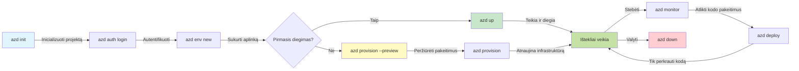
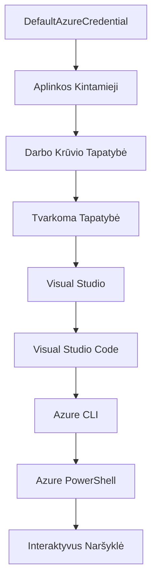

# AZD Pagrindai - Susipažinimas su Azure Developer CLI

# AZD Pagrindai - Pagrindinės sąvokos ir pagrindai

**Skyriaus navigacija:**
- **📚 Kurso pradžia**: [AZD Pradedantiesiems](../../README.md)
- **📖 Esamas skyrius**: 1 skyrius - Pagrindai ir greitas startas
- **⬅️ Ankstesnis**: [Kurso apžvalga](../../README.md#-chapter-1-foundation--quick-start)
- **➡️ Kitas**: [Diegimas ir nustatymas](installation.md)
- **🚀 Kitas skyrius**: [2 skyrius: Pirmiausia AI plėtra](../chapter-02-ai-development/microsoft-foundry-integration.md)

## Įvadas

Ši pamoka supažindina su Azure Developer CLI (azd), galingu komandiniu įrankiu, kuris pagreitina jūsų kelią nuo vietinės plėtros iki diegimo Azure platformoje. Sužinosite pagrindines sąvokas, pagrindines funkcijas ir suprasite, kaip azd palengvina debesų natyvių programų diegimą.

## Mokymosi tikslai

Pamokos pabaigoje jūs:
- Suprasite, kas yra Azure Developer CLI ir koks jo pagrindinis tikslas
- Išmoksite pagrindines šablonų, aplinkų ir paslaugų sąvokas
- Išnagrinėsite svarbias funkcijas, įskaitant šablonais pagrįstą plėtrą ir infrastruktūrą kaip kodą
- Suprasite azd projekto struktūrą ir darbo eigą
- Būsite pasiruošę įdiegti ir konfigūruoti azd savo plėtros aplinkoje

## Mokymosi rezultatai

Baigę šią pamoką, galėsite:
- Paaiškinti azd vaidmenį šiuolaikiniuose debesų plėtros darbo procesuose
- Nustatyti azd projekto struktūros komponentus
- Apibūdinti, kaip šablonai, aplinkos ir paslaugos veikia kartu
- Suprasti infrastruktūros kaip kodo naudą su azd
- Atpažinti skirtingas azd komandas ir jų paskirtį

## Kas yra Azure Developer CLI (azd)?

Azure Developer CLI (azd) yra komandinės eilutės įrankis, sukurtas pagreitinti jūsų kelią nuo vietinės plėtros iki diegimo Azure platformoje. Jis supaprastina debesų natyvių programų kūrimą, diegimą ir valdymą Azure aplinkoje.

### Ką galite diegti naudodami azd?

azd palaiko plačią darbo krūvių įvairovę – ir sąrašas nuolat auga. Šiandien galite naudoti azd diegti:

| Darbo krūvio tipas | Pavyzdžiai | Tas pats darbo procesas? |
|--------------------|------------|-------------------------|
| **Tradicinės programos** | Tinklalapiai, REST API, statiniai tinklalapiai | ✅ `azd up` |
| **Paslaugos ir mikropaslaugos** | Container Apps, Function Apps, kelių paslaugų backendai | ✅ `azd up` |
| **Dirbtiniu intelektu paremtos programos** | Pokalbių programos su Microsoft Foundry modeliais, RAG sprendimai su AI Search | ✅ `azd up` |
| **Išmanūs agentai** | Foundry talpinami agentai, kelių agentų orkestracija | ✅ `azd up` |

Svarbiausia įžvalga ta, kad **azd darbo ciklas išlieka tas pats, nepriklausomai nuo to, ką diegiate**. Pradedate projektą, paruošiate infrastruktūrą, diegiate kodą, stebite programą ir atlaisvinate resursus – nesvarbu, ar tai paprastas tinklalapis, ar pažangus DI agentas.

Šis tęstinumas yra sąmoningas dizainas. azd laiko DI galimybes kaip kitokią paslaugą, kurią gali naudoti jūsų programa, o ne kažką esminai skirtingo. Pokalbių galinis taškas, paremta Microsoft Foundry modeliais, azd požiūriu yra tiesiog dar viena paslauga, kurią reikia konfigūruoti ir diegti.

### 🎯 Kodėl naudoti AZD? Realus palyginimas

Palyginkime paprasto tinklalapio su duomenų baze diegimą:

#### ❌ BE AZD: Rankinis diegimas Azure (30+ minučių)

```bash
# 1 žingsnis: sukurti išteklių grupę
az group create --name myapp-rg --location eastus

# 2 žingsnis: sukurti App Service planą
az appservice plan create --name myapp-plan \
  --resource-group myapp-rg \
  --sku B1 --is-linux

# 3 žingsnis: sukurti Web programą
az webapp create --name myapp-web-unique123 \
  --resource-group myapp-rg \
  --plan myapp-plan \
  --runtime "NODE:18-lts"

# 4 žingsnis: sukurti Cosmos DB paskyrą (10-15 minučių)
az cosmosdb create --name myapp-cosmos-unique123 \
  --resource-group myapp-rg \
  --kind MongoDB

# 5 žingsnis: sukurti duomenų bazę
az cosmosdb mongodb database create \
  --account-name myapp-cosmos-unique123 \
  --resource-group myapp-rg \
  --name tododb

# 6 žingsnis: sukurti kolekciją
az cosmosdb mongodb collection create \
  --account-name myapp-cosmos-unique123 \
  --resource-group myapp-rg \
  --database-name tododb \
  --name todos

# 7 žingsnis: gauti prisijungimo eilutę
CONN_STR=$(az cosmosdb keys list \
  --name myapp-cosmos-unique123 \
  --resource-group myapp-rg \
  --type connection-strings \
  --query "connectionStrings[0].connectionString" -o tsv)

# 8 žingsnis: sukonfigūruoti programos nustatymus
az webapp config appsettings set \
  --name myapp-web-unique123 \
  --resource-group myapp-rg \
  --settings MONGODB_URI="$CONN_STR"

# 9 žingsnis: įjungti žurnalavimą
az webapp log config --name myapp-web-unique123 \
  --resource-group myapp-rg \
  --application-logging filesystem \
  --detailed-error-messages true

# 10 žingsnis: nustatyti Application Insights
az monitor app-insights component create \
  --app myapp-insights \
  --location eastus \
  --resource-group myapp-rg

# 11 žingsnis: susieti App Insights su Web programa
INSTRUMENTATION_KEY=$(az monitor app-insights component show \
  --app myapp-insights \
  --resource-group myapp-rg \
  --query "instrumentationKey" -o tsv)

az webapp config appsettings set \
  --name myapp-web-unique123 \
  --resource-group myapp-rg \
  --settings APPINSIGHTS_INSTRUMENTATIONKEY="$INSTRUMENTATION_KEY"

# 12 žingsnis: sukurti programą vietoje
npm install
npm run build

# 13 žingsnis: sukurti diegimo paketą
zip -r app.zip . -x "*.git*" "node_modules/*"

# 14 žingsnis: įdiegti programą
az webapp deployment source config-zip \
  --resource-group myapp-rg \
  --name myapp-web-unique123 \
  --src app.zip

# 15 žingsnis: palaukti ir melstis, kad veiktų 🙏
# (Automatinio patikrinimo nėra, reikalingas rankinis testavimas)
```

**Problemų sąrašas:**
- ❌ Reikia prisiminti ir atlikti 15+ komandų teisinga tvarka
- ❌ 30-45 minučių rankinio darbo
- ❌ Lengva suklysti (rašybos klaidos, neteisingi parametrai)
- ❌ Prisijungimo eilutės matomos terminalo istorijoje
- ❌ Nėra automatinio atkūrimo klaidai įvykus
- ❌ Sunku pakartoti komandos nariams
- ❌ Kaskart skirtinga (neatkuria)

#### ✅ SU AZD: Automatizuotas diegimas (5 komandos, 10-15 minučių)

```bash
# 1 žingsnis: Inicializuoti iš šablono
azd init --template todo-nodejs-mongo

# 2 žingsnis: Autentifikuotis
azd auth login

# 3 žingsnis: Sukurti aplinką
azd env new dev

# 4 žingsnis: Peržiūrėti pakeitimus (neprivaloma, bet rekomenduojama)
azd provision --preview

# 5 žingsnis: Įdiegti viską
azd up

# ✨ Baigta! Viskas įdiegta, sukonfigūruota ir stebima
```

**Privalumai:**
- ✅ **5 komandos** prieš 15+ rankinių žingsnių
- ✅ Viso laiko **10-15 minučių** (dažniausiai laukimo Azure)
- ✅ **Mažiau rankinių klaidų** - nuoseklus, šablonais pagrįstas darbo procesas
- ✅ **Saugus slaptažodžių tvarkymas** - daugelis šablonų naudoja Azure valdomą slaptažodžių saugyklą
- ✅ **Pakartojami diegimai** - tas pats darbo procesas kiekvieną kartą
- ✅ **Pilnai atkurti** - tas pats rezultatas kiekvieną kartą
- ✅ **Komandos paruoštas** - visi gali diegti naudojant tas pačias komandas
- ✅ **Infrastruktūra kaip kodas** - versijomis valdomi Bicep šablonai
- ✅ **Įmontuotas stebėjimas** - automatiškai sukonfigūruota Application Insights

### 📊 Laiko ir klaidų sumažinimas

| Matmuo | Rankinis diegimas | AZD diegimas | Pagerėjimas |
|:-------|:------------------|:-------------|:------------|
| **Komandos** | 15+ | 5 | 67 % mažiau |
| **Laikas** | 30-45 min | 10-15 min | 60 % greičiau |
| **Klaidų dažnis** | ~40 % | <5 % | 88 % sumažėjimas |
| **Nuoseklumas** | Žemas (rankinis) | 100 % (automatizuotas) | Tobulas |
| **Komandos įvedimas** | 2-4 valandos | 30 minučių | 75 % greičiau |
| **Atkūrimo laikas** | 30+ min (rankinis) | 2 min (automatizuotas) | 93 % greičiau |

## Pagrindinės sąvokos

### Šablonai
Šablonai yra azd pagrindas. Jie apima:
- **Programos kodą** - Jūsų šaltinio kodą ir priklausomybes
- **Infrastruktūros apibrėžimus** - Azure išteklių aprašymą Bicep arba Terraform formatu
- **Konfigūracijos failus** - Nustatymus ir aplinkos kintamuosius
- **Diegimo scenarijus** - Automatizuotus diegimo procesus

### Aplinkos
Aplinkos atspindi skirtingas diegimo paskirties vietas:
- **Vystymas** - Testavimui ir plėtrai
- **Tarpinis (Staging)** - Priešprodukcinė aplinka
- **Gamybinė** - Veikianti produkcinė aplinka

Kiekviena aplinka turi savus:
- Azure resursų grupę
- Konfigūracijos nustatymus
- Diegimo būseną

### Paslaugos
Paslaugos yra jūsų programos statybiniai blokai:
- **Frontend** - Tinklalapiai, SPA
- **Backend** - API, mikropaslaugos
- **Duomenų bazė** - Duomenų saugojimo sprendimai
- **Saugykla** - Failų ir blobų saugykla

## Pagrindinės funkcijos

### 1. Šablonais pagrįsta plėtra
```bash
# Naršyti galimus šablonus
azd template list

# Inicializuoti iš šablono
azd init --template <template-name>
```

### 2. Infrastruktūra kaip kodas
- **Bicep** - Azure specializuota kalba
- **Terraform** - Daugiadebesų infrastruktūros įrankis
- **ARM šablonai** - Azure Resource Manager šablonai

### 3. Integruoti darbo procesai
```bash
# Užbaigti diegimo darbo eigą
azd up            # Paruošimas + diegimas, tai be rankinio įsikišimo pirmojo nustatymo metu

# 🧪 NAUJA: Peržiūrėti infrastruktūros pakeitimus prieš diegimą (SAUGU)
azd provision --preview    # Simuliuoti infrastruktūros diegimą nekeičiant pakeitimų

azd provision     # Kurti Azure išteklius, jei atnaujinate infrastruktūrą naudokite šią funkciją
azd deploy        # Diegti programinės įrangos kodą arba perdiegiant kodą po atnaujinimo
azd down          # Išvalyti išteklius
```

#### 🛡️ Saugi infrastruktūros planavimo peržiūra
Komanda `azd provision --preview` yra revoliucinis įrankis saugiems diegimams:
- **Bandomasis paleidimas** - Rodo, kas bus sukuriama, modifikuojama ar ištrinama
- **Nulinė rizika** - Tikri pakeitimai Azure aplinkoje neatliekami
- **Komandos bendradarbiavimas** - Dalinkitės peržiūros rezultatais prieš diegiant
- **Išlaidų įvertinimas** - Supraskite išteklių kainas prieš pradedant

```bash
# Pavyzdžio peržiūros darbo eiga
azd provision --preview           # Pažiūrėkite, kas pasikeis
# Peržiūrėkite rezultatą, aptarkite su komanda
azd provision                     # Drąsiai taikykite pakeitimus
```

### 📊 Vizualizacija: AZD plėtros darbo eiga


**Darbo eigos paaiškinimas:**
1. **Init** - Pradėkite nuo šablono arba naujo projekto
2. **Auth** - Prisijunkite prie Azure
3. **Aplinka** - Sukurkite izoliuotą diegimo aplinką
4. **Preview** - 🆕 Visada pirmiausia peržiūrėkite infrastruktūros pakeitimus (saugi praktika)
5. **Provision** - Sukurkite/atnaujinkite Azure išteklius
6. **Deploy** - Įkelkite programos kodą
7. **Monitor** - Stebėkite programos veikimą
8. **Iterate** - Koreguokite ir iš naujo diegkite kodą
9. **Cleanup** - Išvalykite išteklius pasibaigus darbui

### 4. Aplinkos valdymas
```bash
# Kurkite ir valdykite aplinkas
azd env new <environment-name>
azd env select <environment-name>
azd env list
```

### 5. Išplėtimai ir DI komandos

azd naudoja išplėtimo sistemą, kad pridėtų funkcijų už pagrindinės CLI ribų. Tai ypač naudinga DI darbo krūviams:

```bash
# Išvardinti galimus plėtinius
azd extension list

# Įdiegti Foundry agentų plėtinį
azd extension install azure.ai.agents

# Inicializuoti DI agento projektą iš manifestos
azd ai agent init -m agent-manifest.yaml

# Paleisti MCP serverį DI padedamam vystymui (Alfa)
azd mcp start
```

> Išplėtimai detaliai aptariami [2 skyriuje: Pirmiausia AI plėtra](../chapter-02-ai-development/agents.md) ir [AZD DI CLI komandų](../chapter-08-production/production-ai-practices.md#azd-ai-cli-commands-and-extensions) nuorodoje.

## 📁 Projekto struktūra

Tipinė azd projekto struktūra:
```
my-app/
├── .azd/                    # azd configuration
│   └── config.json
├── .azure/                  # Azure deployment artifacts
├── .devcontainer/          # Development container config
├── .github/workflows/      # GitHub Actions
├── .vscode/               # VS Code settings
├── infra/                 # Infrastructure code
│   ├── main.bicep        # Main infrastructure template
│   ├── main.parameters.json
│   └── modules/          # Reusable modules
├── src/                  # Application source code
│   ├── api/             # Backend services
│   └── web/             # Frontend application
├── azure.yaml           # azd project configuration
└── README.md
```

## 🔧 Konfigūracijos failai

### azure.yaml
Pagrindinis projekto konfigūracijos failas:
```yaml
name: my-awesome-app
metadata:
  template: my-template@1.0.0

services:
  web:
    project: ./src/web
    language: js
    host: appservice
  api:
    project: ./src/api
    language: js
    host: appservice

hooks:
  preprovision:
    shell: pwsh
    run: echo "Preparing to provision..."
```

### .azure/config.json
Aplinkai specifinė konfigūracija:
```json
{
  "version": 1,
  "defaultEnvironment": "dev",
  "environments": {
    "dev": {
      "subscriptionId": "your-subscription-id",
      "location": "eastus"
    }
  }
}
```

## 🎪 Įprasti darbo procesai su praktiniais užduotimis

> **💡 Mokymosi patarimas:** Vykdykite šias užduotis nuosekliai, kad palaipsniui įvaldytumėte AZD įgūdžius.

### 🎯 Užduotis 1: Inicializuokite savo pirmą projektą

**Tikslas:** Sukurti AZD projektą ir išnagrinėti jo struktūrą

**Žingsniai:**
```bash
# Naudokite patikrintą šabloną
azd init --template todo-nodejs-mongo

# Išnagrinėkite sugeneruotus failus
ls -la  # Peržiūrėkite visus failus, įskaitant ir paslėptus

# Sukurti pagrindiniai failai:
# - azure.yaml (pagrindinė konfigūracija)
# - infra/ (infrastruktūros kodas)
# - src/ (programos kodas)
```

**✅ Sėkmė:** Turite azure.yaml, infra/ ir src/ katalogus

---

### 🎯 Užduotis 2: Diegimas Azure

**Tikslas:** Atlikti pilną diegimą

**Žingsniai:**
```bash
# 1. Autentifikuoti
az login && azd auth login

# 2. Sukurti aplinką
azd env new dev
azd env set AZURE_LOCATION eastus

# 3. Peržiūrėti pakeitimus (REKOMENDUOJAMA)
azd provision --preview

# 4. Įdiegti viską
azd up

# 5. Patikrinti įdiegimą
azd show    # Peržiūrėti savo programos URL
```

**Tikėtinas laikas:** 10-15 minučių  
**✅ Sėkmė:** Programos URL atsidaro naršyklėje

---

### 🎯 Užduotis 3: Keli aplinkos variantai

**Tikslas:** Diegti į dev ir staging aplinkas

**Žingsniai:**
```bash
# Jau yra dev, sukurti staging
azd env new staging
azd env set AZURE_LOCATION westus2
azd up

# Pereiti tarp jų
azd env list
azd env select dev
```

**✅ Sėkmė:** Du atskiri resursų grupių Azure portale

---

### 🛡️ Švarus startas: `azd down --force --purge`

Kai reikia visiškai išvalyti:

```bash
azd down --force --purge
```

**Veikimas:**
- `--force`: Nebus prašoma patvirtinimo
- `--purge`: Ištrina visą vietinę būseną ir Azure išteklius

**Naudojimas, kai:**
- Diegimas nepavyko
- Keičiate projektus
- Reikia švarios pradžios

---

## 🎪 Originalus darbo proceso pavyzdys

### Naujo projekto pradžia
```bash
# Metodas 1: Naudokite esamą šabloną
azd init --template todo-nodejs-mongo

# Metodas 2: Pradėti nuo nulio
azd init

# Metodas 3: Naudokite esamą katalogą
azd init .
```

### Vystymo ciklas
```bash
# Paruoškite kūrimo aplinką
azd auth login
azd env new dev
azd env select dev

# Diegti viską
azd up

# Atlikite pakeitimus ir vėl įdiekite
azd deploy

# Išvalykite po darbo
azd down --force --purge # komanda Azure Developer CLI yra **griežtas atstatymas** jūsų aplinkai – ypač naudinga, kai sprendžiate nesėkmingų diegimų problemas, išvalote apleistus išteklius arba ruošiatės naujam diegimui.
```

## Suprasti `azd down --force --purge`
Komanda `azd down --force --purge` yra galingas būdas visiškai sunaikinti jūsų azd aplinką ir visus susijusius išteklius. Štai ką reiškia šie parametrai:
```
--force
```
- Praleidžia patvirtinimo užklausas.
- Naudinga automatizacijai arba scenarijams, kai rankinis įvedimas neįmanomas.
- Užtikrina, kad išvalymas vyktų be trikdžių net jei CLI aptinka neatitikimų.

```
--purge
```
Ištrina **visą susijusią metainformaciją**, įskaitant:
Aplinkos būseną  
Vietinį `.azure` katalogą  
Talpinamą diegimo informaciją  
Neleidžia azd „atsiminti“ ankstesnių diegimų, kurie gali sukelti problemų, pvz., nesuderintų resursų grupių ar pasenusių registro nuorodų.


### Kodėl naudoti abu kartu?
Kai `azd up` susiduria su kliūtimi dėl likusių būsenų ar dalinių diegimų, ši kombinacija užtikrina **švarią pradžią**.

Tai ypač naudinga po rankinio išteklių ištrynimo Azure portale arba keičiant šablonus, aplinkas ar resursų grupių vardus.


### Kelių aplinkų valdymas
```bash
# Sukurti tarpinę aplinką
azd env new staging
azd env select staging
azd up

# Grįžti atgal į dev
azd env select dev

# Palyginti aplinkas
azd env list
```

## 🔐 Autentifikacija ir kredencialai

Autentifikacijos supratimas yra būtinas sėkmingiems azd diegimams. Azure naudoja įvairias autentifikacijos metodikas, o azd naudoja tą pačią kredencialų grandinę kaip kiti Azure įrankiai.

### Azure CLI autentifikacija (`az login`)

Prieš pradedant naudoti azd, turite prisijungti prie Azure. Dažniausias būdas yra naudoti Azure CLI:

```bash
# Interaktyvus prisijungimas (atidaro naršyklę)
az login

# Prisijungti su konkrečiu nuomininku
az login --tenant <tenant-id>

# Prisijungti su paslaugų paskyra
az login --service-principal -u <app-id> -p <password> --tenant <tenant-id>

# Patikrinti esamą prisijungimo būseną
az account show

# Išvardinti galimas prenumeratas
az account list --output table

# Nustatyti numatytąją prenumeratą
az account set --subscription <subscription-id>
```

### Autentifikacijos eiga
1. **Interaktyvus prisijungimas**: Atidaromas numatytasis naršyklė prisijungimui
2. **Įrenginio kodo protokolas**: Skirta aplinkoms be naršyklės
3. **Tarnybinis principalas**: Automatizacijai ir CI/CD scenarijams
4. **Valdomoji tapatybė**: Azure talpinamoms programoms

### DefaultAzureCredential grandinė

`DefaultAzureCredential` yra kredencialų tipas, kuris supaprastina autentifikaciją, automatiškai išbando kelis kredencialų šaltinius tam tikra tvarka:

#### Kredencialų grandinės tvarka

#### 1. Aplinkos kintamieji
```bash
# Nustatyti aplinkos kintamuosius paslaugų pagrindui
export AZURE_CLIENT_ID="<app-id>"
export AZURE_CLIENT_SECRET="<password>"
export AZURE_TENANT_ID="<tenant-id>"
```

#### 2. Darbo krūvio tapatybė (Kubernetes/GitHub Actions)
Automatiškai naudojama:
- Azure Kubernetes Service (AKS) su Workload Identity
- GitHub Actions su OIDC federacija
- Kitais federuotos tapatybės atvejais

#### 3. Valdomoji tapatybė
Azure ištekliams, pvz.:
- Virtualioms mašinoms
- App Service
- Azure Functions
- Container Instances

```bash
# Patikrinkite, ar veikia Azure išteklyje su valdomu tapatybe
az account show --query "user.type" --output tsv
# Grąžina: "servicePrincipal", jei naudojama valdoma tapatybė
```

#### 4. Developer Tools integracija
- **Visual Studio**: Automatiškai naudoja prisijungusį vartotoją
- **VS Code**: Naudoja Azure Account išplėtimų kredencialus
- **Azure CLI**: Naudoja `az login` kredencialus (dažniausiai vietinei plėtrai)

### AZD autentifikacijos nustatymas

```bash
# 1 metodas: Naudokite Azure CLI (rekomenduojama kūrimui)
az login
azd auth login  # Naudoja esamus Azure CLI kredencialus

# 2 metodas: Tiesioginė azd autentifikacija
azd auth login --use-device-code  # Be galvos aplinkoms

# 3 metodas: Patikrinkite autentifikacijos būseną
azd auth login --check-status

# 4 metodas: Atsijunkite ir prisijunkite iš naujo
azd auth logout
azd auth login
```

### Autentifikacijos geriausios praktikos

#### Vietinei plėtrai
```bash
# 1. Prisijunkite naudodami Azure CLI
az login

# 2. Patikrinkite teisingą prenumeratą
az account show
az account set --subscription "Your Subscription Name"

# 3. Naudokite azd su esamais kredencialais
azd auth login
```

#### CI/CD grandinėms
```yaml
# GitHub Actions example
- name: Azure Login
  uses: azure/login@v1
  with:
    creds: ${{ secrets.AZURE_CREDENTIALS }}

- name: Deploy with azd
  run: |
    azd auth login --client-id ${{ secrets.AZURE_CLIENT_ID }} \
                    --client-secret ${{ secrets.AZURE_CLIENT_SECRET }} \
                    --tenant-id ${{ secrets.AZURE_TENANT_ID }}
    azd up --no-prompt
```

#### Gamybinėms aplinkoms
- Naudokite **Valdomą tapatybę** Azure ištekliuose
- Naudokite **Tarnybinį principalą** automatizacijai
- Venkite kredencialų saugojimo kode ar konfigūracijose
- Naudokite **Azure Key Vault** jautriems duomenims

### Dažnos autentifikacijos problemos ir sprendimai

#### Problema: „Subscription nerasta“
```bash
# Sprendimas: Nustatyti numatytąją prenumeratą
az account list --output table
az account set --subscription "<subscription-id>"
azd env set AZURE_SUBSCRIPTION_ID "<subscription-id>"
```

#### Problema: „Nepakankamos teisės“
```bash
# Sprendimas: Patikrinkite ir priskirkite reikalingas roles
az role assignment list --assignee $(az account show --query user.name --output tsv)

# Bendros reikalingos rolės:
# - Dalyvaujantis (resource valdymui)
# - Vartotojų prieigos administratorius (rolei priskirti)
```

#### Problema: „Tokenas pasibaigęs“
```bash
# Sprendimas: pakartotinai autentifikuotis
az logout
az login
azd auth logout
azd auth login
```

### Autentifikacija skirtingose situacijose

#### Vietinė plėtra
```bash
# Asmeninio tobulėjimo sąskaita
az login
azd auth login
```

#### Komandos plėtra
```bash
# Naudokite konkretų nuomininką organizacijai
az login --tenant contoso.onmicrosoft.com
azd auth login
```

#### Daugiaklientės situacijos
```bash
# Perjungti tarp nuomininkų
az login --tenant tenant1.onmicrosoft.com
# Diegti nuomininkui 1
azd up

az login --tenant tenant2.onmicrosoft.com  
# Diegti nuomininkui 2
azd up
```

### Saugumo aspektai
1. **Sertifikatai saugykloje**: Niekada nesaugokite prisijungimo duomenų šaltinio kode  
2. **Apribotas prieigos laukas**: Naudokite mažiausių privilegijų principą tarnybų principalams  
3. **Žetonų pasukimas**: Reguliariai keiskite tarnybų privalomus slaptažodžius  
4. **Auditavimo žurnalas**: Stebėkite autentifikacijos ir diegimo veiklą  
5. **Tinklo saugumas**: Naudokite privačius galinius taškus, kai įmanoma  

### Autentifikacijos trikčių šalinimas

```bash
# Derinkite autentifikacijos problemas
azd auth login --check-status
az account show
az account get-access-token

# Dažnai naudojamos diagnostikos komandos
whoami                          # Esamo vartotojo kontekstas
az ad signed-in-user show      # Azure AD vartotojo informacija
az group list                  # Išbandyti prieigos prie išteklių galimybes
```
  
## Supratimas `azd down --force --purge`  

### Atranka  
```bash
azd template list              # Naršyti šablonus
azd template show <template>   # Šablono informacija
azd init --help               # Inicializavimo parinktys
```
  
### Projekto valdymas  
```bash
azd show                     # Projekto apžvalga
azd env list                # Galimi aplinkos variantai ir pasirinkta numatytoji
azd config show            # Konfigūracijos nustatymai
```
  
### Stebėjimas  
```bash
azd monitor                  # Atidaryti Azure portalo stebėjimą
azd monitor --logs           # Peržiūrėti programos žurnalus
azd monitor --live           # Peržiūrėti gyvus matavimus
azd pipeline config          # Nustatyti CI/CD
```
  
## Geros praktikos  

### 1. Naudokite prasmingus pavadinimus  
```bash
# Gerai
azd env new production-east
azd init --template web-app-secure

# Venkite
azd env new env1
azd init --template template1
```
  
### 2. Pasinaudokite šablonais  
- Pradėkite nuo esamų šablonų  
- Priderinkite pagal savo poreikius  
- Sukurkite pakartotinai naudojamus šablonus savo organizacijai  

### 3. Aplinkos izoliacija  
- Naudokite atskiras aplinkas kūrimui/testavimui/gamybai  
- Niekada nediekite tiesiogiai į produkciją iš vietinio kompiuterio  
- Naudokite CI/CD srautus produkcijos diegimams  

### 4. Konfigūracijos valdymas  
- Naudokite aplinkos kintamuosius jautriems duomenims  
- Laikykite konfigūraciją versijų valdyme  
- Dokumentuokite aplinkai specifinius nustatymus  

## Mokymosi eiga  

### Pradedantiesiems (1–2 savaitės)  
1. Įdiekite azd ir autentifikuokitės  
2. Įdiekite paprastą šabloną  
3. Supraskite projekto struktūrą  
4. Išmokite pagrindines komandas (up, down, deploy)  

### Vidutiniškai pažengusiems (3–4 savaitės)  
1. Koreguokite šablonus  
2. Valdykite kelias aplinkas  
3. Supraskite infrastruktūros kodą  
4. Susikurkite CI/CD srautus  

### Pažengusiems (5+ savaitės)  
1. Kurkite savo šablonus  
2. Pažangūs infrastruktūros modeliai  
3. Daugiaregioniniai diegimai  
4. Įmonių lygio konfigūracijos  

## Tolimesni žingsniai  

**📖 Tęskite 1 skyrių mokymą:**  
- [Diegimas ir nustatymas](installation.md) – Įdiekite ir sukonfigūruokite azd  
- [Jūsų pirmas projektas](first-project.md) – Baigkite praktinį vadovą  
- [Konfigūracijos vadovas](configuration.md) – Pažangios konfigūracijos galimybės  

**🎯 Pasiruošę kitam skyriui?**  
- [2 skyrius: AI-pirmasis kūrimas](../chapter-02-ai-development/microsoft-foundry-integration.md) – Pradėkite kurti AI programėles  

## Papildomi ištekliai  

- [Azure Developer CLI apžvalga](https://learn.microsoft.com/en-us/azure/developer/azure-developer-cli/)  
- [Šablonų galerija](https://azure.github.io/awesome-azd/)  
- [Bendruomenės pavyzdžiai](https://github.com/Azure-Samples)  

---

## 🙋 Dažniausiai užduodami klausimai  

### Bendri klausimai  

**K: Kuo skiriasi AZD ir Azure CLI?**  

A: Azure CLI (`az`) naudojamas valdyti atskiriems Azure ištekliams. AZD (`azd`) valdo visą programą:  

```bash
# Azure CLI - žemo lygio išteklių valdymas
az webapp create --name myapp --resource-group rg
az sql server create --name myserver --resource-group rg
# ...reikia dar daugybės komandų

# AZD - programos lygio valdymas
azd up  # Diegia visą programą su visais ištekliais
```
  
**Galvokite taip:**  
- `az` = Operuoti atskirais Lego kaladėlėmis  
- `azd` = Dirbti su pilnais Lego rinkiniais  

---

**K: Ar reikia mokėti Bicep ar Terraform, kad naudotų AZD?**  

A: Ne! Pradėkite nuo šablonų:  
```bash
# Naudokite esamą šabloną - nereikia IaC žinių
azd init --template todo-nodejs-mongo
azd up
```
  
Galite vėliau išmokti Bicep, kad suasmenintumėte infrastruktūrą. Šablonai suteikia veikiantį pavyzdžių rinkinį mokymuisi.  

---

**K: Kiek kainuoja naudoti AZD šablonus?**  

A: Kainos priklauso nuo šablono. Dauguma kūrimo šablonų kainuoja 50–150 USD per mėn.:  

```bash
# Peržiūrėkite sąnaudas prieš diegiant
azd provision --preview

# Visada išvalykite, kai nenaudojate
azd down --force --purge  # Pašalina visus išteklius
```
  
**Pro patarimas:** Naudokite nemokamus sluoksnius, jei galima:  
- App Service: F1 (nemokamas) sluoksnis  
- Microsoft Foundry modeliai: Azure OpenAI 50 000 žetonų per mėnesį nemokamai  
- Cosmos DB: 1000 RU/s nemokamas sluoksnis  

---

**K: Ar galiu naudoti AZD su esamais Azure ištekliais?**  

A: Taip, bet lengviau pradėti naują projektą. AZD geriausiai veikia valdydamas visą programos gyvavimo ciklą. Esamiems ištekliams:  

```bash
# Parinktis 1: Importuoti esamus išteklius (pažengusiems)
azd init
# Tada pakeiskite infra/ taip, kad būtų nuoroda į esamus išteklius

# Parinktis 2: Pradėti nuo nulio (rekomenduojama)
azd init --template matching-your-stack
azd up  # Sukuria naują aplinką
```
  
---

**K: Kaip dalintis projektu su kolegomis?**  

A: Įtraukite AZD projektą į Git (TAČIAU NE `.azure` katalogą):  

```bash
# Jau pagal numatytuosius nustatymus .gitignore faile
.azure/        # Turinys su slaptais duomenimis ir aplinkos informacija
*.env          # Aplinkos kintamieji

# Komandos nariai tuomet:
git clone <your-repo>
azd auth login
azd env new <their-name>-dev
azd up
```
  
Visi gauna identišką infrastruktūrą iš tų pačių šablonų.  

---

### Trikčių šalinimo klausimai  

**K: „azd up“ nepavyko pabaigoje. Ką daryti?**  

A: Patikrinkite klaidą, ištaisykite, ir bandykite dar kartą:  

```bash
# Peržiūrėti detalias žurnalų įrašus
azd show

# Dažniausios pataisos:

# 1. Jei viršytas kvotas:
azd env set AZURE_LOCATION "westus2"  # Išbandykite kitą regioną

# 2. Jei pavadinimų konfliktas:
azd down --force --purge  # Išvalyti pradžią
azd up  # Bandyti dar kartą

# 3. Jei galiojimas pasibaigė:
az login
azd auth login
azd up
```
  
**Dažniausia problema:** Pasirinktas neteisingas Azure prenumeratos ID  
```bash
az account list --output table
az account set --subscription "<correct-subscription>"
```
  
---

**K: Kaip tik įdiegti kodo pakeitimus be infrastruktūros perkūrimo?**  

A: Naudokite `azd deploy` vietoje `azd up`:  

```bash
azd up          # Pirmas kartas: paruošimas + diegimas (lėtas)

# Atlikite kodo pakeitimus...

azd deploy      # Vėlesniais kartais: tik diegimas (greitas)
```
  
Greitis palyginimas:  
- `azd up`: 10–15 minučių (įrengia infrastruktūrą)  
- `azd deploy`: 2–5 minutės (tik kodas)  

---

**K: Ar galiu suasmeninti infrastruktūros šablonus?**  

A: Taip! Redaguokite Bicep failus `infra/` kataloge:  

```bash
# Po azd inicijavimo
cd infra/
code main.bicep  # Redaguoti VS Code

# Peržiūrėti pakeitimus
azd provision --preview

# Taikyti pakeitimus
azd provision
```
  
**Patarimas:** Pradėkite nuo mažų pakeitimų – pirmiausia SKU:  
```bicep
// infra/main.bicep
sku: {
  name: 'B1'  // Change to 'P1V2' for production
}
```
  
---

**K: Kaip ištrinti viską, ką sukūrė AZD?**  

A: Viena komanda pašalina visus išteklius:  

```bash
azd down --force --purge

# Tai ištrina:
# - Visus Azure išteklius
# - Išteklų grupę
# - Vietinę aplinkos būseną
# - Talpykloje saugomus diegimo duomenis
```
  
**Vykdykite šią komandą, kai:**  
- Baigiate testuoti šabloną  
- Pereinate prie kito projekto  
- Norite pradėti nuo nulio  

**Taupymas:** Nepanaudotų išteklių ištrinimas = 0 USD mokestis  

---

**K: Kas jei netyčia ištryniau išteklius Azure Portal?**  

A: AZD būsena gali nebeatitikti. Nuvalykite duomenis:  

```bash
# 1. Pašalinti vietinę būseną
azd down --force --purge

# 2. Pradėti iš naujo
azd up

# Alternatyva: leisti AZD aptikti ir ištaisyti
azd provision  # Sukurs trūkstamus išteklius
```
  
---

### Pažangūs klausimai  

**K: Ar galiu naudoti AZD CI/CD srautuose?**  

A: Taip! Pavyzdys GitHub Actions:  

```yaml
# .github/workflows/deploy.yml
name: Deploy with AZD

on:
  push:
    branches: [main]

jobs:
  deploy:
    runs-on: ubuntu-latest
    steps:
      - uses: actions/checkout@v2
      
      - name: Install azd
        run: curl -fsSL https://aka.ms/install-azd.sh | bash
      
      - name: Azure Login
        run: |
          azd auth login \
            --client-id ${{ secrets.AZURE_CLIENT_ID }} \
            --client-secret ${{ secrets.AZURE_CLIENT_SECRET }} \
            --tenant-id ${{ secrets.AZURE_TENANT_ID }}
      
      - name: Deploy
        run: azd up --no-prompt
```
  
---

**K: Kaip tvarkyti slaptus duomenis ir jautrią informaciją?**  

A: AZD integruojasi su Azure Key Vault automatiškai:  

```bash
# Slapti duomenys saugomi Key Vault, ne kode
azd env set DATABASE_PASSWORD "$(openssl rand -base64 32)"

# AZD automatiškai:
# 1. Sukuria Key Vault
# 2. Saugoma paslaptis
# 3. Suteikia programai prieigą per Valdomą Tapatybę
# 4. Įterpia vykdymo metu
```
  
**Niekada neįtraukite:**  
- `.azure/` katalogo (saugo aplinkos duomenis)  
- `.env` failų (vietiniai slaptieji duomenys)  
- Prisijungimų eilutes  

---

**K: Ar galima diegti į kelis regionus?**  

A: Taip, sukurkite aplinką kiekvienam regionui:  

```bash
# Rytų JAV aplinka
azd env new prod-eastus
azd env set AZURE_LOCATION eastus
azd up

# Vakarų Europos aplinka
azd env new prod-westeurope
azd env set AZURE_LOCATION westeurope
azd up

# Kiekviena aplinka yra nepriklausoma
azd env list
```
  
Tikroms daugiaregionėms programoms suasmeninkite Bicep šablonus, kad vienu metu diegtumėte į kelis regionus.  

---

**K: Kur galiu gauti pagalbą, jei užstrigau?**  

1. **AZD dokumentacija:** https://learn.microsoft.com/azure/developer/azure-developer-cli/  
2. **GitHub problemos:** https://github.com/Azure/azure-dev/issues  
3. **Discord:** [Azure Discord](https://discord.gg/microsoft-azure) - kanalas #azure-developer-cli  
4. **Stack Overflow:** žyma `azure-developer-cli`  
5. **Šis kursas:** [Trikčių šalinimo vadovas](../chapter-07-troubleshooting/common-issues.md)  

**Pro patarimas:** Prieš klausdami vykdykite:  
```bash
azd show       # Rodo dabartinę būseną
azd version    # Rodo jūsų versiją
```
Įtraukite šią informaciją į savo klausimą, kad gautumėte greitesnę pagalbą.  

---

## 🎓 Kas toliau?  

Dabar suprantate AZD pagrindus. Pasirinkite savo kelią:  

### 🎯 Pradedantiesiems:  
1. **Toliau:** [Diegimas ir nustatymas](installation.md) – Įdiekite AZD savo įrenginyje  
2. **Po to:** [Jūsų pirmas projektas](first-project.md) – Įdiegkite savo pirmą programą  
3. **Praktikuokitės:** Atlikite visus 3 pratimus šiame pamokų cikle  

### 🚀 AI kūrėjams:  
1. **Praleiskite iki:** [2 skyrius: AI-pirmasis kūrimas](../chapter-02-ai-development/microsoft-foundry-integration.md)  
2. **Diegkite:** Pradėkite su `azd init --template get-started-with-ai-chat`  
3. **Mokykitės:** Kurkite diegdami  

### 🏗️ Patyrusiems kūrėjams:  
1. **Peržiūrėkite:** [Konfigūracijos vadovas](configuration.md) – Pažangūs nustatymai  
2. **Tyrinėkite:** [Infrastruktūra kaip kodas](../chapter-04-infrastructure/provisioning.md) – Bicep giluminis tyrimas  
3. **Kurkitės:** Sukurkite savo šablonus savo technologijų rinkiniui  

---

**Skyrių navigacija:**  
- **📚 Kursų pradžia**: [AZD pradedantiesiems](../../README.md)  
- **📖 Dabartinis skyrius**: 1 skyrius – Pagrindai ir greitas startas  
- **⬅️ Ankstesnis**: [Kurso apžvalga](../../README.md#-chapter-1-foundation--quick-start)  
- **➡️ Kitas**: [Diegimas ir nustatymas](installation.md)  
- **🚀 Kitas skyrius**: [2 skyrius: AI-pirmasis kūrimas](../chapter-02-ai-development/microsoft-foundry-integration.md)

---

<!-- CO-OP TRANSLATOR DISCLAIMER START -->
**Atsakomybės apribojimas**:
Šis dokumentas buvo išverstas naudojant dirbtinio intelekto vertimo paslaugą [Co-op Translator](https://github.com/Azure/co-op-translator). Nors stengiamės užtikrinti tikslumą, prašome atkreipti dėmesį, kad automatiniai vertimai gali turėti klaidų ar netikslumų. Originalus dokumentas jo gimtąja kalba turėtų būti laikomas autoritetingu šaltiniu. Svarbiai informacijai rekomenduojamas profesionalus žmogaus vertimas. Mes neatsakome už jokius nesusipratimus ar klaidingą interpretaciją, kylančią dėl šio vertimo naudojimo.
<!-- CO-OP TRANSLATOR DISCLAIMER END -->