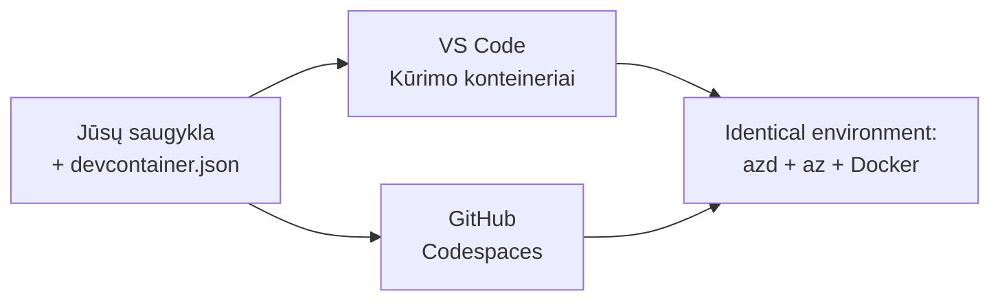

# Dev konteineriai ir GitHub Codespaces azd

**Skyriaus navigacija:**
- **📚 Kurso pradžia**: [AZD pradedantiesiems](../../README.md)
- **📖 Dabartinis skyrius**: 1 skyrius - Pagrindai ir greitas pradėjimas
- **⬅️ Ankstesnis**: [Atsinešk savo programą](bring-your-own-app.md)
- **🚀 Kitas skyrius**: [2 skyrius: AI-pirmoji plėtra](../chapter-02-ai-development/README.md)

> Patikrinta su `azd 1.27.1` 2026 m. liepą.

## Įvadas

Įdiegti azd, tinkamą kalbos vykdymo aplinką, Docker ir Azure CLI kiekviename kompiuteryje yra varginantis darbas – ir tai pagrindinė priežastis, kodėl pamoka, „veikianti mano kompiuteryje“, neveikia kažkam kitam. **Dev konteineris** tai išsprendžia aprašydamas visą įrankių grandinę faile. Kiekvienas, atidaręs projektą VS Code arba GitHub Codespaces, gauna exact tą patį aplinką su jau įdiegtu azd. Ši pamoka parodo, kaip pridėti tokį konteinerį.

## Mokymosi tikslai

Šios pamokos pabaigoje jūs:
- Suprasite, kas yra dev konteineris ir kodėl jis padeda naudojant azd
- Pridėsite minimalų `.devcontainer/devcontainer.json` prie projekto
- Įtrauksite azd, Azure CLI ir Docker per Dev Container *features*
- Atidarysite projektą GitHub Codespaces arba VS Code aplinkoje

## Išmokimo rezultatai

Baigę šią pamoką galėsite:
- Parašyti `devcontainer.json` azd projektui
- Pridėti azd ir Azure įrankius be rankinio diegimo
- Vykdyti `azd up` konteinerio arba Codespace viduje

---

## Kas yra dev konteineris?

Dev konteineris yra Docker pagrindu sukurta vystymo aplinka, aprašyta `.devcontainer/devcontainer.json` faile jūsų repozitorijoje. Atidarius projektą:

- **VS Code** (su Dev Containers plėtiniu) sukuria konteinerį ir prisijungia prie jo.
- **GitHub Codespaces** sukuria tą patį konteinerį debesyje ir suteikia naršyklėje veikiančią redagavimo aplinką.

Bet kuriuo atveju kiekvienas bendradarbis gauna identiškus įrankius — nebereikia klausinėti „ar įdiegėte azd?“.



---

## 1 žingsnis: Sukurkite devcontainer failą

Sukurkite `.devcontainer/devcontainer.json` savo projekto šaknyje:

```json
{
  "name": "azd-project",
  "image": "mcr.microsoft.com/devcontainers/base:bookworm",
  "features": {
    "ghcr.io/devcontainers/features/azure-cli:1": {},
    "ghcr.io/azure/azure-dev/azd:latest": {},
    "ghcr.io/devcontainers/features/docker-in-docker:2": {},
    "ghcr.io/devcontainers/features/node:1": {}
  },
  "customizations": {
    "vscode": {
      "extensions": [
        "ms-azuretools.azure-dev",
        "ms-azuretools.vscode-bicep"
      ]
    }
  },
  "forwardPorts": [3000],
  "postCreateCommand": "azd version"
}
```

Ką daro kiekviena dalis:

| Raktas | Paskirtis |
|-----|---------|
| `image` | Pagrindinė OS konteineriui |
| `features` | Iš anksto paruošti diegėjai — čia: Azure CLI, **azd**, Docker ir Node.js |
| `customizations.vscode.extensions` | Automatiškai įdiegia azd ir Bicep VS Code plėtinius |
| `forwardPorts` | Atskleidžia jūsų programos prievadą naršyklėje |
| `postCreateCommand` | Vykdoma kartą sukūrus konteinerį (čia – patikrinimas) |

> `ghcr.io/azure/azure-dev/azd:latest` funkcija yra oficialus būdas gauti azd konteineryje. Jei reikia atkuriamumo, nurodykite konkrečią versiją (pvz., `azd:1.27.1`).

---

## 2 žingsnis: Parinkite funkciją pagal jūsų programos kalbą

Pakeiskite `node` funkciją į tą, kurią naudoja jūsų programa:

```jsonc
// Python project
"ghcr.io/devcontainers/features/python:1": {},

// .NET project
"ghcr.io/devcontainers/features/dotnet:2": {},

// Java project
"ghcr.io/devcontainers/features/java:1": {},

// Go project
"ghcr.io/devcontainers/features/go:1": {}
```

Palikite `docker-in-docker`, jei jūsų `host` yra `containerapp`, `aks`, ar bet kas, kas stato konteinerio vaizdą — azd reikia Docker vaizdų kūrimui ir leidimui.

---

## 3 žingsnis: Atidarykite jį

**VS Code:**
1. Įdiekite **Dev Containers** plėtinį.
2. Atidarykite projekto aplanką.
3. Paspauskite **Reopen in Container** kai paklaus, arba paleiskite *Dev Containers: Reopen in Container* komandą.

**GitHub Codespaces:**
1. Įkelkite repozitoriją į GitHub.
2. Paspauskite **Code → Codespaces → Create codespace on main**.
3. Palaukite, kol bus sukurtas konteineris – azd bus paruoštas terminale.

---

## 4 žingsnis: Diegimas iš konteinerio viduje

Konteineryje jau įdiegtas azd, tad įprastas darbas vyksta paprastai:

```bash
azd auth login --use-device-code   # įrenginio kodas yra patogus Codespaces viduje
azd up
```

> **Kodėl `--use-device-code`?** Nuotoliniame konteineryje ar Codespace nėra vietinio naršyklės, į kurią būtų galima nukreipti, todėl device-code autentifikacija yra patikimiausia. Jūs įklijuosite kodą į naršyklės kortelę, kad užbaigtumėte prisijungimą.

---

## Dažnos problemos

| Problema | Sprendimas |
|---------|-----------|
| `azd up` negali sukurti vaizdo | Pridėkite `docker-in-docker` funkciją |
| Naršyklės prisijungimas stringa Codespaces | Naudokite `azd auth login --use-device-code` |
| Įrankiai skiriasi tarp komandų narių | Užrakinkite funkcijų versijas (pvz., `azd:1.27.1`) |
| Programa nepasiekiama naršyklėje | Pridėkite prievadą prie `forwardPorts` |

---

## Santrauka

- Dev konteineris leidžia visiems turėti atkuriamą azd įrankių grandinę.
- Pridėkite azd, Azure CLI ir Docker per Dev Container *features*.
- Suderinkite kalbos funkciją su programa ir išlaikykite `docker-in-docker` konteinerių šeimininkams.
- Naudokite device-code prisijungimą, kai veikiate Codespaces.

---

## 🔗 Navigacija

| Kryptis | Šaltinis |
|--------|----------|
| **Ankstesnis** | [Atsinešk savo programą](bring-your-own-app.md) |
| **Skyriaus pradžia** | [1 skyrius: Pagrindai ir greitas pradėjimas](README.md) |
| **Kitas skyrius** | [2 skyrius: AI-pirmoji plėtra](../chapter-02-ai-development/README.md) |

## 📖 Susiję ištekliai

- [Įdiegimas ir nustatymas](installation.md)
- [Komandų atmintinė](../../resources/cheat-sheet.md)
- [Oficialūs Dev Containers specifikacija](https://containers.dev/)
- [azd Dev Container funkcija](https://github.com/Azure/azure-dev/tree/main/ext/devcontainer)

---

<!-- CO-OP TRANSLATOR DISCLAIMER START -->
**Atsakomybės apribojimas**:
Šis dokumentas buvo išverstas naudojant dirbtinio intelekto vertimo paslaugą [Co-op Translator](https://github.com/Azure/co-op-translator). Nors siekiame tikslumo, prašome atkreipti dėmesį, kad automatiniai vertimai gali turėti klaidų ar netikslumų. Originalus dokumentas jo gimtąja kalba laikomas autoritetingu šaltiniu. Svarbiai informacijai rekomenduojama naudoti profesionalų žmogiškąjį vertimą. Mes neatsakome už jokius nesusipratimus ar neteisingą interpretaciją, kilusią naudojantis šiuo vertimu.
<!-- CO-OP TRANSLATOR DISCLAIMER END -->